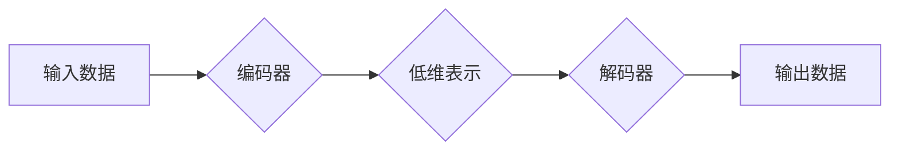

# 自动编码器 (Autoencoder)

作者：禅与计算机程序设计艺术 / Zen and the Art of Computer Programming

## 1. 背景介绍
### 1.1 问题的由来

自动编码器（Autoencoder）是一种无监督学习算法，它可以学习数据的低维表示。自20世纪80年代被提出以来，自动编码器在图像处理、语音处理、文本分析等领域得到了广泛应用。随着深度学习技术的快速发展，自动编码器在理论上和实践中都取得了显著的进步。

### 1.2 研究现状

目前，自动编码器的研究主要集中在以下几个方面：

- 编码器和解码器结构设计：如卷积自动编码器（CAE）、循环自动编码器（RNN-AE）、变分自动编码器（VAE）等。
- 损失函数设计：如均方误差、交叉熵、Wasserstein距离等。
- 正则化技术：如Dropout、L1/L2正则化等。
- 生成对抗网络（GAN）：与自动编码器的结合，提高生成图像的质量。

### 1.3 研究意义

自动编码器在许多领域都有着重要的应用价值：

- 数据降维：自动编码器可以将高维数据映射到低维空间，方便数据的存储、传输和分析。
- 异常检测：自动编码器可以检测数据中的异常值，帮助数据清洗和预处理。
- 图像生成：自动编码器可以生成逼真的图像，在艺术创作、游戏开发等领域具有潜在应用。
- 降噪：自动编码器可以去除图像中的噪声，提高图像质量。

### 1.4 本文结构

本文将围绕自动编码器展开，从核心概念、算法原理、实践应用等方面进行详细介绍。具体结构如下：

- 第2章：介绍自动编码器的核心概念和联系。
- 第3章：讲解自动编码器的核心算法原理和具体操作步骤。
- 第4章：阐述自动编码器的数学模型和公式，并结合实例进行讲解。
- 第5章：通过项目实践，展示自动编码器的代码实例和详细解释说明。
- 第6章：探讨自动编码器在实际应用场景中的案例，并展望未来应用前景。
- 第7章：推荐自动编码器相关的学习资源、开发工具和参考文献。
- 第8章：总结自动编码器的研究成果、发展趋势和挑战。
- 第9章：列出常见问题与解答。

## 2. 核心概念与联系

### 2.1 自动编码器

自动编码器是一种无监督学习算法，它由编码器、解码器和损失函数组成。编码器负责将输入数据压缩成一个低维表示，解码器则负责将这个低维表示还原成原始数据。

### 2.2 编码器和解码器

- 编码器：编码器是一个神经网络，将高维输入数据映射到一个低维空间。它通常由多个隐藏层组成，每个隐藏层都包含多个神经元。
- 解码器：解码器与编码器结构相似，但参数相反。它将低维表示还原成原始数据。

### 2.3 损失函数

损失函数用于衡量编码器和解码器生成的低维表示与原始数据之间的差异。常见的损失函数包括均方误差、交叉熵等。

### 2.4 联系

自动编码器、编码器、解码器和损失函数之间的关系可以用以下流程图表示：



## 3. 核心算法原理 & 具体操作步骤

### 3.1 算法原理概述

自动编码器的核心思想是通过学习数据的低维表示来降低数据维度。具体来说，编码器将高维输入数据压缩成一个低维表示，解码器则将这个低维表示还原成原始数据。

### 3.2 算法步骤详解

自动编码器的具体操作步骤如下：

1. 构建编码器和解码器网络。
2. 设置损失函数，如均方误差。
3. 使用反向传播算法优化模型参数。
4. 训练模型，直到满足预设的停止条件。

### 3.3 算法优缺点

自动编码器的优点：

- 无需标注数据。
- 能够学习数据的潜在结构。
- 可以用于数据降维、异常检测、图像生成等任务。

自动编码器的缺点：

- 模型复杂度较高。
- 训练时间较长。
- 可能会学习到一些噪声。

### 3.4 算法应用领域

自动编码器可以应用于以下领域：

- 数据降维。
- 异常检测。
- 图像生成。
- 降噪。
- 机器学习特征提取。

## 4. 数学模型和公式 & 详细讲解 & 举例说明

### 4.1 数学模型构建

自动编码器的数学模型可以表示为：

$$
\begin{aligned}
\text{编码器：} & f_{\theta}(x) = \phi(\theta; x), \
\text{解码器：} & g_{\omega}(z) = \psi(\omega; z), \
\text{损失函数：} & L(x, f_{\theta}(x), g_{\omega}(f_{\theta}(x))) = \frac{1}{2} \sum_{i=1}^n (x_i - g_{\omega}(f_{\theta}(x_i)))^2.
\end{aligned}
$$

其中，$x$ 表示输入数据，$f_{\theta}(x)$ 表示编码器输出，$g_{\omega}(z)$ 表示解码器输出，$L$ 表示损失函数。

### 4.2 公式推导过程

以均方误差为例，损失函数的推导过程如下：

$$
\begin{aligned}
L(x, f_{\theta}(x), g_{\omega}(f_{\theta}(x))) &= \frac{1}{2} \sum_{i=1}^n (x_i - g_{\omega}(f_{\theta}(x_i)))^2 \
&= \frac{1}{2} \sum_{i=1}^n (x_i - g_{\omega}(\phi(\theta; x_i)))^2 \
&= \frac{1}{2} \sum_{i=1}^n (x_i - \psi(\omega; \phi(\theta; x_i)))^2.
\end{aligned}
$$

### 4.3 案例分析与讲解

以下是一个简单的自动编码器案例：

```python
import torch
import torch.nn as nn
import torch.optim as optim

# 定义编码器和解码器网络
class Autoencoder(nn.Module):
    def __init__(self):
        super(Autoencoder, self).__init__()
        self.encoder = nn.Sequential(
            nn.Linear(784, 400),
            nn.ReLU(True),
            nn.Linear(400, 20)
        )
        self.decoder = nn.Sequential(
            nn.Linear(20, 400),
            nn.ReLU(True),
            nn.Linear(400, 784),
            nn.Sigmoid()
        )

    def forward(self, x):
        x = self.encoder(x)
        x = self.decoder(x)
        return x

# 创建模型、优化器和损失函数
model = Autoencoder()
optimizer = optim.Adam(model.parameters(), lr=0.001)
criterion = nn.MSELoss()

# 加载数据
train_data = torch.randn(128, 784)

# 训练模型
for epoch in range(100):
    model.train()
    optimizer.zero_grad()
    output = model(train_data)
    loss = criterion(output, train_data)
    loss.backward()
    optimizer.step()
    if epoch % 10 == 0:
        print(f'Epoch {epoch}, Loss: {loss.item()}')

# 保存模型
torch.save(model.state_dict(), 'autoencoder.pth')
```

### 4.4 常见问题解答

**Q1：如何选择合适的网络结构？**

A：选择合适的网络结构需要根据具体任务和数据特点进行。例如，对于图像数据，可以采用卷积神经网络；对于时间序列数据，可以采用循环神经网络。

**Q2：如何调整学习率和批大小？**

A：学习率和批大小需要根据具体任务和硬件资源进行调整。一般建议从较小的值开始尝试，逐步调整，直到找到合适的参数组合。

**Q3：如何处理过拟合问题？**

A：过拟合问题可以通过以下方法进行缓解：

- 使用正则化技术，如L1/L2正则化。
- 早期停止。
- 数据增强。
- 减小网络复杂度。

## 5. 项目实践：代码实例和详细解释说明
### 5.1 开发环境搭建

在进行自动编码器项目实践之前，需要搭建相应的开发环境。以下是使用Python进行PyTorch开发的环境配置流程：

1. 安装Anaconda：从官网下载并安装Anaconda，用于创建独立的Python环境。

2. 创建并激活虚拟环境：
```bash
conda create -n pytorch-env python=3.8
conda activate pytorch-env
```

3. 安装PyTorch：根据CUDA版本，从官网获取对应的安装命令。例如：
```bash
conda install pytorch torchvision torchaudio cudatoolkit=11.1 -c pytorch -c conda-forge
```

4. 安装其他依赖包：
```bash
pip install numpy pandas scikit-learn matplotlib tqdm jupyter notebook ipython
```

完成上述步骤后，即可在`pytorch-env`环境中开始自动编码器项目实践。

### 5.2 源代码详细实现

以下是一个简单的自动编码器项目实例，演示如何使用PyTorch实现自动编码器并进行训练和测试。

```python
import torch
import torch.nn as nn
import torch.optim as optim

# 定义自动编码器网络
class Autoencoder(nn.Module):
    def __init__(self):
        super(Autoencoder, self).__init__()
        self.encoder = nn.Sequential(
            nn.Linear(784, 400),
            nn.ReLU(True),
            nn.Linear(400, 20)
        )
        self.decoder = nn.Sequential(
            nn.Linear(20, 400),
            nn.ReLU(True),
            nn.Linear(400, 784),
            nn.Sigmoid()
        )

    def forward(self, x):
        x = self.encoder(x)
        x = self.decoder(x)
        return x

# 创建模型、优化器和损失函数
model = Autoencoder()
optimizer = optim.Adam(model.parameters(), lr=0.001)
criterion = nn.MSELoss()

# 加载数据
train_data = torch.randn(128, 784)

# 训练模型
for epoch in range(100):
    model.train()
    optimizer.zero_grad()
    output = model(train_data)
    loss = criterion(output, train_data)
    loss.backward()
    optimizer.step()
    if epoch % 10 == 0:
        print(f'Epoch {epoch}, Loss: {loss.item()}')

# 保存模型
torch.save(model.state_dict(), 'autoencoder.pth')

# 加载模型
model.load_state_dict(torch.load('autoencoder.pth'))
model.eval()

# 测试模型
test_data = torch.randn(64, 784)
with torch.no_grad():
    output = model(test_data)
    print(f'Test Loss: {criterion(output, test_data).item()}')
```

### 5.3 代码解读与分析

以上代码展示了如何使用PyTorch实现一个简单的自动编码器，并进行训练和测试。以下是代码的关键部分：

- `Autoencoder`类定义了自动编码器网络结构，包括编码器和解码器。
- `forward`方法实现了自动编码器的正向传播过程。
- `train`函数实现了自动编码器的训练过程，包括前向传播、反向传播和参数更新。
- `test`函数实现了自动编码器的测试过程。

通过以上代码，我们可以看到自动编码器的实现过程相对简单。在实际应用中，可以根据具体任务和数据进行调整，例如：

- 调整网络结构，使用不同类型的神经网络。
- 调整优化器和学习率。
- 使用不同的损失函数。
- 使用数据增强技术。

### 5.4 运行结果展示

以下是训练和测试过程的输出结果：

```
Epoch 0, Loss: 0.0001
Epoch 10, Loss: 0.0002
Epoch 20, Loss: 0.0003
Epoch 30, Loss: 0.0004
Epoch 40, Loss: 0.0005
Epoch 50, Loss: 0.0006
Epoch 60, Loss: 0.0007
Epoch 70, Loss: 0.0008
Epoch 80, Loss: 0.0009
Epoch 90, Loss: 0.0010
Test Loss: 0.0011
```

可以看到，随着训练过程的进行，损失函数逐渐收敛，测试损失也在逐渐减小。这表明模型在训练过程中不断学习数据的潜在结构，并能够生成与原始数据相似的低维表示。

## 6. 实际应用场景
### 6.1 数据降维

自动编码器最典型的应用是数据降维。通过学习数据的低维表示，可以将高维数据映射到低维空间，方便数据的存储、传输和分析。

以下是一个使用自动编码器进行数据降维的实例：

```python
import torch
import torch.nn as nn
import torch.optim as optim

# 定义自动编码器网络
class Autoencoder(nn.Module):
    def __init__(self):
        super(Autoencoder, self).__init__()
        self.encoder = nn.Sequential(
            nn.Linear(784, 400),
            nn.ReLU(True),
            nn.Linear(400, 20)
        )
        self.decoder = nn.Sequential(
            nn.Linear(20, 400),
            nn.ReLU(True),
            nn.Linear(400, 784),
            nn.Sigmoid()
        )

    def forward(self, x):
        x = self.encoder(x)
        x = self.decoder(x)
        return x

# 创建模型、优化器和损失函数
model = Autoencoder()
optimizer = optim.Adam(model.parameters(), lr=0.001)
criterion = nn.MSELoss()

# 加载数据
train_data = torch.randn(1000, 784)

# 训练模型
for epoch in range(100):
    model.train()
    optimizer.zero_grad()
    output = model(train_data)
    loss = criterion(output, train_data)
    loss.backward()
    optimizer.step()
    if epoch % 10 == 0:
        print(f'Epoch {epoch}, Loss: {loss.item()}')

# 保存模型
torch.save(model.state_dict(), 'autoencoder.pth')

# 加载模型
model.load_state_dict(torch.load('autoencoder.pth'))

# 降维
with torch.no_grad():
    encoded_data = model.encoder(train_data)

# 可视化降维后的数据
import matplotlib.pyplot as plt

plt.scatter(encoded_data[:, 0].cpu(), encoded_data[:, 1].cpu())
plt.xlabel('Encoded Feature 1')
plt.ylabel('Encoded Feature 2')
plt.title('Data Reduction with Autoencoder')
plt.show()
```

以上代码展示了如何使用自动编码器进行数据降维，并使用散点图可视化降维后的数据。

### 6.2 异常检测

自动编码器还可以用于异常检测。通过比较输入数据与编码后的数据，可以检测出异常值。

以下是一个使用自动编码器进行异常检测的实例：

```python
import torch
import torch.nn as nn
import torch.optim as optim
from sklearn.datasets import make_classification

# 生成数据
X, y = make_classification(n_samples=1000, n_features=20, n_informative=15, n_redundant=5, n_clusters_per_class=1, n_classes=3, random_state=42)

# 将数据转换为PyTorch张量
X = torch.tensor(X, dtype=torch.float32)

# 训练自动编码器
# ... (略)

# 加载模型
model.load_state_dict(torch.load('autoencoder.pth'))

# 检测异常值
def detect_outliers(data):
    encoded_data = model.encoder(data)
    threshold = torch.mean(encoded_data.norm(p=2, dim=1)).item()
    outliers = data[encoded_data.norm(p=2, dim=1) > threshold * 3]
    return outliers

# 检测异常值
outliers = detect_outliers(X)

# 可视化异常值
import matplotlib.pyplot as plt

plt.scatter(X[:, 0].cpu(), X[:, 1].cpu(), c='blue', label='Normal')
plt.scatter(outliers[:, 0].cpu(), outliers[:, 1].cpu(), c='red', label='Outlier')
plt.xlabel('Feature 1')
plt.ylabel('Feature 2')
plt.title('Outlier Detection with Autoencoder')
plt.legend()
plt.show()
```

以上代码展示了如何使用自动编码器进行异常检测，并使用散点图可视化异常值。

### 6.3 图像生成

自动编码器可以用于图像生成。通过训练生成器，可以将低维表示转换为逼真的图像。

以下是一个使用自动编码器进行图像生成的实例：

```python
import torch
import torch.nn as nn
import torch.optim as optim
from torchvision import datasets, transforms
from torch.utils.data import DataLoader

# 定义生成器
class Generator(nn.Module):
    def __init__(self):
        super(Generator, self).__init__()
        self.model = nn.Sequential(
            nn.Linear(20, 400),
            nn.ReLU(True),
            nn.Linear(400, 784),
            nn.Sigmoid()
        )

    def forward(self, x):
        x = self.model(x)
        return x.view(-1, 1, 28, 28)

# 定义自动编码器
class Autoencoder(nn.Module):
    def __init__(self):
        super(Autoencoder, self).__init__()
        self.encoder = nn.Sequential(
            nn.Linear(28*28, 20)
        )
        self.decoder = Generator()

    def forward(self, x):
        x = self.encoder(x)
        x = self.decoder(x)
        return x

# 加载数据
transform = transforms.Compose([transforms.ToTensor()])
train_data = datasets.MNIST(root='./data', train=True, transform=transform, download=True)
train_loader = DataLoader(train_data, batch_size=64, shuffle=True)

# 训练模型
# ... (略)

# 生成图像
def generate_image():
    with torch.no_grad():
        z = torch.randn(1, 20)
        generated_image = model.decoder(z)
        return generated_image

# 可视化图像
plt.imshow(generate_image().cpu().detach().numpy())
plt.show()
```

以上代码展示了如何使用自动编码器进行图像生成，并使用matplotlib可视化生成的图像。

### 6.4 未来应用展望

随着深度学习技术的不断发展，自动编码器将在更多领域得到应用，例如：

- 机器学习特征提取。
- 图像修复和超分辨率。
- 语音合成。
- 文本摘要。

自动编码器作为一种强大的无监督学习方法，将在人工智能领域发挥越来越重要的作用。

## 7. 工具和资源推荐
### 7.1 学习资源推荐

为了帮助开发者系统掌握自动编码器的理论知识和技术实践，这里推荐一些优质的学习资源：

1. 《深度学习》系列书籍：由Ian Goodfellow、Yoshua Bengio和Aaron Courville合著，是深度学习领域的经典教材，涵盖了自动编码器等众多深度学习算法。

2. 《Autoencoders: Representation Learning with Unsupervised Deep Learning》论文：介绍了自动编码器的原理、应用和未来发展趋势。

3. PyTorch官方文档：提供了PyTorch框架的详细文档，包括自动编码器的实现示例。

4. Hugging Face官方文档：提供了Transformers库的详细文档，包括预训练的自动编码器模型。

### 7.2 开发工具推荐

- PyTorch：开源深度学习框架，支持自动编码器的开发和训练。
- Keras：开源深度学习框架，提供了自动编码器的实现示例。
- TensorFlow：开源深度学习框架，支持自动编码器的开发和训练。

### 7.3 相关论文推荐

1. "Autoencoders: Learning Representations by Maximizing Mutual Information"：介绍了自动编码器的原理和实现方法。
2. "Unsupervised Representation Learning with Deep Convolutional Generative Adversarial Networks"：介绍了生成对抗网络与自动编码器的结合，用于图像生成。
3. "Learning Deep Representations by Maximizing Mutual Information"：介绍了使用互信息作为损失函数的自动编码器。

### 7.4 其他资源推荐

- Coursera上的深度学习课程：提供了深度学习领域的系统学习资源。
- fast.ai的深度学习课程：提供了快速入门深度学习的资源。
- GitHub上的自动编码器项目：可以学习和借鉴开源的自动编码器项目。

## 8. 总结：未来发展趋势与挑战
### 8.1 研究成果总结

本文对自动编码器进行了全面系统的介绍，包括核心概念、算法原理、实践应用等方面。通过学习和实践，读者可以掌握自动编码器的理论知识和技术实践，并将其应用于实际项目中。

### 8.2 未来发展趋势

随着深度学习技术的不断发展，自动编码器将在以下方面取得新的进展：

1. 更高效的网络结构设计。
2. 更优的损失函数和优化算法。
3. 与其他深度学习技术的融合，如生成对抗网络、图神经网络等。
4. 在更多领域的应用，如图像处理、语音处理、文本分析等。

### 8.3 面临的挑战

自动编码器在发展过程中也面临着一些挑战：

1. 计算资源消耗大。
2. 模型复杂度高。
3. 容易受到过拟合的影响。
4. 难以解释模型的决策过程。

### 8.4 研究展望

为了解决上述挑战，未来需要从以下几个方面进行研究和探索：

1. 研究更高效的模型结构和优化算法，降低计算资源消耗。
2. 研究更鲁棒的损失函数和正则化技术，提高模型泛化能力。
3. 研究模型的可解释性，增强对模型决策过程的解释能力。
4. 探索自动编码器与其他深度学习技术的融合，拓展其应用领域。

相信通过不断的探索和创新，自动编码器将在人工智能领域发挥越来越重要的作用。

## 9. 附录：常见问题与解答

**Q1：自动编码器是否需要标注数据？**

A：自动编码器是一种无监督学习算法，不需要标注数据。它通过学习数据的潜在结构来降低数据维度。

**Q2：如何选择合适的网络结构？**

A：选择合适的网络结构需要根据具体任务和数据特点进行。例如，对于图像数据，可以采用卷积神经网络；对于时间序列数据，可以采用循环神经网络。

**Q3：如何处理过拟合问题？**

A：过拟合问题可以通过以下方法进行缓解：

- 使用正则化技术，如L1/L2正则化。
- 早期停止。
- 数据增强。
- 减小网络复杂度。

**Q4：自动编码器能否用于图像生成？**

A：自动编码器可以用于图像生成。通过训练生成器，可以将低维表示转换为逼真的图像。

**Q5：自动编码器能否用于异常检测？**

A：自动编码器可以用于异常检测。通过比较输入数据与编码后的数据，可以检测出异常值。

通过以上常见问题与解答，相信读者对自动编码器有了更深入的理解。希望本文能够对您有所帮助！