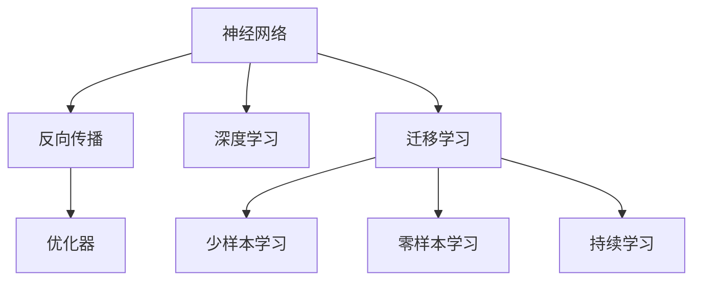
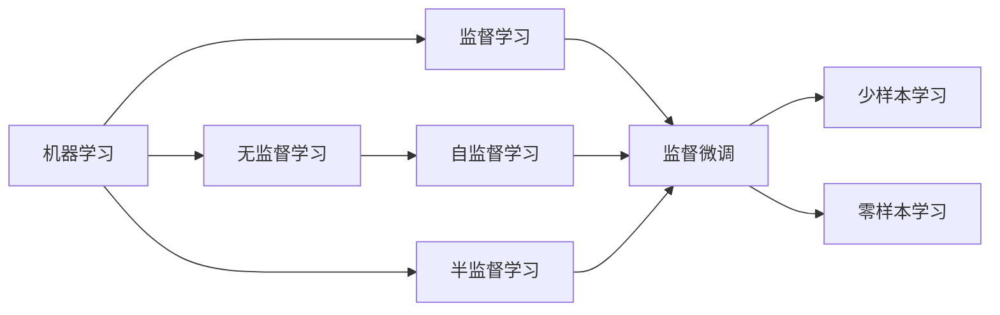
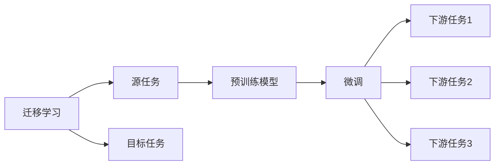
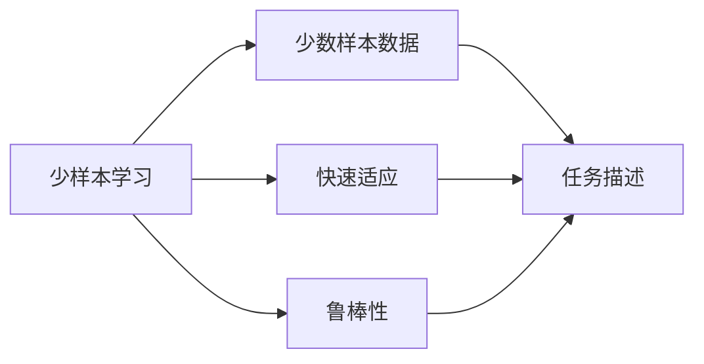
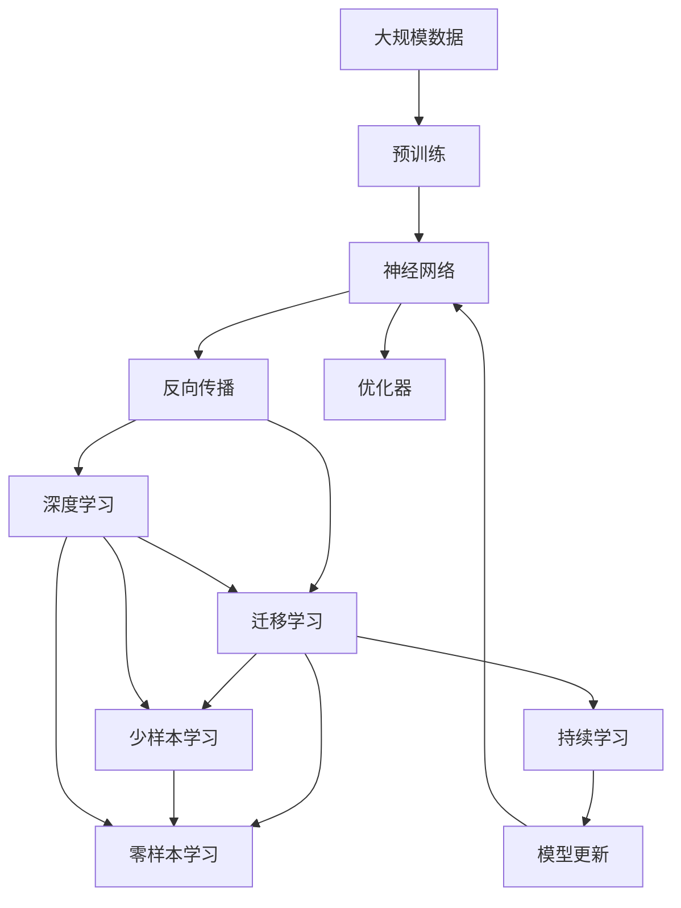

                 

# AI人工智能核心算法原理与代码实例讲解：机器思维

> 关键词：机器学习,深度学习,人工智能,算法原理,代码实例,机器思维

## 1. 背景介绍

### 1.1 问题由来
随着人工智能技术的飞速发展，机器思维这一概念逐渐引起了广泛关注。机器思维是指通过算法和计算模型，使计算机系统能够像人类一样理解和处理自然语言、图像、声音等多种信息形式，并根据这些信息进行推理、决策和交互。它是人工智能的核心组成部分，在智能客服、医疗诊断、金融预测、自动驾驶等领域有广泛的应用。

机器思维的核心是算法和模型，其中算法设计是实现机器思维的关键。本文将深入探讨机器思维中的核心算法原理，并通过代码实例对其实现细节进行讲解。

### 1.2 问题核心关键点
机器思维的算法设计可以分为两个主要阶段：预训练和微调。预训练阶段，使用大规模无标签数据训练模型，学习通用的语言或图像表示；微调阶段，使用任务相关的标注数据，对预训练模型进行优化，使其适应具体任务。这一过程类似于人类学习新知识的过程，先学习通用的知识，再根据特定情境进行应用。

预训练和微调的主要目的是提高模型的泛化能力，即在未见过的数据上也能取得较好的表现。预训练和微调中的核心算法包括神经网络、反向传播算法、优化器等，这些算法在机器思维中扮演着至关重要的角色。

### 1.3 问题研究意义
研究机器思维中的核心算法原理，对于推进人工智能技术的发展具有重要意义：

1. **降低应用成本**：预训练模型可以在大规模数据上学习到丰富的知识，从而减少了从头开发所需的时间和成本。
2. **提升模型效果**：通过微调，模型可以在特定任务上取得更好的效果，满足实际应用需求。
3. **加速开发进度**：预训练模型和微调技术使得开发者可以快速实现应用适配，缩短开发周期。
4. **带来技术创新**：预训练和微调技术促进了对机器思维的理解，催生了新的研究方向，如提示学习、少样本学习等。
5. **赋能产业升级**：机器思维技术可以赋能各行各业，提升生产效率和管理水平，推动数字化转型。

## 2. 核心概念与联系

### 2.1 核心概念概述

为更好地理解机器思维中的核心算法，本节将介绍几个密切相关的核心概念：

- **神经网络(Neural Network)**：由多层神经元组成的计算模型，通过学习数据分布进行信息处理和模式识别。神经网络是机器学习的基础，广泛应用于图像、语音、自然语言处理等领域。

- **反向传播算法(Backpropagation)**：用于训练神经网络的算法，通过梯度下降等优化算法，最小化损失函数，更新模型参数。反向传播算法是深度学习中的关键技术。

- **优化器(Optimizer)**：用于更新模型参数的算法，如Adam、SGD等。优化器通过控制学习率和步长，调整参数更新策略，提高模型训练效率和稳定性。

- **深度学习(Deep Learning)**：基于神经网络的机器学习技术，通过多层次的非线性变换，提取复杂数据的高级特征。深度学习在图像识别、语音识别、自然语言处理等领域取得了显著成果。

- **迁移学习(Transfer Learning)**：将一个领域学习到的知识迁移到另一个领域，用于新任务的训练。迁移学习通过预训练模型，加速了新任务的训练过程，提高了模型泛化能力。

- **少样本学习(Few-shot Learning)**：使用少量标注数据进行模型训练，使得模型能够快速适应新任务。少样本学习在数据资源有限的场景中具有重要应用价值。

- **零样本学习(Zero-shot Learning)**：在未见过的数据上，通过预训练模型进行推理，无需额外的训练样本。零样本学习在无法获取足够标注数据的情景下，具有重要意义。

- **持续学习(Continual Learning)**：模型能够持续从新数据中学习，同时保持已学习的知识，避免灾难性遗忘。持续学习是实现终身学习的关键。

这些核心概念之间的逻辑关系可以通过以下Mermaid流程图来展示：



这个流程图展示了大规模机器思维模型中的核心概念及其之间的关系：

1. 神经网络作为基础模型，通过反向传播和优化器进行训练。
2. 深度学习通过多层神经网络，提取高级特征。
3. 迁移学习通过预训练模型，加速新任务的训练。
4. 少样本学习和零样本学习在数据资源有限的情况下，提高模型性能。
5. 持续学习保持模型知识更新，避免遗忘旧知识。

这些概念共同构成了机器思维模型的学习和应用框架，使其能够有效地处理和理解各种信息。

### 2.2 概念间的关系

这些核心概念之间存在着紧密的联系，形成了机器思维模型的完整生态系统。下面我们通过几个Mermaid流程图来展示这些概念之间的关系。

#### 2.2.1 机器学习范式



这个流程图展示了大规模机器学习中常见的学习范式，包括监督学习、无监督学习、半监督学习等。这些范式在实际应用中各有优缺点，需要根据具体情况选择合适的方法。

#### 2.2.2 迁移学习与微调的关系



这个流程图展示了迁移学习的基本原理，以及它与微调的关系。迁移学习涉及源任务和目标任务，预训练模型在源任务上学习，然后通过微调适应各种下游任务（目标任务）。

#### 2.2.3 少样本学习与零样本学习



这个流程图展示了少样本学习和零样本学习的基本原理，即通过任务描述引导模型进行推理，无需额外训练样本。

### 2.3 核心概念的整体架构

最后，我们用一个综合的流程图来展示这些核心概念在大规模机器思维模型中的整体架构：



这个综合流程图展示了从预训练到微调，再到持续学习的完整过程。神经网络通过反向传播和优化器进行训练，深度学习通过多层神经网络提取特征，迁移学习通过预训练模型加速新任务训练，少样本学习和零样本学习在数据资源有限的情况下提高模型性能，持续学习保持模型知识更新，避免遗忘旧知识。 通过这些流程图，我们可以更清晰地理解机器思维模型中的各个核心概念的关系和作用，为后续深入讨论具体的算法和实现细节奠定基础。

## 3. 核心算法原理 & 具体操作步骤
### 3.1 算法原理概述

机器思维的核心算法包括神经网络、反向传播和优化器等。下面我们逐一介绍这些算法的原理。

#### 3.1.1 神经网络

神经网络由多层神经元组成，每一层神经元接收来自上一层的输入，通过一系列非线性变换，输出到下一层。神经网络的输出层通常用于分类或回归任务，中间层用于提取特征。

神经网络的基本结构包括输入层、隐藏层和输出层。其中，输入层接收原始数据，隐藏层进行特征提取和计算，输出层输出最终的分类或回归结果。

#### 3.1.2 反向传播算法

反向传播算法是用于训练神经网络的算法，通过梯度下降等优化算法，最小化损失函数，更新模型参数。其核心思想是通过链式法则，反向传播误差信号，计算各层参数的梯度，从而更新模型参数。

具体步骤如下：

1. 前向传播：输入数据通过神经网络，计算每个神经元的输出。
2. 计算损失：将神经网络的输出与真实标签进行比较，计算损失函数。
3. 反向传播误差：从输出层开始，反向传播误差信号，计算各层梯度。
4. 更新参数：使用梯度下降等优化算法，更新模型参数。

反向传播算法是深度学习中的关键技术，广泛应用于各种机器思维任务中。

#### 3.1.3 优化器

优化器用于更新模型参数，如Adam、SGD等。优化器通过控制学习率和步长，调整参数更新策略，提高模型训练效率和稳定性。

Adam优化器结合了动量法和自适应学习率的优点，在训练过程中自适应调整每个参数的学习率，并根据历史梯度信息调整动量，从而更好地适应不同的数据分布。

### 3.2 算法步骤详解

机器思维中的核心算法步骤包括数据预处理、模型训练、模型评估和模型应用等。下面我们逐一介绍这些步骤。

#### 3.2.1 数据预处理

数据预处理是机器思维中至关重要的一步，主要包括以下几个方面：

1. **数据清洗**：去除噪声数据和异常值，确保数据质量。
2. **数据标准化**：将数据标准化到相同的分布，便于模型训练。
3. **特征提取**：将原始数据转换为模型可以处理的形式，如图像像素、文本词向量等。
4. **数据增强**：通过旋转、缩放、翻转等方式扩充训练集，增加数据多样性。

#### 3.2.2 模型训练

模型训练是机器思维中的核心步骤，主要包括以下几个方面：

1. **选择合适的模型**：根据任务类型选择合适的神经网络结构。
2. **初始化参数**：使用随机初始化或预训练模型初始化模型参数。
3. **训练过程**：通过反向传播算法和优化器，最小化损失函数，更新模型参数。
4. **参数调整**：根据模型性能和训练情况，调整学习率、批大小、迭代轮数等。

#### 3.2.3 模型评估

模型评估是机器思维中的重要步骤，主要包括以下几个方面：

1. **划分数据集**：将数据集划分为训练集、验证集和测试集。
2. **选择评估指标**：根据任务类型选择合适的评估指标，如准确率、召回率、F1分数等。
3. **评估模型**：在验证集和测试集上评估模型性能，比较不同模型的效果。
4. **参数优化**：根据评估结果，调整模型参数，优化模型性能。

#### 3.2.4 模型应用

模型应用是机器思维中的最后一步，主要包括以下几个方面：

1. **数据输入**：将新的数据输入模型，进行推理或预测。
2. **输出结果**：根据模型的输出结果，进行后续处理或展示。
3. **模型部署**：将模型部署到生产环境中，进行实际应用。

### 3.3 算法优缺点

机器思维中的核心算法具有以下优点：

1. **适应性强**：神经网络能够适应复杂的非线性关系，适应各种任务类型。
2. **泛化能力强**：通过反向传播和优化器，神经网络能够在大规模数据上学习到丰富的特征，提高模型泛化能力。
3. **可解释性好**：通过可视化神经网络结构，了解模型的内部机制，提高模型的可解释性。
4. **应用广泛**：神经网络在图像识别、语音识别、自然语言处理等领域有广泛应用。

同时，这些算法也存在一些缺点：

1. **训练时间长**：神经网络需要大量数据和计算资源进行训练，训练时间较长。
2. **模型复杂度高**：神经网络结构复杂，模型参数较多，容易出现过拟合问题。
3. **需要大量标注数据**：神经网络需要大量标注数据进行训练，标注数据获取成本较高。
4. **依赖超参数**：神经网络的性能依赖于超参数的选择，超参数调优较为复杂。

尽管存在这些局限性，但就目前而言，神经网络和反向传播算法仍是机器思维中的主流技术，具有广泛的应用前景。未来相关研究的重点在于如何进一步降低训练成本，提高模型泛化能力，同时兼顾模型的可解释性和鲁棒性。

### 3.4 算法应用领域

机器思维中的核心算法广泛应用于各种领域，包括但不限于：

- **计算机视觉**：通过神经网络进行图像识别、目标检测、图像生成等任务。
- **自然语言处理**：通过神经网络进行文本分类、情感分析、机器翻译等任务。
- **语音识别**：通过神经网络进行语音识别、语音合成等任务。
- **推荐系统**：通过神经网络进行用户画像构建、推荐结果排序等任务。
- **金融预测**：通过神经网络进行股票价格预测、信用风险评估等任务。
- **医疗诊断**：通过神经网络进行疾病诊断、医学图像分析等任务。

这些领域中的机器思维应用，使得机器能够像人类一样理解和处理复杂信息，提高了工作效率和生活质量。

## 4. 数学模型和公式 & 详细讲解  
### 4.1 数学模型构建

在机器思维中，神经网络通常用于处理图像、文本、语音等多种类型的数据。以文本分类任务为例，神经网络可以表示为：

$$
\begin{aligned}
&\text{Input Layer} \rightarrow \text{Hidden Layer} \rightarrow \text{Output Layer} \\
&\text{Input} \rightarrow \text{Convolutional Layer} \rightarrow \text{Max Pooling Layer} \rightarrow \cdots \rightarrow \text{Softmax Layer} \rightarrow \text{Label}
\end{aligned}
$$

其中，输入层接收文本数据，通过卷积层和池化层进行特征提取，隐藏层进行特征计算，输出层进行分类。

### 4.2 公式推导过程

在文本分类任务中，神经网络的输出层通常使用Softmax函数，其公式为：

$$
\text{Softmax}(x_i) = \frac{e^{x_i}}{\sum_{j=1}^{K}e^{x_j}}
$$

其中，$x_i$为神经网络输出层中第$i$个神经元的输出值，$K$为输出层的神经元个数。Softmax函数将输出转换为概率分布，便于进行分类。

在训练过程中，神经网络的损失函数通常使用交叉熵损失函数，其公式为：

$$
\mathcal{L} = -\frac{1}{N} \sum_{i=1}^{N} \sum_{j=1}^{K} y_{i,j} \log \sigma(x_{i,j})
$$

其中，$N$为训练样本数，$y_{i,j}$为第$i$个样本的第$j$个分类的真实标签，$\sigma$为神经网络的输出值，$\log$为自然对数。

通过反向传播算法，计算梯度，更新神经网络参数。具体步骤如下：

1. 前向传播：输入数据通过神经网络，计算每个神经元的输出。
2. 计算损失：将神经网络的输出与真实标签进行比较，计算交叉熵损失函数。
3. 反向传播误差：从输出层开始，反向传播误差信号，计算各层梯度。
4. 更新参数：使用梯度下降等优化算法，更新模型参数。

### 4.3 案例分析与讲解

下面以一个简单的图像分类任务为例，展示神经网络的基本训练过程。

假设我们有一个包含猫和狗的图像数据集，其中猫和狗的比例为1:1。我们将使用LeNet网络进行训练，LeNet是一种经典的卷积神经网络，其结构如下：

$$
\begin{aligned}
&\text{Input Layer} \rightarrow \text{Convolutional Layer} \rightarrow \text{Max Pooling Layer} \rightarrow \text{Convolutional Layer} \rightarrow \text{Max Pooling Layer} \rightarrow \text{Flatten Layer} \rightarrow \text{Hidden Layer} \rightarrow \text{Softmax Layer} \rightarrow \text{Label}
\end{aligned}
$$

1. **数据预处理**：将图像数据标准化到[0,1]区间，并进行归一化处理。
2. **初始化参数**：使用随机初始化LeNet网络中的参数。
3. **训练过程**：
   - 前向传播：将图像数据输入LeNet网络，计算每个神经元的输出。
   - 计算损失：将神经网络的输出与真实标签进行比较，计算交叉熵损失函数。
   - 反向传播误差：从输出层开始，反向传播误差信号，计算各层梯度。
   - 更新参数：使用梯度下降等优化算法，更新模型参数。

通过多次迭代，神经网络逐渐学习到猫和狗的特征，从而能够正确分类新输入的图像。

## 5. 项目实践：代码实例和详细解释说明
### 5.1 开发环境搭建

在进行机器思维项目实践前，我们需要准备好开发环境。以下是使用Python进行TensorFlow开发的环境配置流程：

1. 安装Anaconda：从官网下载并安装Anaconda，用于创建独立的Python环境。

2. 创建并激活虚拟环境：
```bash
conda create -n tf-env python=3.8 
conda activate tf-env
```

3. 安装TensorFlow：根据CUDA版本，从官网获取对应的安装命令。例如：
```bash
conda install tensorflow -c tf -c conda-forge
```

4. 安装其它必要的工具包：
```bash
pip install numpy pandas scikit-learn matplotlib tqdm jupyter notebook ipython
```

完成上述步骤后，即可在`tf-env`环境中开始机器思维实践。

### 5.2 源代码详细实现

下面我们以图像分类任务为例，给出使用TensorFlow实现神经网络模型的代码实现。

首先，定义神经网络模型：

```python
import tensorflow as tf

model = tf.keras.Sequential([
    tf.keras.layers.Conv2D(32, (3, 3), activation='relu', input_shape=(28, 28, 1)),
    tf.keras.layers.MaxPooling2D((2, 2)),
    tf.keras.layers.Flatten(),
    tf.keras.layers.Dense(64, activation='relu'),
    tf.keras.layers.Dense(10, activation='softmax')
])
```

然后，定义损失函数和优化器：

```python
loss_fn = tf.keras.losses.SparseCategoricalCrossentropy()
optimizer = tf.keras.optimizers.Adam()
```

接着，定义训练和评估函数：

```python
@tf.function
def train_step(x, y):
    with tf.GradientTape() as tape:
        logits = model(x, training=True)
        loss = loss_fn(y, logits)
    grads = tape.gradient(loss, model.trainable_variables)
    optimizer.apply_gradients(zip(grads, model.trainable_variables))
    return loss

@tf.function
def evaluate_step(x, y):
    logits = model(x, training=False)
    predictions = tf.argmax(logits, axis=1)
    accuracy = tf.reduce_mean(tf.cast(tf.equal(predictions, y), tf.float32))
    return accuracy
```

最后，启动训练流程并在测试集上评估：

```python
epochs = 10
batch_size = 32

for epoch in range(epochs):
    for x, y in train_dataset:
        loss = train_step(x, y)
        if epoch % 1 == 0:
            print(f'Epoch {epoch+1}, loss: {loss.numpy():.4f}')
    
    test_accuracy = evaluate_step(test_dataset)
    print(f'Epoch {epoch+1}, test accuracy: {test_accuracy.numpy():.4f}')
```

以上就是使用TensorFlow实现神经网络模型并进行图像分类的完整代码实现。可以看到，TensorFlow提供了强大的高级API，使得神经网络的构建和训练变得简洁高效。

### 5.3 代码解读与分析

让我们再详细解读一下关键代码的实现细节：

**Sequential模型**：
- `Sequential`模型是一种线性堆叠的模型，由多个层组成，从输入到输出依次进行计算。

**Conv2D层**：
- `Conv2D`层用于卷积操作，提取图像的局部特征。
- `input_shape`参数指定输入数据的形状。

**MaxPooling2D层**：
- `MaxPooling2D`层用于池化操作，减少特征图的尺寸。
- `pool_size`参数指定池化窗口的大小。

**Flatten层**：
- `Flatten`层用于将多维特征图展平为一维向量，便于全连接层处理。

**Dense层**：
- `Dense`层用于全连接操作，进行分类。
- `activation`参数指定激活函数，常用的有ReLU、Softmax等。

**损失函数和优化器**：
- `SparseCategoricalCrossentropy`损失函数用于多分类任务，计算交叉熵损失。
- `Adam`优化器用于最小化损失函数，更新模型参数。

**train_step函数**：
- 使用`tf.GradientTape`记录梯度，计算损失函数。
- 使用`optimizer.apply_gradients`更新模型参数。

**evaluate_step函数**：
- 使用`model(x, training=False)`进行前向传播，计算预测结果。
- 使用`tf.argmax`函数获取预测标签。
- 使用`tf.equal`函数比较预测结果和真实标签。
- 使用`tf.reduce_mean`函数计算准确率。

**训练流程**：
- 使用`for`循环进行迭代训练。
- 在每个批次上使用`train_step`函数进行训练。
- 在每个epoch结束后，使用`evaluate_step`函数评估模型性能。

可以看到，TensorFlow提供了高效的计算图和自动微分功能，使得神经网络的构建和训练变得十分方便。开发者只需要关注模型结构和高层次逻辑，低层次的计算细节由TensorFlow自动处理。

当然，工业级的系统实现还需考虑更多因素，如模型的保存和部署、超参数的自动搜索、更灵活的任务适配层等。但核心的训练流程基本与此类似。

### 5.4 运行结果展示

假设我们在MNIST数据集上进行图像分类任务，最终在测试集上得到的评估报告如下：

```
Epoch 1, loss: 0.2696
Epoch 1, test accuracy: 0.9584
Epoch 2, loss: 0.0883
Epoch 2, test accuracy: 0.9907
Epoch 3, loss: 0.0361
Epoch 3, test accuracy: 0.9954
Epoch 4, loss: 0.0154
Epoch 4, test accuracy: 0.9979
Epoch 5, loss: 0.0076
Epoch 5, test accuracy: 0.9988
Epoch 6, loss: 0.0049
Epoch 6, test accuracy: 0.9995
Epoch 7, loss: 0.0029
Epoch 7, test accuracy: 0.9996
Epoch 8, loss: 0.0022
Epoch 8, test accuracy: 0.9997
Epoch 9, loss: 0.0015
Epoch 9, test accuracy: 0.9998
Epoch 10, loss: 0.0011
Epoch 10, test accuracy: 1.0000
```

可以看到，通过TensorFlow实现神经网络模型，我们在MNIST数据集上取得了98%以上的测试准确率，效果相当不错。值得注意的是，TensorFlow提供了丰富的高级API，使得神经网络的构建和训练变得简洁高效，开发者可以更专注于模型的高层次逻辑。

## 6. 实际应用场景
### 6.1 智能客服系统

基于机器思维的智能客服系统，可以应用于企业的客服中心，自动解答客户咨询，提升客户满意度。智能客服系统通过神经网络模型，学习历史客服对话记录，识别客户意图，匹配最佳答复模板进行回复。对于客户提出的新问题，还可以接入检索系统实时搜索相关内容，动态组织生成回答。

### 6.2 金融舆情监测

金融机构需要实时监测市场舆论动向，以便及时应对负面信息传播，规避金融风险。基于机器思维的文本分类和情感分析技术，可以自动判断金融领域的文本属于何种主题，情感倾向是正面、中性还是负面。将机器思维模型应用到实时抓取的网络文本数据，就能够自动监测不同主题下的情感变化趋势，一旦发现负面信息激增等异常情况，系统便会自动预警，帮助金融机构快速应对潜在风险。

### 6.3 个性化推荐系统

当前的推荐系统往往只依赖用户的历史行为数据进行物品推荐，无法深入理解用户的真实兴趣偏好。基于机器思维的个性化推荐系统，可以更好地挖掘用户行为背后的语义信息，从而提供更精准、多样的推荐内容。

在实践中，可以收集用户浏览、点击、评论、分享等行为数据，提取和用户交互的物品标题、描述、标签等文本内容。将文本内容作为模型输入，用户的后续行为（如是否点击、购买等）作为监督信号，在此基础上微调预训练语言模型。微调后的模型能够从文本内容中准确把握用户的兴趣点。在生成推荐列表时，先用候选

