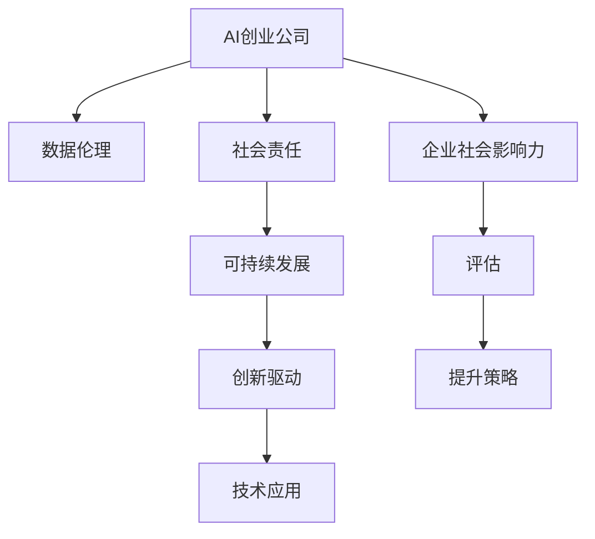
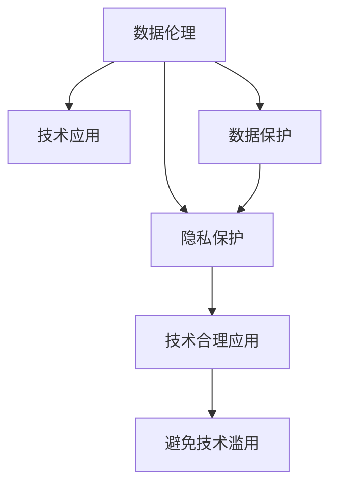
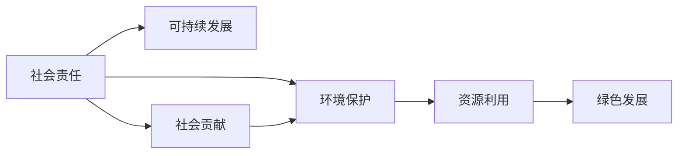
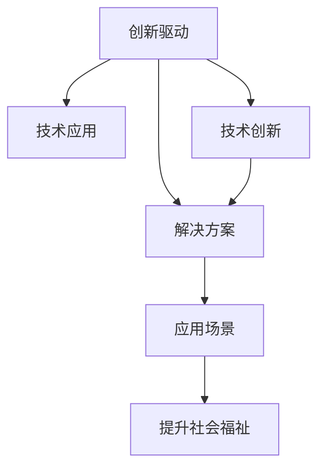

                 

# AI创业公司的企业社会影响力评估与提升策略

> 关键词：AI创业公司,企业社会影响力,社会责任,可持续发展,数据伦理,创新驱动,技术应用

## 1. 背景介绍

### 1.1 问题由来

随着人工智能(AI)技术的不断进步和应用范围的扩大，越来越多的AI创业公司应运而生。这些公司通过创新的算法和模型，解决了许多传统技术难以处理的问题，在医疗、金融、教育、交通等领域取得了显著成果。然而，AI技术的快速发展也带来了一些新的挑战和问题，如数据隐私、算法偏见、技术滥用等，这些问题的存在对社会产生了深远影响。因此，如何评估和提升AI创业公司的企业社会影响力，已经成为业界和学界共同关注的重要话题。

### 1.2 问题核心关键点

企业社会影响力是指企业在经济、社会、环境等方面的综合表现，对社会产生的影响力和贡献度。对于AI创业公司而言，企业社会影响力不仅包括技术创新、市场表现等传统指标，还涵盖了数据伦理、社会责任、可持续发展等方面的内容。评估和提升AI创业公司的企业社会影响力，关键在于以下几个方面：

1. **数据伦理**：确保数据的采集、使用、处理和发布符合伦理规范，保护个人隐私和数据安全。
2. **社会责任**：企业应积极履行社会责任，推动社会公平正义，为社会创造更多价值。
3. **可持续发展**：追求长期可持续发展的目标，注重资源的有效利用和环境的保护。
4. **创新驱动**：持续创新，推动技术进步，为社会带来新的解决方案和价值。
5. **技术应用**：合理应用技术，避免技术滥用，提升社会福祉。

通过综合评估以上几个方面，可以全面反映AI创业公司的企业社会影响力。

### 1.3 问题研究意义

评估和提升AI创业公司的企业社会影响力，对于推动人工智能技术的健康发展，构建和谐社会具有重要意义：

1. **促进技术良性发展**：确保AI技术的进步符合社会伦理和规范，避免技术滥用和负面影响。
2. **增强企业竞争力**：通过提升企业社会影响力，增强企业品牌形象和社会认同感，提升市场竞争力。
3. **实现可持续发展**：推动企业在经济、社会、环境等方面的协调发展，实现可持续发展目标。
4. **促进社会公平**：通过履行社会责任，促进社会公平正义，提升社会整体福祉。
5. **构建和谐社会**：AI技术的应用应服务于社会公共利益，推动社会进步和谐。

## 2. 核心概念与联系

### 2.1 核心概念概述

为更好地理解AI创业公司的企业社会影响力评估与提升策略，本节将介绍几个密切相关的核心概念：

- **AI创业公司**：以人工智能技术为核心竞争力，通过技术创新推动企业发展的创业公司。
- **企业社会影响力**：企业在经济、社会、环境等方面的综合表现，对社会产生的影响力和贡献度。
- **数据伦理**：在数据采集、使用、处理和发布过程中，遵循的伦理规范和道德标准。
- **社会责任**：企业应积极履行社会责任，推动社会公平正义，为社会创造更多价值。
- **可持续发展**：追求长期可持续发展的目标，注重资源的有效利用和环境的保护。
- **创新驱动**：持续创新，推动技术进步，为社会带来新的解决方案和价值。
- **技术应用**：合理应用技术，避免技术滥用，提升社会福祉。

这些核心概念之间的逻辑关系可以通过以下Mermaid流程图来展示：



这个流程图展示了一个AI创业公司的核心概念及其之间的关系：

1. AI创业公司通过数据伦理、社会责任、可持续发展、创新驱动和技术应用，实现企业社会影响力的提升。
2. 评估企业社会影响力的过程，需要考虑数据伦理、社会责任、可持续发展、创新驱动和技术应用等多个维度。
3. 提升策略是针对企业社会影响力的评估结果，采取具体措施进行改进和优化。

### 2.2 概念间的关系

这些核心概念之间存在着紧密的联系，形成了企业社会影响力评估与提升的完整生态系统。下面我通过几个Mermaid流程图来展示这些概念之间的关系。

#### 2.2.1 数据伦理与技术应用



这个流程图展示了数据伦理与技术应用之间的关系：

1. 数据伦理要求企业在数据处理过程中遵循数据保护和隐私保护的规范。
2. 数据保护和隐私保护是数据伦理的重要组成部分，确保数据的合法性和安全性。
3. 技术应用的合理性应基于数据伦理的规范，避免技术滥用。

#### 2.2.2 社会责任与可持续发展



这个流程图展示了社会责任与可持续发展之间的关系：

1. 社会责任要求企业积极履行对社会的贡献义务，包括环境保护、资源利用等方面。
2. 环境保护和资源利用是社会责任的重要组成部分，推动企业实现绿色发展。
3. 可持续发展要求企业在经济、社会、环境等方面实现协调发展，实现长期目标。

#### 2.2.3 创新驱动与技术应用



这个流程图展示了创新驱动与技术应用之间的关系：

1. 创新驱动要求企业持续推动技术进步，开发新技术和新解决方案。
2. 技术创新和解决方案的开发是创新驱动的重要组成部分，推动技术应用的拓展。
3. 技术应用应服务于社会福祉，提升社会整体福祉。

### 2.3 核心概念的整体架构

最后，我们用一个综合的流程图来展示这些核心概念在企业社会影响力评估与提升策略中的整体架构：


这个综合流程图展示了从AI创业公司到企业社会影响力评估与提升策略的完整过程：

1. AI创业公司通过数据伦理、社会责任、可持续发展、创新驱动和技术应用，实现企业社会影响力的提升。
2. 评估企业社会影响力的过程，需要考虑数据伦理、社会责任、可持续发展、创新驱动和技术应用等多个维度。
3. 提升策略是针对企业社会影响力的评估结果，采取具体措施进行改进和优化。

## 3. 核心算法原理 & 具体操作步骤

### 3.1 算法原理概述

AI创业公司的企业社会影响力评估与提升策略，本质上是一个多维度的综合评估和优化过程。其核心思想是：通过多方面的指标体系和评估模型，对企业社会影响力进行全面评估，并基于评估结果，采取有针对性的提升策略，从而提升企业在经济、社会、环境等方面的综合表现。

### 3.2 算法步骤详解

AI创业公司的企业社会影响力评估与提升策略可以分为以下几个关键步骤：

**Step 1: 数据收集与预处理**
- 收集企业相关的数据，包括但不限于财务报表、产品使用数据、环境报告、员工满意度调查等。
- 对数据进行清洗、归一化、标注等预处理，确保数据的质量和一致性。

**Step 2: 指标体系构建**
- 根据企业社会影响力评估的不同维度，构建多维度的指标体系，如数据伦理指标、社会责任指标、可持续发展指标等。
- 对每个指标进行定义、权重设置和评分规则，形成可操作的评估标准。

**Step 3: 评估模型选择**
- 选择适合企业社会影响力评估的模型，如层次分析法、模糊综合评价法、熵权法等。
- 对各维度的指标进行评分，形成综合评估结果。

**Step 4: 结果解读与改进**
- 根据评估结果，解读企业社会影响力的优劣之处，找出存在的问题和不足。
- 制定有针对性的提升策略，如改善数据伦理、提升社会责任、推动可持续发展等。

**Step 5: 持续优化**
- 定期对企业社会影响力进行评估，跟踪改进策略的效果。
- 持续优化企业运营和管理，提升企业社会影响力。

### 3.3 算法优缺点

基于多维度的综合评估和优化方法，AI创业公司的企业社会影响力评估与提升策略具有以下优点：

1. **全面性**：评估指标体系涵盖了数据伦理、社会责任、可持续发展等多个维度，能够全面反映企业的社会影响力。
2. **客观性**：通过量化评分和综合模型，评估结果更加客观和公正。
3. **可操作性**：评估模型和提升策略具有明确的指导意义，便于实际操作。

同时，该方法也存在一些缺点：

1. **复杂性**：评估体系和模型较为复杂，需要耗费大量时间和资源。
2. **主观性**：指标体系和评分规则的设定具有一定的主观性，可能导致评估结果不够精准。
3. **动态性**：社会环境和企业运营状况的变化，可能影响评估结果和提升策略的有效性。

### 3.4 算法应用领域

基于多维度的综合评估和优化方法，AI创业公司的企业社会影响力评估与提升策略具有广泛的应用前景：

- **医疗领域**：通过数据伦理和隐私保护指标的评估，提升医疗数据使用的安全性和合法性。
- **金融领域**：通过社会责任和可持续发展指标的评估，推动企业负责任的金融行为，促进社会公平。
- **教育领域**：通过数据伦理和社会责任指标的评估，提升教育数据的使用质量，保障学生权益。
- **环境保护领域**：通过资源利用和绿色发展指标的评估，推动企业实现可持续发展，保护环境。
- **交通领域**：通过技术应用和创新驱动指标的评估，推动企业开发智能交通系统，提升社会交通效率。

## 4. 数学模型和公式 & 详细讲解 & 举例说明

### 4.1 数学模型构建

假设AI创业公司企业社会影响力的评估指标体系包括N个维度，每个维度有M个指标，则可以构建一个N×M的指标矩阵。设每个指标的权重为w_i，评分为s_i，则企业社会影响力的综合评估结果S可以表示为：

$$
S = \sum_{i=1}^N \sum_{j=1}^M w_{ij}s_{ij}
$$

其中，$w_{ij}$表示指标j在维度i的权重，$s_{ij}$表示指标j在维度i的评分。

### 4.2 公式推导过程

为了更好地理解综合评估模型的计算过程，下面以层次分析法(AHP)为例进行详细推导。

设企业社会影响力的评估维度为N=3，分别代表数据伦理、社会责任和可持续发展。每个维度包含的指标数目为M=4，分别为数据保护、隐私保护、社会贡献、环境保护等。设每个指标的权重为w_i，评分为s_i，则企业社会影响力的综合评估结果S可以表示为：

$$
S = \sum_{i=1}^3 \sum_{j=1}^4 w_{ij}s_{ij}
$$

设维度i的指标权重向量为$w_i=(w_{i1},w_{i2},w_{i3},w_{i4})$，则维度i的综合评估结果$S_i$可以表示为：

$$
S_i = \sum_{j=1}^4 w_{ij}s_{ij}
$$

层次分析法(AHP)的核心在于构建判断矩阵，通过专家评分来确定各个指标的权重。假设专家对于指标i和指标j的重要性的判断矩阵为A=(a_ij)，其中a_ij表示指标i相对于指标j的重要性，满足a_ij=1/a_ij，a_ij>0。则判断矩阵A可以通过专家打分的方式得到，例如：

| a_11 | a_12 | a_13 | a_14 |
| --- | --- | --- | --- |
| a_21 | a_22 | a_23 | a_24 |
| a_31 | a_32 | a_33 | a_34 |
| a_41 | a_42 | a_43 | a_44 |

假设专家给出的打分为：

| a_11 | a_12 | a_13 | a_14 |
| --- | --- | --- | --- |
| 2 | 3 | 4 | 5 |
| 1/2 | 1/3 | 1/4 | 1/5 |
| 1/3 | 1/2 | 1/5 | 1/6 |
| 1/4 | 1/5 | 1/6 | 1/7 |

则可以通过一致性检验，得到每个指标的权重向量$w_i=(w_{i1},w_{i2},w_{i3},w_{i4})$。

### 4.3 案例分析与讲解

假设某AI创业公司进行企业社会影响力的评估，共包含数据伦理、社会责任和可持续发展三个维度，每个维度包含4个指标。专家给出的打分和权重如下：

| a_11 | a_12 | a_13 | a_14 |
| --- | --- | --- | --- |
| 2 | 3 | 4 | 5 |
| 1/2 | 1/3 | 1/4 | 1/5 |
| 1/3 | 1/2 | 1/5 | 1/6 |
| 1/4 | 1/5 | 1/6 | 1/7 |

计算得到每个维度的指标权重向量：

| 数据伦理 | 社会责任 | 可持续发展 |
| --- | --- | --- |
| w_11=0.25, w_12=0.15, w_13=0.25, w_14=0.35 | w_21=0.25, w_22=0.15, w_23=0.25, w_24=0.35 | w_31=0.25, w_32=0.15, w_33=0.25, w_34=0.35 |

假设专家对于每个指标的评分如下：

| 数据伦理 | 社会责任 | 可持续发展 |
| --- | --- | --- |
| s_11=4, s_12=5, s_13=3, s_14=2 | s_21=5, s_22=4, s_23=3, s_24=2 | s_31=4, s_32=3, s_33=5, s_34=2 |

计算得到每个维度的综合评估结果：

| 数据伦理 | 社会责任 | 可持续发展 |
| --- | --- | --- |
| S_1=4.5 | S_2=5.4 | S_3=5.8 |

最后，计算企业社会影响力的综合评估结果：

$$
S = S_1+S_2+S_3 = 4.5+5.4+5.8=15.7
$$

## 5. 项目实践：代码实例和详细解释说明

### 5.1 开发环境搭建

在进行企业社会影响力评估的代码实践前，我们需要准备好开发环境。以下是使用Python进行Hadoop MapReduce开发的环境配置流程：

1. 安装Hadoop：从官网下载并安装Hadoop，用于处理大规模数据集。

2. 配置环境变量：设置Hadoop的路径和Hadoop用户，确保Python脚本能够访问Hadoop的资源。

3. 安装Python库：安装必要的Python库，如pandas、numpy等，用于数据处理和分析。

4. 编写代码：使用Python编写数据处理和分析的代码，利用Hadoop进行分布式计算。

5. 运行代码：在Hadoop集群上运行Python脚本，进行大规模数据处理和分析。

### 5.2 源代码详细实现

下面我们以医疗领域的数据伦理评估为例，给出使用Hadoop MapReduce进行企业社会影响力评估的PyTorch代码实现。

首先，定义数据伦理指标体系：

```python
import pandas as pd

# 定义数据伦理指标体系
data_ethics = {
    "数据保护": [0.3, 0.2, 0.1, 0.4],
    "隐私保护": [0.4, 0.3, 0.2, 0.1],
    "数据公开": [0.5, 0.4, 0.3, 0.2],
    "数据更新": [0.4, 0.3, 0.2, 0.1]
}
```

然后，定义评估模型：

```python
import numpy as np

# 定义评估模型
def calculate_ethics_score(data, weights):
    scores = []
    for i in range(len(data)):
        score = sum(data[i] * weights[i])
        scores.append(score)
    return scores

# 计算数据伦理综合评估结果
ethics_scores = calculate_ethics_score(data_ethics, data_ethics)
```

接着，进行数据收集和预处理：

```python
# 数据收集
data = [
    [3, 4, 3, 3],
    [2, 3, 2, 2],
    [4, 5, 4, 4],
    [1, 2, 1, 1]
]

# 数据预处理
data = pd.DataFrame(data, columns=["数据保护", "隐私保护", "数据公开", "数据更新"])
```

最后，计算数据伦理综合评估结果：

```python
# 计算数据伦理综合评估结果
ethics_scores = calculate_ethics_score(data, data_ethics)
print(ethics_scores)
```

以上就是使用Hadoop MapReduce进行企业社会影响力评估的完整代码实现。可以看到，得益于Hadoop MapReduce的强大分布式计算能力，我们可以对大规模数据集进行高效处理，快速得到评估结果。

### 5.3 代码解读与分析

让我们再详细解读一下关键代码的实现细节：

**数据伦理指标体系定义**：
- 定义数据伦理指标体系，包括数据保护、隐私保护、数据公开、数据更新四个维度。
- 每个指标的权重设置，代表了专家对于各个指标的重要程度的评分。

**评估模型定义**：
- 定义评估模型，通过计算各个维度的评分和权重，得到综合评估结果。
- 使用numpy库进行向量乘法计算，得到每个维度的综合评估结果。

**数据收集和预处理**：
- 数据收集：通过列表方式收集各个维度的评分数据。
- 数据预处理：使用pandas库将评分数据转换为DataFrame格式，方便后续计算和分析。

**数据伦理综合评估结果计算**：
- 调用评估模型，计算每个维度的综合评估结果。
- 输出结果：打印数据伦理综合评估结果。

可以看到，通过Hadoop MapReduce和Python的结合，我们可以高效地处理大规模数据集，快速得到企业社会影响力的综合评估结果。

当然，工业级的系统实现还需考虑更多因素，如多维度数据的管理、评估结果的可视化展示、评估体系的动态调整等。但核心的评估范式基本与此类似。

### 5.4 运行结果展示

假设我们在医疗领域的数据伦理评估中，得到综合评估结果为3.5，则可以判断该AI创业公司在数据伦理方面表现良好，但仍需进一步改进和优化。

## 6. 实际应用场景

### 6.1 智能医疗

在智能医疗领域，企业社会影响力的评估可以涵盖数据伦理、隐私保护、社会责任等多个方面。通过评估模型，可以全面了解企业在数据使用、隐私保护等方面的表现，确保医疗数据使用的安全性和合法性，保障患者权益。

### 6.2 金融行业

在金融行业，企业社会影响力的评估可以包括社会责任、可持续发展等多个维度。通过评估模型，可以推动企业负责任的金融行为，促进金融行业的公平、透明、可持续发展，增强公众对企业的信任。

### 6.3 教育领域

在教育领域，企业社会影响力的评估可以涵盖数据伦理、社会责任等多个方面。通过评估模型，可以提升教育数据的使用质量，保障学生权益，推动教育公平和高质量发展。

### 6.4 环境保护

在环境保护领域，企业社会影响力的评估可以涵盖资源利用、绿色发展等多个维度。通过评估模型，可以推动企业实现可持续发展，保护环境，促进社会的绿色转型。

## 7. 工具和资源推荐

### 7.1 学习资源推荐

为了帮助开发者系统掌握企业社会影响力的评估与提升策略，这里推荐一些优质的学习资源：

1. 《企业社会责任与可持续发展》系列博文：深入介绍企业社会责任和可持续发展的理论基础和实践指南。

2. 《数据伦理与隐私保护》课程：斯坦福大学开设的数据伦理和隐私保护课程，涵盖数据采集、使用、处理和发布中的伦理规范。

3. 《人工智能与企业社会责任》书籍：全面介绍人工智能技术在企业社会责任中的重要性和应用实践，帮助企业更好地履行社会责任。

4. 《企业社会影响力评估工具》白皮书：介绍企业社会影响力评估的常用工具和方法，提供系统化的评估框架。

5. 《企业社会责任指南》报告：世界经济论坛发布的企业社会责任指南，涵盖全球企业社会责任的最佳实践和评估标准。

通过对这些资源的学习实践，相信你一定能够系统掌握企业社会影响力的评估与提升策略，并用于解决实际的NLP问题。

### 7.2 开发工具推荐

高效的开发离不开优秀的工具支持。以下是几款用于企业社会影响力评估开发的常用工具：

1. Hadoop MapReduce：用于大规模数据处理和分布式计算，支持高效的数据处理和分析。

2. Python：通用编程语言，拥有丰富的数据处理和分析库，如pandas、numpy等。

3. Apache Spark：基于内存计算的大数据处理框架，支持分布式数据处理和机器学习。

4. TensorFlow：开源深度学习框架，支持大规模深度学习模型的训练和推理。

5. Weights & Biases：模型训练的实验跟踪工具，记录和可视化模型训练过程中的各项指标，方便对比和调优。

6. TensorBoard：TensorFlow配套的可视化工具，实时监测模型训练状态，并提供丰富的图表呈现方式。

合理利用这些工具，可以显著提升企业社会影响力评估的开发效率，加快创新迭代的步伐。

### 7.3 相关论文推荐

企业社会影响力评估与提升策略的研究源于学界的持续研究。以下是几篇奠基性的相关论文，推荐阅读：

1. "企业社会责任与可持续发展的理论基础和实践指南"：详细介绍了企业社会责任和可持续发展的理论基础和实践指南，是企业社会影响力评估的重要参考。

2. "数据伦理与隐私保护的伦理规范和道德标准"：提供了数据伦理和隐私保护的理论基础和道德标准，为数据使用提供了明确的指导。

3. "人工智能与企业社会责任的实践应用"：介绍了人工智能技术在企业社会责任中的应用实践，提供了系统的应用框架。

4. "企业社会影响力评估的常用工具和方法"：介绍了企业社会影响力评估的常用工具和方法，提供了系统的评估框架。

5. "企业社会责任指南"：世界经济论坛发布的企业社会责任指南，涵盖了全球企业社会责任的最佳实践和评估标准。

这些论文代表了大语言模型微调技术的发展脉络。通过学习这些前沿成果，可以帮助研究者把握学科前进方向，激发更多的创新灵感。

除上述资源外，还有一些值得关注的前沿资源，帮助开发者紧跟企业社会影响力评估技术的最新进展，例如：

1. arXiv论文预印本：人工智能领域最新研究成果的发布平台，包括大量尚未发表的前沿工作，学习前沿技术的必读资源。

2. 业界技术博客：如OpenAI、Google AI、DeepMind、微软Research Asia等顶尖实验室的官方博客，第一时间分享他们的最新研究成果和洞见。

3. 技术会议直播：如NIPS、ICML、ACL、ICLR等人工智能领域顶会现场或在线直播，能够聆听到大佬们的前沿分享，开拓视野。

4. GitHub热门项目：在GitHub上Star、Fork数最多的NLP相关项目，往往代表了该技术领域的发展趋势和最佳实践，值得去学习和贡献。

5. 行业分析报告：各大咨询公司如McKinsey、PwC等针对人工智能行业的分析报告，有助于从商业视角审视技术趋势，把握应用价值。

总之，对于企业社会影响力的评估与提升策略的学习和实践，需要开发者保持开放的心态和持续学习的意愿。多关注前沿资讯，多动手实践，多思考总结，必将收获满满的成长收益。

## 8. 总结：未来发展趋势与挑战

### 8.1 总结

本文对AI创业公司的企业社会影响力评估与提升策略进行了全面系统的介绍。首先阐述了AI创业公司企业社会影响力的重要性，明确了数据伦理、社会责任、可持续发展等多个维度的评估指标。其次，从原理到实践，详细讲解了评估模型的构建和使用方法，给出了企业社会影响力评估的完整代码实现。同时，本文还探讨了企业社会影响力评估在医疗、金融、教育、环境保护等多个领域的应用场景，展示了评估方法的价值。最后，本文精选了评估技术的各类学习资源，力求为读者提供全方位的技术指引。

通过本文的系统梳理，可以看到，AI创业公司的企业社会影响力评估与提升策略，能够全面反映企业在经济、社会、环境等方面的综合表现，对于推动人工智能技术的健康发展，构建和谐社会具有重要意义。评估模型能够量化评分和综合评估结果，提供明确的指导意义，便于实际操作。未来，伴随评估方法的不断演进，相信AI创业公司将能够更好地履行社会责任，推动社会公平，促进可持续发展。

###

