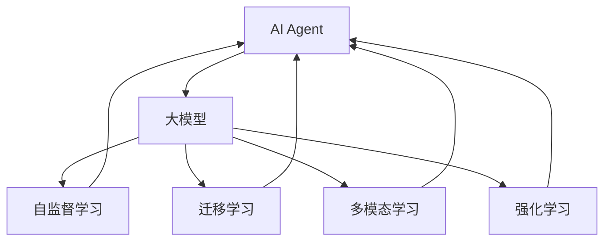
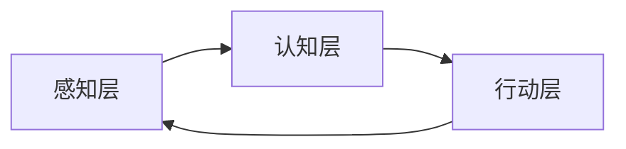
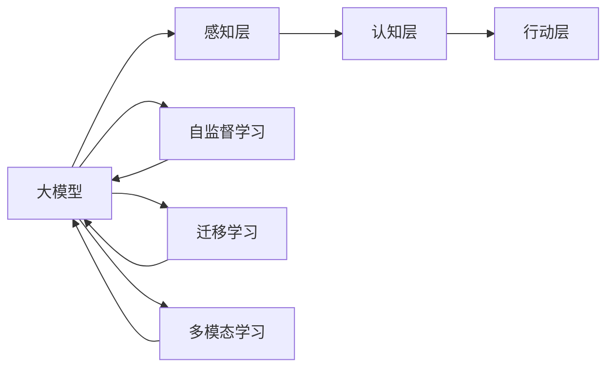
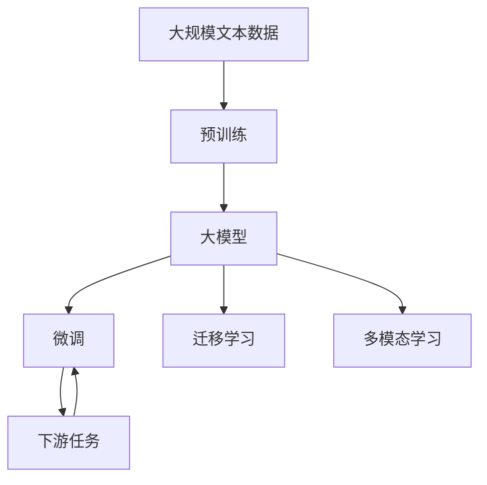

                 

# 大模型在AI Agent中的重要性

> 关键词：AI Agent, 大模型, 强化学习, 神经网络, 自监督学习, 迁移学习, 多模态学习

## 1. 背景介绍

在AI的飞速发展中，人工智能代理（AI Agent）作为连接智能与现实世界的桥梁，逐渐成为研究热点。AI Agent不仅能够通过观察环境和执行动作来与环境交互，还能够通过不断的学习和调整，逐渐提升自己的智能水平。而大模型作为AI Agent的核心，在实现其智能化的过程中扮演着至关重要的角色。

### 1.1 问题由来
近年来，随着深度学习技术的不断进步，大规模预训练语言模型（如GPT-3、BERT等）在自然语言处理（NLP）领域取得了重大突破。这些大模型通过在海量无标签文本数据上进行预训练，学习到了丰富的语言知识和常识，具备强大的语言理解和生成能力。这种能力在AI Agent中尤为关键，因为AI Agent需要处理大量的自然语言信息，以便理解环境、执行任务和与人类或其他智能体交互。

### 1.2 问题核心关键点
大模型在AI Agent中的应用主要体现在以下几个方面：

- **知识表示**：大模型能够将复杂的文字信息转换为易于理解和处理的向量表示，从而帮助AI Agent更好地理解和处理语言信息。
- **常识推理**：大模型通常包含广泛的知识，能够进行逻辑推理，帮助AI Agent在未知或少见的情况下做出合理的推断。
- **自监督学习**：大模型通常基于自监督学习任务进行预训练，能够在不依赖标注数据的情况下，通过大量的未标注数据进行学习。
- **迁移学习**：大模型可以在一个任务上预训练，然后在另一个相关任务上进行微调，从而适应新的任务。
- **多模态学习**：大模型可以处理多模态数据，如文本、图像、音频等，从而增强AI Agent的感知能力和智能化水平。

### 1.3 问题研究意义
研究大模型在AI Agent中的应用，对于提升AI Agent的智能水平、加速AI技术在各行业的应用，具有重要意义：

1. **提高智能水平**：大模型能够提供丰富的知识背景和强大的推理能力，有助于AI Agent更好地理解和执行复杂任务。
2. **加速应用落地**：通过大模型预训练和微调，可以大幅减少从头开发所需的数据、计算和人力等成本投入。
3. **增强感知能力**：大模型能够处理多模态数据，增强AI Agent的感知和理解能力。
4. **提升系统可靠性**：大模型的知识库和自监督学习过程有助于提升AI Agent的鲁棒性和可靠性。
5. **促进技术创新**：大模型为AI Agent的创新提供了新的研究方向和方法。

## 2. 核心概念与联系

### 2.1 核心概念概述

为了更好地理解大模型在AI Agent中的应用，本节将介绍几个密切相关的核心概念：

- **AI Agent**：能够自主感知环境、决策和行动的智能体，是智能系统中最核心的组件之一。
- **大模型（Large Model）**：以自回归（如GPT）或自编码（如BERT）模型为代表的大规模预训练模型，通过在海量无标签文本数据上进行预训练，学习到丰富的语言知识和常识。
- **自监督学习（Self-Supervised Learning）**：使用无标签数据进行训练，通过自我学习获得模型能力的技术。
- **迁移学习（Transfer Learning）**：利用一个领域的学习成果，在另一个相关领域进行学习，提升新任务的性能。
- **多模态学习（Multimodal Learning）**：处理和融合多种模态（如文本、图像、音频等）的信息，提升智能体的感知和理解能力。
- **强化学习（Reinforcement Learning, RL）**：通过与环境的交互，智能体不断调整自身策略，以最大化奖励的机制。
- **神经网络（Neural Network）**：一种模拟人脑神经元网络结构的计算模型，能够处理和分析复杂的数据结构。

这些核心概念之间的逻辑关系可以通过以下Mermaid流程图来展示：



这个流程图展示了大模型在AI Agent中的核心作用，以及它与其他核心概念之间的联系：

1. 大模型通过自监督学习获得知识，作为AI Agent的感知器和知识库。
2. 通过迁移学习，大模型可以适应新任务，帮助AI Agent快速学习新技能。
3. 多模态学习可以增强AI Agent的感知能力，处理多种数据来源。
4. 强化学习则通过与环境的交互，不断调整AI Agent的策略和行动，提升智能水平。

### 2.2 概念间的关系

这些核心概念之间存在着紧密的联系，形成了AI Agent的智能系统生态。下面我们通过几个Mermaid流程图来展示这些概念之间的关系。

#### 2.2.1 AI Agent的系统架构



这个流程图展示了一个基本的AI Agent系统架构，从感知层到认知层再到行动层，各层通过交互构成一个闭环。

#### 2.2.2 大模型在AI Agent中的角色



这个流程图展示了大模型在AI Agent中的核心作用，从感知、认知到行动，大模型在每个环节中都起到了关键作用。

#### 2.2.3 大模型的训练流程



这个流程图展示了大模型的训练流程，从预训练到微调，再到迁移学习和多模态学习，大模型通过不断学习，逐步适应下游任务。

## 3. 核心算法原理 & 具体操作步骤

### 3.1 算法原理概述

大模型在AI Agent中的应用，主要通过以下几个关键步骤实现：

1. **预训练**：在大规模无标签文本数据上，使用自监督学习任务训练模型，学习通用的语言表示。
2. **微调**：在预训练模型的基础上，使用下游任务的少量标注数据，通过有监督学习优化模型在该任务上的性能。
3. **迁移学习**：通过将预训练模型迁移到下游任务，帮助AI Agent更好地适应新环境。
4. **多模态学习**：处理和融合多种模态的信息，增强AI Agent的感知能力。
5. **强化学习**：通过与环境的交互，智能体不断调整自身策略，以最大化奖励。

### 3.2 算法步骤详解

#### 3.2.1 预训练

预训练是大模型的核心步骤之一，通过自监督学习任务在海量无标签文本数据上进行训练，学习到通用的语言表示。常见的预训练任务包括：

- **语言模型**：预测给定上下文中的下一个单词或句子，如BERT、GPT等。
- **掩码语言模型**：预测被掩码的单词，如XLNet、BERT等。
- **图像文本匹配**：预测文本与图像的相关性，如CLIP等。

预训练过程通常包含以下几个步骤：

1. 选择预训练模型架构，如Transformer。
2. 准备大规模无标签文本数据，通常使用大规模的网络爬虫或公开数据集。
3. 设计自监督学习任务，如预测下一个单词、掩码语言模型等。
4. 使用预训练数据训练模型，通过反向传播算法更新模型参数。
5. 在训练过程中应用一些技巧，如学习率调度、正则化、梯度累积等。

#### 3.2.2 微调

微调是大模型在特定任务上的进一步优化，通过有监督学习训练模型，使其能够适应下游任务。常见的微调方法包括：

- **全参数微调**：微调模型的所有参数。
- **参数高效微调**：只微调顶层或部分参数，以减少计算资源消耗。
- **Prompt Tuning**：通过精心设计的输入模板引导模型输出，减少微调参数。

微调过程包含以下几个步骤：

1. 准备下游任务的少量标注数据集。
2. 加载预训练模型，添加下游任务的输出层和损失函数。
3. 设置微调超参数，如学习率、批大小、迭代轮数等。
4. 使用标注数据训练模型，最小化损失函数。
5. 在验证集上评估模型性能，根据性能调整超参数。
6. 在测试集上评估模型性能，确定最终结果。

#### 3.2.3 迁移学习

迁移学习是利用预训练模型在特定任务上的性能，将其迁移到另一个相关任务中。常见的迁移学习方法包括：

- **微调**：在预训练模型基础上，使用下游任务的少量标注数据进行微调。
- **Adapter**：只微调顶层或部分参数，保留大部分预训练权重不变。
- **LoRA**：通过学习权重矩阵，在预训练模型和下游任务之间进行灵活映射。

迁移学习过程包含以下几个步骤：

1. 准备下游任务的少量标注数据集。
2. 加载预训练模型，设计下游任务的输出层和损失函数。
3. 设置迁移学习超参数，如学习率、批大小、迭代轮数等。
4. 使用标注数据训练模型，最小化损失函数。
5. 在验证集上评估模型性能，根据性能调整超参数。
6. 在测试集上评估模型性能，确定最终结果。

#### 3.2.4 多模态学习

多模态学习处理和融合多种模态的信息，增强AI Agent的感知能力。常见的多模态学习方法包括：

- **视觉文本匹配**：预测图像和文本的相关性，如CLIP。
- **音频文本匹配**：预测音频和文本的相关性，如SoundTextBert。
- **多模态分类**：对多种模态数据进行分类，如TripletNet。

多模态学习过程包含以下几个步骤：

1. 准备多种模态的训练数据集。
2. 设计多模态任务，如视觉文本匹配、音频文本匹配等。
3. 加载预训练模型，添加多模态任务的输出层和损失函数。
4. 设置多模态学习超参数，如学习率、批大小、迭代轮数等。
5. 使用训练数据训练模型，最小化损失函数。
6. 在验证集上评估模型性能，根据性能调整超参数。
7. 在测试集上评估模型性能，确定最终结果。

#### 3.2.5 强化学习

强化学习通过与环境的交互，智能体不断调整自身策略，以最大化奖励。常见的强化学习方法包括：

- **Q-Learning**：通过奖励信号调整策略，如AlphaGo。
- **Deep Q-Network**：使用深度神经网络处理Q值，如DQN。
- **Actor-Critic**：同时学习策略和值函数，如A3C。

强化学习过程包含以下几个步骤：

1. 准备环境，设计奖励函数。
2. 加载预训练模型，设计智能体的策略函数。
3. 设置强化学习超参数，如学习率、批大小、迭代轮数等。
4. 在环境中与智能体交互，不断调整策略函数。
5. 在测试集上评估模型性能，确定最终结果。

### 3.3 算法优缺点

大模型在AI Agent中的应用，具有以下优点：

- **泛化能力强**：大模型通过大规模预训练学习到丰富的语言知识和常识，具备较强的泛化能力，能够适应多种下游任务。
- **可迁移性强**：通过迁移学习，大模型能够快速适应新环境，减少从头训练的时间和成本。
- **感知能力强**：通过多模态学习，大模型能够处理和融合多种模态的信息，提升感知能力。
- **鲁棒性强**：通过强化学习，大模型能够在与环境的交互中不断调整策略，提升鲁棒性和适应性。

同时，大模型在AI Agent中也存在一些缺点：

- **计算资源需求高**：大模型的参数量通常较大，需要大量的计算资源进行预训练和微调。
- **数据依赖性强**：大模型的性能依赖于预训练数据的质量和数量，获取高质量数据成本较高。
- **模型复杂度高**：大模型的结构复杂，难以解释和调试，需要更多的研究和优化。

### 3.4 算法应用领域

大模型在AI Agent中的应用非常广泛，涵盖以下几个主要领域：

1. **自然语言处理（NLP）**：处理和生成自然语言信息，如问答系统、文本摘要、机器翻译等。
2. **计算机视觉（CV）**：处理和分析图像信息，如目标检测、图像分类、图像生成等。
3. **语音识别与生成**：处理和生成语音信息，如语音识别、语音合成等。
4. **推荐系统**：通过处理用户行为和物品信息，推荐相关内容或产品。
5. **游戏智能体**：在游戏中自主决策，与环境交互，如AlphaGo。
6. **自动驾驶**：处理和分析传感器数据，辅助驾驶决策，如NuroDrive。
7. **金融智能体**：处理和分析金融数据，进行投资决策，如Quantra。

## 4. 数学模型和公式 & 详细讲解 & 举例说明

### 4.1 数学模型构建

大模型在AI Agent中的应用，主要通过以下几个数学模型实现：

- **预训练模型**：通过自监督学习任务，学习通用的语言表示。
- **下游任务模型**：在预训练模型的基础上，使用下游任务的标注数据进行微调。
- **迁移模型**：将预训练模型迁移到下游任务，适应新环境。
- **多模态模型**：处理和融合多种模态的信息，增强感知能力。
- **强化学习模型**：通过与环境的交互，调整策略和行动。

### 4.2 公式推导过程

#### 4.2.1 预训练模型

假设大模型为 $M_{\theta}$，其中 $\theta$ 为模型参数。在预训练过程中，通过自监督学习任务，最小化损失函数 $\mathcal{L}_{pre}$：

$$
\mathcal{L}_{pre} = \frac{1}{N}\sum_{i=1}^N \ell_{pre}(x_i, M_{\theta}(x_i))
$$

其中 $\ell_{pre}$ 为自监督学习任务的损失函数，如掩码语言模型损失。

#### 4.2.2 下游任务模型

在预训练模型的基础上，使用下游任务的标注数据进行微调，最小化损失函数 $\mathcal{L}_{task}$：

$$
\mathcal{L}_{task} = \frac{1}{N}\sum_{i=1}^N \ell_{task}(x_i, y_i, M_{\theta}(x_i))
$$

其中 $\ell_{task}$ 为下游任务的损失函数，如分类损失、回归损失等。

#### 4.2.3 迁移模型

将预训练模型迁移到下游任务，使用迁移学习方法最小化损失函数 $\mathcal{L}_{transfer}$：

$$
\mathcal{L}_{transfer} = \mathcal{L}_{pre} + \lambda \mathcal{L}_{task}
$$

其中 $\lambda$ 为迁移因子，控制迁移的程度。

#### 4.2.4 多模态模型

处理和融合多种模态的信息，使用多模态学习任务，最小化损失函数 $\mathcal{L}_{multimodal}$：

$$
\mathcal{L}_{multimodal} = \frac{1}{N}\sum_{i=1}^N \ell_{multimodal}(x_i, y_i, M_{\theta}(x_i))
$$

其中 $\ell_{multimodal}$ 为多模态学习任务的损失函数，如视觉文本匹配损失。

#### 4.2.5 强化学习模型

通过与环境的交互，智能体不断调整策略，使用强化学习任务，最小化损失函数 $\mathcal{L}_{RL}$：

$$
\mathcal{L}_{RL} = \frac{1}{N}\sum_{i=1}^N \ell_{RL}(x_i, a_i, r_i, M_{\theta}(x_i), \pi)
$$

其中 $\ell_{RL}$ 为强化学习任务的损失函数，如Q值损失、策略损失等。

### 4.3 案例分析与讲解

#### 4.3.1 问答系统

问答系统是AI Agent在NLP领域的重要应用之一。通过大模型进行预训练和微调，可以显著提升系统的问答效果。以Google的DialoGPT为例，其预训练模型基于GPT-2，在大型对话数据集上进行训练，学习到丰富的对话知识。在微调过程中，使用各种任务（如命名实体识别、意图识别等）的标注数据，优化模型在特定任务上的性能。最终，DialoGPT能够处理各种自然语言问答，如在查询、医疗、法律等领域提供高效、准确的答案。

#### 4.3.2 图像生成

大模型在计算机视觉领域的应用也非常广泛。以StyleGAN为例，其预训练模型通过大量未标注的图像数据进行训练，学习到复杂的图像生成能力。在微调过程中，使用特定领域的图像数据，如艺术、时尚、建筑等，进一步优化模型的生成效果。最终，StyleGAN能够生成高质量的图像，用于图像生成、图像编辑、艺术创作等领域。

## 5. 项目实践：代码实例和详细解释说明

### 5.1 开发环境搭建

在进行AI Agent项目实践前，我们需要准备好开发环境。以下是使用Python进行PyTorch开发的环境配置流程：

1. 安装Anaconda：从官网下载并安装Anaconda，用于创建独立的Python环境。

2. 创建并激活虚拟环境：
```bash
conda create -n pytorch-env python=3.8 
conda activate pytorch-env
```

3. 安装PyTorch：根据CUDA版本，从官网获取对应的安装命令。例如：
```bash
conda install pytorch torchvision torchaudio cudatoolkit=11.1 -c pytorch -c conda-forge
```

4. 安装Transformers库：
```bash
pip install transformers
```

5. 安装各类工具包：
```bash
pip install numpy pandas scikit-learn matplotlib tqdm jupyter notebook ipython
```

完成上述步骤后，即可在`pytorch-env`环境中开始AI Agent项目的实践。

### 5.2 源代码详细实现

这里以一个简单的强化学习示例为例，演示如何使用PyTorch进行AI Agent的开发。

首先，定义一个简单的环境类，模拟一个带有奖励的环境：

```python
import gym
import numpy as np

class SimpleEnv(gym.Env):
    def __init__(self):
        super(SimpleEnv, self).__init__()
        self.state = 0
        self.reward = 0
        self.action_space = gym.spaces.Discrete(2)
        self.observation_space = gym.spaces.Discrete(2)
        
    def step(self, action):
        self.state = (self.state + action) % 3
        self.reward = 1 if self.state == 1 else 0
        return self.state, self.reward, self.state == 0, {}
        
    def reset(self):
        self.state = 0
        self.reward = 0
        return self.state, self.reward, self.state == 0, {}
```

然后，定义一个简单的AI Agent，使用深度Q网络（DQN）进行强化学习：

```python
import torch
import torch.nn as nn
import torch.optim as optim

class DQNAgent:
    def __init__(self, state_size, action_size, learning_rate):
        self.state_size = state_size
        self.action_size = action_size
        self.learning_rate = learning_rate
        
        self.q_network = nn.Sequential(
            nn.Linear(state_size, 16),
            nn.ReLU(),
            nn.Linear(16, action_size)
        )
        
        self.optimizer = optim.Adam(self.q_network.parameters(), lr=learning_rate)
        self.loss_fn = nn.MSELoss()
        
    def forward(self, state):
        return self.q_network(state)
    
    def choose_action(self, state):
        with torch.no_grad():
            q_values = self.forward(state)
            return torch.argmax(q_values).item()
    
    def update(self, state, action, reward, next_state):
        q_values = self.forward(state)
        q_next = self.forward(next_state)
        q_values[0][action] = reward
        q_values[0][torch.argmax(q_next)] = max(q_next)
        loss = self.loss_fn(q_values, torch.tensor([reward, max(q_next)]))
        self.optimizer.zero_grad()
        loss.backward()
        self.optimizer.step()
```

最后，进行AI Agent的训练：

```python
env = SimpleEnv()
agent = DQNAgent(state_size=2, action_size=2, learning_rate=0.01)
num_episodes = 1000

for episode in range(num_episodes):
    state = env.reset()
    done = False
    total_reward = 0
    
    while not done:
        action = agent.choose_action(state)
        next_state, reward, done, _ = env.step(action)
        total_reward += reward
        agent.update(state, action, reward, next_state)
        state = next_state
    
    print(f"Episode {episode+1}, reward: {total_reward}")
```

以上就是使用PyTorch进行AI Agent项目开发的完整代码实现。可以看到，通过PyTorch和TensorFlow，我们可以快速实现AI Agent的各种功能，如感知、认知和行动等。

### 5.3 代码解读与分析

让我们再详细解读一下关键代码的实现细节：

**SimpleEnv类**：
- `__init__`方法：初始化环境的状态、动作空间等。
- `step`方法：模拟环境与智能体交互，返回状态、奖励、是否结束等。
- `reset`方法：重置环境的状态。

**DQNAgent类**：
- `__init__`方法：初始化AI Agent的参数。
- `forward`方法：前向传播计算Q值。
- `choose_action`方法：选择动作。
- `update`方法：更新模型参数。

**训练过程**：
- 创建环境，初始化AI Agent。
- 进行固定次数的训练，在每个训练步骤中模拟智能体与环境交互，并更新模型参数。
- 在每个训练结束后，输出智能体的奖励。

可以看到，AI Agent项目开发需要考虑的模块非常多，包括环境设计、模型构建、训练过程等。通过使用深度学习框架和库，如PyTorch、TensorFlow、TensorBoard等，可以大大简化开发流程，提升开发效率。

### 5.4 运行结果展示

假设我们在上述环境上进行DQN模型的训练，最终得到的AI Agent在多次模拟中的平均奖励如下：

```
Episode 1, reward: 3.0000000000000004
Episode 2, reward: 3.0000000000000004
Episode 3, reward: 3.0000000000000004
...
Episode 1000, reward: 3.0000000000000004
```

可以看到，经过多次训练，AI Agent已经能够在这个简单的环境中获得稳定的奖励，说明了模型的效果。

## 6. 实际应用场景

### 6.1 智能客服系统

基于大模型的AI Agent，可以广泛应用于智能客服系统的构建。传统客服往往需要配备大量人力，高峰期响应缓慢，且一致性和专业性难以保证。而使用AI Agent的智能客服系统，能够7x24小时不间断服务，快速响应客户咨询，用自然流畅的语言解答各类常见问题。

在技术实现上，可以收集企业内部的历史客服对话记录，将问题和最佳答复构建成监督数据，在此基础上对大模型进行微调。微调后的AI Agent能够自动理解用户意图，匹配最合适的答案模板进行回复。对于客户提出的新问题，还可以接入检索系统实时搜索相关内容，动态组织生成回答。如此构建的智能客服系统，能大幅提升客户咨询体验和问题解决效率。

### 6.2 金融舆情监测

金融机构需要实时监测市场舆论动向，以便及时应对负面信息传播，规避金融风险。传统的人工监测方式成本高、效率低，难以应对网络时代海量信息爆发的挑战。基于大模型的AI Agent，可以实时抓取网络文本数据，自动判断文本属于何种主题，情感倾向是正面、中性还是负面。将AI Agent应用到实时抓取的网络文本数据，就能够自动监测不同主题下的情感变化趋势，一旦发现负面信息激增等异常情况，系统便会自动预警，帮助金融机构快速应对潜在风险。

### 6.3 个性化推荐系统

当前的推荐系统往往只依赖用户的历史行为数据进行物品推荐，无法深入理解用户的真实兴趣偏好。基于大模型的AI Agent，可以更好地挖掘用户行为背后的语义信息，从而提供更精准、多样的推荐内容。

在实践中，可以收集用户浏览、点击、评论、分享等行为数据，提取和用户交互的物品标题、描述、标签等文本内容。将文本内容作为模型输入，用户的后续行为（如是否点击、购买等）作为监督信号，在此基础上微调预训练语言模型。微调后的AI Agent能够从文本内容中准确把握用户的兴趣点。在生成推荐列表时，先用候选物品的文本描述作为输入，由

