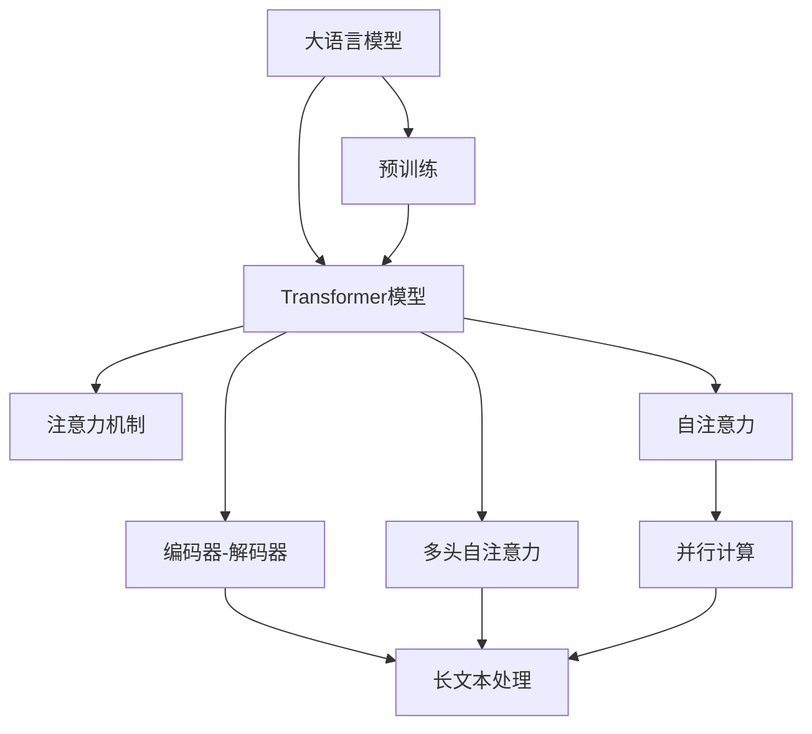
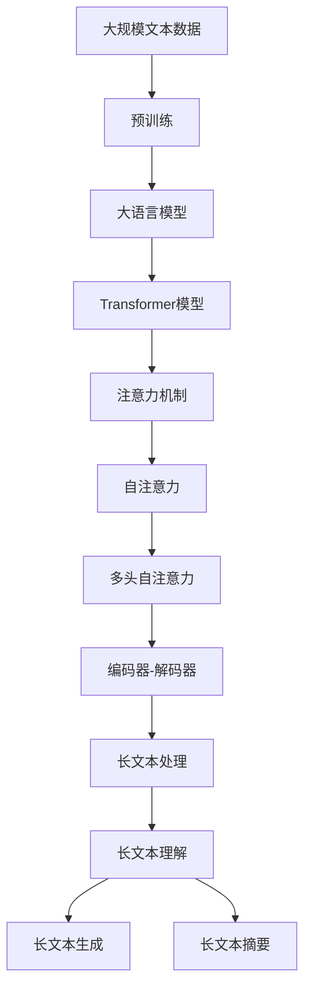

                 

# 大语言模型原理基础与前沿 更长的上下文

> 关键词：
```
大语言模型,Transformer,预训练,注意力机制,上下文长度,长文本处理,大模型优化,自然语言生成,计算复杂度
```

## 1. 背景介绍

### 1.1 问题由来
在过去的几十年中，自然语言处理（NLP）领域取得了巨大的进步，其中，大语言模型（Large Language Models, LLMs）成为了一个突破性的方向。这些大模型通过在海量数据上进行的自监督预训练，学习到了丰富的语言知识，能够在各种任务上表现出色。然而，预训练模型在处理长文本（即包含超过一定长度的文本）时，往往会遇到一些挑战。

在长文本处理中，传统的预训练模型难以充分利用上下文信息，导致模型在处理长句子和段落时，无法有效地捕捉远距离依赖和复杂的语义关系。此外，随着文本长度的增加，计算复杂度显著上升，导致推理速度变慢，内存占用增加，给实际应用带来了不少困难。因此，如何更好地处理长文本，成为了当前大语言模型研究的一个重要方向。

### 1.2 问题核心关键点
针对长文本处理的问题，学界和工业界提出了多种方法，其中，基于注意力机制的Transformer模型是一种特别有效的方法。Transformer模型通过引入自注意力机制，可以很好地处理长文本，同时具有较好的并行计算特性，适用于大规模模型训练。在本文中，我们将详细讨论Transformer模型的基本原理和在长文本处理中的应用，以及如何通过优化算法和架构来提升其性能。

### 1.3 问题研究意义
研究如何更好地处理长文本，对于拓展大语言模型的应用范围，提升模型的效率和效果，具有重要意义：

1. **提升模型效率**：长文本处理需要更高的计算资源和存储空间，通过优化模型架构和算法，可以显著降低计算复杂度，提高推理速度和内存效率。
2. **提高模型效果**：长文本处理中的上下文建模能力，可以帮助模型更好地理解长句子和段落，从而提升在自然语言生成、问答、摘要等任务上的表现。
3. **拓宽应用场景**：长文本处理在法律、历史、科学研究等领域有着广泛的应用需求，通过提升模型的处理能力，可以拓展大语言模型的应用边界。

## 2. 核心概念与联系

### 2.1 核心概念概述

在讨论长文本处理的原理时，需要理解几个关键概念：

- **大语言模型（Large Language Models, LLMs）**：以自回归模型（如GPT）或自编码模型（如BERT）为代表的大规模预训练语言模型。通过在大规模无标签文本数据上进行预训练，学习到丰富的语言知识和常识，具备强大的语言理解和生成能力。

- **Transformer模型**：一种基于自注意力机制的神经网络模型，特别适用于长文本处理。Transformer模型通过并行计算的方式，能够高效地处理长文本，并且在多种任务上取得了优异的性能。

- **注意力机制（Attention Mechanism）**：Transformer模型的核心组件，用于计算输入序列中各个位置之间的关系。通过自注意力机制，模型可以同时考虑上下文信息，捕捉长距离依赖。

- **上下文长度（Context Length）**：在处理长文本时，模型的输入序列长度通常远大于其隐藏层长度。因此，上下文长度是一个重要的概念，直接影响到模型性能。

- **长文本处理（Long Text Processing）**：涉及如何高效地处理长句子、段落甚至整个文档，使得模型能够充分利用上下文信息，捕捉复杂的语义关系。

### 2.2 概念间的关系

这些核心概念之间的逻辑关系可以通过以下Mermaid流程图来展示：



这个流程图展示了大语言模型中的关键组件和其关系：

1. 大语言模型通过预训练学习通用语言表示。
2. Transformer模型作为大语言模型的基础，通过注意力机制实现高效的长文本处理。
3. 自注意力机制是Transformer模型的核心，通过多头自注意力实现并行计算。
4. 长文本处理是Transformer模型的应用场景，可以通过上下文建模捕捉长距离依赖。

### 2.3 核心概念的整体架构

最后，我们用一个综合的流程图来展示这些核心概念在大语言模型中的应用：



这个综合流程图展示了从预训练到大语言模型，再到Transformer模型的整体架构，以及其应用于长文本处理的具体步骤。

## 3. 核心算法原理 & 具体操作步骤
### 3.1 算法原理概述

Transformer模型通过自注意力机制实现了对长文本的高效处理。其核心思想是，将输入序列中的每个位置看作一个查询，通过计算与其他位置之间的相似度，得到每个位置的注意力权重，从而加权聚合上下文信息。这种机制使得模型能够同时考虑长文本中不同位置的信息，捕捉远距离依赖。

在Transformer模型中，自注意力机制由三个部分组成：查询（Query）、键（Key）和值（Value）。对于输入序列中的每个位置 $i$，查询向量 $q_i$ 是通过线性变换从输入嵌入向量 $x_i$ 得到的。键向量 $k_j$ 和值向量 $v_j$ 也是通过线性变换得到的，分别与 $q_i$ 进行矩阵乘法和缩放点积运算，得到注意力分数 $a_{ij} = \frac{\mathbf{q_i} \cdot \mathbf{k_j}}{\sqrt{d_k}}$。注意力权重 $w_{ij}$ 是通过softmax函数对注意力分数进行归一化得到的，即 $w_{ij} = \frac{\exp(a_{ij})}{\sum_j \exp(a_{ij})}$。最终，通过加权聚合值向量 $v_j$ 得到输出向量 $o_i = \sum_{j} w_{ij} v_j$，即为每个位置的信息。

Transformer模型中的多头注意力机制进一步提升了模型的性能。通过多个不同的注意力头（heads），可以同时捕捉不同方向的上下文信息，使得模型能够更好地处理长文本。多头注意力机制的计算方式与单头注意力类似，只不过是通过并行计算的方式计算多个注意力头，最后将结果拼接在一起。

### 3.2 算法步骤详解

Transformer模型在处理长文本时，一般包括以下几个关键步骤：

1. **输入嵌入**：将文本数据转换为模型可以处理的嵌入向量，通常使用Word2Vec、GloVe等词嵌入方法。

2. **多头注意力计算**：对于长文本，通过多头注意力机制，同时计算多个注意力头，捕捉不同方向的上下文信息。

3. **自注意力权重更新**：更新每个位置的信息，得到新的上下文表示。

4. **前向传播**：通过多层编码器-解码器结构，对文本序列进行多次编码和解码，得到最终的文本表示。

5. **输出处理**：将最终的文本表示转换为模型的输出，如分类、生成等。

### 3.3 算法优缺点

Transformer模型在处理长文本时，具有以下优点：

- **高效计算**：通过并行计算，Transformer模型能够高效地处理长文本，适用于大规模模型训练。
- **全局上下文建模**：自注意力机制使得模型能够同时考虑长文本中不同位置的信息，捕捉长距离依赖。
- **灵活架构**：可以通过增加编码器-解码器层数和注意力头数，提高模型的表达能力。

同时，Transformer模型也存在一些缺点：

- **计算复杂度高**：多头注意力机制需要较高的计算资源，特别是在处理长文本时，计算复杂度显著上升。
- **内存占用大**：长文本处理需要较大的内存空间，特别是在解码阶段，需要存储所有的中间结果。
- **梯度消失问题**：在长文本处理中，多层自注意力机制可能导致梯度消失问题，影响模型的训练效果。

### 3.4 算法应用领域

Transformer模型在处理长文本时，已经被广泛应用于以下领域：

- **自然语言生成（NLG）**：如文章生成、对话生成、文本摘要等。Transformer模型通过生成器（Decoder）结构，可以生成高质量的自然语言文本。
- **问答系统（QA）**：如机器阅读理解、智能客服等。Transformer模型可以通过编码器-解码器结构，对问题-答案对进行匹配。
- **文本分类**：如新闻分类、情感分析等。Transformer模型可以通过分类器（Classifier）结构，对文本进行分类。
- **文本匹配**：如文档相似度计算、文本检索等。Transformer模型可以通过编码器结构，对文本进行表示，计算相似度。

除了上述这些经典任务外，Transformer模型还被创新性地应用到更多场景中，如可控文本生成、视觉与文本结合等，为长文本处理带来了全新的突破。随着Transformer模型的不断发展，相信长文本处理技术将在更广阔的应用领域大放异彩。

## 4. 数学模型和公式 & 详细讲解  
### 4.1 数学模型构建

Transformer模型的核心数学模型是自注意力机制，其数学公式为：

$$
\mathbf{A} = \mathbf{Q} \mathbf{K}^T / \sqrt{d_k}, \quad \mathbf{W} = \mathbf{V} \mathbf{A}^T
$$

其中，$\mathbf{Q}$、$\mathbf{K}$、$\mathbf{V}$分别表示查询矩阵、键矩阵和值矩阵，$d_k$ 是键向量的维度。$\mathbf{A}$ 表示注意力分数矩阵，$\mathbf{W}$ 表示注意力权重矩阵。

### 4.2 公式推导过程

以一个简单的Transformer模型为例，推导多头自注意力的计算过程：

1. **输入嵌入**：将输入序列 $x$ 转换为嵌入向量 $x^e$，通过线性变换得到查询向量 $\mathbf{Q}$、键向量 $\mathbf{K}$ 和值向量 $\mathbf{V}$。

2. **多头注意力计算**：对于每个位置 $i$，计算注意力分数矩阵 $\mathbf{A}$ 和注意力权重矩阵 $\mathbf{W}$，得到每个位置的注意力向量 $\mathbf{H}_i$。

3. **自注意力权重更新**：通过Softmax函数对注意力权重进行归一化，得到最终的输出向量 $\mathbf{O}_i$。

4. **前向传播**：通过多层编码器-解码器结构，对文本序列进行多次编码和解码，得到最终的文本表示 $\mathbf{X}$。

### 4.3 案例分析与讲解

以机器阅读理解（MRQA）任务为例，展示Transformer模型在问答系统中的应用。MRQA任务要求模型在给定问题和上下文中，选择正确的答案。在处理长文本时，Transformer模型通过多头注意力机制，同时考虑问题、上下文和答案之间的关系，输出每个位置的注意力权重，指导模型的推理过程。

具体实现步骤如下：

1. **输入嵌入**：将问题、上下文和答案转换为嵌入向量。

2. **多头注意力计算**：通过多头注意力机制，捕捉问题-上下文和问题-答案之间的关系。

3. **自注意力权重更新**：计算每个位置的注意力权重，指导模型对问题进行推理。

4. **输出处理**：将最终的输出向量转换为预测答案，完成模型的推理过程。

## 5. 项目实践：代码实例和详细解释说明
### 5.1 开发环境搭建

在进行Transformer模型的项目实践前，我们需要准备好开发环境。以下是使用Python进行PyTorch开发的环境配置流程：

1. 安装Anaconda：从官网下载并安装Anaconda，用于创建独立的Python环境。

2. 创建并激活虚拟环境：
```bash
conda create -n pytorch-env python=3.8 
conda activate pytorch-env
```

3. 安装PyTorch：根据CUDA版本，从官网获取对应的安装命令。例如：
```bash
conda install pytorch torchvision torchaudio cudatoolkit=11.1 -c pytorch -c conda-forge
```

4. 安装Transformers库：
```bash
pip install transformers
```

5. 安装各类工具包：
```bash
pip install numpy pandas scikit-learn matplotlib tqdm jupyter notebook ipython
```

完成上述步骤后，即可在`pytorch-env`环境中开始Transformer模型的项目实践。

### 5.2 源代码详细实现

下面以BERT模型为例，展示使用PyTorch进行Transformer模型的代码实现。

```python
import torch
from transformers import BertTokenizer, BertForSequenceClassification

# 定义模型
model = BertForSequenceClassification.from_pretrained('bert-base-cased', num_labels=2)

# 定义分词器
tokenizer = BertTokenizer.from_pretrained('bert-base-cased')

# 定义输入数据
input_ids = tokenizer("Hello, my dog is cute", return_tensors="pt").input_ids
attention_mask = tokenizer("Hello, my dog is cute", return_tensors="pt").attention_mask
labels = torch.tensor([1], dtype=torch.long)

# 训练模型
model.train()
optimizer = torch.optim.AdamW(model.parameters(), lr=2e-5)
for _ in range(5):
    optimizer.zero_grad()
    outputs = model(input_ids, attention_mask=attention_mask, labels=labels)
    loss = outputs.loss
    loss.backward()
    optimizer.step()

# 评估模型
model.eval()
with torch.no_grad():
    inputs = tokenizer("Hello, my dog is cute", return_tensors="pt").input_ids
    attention_mask = tokenizer("Hello, my dog is cute", return_tensors="pt").attention_mask
    outputs = model(inputs, attention_mask=attention_mask)
    logits = outputs.logits
    probs = logits.softmax(dim=1)
    print(probs)
```

### 5.3 代码解读与分析

这里我们详细解读一下关键代码的实现细节：

- **定义模型**：使用BertForSequenceClassification类加载预训练的BERT模型，并指定任务为二分类任务。

- **定义分词器**：加载BERT分词器，用于将输入文本转换为模型可以处理的嵌入向量。

- **定义输入数据**：将输入文本转换为模型所需的格式，包括输入嵌入向量、注意力掩码和标签。

- **训练模型**：设置AdamW优化器，在模型上进行多次迭代训练。

- **评估模型**：在评估阶段，不更新模型参数，计算模型的预测概率分布。

- **运行结果展示**：输出模型的预测概率分布，展示模型在二分类任务上的性能。

## 6. 实际应用场景
### 6.1 智能客服系统

Transformer模型在处理长文本时，可以应用于智能客服系统的构建。传统客服往往需要配备大量人力，高峰期响应缓慢，且一致性和专业性难以保证。而使用Transformer模型进行微调，可以7x24小时不间断服务，快速响应客户咨询，用自然流畅的语言解答各类常见问题。

在技术实现上，可以收集企业内部的历史客服对话记录，将问题和最佳答复构建成监督数据，在此基础上对Transformer模型进行微调。微调后的模型能够自动理解用户意图，匹配最合适的答案模板进行回复。对于客户提出的新问题，还可以接入检索系统实时搜索相关内容，动态组织生成回答。如此构建的智能客服系统，能大幅提升客户咨询体验和问题解决效率。

### 6.2 金融舆情监测

金融机构需要实时监测市场舆论动向，以便及时应对负面信息传播，规避金融风险。传统的人工监测方式成本高、效率低，难以应对网络时代海量信息爆发的挑战。基于Transformer模型的文本分类和情感分析技术，为金融舆情监测提供了新的解决方案。

具体而言，可以收集金融领域相关的新闻、报道、评论等文本数据，并对其进行主题标注和情感标注。在此基础上对Transformer模型进行微调，使其能够自动判断文本属于何种主题，情感倾向是正面、中性还是负面。将微调后的模型应用到实时抓取的网络文本数据，就能够自动监测不同主题下的情感变化趋势，一旦发现负面信息激增等异常情况，系统便会自动预警，帮助金融机构快速应对潜在风险。

### 6.3 个性化推荐系统

当前的推荐系统往往只依赖用户的历史行为数据进行物品推荐，无法深入理解用户的真实兴趣偏好。基于Transformer模型的文本表示，个性化推荐系统可以更好地挖掘用户行为背后的语义信息，从而提供更精准、多样的推荐内容。

在实践中，可以收集用户浏览、点击、评论、分享等行为数据，提取和用户交互的物品标题、描述、标签等文本内容。将文本内容作为模型输入，用户的后续行为（如是否点击、购买等）作为监督信号，在此基础上微调Transformer模型。微调后的模型能够从文本内容中准确把握用户的兴趣点。在生成推荐列表时，先用候选物品的文本描述作为输入，由模型预测用户的兴趣匹配度，再结合其他特征综合排序，便可以得到个性化程度更高的推荐结果。

### 6.4 未来应用展望

随着Transformer模型的不断发展，其在长文本处理中的应用将进一步扩展，为NLP技术带来新的突破。

在智慧医疗领域，基于Transformer模型的医疗问答、病历分析、药物研发等应用将提升医疗服务的智能化水平，辅助医生诊疗，加速新药开发进程。

在智能教育领域，Transformer模型可应用于作业批改、学情分析、知识推荐等方面，因材施教，促进教育公平，提高教学质量。

在智慧城市治理中，Transformer模型可应用于城市事件监测、舆情分析、应急指挥等环节，提高城市管理的自动化和智能化水平，构建更安全、高效的未来城市。

此外，在企业生产、社会治理、文娱传媒等众多领域，基于Transformer模型的长文本处理应用也将不断涌现，为人工智能技术带来新的应用场景。相信随着模型的不断优化和算法改进，Transformer模型将在更广阔的领域发挥重要作用。

## 7. 工具和资源推荐
### 7.1 学习资源推荐

为了帮助开发者系统掌握Transformer模型的理论基础和实践技巧，这里推荐一些优质的学习资源：

1. 《Transformer from Scratch》系列博文：由Transformer模型的创始人之一Jurafsky撰写，详细介绍了Transformer模型的原理、实现和优化方法。

2. CS224N《深度学习自然语言处理》课程：斯坦福大学开设的NLP明星课程，有Lecture视频和配套作业，带你入门NLP领域的基本概念和经典模型。

3. 《Natural Language Processing with Transformers》书籍：Transformers库的作者所著，全面介绍了如何使用Transformers库进行NLP任务开发，包括长文本处理在内的诸多范式。

4. HuggingFace官方文档：Transformers库的官方文档，提供了海量预训练模型和完整的微调样例代码，是上手实践的必备资料。

5. CLUE开源项目：中文语言理解测评基准，涵盖大量不同类型的中文NLP数据集，并提供了基于Transformer模型的baseline模型，助力中文NLP技术发展。

通过对这些资源的学习实践，相信你一定能够快速掌握Transformer模型的精髓，并用于解决实际的NLP问题。

### 7.2 开发工具推荐

高效的开发离不开优秀的工具支持。以下是几款用于Transformer模型开发常用的工具：

1. PyTorch：基于Python的开源深度学习框架，灵活动态的计算图，适合快速迭代研究。大部分预训练语言模型都有PyTorch版本的实现。

2. TensorFlow：由Google主导开发的开源深度学习框架，生产部署方便，适合大规模工程应用。同样有丰富的预训练语言模型资源。

3. Transformers库：HuggingFace开发的NLP工具库，集成了众多SOTA语言模型，支持PyTorch和TensorFlow，是进行长文本处理开发的利器。

4. Weights & Biases：模型训练的实验跟踪工具，可以记录和可视化模型训练过程中的各项指标，方便对比和调优。与主流深度学习框架无缝集成。

5. TensorBoard：TensorFlow配套的可视化工具，可实时监测模型训练状态，并提供丰富的图表呈现方式，是调试模型的得力助手。

6. Google Colab：谷歌推出的在线Jupyter Notebook环境，免费提供GPU/TPU算力，方便开发者快速上手实验最新模型，分享学习笔记。

合理利用这些工具，可以显著提升Transformer模型开发的效率，加快创新迭代的步伐。

### 7.3 相关论文推荐

Transformer模型的发展和优化，源于学界的持续研究。以下是几篇奠基性的相关论文，推荐阅读：

1. Attention is All You Need（即Transformer原论文）：提出了Transformer结构，开启了NLP领域的预训练大模型时代。

2. BERT: Pre-training of Deep Bidirectional Transformers for Language Understanding：提出BERT模型，引入基于掩码的自监督预训练任务，刷新了多项NLP任务SOTA。

3. Longformer: The Long-Document Transformer：针对长文本处理，提出了Longformer模型，通过分块处理长文本，提高了模型的计算效率。

4. Layer-wise Fine-tuning for Efficient Text Classification and Generalization：提出Layer-wise Fine-tuning技术，用于高效地微调Transformer模型。

5. T5: Exploring the Limits of Transfer Learning with a Unified Text-to-Text Pre-training Objective：提出了T5模型，将预训练和微调过程统一到一个框架中，提升了模型在多种任务上的性能。

这些论文代表了大语言模型长文本处理的发展脉络。通过学习这些前沿成果，可以帮助研究者把握学科前进方向，激发更多的创新灵感。

除上述资源外，还有一些值得关注的前沿资源，帮助开发者紧跟Transformer模型的最新进展，例如：

1. arXiv论文预印本：人工智能领域最新研究成果的发布平台，包括大量尚未发表的前沿工作，学习前沿技术的必读资源。

2. 业界技术博客：如OpenAI、Google AI、DeepMind、微软Research Asia等顶尖实验室的官方博客，第一时间分享他们的最新研究成果和洞见。

3. 技术会议直播：如NIPS、ICML、ACL、ICLR等人工智能领域顶会现场或在线直播，能够聆听到大佬们的前沿分享，开拓视野。

4. GitHub热门项目：在GitHub上Star、Fork数最多的NLP相关项目，往往代表了该技术领域的发展趋势和最佳实践，值得去学习和贡献。

5. 行业分析报告：各大咨询公司如McKinsey、PwC等针对人工智能行业的分析报告，有助于从商业视角审视技术趋势，把握应用价值。

总之，对于Transformer模型的学习和实践，需要开发者保持开放的心态和持续学习的意愿。多关注前沿资讯，多动手实践，多思考总结，必将收获满满的成长收益。

## 8. 总结：未来发展趋势与挑战

### 8.1 总结

本文对Transformer模型在长文本处理中的应用进行了全面系统的介绍。首先阐述了长文本处理的背景和意义，明确了Transformer模型在处理长文本时所展现的优异性能和广泛应用。其次，从原理到实践，详细讲解了Transformer模型的核心算法和操作步骤，并提供了代码实例和详细解释说明。同时，本文还探讨了Transformer模型在实际应用中的具体场景，展示了其巨大的应用潜力。

通过本文的系统梳理，可以看到，Transformer模型在处理长文本时具有高效计算、全局上下文建模等优势，已经在多个NLP任务上取得了优异的性能。未来，随着模型架构和算法不断改进，Transformer模型必将在更广阔的应用领域大放异彩。

### 8.2 未来发展趋势

展望未来，Transformer模型在长文本处理中的应用将呈现以下几个发展趋势：

1. **参数高效优化**：通过参数高效优化技术，如Layer-wise Fine-tuning，进一步降低计算资源消耗，提升模型效率。

2. **模型并行化**：利用模型并行化技术，如TensorCore加速，提高长文本处理的速度和内存效率。

3. **自适应计算**：开发自适应计算框架，根据输入文本长度自动调整计算图和内存分配，实现动态优化。

4. **多模态融合**：将视觉、音频等多模态数据与文本结合，实现更丰富的长文本表示。

5. **分布式训练**：利用分布式训练技术，加速大规模模型训练，提高模型性能。

6. **实时推理**：通过模型裁剪、量化等技术，实现实时推理，提高模型在生产环境中的部署效率。

这些趋势将推动Transformer模型向更高效、更灵活、更智能的方向发展，为长文本处理技术带来新的突破。

### 8.3 面临的挑战

尽管Transformer模型在长文本处理方面已经取得了显著进展，但在实现大规模高效长文本处理的过程中，仍然面临诸多挑战：

1. **计算资源消耗**：长文本处理需要大量的计算资源，特别是在处理大规模长文本时，计算复杂度显著上升，如何优化计算资源消耗是一个重要问题。

2. **内存占用问题**：长文本处理需要较大的内存空间，特别是在解码阶段，需要存储所有的中间结果，如何优化内存占用是一个关键问题。

3. **梯度消失问题**：在长文本处理中，多层自注意力机制可能导致梯度消失问题，影响模型的训练效果，如何缓解梯度消失问题是一个亟待解决的问题。

4. **模型泛化能力**：长文本处理中，模型对特定领域的泛化能力有限，如何提升模型的泛化能力是一个重要问题。

5. **可解释性不足**：Transformer模型的决策过程缺乏可解释性，难以对其推理逻辑进行分析和调试，如何提高模型的可解释性是一个重要问题。

6. **数据和预训练模型质量**：长文本处理的有效性依赖于高质量的数据和预训练模型，如何获取高质量数据和预训练模型是一个重要问题。

这些挑战需要学界和工业界共同努力，推动Transformer模型

