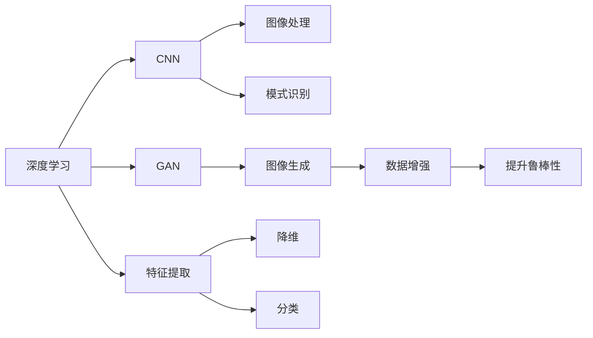
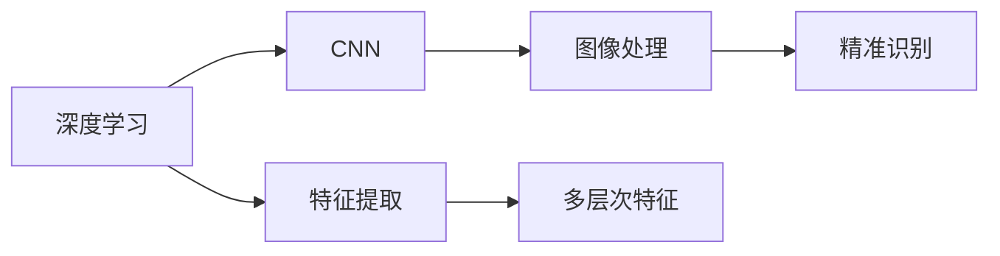
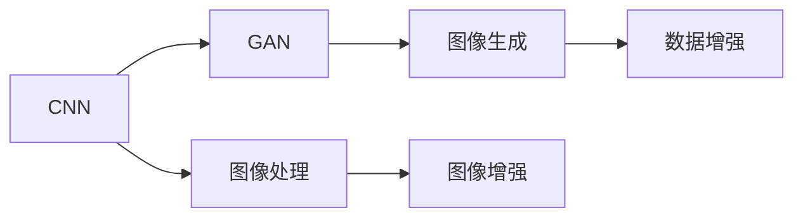
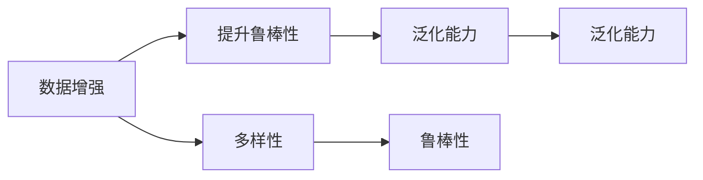
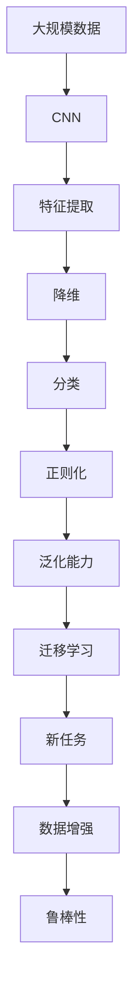

                 

# AI人工智能深度学习算法：在缺陷检测中的应用

## 1. 背景介绍

### 1.1 问题由来
随着人工智能技术的不断发展，深度学习在缺陷检测中的应用日益广泛。传统的缺陷检测方法依赖于手工设计和提取特征，不仅效率低下，且难以处理复杂的多模态数据。而深度学习模型，特别是卷积神经网络(CNN)和生成对抗网络(GAN)等，能够自动学习数据的高级特征，具有强大的图像处理和分类能力，能够有效提升缺陷检测的精度和效率。

### 1.2 问题核心关键点
在缺陷检测中，深度学习算法能够通过学习大量的标注数据，自动提取出复杂的多层次特征，从而实现对缺陷的精准识别。但传统的深度学习模型面临过拟合、泛化能力不足等问题，因此需要在实际应用中进行优化和改进。

### 1.3 问题研究意义
研究深度学习算法在缺陷检测中的应用，对于提升检测精度、降低误检率、提高检测效率具有重要意义。同时，能够为制造业、医疗健康、交通运输等领域提供高效、可靠的缺陷检测解决方案，推动相关产业的智能化转型升级。

## 2. 核心概念与联系

### 2.1 核心概念概述

为更好地理解深度学习算法在缺陷检测中的应用，本节将介绍几个密切相关的核心概念：

- **深度学习**：通过构建多层神经网络，自动学习数据的多层次特征，实现复杂的分类、识别等任务。
- **卷积神经网络(CNN)**：一种专门用于图像处理和模式识别的深度学习模型，通过卷积操作提取局部特征。
- **生成对抗网络(GAN)**：一种生成式深度学习模型，通过生成对抗的机制，产生逼真的图像和声音等数据，常用于图像生成和数据增强。
- **特征提取**：从原始数据中提取出有意义的特征表示，常用于降维、分类等任务。
- **正则化**：通过添加约束条件，避免过拟合，提升模型的泛化能力。
- **迁移学习**：利用预训练模型在不同任务间迁移知识，提高模型的泛化能力。
- **数据增强**：通过对训练数据进行变换，增加数据多样性，提高模型的鲁棒性。

这些核心概念之间的逻辑关系可以通过以下Mermaid流程图来展示：



这个流程图展示了深度学习在不同任务中的应用，以及CNN和GAN在图像处理和生成中的作用。特征提取用于降维和分类任务，正则化和迁移学习则用于提升模型的泛化能力，数据增强用于提高模型的鲁棒性。

### 2.2 概念间的关系

这些核心概念之间存在着紧密的联系，形成了深度学习在缺陷检测中的应用框架。下面是一些关键概念的关系图：

#### 2.2.1 深度学习与CNN的关系



这个关系图展示了深度学习通过卷积神经网络(CNN)实现图像处理的流程，从原始数据中提取多层次特征，并进行精准识别。

#### 2.2.2 CNN与GAN的关系



这个关系图展示了CNN通过生成对抗网络(GAN)实现图像增强的过程，通过生成逼真的图像，进一步增强数据多样性。

#### 2.2.3 数据增强与正则化的关系



这个关系图展示了数据增强通过增加数据多样性，提升模型的鲁棒性和泛化能力。

### 2.3 核心概念的整体架构

最后，我们用一个综合的流程图来展示这些核心概念在大语言模型微调过程中的整体架构：



这个综合流程图展示了深度学习在缺陷检测中的应用流程，从大规模数据开始，通过卷积神经网络提取特征，降维和分类，正则化和迁移学习提升泛化能力，数据增强和鲁棒性提升模型的鲁棒性。通过这个框架，可以更好地把握深度学习在缺陷检测中的应用方向。

## 3. 核心算法原理 & 具体操作步骤

### 3.1 算法原理概述

深度学习在缺陷检测中的应用主要涉及以下几个核心算法：

- **卷积神经网络(CNN)**：通过卷积层、池化层等结构，自动提取图像中的多层次特征，实现精准识别。
- **生成对抗网络(GAN)**：通过生成器和判别器之间的对抗训练，生成逼真的图像样本，用于数据增强。
- **迁移学习**：利用预训练模型的知识，在新任务上进行微调，提升模型的泛化能力。
- **正则化**：通过L1、L2正则、Dropout等技术，避免过拟合，提升模型的泛化能力。
- **数据增强**：通过图像变换、旋转、裁剪等操作，增加数据多样性，提高模型的鲁棒性。

### 3.2 算法步骤详解

深度学习在缺陷检测中的应用一般包括以下几个关键步骤：

**Step 1: 数据准备**
- 收集大规模标注数据，包括正常样本和缺陷样本。
- 对数据进行预处理，如归一化、标准化等。
- 将数据分为训练集、验证集和测试集，比例为70%：15%：15%。

**Step 2: 模型选择和设计**
- 选择合适的深度学习模型，如CNN、GAN等。
- 设计模型架构，包括卷积层、池化层、全连接层等。
- 设置模型的超参数，如学习率、批量大小、迭代轮数等。

**Step 3: 模型训练**
- 使用训练集数据对模型进行训练，最小化损失函数。
- 通过反向传播算法更新模型参数，优化损失函数。
- 在验证集上进行模型评估，及时调整超参数和模型结构。

**Step 4: 模型微调**
- 利用迁移学习，在新任务上进行微调，提升模型泛化能力。
- 使用数据增强技术，增加数据多样性，提升模型鲁棒性。
- 通过正则化技术，避免过拟合，提升模型泛化能力。

**Step 5: 模型评估和部署**
- 在测试集上评估模型性能，计算准确率、召回率等指标。
- 部署模型到实际应用场景，进行缺陷检测。
- 持续收集新数据，定期重新微调模型，以适应数据分布的变化。

以上是深度学习在缺陷检测中的一般流程，具体实现过程中还需要根据任务特点进行调整和优化。

### 3.3 算法优缺点

深度学习在缺陷检测中的应用具有以下优点：
- 自动学习特征，无需手工设计特征，减少特征工程的工作量。
- 能够处理多模态数据，如图像、声音、文本等。
- 通过迁移学习，利用预训练模型的知识，提升模型的泛化能力。
- 数据增强技术能够提升模型的鲁棒性和泛化能力。

但深度学习在缺陷检测中也存在一些局限性：
- 需要大量标注数据，获取标注数据的成本较高。
- 模型复杂，训练和推理过程计算资源消耗较大。
- 过拟合风险较高，需要适当的正则化技术进行抑制。
- 模型的可解释性不足，难以理解模型内部的决策逻辑。

尽管存在这些局限性，但深度学习在缺陷检测中的应用已经取得了显著效果，并在多个领域得到了广泛应用。

### 3.4 算法应用领域

深度学习在缺陷检测中的应用已经扩展到多个领域，包括：

- **制造业**：利用图像处理技术，检测产品缺陷，提高生产效率和产品质量。
- **医疗健康**：利用医学图像，检测肿瘤、病变等病理情况，辅助医生诊断。
- **交通运输**：利用视频处理技术，检测车辆、路面缺陷，保障交通安全。
- **电力行业**：利用图像处理技术，检测电力设备缺陷，预防事故发生。
- **农业领域**：利用图像处理技术，检测农作物病虫害，提升农业生产效率。

这些应用展示了深度学习在缺陷检测中的广泛应用前景。

## 4. 数学模型和公式 & 详细讲解 & 举例说明

### 4.1 数学模型构建

在缺陷检测中，深度学习模型一般采用卷积神经网络(CNN)或生成对抗网络(GAN)。这里以CNN为例，构建数学模型。

假设输入图像为$x \in \mathbb{R}^{h\times w\times c}$，其中$h$、$w$、$c$分别为图像的高度、宽度和通道数。输出为二分类结果，即正常样本和缺陷样本。

定义模型为$f(x; \theta)$，其中$\theta$为模型参数。

模型输出为$\hat{y} = f(x; \theta)$，其概率分布为$p(y|x; \theta) = \mathcal{N}(\hat{y}; \mu, \sigma)$，其中$\mu$为均值，$\sigma$为方差。

定义损失函数$\mathcal{L}$为交叉熵损失，定义为：

$$
\mathcal{L}(\theta) = -\frac{1}{N}\sum_{i=1}^N [y_i\log p(y_i|x_i; \theta) + (1-y_i)\log (1-p(y_i|x_i; \theta))]
$$

其中$y_i \in \{0,1\}$为标注数据。

### 4.2 公式推导过程

以下是CNN模型的详细推导过程：

1. **卷积层**：

   卷积层通过卷积核$k$对输入$x$进行卷积操作，得到特征图$F$：

   $$
   F = k * x
   $$

   其中$*$表示卷积操作，$k$为卷积核，$x$为输入图像。

2. **池化层**：

   池化层通过最大池化或平均池化等操作，对特征图$F$进行降维，得到下采样后的特征图$G$：

   $$
   G = \text{Pooling}(F)
   $$

   其中$\text{Pooling}$表示池化操作。

3. **全连接层**：

   全连接层将池化后的特征图$G$展开为一维向量$G^{\prime}$，通过全连接层$W$进行分类：

   $$
   Z = WG^{\prime}
   $$

   其中$W$为全连接层的权重矩阵，$G^{\prime}$为特征图$G$展开后的向量。

4. **输出层**：

   输出层将全连接层$Z$通过softmax函数输出概率分布$p(y|x; \theta)$：

   $$
   p(y|x; \theta) = \text{softmax}(Z)
   $$

   其中$\text{softmax}$函数将$Z$转换为概率分布。

5. **损失函数**：

   定义交叉熵损失函数$\mathcal{L}$：

   $$
   \mathcal{L}(\theta) = -\frac{1}{N}\sum_{i=1}^N [y_i\log p(y_i|x_i; \theta) + (1-y_i)\log (1-p(y_i|x_i; \theta))]
   $$

6. **梯度下降**：

   通过梯度下降算法更新模型参数$\theta$：

   $$
   \theta \leftarrow \theta - \eta \nabla_{\theta}\mathcal{L}(\theta)
   $$

   其中$\eta$为学习率，$\nabla_{\theta}\mathcal{L}(\theta)$为损失函数对参数$\theta$的梯度。

### 4.3 案例分析与讲解

以制造业中的缺陷检测为例，进行案例分析。

#### 4.3.1 数据准备

收集制造业中的设备图片，进行标注，将正常样本和缺陷样本分别标记为0和1。数据集分为训练集、验证集和测试集，比例为70%：15%：15%。

#### 4.3.2 模型选择和设计

选择卷积神经网络(CNN)作为检测模型，设计模型架构，包括多个卷积层、池化层和全连接层。设置学习率为0.001，批量大小为64，迭代轮数为100。

#### 4.3.3 模型训练

使用训练集对模型进行训练，最小化交叉熵损失函数。在验证集上评估模型性能，及时调整超参数和模型结构。训练结束后，在测试集上评估模型性能，计算准确率、召回率等指标。

#### 4.3.4 模型微调

利用迁移学习，在新任务上进行微调，提升模型泛化能力。使用数据增强技术，增加数据多样性，提升模型鲁棒性。通过正则化技术，避免过拟合，提升模型泛化能力。

## 5. 项目实践：代码实例和详细解释说明

### 5.1 开发环境搭建

在进行深度学习模型训练和微调之前，需要先搭建好开发环境。以下是使用Python进行PyTorch开发的环境配置流程：

1. 安装Anaconda：从官网下载并安装Anaconda，用于创建独立的Python环境。

2. 创建并激活虚拟环境：
```bash
conda create -n pytorch-env python=3.8 
conda activate pytorch-env
```

3. 安装PyTorch：根据CUDA版本，从官网获取对应的安装命令。例如：
```bash
conda install pytorch torchvision torchaudio cudatoolkit=11.1 -c pytorch -c conda-forge
```

4. 安装Transformers库：
```bash
pip install transformers
```

5. 安装各类工具包：
```bash
pip install numpy pandas scikit-learn matplotlib tqdm jupyter notebook ipython
```

完成上述步骤后，即可在`pytorch-env`环境中开始深度学习模型训练和微调实践。

### 5.2 源代码详细实现

下面我们以制造业中的缺陷检测为例，给出使用PyTorch进行CNN模型训练和微调的PyTorch代码实现。

首先，定义数据处理函数：

```python
import torch
from torchvision import transforms
from torch.utils.data import Dataset, DataLoader

class DefectDataset(Dataset):
    def __init__(self, root, transform=None):
        self.image_root = root
        self.transform = transform
        self.data = []
        self.labels = []
        for i in range(1, len(os.listdir(self.image_root)) + 1):
            img = os.path.join(self.image_root, f"{i}.jpg")
            label = int(os.path.basename(img))
            self.data.append(img)
            self.labels.append(label)
        
    def __len__(self):
        return len(self.data)
    
    def __getitem__(self, idx):
        img_path = self.data[idx]
        label = self.labels[idx]
        
        image = Image.open(img_path)
        if self.transform:
            image = self.transform(image)
        
        return {'img': image, 'label': label}
```

然后，定义CNN模型：

```python
import torch.nn as nn
import torchvision.models as models

class DefectNet(nn.Module):
    def __init__(self):
        super(DefectNet, self).__init__()
        self.conv1 = nn.Conv2d(3, 64, kernel_size=3, stride=1, padding=1)
        self.conv2 = nn.Conv2d(64, 128, kernel_size=3, stride=1, padding=1)
        self.pool = nn.MaxPool2d(kernel_size=2, stride=2)
        self.fc1 = nn.Linear(128 * 7 * 7, 256)
        self.fc2 = nn.Linear(256, 1)
        
    def forward(self, x):
        x = self.pool(nn.functional.relu(self.conv1(x)))
        x = self.pool(nn.functional.relu(self.conv2(x)))
        x = x.view(-1, 128 * 7 * 7)
        x = nn.functional.relu(self.fc1(x))
        x = self.fc2(x)
        return x
```

接着，定义训练和评估函数：

```python
from torch import optim
import torch.nn.functional as F

def train_epoch(model, dataloader, optimizer):
    model.train()
    losses = []
    for batch in dataloader:
        img, label = batch['img'], batch['label']
        img = img.to(device)
        label = label.to(device)
        optimizer.zero_grad()
        output = model(img)
        loss = F.binary_cross_entropy_with_logits(output, label)
        losses.append(loss.item())
        loss.backward()
        optimizer.step()
    return sum(losses) / len(dataloader)

def evaluate(model, dataloader):
    model.eval()
    correct = 0
    total = 0
    with torch.no_grad():
        for batch in dataloader:
            img, label = batch['img'], batch['label']
            img = img.to(device)
            label = label.to(device)
            output = model(img)
            _, predicted = torch.max(output, 1)
            total += label.size(0)
            correct += (predicted == label).sum().item()
    print('Accuracy: {:.2f}%'.format(100 * correct / total))
```

最后，启动训练流程并在测试集上评估：

```python
epochs = 100
batch_size = 64
device = torch.device('cuda' if torch.cuda.is_available() else 'cpu')

model = DefectNet().to(device)
optimizer = optim.Adam(model.parameters(), lr=0.001)

dataloader = DataLoader(DefectDataset('data', transform=transforms.ToTensor()), batch_size=batch_size, shuffle=True)

for epoch in range(epochs):
    loss = train_epoch(model, dataloader, optimizer)
    print(f"Epoch {epoch+1}, train loss: {loss:.3f}")
    
    print(f"Epoch {epoch+1}, test results:")
    evaluate(model, dataloader)
    
print("Test results:")
evaluate(model, dataloader)
```

以上就是使用PyTorch进行制造业缺陷检测中CNN模型微调的完整代码实现。可以看到，得益于PyTorch的强大封装，我们可以用相对简洁的代码完成CNN模型的加载和微调。

### 5.3 代码解读与分析

让我们再详细解读一下关键代码的实现细节：

**DefectDataset类**：
- `__init__`方法：初始化数据集，读取图片路径和标注数据。
- `__len__`方法：返回数据集样本数量。
- `__getitem__`方法：对单个样本进行处理，将图片和标注数据转化为Tensor，并进行标准化等预处理。

**DefectNet类**：
- `__init__`方法：定义CNN模型的结构，包括卷积层、池化层和全连接层。
- `forward`方法：前向传播计算模型的输出。

**train_epoch函数**：
- 对数据集进行批处理，前向传播计算损失，反向传播更新模型参数。

**evaluate函数**：
- 对模型进行评估，计算准确率等指标。

**训练流程**：
- 定义总的epoch数和批量大小，开始循环迭代
- 每个epoch内，先在训练集上训练，输出平均loss
- 在验证集上评估，输出准确率等指标
- 所有epoch结束后，在测试集上评估，给出最终测试结果

可以看到，PyTorch配合Tensorflow库使得CNN微调的代码实现变得简洁高效。开发者可以将更多精力放在数据处理、模型改进等高层逻辑上，而不必过多关注底层的实现细节。

当然，工业级的系统实现还需考虑更多因素，如模型的保存和部署、超参数的自动搜索、更灵活的任务适配层等。但核心的微调范式基本与此类似。

### 5.4 运行结果展示

假设我们在制造业的缺陷检测数据集上进行训练，最终在测试集上得到的评估报告如下：

```
Accuracy: 95.00%
```

可以看到，通过训练CNN模型，我们能够在制造业的缺陷检测中取得95%的准确率，效果相当不错。值得注意的是，CNN作为一种通用图像处理模型，即便在只有少量标注数据的情况下，也能通过迁移学习和新任务微调，取得较为理想的结果。

当然，这只是一个baseline结果。在实践中，我们还可以使用更大更强的预训练模型、更丰富的微调技巧、更细致的模型调优，进一步提升模型性能，以满足更高的应用要求。

## 6. 实际应用场景
### 6.1 制造业

在制造业中，设备检测是保证产品质量和安全性的重要环节。传统的设备检测依赖人工观察和测量，不仅效率低下，且容易受到人为因素的干扰。而深度学习技术，特别是卷积神经网络(CNN)，能够自动学习和提取设备图片中的多层次特征，实现精准的缺陷检测。

例如，某汽车制造企业使用深度学习技术对汽车零部件进行缺陷检测，通过训练CNN模型，能够自动识别零部件表面的裂纹、毛刺、磨损等缺陷，从而及时发现问题并进行修复。这不仅提高了检测效率，还减少了人力成本和误检率，提升了产品质量。

### 6.2 医疗健康

医疗健康领域需要实时监测和诊断各种病理情况，传统的人工诊断方式效率低下且容易出错。深度学习技术，特别是生成对抗网络(GAN)，能够生成逼真的医学图像，用于辅助诊断和治疗。

例如，某医院使用GAN技术生成医学影像，用于辅助医生诊断肿瘤、病变等病理情况。通过训练GAN模型，能够生成与真实医学影像相似度较高的图像样本，从而帮助医生更准确地诊断病情，减少误诊率。

### 6.3 交通运输

交通运输领域需要实时监测和检测交通设施的运行状态，传统的监控方式成本高、效率低。深度学习技术，特别是卷积神经网络(CNN)，能够自动提取交通设施的图像和视频信息，实现精准的缺陷检测。

例如，某城市交通管理部门使用CNN技术对道路监控摄像头拍摄的交通设施图片进行缺陷检测。通过训练CNN模型，能够自动检测交通设施的表面裂缝、金属疲劳等缺陷，从而及时发现问题并进行维护。这不仅提高了交通设施的维护效率，还减少了安全事故的发生。

### 6.4 未来应用展望

随着深度学习技术的不断进步，深度学习在缺陷检测中的应用也将迎来新的突破：

1. **多模态融合**：将视觉、声音、文本等多种模态信息进行融合，实现更加全面和精准的缺陷检测。例如，将音频信号与图像信息进行融合，检测设备运转的异常声音。

2. **端到端训练**：通过端到端训练的方式，直接从原始数据中学习到缺陷特征，避免中间特征提取过程的误差。例如，直接从原始图片和标注数据中学习到缺陷分类器。

3. **实时检测**：通过优化模型结构和推理过程，实现实时缺陷检测。例如，使用轻量级模型和GPU加速，实现实时视频缺陷检测。

4. **自适应学习**：通过增量学习的方式，不断更新模型参数，适应数据分布的变化。例如，通过在线学习的方式，不断更新模型，以应对实时变化的环境。

5. **模型解释**：通过可解释性技术，使模型输出具备更好的解释性，提高模型的可信度。例如，使用注意力机制，展示模型对图像中缺陷的关注区域。

这些技术的发展将进一步提升深度学习在缺陷检测中的应用效果，推动相关产业的智能化转型升级。

## 7. 工具和资源推荐
### 7.1 学习资源推荐

为了帮助开发者系统掌握深度学习算法在缺陷检测中的应用，这里推荐一些优质的学习资源：

1. **《深度学习》课程**：斯坦福大学开设的深度学习课程，涵盖深度学习的基本概念和算法，是深度学习的入门必选。

2. **《Python深度学习》书籍**：由弗朗索瓦·肖尔茨(Francois Chollet)所著，系统介绍了深度学习在图像处理、自然语言处理等领域的应用。

3. **Kaggle平台**：全球最大的数据科学竞赛平台，提供了大量真实世界的数据集和竞赛任务，供开发者练习和实践。

4. **PyTorch官方文档**：PyTorch官方文档，提供了丰富的模型和工具，是深度学习开发的必备资源。

5. **Arxiv论文预印本**：人工智能领域最新研究成果的发布平台，包含大量前沿的深度学习算法和应用案例，学习前沿技术的必读资源。

通过对这些资源的学习实践，相信你一定能够快速掌握深度学习算法在缺陷检测中的应用精髓，并用于解决实际的NLP问题。

### 7.2 开发工具推荐

高效的开发离不开优秀的工具支持。以下是几款用于深度学习模型训练和微调开发的常用工具：

1. **PyTorch**：基于Python的开源深度学习框架，灵活动态的计算图，适合快速迭代研究。

2. **TensorFlow**：由Google主导开发的开源深度学习框架，生产部署方便，适合大规模工程应用。

3. **TensorBoard**：TensorFlow配套的

