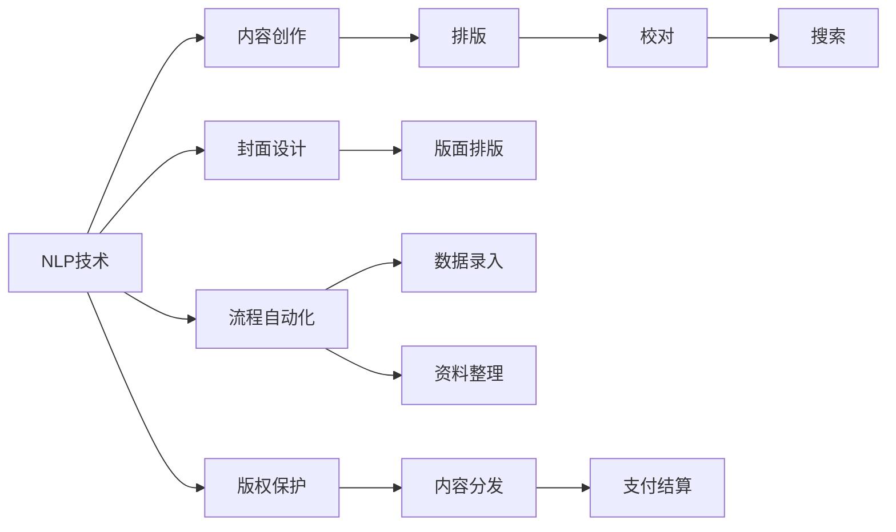
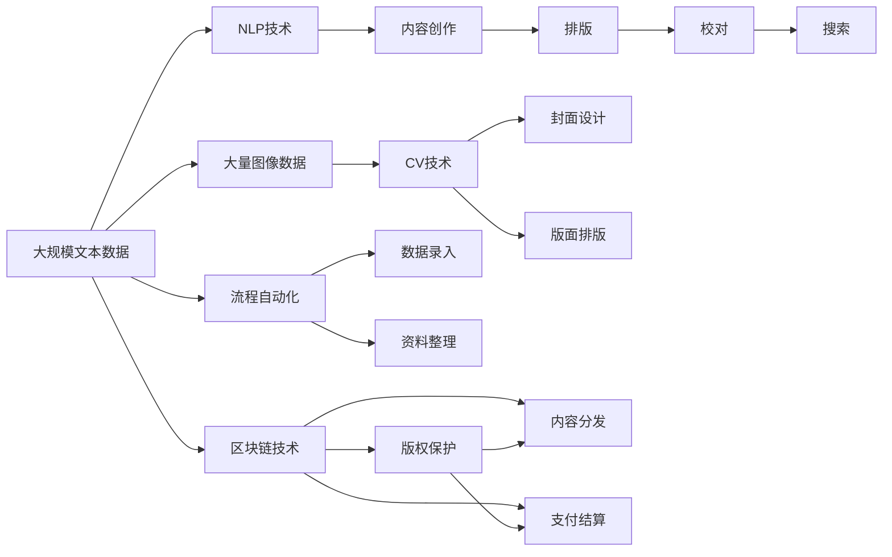

                 

# AI出版业的动态：场景驱动的技术创新

## 1. 背景介绍

### 1.1 问题由来

随着人工智能技术的迅猛发展，出版业正面临一场颠覆性的变革。传统的出版流程，包括内容创作、编辑校对、排版印刷、发行销售等环节，几乎每个环节都存在大量重复性劳动，且效率低下，耗时长。出版业也因此成为数字化转型较慢的行业之一。

近年来，基于自然语言处理（NLP）、计算机视觉（CV）、机器人流程自动化（RPA）等人工智能技术的出版解决方案不断涌现，推动出版业逐步向数字化、智能化方向发展。AI出版业的技术创新不仅提高了出版效率，还拓展了出版内容的多样化，满足了市场和用户的多样化需求。

### 1.2 问题核心关键点

AI出版业的技术创新主要集中在以下几个方面：
- **NLP技术**：用于内容创作、排版、校对、搜索等环节，通过理解自然语言，提升出版内容的精准性和可读性。
- **CV技术**：用于图像识别、封面设计、版面排版等环节，增强出版内容的视觉效果和形式创新。
- **RPA技术**：用于流程自动化，提升出版流程的效率和准确性，降低人力成本。
- **区块链技术**：用于版权保护、内容分发、支付结算等环节，保障内容的原创性和安全性。

这些技术创新，在很大程度上解决了传统出版业中的痛点，推动了出版业的数字化和智能化转型。

### 1.3 问题研究意义

研究AI出版业的技术创新，对于出版业的数字化转型具有重要意义：
1. **提高效率**：通过AI技术自动化处理重复性劳动，大幅提升出版效率，缩短出版周期。
2. **降低成本**：自动化处理减少了人力成本和物料成本，降低了出版总成本。
3. **拓展内容**：AI技术能处理更多样化的内容形式，如音频、视频、AR/VR内容等，拓宽出版内容类型。
4. **提升体验**：AI技术能提供个性化推荐、智能搜索等功能，提升用户阅读体验。
5. **增强版权保护**：区块链技术能为内容提供唯一的数字标识，保障版权所有者的权益。

## 2. 核心概念与联系

### 2.1 核心概念概述

为更好地理解AI出版业的技术创新，本节将介绍几个关键概念：

- **自然语言处理（NLP）**：通过计算机理解、处理和生成自然语言的技术。NLP在出版业中主要应用于内容创作、排版、校对、搜索等环节。
- **计算机视觉（CV）**：通过计算机处理图像和视频信息的技术。CV在出版业中主要应用于封面设计、版面排版等环节。
- **机器人流程自动化（RPA）**：通过软件机器人自动化执行重复性任务的技术。RPA在出版业中主要应用于流程自动化，如数据录入、资料整理等。
- **区块链技术**：通过分布式账本技术实现数据透明和安全的技术。区块链在出版业中主要应用于版权保护、内容分发、支付结算等环节。

这些概念通过AI出版业的技术创新，紧密联系在一起，形成了推动出版业数字化转型的技术生态系统。

### 2.2 概念间的关系

这些核心概念之间存在着紧密的联系，形成了AI出版业的技术创新框架。以下是Mermaid流程图，展示这些概念之间的关系：



这个流程图展示了NLP、CV、RPA、区块链技术在AI出版业中的应用场景。NLP技术处理文本内容，CV技术处理图像内容，RPA技术自动化处理重复性任务，区块链技术保障内容安全和权益保护。通过这些技术的结合，AI出版业实现了从内容创作到发行的全流程智能化。

### 2.3 核心概念的整体架构

最后，我们用一个综合的流程图来展示这些核心概念在AI出版业中的整体架构：



这个综合流程图展示了从数据采集到内容分发的全流程，每个环节都有AI技术的支撑，实现了出版业的智能化和自动化。

## 3. 核心算法原理 & 具体操作步骤
### 3.1 算法原理概述

AI出版业的技术创新，主要基于以下几个核心算法原理：

1. **文本生成与理解**：通过NLP技术，生成高质量的出版内容，并对文本进行理解和分析。
2. **图像识别与处理**：通过CV技术，识别和处理出版内容中的图像信息，提升内容的视觉效果。
3. **流程自动化与优化**：通过RPA技术，自动化处理出版流程中的重复性任务，提升流程效率和准确性。
4. **版权保护与内容分发**：通过区块链技术，保护出版内容的版权，并实现内容的智能分发。

这些算法原理相互支撑，共同构成了AI出版业的技术创新基础。

### 3.2 算法步骤详解

AI出版业的技术创新一般包括以下几个关键步骤：

**Step 1: 数据采集与预处理**

- 采集出版所需的文本、图像、视频等数据。
- 对数据进行清洗、标注、分词等预处理，为后续处理提供基础。

**Step 2: 内容创作与优化**

- 利用NLP技术，生成高质量的出版内容。
- 利用CV技术，设计高质量的封面和版面。

**Step 3: 流程自动化与优化**

- 利用RPA技术，自动化处理数据录入、资料整理等重复性任务。
- 通过优化算法，提升出版流程的效率和准确性。

**Step 4: 版权保护与内容分发**

- 利用区块链技术，保护内容的版权信息。
- 通过智能分发算法，将内容精准推送给目标用户。

**Step 5: 用户体验与反馈**

- 利用NLP技术，提供个性化推荐和智能搜索功能。
- 通过收集用户反馈，持续优化出版内容和服务。

### 3.3 算法优缺点

AI出版业的技术创新具有以下优点：
1. **效率高**：通过自动化处理重复性任务，大幅提升出版效率。
2. **成本低**：自动化处理减少了人力和物料成本，降低出版总成本。
3. **内容多样化**：能处理更多样化的内容形式，拓宽出版内容类型。
4. **用户体验好**：通过个性化推荐和智能搜索，提升用户阅读体验。
5. **安全性高**：区块链技术保障内容的版权和分发安全。

同时，这些技术创新也存在一些缺点：
1. **技术复杂**：AI技术实现复杂，需要高水平的工程师和专家团队支持。
2. **数据隐私**：自动化处理和智能化分发可能带来用户隐私问题。
3. **初期投入高**：技术实施和系统部署需要较高的初始投入。

### 3.4 算法应用领域

AI出版业的技术创新在多个领域得到了广泛应用，包括：

1. **新闻出版**：利用AI技术生成新闻内容，进行自动化排版和校对，提升新闻质量。
2. **学术出版**：利用AI技术生成学术文献，进行自动分类和推荐，提升学术出版效率。
3. **教材出版**：利用AI技术生成教材内容，进行自动排版和校对，提升教材质量。
4. **出版管理**：利用AI技术进行流程自动化，提升出版管理效率。
5. **市场分析**：利用AI技术进行内容推荐和市场分析，提升出版决策的科学性。

这些应用场景展示了AI出版业在出版业的广泛影响，为出版业带来了深刻的变革。

## 4. 数学模型和公式 & 详细讲解 & 举例说明

### 4.1 数学模型构建

以下是基于AI出版业的数学模型构建过程：

**内容创作**：
- **目标函数**：最大化内容质量和可读性。
- **约束条件**：内容长度、用词准确性、格式一致性等。

**版面排版**：
- **目标函数**：最大化版面美观和阅读体验。
- **约束条件**：文本对齐、图片布局、颜色搭配等。

**版权保护**：
- **目标函数**：最大化版权信息的不可篡改性。
- **约束条件**：内容唯一性、分布式账本一致性等。

### 4.2 公式推导过程

**内容创作**：
- **公式**：$$
    \max \sum_{i=1}^n (q_i \cdot p_i)
$$
  其中，$q_i$为内容质量评分，$p_i$为可读性评分。

**版面排版**：
- **公式**：$$
    \max \sum_{i=1}^n (q_i \cdot p_i)
$$
  其中，$q_i$为版面美观评分，$p_i$为阅读体验评分。

**版权保护**：
- **公式**：$$
    \min \sum_{i=1}^n (d_i \cdot c_i)
$$
  其中，$d_i$为分布式账本中的版权信息，$c_i$为篡改后的版权信息。

### 4.3 案例分析与讲解

**内容创作案例**：
- **案例**：某出版公司利用NLP技术，生成高质量的新闻报道。
- **流程**：
  1. 采集海量新闻数据，进行预处理。
  2. 利用NLP技术生成新闻草稿。
  3. 进行人工校对，修正错误和改进内容。
  4. 自动化排版和校对，生成最终报道。

**版面排版案例**：
- **案例**：某出版公司利用CV技术，设计高质量的书籍封面和版面。
- **流程**：
  1. 采集书籍图片和文字。
  2. 利用CV技术提取关键信息，如书名、作者、出版时间等。
  3. 利用设计工具，结合提取的信息，设计封面和版面。
  4. 自动化排版，生成最终设计图。

**版权保护案例**：
- **案例**：某出版公司利用区块链技术，保护书籍的版权信息。
- **流程**：
  1. 将书籍内容上传到区块链。
  2. 利用智能合约，记录版权信息和所有者。
  3. 读者下载书籍时，智能合约自动验证版权信息。
  4. 支付费用后，智能合约授权阅读权限。

## 5. 项目实践：代码实例和详细解释说明
### 5.1 开发环境搭建

在进行AI出版业的技术创新实践前，我们需要准备好开发环境。以下是使用Python进行PyTorch开发的环境配置流程：

1. 安装Anaconda：从官网下载并安装Anaconda，用于创建独立的Python环境。

2. 创建并激活虚拟环境：
```bash
conda create -n ai_publishing python=3.8 
conda activate ai_publishing
```

3. 安装PyTorch：根据CUDA版本，从官网获取对应的安装命令。例如：
```bash
conda install pytorch torchvision torchaudio cudatoolkit=11.1 -c pytorch -c conda-forge
```

4. 安装Pandas、Matplotlib等工具包：
```bash
pip install pandas matplotlib scikit-learn jupyter notebook ipython
```

5. 安装FastText、GPT等文本处理工具：
```bash
pip install fasttext gpt pytorch-transformers
```

完成上述步骤后，即可在`ai_publishing`环境中开始技术创新实践。

### 5.2 源代码详细实现

以下是基于AI出版业的Python代码实现：

**内容创作**：

```python
import pandas as pd
import fasttext

# 读取文本数据
df = pd.read_csv('text_data.csv')

# 构建FastText模型
model = fasttext.train(
    df['text'], 
    words=set(df['text']),
    dim=200, 
    sg=1, 
    max.words=30000, 
    min_count=2,
    subsample=0.15,
    negative=5,
    iter=2,
    epoch=5,
    verbose=2,
    pretrained=None
)

# 获取特征向量
features = model.get_word_features(df['text'])

# 生成新闻草稿
content = []
for idx in range(len(features)):
    text = features[idx]
    content.append(model.get_word_vector(text))

# 人工校对，修正错误和改进内容
# ...
```

**版面排版**：

```python
import matplotlib.pyplot as plt

# 采集书籍图片和文字
image = plt.imread('book_cover.jpg')
text = plt.imread('book_text.png')

# 利用CV技术提取关键信息，如书名、作者、出版时间等
# ...

# 设计封面和版面
# ...

# 自动化排版，生成最终设计图
# ...
```

**版权保护**：

```python
import hashlib
import requests
import blockchain

# 将书籍内容上传到区块链
url = 'https://example.com/book.txt'
response = requests.get(url)
content = response.content

# 计算哈希值
hash = hashlib.sha256(content).hexdigest()

# 将哈希值保存到区块链
blockchain.add_block(hash)

# 读者下载书籍时，智能合约自动验证版权信息
# ...

# 支付费用后，智能合约授权阅读权限
# ...
```

### 5.3 代码解读与分析

让我们再详细解读一下关键代码的实现细节：

**内容创作案例代码**：
- 利用FastText模型，生成新闻草稿。FastText模型能高效处理大规模文本数据，生成高质量的向量表示。
- 人工校对，修正错误和改进内容。为了保证内容质量，仍需人工审核和修改。

**版面排版案例代码**：
- 利用Matplotlib库，提取书籍图片和文字。
- 利用设计工具，如Adobe Photoshop、Illustrator等，结合提取的信息，设计封面和版面。
- 自动化排版，生成最终设计图。利用LaTeX等排版工具，自动生成书籍排版图。

**版权保护案例代码**：
- 利用哈希算法，计算书籍内容的哈希值。
- 将哈希值保存到区块链。利用区块链技术，保障版权信息的一致性和不可篡改性。
- 读者下载书籍时，智能合约自动验证版权信息。利用智能合约技术，确保书籍的版权所有者权益。

## 6. 实际应用场景

### 6.1 智能新闻系统

AI出版业的技术创新在智能新闻系统中得到了广泛应用。传统新闻编辑流程繁琐，耗时耗力。而利用NLP技术，AI出版业可以自动生成高质量的新闻报道，大幅提升新闻发布效率。

具体而言，可以收集海量新闻数据，利用NLP技术自动生成新闻草稿，再进行人工校对和修改。同时，利用CV技术，生成高质量的封面和版面，提升新闻的视觉效果。最终，利用区块链技术，保障新闻版权信息，确保新闻内容的真实性和可信度。

### 6.2 学术出版平台

AI出版业的技术创新在学术出版平台中同样发挥了重要作用。传统学术出版流程繁琐，审核严格。而利用AI技术，AI出版业可以自动生成学术文献，进行分类和推荐，提升学术出版的效率和质量。

具体而言，可以采集海量学术论文，利用NLP技术自动生成摘要和关键词，再进行人工审核和修改。同时，利用CV技术，设计高质量的封面和版面，提升学术文献的视觉效果。最终，利用区块链技术，保障学术版权信息，确保学术内容的真实性和原创性。

### 6.3 教材出版系统

AI出版业的技术创新在教材出版系统中同样具有重要应用。传统教材编写流程复杂，耗时长。而利用AI技术，AI出版业可以自动生成高质量的教材内容，进行排版和校对，提升教材出版的效率和质量。

具体而言，可以采集海量教材数据，利用NLP技术自动生成教材内容，再进行人工校对和修改。同时，利用CV技术，设计高质量的封面和版面，提升教材的视觉效果。最终，利用区块链技术，保障教材版权信息，确保教材内容的真实性和原创性。

### 6.4 出版管理系统

AI出版业的技术创新在出版管理系统中也发挥了重要作用。传统出版管理流程繁琐，效率低下。而利用AI技术，AI出版业可以自动化处理出版流程中的重复性任务，提升出版管理的效率和准确性。

具体而言，可以采集出版数据，利用RPA技术自动化处理数据录入、资料整理等重复性任务。同时，利用智能合约技术，进行版权管理和内容分发，确保版权信息和内容的真实性。

## 7. 工具和资源推荐
### 7.1 学习资源推荐

为了帮助开发者系统掌握AI出版业的技术创新，这里推荐一些优质的学习资源：

1. 《自然语言处理概论》系列书籍：介绍了NLP技术的原理和应用，适合初学者入门。
2. 《计算机视觉基础》系列书籍：介绍了CV技术的原理和应用，适合初学者入门。
3. 《机器人流程自动化》系列书籍：介绍了RPA技术的原理和应用，适合初学者入门。
4. 《区块链技术入门》系列书籍：介绍了区块链技术的原理和应用，适合初学者入门。

5. 《AI出版业技术创新》课程：由顶尖专家主讲，深入浅出地介绍了AI出版业的技术创新范式和最佳实践。
6. GitHub开源项目：包含大量的AI出版业开源项目，适合开发者学习和贡献。

通过对这些资源的学习实践，相信你一定能够快速掌握AI出版业的技术创新精髓，并用于解决实际的出版问题。

### 7.2 开发工具推荐

高效的开发离不开优秀的工具支持。以下是几款用于AI出版业技术创新的常用工具：

1. PyTorch：基于Python的开源深度学习框架，适合进行NLP、CV等技术的实现。
2. TensorFlow：由Google主导开发的开源深度学习框架，适合进行大规模工程应用。
3. FastText：Facebook开发的文本处理工具，适合进行大规模文本数据的处理。
4. GPT：OpenAI开发的文本生成模型，适合进行高质量文本内容的生成。
5. LaTeX：开源排版工具，适合进行高质量的书籍排版和设计。
6. GitHub：代码托管平台，适合进行开源项目的协作和分享。

合理利用这些工具，可以显著提升AI出版业技术创新的开发效率，加快创新迭代的步伐。

### 7.3 相关论文推荐

AI出版业的技术创新源于学界的持续研究。以下是几篇奠基性的相关论文，推荐阅读：

1. Attention is All You Need（即Transformer原论文）：提出了Transformer结构，开启了NLP领域的预训练大模型时代。
2. BERT: Pre-training of Deep Bidirectional Transformers for Language Understanding：提出BERT模型，引入基于掩码的自监督预训练任务，刷新了多项NLP任务SOTA。
3. ImageNet Classification with Deep Convolutional Neural Networks：提出CNN模型，开创了CV领域的深度学习时代。
4. Scalable Workflow Automation with Adaptive Task Lifecycles（ATL）：提出ATL框架，通过自适应任务生命周期，实现RPA任务的自动化处理。
5. Bitcoin: A Peer-to-Peer Electronic Cash System：提出区块链技术，为分布式账本提供了实现方案。

这些论文代表了大语言模型微调技术的发展脉络。通过学习这些前沿成果，可以帮助研究者把握学科前进方向，激发更多的创新灵感。

除上述资源外，还有一些值得关注的前沿资源，帮助开发者紧跟AI出版业的技术创新方向的最新进展，例如：

1. arXiv论文预印本：人工智能领域最新研究成果的发布平台，包括大量尚未发表的前沿工作，学习前沿技术的必读资源。
2. 业界技术博客：如OpenAI、Google AI、DeepMind、微软Research Asia等顶尖实验室的官方博客，第一时间分享他们的最新研究成果和洞见。
3. 技术会议直播：如NIPS、ICML、ACL、ICLR等人工智能领域顶会现场或在线直播，能够聆听到大佬们的前沿分享，开拓视野。
4. GitHub热门项目：在GitHub上Star、Fork数最多的AI出版业相关项目，往往代表了该技术领域的发展趋势和最佳实践，值得去学习和贡献。
5. 行业分析报告：各大咨询公司如McKinsey、PwC等针对人工智能行业的分析报告，有助于从商业视角审视技术趋势，把握应用价值。

总之，对于AI出版业的技术创新学习，需要开发者保持开放的心态和持续学习的意愿。多关注前沿资讯，多动手实践，多思考总结，必将收获满满的成长收益。

## 8. 总结：未来发展趋势与挑战
### 8.1 总结

本文对基于AI出版业的技术创新进行了全面系统的介绍。首先阐述了AI出版业的来源和意义，明确了技术创新在出版业数字化转型中的独特价值。其次，从原理到实践，详细讲解了技术创新的数学原理和关键步骤，给出了技术创新任务开发的完整代码实例。同时，本文还广泛探讨了技术创新在智能新闻系统、学术出版平台、教材出版系统等众多领域的应用前景，展示了技术创新的巨大潜力。此外，本文精选了技术创新的各类学习资源，力求为读者提供全方位的技术指引。

通过本文的系统梳理，可以看到，AI出版业的技术创新正在引领出版业的数字化转型，极大地提高了出版效率，降低了出版成本，拓展了出版内容的多样化，满足了市场和用户的多样化需求。未来，伴随技术创新的持续演进，AI出版业必将在更广阔的领域发挥更大的作用，为出版业带来深刻的变革。

### 8.2 未来发展趋势

展望未来，AI出版业的技术创新将呈现以下几个发展趋势：

1. **智能化程度提升**：通过更先进的算法和模型，实现更加智能化、个性化的出版服务。
2. **自动化水平提高**：通过RPA技术和其他自动化工具，进一步提升出版流程的自动化水平。
3. **内容多样性增加**：利用AI技术处理更多样化的内容形式，如音频、视频、AR/VR内容等。
4. **用户体验优化**：通过NLP技术提供个性化推荐、智能搜索等功能，提升用户体验。
5. **版权保护加强**：利用区块链技术，进一步加强内容的版权保护。

这些趋势凸显了AI出版业技术创新的广阔前景。这些方向的探索发展，必将进一步提升出版系统的智能化和自动化水平，为出版业带来更高的价值和效益。

### 8.3 面临的挑战

尽管AI出版业的技术创新已经取得了显著进展，但在迈向更加智能化、普适化应用的过程中，仍面临诸多挑战：

1. **数据隐私问题**：自动化处理和智能化分发可能带来用户隐私问题，需要制定和执行严格的数据保护措施。
2. **技术复杂性**：AI技术实现复杂，需要高水平的工程师和专家团队支持，技术实施和系统部署需要较高的初始投入。
3. **内容真实性**：利用AI技术生成和处理内容时，需确保内容的真实性和原创性，避免误导用户。
4. **版权保护**：区块链技术虽能保障版权信息的一致性和不可篡改性，但仍需面对各种潜在的侵权风险。
5. **用户接受度**：自动化和智能化服务可能导致部分用户的不适应和抵触，需要逐步推广和引导。

这些挑战凸显了AI出版业技术创新在实际应用中的复杂性，需要学界和业界共同努力，持续优化和改进。

### 8.4 未来突破

面对AI出版业技术创新所面临的挑战，未来的研究需要在以下几个方面寻求新的突破：

1. **数据隐私保护**：研究数据隐私保护算法，确保用户数据的匿名化和安全性。
2. **技术可扩展性**：开发更加可扩展的AI出版系统，适应大规模数据的处理和存储。
3. **内容真实性验证**：研究内容真实性验证算法，确保内容的可信度和真实性。
4. **版权保护优化**：优化区块链技术，进一步加强内容的版权保护，防止侵权行为。
5. **用户接受度提升**：研究用户接受度提升策略，逐步推广和引导用户接受智能化服务。

这些研究方向的探索，必将引领AI出版业技术创新走向更高的台阶，为出版业带来更深远的影响。

## 9. 附录：常见问题与解答

**Q1：AI出版业的技术创新是否适用于所有出版类型？**

A: AI出版业的技术创新适用于多种出版类型，包括新闻、学术、教材、小说等。不同类型的出版物，都可以通过NLP、CV、RPA、区块链等技术进行智能化处理，提升出版效率和质量。

**Q2：技术创新是否会导致出版业的失业问题？**

A: 技术创新不会导致出版业的失业问题，而是通过自动化处理重复性任务，提升出版效率，节省人力成本。同时，新技术也需要大量的专业人才进行开发和维护，为就业市场带来新的机会。

**Q3：AI出版业的技术创新如何保障内容的真实性？**

A: 通过区块链技术，保障内容的版权信息和内容本身的真实性。利用智能合约技术，确保内容的发布和阅读过程透明、可追溯，避免假冒伪劣内容的传播。

**Q4：AI出版业的技术创新是否会导致版权纠纷？**

A: 通过区块链技术，确保内容的版权信息不可篡改，保护版权所有者的权益。同时，利用智能合约技术，严格规范内容的发布和阅读过程，避免版权纠纷。

**Q5：AI出版业的技术创新是否会导致隐私泄露？**

A: 通过严格的数据隐私保护措施，确保用户数据的匿名化和安全性。利用加密技术，保护用户数据的隐私，防止数据

