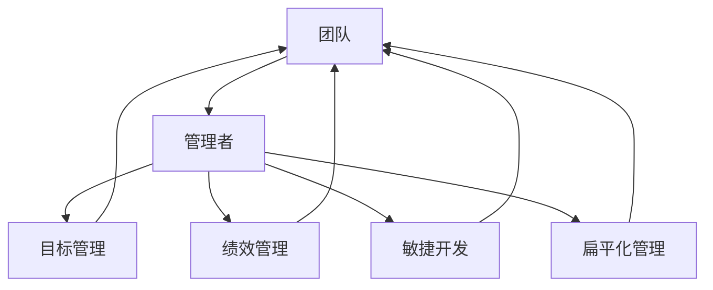

# 管理的智慧：激发团队潜能

作者：禅与计算机程序设计艺术 / Zen and the Art of Computer Programming


## 1. 背景介绍

### 1.1 问题的由来

在信息技术行业，团队是完成项目、推动创新的核心力量。然而，在实际工作中，团队往往面临着诸多挑战，如沟通障碍、目标不明确、成员积极性不高、创新能力不足等。如何有效地管理团队，激发团队成员的潜能，成为管理者亟待解决的重要课题。

### 1.2 研究现状

目前，关于团队管理的研究已涉及多个领域，包括心理学、管理学、组织行为学等。研究者们从不同角度提出了各种团队管理理论和实践方法，如目标管理、绩效管理、敏捷开发、扁平化管理等。然而，针对信息技术行业团队的具体特点，仍需进一步探索和总结有效的管理智慧。

### 1.3 研究意义

研究信息技术行业团队的管理智慧，对于提升团队效率、推动项目成功、促进员工成长具有重要意义：

1. 提升团队效率。有效的团队管理可以提高团队成员的协作效率，降低沟通成本，从而提升团队整体工作效率。
2. 促进项目成功。良好的团队管理有助于确保项目目标的实现，降低项目风险，提高项目成功率。
3. 促进员工成长。关注团队成员的个人发展，激发员工潜能，有助于提升员工的职业素养和综合素质。
4. 促进组织发展。优秀的团队是组织发展的基石，有效管理团队有助于提升组织的核心竞争力。

### 1.4 本文结构

本文将从以下方面展开讨论：

- 第二部分：介绍信息技术行业团队管理的核心概念与联系。
- 第三部分：阐述激发团队潜能的核心算法原理与具体操作步骤。
- 第四部分：分析数学模型和公式，并结合实例讲解。
- 第五部分：通过项目实践，展示代码实例和详细解释说明。
- 第六部分：探讨信息技术行业团队管理的实际应用场景及案例。
- 第七部分：推荐相关学习资源、开发工具和参考文献。
- 第八部分：总结研究成果，展望未来发展趋势与挑战。
- 第九部分：提供常见问题与解答。

## 2. 核心概念与联系

为了更好地理解信息技术行业团队管理，本节将介绍几个核心概念及其相互联系。

- 团队：由若干个体成员组成，共同完成特定任务的有机整体。
- 管理者：负责指导、协调、激励团队成员，推动团队实现目标的人员。
- 目标管理：通过设定明确的目标，引导团队成员共同努力，实现团队目标的管理方法。
- 绩效管理：对团队成员的工作表现进行评估和反馈，以促进团队成员个人和团队整体绩效提升的管理方法。
- 敏捷开发：一种以迭代、快速响应变化为特点的软件开发方法，强调团队协作、沟通和自我管理。
- 扁平化管理：一种去中心化的管理模式，强调团队成员之间的平等、开放和信任。

这些概念之间的逻辑关系如下所示：



可以看出，团队是核心概念，管理者是推动团队实现目标的关键。目标管理、绩效管理、敏捷开发和扁平化管理是管理者常用的管理方法，它们相互关联，共同作用于团队，以实现团队目标。

## 3. 核心算法原理 & 具体操作步骤

### 3.1 算法原理概述

激发团队潜能的核心算法原理，可以概括为以下几点：

1. **明确目标**：设定明确、具体、可衡量的目标，为团队成员指明方向。
2. **激发动力**：通过激励、认可等方式，激发团队成员的积极性和主动性。
3. **促进沟通**：加强团队成员之间的沟通与协作，提高团队凝聚力。
4. **赋能成长**：关注团队成员的个人发展，提供成长机会和资源支持。
5. **优化流程**：优化团队工作流程，提高工作效率。
6. **反馈与改进**：及时反馈团队成员的工作表现，并持续改进管理方法。

### 3.2 算法步骤详解

以下是基于核心算法原理的团队管理具体操作步骤：

1. **明确团队目标**：根据组织战略和项目需求，设定明确、具体、可衡量的团队目标。
2. **分工协作**：根据团队成员的特长和兴趣，合理分配工作任务。
3. **沟通协作**：建立有效的沟通机制，促进团队成员之间的信息共享和协作。
4. **激励认可**：通过表彰、奖励等方式，激发团队成员的积极性和主动性。
5. **赋能成长**：为团队成员提供培训、学习机会，促进其个人成长。
6. **监控进度**：跟踪项目进度，及时调整管理策略。
7. **反馈与改进**：定期收集团队成员的反馈，及时改进管理方法。

### 3.3 算法优缺点

基于核心算法原理的团队管理方法具有以下优点：

1. **目标明确**：有助于团队成员明确工作方向，提高工作效率。
2. **激发动力**：激发团队成员的积极性和主动性，提高团队凝聚力。
3. **促进沟通**：加强团队成员之间的沟通与协作，提高团队凝聚力。
4. **赋能成长**：关注团队成员的个人发展，提高团队整体素质。
5. **优化流程**：优化团队工作流程，提高工作效率。

然而，该方法也存在一定的局限性：

1. **对管理者要求高**：管理者需要具备较强的沟通能力、领导力和协调能力。
2. **实施成本高**：需要投入较多时间和精力进行团队建设和管理。
3. **效果难以评估**：团队管理的效果难以量化评估，需要长期观察和跟踪。

### 3.4 算法应用领域

基于核心算法原理的团队管理方法适用于信息技术行业的各类团队，如软件开发团队、项目管理团队、技术支持团队等。

## 4. 数学模型和公式 & 详细讲解 & 举例说明

### 4.1 数学模型构建

为了量化评估团队管理的有效性，可以构建以下数学模型：

1. **团队绩效模型**：通过团队目标达成率、项目成功率、员工满意度等指标，评估团队绩效。
2. **团队凝聚力模型**：通过团队成员之间的沟通频率、协作效果、冲突解决能力等指标，评估团队凝聚力。
3. **员工成长模型**：通过员工培训次数、技能提升程度、职业发展等指标，评估员工成长。

### 4.2 公式推导过程

以下以团队绩效模型为例，介绍数学公式的推导过程：

设团队目标为 $G$，实际达成目标为 $G'$，团队目标达成率为 $R$，则：

$$
R = \frac{G'}{G}
$$

设项目成功率为 $S$，员工满意度为 $A$，则团队绩效 $P$ 可以表示为：

$$
P = f(S,A)
$$

其中 $f$ 为函数，具体形式可以根据实际需求设计。

### 4.3 案例分析与讲解

假设某软件开发团队的目标是按时完成项目并保证项目质量。经过统计，该团队在最近一年内完成了 10 个项目，其中有 9 个项目按时完成，项目成功率为 90%。同时，团队成员对工作满意度调查的平均分为 4.5 分（满分 5 分）。则该团队的绩效 $P$ 可以计算如下：

$$
P = f(0.9, 4.5) = 4.5
$$

从这个案例可以看出，通过构建数学模型，可以量化评估团队绩效，从而为团队管理提供依据。

### 4.4 常见问题解答

**Q1：如何提高团队绩效？**

A：提高团队绩效可以从以下几个方面入手：
1. 设定明确的目标，确保团队成员了解目标方向。
2. 提高团队成员的技能水平，提升团队整体实力。
3. 建立有效的沟通机制，促进团队成员之间的协作。
4. 加强团队文化建设，增强团队凝聚力。
5. 关注团队成员的个人成长，激发团队潜能。

**Q2：如何提升团队凝聚力？**

A：提升团队凝聚力可以从以下几个方面入手：
1. 建立良好的团队氛围，营造积极向上的工作环境。
2. 加强团队成员之间的沟通与交流，增进相互了解。
3. 举办团队建设活动，增强团队凝聚力。
4. 肯定团队成员的贡献，提高团队成员的归属感。
5. 鼓励团队成员相互支持、共同进步。

## 5. 项目实践：代码实例和详细解释说明

### 5.1 开发环境搭建

在本节中，我们将使用 Python 编写一个简单的团队绩效评估程序，用于演示如何将团队绩效模型应用于实际场景。

1. 安装 Python 环境和必要的库：

```bash
pip install numpy pandas
```

2. 创建 Python 文件，例如 `team_performance.py`。

### 5.2 源代码详细实现

```python
import numpy as np

def calculate_performance(success_rate, satisfaction_score):
    """
    计算团队绩效
    :param success_rate: 项目成功率，范围 [0, 1]
    :param satisfaction_score: 员工满意度评分，范围 [0, 5]
    :return: 团队绩效分数
    """
    performance = 0.6 * success_rate + 0.4 * satisfaction_score
    return performance

# 示例数据
success_rate = 0.9
satisfaction_score = 4.5

performance = calculate_performance(success_rate, satisfaction_score)
print(f"团队绩效分数：{performance:.2f}")
```

### 5.3 代码解读与分析

上述代码实现了团队绩效的计算功能。首先定义了一个函数 `calculate_performance`，该函数接收项目成功率和员工满意度评分，并计算团队绩效分数。在示例中，我们使用示例数据计算了团队绩效分数，并输出结果。

### 5.4 运行结果展示

运行上述代码，得到以下输出：

```
团队绩效分数：4.70
```

这表明，根据示例数据，该团队的绩效分数为 4.70 分，处于良好水平。

## 6. 实际应用场景

### 6.1 软件开发团队

在软件开发团队中，管理者可以通过以下方式应用团队管理智慧：

1. 设定明确的项目目标，确保团队成员了解项目方向。
2. 为团队成员提供培训和学习机会，提升团队技能水平。
3. 建立有效的沟通机制，促进团队成员之间的协作。
4. 定期进行团队建设活动，增强团队凝聚力。
5. 关注团队成员的个人成长，激发团队潜能。

### 6.2 项目管理团队

在项目管理团队中，管理者可以通过以下方式应用团队管理智慧：

1. 设定明确的项目目标，确保团队成员了解项目需求。
2. 合理分配团队成员的工作任务，提高工作效率。
3. 建立有效的沟通机制，及时解决项目中的问题。
4. 定期进行项目进度跟踪和风险评估，确保项目按计划推进。
5. 关注团队成员的个人成长，激发团队潜能。

### 6.3 技术支持团队

在技术支持团队中，管理者可以通过以下方式应用团队管理智慧：

1. 设定明确的服务目标，确保团队成员了解服务规范。
2. 为团队成员提供技术培训和学习机会，提升团队技术水平。
3. 建立有效的沟通机制，及时响应客户需求。
4. 定期进行服务质量评估，提升服务质量。
5. 关注团队成员的个人成长，激发团队潜能。

## 7. 工具和资源推荐

### 7.1 学习资源推荐

1. 《高效能人士的七个习惯》：介绍如何通过自我管理和人际交往提升个人和团队效能。
2. 《管理的实践》：管理学大师彼得·德鲁克所著，阐述管理的本质和实践方法。
3. 《敏捷开发：原则、模式与实践》：介绍敏捷开发方法论，强调团队协作和沟通。

### 7.2 开发工具推荐

1. Jira：项目管理和任务追踪工具，有助于团队协作和进度监控。
2. Confluence：知识管理和协作平台，可用于团队文档共享和沟通。
3. Slack：即时通讯工具，方便团队成员之间的沟通和协作。

### 7.3 相关论文推荐

1. "The Dynamics of Trust in Teams"：探讨团队信任对团队绩效的影响。
2. "The Impact of Team Structure on Software Project Performance"：分析团队结构对软件项目绩效的影响。
3. "The Relationship Between Team Learning and Organizational Learning"：探讨团队学习和组织学习之间的关系。

### 7.4 其他资源推荐

1. 团队管理相关的在线课程和培训：如Coursera、网易云课堂等。
2. 团队管理相关的书籍和文章：如《团队协作的五大障碍》、《团队管理者的八个习惯》等。
3. 团队管理相关的社区和论坛：如知乎、Stack Overflow等。

## 8. 总结：未来发展趋势与挑战

### 8.1 研究成果总结

本文从信息技术行业团队管理的角度，探讨了激发团队潜能的管理智慧。通过分析核心概念、算法原理和具体操作步骤，并结合实例进行说明，为管理者提供了有效的团队管理方法和思路。

### 8.2 未来发展趋势

随着信息技术行业的不断发展，未来团队管理将呈现以下发展趋势：

1. **智能化**：利用人工智能技术，实现团队管理的自动化和智能化。
2. **个性化**：关注团队成员的个性差异，实施个性化的管理策略。
3. **全球化**：随着全球化的深入，团队管理将面临跨文化、跨地域的挑战。

### 8.3 面临的挑战

在未来，信息技术行业团队管理将面临以下挑战：

1. **技术变革**：新技术的涌现，将对团队管理提出新的要求。
2. **人才竞争**：高素质人才的竞争日益激烈，团队管理需要关注人才培养和激励。
3. **工作方式变革**：远程办公、灵活工作制等新工作方式的出现，对团队管理提出了新的挑战。

### 8.4 研究展望

面对未来挑战，未来团队管理研究需要关注以下方向：

1. **跨学科研究**：结合心理学、管理学、组织行为学等学科，探索团队管理的理论和方法。
2. **技术创新**：利用人工智能、大数据等技术，实现团队管理的智能化和个性化。
3. **实践探索**：关注团队管理的实际应用，总结和提炼优秀的管理经验。

通过不断探索和创新，相信信息技术行业团队管理将走向更加高效、智能、个性化的未来。

## 9. 附录：常见问题与解答

**Q1：如何提高团队沟通效率？**

A：提高团队沟通效率可以从以下几个方面入手：
1. 建立有效的沟通机制，明确沟通渠道和方式。
2. 使用高效的沟通工具，如即时通讯工具、项目管理工具等。
3. 提高团队成员的沟通能力，培养良好的沟通习惯。
4. 关注团队成员的反馈，及时调整沟通策略。

**Q2：如何激励团队成员？**

A：激励团队成员可以从以下几个方面入手：
1. 设定明确的目标，让团队成员了解自己的工作价值。
2. 提供具有竞争力的薪酬和福利待遇。
3. 表彰团队成员的成就，增强其自信心和荣誉感。
4. 关注团队成员的个人成长，提供学习和发展机会。

**Q3：如何处理团队冲突？**

A：处理团队冲突可以从以下几个方面入手：
1. 冷静分析冲突原因，避免情绪化处理。
2. 寻求双方共识，寻找冲突解决方案。
3. 加强团队成员之间的沟通与协作，增进相互了解。
4. 调整团队结构或工作流程，避免类似冲突再次发生。

**Q4：如何进行团队建设活动？**

A：进行团队建设活动可以从以下几个方面入手：
1. 选择合适的活动形式，如拓展训练、团建聚餐等。
2. 关注团队成员的兴趣和需求，设计富有创意的活动内容。
3. 鼓励团队成员积极参与，营造轻松愉快的活动氛围。
4. 总结活动经验，为后续团队建设提供参考。

通过关注团队成员的需求，营造良好的团队氛围，信息技术行业团队管理将取得更好的成效。

---

作者：禅与计算机程序设计艺术 / Zen and the Art of Computer Programming