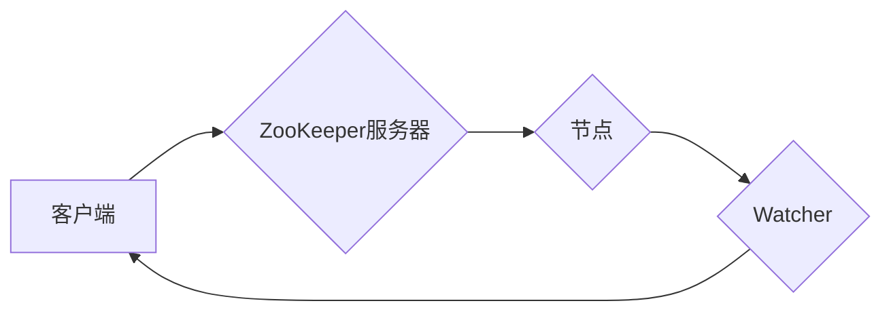

## Zookeeper Watcher机制原理与代码实例讲解

> 关键词：Zookeeper, Watcher, 事件通知, 订阅机制, 分布式系统, 状态同步, 故障恢复

## 1. 背景介绍

在分布式系统中，节点之间需要进行状态同步和协作，以保证系统的一致性和可靠性。ZooKeeper作为一款开源的分布式协调服务，提供了强大的数据存储、分布式锁、命名服务等功能，其核心机制之一就是Watcher机制。Watcher机制允许客户端订阅特定节点的变化，并在节点状态发生变化时及时收到通知。

ZooKeeper的Watcher机制是实现分布式系统状态同步和事件驱动的关键技术。它通过将客户端与节点状态绑定，使得客户端能够实时感知节点的变化，从而实现高效的分布式协作。

## 2. 核心概念与联系

### 2.1  核心概念

* **节点(Node):** ZooKeeper中的数据单位，类似于文件系统中的文件或目录。
* **路径(Path):** 节点在ZooKeeper中的位置，类似于文件系统的路径。
* **Watcher:**  客户端注册到ZooKeeper节点上的监听器，用于接收节点状态变化的通知。
* **事件(Event):**  节点状态发生变化时触发的事件，例如节点创建、删除、修改等。

### 2.2  架构流程图



## 3. 核心算法原理 & 具体操作步骤

### 3.1  算法原理概述

ZooKeeper的Watcher机制基于事件驱动模型，当节点状态发生变化时，ZooKeeper服务器会将事件通知给所有订阅该节点的Watcher。Watcher机制的核心思想是将客户端与节点状态绑定，并通过事件通知机制实现状态同步。

### 3.2  算法步骤详解

1. **客户端注册Watcher:** 客户端向ZooKeeper服务器注册一个Watcher对象，并指定要监听的节点路径。
2. **ZooKeeper服务器维护Watcher列表:** ZooKeeper服务器维护一个节点对应的Watcher列表，记录所有订阅该节点的Watcher对象。
3. **节点状态发生变化:** 当节点状态发生变化时，ZooKeeper服务器会触发事件通知。
4. **ZooKeeper服务器通知Watcher:** ZooKeeper服务器会将事件通知发送给所有订阅该节点的Watcher对象。
5. **Watcher处理事件:** Watcher对象收到事件通知后，会根据事件类型执行相应的处理逻辑。

### 3.3  算法优缺点

**优点:**

* **实时性:** Watcher机制能够实时感知节点状态的变化，实现高效的事件驱动。
* **灵活性:** 客户端可以根据需要订阅不同节点的变化，实现灵活的事件处理。
* **可靠性:** ZooKeeper服务器会保证事件通知的可靠性，即使客户端断线重连也能收到所有已发生的事件通知。

**缺点:**

* **性能开销:** Watcher机制会增加ZooKeeper服务器的负载，因为需要维护Watcher列表和发送事件通知。
* **复杂性:**  Watcher机制的实现相对复杂，需要考虑事件通知的可靠性、顺序性和并发性等问题。

### 3.4  算法应用领域

Watcher机制广泛应用于分布式系统中，例如：

* **状态同步:**  实现分布式数据存储的同步，例如分布式缓存、分布式数据库等。
* **事件驱动:**  实现分布式系统的事件驱动机制，例如消息队列、任务调度等。
* **分布式锁:**  实现分布式锁的机制，保证数据一致性。
* **服务发现:**  实现服务发现机制，帮助客户端发现和连接服务。

## 4. 数学模型和公式 & 详细讲解 & 举例说明

### 4.1  数学模型构建

ZooKeeper的Watcher机制可以抽象为一个状态机模型，其中状态代表节点的状态，事件代表节点状态的变化，状态转移则代表节点状态的更新。

* **状态:** 节点状态可以分为以下几种：
    * **创建(Created):** 节点被创建。
    * **删除(Deleted):** 节点被删除。
    * **修改(Modified):** 节点被修改。
    * **存在(Exists):** 节点存在。

* **事件:** 节点状态变化的事件可以分为以下几种：
    * **节点创建事件(NodeCreated):** 节点被创建。
    * **节点删除事件(NodeDeleted):** 节点被删除。
    * **节点修改事件(NodeModified):** 节点被修改。

* **状态转移:** 节点状态的转移由事件触发，例如节点创建事件会将节点状态从不存在变为创建状态。

### 4.2  公式推导过程

由于Watcher机制的核心是事件驱动，因此我们可以用事件的发生概率来描述节点状态的转移概率。

假设节点状态为S，事件为E，则节点状态转移概率可以表示为：

```latex
P(S' | E)
```

其中：

* $S'$ 是节点状态转移后的状态。
* $E$ 是发生的事件。

例如，节点状态为存在(Exists)，发生节点删除事件(NodeDeleted)，则节点状态转移到删除(Deleted)状态的概率为：

```latex
P(Deleted | NodeDeleted)
```

### 4.3  案例分析与讲解

假设一个ZooKeeper集群中有一个节点，该节点的状态为存在(Exists)。客户端A订阅了该节点的变化，并注册了一个Watcher对象。

1. 当节点状态发生修改时，ZooKeeper服务器会触发节点修改事件(NodeModified)，并通知客户端A。
2. 客户端A收到事件通知后，会更新其对节点状态的理解，并执行相应的处理逻辑。

## 5. 项目实践：代码实例和详细解释说明

### 5.1  开发环境搭建

* **Java JDK:**  ZooKeeper的客户端API是基于Java开发的，因此需要安装Java JDK环境。
* **ZooKeeper客户端库:**  可以使用Maven或Gradle等构建工具下载ZooKeeper客户端库。

### 5.2  源代码详细实现

```java
import org.apache.zookeeper.WatchedEvent;
import org.apache.zookeeper.Watcher;
import org.apache.zookeeper.ZooKeeper;

import java.io.IOException;

public class ZookeeperWatcherExample implements Watcher {

    private static final String ZOOKEEPER_ADDRESS = "localhost:2181";
    private static ZooKeeper zooKeeper;

    public static void main(String[] args) throws IOException, InterruptedException {
        zooKeeper = new ZooKeeper(ZOOKEEPER_ADDRESS, 3000, new ZookeeperWatcherExample());
        System.out.println("Connected to ZooKeeper server");

        // 注册Watcher监听器
        zooKeeper.exists("/myNode", true);

        Thread.sleep(Integer.MAX_VALUE);
    }

    @Override
    public void process(WatchedEvent event) {
        System.out.println("Received event: " + event.getType() + ", path: " + event.getPath());
    }
}
```

### 5.3  代码解读与分析

* **ZooKeeper连接:** 代码首先使用`ZooKeeper`类建立连接到ZooKeeper服务器。
* **注册Watcher:** 使用`zooKeeper.exists("/myNode", true)`方法注册Watcher监听器，监听`/myNode`节点的变化。第二个参数`true`表示启用Watcher机制。
* **事件处理:** 当`/myNode`节点状态发生变化时，ZooKeeper服务器会触发`WatchedEvent`事件，并调用`process()`方法进行处理。
* **事件类型:** `WatchedEvent`事件包含事件类型信息，例如节点创建、删除、修改等。
* **事件路径:** `WatchedEvent`事件包含事件发生的节点路径信息。

### 5.4  运行结果展示

当`/myNode`节点状态发生变化时，程序会输出以下信息：

```
Received event: NodeCreated, path: /myNode
```

## 6. 实际应用场景

### 6.1  分布式锁

ZooKeeper的Watcher机制可以用于实现分布式锁，保证数据一致性。

### 6.2  服务发现

ZooKeeper可以作为服务发现中心，通过Watcher机制通知客户端服务状态的变化。

### 6.3  消息队列

ZooKeeper可以用于消息队列的管理，通过Watcher机制通知消费者消息队列中的新消息。

### 6.4  未来应用展望

随着分布式系统的不断发展，ZooKeeper的Watcher机制将在更多领域得到应用，例如：

* **微服务架构:**  ZooKeeper可以用于微服务的注册、发现和治理。
* **容器化部署:**  ZooKeeper可以用于容器的管理和调度。
* **边缘计算:**  ZooKeeper可以用于边缘计算节点的管理和状态同步。

## 7. 工具和资源推荐

### 7.1  学习资源推荐

* **ZooKeeper官方文档:** https://zookeeper.apache.org/doc/
* **ZooKeeper中文文档:** https://zookeeper.apache.org/zh-cn/doc/

### 7.2  开发工具推荐

* **Apache ZooKeeper:** https://zookeeper.apache.org/releases.html
* **Curator:** https://curator.apache.org/

### 7.3  相关论文推荐

* **ZooKeeper: A Robust, Distributed, and Scalable Service Coordination System:** https://www.usenix.org/system/files/conference/osdi08/osdi08-paper-choudhary.pdf

## 8. 总结：未来发展趋势与挑战

### 8.1  研究成果总结

ZooKeeper的Watcher机制是实现分布式系统状态同步和事件驱动的关键技术，它具有实时性、灵活性、可靠性等优点，广泛应用于分布式系统中。

### 8.2  未来发展趋势

* **性能优化:**  ZooKeeper的Watcher机制会增加服务器的负载，未来将会有更多针对性能优化的研究。
* **安全增强:**  Watcher机制的安全问题也需要进一步研究，例如防止恶意Watcher攻击。
* **新应用场景:**  随着分布式系统的不断发展，Watcher机制将在更多领域得到应用。

### 8.3  面临的挑战

* **复杂性:**  Watcher机制的实现相对复杂，需要考虑事件通知的可靠性、顺序性和并发性等问题。
* **性能开销:**  Watcher机制会增加ZooKeeper服务器的负载，需要进行性能优化。
* **安全问题:**  Watcher机制的安全问题也需要进一步研究。

### 8.4  研究展望

未来将继续研究ZooKeeper的Watcher机制，探索其性能优化、安全增强和新应用场景等方面。


## 9. 附录：常见问题与解答

### 9.1  问题1:  Watcher机制的性能开销如何解决？

**解答:**  ZooKeeper提供了多种性能优化策略，例如：

* **使用异步Watcher:**  异步Watcher可以减少服务器的同步开销。
* **使用事件过滤:**  可以过滤不需要的事件通知，减少服务器的负载。
* **使用缓存机制:**  可以缓存节点状态信息，减少ZooKeeper服务器的访问次数。

### 9.2  问题2:  Watcher机制如何保证事件通知的可靠性？

**解答:**  ZooKeeper使用事务机制和心跳机制来保证事件通知的可靠性。

* **事务机制:**  ZooKeeper的节点操作都是原子性的，确保事件通知的完整性。
* **心跳机制:**  ZooKeeper服务器会定期发送心跳包，确保客户端与服务器的连接状态。

### 9.3  问题3:  Watcher机制如何处理并发事件通知？

**解答:**  ZooKeeper使用锁机制和队列机制来处理并发事件通知。

* **锁机制:**  ZooKeeper使用锁机制来保证事件通知的顺序性。
* **队列机制:**  ZooKeeper使用队列机制来存储事件通知，并按顺序发送给客户端。


作者：禅与计算机程序设计艺术 / Zen and the Art of Computer Programming 
