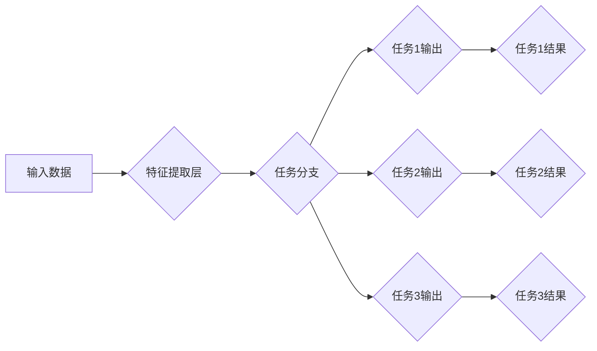

## 一切皆是映射：多任务和多模态学习中的深度学习

> 关键词：深度学习、多任务学习、多模态学习、映射、迁移学习、特征共享

### 1. 背景介绍

深度学习近年来取得了令人瞩目的成就，在图像识别、自然语言处理、语音识别等领域展现出强大的能力。然而，深度学习模型通常需要大量特定任务的数据进行训练，这在数据稀缺的情况下显得十分困难。为了解决这个问题，多任务学习 (Multi-Task Learning, MTL) 和多模态学习 (Multi-Modal Learning) 应运而生。

多任务学习是指训练一个模型同时学习多个相关任务，通过共享底层特征和知识，提升模型的泛化能力和效率。多模态学习则旨在处理多种类型的数据，例如文本、图像、音频等，通过学习不同模态之间的关系，构建更全面的理解。

### 2. 核心概念与联系

**2.1 多任务学习 (MTL)**

多任务学习的核心思想是，多个相关任务共享相同的底层特征表示，从而提升模型的泛化能力。例如，在自然语言处理领域，我们可以训练一个模型同时进行文本分类、情感分析和机器翻译等任务。

**2.2 多模态学习 (MLL)**

多模态学习的目标是融合来自不同模态的数据，构建更丰富的表示。例如，我们可以训练一个模型同时处理文本和图像数据，用于图像字幕生成、视觉问答等任务。

**2.3 映射关系**

在多任务学习和多模态学习中，映射关系扮演着至关重要的角色。

* **多任务学习:** 模型将输入数据映射到多个任务的输出空间。
* **多模态学习:** 模型将不同模态的数据映射到一个共同的特征空间，以便进行融合和交互。

**Mermaid 流程图**



### 3. 核心算法原理 & 具体操作步骤

**3.1 算法原理概述**

多任务学习和多模态学习的算法原理主要基于深度学习网络的结构和训练方法。

* **共享特征:** 多任务学习通常使用共享的底层特征提取网络，不同任务的输出层则独立学习。
* **跨模态融合:** 多模态学习则需要设计专门的模块来融合不同模态的特征，例如注意力机制、图神经网络等。

**3.2 算法步骤详解**

**多任务学习:**

1. **构建模型:** 设计一个包含共享特征提取网络和多个任务输出层的深度学习模型。
2. **准备数据:** 收集多个相关任务的数据集。
3. **训练模型:** 使用联合损失函数对模型进行训练，损失函数通常是所有任务损失函数的加权平均。
4. **评估模型:** 在测试集上评估模型在每个任务上的性能。

**多模态学习:**

1. **构建模型:** 设计一个包含不同模态特征提取网络和跨模态融合模块的深度学习模型。
2. **准备数据:** 收集不同模态的数据集，并进行预处理和对齐。
3. **训练模型:** 使用联合损失函数对模型进行训练，损失函数通常是所有任务损失函数的加权平均。
4. **评估模型:** 在测试集上评估模型在每个任务上的性能。

**3.3 算法优缺点**

**多任务学习:**

* **优点:** 提升模型的泛化能力，提高训练效率，减少数据需求。
* **缺点:** 任务之间存在负相关性，可能会导致模型性能下降。

**多模态学习:**

* **优点:** 融合多模态信息，构建更全面的理解，提升模型的鲁棒性和泛化能力。
* **缺点:** 数据收集和预处理难度较大，模型训练复杂度高。

**3.4 算法应用领域**

* **多任务学习:** 自然语言处理、计算机视觉、语音识别等领域。
* **多模态学习:** 图像字幕生成、视觉问答、情感分析、医疗诊断等领域。

### 4. 数学模型和公式 & 详细讲解 & 举例说明

**4.1 数学模型构建**

假设我们有一个包含多个任务的深度学习模型，每个任务的输出为 $y_i$，输入为 $x$，模型参数为 $\theta$。

**多任务学习:**

$$
y_i = f_i(x; \theta_i)
$$

其中，$f_i$ 是第 $i$ 个任务的输出函数，$\theta_i$ 是第 $i$ 个任务的参数。

**多模态学习:**

$$
y = g(x_1, x_2,..., x_n; \theta)
$$

其中，$g$ 是融合不同模态特征的输出函数，$x_1, x_2,..., x_n$ 是不同模态的输入数据，$\theta$ 是模型参数。

**4.2 公式推导过程**

多任务学习和多模态学习的损失函数通常是所有任务损失函数的加权平均。

**多任务学习:**

$$
L = \sum_{i=1}^{m} \lambda_i L_i
$$

其中，$L$ 是总损失函数，$L_i$ 是第 $i$ 个任务的损失函数，$\lambda_i$ 是第 $i$ 个任务的权重。

**多模态学习:**

$$
L = \sum_{i=1}^{n} \lambda_i L_i
$$

其中，$L$ 是总损失函数，$L_i$ 是第 $i$ 个任务的损失函数，$\lambda_i$ 是第 $i$ 个任务的权重。

**4.3 案例分析与讲解**

**多任务学习:**

在自然语言处理领域，我们可以训练一个模型同时进行文本分类、情感分析和机器翻译等任务。

* 文本分类任务：将文本分类到不同的类别，例如新闻主题分类、垃圾邮件过滤等。
* 情感分析任务：分析文本表达的情感，例如正面、负面、中性等。
* 机器翻译任务：将文本从一种语言翻译成另一种语言。

**多模态学习:**

在计算机视觉领域，我们可以训练一个模型同时处理文本和图像数据，用于图像字幕生成。

* 图像字幕生成任务：根据图像内容生成相应的文本描述。

### 5. 项目实践：代码实例和详细解释说明

**5.1 开发环境搭建**

* Python 3.6+
* TensorFlow/PyTorch
* CUDA (可选)

**5.2 源代码详细实现**

```python
# 多任务学习示例代码 (TensorFlow)
import tensorflow as tf

# 定义模型
model = tf.keras.models.Sequential([
    tf.keras.layers.Embedding(input_dim=10000, output_dim=128),
    tf.keras.layers.LSTM(128),
    tf.keras.layers.Dense(64, activation='relu'),
    tf.keras.layers.Dense(2, activation='softmax') # 文本分类任务
])

# 添加第二个任务分支
model.add(tf.keras.layers.Dense(1, activation='sigmoid')) # 情感分析任务

# 编译模型
model.compile(optimizer='adam',
              loss='categorical_crossentropy',
              metrics=['accuracy'])

# 训练模型
model.fit(x_train, y_train, epochs=10)

# 多模态学习示例代码 (PyTorch)
import torch
import torch.nn as nn

# 定义模型
class MultiModalModel(nn.Module):
    def __init__(self):
        super(MultiModalModel, self).__init__()
        self.text_encoder = nn.LSTM(input_size=128, hidden_size=64)
        self.image_encoder = nn.Conv2d(in_channels=3, out_channels=64, kernel_size=3)
        self.fusion_layer = nn.Linear(64 + 64, 128)
        self.output_layer = nn.Linear(128, 1)

    def forward(self, text, image):
        text_output = self.text_encoder(text)
        image_output = self.image_encoder(image)
        fused_output = self.fusion_layer(torch.cat((text_output, image_output), dim=1))
        output = self.output_layer(fused_output)
        return output

# 实例化模型
model = MultiModalModel()

# 训练模型
optimizer = torch.optim.Adam(model.parameters())
loss_fn = nn.MSELoss()

for epoch in range(10):
    #...
    loss = loss_fn(output, target)
    optimizer.zero_grad()
    loss.backward()
    optimizer.step()

```

**5.3 代码解读与分析**

以上代码示例展示了多任务学习和多模态学习的基本实现思路。

* 多任务学习示例代码使用 TensorFlow 库构建了一个包含文本分类和情感分析两个任务的模型。
* 多模态学习示例代码使用 PyTorch 库构建了一个处理文本和图像数据的模型，用于图像字幕生成任务。

**5.4 运行结果展示**

运行结果展示需要根据具体任务和数据集进行评估。

### 6. 实际应用场景

**6.1 多任务学习应用场景**

* **自然语言处理:** 文本分类、情感分析、机器翻译、问答系统等。
* **计算机视觉:** 图像分类、目标检测、图像分割、图像 Captioning 等。
* **语音识别:** 语音识别、语音合成、语音情感分析等。

**6.2 多模态学习应用场景**

* **图像字幕生成:** 根据图像内容生成相应的文本描述。
* **视觉问答:** 根据图像内容回答问题。
* **情感分析:** 分析文本和图像表达的情感。
* **医疗诊断:** 结合患者的病历、影像数据和生理数据进行诊断。

**6.3 未来应用展望**

随着深度学习技术的不断发展，多任务学习和多模态学习将在更多领域得到应用，例如：

* **个性化推荐:** 结合用户行为、兴趣和偏好进行个性化推荐。
* **自动驾驶:** 融合来自摄像头、雷达和激光雷达等多种传感器的数据进行自动驾驶。
* **机器人交互:** 结合文本、图像和语音数据进行更自然的人机交互。

### 7. 工具和资源推荐

**7.1 学习资源推荐**

* **书籍:**
    * Deep Learning by Ian Goodfellow, Yoshua Bengio, and Aaron Courville
    * Hands-On Machine Learning with Scikit-Learn, Keras & TensorFlow by Aurélien Géron
* **课程:**
    * Deep Learning Specialization by Andrew Ng (Coursera)
    * Fast.ai Deep Learning Course
* **博客:**
    * Towards Data Science
    * Machine Learning Mastery

**7.2 开发工具推荐**

* **深度学习框架:** TensorFlow, PyTorch, Keras
* **数据处理工具:** Pandas, NumPy
* **可视化工具:** Matplotlib, Seaborn

**7.3 相关论文推荐**

* **多任务学习:**
    * Multi-Task Learning by Caruana (1997)
    * Learning Transferable Features with Multi-Task Learning by Pan and Yang (2010)
* **多模态学习:**
    * Multimodal Deep Learning: A Survey by Kiela and Bottou (2019)
    * A Survey on Multimodal Learning by Lu et al. (2020)

### 8. 总结：未来发展趋势与挑战

**8.1 研究成果总结**

多任务学习和多模态学习取得了显著的进展，在多个领域取得了令人瞩目的成果。

**8.2