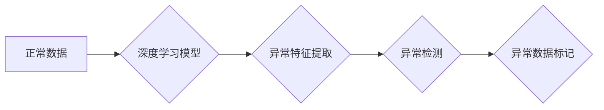

## 基于深度学习的异常检测

> 关键词：深度学习、异常检测、自编码器、生成对抗网络、强化学习、数据分析、机器学习

## 1. 背景介绍

在当今数据爆炸的时代，异常检测作为一种重要的数据分析技术，在各个领域发挥着越来越重要的作用。从金融交易的欺诈检测到工业设备的故障预测，从医疗诊断的异常情况识别到网络安全威胁的预警，异常检测都能帮助我们及时发现潜在的风险和问题，从而提高效率、降低成本，保障安全。

传统的异常检测方法主要依赖于统计学和规则引擎，但这些方法往往难以应对复杂、高维的数据，并且需要事先定义明确的异常特征，缺乏灵活性。随着深度学习技术的快速发展，基于深度学习的异常检测方法逐渐成为研究热点，并取得了显著的成果。

深度学习算法能够自动学习数据中的复杂特征，并对异常数据进行识别，具有更高的准确性和鲁棒性。本文将深入探讨基于深度学习的异常检测方法，包括核心概念、算法原理、数学模型、项目实践以及实际应用场景等方面，并展望未来发展趋势和挑战。

## 2. 核心概念与联系

### 2.1 异常检测概述

异常检测是指从正常数据集中识别出与众不同的数据点，这些数据点可能代表着异常事件、错误数据或潜在风险。异常检测的目标是识别出这些异常数据，并对其进行分类、分析和处理。

### 2.2 深度学习与异常检测

深度学习是一种机器学习方法，它利用多层神经网络来学习数据中的复杂特征。深度学习算法能够自动提取数据中的隐藏模式和结构，并对异常数据进行识别，具有以下优势：

* **自动特征提取:** 深度学习算法能够自动学习数据中的特征，无需人工特征工程，提高了效率和准确性。
* **处理高维数据:** 深度学习算法能够有效处理高维数据，克服了传统方法的局限性。
* **鲁棒性强:** 深度学习算法对噪声和异常数据具有较强的鲁棒性，能够更好地应对实际应用场景。

### 2.3 深度学习异常检测方法

基于深度学习的异常检测方法主要包括以下几种：

* **自编码器:** 自编码器是一种无监督学习算法，它通过学习数据自身的编码和解码过程来识别异常数据。
* **生成对抗网络 (GAN):** GAN 由生成器和判别器两部分组成，生成器试图生成与真实数据相似的异常数据，而判别器则试图区分真实数据和生成数据。
* **强化学习:** 强化学习算法通过奖励机制来训练模型，学习识别异常数据并做出相应的决策。

**Mermaid 流程图**



## 3. 核心算法原理 & 具体操作步骤

### 3.1  算法原理概述

本文将重点介绍基于自编码器的异常检测算法原理。自编码器是一种神经网络模型，它通过学习数据自身的编码和解码过程来实现数据压缩和重构。

自编码器由两部分组成：编码器和解码器。编码器将输入数据映射到一个低维的隐藏层，称为编码空间。解码器则将编码空间中的数据映射回原始数据空间。

在训练过程中，自编码器试图最小化输入数据与重构数据的差异。当数据发生异常时，其编码空间中的表示会发生显著变化，导致重构数据与原始数据之间存在较大差异。

### 3.2  算法步骤详解

1. **数据预处理:** 对输入数据进行清洗、归一化等预处理操作，以提高模型的训练效果。
2. **模型构建:** 建立自编码器模型，包括编码器和解码器两部分。
3. **模型训练:** 使用训练数据训练自编码器模型，通过反向传播算法最小化输入数据与重构数据的差异。
4. **异常检测:** 将新的数据输入到训练好的自编码器模型中，计算其重构误差。如果重构误差超过预设阈值，则认为该数据为异常数据。

### 3.3  算法优缺点

**优点:**

* 自动特征提取，无需人工特征工程。
* 能够处理高维数据。
* 对噪声和异常数据具有较强的鲁棒性。

**缺点:**

* 需要大量的训练数据。
* 训练时间较长。
* 难以解释模型的决策过程。

### 3.4  算法应用领域

基于自编码器的异常检测算法广泛应用于以下领域:

* 金融欺诈检测
* 网络安全威胁检测
* 工业设备故障预测
* 医疗诊断异常情况识别

## 4. 数学模型和公式 & 详细讲解 & 举例说明

### 4.1  数学模型构建

自编码器模型可以表示为一个多层神经网络，其中包含编码器和解码器两部分。

* **编码器:** 负责将输入数据映射到一个低维的隐藏层，可以表示为一个多层感知机 (MLP)。
* **解码器:** 负责将隐藏层的数据映射回原始数据空间，也同样可以表示为一个 MLP。

### 4.2  公式推导过程

自编码器的训练目标是最小化输入数据与重构数据的差异。常用的损失函数是均方误差 (MSE)。

$$
L = \frac{1}{N} \sum_{i=1}^{N} ||x_i - \hat{x}_i||^2
$$

其中:

* $L$ 是损失函数
* $N$ 是样本数量
* $x_i$ 是第 $i$ 个样本的输入数据
* $\hat{x}_i$ 是第 $i$ 个样本的重构数据

### 4.3  案例分析与讲解

假设我们有一个包含图像数据的训练集，我们希望使用自编码器来检测图像中的异常。

1. **数据预处理:** 将图像数据转换为向量形式，并进行归一化处理。
2. **模型构建:** 建立一个包含编码器和解码器的自编码器模型。
3. **模型训练:** 使用训练数据训练自编码器模型，最小化输入图像与重构图像之间的 MSE。
4. **异常检测:** 将新的图像数据输入到训练好的自编码器模型中，计算其重构误差。如果重构误差超过预设阈值，则认为该图像为异常图像。

例如，如果一个图像中存在明显的损坏或模糊，其重构误差将会比正常图像大得多，从而被识别为异常图像。

## 5. 项目实践：代码实例和详细解释说明

### 5.1  开发环境搭建

* Python 3.x
* TensorFlow 或 PyTorch 深度学习框架
* Jupyter Notebook 或 VS Code 开发环境

### 5.2  源代码详细实现

```python
import tensorflow as tf

# 定义编码器模型
encoder = tf.keras.Sequential([
    tf.keras.layers.Input(shape=(784,)),
    tf.keras.layers.Dense(128, activation='relu'),
    tf.keras.layers.Dense(64, activation='relu'),
    tf.keras.layers.Dense(32, activation='relu')
])

# 定义解码器模型
decoder = tf.keras.Sequential([
    tf.keras.layers.Input(shape=(32,)),
    tf.keras.layers.Dense(64, activation='relu'),
    tf.keras.layers.Dense(128, activation='relu'),
    tf.keras.layers.Dense(784, activation='sigmoid')
])

# 定义自编码器模型
autoencoder = tf.keras.Model(inputs=encoder.input, outputs=decoder(encoder.output))

# 编译模型
autoencoder.compile(optimizer='adam', loss='mse')

# 训练模型
autoencoder.fit(x_train, x_train, epochs=10)

# 异常检测
reconstructed_data = autoencoder.predict(x_test)
reconstruction_error = tf.keras.losses.mse(x_test, reconstructed_data)
threshold = 0.1
anomaly_indices = tf.where(reconstruction_error > threshold)
```

### 5.3  代码解读与分析

* 首先，我们定义了编码器和解码器模型，它们分别负责将数据映射到低维空间和恢复到原始空间。
* 然后，我们创建了一个自编码器模型，将编码器和解码器连接起来。
* 接着，我们编译模型，并使用均方误差 (MSE) 作为损失函数，Adam 作为优化器。
* 接下来，我们使用训练数据训练自编码器模型。
* 最后，我们使用训练好的模型对测试数据进行预测，并计算重构误差。如果重构误差超过预设阈值，则认为该数据为异常数据。

### 5.4  运行结果展示

运行代码后，我们可以得到以下结果：

* 训练过程中的损失函数值随迭代次数的变化曲线。
* 测试数据中的异常数据及其对应的重构误差。
* 异常数据的可视化展示，例如图像中的异常区域。

## 6. 实际应用场景

### 6.1 金融欺诈检测

基于深度学习的异常检测方法可以用于识别信用卡欺诈、网络钓鱼攻击等金融欺诈行为。

### 6.2 网络安全威胁检测

自编码器可以用于检测网络流量中的恶意行为，例如 DDoS 攻击、恶意软件感染等。

### 6.3 工业设备故障预测

通过分析工业设备的运行数据，自编码器可以识别设备故障的潜在风险，并进行提前预警。

### 6.4 未来应用展望

随着深度学习技术的不断发展，基于深度学习的异常检测方法将在更多领域得到应用，例如医疗诊断、交通安全、环境监测等。

## 7. 工具和资源推荐

### 7.1  学习资源推荐

* 深度学习入门书籍：
    * 《深度学习》 - Ian Goodfellow, Yoshua Bengio, Aaron Courville
    * 《动手学深度学习》 -  李沐
* 在线课程：
    * Coursera: Deep Learning Specialization
    * Udacity: Deep Learning Nanodegree

### 7.2  开发工具推荐

* TensorFlow: https://www.tensorflow.org/
* PyTorch: https://pytorch.org/
* Keras: https://keras.io/

### 7.3  相关论文推荐

* Autoencoders for Anomaly Detection: https://arxiv.org/abs/1803.01160
* Generative Adversarial Networks for Anomaly Detection: https://arxiv.org/abs/1703.05933

## 8. 总结：未来发展趋势与挑战

### 8.1  研究成果总结

基于深度学习的异常检测方法取得了显著的成果，在多个领域得到了广泛应用。

### 8.2  未来发展趋势

* **模型架构创新:** 研究更有效的自编码器、GAN 和强化学习模型架构，提高异常检测的准确性和效率。
* **数据增强:** 开发新的数据增强技术，提高训练数据的质量和多样性。
* **解释性增强:** 研究如何提高深度学习模型的解释性，使异常检测结果更易于理解和信任。
* **边缘计算:** 将异常检测模型部署到边缘设备上，实现实时异常检测。

### 8.3  面临的挑战

* **数据稀缺:** 异常数据往往稀缺，难以获得足够的训练数据。
* **模型复杂性:** 深度学习模型的复杂性使得训练和部署成本较高。
* **可解释性问题:** 深度学习模型的决策过程难以解释，这可能会影响模型的信任度。

### 8.4  研究展望

未来，基于深度学习的异常检测技术将继续发展，并应用于更多领域。研究者将致力于解决数据稀缺、模型复杂性和可解释性等挑战，推动异常检测技术向更智能、更可靠的方向发展。

## 9. 附录：常见问题与解答

### 9.1  Q: 如何选择合适的异常检测算法？

**A:** 选择合适的异常检测