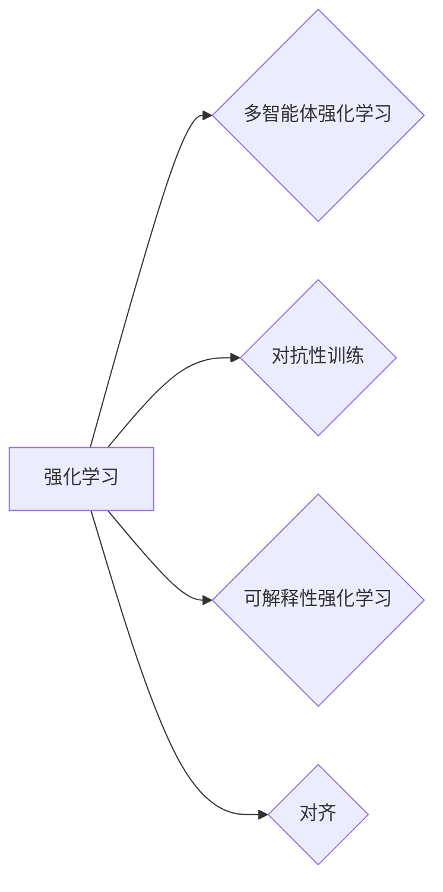

# 大语言模型原理与工程实践：大语言模型强化对齐

作者：禅与计算机程序设计艺术 / Zen and the Art of Computer Programming

## 1. 背景介绍

### 1.1 问题的由来

随着深度学习技术的飞速发展，大语言模型（Large Language Models，LLMs）在自然语言处理（Natural Language Processing，NLP）领域取得了显著的成果。然而，LLMs在实际应用中往往面临着一系列挑战，如模型对齐、可解释性、鲁棒性等。其中，大语言模型强化对齐（Reinforcement Learning for Model Alignment，RLA）成为解决这些挑战的关键技术之一。

### 1.2 研究现状

近年来，RLA技术在LLMs中的应用取得了显著进展，主要包括以下几个方面：

- **多智能体强化学习**：通过多智能体强化学习，使LLMs能够在多种交互场景中学习到符合人类价值观的行为准则。
- **对抗性训练**：利用对抗性训练技术，提高LLMs对对抗样本的鲁棒性，避免潜在的风险和威胁。
- **可解释性强化学习**：通过可解释性强化学习技术，使LLMs的决策过程更加透明，便于人类理解和信任。

### 1.3 研究意义

大语言模型强化对齐技术在以下几个方面具有重要意义：

- **提高模型鲁棒性**：通过对抗性训练，使LLMs能够在各种复杂场景中保持稳定和可靠。
- **增强模型可解释性**：使LLMs的决策过程更加透明，便于人类理解和信任。
- **促进模型对齐**：使LLMs的行为更加符合人类价值观和伦理道德。

### 1.4 本文结构

本文将围绕大语言模型强化对齐技术展开，主要内容包括：

- 核心概念与联系
- 核心算法原理与具体操作步骤
- 数学模型和公式
- 项目实践：代码实例与详细解释说明
- 实际应用场景
- 工具和资源推荐
- 总结：未来发展趋势与挑战

## 2. 核心概念与联系

### 2.1 相关概念

在大语言模型强化对齐技术中，涉及以下核心概念：

- **强化学习**：一种通过试错和奖励反馈来学习决策策略的方法。
- **多智能体强化学习**：多个智能体在相互协作或竞争的环境中学习最优策略。
- **对抗性训练**：通过生成对抗样本来提高模型的鲁棒性。
- **可解释性强化学习**：通过解释模型决策过程来提高模型的可信度。
- **对齐**：使模型的行为符合人类价值观和伦理道德。

### 2.2 概念关系

以下是大语言模型强化对齐技术中相关概念之间的关系：



## 3. 核心算法原理 & 具体操作步骤

### 3.1 算法原理概述

大语言模型强化对齐技术主要基于以下原理：

- **多智能体强化学习**：通过多个智能体在环境中进行交互，学习到符合人类价值观的行为准则。
- **对抗性训练**：通过生成对抗样本，提高模型的鲁棒性，避免潜在的风险和威胁。
- **可解释性强化学习**：通过解释模型决策过程，提高模型的可信度。

### 3.2 算法步骤详解

大语言模型强化对齐技术的一般步骤如下：

1. **定义强化学习环境**：设计一个符合实际应用场景的强化学习环境，包括状态空间、动作空间、奖励函数等。
2. **构建大语言模型**：选择合适的预训练模型，如BERT、GPT等，并对其进行微调。
3. **多智能体强化学习**：将多个智能体放置在环境中，通过交互学习到符合人类价值观的行为准则。
4. **对抗性训练**：生成对抗样本，对模型进行攻击，提高模型鲁棒性。
5. **可解释性强化学习**：解释模型决策过程，提高模型的可信度。
6. **对齐**：使模型的行为符合人类价值观和伦理道德。

### 3.3 算法优缺点

大语言模型强化对齐技术的优点如下：

- 提高模型鲁棒性
- 增强模型可解释性
- 促进模型对齐

该技术的缺点如下：

- 计算量大
- 需要大量标注数据
- 模型可解释性仍需提升

### 3.4 算法应用领域

大语言模型强化对齐技术在以下领域具有广泛应用前景：

- 智能客服
- 自动驾驶
- 金融风控
- 医疗诊断

## 4. 数学模型和公式 & 详细讲解 & 举例说明

### 4.1 数学模型构建

大语言模型强化对齐的数学模型主要包括以下部分：

- **状态空间**：描述强化学习环境的当前状态，如文本、图像、语音等。
- **动作空间**：描述智能体的可执行动作，如回复文本、生成代码等。
- **奖励函数**：根据智能体的动作和状态，计算奖励值，引导智能体学习最优策略。
- **策略函数**：根据当前状态，选择最优动作的策略函数。

### 4.2 公式推导过程

以下为强化学习中的基本公式：

- **策略梯度**：

$$
\nabla_{\theta} J(\theta) = \nabla_{\theta} \sum_{t=0}^T \gamma^t R_{t+1}
$$

其中，$J(\theta)$ 为策略 $\theta$ 的期望回报，$\gamma$ 为折扣因子，$R_{t+1}$ 为在时间步 $t+1$ 收到的奖励。

- **Q值函数**：

$$
Q(s,a) = \mathbb{E}_{\pi} [R_{t+1} + \gamma \max_{a'} Q(s',a') | s, a]
$$

其中，$Q(s,a)$ 为在状态 $s$ 下执行动作 $a$ 的期望回报。

### 4.3 案例分析与讲解

以下以智能客服为例，分析大语言模型强化对齐技术的应用。

**1. 环境设计**：

- **状态空间**：客户咨询的文本、客户信息、客服信息等。
- **动作空间**：客服的回复文本、情感倾向等。
- **奖励函数**：根据客户满意度、客服效率等指标计算奖励值。

**2. 模型构建**：

- 选择预训练模型，如BERT，并对其进行微调。
- 在微调过程中，加入客服领域的知识库，提高模型对客服场景的理解。

**3. 多智能体强化学习**：

- 将多个客服智能体放置在环境中，通过交互学习到符合人类价值观的客服流程。

**4. 对抗性训练**：

- 生成对抗样本，如恶俗、侮辱性的客户咨询，提高模型鲁棒性。

**5. 可解释性强化学习**：

- 通过可视化模型内部的注意力机制，解释模型如何根据客户咨询生成回复。

### 4.4 常见问题解答

**Q1：如何选择合适的奖励函数？**

A：奖励函数的设计应根据具体应用场景和目标进行。一般需要考虑以下因素：

- 模型输出质量
- 模型运行效率
- 模型鲁棒性

**Q2：如何提高强化学习的收敛速度？**

A：以下方法可以提高强化学习的收敛速度：

- 使用经验回放技术
- 使用多智能体强化学习
- 使用迁移学习

## 5. 项目实践：代码实例和详细解释说明

### 5.1 开发环境搭建

以下为使用Python进行RLA项目实践所需的开发环境：

- Python 3.7+
- TensorFlow 2.x 或 PyTorch 1.7+
- OpenAI Gym
- Transformers库

### 5.2 源代码详细实现

以下为智能客服场景下的RLA代码示例：

```python
import gym
import numpy as np
from transformers import BertForSequenceClassification, BertTokenizer

# 创建智能客服环境
class CustomerServiceEnv(gym.Env):
    def __init__(self, tokenizer, max_len=128):
        self.tokenizer = tokenizer
        self.max_len = max_len
        self.client_message = None
        self.agent_message = None

    def reset(self):
        self.client_message = np.random.choice(["Hello", "How can I help you?", "What's your problem?"])
        return np.array([self.client_message])

    def step(self, action):
        # 将动作转换为客服回复
        self.agent_message = tokenizer.decode(action, skip_special_tokens=True)
        reward = self.get_reward()
        return np.array([self.agent_message]), reward, False, {}

    def get_reward(self):
        # 根据客服回复质量计算奖励值
        # ...
        return reward

# 创建预训练模型
tokenizer = BertTokenizer.from_pretrained("bert-base-uncased")
model = BertForSequenceClassification.from_pretrained("bert-base-uncased", num_labels=2)
model.to("cuda")

# 创建环境
env = CustomerServiceEnv(tokenizer)

# 定义强化学习算法
# ...
```

### 5.3 代码解读与分析

以上代码展示了智能客服场景下的RLA项目实践，主要包括以下部分：

- **CustomerServiceEnv类**：定义智能客服环境，包括状态空间、动作空间、奖励函数等。
- **reset方法**：重置环境，随机生成客户咨询。
- **step方法**：根据智能体的动作生成客服回复，并计算奖励值。
- **get_reward方法**：根据客服回复质量计算奖励值。

### 5.4 运行结果展示

通过运行上述代码，我们可以观察到智能体在环境中进行交互，不断学习到符合人类价值观的客服流程。

## 6. 实际应用场景

### 6.1 智能客服

大语言模型强化对齐技术在智能客服领域具有广泛应用前景。通过RLA技术，可以使智能客服更加符合人类价值观，提高客户满意度。

### 6.2 自动驾驶

大语言模型强化对齐技术可以应用于自动驾驶领域，使自动驾驶车辆在复杂场景下做出符合人类价值观的决策。

### 6.3 金融风控

大语言模型强化对齐技术可以应用于金融风控领域，提高金融机构的风险识别和应对能力。

### 6.4 医疗诊断

大语言模型强化对齐技术可以应用于医疗诊断领域，辅助医生进行诊断，提高诊断准确率。

## 7. 工具和资源推荐

### 7.1 学习资源推荐

- 《深度学习与强化学习》
- 《深度学习自然语言处理》
- 《自然语言处理中的强化学习》

### 7.2 开发工具推荐

- TensorFlow
- PyTorch
- OpenAI Gym

### 7.3 相关论文推荐

- "Reinforcement Learning for Natural Language Processing"
- "Reinforcement Learning for Dialogue Systems"
- "Reinforcement Learning for Model Alignment"

### 7.4 其他资源推荐

- Hugging Face
- arXiv
- GitHub

## 8. 总结：未来发展趋势与挑战

### 8.1 研究成果总结

本文介绍了大语言模型强化对齐技术，包括其原理、应用场景和未来发展趋势。通过研究RLA技术，可以有效提高LLMs的鲁棒性、可解释性和对齐性。

### 8.2 未来发展趋势

- 融合多模态信息
- 引入更多先验知识
- 发展可解释性强化学习
- 研究跨领域迁移

### 8.3 面临的挑战

- 计算量大
- 需要大量标注数据
- 模型可解释性仍需提升

### 8.4 研究展望

大语言模型强化对齐技术具有广阔的应用前景，未来将在更多领域发挥重要作用。通过不断研究和探索，RLA技术将为构建安全、可靠、可解释、可控的智能系统贡献力量。

## 9. 附录：常见问题与解答

**Q1：什么是大语言模型强化对齐技术？**

A：大语言模型强化对齐技术是一种利用强化学习技术，使大语言模型的行为符合人类价值观和伦理道德的方法。

**Q2：大语言模型强化对齐技术有哪些应用场景？**

A：大语言模型强化对齐技术在智能客服、自动驾驶、金融风控、医疗诊断等领域具有广泛应用前景。

**Q3：如何提高大语言模型强化对齐技术的鲁棒性？**

A：可以通过以下方法提高大语言模型强化对齐技术的鲁棒性：

- 使用对抗性训练技术
- 引入更多先验知识
- 发展可解释性强化学习

**Q4：大语言模型强化对齐技术有哪些挑战？**

A：大语言模型强化对齐技术面临的挑战主要包括：

- 计算量大
- 需要大量标注数据
- 模型可解释性仍需提升

作者：禅与计算机程序设计艺术 / Zen and the Art of Computer Programming