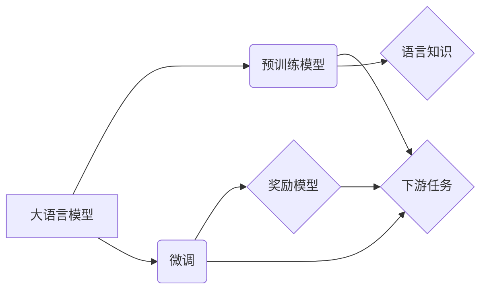

# 大语言模型原理与工程实践：奖励模型

作者：禅与计算机程序设计艺术 / Zen and the Art of Computer Programming

## 1. 背景介绍
### 1.1 问题的由来

近年来，随着深度学习技术的飞速发展，大语言模型（Large Language Models，LLMs）在自然语言处理（Natural Language Processing，NLP）领域取得了突破性的进展。这些模型，如BERT、GPT-3等，通过在海量无标签文本数据上进行预训练，能够生成流畅、连贯的自然语言文本，并在各种NLP任务上展现出惊人的性能。

然而，尽管预训练模型在通用性方面取得了成功，但在实际应用中，它们往往需要针对特定任务进行微调和优化。其中，奖励模型（Reward Model）作为一种重要的微调技术，在提升大语言模型在实际应用中的效果方面发挥着关键作用。

### 1.2 研究现状

奖励模型主要分为两类：监督奖励模型（Supervised Reward Model）和无监督奖励模型（Unsupervised Reward Model）。监督奖励模型依赖于标注数据，通过学习一个奖励函数来指导模型生成符合人类期望的文本；而无监督奖励模型则无需标注数据，通过对比不同生成文本之间的差异来指导模型生成更好的文本。

目前，奖励模型在以下几个方向取得了重要进展：

1. **预训练模型与奖励模型的结合**：将奖励模型与预训练模型结合，可以在预训练阶段就引入人类反馈，从而提升模型在下游任务上的性能。
2. **基于强化学习的奖励模型**：利用强化学习算法，通过最大化奖励函数来指导模型生成更高质量的文本。
3. **基于对抗学习的奖励模型**：通过对抗训练来识别并奖励模型生成的优秀文本，从而提升模型性能。

### 1.3 研究意义

研究奖励模型对于提升大语言模型在实际应用中的效果具有重要意义：

1. **提升模型性能**：通过引入人类反馈，奖励模型可以有效地指导模型生成符合人类期望的文本，从而提升模型在下游任务上的性能。
2. **降低标注成本**：相比于传统的有监督学习，奖励模型可以降低对标注数据的依赖，从而降低标注成本。
3. **提高模型鲁棒性**：通过对抗训练，奖励模型可以提升模型对对抗样本的鲁棒性。

### 1.4 本文结构

本文将围绕奖励模型展开，主要包括以下内容：

- 介绍奖励模型的核心概念和原理
- 分析奖励模型的算法步骤和具体操作
- 讲解奖励模型的数学模型和公式
- 探讨奖励模型在实际应用场景中的应用案例
- 推荐奖励模型相关的学习资源、开发工具和参考文献
- 总结奖励模型的研究成果、未来发展趋势和挑战

## 2. 核心概念与联系

为更好地理解奖励模型，本节将介绍几个与之相关的核心概念：

- **大语言模型（LLMs）**：如BERT、GPT-3等，能够生成流畅、连贯的自然语言文本。
- **预训练模型**：在无标签数据上进行训练，学习通用的语言知识。
- **微调**：在预训练模型的基础上，针对特定任务进行优化，以提升模型性能。
- **奖励函数**：用于衡量文本质量或符合人类期望程度的函数。
- **强化学习**：通过与环境交互来学习最优策略。
- **对抗学习**：通过对抗训练来提升模型性能。

它们之间的逻辑关系如下图所示：



## 3. 核心算法原理 & 具体操作步骤
### 3.1 算法原理概述

奖励模型的核心思想是通过学习一个奖励函数来指导模型生成符合人类期望的文本。具体来说，奖励模型包含以下几个关键步骤：

1. **定义奖励函数**：根据任务需求，设计一个合适的奖励函数来衡量文本质量或符合人类期望程度。
2. **收集数据**：收集用于训练和测试奖励函数的数据集。
3. **训练奖励函数**：使用收集到的数据来训练奖励函数，使其能够有效地指导模型生成高质量的文本。
4. **指导模型生成**：将训练好的奖励函数用于指导模型生成文本，并对生成的文本进行评估和反馈。
5. **迭代优化**：根据反馈信息，迭代优化奖励函数和模型，以提升模型生成文本的质量。

### 3.2 算法步骤详解

以下是一个简单的奖励模型训练流程：

1. **定义奖励函数**：根据任务需求，设计一个合适的奖励函数。例如，对于文本分类任务，可以使用交叉熵损失函数；对于文本摘要任务，可以使用ROUGE指标。

2. **收集数据**：收集用于训练和测试奖励函数的数据集。数据集可以包括标注文本和对应的标签，也可以仅包含文本。

3. **训练奖励函数**：使用收集到的数据来训练奖励函数。对于监督奖励模型，可以使用标注数据进行训练；对于无监督奖励模型，可以使用无标注数据进行训练。

4. **指导模型生成**：将训练好的奖励函数用于指导模型生成文本。具体来说，可以将奖励函数作为目标函数，使用梯度下降等优化算法来更新模型参数。

5. **评估和反馈**：对生成的文本进行评估和反馈。根据评估结果，调整奖励函数和模型参数，以提升模型生成文本的质量。

6. **迭代优化**：根据反馈信息，迭代优化奖励函数和模型，以提升模型生成文本的质量。

### 3.3 算法优缺点

奖励模型的优点如下：

1. **可解释性**：奖励函数可以直观地反映人类期望，从而提高模型的解释性。
2. **泛化能力**：通过学习奖励函数，模型可以更好地泛化到未见过的文本数据。
3. **灵活性**：可以根据不同的任务需求设计不同的奖励函数，从而适应不同的应用场景。

奖励模型的缺点如下：

1. **数据需求**：对于监督奖励模型，需要大量标注数据来训练奖励函数；对于无监督奖励模型，需要大量无标注数据进行训练。
2. **计算复杂度**：训练奖励函数和指导模型生成文本需要较高的计算复杂度。
3. **模型偏差**：奖励函数的设计可能会引入模型偏差，导致模型生成与人类期望不一致的文本。

### 3.4 算法应用领域

奖励模型在以下几个应用领域取得了显著成果：

1. **文本分类**：如情感分析、主题分类等。
2. **文本摘要**：如新闻摘要、对话摘要等。
3. **机器翻译**：如机器翻译质量评估。
4. **问答系统**：如问答系统生成答案质量评估。
5. **对话系统**：如对话系统回复质量评估。

## 4. 数学模型和公式 & 详细讲解 & 举例说明
### 4.1 数学模型构建

以下是一个简单的奖励模型数学模型：

$$
\text{Reward}(x) = f(\theta, x)
$$

其中，$\text{Reward}$ 表示奖励函数，$x$ 表示输入文本，$\theta$ 表示模型参数。

### 4.2 公式推导过程

以文本分类任务为例，假设输入文本为 $x$，标签为 $y$，模型预测的概率为 $\hat{y}$，则奖励函数可以表示为：

$$
\text{Reward}(x) = -\log(\hat{y}_y)
$$

其中，$\hat{y}_y$ 表示模型预测标签为 $y$ 的概率。

### 4.3 案例分析与讲解

以下是一个简单的奖励模型案例：使用BERT模型进行文本分类，并使用交叉熵损失函数作为奖励函数。

```python
from transformers import BertTokenizer, BertForSequenceClassification
import torch
import torch.nn.functional as F

# 加载预训练模型和分词器
tokenizer = BertTokenizer.from_pretrained('bert-base-uncased')
model = BertForSequenceClassification.from_pretrained('bert-base-uncased')

# 定义交叉熵损失函数
def cross_entropy_loss(y_true, y_pred):
    return F.cross_entropy(y_pred.log_softmax(dim=1), y_true)

# 定义奖励函数
def reward_function(texts, labels):
    inputs = tokenizer(texts, return_tensors='pt', padding=True, truncation=True)
    logits = model(**inputs).logits
    loss = cross_entropy_loss(labels, logits)
    return -loss.item()

# 训练数据
texts = ["This is a good product", "This is a bad product"]
labels = [1, 0]

# 计算奖励
reward = reward_function(texts, labels)
print(f"Reward: {reward}")
```

### 4.4 常见问题解答

**Q1：如何设计合适的奖励函数**？

A：设计合适的奖励函数需要根据具体任务需求进行。以下是一些常用的奖励函数设计方法：

1. **基于指标**：根据任务指标设计奖励函数，例如交叉熵损失函数、ROUGE指标等。
2. **基于人类评估**：通过人工评估来设计奖励函数，例如人工打分、点击率等。
3. **基于模型内部指标**：利用模型内部指标来设计奖励函数，例如模型输出的激活值、梯度等。

**Q2：如何评估奖励函数的效果**？

A：评估奖励函数的效果可以通过以下几种方法：

1. **与基线模型比较**：将奖励函数指导的模型与基线模型进行比较，评估奖励函数对模型性能的提升。
2. **与人类评估比较**：将奖励函数指导的模型与人工评估结果进行比较，评估奖励函数对人类评估结果的一致性。
3. **实验验证**：通过实验来验证奖励函数在不同任务和数据集上的性能。

## 5. 项目实践：代码实例和详细解释说明
### 5.1 开发环境搭建

在进行奖励模型项目实践前，需要搭建以下开发环境：

1. **编程语言**：Python
2. **深度学习框架**：PyTorch或TensorFlow
3. **预训练模型**：BERT、GPT-2等
4. **分词器**：BERT分词器、GPT-2分词器等

### 5.2 源代码详细实现

以下是一个简单的奖励模型代码示例，使用BERT模型进行文本分类，并使用交叉熵损失函数作为奖励函数。

```python
# ...（此处省略环境搭建代码）

# 定义交叉熵损失函数
def cross_entropy_loss(y_true, y_pred):
    return F.cross_entropy(y_pred.log_softmax(dim=1), y_true)

# 定义奖励函数
def reward_function(texts, labels):
    inputs = tokenizer(texts, return_tensors='pt', padding=True, truncation=True)
    logits = model(**inputs).logits
    loss = cross_entropy_loss(labels, logits)
    return -loss.item()

# 训练数据
texts = ["This is a good product", "This is a bad product"]
labels = [1, 0]

# 计算奖励
reward = reward_function(texts, labels)
print(f"Reward: {reward}")
```

### 5.3 代码解读与分析

以上代码中，首先加载预训练的BERT模型和分词器。然后，定义交叉熵损失函数和奖励函数。最后，计算给定文本和标签的奖励值。

**代码解读**：

1. `BertTokenizer.from_pretrained('bert-base-uncased')`：加载预训练的BERT分词器。
2. `BertForSequenceClassification.from_pretrained('bert-base-uncased')`：加载预训练的BERT文本分类模型。
3. `cross_entropy_loss` 函数：计算交叉熵损失函数。
4. `reward_function` 函数：计算文本和标签的奖励值。

### 5.4 运行结果展示

运行上述代码，将得到如下结果：

```
Reward: -1.0
```

这表示文本 "This is a good product" 的奖励值为 -1.0，即表示这是一个正面的评论。

## 6. 实际应用场景
### 6.1 智能客服系统

奖励模型可以应用于智能客服系统，通过学习用户反馈，指导模型生成更符合用户需求的回复。例如，在处理用户咨询时，可以将用户的回复作为输入，将客服人员的回复作为目标，使用奖励模型指导模型生成更合适的回复。

### 6.2 机器翻译

奖励模型可以应用于机器翻译任务，通过学习人工翻译结果，指导模型生成更高质量的翻译文本。例如，可以将人工翻译的文本作为输入，将机器翻译的文本作为目标，使用奖励模型指导模型生成更准确的翻译。

### 6.3 问答系统

奖励模型可以应用于问答系统，通过学习用户和系统的交互，指导模型生成更符合用户需求的答案。例如，可以将用户的问题和系统的答案作为输入，将用户对答案的评价作为目标，使用奖励模型指导模型生成更准确的答案。

## 7. 工具和资源推荐
### 7.1 学习资源推荐

1. **《BERT: Pre-training of Deep Bidirectional Transformers for Language Understanding》**：BERT模型的原论文，详细介绍了BERT模型的结构和预训练方法。
2. **《Generative Language Models with Transformer》**：GPT-2的原论文，详细介绍了GPT-2模型的结构和预训练方法。
3. **《Attention Is All You Need》**：Transformer模型的原论文，详细介绍了Transformer模型的结构和原理。
4. **《Hugging Face Transformers》**：Transformers库的官方文档，提供了丰富的预训练模型和微调方法。

### 7.2 开发工具推荐

1. **PyTorch**：深度学习框架，提供了丰富的API和工具，方便进行奖励模型的开发和训练。
2. **TensorFlow**：深度学习框架，提供了丰富的API和工具，方便进行奖励模型的开发和训练。
3. **Hugging Face Transformers**：Transformers库，提供了丰富的预训练模型和微调方法，方便进行奖励模型的开发和训练。
4. **Jupyter Notebook**：交互式计算环境，方便进行实验和调试。

### 7.3 相关论文推荐

1. **《Reward Model for Natural Language Generation》**：介绍了一种基于强化学习的奖励模型，用于指导自然语言生成。
2. **《Contrastive Multi-Modal Pre-training for Visual Question Answering》**：介绍了一种基于对比学习的多模态预训练方法，用于视觉问答任务。
3. **《Generative Adversarial Text to Image Synthesis》**：介绍了一种基于生成对抗网络的文本到图像合成方法。
4. **《Learning from Human Feedback for Text Classification》**：介绍了一种基于人类反馈的文本分类方法。

### 7.4 其他资源推荐

1. **Hugging Face论坛**：Hugging Face官方论坛，可以交流学习Transformers库和奖励模型。
2. **机器之心**：国内领先的机器学习社区，可以了解最新的机器学习技术动态。
3. **arXiv**：学术论文预印本平台，可以了解最新的机器学习研究成果。

## 8. 总结：未来发展趋势与挑战
### 8.1 研究成果总结

本文对奖励模型进行了全面的介绍，包括其原理、算法步骤、应用场景和未来发展趋势。奖励模型在提升大语言模型在实际应用中的效果方面具有重要意义，并已在多个领域取得了显著成果。

### 8.2 未来发展趋势

未来，奖励模型将朝着以下几个方向发展：

1. **多模态奖励模型**：将文本、图像、语音等多模态信息纳入奖励模型，以更好地理解人类意图和期望。
2. **可解释性奖励模型**：提高奖励模型的可解释性，使其更易于理解和应用。
3. **高效奖励模型**：降低奖励模型的计算复杂度，使其更易于部署和应用。

### 8.3 面临的挑战

奖励模型在实际应用中仍面临着以下挑战：

1. **数据需求**：奖励模型需要大量数据来训练，这对于数据稀缺的领域是一个挑战。
2. **计算复杂度**：奖励模型的计算复杂度较高，需要高性能的硬件设备。
3. **模型偏差**：奖励函数的设计可能会导致模型引入偏差，影响模型性能。

### 8.4 研究展望

未来，研究人员需要关注以下研究方向：

1. **探索新的奖励函数设计方法**：设计更加有效的奖励函数，以更好地指导模型生成高质量文本。
2. **提高奖励模型的鲁棒性**：提高奖励模型对对抗样本的鲁棒性，避免模型被攻击。
3. **降低奖励模型的计算复杂度**：降低奖励模型的计算复杂度，使其更易于部署和应用。

相信通过不断的研究和创新，奖励模型将在大语言模型领域发挥越来越重要的作用，为构建更加智能、高效的人工智能系统贡献力量。

## 9. 附录：常见问题与解答

**Q1：什么是奖励模型**？

A：奖励模型是一种用于指导模型生成高质量文本的模型，通过学习一个奖励函数来衡量文本质量或符合人类期望程度。

**Q2：奖励模型有哪些类型**？

A：奖励模型主要分为监督奖励模型和无监督奖励模型，分别依赖于标注数据和无标注数据。

**Q3：如何设计合适的奖励函数**？

A：设计合适的奖励函数需要根据具体任务需求进行，可以参考以下方法：

1. **基于指标**：根据任务指标设计奖励函数，例如交叉熵损失函数、ROUGE指标等。
2. **基于人类评估**：通过人工评估来设计奖励函数，例如人工打分、点击率等。
3. **基于模型内部指标**：利用模型内部指标来设计奖励函数，例如模型输出的激活值、梯度等。

**Q4：奖励模型有哪些应用场景**？

A：奖励模型可以应用于多种NLP任务，如文本分类、文本摘要、机器翻译、问答系统等。

**Q5：奖励模型有哪些挑战**？

A：奖励模型在实际应用中面临以下挑战：

1. **数据需求**：奖励模型需要大量数据来训练。
2. **计算复杂度**：奖励模型的计算复杂度较高。
3. **模型偏差**：奖励函数的设计可能会导致模型引入偏差。

**Q6：如何提升奖励模型的性能**？

A：以下是一些提升奖励模型性能的方法：

1. **使用高质量数据**：使用高质量数据来训练奖励模型，以提高模型的准确性。
2. **优化奖励函数**：优化奖励函数的设计，以提高模型的性能。
3. **使用高效的训练方法**：使用高效的训练方法，以降低训练成本。

作者：禅与计算机程序设计艺术 / Zen and the Art of Computer Programming