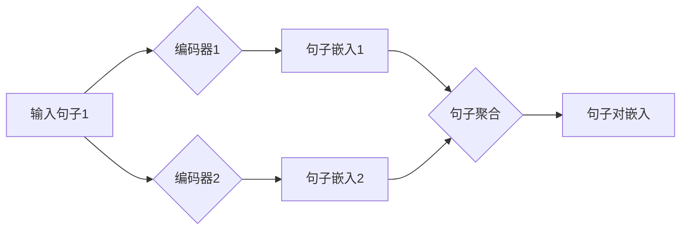

## Transformer大模型实战 使用Sentence-BERT计算句子特征

> 关键词：Transformer, Sentence-BERT, 句子嵌入, 自然语言处理, 大模型,  文本相似度,  信息检索

## 1. 背景介绍

近年来，深度学习在自然语言处理 (NLP) 领域取得了突破性进展，其中 Transformer 架构成为 NLP 领域的新宠。其强大的序列建模能力和并行计算效率，使得 Transformer 模型在机器翻译、文本摘要、问答系统等任务中取得了优异的性能。

Sentence-BERT (SBERT) 是基于 Transformer 架构的预训练模型，专门用于生成句子嵌入。句子嵌入是一种将句子映射到低维向量空间的技术，可以用于衡量句子之间的相似度、分类、聚类等任务。

传统的句子嵌入方法通常依赖于词袋模型或词嵌入技术，但这些方法难以捕捉句子之间的语义关系和上下文信息。而 Sentence-BERT 则通过 Transformer 的自注意力机制，能够更好地理解句子中的每个词语之间的关系，从而生成更准确、更富有语义的句子嵌入。

## 2. 核心概念与联系

### 2.1 Transformer 架构

Transformer 架构由编码器和解码器两部分组成，其中编码器负责将输入序列映射到隐藏状态，解码器则根据隐藏状态生成输出序列。Transformer 的核心创新在于使用自注意力机制，能够捕捉序列中不同位置词语之间的依赖关系，从而实现更有效的序列建模。

### 2.2 Sentence-BERT 模型

Sentence-BERT 是基于 Transformer 架构的预训练模型，其主要特点如下：

* **双编码器结构:** Sentence-BERT 使用两个相同的 Transformer 编码器，分别对两个句子进行编码，生成两个句子嵌入向量。
* **句子聚合:** Sentence-BERT 使用句子聚合函数将两个句子嵌入向量进行组合，生成一个表示句子对关系的向量。
* **预训练任务:** Sentence-BERT 在大量的文本数据上进行预训练，学习到句子嵌入的语义表示。

**Mermaid 流程图:**



### 2.3 句子嵌入的应用

句子嵌入在 NLP 领域有着广泛的应用，例如：

* **文本相似度计算:** 比较两个句子之间的语义相似度。
* **信息检索:** 根据用户查询，检索与之相关的文档。
* **文本分类:** 将文本分类到不同的类别。
* **问答系统:** 根据用户问题，找到最相关的答案。

## 3. 核心算法原理 & 具体操作步骤

### 3.1 算法原理概述

Sentence-BERT 的核心算法原理是利用 Transformer 架构的编码器，将句子映射到低维向量空间。

具体来说，Sentence-BERT 模型包含两个相同的 Transformer 编码器，分别对两个句子进行编码，生成两个句子嵌入向量。然后，使用句子聚合函数将这两个句子嵌入向量进行组合，生成一个表示句子对关系的向量。

### 3.2 算法步骤详解

1. **预处理:** 将输入句子进行预处理，例如分词、词形还原、去除停用词等。
2. **编码:** 使用两个相同的 Transformer 编码器，分别对两个句子进行编码，生成两个句子嵌入向量。
3. **句子聚合:** 使用句子聚合函数将两个句子嵌入向量进行组合，生成一个表示句子对关系的向量。
4. **输出:** 返回句子对嵌入向量。

### 3.3 算法优缺点

**优点:**

* **高准确率:** Sentence-BERT 利用 Transformer 架构的强大能力，能够生成更准确、更富有语义的句子嵌入。
* **高效性:** Sentence-BERT 模型已经预训练，可以直接使用，无需进行复杂的训练过程。
* **可扩展性:** Sentence-BERT 模型可以很容易地扩展到处理更长的句子和更大的语料库。

**缺点:**

* **计算资源:** Sentence-BERT 模型参数量较大，需要较多的计算资源进行推理。
* **训练数据:** Sentence-BERT 模型需要大量的文本数据进行预训练。

### 3.4 算法应用领域

Sentence-BERT 广泛应用于以下领域:

* **信息检索:** 根据用户查询，检索与之相关的文档。
* **文本相似度计算:** 比较两个文本之间的相似度，例如用于文档聚类、 plagiarism 检测等。
* **问答系统:** 根据用户问题，找到最相关的答案。
* **文本分类:** 将文本分类到不同的类别。

## 4. 数学模型和公式 & 详细讲解 & 举例说明

### 4.1 数学模型构建

Sentence-BERT 模型的数学模型可以概括为以下公式:

$$
\mathbf{s}_1 = \text{Encoder}_1(\mathbf{x}_1)
$$

$$
\mathbf{s}_2 = \text{Encoder}_2(\mathbf{x}_2)
$$

$$
\mathbf{z} = \text{Aggregate}(\mathbf{s}_1, \mathbf{s}_2)
$$

其中:

* $\mathbf{x}_1$ 和 $\mathbf{x}_2$ 分别表示两个输入句子。
* $\text{Encoder}_1$ 和 $\text{Encoder}_2$ 分别表示两个相同的 Transformer 编码器。
* $\mathbf{s}_1$ 和 $\mathbf{s}_2$ 分别表示两个句子嵌入向量。
* $\text{Aggregate}$ 表示句子聚合函数，例如平均池化、最大池化等。
* $\mathbf{z}$ 表示句子对嵌入向量。

### 4.2 公式推导过程

Transformer 编码器的数学模型推导过程较为复杂，涉及到多层神经网络、自注意力机制、前馈神经网络等多个模块。

这里不再详细推导，可以参考 Transformer 原文论文 [Attention Is All You Need](https://arxiv.org/abs/1706.03762) 进行学习。

### 4.3 案例分析与讲解

假设我们有两个句子:

* 句子1: "The cat sat on the mat."
* 句子2: "The dog lay on the floor."

使用 Sentence-BERT 模型，我们可以将这两个句子分别编码成句子嵌入向量，然后使用句子聚合函数计算句子对嵌入向量。

通过比较句子对嵌入向量的相似度，我们可以判断这两个句子之间的语义关系。

## 5. 项目实践：代码实例和详细解释说明

### 5.1 开发环境搭建

* Python 3.6+
* PyTorch 1.0+
* Transformers 库

### 5.2 源代码详细实现

```python
from transformers import SentenceTransformer

# 加载预训练模型
model = SentenceTransformer('all-mpnet-base-v2')

# 输入句子
sentence1 = "The cat sat on the mat."
sentence2 = "The dog lay on the floor."

# 生成句子嵌入向量
embedding1 = model.encode(sentence1)
embedding2 = model.encode(sentence2)

# 计算句子对嵌入向量
similarity = model.encode(sentence1, sentence2)

# 打印结果
print(f"句子1嵌入向量: {embedding1}")
print(f"句子2嵌入向量: {embedding2}")
print(f"句子对嵌入向量: {similarity}")
```

### 5.3 代码解读与分析

* `SentenceTransformer` 类用于加载和使用 Sentence-BERT 模型。
* `model.encode()` 方法用于生成句子嵌入向量。
* `model.encode(sentence1, sentence2)` 方法用于计算句子对嵌入向量。

### 5.4 运行结果展示

运行上述代码，会输出三个句子嵌入向量，分别表示句子1、句子2和句子对的嵌入向量。

## 6. 实际应用场景

Sentence-BERT 在实际应用场景中有着广泛的应用，例如:

* **搜索引擎:** 根据用户查询，检索与之相关的文档。
* **问答系统:** 根据用户问题，找到最相关的答案。
* **文本分类:** 将文本分类到不同的类别。
* **对话系统:** 生成更自然、更流畅的对话回复。

### 6.4 未来应用展望

随着 Transformer 模型的不断发展，Sentence-BERT 模型的应用场景将会更加广泛。

例如:

* **多语言文本理解:** 将 Sentence-BERT 模型应用于多语言文本理解任务。
* **跨模态文本理解:** 将 Sentence-BERT 模型与其他模态数据（例如图像、音频）结合，实现跨模态文本理解。
* **个性化推荐:** 根据用户的阅读历史和偏好，生成个性化的文本推荐。

## 7. 工具和资源推荐

### 7.1 学习资源推荐

* **论文:** Attention Is All You Need
* **博客:** Hugging Face Blog
* **在线课程:** Coursera, Udemy

### 7.2 开发工具推荐

* **Transformers 库:** https://huggingface.co/transformers/
* **PyTorch:** https://pytorch.org/

### 7.3 相关论文推荐

* Sentence-BERT: Sentence Embeddings using Siamese BERT Networks
* BERT: Pre-training of Deep Bidirectional Transformers for Language Understanding

## 8. 总结：未来发展趋势与挑战

### 8.1 研究成果总结

Sentence-BERT 模型在句子嵌入领域取得了显著的成果，其高准确率、高效性和可扩展性使其成为 NLP 领域的重要工具。

### 8.2 未来发展趋势

未来 Sentence-BERT 模型的发展趋势包括:

* **模型规模的扩大:** 训练更大规模的 Sentence-BERT 模型，以提高其性能。
* **多模态文本理解:** 将 Sentence-BERT 模型与其他模态数据结合，实现跨模态文本理解。
* **个性化文本理解:** 根据用户的阅读历史和偏好，生成个性化的文本理解结果。

### 8.3 面临的挑战

Sentence-BERT 模型也面临着一些挑战，例如:

* **计算资源:** 训练和使用大型 Sentence-BERT 模型需要大量的计算资源。
* **数据标注:** 训练高质量的 Sentence-BERT 模型需要大量的标注数据。
* **解释性:** Transformer 模型的内部机制较为复杂，难以解释其决策过程。

### 8.4 研究展望

未来研究将继续探索 Sentence-BERT 模型的应用场景，并致力于解决其面临的挑战，以推动 NLP 领域的发展。

## 9. 附录：常见问题与解答

**Q1: Sentence-BERT 模型的训练数据是什么？**

A1: Sentence-BERT 模型的训练数据包括大量的文本数据，例如维基百科、书籍、新闻等。

**Q2: Sentence-BERT 模型的性能如何？**

A2: Sentence-BERT 模型在各种句子嵌入任务中都取得了优异的性能，例如文本相似度计算、文本分类等。

**Q3: 如何使用 Sentence-BERT 模型？**

A3: 可以使用 Hugging Face Transformers 库加载和使用 Sentence-BERT 模型。

**Q4: Sentence-BERT 模型的开源吗？**

A4: 是的，Sentence-BERT 模型是开源的，可以在 Hugging Face Model Hub 上下载。


作者：禅与计算机程序设计艺术 / Zen and the Art of Computer Programming 
