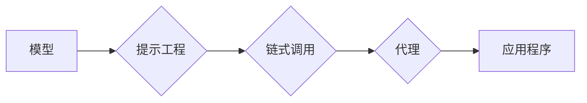

## 【LangChain编程：从入门到实践】语言模型

> 关键词：LangChain, 语言模型,  LLM,  应用程序,  Prompt Engineering,  Chain,  Agent

### 1. 背景介绍

近年来，大型语言模型（LLM）的快速发展掀起了人工智能领域的革命。这些模型展现出惊人的文本生成、理解和翻译能力，为各种应用领域带来了无限可能。然而，直接使用LLM往往需要复杂的代码编写和数据处理，难以满足普通开发者快速构建应用的需求。

为了解决这一问题，LangChain 应运而生。它是一个强大的开源框架，旨在简化与LLM的交互，并提供构建复杂应用程序的工具和组件。LangChain 提供了丰富的功能，包括：

* **提示工程 (Prompt Engineering):** 提供工具和技巧，帮助用户设计更有效、更精准的提示，以获得更理想的模型输出。
* **链式调用 (Chain):**  允许用户将多个LLM调用串联起来，构建更复杂的逻辑流程，实现更高级的功能。
* **代理 (Agent):**  提供框架，让用户构建能够与外部工具交互的智能代理，例如搜索引擎、数据库等，从而扩展LLM的能力。

### 2. 核心概念与联系

LangChain 的核心概念围绕着 **模型、提示、链和代理** 四个方面展开。

**Mermaid 流程图:**



* **模型 (Model):**  LLM 是 LangChain 的基础，它提供文本生成、理解和处理的能力。LangChain 支持多种主流 LLM，例如 OpenAI 的 GPT-3、Google 的 PaLM 等。
* **提示工程 (Prompt Engineering):**  提示是用户与模型交互的关键。通过精心设计提示，可以引导模型生成更准确、更符合预期结果的文本。LangChain 提供了多种提示模板和工具，帮助用户进行提示工程。
* **链式调用 (Chain):**  链允许用户将多个模型调用串联起来，构建更复杂的逻辑流程。例如，可以将一个模型用于文本分类，另一个模型用于根据分类结果生成相应的回复。
* **代理 (Agent):**  代理是能够与外部工具交互的智能实体。它可以利用 LLMs 的能力，并结合外部工具的知识和功能，完成更复杂的任务。例如，一个代理可以利用搜索引擎获取信息，并根据用户需求生成总结或回答问题。

### 3. 核心算法原理 & 具体操作步骤

LangChain 的核心算法原理主要基于 Transformer 模型的解码器结构，并结合了提示工程、链式调用和代理等技术。

#### 3.1  算法原理概述

Transformer 模型是一种深度学习模型，其解码器结构能够捕捉文本序列中的长距离依赖关系。LangChain 利用 Transformer 模型的解码器结构，通过训练和微调，使其能够理解用户输入的提示，并生成相应的文本输出。

#### 3.2  算法步骤详解

1. **输入处理:**  用户输入的文本首先会被预处理，例如转换为词向量，以便模型理解。
2. **提示编码:**  提示文本会被编码成一个向量表示，并与模型的输入序列拼接在一起。
3. **解码生成:**  模型的解码器结构会根据输入序列，逐个生成文本输出。
4. **输出解码:**  生成的文本输出会被解码成人类可读的文本。

#### 3.3  算法优缺点

**优点:**

* **强大的文本生成能力:** Transformer 模型能够生成高质量、流畅的文本。
* **长距离依赖关系捕捉:**  Transformer 模型能够捕捉文本序列中的长距离依赖关系，生成更上下文相关的文本。
* **可微性:**  Transformer 模型是可微的，可以通过反向传播算法进行训练和优化。

**缺点:**

* **训练成本高:**  Transformer 模型的参数量巨大，训练成本较高。
* **推理速度慢:**  Transformer 模型的推理速度相对较慢。
* **数据依赖性强:**  Transformer 模型的性能依赖于训练数据的质量和数量。

#### 3.4  算法应用领域

LangChain 的核心算法原理广泛应用于以下领域:

* **聊天机器人:**  构建能够进行自然语言对话的聊天机器人。
* **文本摘要:**  自动生成文本的摘要。
* **机器翻译:**  将文本从一种语言翻译成另一种语言。
* **代码生成:**  根据自然语言描述生成代码。
* **内容创作:**  辅助创作各种类型的文本内容，例如文章、故事、诗歌等。

### 4. 数学模型和公式 & 详细讲解 & 举例说明

Transformer 模型的核心数学模型是 **注意力机制 (Attention Mechanism)**。注意力机制允许模型关注输入序列中与当前生成词语最相关的部分，从而提高生成文本的准确性和相关性。

#### 4.1  数学模型构建

注意力机制的数学模型可以表示为以下公式:

$$
Attention(Q, K, V) = softmax(\frac{QK^T}{\sqrt{d_k}})V
$$

其中:

* $Q$ 是查询矩阵，表示当前生成词语的向量表示。
* $K$ 是键矩阵，表示输入序列中每个词语的向量表示。
* $V$ 是值矩阵，表示输入序列中每个词语的语义向量表示。
* $d_k$ 是键向量的维度。
* $softmax$ 函数将注意力权重归一化到 [0, 1] 之间。

#### 4.2  公式推导过程

注意力机制的公式推导过程可以分为以下几个步骤:

1. 计算查询矩阵 $Q$ 与键矩阵 $K$ 的点积，得到一个得分矩阵。
2. 对得分矩阵进行归一化，得到注意力权重矩阵。
3. 将注意力权重矩阵与值矩阵 $V$ 进行加权求和，得到最终的注意力输出。

#### 4.3  案例分析与讲解

例如，在机器翻译任务中，查询矩阵 $Q$ 表示目标语言中的当前生成词语，键矩阵 $K$ 和值矩阵 $V$ 表示源语言中的词语向量表示。注意力机制会计算每个源语言词语与目标语言当前生成词语之间的相关性，并根据相关性分配注意力权重。最终，模型会根据注意力权重加权求和源语言词语的语义向量，生成目标语言中的下一个词语。

### 5. 项目实践：代码实例和详细解释说明

以下是一个使用 LangChain 构建简单聊天机器人程序的代码实例:

#### 5.1  开发环境搭建

1. 安装 Python 3.7 或更高版本。
2. 安装 LangChain 库: `pip install langchain`
3. 安装 OpenAI 库: `pip install openai`

#### 5.2  源代码详细实现

```python
from langchain.llms import OpenAI
from langchain.chains import ConversationChain
from langchain.memory import ConversationBufferMemory

# 设置 OpenAI API 密钥
openai.api_key = "YOUR_API_KEY"

# 初始化 OpenAI 模型
llm = OpenAI(temperature=0.7)

# 初始化对话内存
memory = ConversationBufferMemory()

# 创建对话链
conversation = ConversationChain(
    llm=llm,
    memory=memory,
    prompt=f"你是一个友好的聊天机器人。\
",
)

# 与聊天机器人交互
while True:
    user_input = input("你: ")
    if user_input.lower() == "exit":
        break
    response = conversation.run(user_input)
    print("机器人:", response)
```

#### 5.3  代码解读与分析

1. 首先，我们导入必要的库，并设置 OpenAI API 密钥。
2. 然后，我们初始化 OpenAI 模型和对话内存。对话内存用于存储对话历史，以便模型能够理解上下文。
3. 接下来，我们创建对话链，并将模型和内存作为参数传递。对话链是一个用于管理对话流程的组件。
4. 最后，我们进入一个循环，不断获取用户输入，并使用对话链生成机器人回复。

#### 5.4  运行结果展示

运行代码后，用户可以与聊天机器人进行自然语言对话。聊天机器人会根据用户输入和对话历史生成相应的回复。

### 6. 实际应用场景

LangChain 的应用场景非常广泛，例如:

* **客服机器人:**  构建能够自动回答用户常见问题的客服机器人，提高客户服务效率。
* **教育助手:**  提供个性化的学习辅导，帮助学生理解知识点。
* **内容创作工具:**  辅助作家、记者等创作各种类型的文本内容。
* **代码生成工具:**  根据自然语言描述生成代码，提高开发效率。

#### 6.4  未来应用展望

随着 LLMs 的不断发展，LangChain 将会有更广泛的应用场景。例如:

* **多模态应用:**  结合图像、音频等多模态数据，构建更智能的应用。
* **个性化应用:**  根据用户的偏好和需求，定制个性化的应用体验。
* **边缘计算应用:**  将 LangChain 部署到边缘设备，实现更低延迟、更高效率的应用。

### 7. 工具和资源推荐

#### 7.1  学习资源推荐

* **LangChain 官方文档:** https://python.langchain.com/docs/
* **LangChain GitHub 仓库:** https://github.com/langchain-org/langchain
* **OpenAI 文档:** https://platform.openai.com/docs/

#### 7.2  开发工具推荐

* **Python:**  LangChain 是基于 Python 开发的框架。
* **Jupyter Notebook:**  用于编写和运行 Python 代码，方便进行实验和调试。
* **VS Code:**  一款功能强大的代码编辑器，支持 Python 开发。

#### 7.3  相关论文推荐

* **Attention Is All You Need:** https://arxiv.org/abs/1706.03762
* **BERT: Pre-training of Deep Bidirectional Transformers for Language Understanding:** https://arxiv.org/abs/1810.04805

### 8. 总结：未来发展趋势与挑战

LangChain 作为一种强大的开源框架，为构建 LLM 应用提供了便捷的工具和组件。未来，LangChain 将会朝着以下方向发展:

* **更强大的模型支持:**  支持更多主流的 LLM 模型，并提供更灵活的模型配置选项。
* **更丰富的功能组件:**  提供更多功能组件，例如数据处理、任务调度、用户界面等，帮助开发者构建更复杂的应用。
* **更易于使用的 API:**  提供更简洁、易于使用的 API，降低开发者使用门槛。

然而，LangChain 也面临着一些挑战:

* **模型训练成本:**  训练大型语言模型需要大量的计算资源和数据，成本较高。
* **模型安全性:**  LLM 模型可能存在生成有害内容的风险，需要加强安全性和伦理方面的研究。
* **模型可解释性:**  LLM 模型的决策过程难以理解，需要提高模型的可解释性。

### 9. 附录：常见问题与解答

#### 9.1  如何选择合适的 LLM 模型?

选择合适的 LLM 模型取决于具体的应用场景和需求。例如，对于需要生成高质量、流畅文本的应用，可以选择 GPT-3 等参数量较大的模型。对于需要快速响应的应用，可以选择参数量较小的模型。

#### 9.2  如何进行提示工程?

提示工程是使用 LangChain 构建 LLM 应用的关键步骤。可以通过以下方法进行提示工程:

* **明确提示目标:**  明确用户希望模型完成的任务。
* **提供上下文信息:**  提供足够的上下文信息，帮助模型理解用户需求。
* **使用示例:**  提供一些示例输入和输出，引导模型生成期望的输出。
* **测试和优化:**  不断测试和优化提示，以获得最佳效果。


作者：禅与计算机程序设计艺术 / Zen and the Art of Computer Programming 
