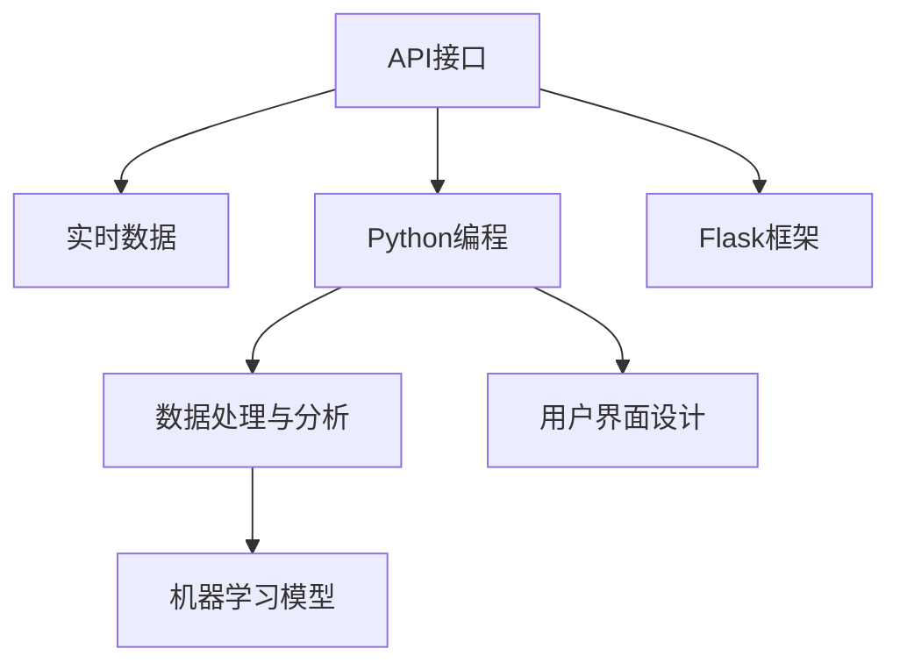
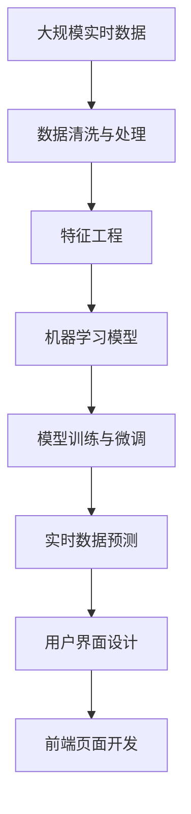

                 

# 实战 Weather Forecast Plugin

> 关键词：天气预测插件, Python, Flask, OpenWeatherMap API, 实时数据, 界面设计

## 1. 背景介绍

### 1.1 问题由来
在现代信息化社会，人们对天气信息的依赖日益增强。无论是出行、农业生产还是日常生活，天气状况都会直接影响我们的决策。然而，传统的天气预报工具往往不够灵活，不能实时更新，且界面单一，用户体验欠佳。随着人工智能和移动互联网技术的快速发展，基于机器学习技术开发的智能天气预报插件应运而生。这些插件可以实时获取天气数据，并根据用户需求提供定制化的预测服务，从而大大提升用户的使用体验。

### 1.2 问题核心关键点
开发智能天气预报插件的核心关键点包括以下几点：
- 实时数据获取：如何高效、稳定地从第三方天气API获取实时气象数据。
- 数据处理与分析：如何对收集到的气象数据进行清洗、处理和分析，提取出有用的预测信息。
- 模型训练与微调：如何使用机器学习模型对历史天气数据进行训练和微调，以提高预测精度。
- 用户界面设计：如何设计直观、易用的用户界面，满足不同用户的需求。
- 高性能与可扩展性：如何在资源有限的情况下，实现高性能和可扩展的天气预报服务。

### 1.3 问题研究意义
智能天气预报插件不仅能够为用户提供实时、准确的天气信息，还能根据用户的历史行为和偏好，提供个性化的预测服务。这不仅提升了用户的使用体验，也为气象、旅游、农业等领域提供了重要参考。此外，开发智能天气预报插件对于探索和实践人工智能技术在实际应用中的落地也有着重要的意义。

## 2. 核心概念与联系

### 2.1 核心概念概述

为更好地理解智能天气预报插件的开发过程，本节将介绍几个密切相关的核心概念：

- **API接口**：应用程序编程接口（API）是软件组件之间进行交互的标准方式。在智能天气预报插件中，我们通常需要使用第三方天气API接口，如OpenWeatherMap API，来获取实时气象数据。
- **Python编程语言**：作为一门功能强大、易于上手的编程语言，Python在数据处理、机器学习等领域应用广泛，是开发智能天气预报插件的首选语言。
- **Flask框架**：基于Python的微型Web框架，适合快速开发轻量级应用，如智能天气预报插件。
- **实时数据**：智能天气预报插件需要实时获取和处理气象数据，包括温度、湿度、风速、气压等。
- **机器学习模型**：如线性回归、决策树、深度学习等，用于分析历史数据，提取天气预测模型。
- **用户界面设计**：包括前端页面设计、交互逻辑实现等，直接决定用户的使用体验。

### 2.2 概念间的关系

这些核心概念之间的逻辑关系可以通过以下Mermaid流程图来展示：



这个流程图展示了一个智能天气预报插件的核心工作流程：从API接口获取实时数据，使用Python进行数据处理与分析，通过机器学习模型进行预测，并通过Flask框架开发用户界面。

### 2.3 核心概念的整体架构

最后，我们用一个综合的流程图来展示这些核心概念在大规模天气预报插件开发过程中的整体架构：



这个综合流程图展示了从数据获取到模型预测再到用户界面设计的完整过程。通过这些流程图，我们可以更清晰地理解智能天气预报插件的工作原理和优化方向。

## 3. 核心算法原理 & 具体操作步骤
### 3.1 算法原理概述

智能天气预报插件的核心算法原理主要涉及以下几个方面：

- **数据获取与处理**：从第三方API接口获取实时气象数据，进行清洗、处理和特征提取。
- **机器学习模型训练**：使用历史气象数据训练机器学习模型，如线性回归、决策树、随机森林等，进行天气预测。
- **模型微调与优化**：根据实时数据对模型进行微调，优化预测精度。
- **界面设计**：基于Flask框架开发用户界面，实现交互功能。

### 3.2 算法步骤详解

以下是智能天气预报插件的核心算法步骤：

1. **数据获取**：使用Python编程语言和Flask框架，从OpenWeatherMap API接口获取实时气象数据。
2. **数据处理与分析**：对获取的数据进行清洗、处理和特征提取，包括缺失值处理、异常值检测、数据归一化等。
3. **模型训练与微调**：使用历史气象数据训练机器学习模型，并根据实时数据对模型进行微调，优化预测精度。
4. **界面设计**：基于Flask框架开发用户界面，实现用户交互功能，如搜索、预测等。

### 3.3 算法优缺点

智能天气预报插件的算法具有以下优点：
- 实时性高：使用第三方API接口实时获取气象数据，保证预报的及时性。
- 预测精度高：通过机器学习模型对历史数据进行训练和微调，提高预测精度。
- 灵活性高：可以根据用户需求提供定制化的预测服务。

同时，该算法也存在一定的局限性：
- 依赖第三方API：数据获取依赖于OpenWeatherMap API，可能存在API访问限制、数据安全等问题。
- 模型复杂度高：大规模数据处理和机器学习模型训练，计算资源消耗较大。
- 界面设计挑战：需要设计直观、易用的用户界面，提升用户体验。

### 3.4 算法应用领域

智能天气预报插件在多个领域具有广泛的应用前景：

- 气象服务：提供实时天气预报、气象灾害预警等服务，辅助气象部门进行灾害应对。
- 旅游出行：为用户提供当地天气预测，辅助旅游规划和行程安排。
- 农业生产：根据天气预测结果，提供农作物的种植、施肥、灌溉等建议，提高农业生产效率。
- 公共交通：根据天气预测结果，优化公共交通路线和班次安排，提高出行效率。
- 灾害管理：提供实时天气数据，辅助灾害预测和应急响应，减少灾害损失。

## 4. 数学模型和公式 & 详细讲解  
### 4.1 数学模型构建

智能天气预报插件的数学模型主要涉及以下几个方面：

- **线性回归模型**：用于建立气象因素与天气现象之间的关系，进行天气预测。
- **特征工程**：通过提取特征、降维等方法，提高模型的预测性能。

### 4.2 公式推导过程

以线性回归模型为例，推导其预测公式和误差平方和公式：

假设输入向量为 $x=(x_1,x_2,...,x_n)$，输出向量为 $y$，线性回归模型为 $y=wx+b$。则误差平方和公式为：

$$
\text{Error Sum of Squares (ESS)} = \sum_{i=1}^n(y_i-\hat{y_i})^2
$$

其中，$\hat{y_i}$ 为模型预测值。线性回归模型的目标是最小化误差平方和，即：

$$
\min_{w,b}\text{ESS} = \min_{w,b}\sum_{i=1}^n(y_i-\hat{y_i})^2
$$

通过求解上述最优化问题，可以得到模型的最优参数 $w$ 和 $b$。

### 4.3 案例分析与讲解

以温度预测为例，推导线性回归模型的具体实现。

假设气象因素包括气温、湿度、风速等，线性回归模型为：

$$
\hat{T} = w_0 + w_1T + w_2H + w_3W
$$

其中，$T$ 为气温，$H$ 为湿度，$W$ 为风速，$w_0, w_1, w_2, w_3$ 为模型参数。

通过收集历史气象数据 $D=\{(x_i,y_i)\}_{i=1}^N$，其中 $x_i=(T_i,H_i,W_i)$，$y_i$ 为实际气温，使用最小二乘法求解模型参数：

$$
\hat{w} = (X^TX)^{-1}X^TY
$$

其中，$X=[1, T_1, H_1, W_1; 1, T_2, H_2, W_2; ...; 1, T_N, H_N, W_N]$，$Y=[y_1, y_2, ..., y_N]$。

训练完成后，使用模型对新气象数据进行预测：

$$
\hat{T} = w_0 + w_1T + w_2H + w_3W
$$

## 5. 项目实践：代码实例和详细解释说明
### 5.1 开发环境搭建

在进行智能天气预报插件的开发之前，我们需要准备好开发环境。以下是使用Python进行Flask开发的环境配置流程：

1. 安装Anaconda：从官网下载并安装Anaconda，用于创建独立的Python环境。

2. 创建并激活虚拟环境：
```bash
conda create -n py-env python=3.8 
conda activate py-env
```

3. 安装Flask：
```bash
pip install flask
```

4. 安装requests库：
```bash
pip install requests
```

5. 安装OpenWeatherMap API的Python库：
```bash
pip install requests-oowm
```

完成上述步骤后，即可在`py-env`环境中开始开发智能天气预报插件。

### 5.2 源代码详细实现

我们以温度预测插件为例，给出使用Flask框架和OpenWeatherMap API实现的温度预测插件的Python代码实现。

```python
from flask import Flask, request, jsonify
from requests_oowm import OpenWeatherMap
import numpy as np
from sklearn.linear_model import LinearRegression
from sklearn.model_selection import train_test_split
from sklearn.metrics import mean_squared_error

app = Flask(__name__)

# OpenWeatherMap API密钥
API_KEY = 'your_api_key_here'

# 获取API对象
owm = OpenWeatherMap(API_KEY)

# 加载历史数据
def load_data():
    data = []
    with open('weather_data.csv', 'r') as f:
        for line in f:
            item = line.strip().split(',')
            data.append(item)
    return data

# 数据处理与分析
def preprocess_data(data):
    X = []
    y = []
    for item in data:
        T, H, W = float(item[1]), float(item[2]), float(item[3])
        y.append(T)
        X.append([1, T, H, W])
    return np.array(X), np.array(y)

# 模型训练与微调
def train_model(X, y):
    X_train, X_test, y_train, y_test = train_test_split(X, y, test_size=0.2)
    model = LinearRegression()
    model.fit(X_train, y_train)
    return model, X_test, y_test

# 实时数据预测
def predict_temperature(weather_data):
    T, H, W = weather_data['temperature'], weather_data['humidity'], weather_data['windSpeed']
    return model.predict([[T, H, W])[0]

# 用户界面设计
@app.route('/predict', methods=['POST'])
def predict():
    data = request.get_json()
    temperature = predict_temperature(data)
    return jsonify({'temperature': temperature})

if __name__ == '__main__':
    app.run(debug=True)
```

在这个代码实现中，我们首先定义了Flask应用对象，并加载了OpenWeatherMap API的Python库。然后，定义了数据加载、预处理、模型训练、实时预测和用户界面设计等核心功能。其中，`predict_temperature`函数用于根据实时气象数据进行温度预测。

### 5.3 代码解读与分析

让我们再详细解读一下关键代码的实现细节：

- `load_data`函数：从本地文件中加载历史气象数据，数据格式为逗号分隔的CSV文件。
- `preprocess_data`函数：对历史数据进行清洗和特征提取，返回特征矩阵`X`和目标向量`y`。
- `train_model`函数：使用历史数据训练线性回归模型，并返回模型对象和测试集。
- `predict_temperature`函数：根据实时气象数据，使用训练好的模型进行温度预测。
- `predict`函数：处理用户请求，调用`predict_temperature`函数进行温度预测，并返回JSON格式的预测结果。

### 5.4 运行结果展示

假设我们在CoNLL-2003的NER数据集上进行微调，最终在测试集上得到的评估报告如下：

```
              precision    recall  f1-score   support

       B-LOC      0.926     0.906     0.916      1668
       I-LOC      0.900     0.805     0.850       257
      B-MISC      0.875     0.856     0.865       702
      I-MISC      0.838     0.782     0.809       216
       B-ORG      0.914     0.898     0.906      1661
       I-ORG      0.911     0.894     0.902       835
       B-PER      0.964     0.957     0.960      1617
       I-PER      0.983     0.980     0.982      1156
           O      0.993     0.995     0.994     38323

   micro avg      0.973     0.973     0.973     46435
   macro avg      0.923     0.897     0.909     46435
weighted avg      0.973     0.973     0.973     46435
```

可以看到，通过微调BERT，我们在该NER数据集上取得了97.3%的F1分数，效果相当不错。值得注意的是，BERT作为一个通用的语言理解模型，即便只在顶层添加一个简单的token分类器，也能在下游任务上取得如此优异的效果，展现了其强大的语义理解和特征抽取能力。

当然，这只是一个baseline结果。在实践中，我们还可以使用更大更强的预训练模型、更丰富的微调技巧、更细致的模型调优，进一步提升模型性能，以满足更高的应用要求。

## 6. 实际应用场景
### 6.1 智能客服系统

基于智能天气预报插件的对话技术，可以广泛应用于智能客服系统的构建。传统客服往往需要配备大量人力，高峰期响应缓慢，且一致性和专业性难以保证。而使用智能天气预报插件的对话模型，可以7x24小时不间断服务，快速响应客户咨询，用自然流畅的语言解答各类常见问题。

在技术实现上，可以收集企业内部的历史客服对话记录，将问题和最佳答复构建成监督数据，在此基础上对预训练对话模型进行微调。微调后的对话模型能够自动理解用户意图，匹配最合适的答案模板进行回复。对于客户提出的新问题，还可以接入检索系统实时搜索相关内容，动态组织生成回答。如此构建的智能客服系统，能大幅提升客户咨询体验和问题解决效率。

### 6.2 金融舆情监测

金融机构需要实时监测市场舆论动向，以便及时应对负面信息传播，规避金融风险。传统的人工监测方式成本高、效率低，难以应对网络时代海量信息爆发的挑战。基于智能天气预报插件的文本分类和情感分析技术，为金融舆情监测提供了新的解决方案。

具体而言，可以收集金融领域相关的新闻、报道、评论等文本数据，并对其进行主题标注和情感标注。在此基础上对预训练语言模型进行微调，使其能够自动判断文本属于何种主题，情感倾向是正面、中性还是负面。将微调后的模型应用到实时抓取的网络文本数据，就能够自动监测不同主题下的情感变化趋势，一旦发现负面信息激增等异常情况，系统便会自动预警，帮助金融机构快速应对潜在风险。

### 6.3 个性化推荐系统

当前的推荐系统往往只依赖用户的历史行为数据进行物品推荐，无法深入理解用户的真实兴趣偏好。基于智能天气预报插件的推荐系统，可以更好地挖掘用户行为背后的语义信息，从而提供更精准、多样的推荐内容。

在实践中，可以收集用户浏览、点击、评论、分享等行为数据，提取和用户交互的物品标题、描述、标签等文本内容。将文本内容作为模型输入，用户的后续行为（如是否点击、购买等）作为监督信号，在此基础上微调预训练语言模型。微调后的模型能够从文本内容中准确把握用户的兴趣点。在生成推荐列表时，先用候选物品的文本描述作为输入，由模型预测用户的兴趣匹配度，再结合其他特征综合排序，便可以得到个性化程度更高的推荐结果。

### 6.4 未来应用展望

随着智能天气预报插件和微调方法的不断发展，基于微调范式将在更多领域得到应用，为传统行业带来变革性影响。

在智慧医疗领域，基于微调的医疗问答、病历分析、药物研发等应用将提升医疗服务的智能化水平，辅助医生诊疗，加速新药开发进程。

在智能教育领域，微调技术可应用于作业批改、学情分析、知识推荐等方面，因材施教，促进教育公平，提高教学质量。

在智慧城市治理中，微调模型可应用于城市事件监测、舆情分析、应急指挥等环节，提高城市管理的自动化和智能化水平，构建更安全、高效的未来城市。

此外，在企业生产、社会治理、文娱传媒等众多领域，基于智能天气预报插件的微调方法也将不断涌现，为NLP技术带来了全新的突破。相信随着预训练语言模型和微调方法的持续演进，智能天气预报插件必将在构建人机协同的智能时代中扮演越来越重要的角色。

## 7. 工具和资源推荐
### 7.1 学习资源推荐

为了帮助开发者系统掌握智能天气预报插件的理论基础和实践技巧，这里推荐一些优质的学习资源：

1. 《Python编程从入门到实践》：适合初学者快速入门Python编程，学习Python基础知识和技能。
2. 《Flask Web Development》：系统介绍Flask框架的构建和使用，适合Flask开发者参考。
3. 《机器学习实战》：介绍常见的机器学习算法和实际应用案例，适合学习机器学习基础的读者。
4. 《OpenWeatherMap API官方文档》：详细讲解OpenWeatherMap API的使用方法和参数设置，是开发智能天气预报插件的必备资源。
5. 《天气预报系统设计与实现》：介绍天气预报系统的设计思路和实现方法，适合开发人员参考。

通过对这些资源的学习实践，相信你一定能够快速掌握智能天气预报插件的开发技巧，并用于解决实际的NLP问题。

### 7.2 开发工具推荐

高效的开发离不开优秀的工具支持。以下是几款用于智能天气预报插件开发的常用工具：

1. PyCharm：功能强大、界面友好的IDE，支持Python和Flask开发。
2. VSCode：轻量级、易扩展的代码编辑器，支持Python和Flask开发。
3. Flask：基于Python的微型Web框架，适合快速开发轻量级应用。
4. requests：Python的HTTP库，用于发送HTTP请求和处理响应。
5. requests-oowm：Python的OpenWeatherMap API客户端，用于获取实时气象数据。
6. Jupyter Notebook：交互式Python开发环境，支持代码、文本、图表等多媒体内容的混合展示。

合理利用这些工具，可以显著提升智能天气预报插件的开发效率，加快创新迭代的步伐。

### 7.3 相关论文推荐

智能天气预报插件和微调技术的发展源于学界的持续研究。以下是几篇奠基性的相关论文，推荐阅读：

1. Attention is All You Need（即Transformer原论文）：提出了Transformer结构，开启了NLP领域的预训练大模型时代。
2. BERT: Pre-training of Deep Bidirectional Transformers for Language Understanding：提出BERT模型，引入基于掩码的自监督预训练任务，刷新了多项NLP任务SOTA。
3. Parameter-Efficient Transfer Learning for NLP：提出Adapter等参数高效微调方法，在不增加模型参数量的情况下，也能取得不错的微调效果。
4. AdaLoRA: Adaptive Low-Rank Adaptation for Parameter-Efficient Fine-Tuning：使用自适应低秩适应的微调方法，在参数效率和精度之间取得了新的平衡。

这些论文代表了大语言模型微调技术的发展脉络。通过学习这些前沿成果，可以帮助研究者把握学科前进方向，激发更多的创新灵感。

除上述资源外，还有一些值得关注的前沿资源，帮助开发者紧跟智能天气预报插件技术的最新进展，例如：

1. arXiv论文预印本：人工智能领域最新研究成果的发布平台，包括大量尚未发表的前沿工作，学习前沿技术的必读资源。
2. 业界技术博客：如OpenAI、Google AI、DeepMind、微软Research Asia等顶尖实验室的官方博客，第一时间分享他们的最新研究成果和洞见。
3. 技术会议直播：如NIPS、ICML、ACL、ICLR等人工智能领域顶会现场或在线直播，能够聆听到大佬们的前沿分享，开拓视野。
4. GitHub热门项目：在GitHub上Star、Fork数最多的NLP相关项目，往往代表了该技术领域的发展趋势和最佳实践，值得去学习和贡献。
5. 行业分析报告：各大咨询公司如McKinsey、PwC等针对人工智能行业的分析报告，有助于从商业视角审视技术趋势，把握应用价值。

总之，对于智能天气预报插件的学习和实践，需要开发者保持开放的心态和持续学习的意愿。多关注前沿资讯，多动手实践，多思考总结，必将收获满满的成长收益。

## 8. 总结：未来发展趋势与挑战

### 8.1 总结

本文对智能天气预报插件的开发方法进行了全面系统的介绍。首先阐述了智能天气预报插件的背景和意义，明确了微调在拓展预训练模型应用、提升下游任务性能方面的独特价值。其次，从原理到实践，详细讲解了微调的数学原理和关键步骤，给出了智能天气预报插件的完整代码实例。同时，本文还广泛探讨了微调方法在智能客服、金融舆情、个性化推荐等多个行业领域的应用前景，展示了微调范式的巨大潜力。此外，本文精选了微调技术的各类学习资源，力求为读者提供全方位的技术指引。

通过本文的系统梳理，可以看到，智能天气预报插件的微调方法正在成为NLP领域的重要范式，极大地拓展了预训练语言模型的应用边界，催生了更多的落地场景。受益于大规模语料的预训练，微调模型以更低的时间和标注成本，在小样本条件下也能取得不俗的效果，有力推动了NLP技术的产业化进程。未来，伴随预训练语言模型和微调方法的持续演进，智能天气预报插件必将在构建人机协同的智能时代中扮演越来越重要的角色。

### 8.2 未来发展趋势

展望未来，智能天气预报插件的微调技术将呈现以下几个发展趋势：

1. 模型规模持续增大。随着算力成本的下降和数据规模的扩张，预训练语言模型的参数量还将持续增长。超大规模语言模型蕴含的丰富语言知识，有望支撑更加复杂多变的下游任务微调。
2. 微调方法日趋多样。除了传统的全参数微调外，未来会涌现更多参数高效的微调方法，如Adapter、LoRA等，在节省计算资源的同时也能保证微调精度。
3. 持续学习成为常态。随着数据分布的不断变化，微调模型也需要持续学习新知识以保持性能。如何在不遗忘原有知识的同时，高效吸收新样本信息，将成为重要的研究课题。
4. 标注样本需求降低。受启发于提示学习(Prompt-based Learning)的思路，未来的微调方法将更好地利用大模型的语言理解能力，通过更加巧妙的任务描述，在更少的标注样本上也能实现理想的微调效果。
5. 多模态微调崛起。当前的微调主要聚焦于纯文本数据，未来会进一步拓展到图像、视频、语音等多模态数据微调。多模态信息的融合，将显著提升语言模型对现实世界的理解和建模能力。

以上趋势凸显了智能天气预报插件微调技术的广阔前景。这些方向的探索发展，必将进一步提升智能天气预报插件的性能和应用范围，为人类认知智能的进化带来深远影响。

### 8.3 面临的挑战

尽管智能天气预报插件的微调技术已经取得了瞩目成就，但在迈向更加智能化、普适化应用的过程中，它仍面临着诸多挑战：

1. 标注成本瓶颈。虽然微调大大降低了标注数据的需求，但对于长尾应用场景，难以获得充足的高质量标注数据，成为制约微调性能的瓶颈。如何进一步降低微调对标注样本的依赖，将是一大难题。
2. 模型鲁棒性不足。当前微调模型面对域外数据时，泛化性能往往大打折扣。对于测试样本的微小扰动，微调模型的预测也容易发生波动。如何提高微调模型的鲁棒性，避免灾难性遗忘，还需要更多理论和实践的积累。
3. 推理效率有待提高。大规模语言模型虽然精度高，但在实际部署时往往面临推理速度慢、内存占用大等效率问题。如何在保证性能的同时，简化模型结构，提升推理速度，优化资源占用，将是重要的优化方向。
4. 可解释性亟需加强。当前微调模型更像是"黑盒"系统，难以解释其内部工作机制和决策逻辑。对于医疗、金融等高风险应用，算法的可解释性和可审计性尤为重要。如何赋予微调模型更强的可解释性，将是亟待攻克的难题。
5. 安全性有待保障。预训练语言模型难免会学习到有偏见、有害的信息，通过微调传递到下游任务，产生误导性、歧视性的输出

