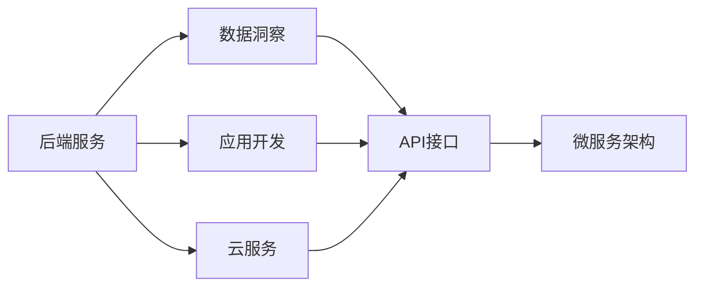
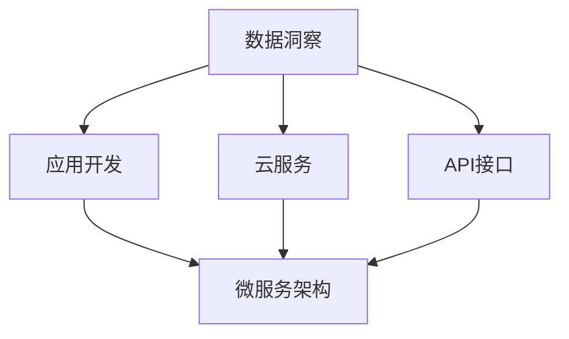
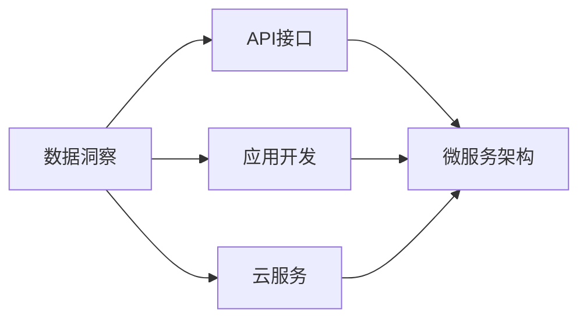
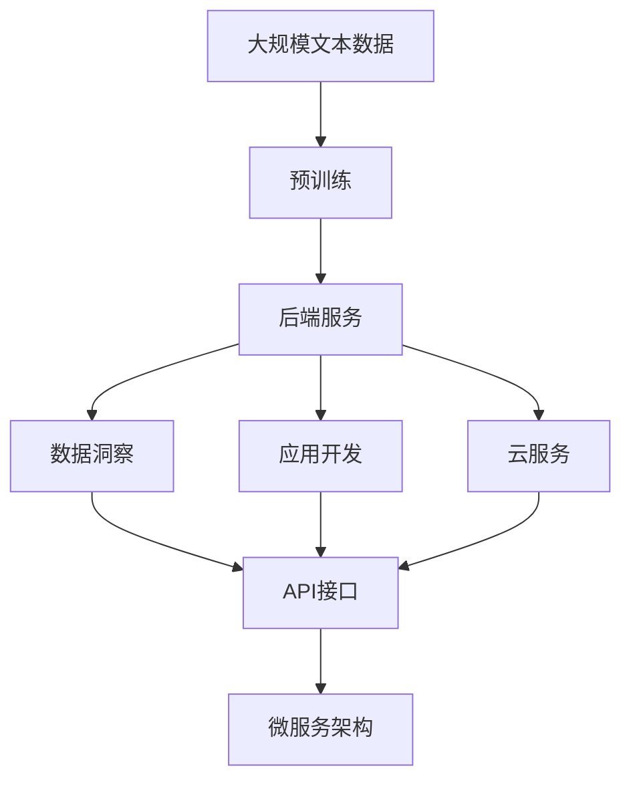

                 

# 延迟满足：后端服务带来的盈利模式

在快节奏的互联网时代，盈利模式的多样化已经成为了企业发展的关键要素之一。随着数字化转型的不断推进，后端服务作为一种新兴的盈利模式正在逐渐崛起，并在各大企业的盈利结构中占据重要地位。本文将深入探讨后端服务带来的盈利模式，并通过逻辑清晰、结构紧凑、简单易懂的专业的技术语言，全面解析后端服务的技术原理、具体步骤以及其应用领域。同时，还将结合数学模型和案例分析，进一步阐述后端服务的优势和局限性，并探讨其未来的发展趋势和挑战。

## 1. 背景介绍

### 1.1 问题由来

在传统互联网盈利模式中，企业主要通过广告、销售等渠道获得收入。然而，随着用户需求的多样化和技术的不断进步，单一的盈利模式已经难以满足企业的持续发展需求。后端服务作为一种新的盈利模式，凭借其灵活性、高效性和盈利潜力，逐渐成为企业关注的焦点。

后端服务通常是指企业为其他企业或客户提供数据处理、应用开发、云服务等一系列后台支持服务。通过提供这些服务，企业不仅能增加自身的收入来源，还能提升自身在行业中的地位和竞争力。

### 1.2 问题核心关键点

后端服务的盈利模式主要包括以下几个方面：

- **数据处理服务**：企业通过收集和分析大量数据，为其他企业提供数据洞察和决策支持。
- **应用开发服务**：企业为其他企业开发和维护应用系统，帮助其实现业务数字化和智能化。
- **云服务**：企业提供云基础设施和云应用服务，满足客户在不同场景下的计算和存储需求。

这些服务不仅可以为其他企业带来显著的成本节约和效率提升，还能帮助企业快速拓展市场，实现快速盈利。

### 1.3 问题研究意义

研究后端服务带来的盈利模式，对于企业转型升级、提升市场竞争力具有重要意义：

1. **增加收入来源**：通过提供后端服务，企业可以在保持传统业务稳定的同时，拓展新的收入渠道。
2. **提高运营效率**：后端服务能帮助客户优化运营流程，降低运营成本。
3. **提升客户满意度**：高质量的后端服务能够提高客户的使用体验，增加客户粘性。
4. **加速数字化转型**：后端服务有助于企业加速数字化进程，提升市场竞争力。
5. **促进行业发展**：后端服务的普及和应用，将推动整个行业的数字化转型，促进技术进步。

## 2. 核心概念与联系

### 2.1 核心概念概述

为更好地理解后端服务带来的盈利模式，本节将介绍几个密切相关的核心概念：

- **后端服务**：指为其他企业或客户提供数据处理、应用开发、云服务等一系列后台支持服务。
- **数据洞察**：通过数据分析和处理，为其他企业提供决策支持。
- **应用开发**：为企业提供应用系统的开发和维护，实现业务数字化和智能化。
- **云服务**：提供云基础设施和云应用服务，满足客户在不同场景下的计算和存储需求。
- **API接口**：为其他企业提供接口访问服务，方便数据交互和应用集成。
- **微服务架构**：通过将应用拆分为多个小型服务，实现系统的模块化、可扩展性和高可用性。

这些核心概念之间的逻辑关系可以通过以下Mermaid流程图来展示：



这个流程图展示后端服务的核心概念及其之间的关系：

1. 后端服务通过提供数据洞察、应用开发和云服务，为客户带来收益。
2. API接口是后端服务的重要组成部分，便于数据交互和应用集成。
3. 微服务架构是后端服务的一种实现方式，通过模块化和可扩展性提高系统效率。

### 2.2 概念间的关系

这些核心概念之间存在着紧密的联系，形成了后端服务的完整生态系统。下面我通过几个Mermaid流程图来展示这些概念之间的关系。

#### 2.2.1 后端服务的组成



这个流程图展示了后端服务的各个组成部分：

1. 数据洞察、应用开发和云服务是后端服务的主要组成部分。
2. API接口和微服务架构是实现这些服务的关键技术手段。

#### 2.2.2 后端服务的实现



这个流程图展示了后端服务的实现过程：

1. 数据洞察、应用开发和云服务通过API接口和微服务架构实现。
2. API接口提供数据交互和应用集成的接口。
3. 微服务架构通过模块化、可扩展性提高系统效率。

### 2.3 核心概念的整体架构

最后，我们用一个综合的流程图来展示这些核心概念在大语言模型微调过程中的整体架构：



这个综合流程图展示了从预训练到后端服务的完整过程。后端服务通过提供数据洞察、应用开发和云服务，为客户带来收益。API接口和微服务架构是实现这些服务的关键技术手段。通过这些技术的结合，后端服务能够为客户提供高效、灵活、安全的服务。

## 3. 核心算法原理 & 具体操作步骤
### 3.1 算法原理概述

后端服务带来的盈利模式主要基于以下几个核心算法原理：

- **数据处理算法**：通过大数据处理技术，从海量数据中提取有价值的信息，为客户提供决策支持。
- **应用开发算法**：通过软件工程方法和自动化工具，开发和维护应用系统，实现业务数字化和智能化。
- **云服务算法**：通过云计算技术，提供高效、安全、可靠的云基础设施和云应用服务，满足客户在不同场景下的计算和存储需求。

这些算法原理共同构成了后端服务的核心竞争力，通过科学合理的算法设计和实现，后端服务能够为客户提供优质的服务体验。

### 3.2 算法步骤详解

后端服务的具体操作流程包括以下几个步骤：

**Step 1: 需求分析**

- 收集客户的需求和反馈，分析客户业务场景和痛点。
- 根据客户需求，制定详细的技术方案和服务蓝图。

**Step 2: 数据采集和处理**

- 通过API接口或直接接入客户的业务系统，采集业务数据。
- 利用大数据处理技术，清洗、整理和分析数据，提取有价值的信息。

**Step 3: 应用开发和部署**

- 根据客户需求，设计并开发应用系统，实现业务数字化和智能化。
- 将开发好的应用部署到云端或本地环境，进行系统测试和优化。

**Step 4: 云服务提供**

- 根据客户需求，提供云基础设施和云应用服务，满足客户在不同场景下的计算和存储需求。
- 监控和管理云服务，确保服务的稳定性和可靠性。

**Step 5: 持续改进**

- 根据客户反馈和业务需求，不断优化和改进服务质量。
- 通过API接口和微服务架构，实现系统的模块化和可扩展性。

通过以上步骤，后端服务能够为客户提供高效、灵活、安全的服务，实现盈利模式的可持续性。

### 3.3 算法优缺点

后端服务带来的盈利模式具有以下优点：

- **灵活性和多样性**：后端服务能够根据客户需求提供定制化服务，满足不同客户的不同需求。
- **高效性和低成本**：通过采用云计算和自动化技术，后端服务能够实现高效运营和低成本服务。
- **高可靠性和高可用性**：通过微服务架构和云服务，后端服务能够提供高可靠性和高可用性的服务。

同时，后端服务也存在一些缺点：

- **依赖客户数据**：后端服务需要依赖客户的业务数据，对数据的完整性和安全性有较高要求。
- **技术门槛较高**：后端服务涉及大数据、云计算、软件工程等多个领域的知识，对技术门槛要求较高。
- **服务质量依赖客户**：后端服务的效果和质量，在一定程度上依赖于客户的应用系统和数据质量。

### 3.4 算法应用领域

后端服务已经在多个领域得到了广泛应用，例如：

- **金融科技**：为企业提供数据洞察和决策支持，提升风险管理和运营效率。
- **医疗健康**：为医疗机构提供云基础设施和云应用服务，支持远程医疗和健康管理。
- **物流供应链**：为企业提供数据处理和应用开发服务，优化物流和供应链管理。
- **零售电商**：为企业提供应用开发和云服务，支持电商平台的运营和扩展。
- **教育培训**：为教育机构提供数据处理和应用开发服务，提升教学质量和效果。
- **政府和企业数字化**：为政府和企业提供数据洞察和应用开发服务，支持数字化转型。

除了上述这些经典应用领域外，后端服务还在更多场景中得到了创新性的应用，如智能制造、智慧城市等，为各行各业带来了新的发展机遇。

## 4. 数学模型和公式 & 详细讲解 & 举例说明

### 4.1 数学模型构建

假设后端服务为客户提供的数据洞察服务，其中涉及的数据集为 $D = \{(x_i, y_i)\}_{i=1}^N$，其中 $x_i$ 为业务数据，$y_i$ 为标签或特征。后端服务的目标是找到一个最优的模型 $f(x)$，使得模型在数据集 $D$ 上的损失函数最小化，即：

$$
\min_{f(x)} \frac{1}{N}\sum_{i=1}^N \ell(f(x_i), y_i)
$$

其中 $\ell$ 为损失函数，常用的损失函数包括均方误差损失、交叉熵损失等。

### 4.2 公式推导过程

以均方误差损失为例，后端服务的目标函数可以表示为：

$$
\min_{f(x)} \frac{1}{N}\sum_{i=1}^N (y_i - f(x_i))^2
$$

其中 $y_i$ 为标签或特征，$f(x_i)$ 为模型对 $x_i$ 的预测值。

通过梯度下降等优化算法，后端服务能够不断更新模型参数，最小化损失函数，最终得到最优的预测模型 $f(x)$。

### 4.3 案例分析与讲解

假设某金融科技公司需要提供数据洞察服务，帮助客户分析其运营数据，优化风险管理。该公司收集了客户的业务数据 $D = \{(x_i, y_i)\}_{i=1}^N$，其中 $x_i$ 为客户的运营数据，$y_i$ 为风险评分。

该公司采用回归模型作为预测模型，其目标函数为：

$$
\min_{f(x)} \frac{1}{N}\sum_{i=1}^N (y_i - f(x_i))^2
$$

通过采用梯度下降算法，该公司不断更新模型参数，最小化损失函数，最终得到了一个风险评分预测模型。该模型能够根据客户的运营数据，预测其风险评分，帮助客户优化风险管理。

## 5. 项目实践：代码实例和详细解释说明

### 5.1 开发环境搭建

在进行后端服务实践前，我们需要准备好开发环境。以下是使用Python进行Flask开发的环境配置流程：

1. 安装Anaconda：从官网下载并安装Anaconda，用于创建独立的Python环境。

2. 创建并激活虚拟环境：
```bash
conda create -n flask-env python=3.8 
conda activate flask-env
```

3. 安装Flask：
```bash
pip install Flask
```

4. 安装相关库：
```bash
pip install pandas numpy sklearn
```

完成上述步骤后，即可在`flask-env`环境中开始后端服务实践。

### 5.2 源代码详细实现

下面我们以金融科技领域的数据洞察服务为例，给出使用Flask框架实现后端服务的PyTorch代码实现。

首先，定义数据处理函数：

```python
import pandas as pd
from sklearn.model_selection import train_test_split

def load_data(path):
    data = pd.read_csv(path)
    X = data.drop(['label'], axis=1)
    y = data['label']
    return train_test_split(X, y, test_size=0.2, random_state=42)
```

然后，定义模型和预测函数：

```python
from sklearn.linear_model import LinearRegression
from sklearn.metrics import mean_squared_error

def train_model(X_train, y_train):
    model = LinearRegression()
    model.fit(X_train, y_train)
    return model

def predict(model, X_test):
    y_pred = model.predict(X_test)
    return y_pred
```

接着，定义Flask应用：

```python
from flask import Flask, request, jsonify

app = Flask(__name__)

@app.route('/predict', methods=['POST'])
def predict_api():
    X_test = request.json['data']
    model = train_model(X_train, y_train)
    y_pred = predict(model, X_test)
    result = {'predictions': y_pred.tolist()}
    return jsonify(result)
```

最后，启动Flask应用：

```python
if __name__ == '__main__':
    app.run(debug=True)
```

### 5.3 代码解读与分析

让我们再详细解读一下关键代码的实现细节：

**load_data函数**：
- 从指定的路径加载数据集，并分割为训练集和测试集。
- 数据集分割比例为80%训练集，20%测试集。
- 随机种子固定为42，保证数据分割的一致性。

**train_model函数**：
- 定义一个线性回归模型。
- 使用训练集数据训练模型，返回训练好的模型。

**predict函数**：
- 使用训练好的模型对测试集数据进行预测，返回预测结果。

**predict_api函数**：
- 定义Flask应用，接受POST请求，包含数据X_test。
- 通过调用train_model和predict函数，得到预测结果，并返回JSON格式的结果。

通过上述代码实现，我们展示了如何使用Flask框架实现一个简单的数据洞察服务。在这个例子中，我们通过线性回归模型对客户运营数据进行分析，并根据分析结果预测客户的风险评分。

## 6. 实际应用场景

### 6.1 智能制造

后端服务在智能制造领域有广泛的应用场景。通过提供数据处理和应用开发服务，后端服务能够帮助制造企业实现数字化转型，提升生产效率和质量。

在实践中，后端服务可以通过采集生产线上的数据，利用大数据处理技术分析生产数据，优化生产计划和资源配置。同时，通过开发智能制造系统，实现对生产线的实时监控和调度，提升生产效率和质量。

### 6.2 智慧城市

智慧城市是后端服务的另一个重要应用场景。通过提供数据处理和云服务，后端服务能够帮助城市管理部门实现智能化管理，提升城市运行效率。

在实践中，后端服务可以通过采集城市运行数据，利用大数据处理技术分析城市运行情况，优化交通、环境、公共服务等各个领域的管理。同时，通过开发智慧城市应用系统，实现对城市运行的实时监控和调度，提升城市运行效率和安全性。

### 6.3 医疗健康

后端服务在医疗健康领域也有着重要的应用价值。通过提供数据洞察和应用开发服务，后端服务能够帮助医疗机构实现数字化转型，提升医疗服务质量。

在实践中，后端服务可以通过采集患者数据和医疗数据，利用大数据处理技术分析医疗数据，优化医疗服务流程和决策支持。同时，通过开发医疗健康应用系统，实现对患者的远程诊断和治疗，提升医疗服务质量和效率。

### 6.4 未来应用展望

随着技术的不断进步和市场需求的不断变化，后端服务在未来的应用前景将更加广阔。未来，后端服务有望在以下几个方向取得突破：

1. **深度学习和大数据分析**：通过引入深度学习和大数据分析技术，后端服务能够提供更精确、更智能的数据洞察和决策支持。
2. **物联网和边缘计算**：通过引入物联网和边缘计算技术，后端服务能够提供实时、高效的数据处理和应用开发服务。
3. **区块链和智能合约**：通过引入区块链和智能合约技术，后端服务能够提供安全和透明的数据处理和应用开发服务。
4. **混合云和多云架构**：通过引入混合云和多云架构，后端服务能够提供更灵活、更高效的云服务。

这些技术的发展和应用，将进一步提升后端服务的效率和质量，拓展其应用范围，推动后端服务行业的不断进步。

## 7. 工具和资源推荐

### 7.1 学习资源推荐

为了帮助开发者系统掌握后端服务的理论基础和实践技巧，这里推荐一些优质的学习资源：

1. **《Flask Web Development》**：Python Flask框架的经典教程，适合初学者快速入门Flask开发。
2. **《Kubernetes: Up and Running》**：Kubernetes容器编排技术的入门教程，帮助开发者了解Kubernetes架构和部署。
3. **《Machine Learning A-Z》**：机器学习和深度学习技术的入门教程，涵盖大量经典算法和应用案例。
4. **《Hands-On Machine Learning with Scikit-Learn, Keras, and TensorFlow》**：Scikit-Learn、Keras和TensorFlow的入门教程，帮助开发者快速上手机器学习应用开发。
5. **《Kubernetes: An Introduction》**：Kubernetes的入门教程，适合初学者了解Kubernetes的基本概念和应用场景。

通过对这些资源的学习实践，相信你一定能够快速掌握后端服务的精髓，并用于解决实际的问题。

### 7.2 开发工具推荐

高效的开发离不开优秀的工具支持。以下是几款用于后端服务开发的常用工具：

1. **Flask**：Python Flask框架，用于快速开发Web应用和API接口。
2. **Kubernetes**：Google开源的容器编排平台，用于自动化部署和管理微服务架构。
3. **Docker**：开源的容器化平台，用于构建和管理Docker镜像，实现应用的快速部署和迁移。
4. **Ansible**：自动化配置管理工具，用于自动化系统配置和部署。
5. **Prometheus**：开源的监控和报警系统，用于监控后端服务性能和稳定性。
6. **Jenkins**：开源的持续集成和持续部署工具，用于自动化构建、测试和部署。

合理利用这些工具，可以显著提升后端服务的开发效率，加快创新迭代的步伐。

### 7.3 相关论文推荐

后端服务的发展离不开学界的持续研究。以下是几篇奠基性的相关论文，推荐阅读：

1. **《Kubernetes: Container Orchestration》**：Google发布的白皮书，介绍了Kubernetes的架构和核心功能。
2. **《Machine Learning in Production》**：Google发布的博客文章，介绍了机器学习在实际生产环境中的应用和实践。
3. **《Deep Learning with PyTorch》**：PyTorch官方文档，介绍了PyTorch的基本概念和应用场景。
4. **《Practical Deep Learning for Coders》**：François Chollet的博客系列，介绍了深度学习的基本概念和应用案例。
5. **《TensorFlow: A Guide》**：TensorFlow官方文档，介绍了TensorFlow的基本概念和应用场景。

这些论文代表了大规模语言模型微调技术的发展脉络。通过学习这些前沿成果，可以帮助研究者把握学科前进方向，激发更多的创新灵感。

除上述资源外，还有一些值得关注的前沿资源，帮助开发者紧跟后端服务技术的最新进展，例如：

1. **arXiv论文预印本**：人工智能领域最新研究成果的发布平台，包括大量尚未发表的前沿工作，学习前沿技术的必读资源。
2. **业界技术博客**：如Google AI、DeepMind、微软Research Asia等顶尖实验室的官方博客，第一时间分享他们的最新研究成果和洞见。
3. **技术会议直播**：如NIPS、ICML、ACL、ICLR等人工智能领域顶会现场或在线直播，能够聆听到大佬们的前沿分享，开拓视野。
4. **GitHub热门项目**：在GitHub上Star、Fork数最多的后端服务相关项目，往往代表了该技术领域的发展趋势和最佳实践，值得去学习和贡献。
5. **行业分析报告**：各大咨询公司如McKinsey、PwC等针对后端服务行业的分析报告，有助于从商业视角审视技术趋势，把握应用价值。

总之，对于后端服务的学习和实践，需要开发者保持开放的心态和持续学习的意愿。多关注前沿资讯，多动手实践，多思考总结，必将收获满满的成长收益。

## 8. 总结：未来发展趋势与挑战

### 8.1 总结

本文对后端服务带来的盈利模式进行了全面系统的介绍。首先阐述了后端服务的背景和意义，明确了后端服务在拓展企业盈利、提升运营效率方面的独特价值。其次，从原理到实践，详细讲解了后端服务的数学模型、操作步骤以及其应用领域，给出了后端服务项目开发的完整代码实例。同时，本文还广泛探讨了后端服务在智能制造、智慧城市、医疗健康等各个领域的应用前景，展示了后端服务的巨大潜力。最后，本文精选了后端服务的各类学习资源，力求为读者提供全方位的技术指引。

通过本文的系统梳理，可以看到，后端服务作为一种新兴的盈利模式，正在被越来越多的企业所采用，其灵活性、高效性和盈利潜力得到了广泛认可。未来，随着技术的不断进步和市场的不断变化，后端服务将迎来更广阔的发展空间。

### 8.2 未来发展趋势

展望未来，后端服务的发展趋势主要包括以下几个方向：

1. **云原生和微服务架构**：云原生和微服务架构将进一步推动后端服务的灵活性和可扩展性，提升系统的效率和可靠性。
2. **人工智能和大数据**：人工智能和大数据技术的引入，将进一步提升后端服务的数据洞察和决策支持能力。
3. **混合云和多云架构**：混合云和多云架构的普及，将进一步提升后端服务的灵活性和安全性，满足不同客户的需求。
4. **区块链和智能合约**：区块链和智能合约技术的引入，将进一步提升后端服务的透明性和安全性，保障数据和应用的可靠性。
5. **物联网和边缘计算**：物联网和边缘计算技术的引入，将进一步提升后端服务的实时性和效率，满足不同场景的需求。
6. **智能运维和自动化**：智能运维和自动化技术的引入，将进一步提升后端服务的监控和管理能力，确保系统的稳定性和可靠性。

以上趋势凸显了后端服务技术的不断发展，这些方向的探索发展，必将进一步提升后端服务的性能和应用范围，推动后端服务行业的不断进步。

### 8.3 面临的挑战

尽管后端服务已经取得了显著成就，但在迈向更加智能化、普适化应用的过程中，它仍面临诸多挑战：

1. **数据安全与隐私**：后端服务涉及大量客户数据，数据安全与隐私保护成为关键挑战。如何确保数据的安全性和隐私性，保护客户利益，是后端服务必须解决的问题。
2. **技术复杂性**：后端服务涉及大数据、云计算、软件工程等多个领域的知识，技术门槛较高。如何简化技术复杂性，降低技术门槛，是后端服务面临的重要挑战。
3. **客户依赖**：后端服务的效果和质量，在一定程度上依赖于客户的应用系统和数据质量。如何提高客户系统的质量和数据质量，是后端服务必须解决的问题。
4. **服务质量**：后端服务的质量直接影响客户的体验和满意度。如何提高后端服务的质量，提升客户满意度，是后端服务必须解决的问题。
5. **成本控制**：后端服务的成本控制是企业关注的重点之一。如何降低后端服务的成本，提升成本效益，是后端服务必须解决的问题。

### 8.4 研究展望

面对后端服务面临的这些挑战，未来的研究需要在以下几个方面寻求新的突破：

1. **数据安全与隐私保护**：研究如何通过技术手段和法规手段，保护客户数据的安全和隐私，提升客户信任度。
2. **技术复杂性的简化**：研究如何通过技术手段和自动化工具，简化技术复杂性，降低技术门槛，提升开发效率。
3. **客户依赖的降低**：研究如何通过优化客户系统设计和数据质量管理，提升客户系统的质量和数据质量，降低后端服务的客户依赖。
4. **服务质量的提升**：研究如何通过技术手段和人工干预，提升后端服务质量，提升客户满意度。
5. **成本控制**：研究如何通过优化资源配置和管理，降低后端服务成本，提升成本效益。

这些研究方向的探索，必将引领后端服务技术迈向更高的台阶，为构建安全、可靠、高效的后端服务系统铺平道路。面向未来，后端服务需要与其他人工智能技术进行更深入的融合，如知识表示、因果推理、强化学习等，多路径协同发力，共同推动后端服务行业的不断进步。

## 9. 附录：常见问题与解答

**Q1：后端服务是否适用于所有行业？**

A: 后端服务作为一种通用的技术手段，适用于大多数行业。但在具体应用中，需要根据行业特性进行定制化设计。例如，在医疗健康领域，后端服务需要具备医疗数据的处理和分析能力；在金融科技领域，后端服务需要具备金融数据的处理和分析能力。

**Q2：如何评估后端服务的效果？**

A: 后端服务的效果可以通过多种指标进行评估，例如：

-

