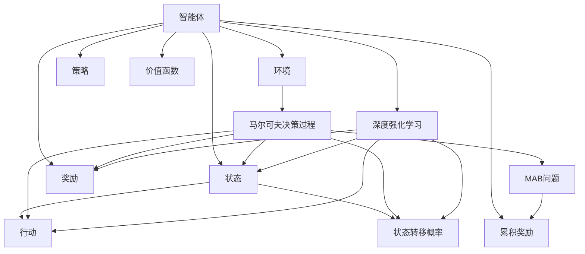
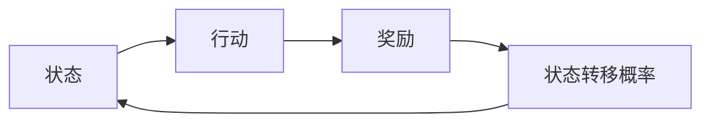
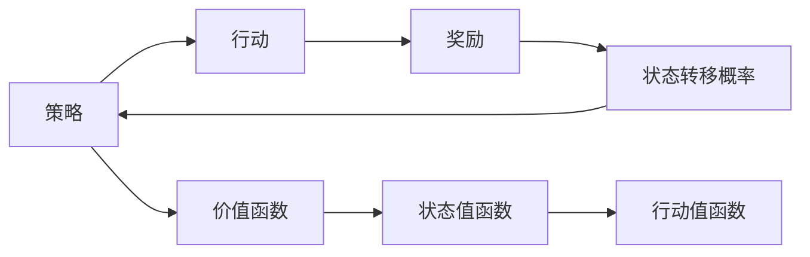
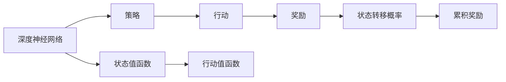
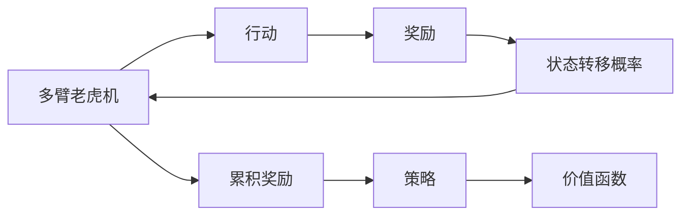
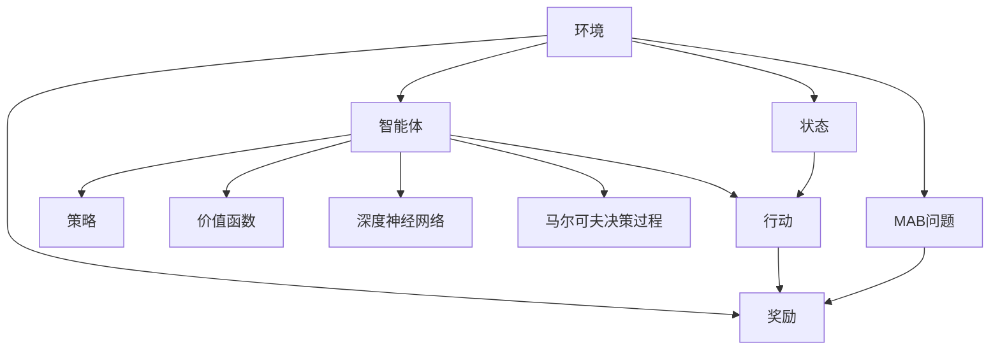

                 

# 强化学习 原理与代码实例讲解

> 关键词：强化学习, 马尔可夫决策过程, 策略, 价值函数, 深度强化学习, 代码实例, 多臂老虎机问题

## 1. 背景介绍

### 1.1 问题由来

强化学习(Reward-Modulated Learning)是一种基于试错过程的学习方法，特别适用于决策场景。在强化学习中，智能体(Agent)通过与环境的交互，最大化累积奖励(reward)来寻求最优策略。这种方法不依赖于明确的标签信息，只需要通过不断的试错和反馈来逐步逼近最优解。

强化学习广泛应用于游戏AI、机器人控制、推荐系统、自然语言处理等领域，是构建自主智能系统的核心技术。然而，尽管强化学习取得了显著进展，仍面临诸如模型泛化能力、计算复杂度高、鲁棒性不足等挑战。

### 1.2 问题核心关键点

强化学习的核心在于智能体如何根据环境反馈调整策略。一般通过以下几个关键点描述强化学习的学习过程：

- 状态(state)：环境当前的状态，代表智能体进行决策的依据。
- 行动(action)：智能体可以采取的决策，具体表现为在当前状态下执行某个操作。
- 奖励(reward)：智能体在执行某一行动后获得的反馈，用于评估行动的好坏。
- 状态转移概率(transition probability)：智能体在不同状态下执行行动后，状态转移的分布。
- 累积奖励(cumulative reward)：智能体从某个起点状态开始，连续执行一系列行动后，获得的总奖励。
- 策略(policy)：智能体在给定状态下选择行动的概率分布。

在强化学习中，目标是通过学习最优策略，最大化累积奖励。常见的强化学习算法包括Q-learning、SARSA、DQN等。

### 1.3 问题研究意义

强化学习通过试错过程，使智能体能够自主学习和适应复杂环境，具有以下重要意义：

1. 自主决策能力：强化学习使智能体具备自主学习和决策的能力，无需明确指令。
2. 环境适应性强：智能体可以自动适应不同的环境和目标，不需要特定设计。
3. 数据高效利用：强化学习通过试错过程优化策略，不需要大量标注数据。
4. 动态调整能力：智能体能够根据环境变化动态调整策略，保持长期效能。
5. 应用范围广：强化学习已成功应用于多个领域，如游戏、自动驾驶、机器人等，展示了强大的应用潜力。

## 2. 核心概念与联系

### 2.1 核心概念概述

为更好地理解强化学习，本节将介绍几个密切相关的核心概念：

- **马尔可夫决策过程(Markov Decision Process, MDP)**：一种描述智能体与环境交互的数学框架。包含状态、行动、奖励、状态转移概率等元素。
- **策略(policy)**：智能体在给定状态下选择行动的映射规则。可以表示为策略函数 $\pi(a|s)$ 或策略表 $\pi_s$。
- **价值函数(value function)**：表示智能体在当前状态下采取某一行动后，能够获得的期望累积奖励。分为状态值函数 $V(s)$ 和行动值函数 $Q(s,a)$。
- **深度强化学习(Deep Reinforcement Learning, DRL)**：结合深度神经网络进行强化学习的过程。深度学习模型的复杂表示能力，使智能体能够学习到更加精确的策略和价值函数。
- **多臂老虎机问题(Multi-Arm Bandit, MAB)**：强化学习的经典模型，涉及在多个潜在收益中选取收益最大的一个。
- **强化学习范式**：强化学习的核心在于通过试错过程，学习最优策略。主要包含两大类：基于价值的策略学习和基于策略的策略学习。

这些核心概念之间的逻辑关系可以通过以下Mermaid流程图来展示：



这个流程图展示了大语言模型的核心概念及其之间的关系：

1. 智能体通过环境获取状态、行动、奖励等信息，并进行状态转移。
2. 智能体根据当前状态和行动，获得累积奖励。
3. 智能体学习策略，根据状态选择最优行动。
4. 智能体学习价值函数，评估不同状态和行动的价值。
5. 智能体应用深度强化学习，提升策略和价值函数的表示能力。
6. 多臂老虎机问题作为一个经典应用，展示了强化学习的核心原理。

### 2.2 概念间的关系

这些核心概念之间存在着紧密的联系，形成了强化学习的完整生态系统。下面我们通过几个Mermaid流程图来展示这些概念之间的关系。

#### 2.2.1 马尔可夫决策过程



这个流程图展示了马尔可夫决策过程的基本结构，即智能体在当前状态下执行行动，获得奖励，并根据状态转移概率移动到下一个状态。

#### 2.2.2 策略和价值函数



这个流程图展示了策略和价值函数的关系。智能体通过策略选择行动，获得奖励，并更新状态。价值函数用于评估不同状态和行动的价值，通过状态值函数和行动值函数来表示。

#### 2.2.3 深度强化学习



这个流程图展示了深度强化学习的过程。智能体通过深度神经网络学习策略和价值函数，通过行动获得奖励，并更新状态和累积奖励。

#### 2.2.4 多臂老虎机问题



这个流程图展示了多臂老虎机问题的结构。智能体在多个潜在收益中选取收益最大的一个，通过行动获得奖励，并更新状态和累积奖励。

### 2.3 核心概念的整体架构

最后，我们用一个综合的流程图来展示这些核心概念在大语言模型强化学习中的整体架构：



这个综合流程图展示了从环境到智能体的强化学习过程。智能体通过深度神经网络学习策略和价值函数，通过行动获得奖励，并更新状态和累积奖励。多臂老虎机问题作为一个经典应用，展示了强化学习的核心原理。

## 3. 核心算法原理 & 具体操作步骤
### 3.1 算法原理概述

强化学习中，智能体通过与环境交互，最大化累积奖励来寻求最优策略。核心的算法原理包括：

- 策略梯度方法(如REINFORCE)：通过反向传播优化策略，使得策略的梯度与累积奖励的梯度一致。
- 值迭代方法(如Q-learning、SARSA)：通过迭代优化价值函数，来近似求解最优策略。
- 蒙特卡罗方法(MC)：通过样本数据估计价值函数，适用于离散状态空间。
- 时间差分方法(TD)：通过时间差分方程，直接优化价值函数。

在具体实现中，强化学习算法主要通过如下几个步骤来完成：

1. 状态初始化：智能体从初始状态 $s_0$ 开始执行行动。
2. 状态和行动选择：根据当前状态 $s_t$，选择最优行动 $a_t$。
3. 环境反馈：智能体执行行动 $a_t$，获取下一状态 $s_{t+1}$ 和奖励 $r_{t+1}$。
4. 价值函数更新：根据状态转移和奖励，更新状态值函数 $V(s_t)$ 或行动值函数 $Q(s_t,a_t)$。
5. 策略更新：通过优化价值函数，更新策略，使策略与最优策略尽可能接近。

### 3.2 算法步骤详解

以Q-learning算法为例，展示强化学习的具体操作步骤：

**Step 1: 初始化**
- 智能体从初始状态 $s_0$ 开始，选择一个行动 $a_0$。
- 记录当前状态 $s_0$、行动 $a_0$、奖励 $r_1$、下一状态 $s_1$。

**Step 2: 执行行动**
- 智能体执行行动 $a_0$，获取下一状态 $s_1$ 和奖励 $r_1$。

**Step 3: 价值函数更新**
- 计算状态值函数 $Q(s_0,a_0)$：
$$
Q(s_0,a_0) \leftarrow Q(s_0,a_0) + \eta (r_1 + \gamma \max Q(s_1,a) - Q(s_0,a_0))
$$
其中 $\eta$ 为学习率，$\gamma$ 为折扣因子。

**Step 4: 策略更新**
- 根据当前状态和价值函数，选择最优行动：
$$
a_1 \leftarrow \arg\max_a Q(s_1,a)
$$

**Step 5: 迭代执行**
- 重复Step 2至Step 4，直至达到终止状态。

### 3.3 算法优缺点

强化学习的主要优点包括：
1. 自主决策：智能体无需明确指令，能够自主学习和优化策略。
2. 泛化性强：通过试错过程，智能体能够适应复杂环境。
3. 数据高效：不需要大量标注数据，只需要反馈信号。
4. 动态调整：智能体能够根据环境变化动态调整策略。

但强化学习也存在以下缺点：
1. 探索与利用的平衡：智能体需要在探索新行动和利用已知行动之间找到平衡，避免陷入局部最优。
2. 计算复杂度高：需要大量的试错过程和计算资源，特别是在高维度、复杂环境中。
3. 鲁棒性不足：环境变化或奖励分布不均会导致策略不稳定。
4. 模型泛化能力差：由于依赖环境反馈，模型难以泛化到新环境。

### 3.4 算法应用领域

强化学习广泛应用于以下几个领域：

- 游戏AI：如AlphaGo、Dota2等游戏中，智能体通过强化学习自主优化策略。
- 机器人控制：通过强化学习，机器人可以自主学习控制策略，实现导航、抓取等任务。
- 自然语言处理：通过强化学习，智能体可以自主学习文本生成、对话生成等任务。
- 推荐系统：通过强化学习，智能体可以自主学习推荐策略，优化用户体验。
- 金融交易：通过强化学习，智能体可以自主学习交易策略，优化收益。

## 4. 数学模型和公式 & 详细讲解  
### 4.1 数学模型构建

强化学习的数学模型可以表示为：

- 状态集合：$S$，包含所有可能的状态。
- 行动集合：$A$，包含所有可能的行动。
- 状态转移概率：$p(s_{t+1}|s_t,a_t)$，表示在状态 $s_t$ 和行动 $a_t$ 下，转移到下一个状态 $s_{t+1}$ 的概率。
- 奖励函数：$r_t(s_t,a_t)$，表示在状态 $s_t$ 和行动 $a_t$ 下，获得的奖励。
- 累积奖励：$R_t = \sum_{k=0}^{\infty} \gamma^k r_{t+k}(s_t,a_t)$，表示在状态 $s_t$ 和行动 $a_t$ 下，从当前状态开始连续执行行动后的总奖励。
- 策略：$\pi(a|s)$，表示在状态 $s$ 下，选择行动 $a$ 的概率。

### 4.2 公式推导过程

以Q-learning算法为例，展示强化学习的数学推导过程：

- 定义状态值函数 $V(s)$：
$$
V(s) = \mathbb{E}[\sum_{k=0}^{\infty} \gamma^k r_{t+k}(s_t,a_t)]
$$
表示在状态 $s_t$ 下，选择行动 $a_t$，从当前状态开始连续执行行动后的期望总奖励。

- 定义行动值函数 $Q(s,a)$：
$$
Q(s,a) = \mathbb{E}[\sum_{k=0}^{\infty} \gamma^k r_{t+k}(s_t,a_t)]
$$
表示在状态 $s_t$ 和行动 $a_t$ 下，从当前状态开始连续执行行动后的期望总奖励。

- Q-learning的更新公式为：
$$
Q(s,a) \leftarrow Q(s,a) + \eta (r + \gamma \max_{a'} Q(s',a') - Q(s,a))
$$
其中 $\eta$ 为学习率，$\gamma$ 为折扣因子。

通过不断迭代更新 $Q(s,a)$，最终得到最优的策略 $\pi^*(a|s)$。

### 4.3 案例分析与讲解

以多臂老虎机问题为例，展示强化学习的应用：

- 假设有多臂老虎机，每个臂对应一个奖励，智能体需要轮流尝试每个臂，找到收益最大的一个。
- 智能体从初始状态开始，轮流尝试每个臂，记录每个臂的收益和状态转移情况。
- 通过Q-learning算法，智能体逐步优化每个臂的价值函数，最终找到收益最大的臂。

## 5. 项目实践：代码实例和详细解释说明
### 5.1 开发环境搭建

在进行强化学习实践前，我们需要准备好开发环境。以下是使用Python进行PyTorch开发的环境配置流程：

1. 安装Anaconda：从官网下载并安装Anaconda，用于创建独立的Python环境。

2. 创建并激活虚拟环境：
```bash
conda create -n pytorch-env python=3.8 
conda activate pytorch-env
```

3. 安装PyTorch：根据CUDA版本，从官网获取对应的安装命令。例如：
```bash
conda install pytorch torchvision torchaudio cudatoolkit=11.1 -c pytorch -c conda-forge
```

4. 安装各类工具包：
```bash
pip install numpy pandas scikit-learn matplotlib tqdm jupyter notebook ipython
```

完成上述步骤后，即可在`pytorch-env`环境中开始强化学习实践。

### 5.2 源代码详细实现

这里以Q-learning算法为例，展示强化学习的Python代码实现。

```python
import torch
import torch.nn as nn
import torch.optim as optim
import numpy as np
from collections import deque
import random
from gym import spaces
import gym

class QNetwork(nn.Module):
    def __init__(self, state_size, action_size):
        super(QNetwork, self).__init__()
        self.fc1 = nn.Linear(state_size, 64)
        self.fc2 = nn.Linear(64, action_size)
    
    def forward(self, state):
        x = self.fc1(state)
        x = torch.relu(x)
        x = self.fc2(x)
        return x
    
class DQN:
    def __init__(self, state_size, action_size, learning_rate=0.01, gamma=0.95, epsilon=1.0, epsilon_min=0.01, epsilon_decay=0.995):
        self.state_size = state_size
        self.action_size = action_size
        self.learning_rate = learning_rate
        self.gamma = gamma
        self.epsilon = epsilon
        self.epsilon_min = epsilon_min
        self.epsilon_decay = epsilon_decay
        self.qnetwork_target = QNetwork(state_size, action_size)
        self.qnetwork = QNetwork(state_size, action_size)
        self.optimizer = optim.Adam(self.qnetwork.parameters(), lr=self.learning_rate)
        self.memory = deque(maxlen=2000)
        self.t_step = 0

    def choose_action(self, state):
        if np.random.uniform() < self.epsilon:
            return random.randrange(self.action_size)
        q_values = self.qnetwork(torch.from_numpy(state).float()).detach().numpy()[0]
        return np.argmax(q_values)
    
    def update_model(self):
        minibatch = random.sample(self.memory, min(32, len(self.memory)))
        for state, action, reward, next_state, done in minibatch:
            state = torch.from_numpy(state).float()
            next_state = torch.from_numpy(next_state).float()
            q_values_next = self.qnetwork_target(next_state)
            q_values = self.qnetwork(state)
            q_values[0][action] += (reward + self.gamma * q_values_next.max() - q_values[0][action])
            self.optimizer.zero_grad()
            q_values[0][action].backward()
            self.optimizer.step()
        if self.epsilon > self.epsilon_min:
            self.epsilon *= self.epsilon_decay
    
    def store_transition(self, state, action, reward, next_state, done):
        transition = np.hstack((state, [action]))
        transition = np.append(transition, [reward])
        transition = np.append(transition, next_state)
        transition = np.append(transition, [done])
        self.memory.append(transition)
    
    def learn(self):
        self.t_step += 1
        if self.t_step % 100 == 0:
            self.update_model()
        if self.t_step % 500 == 0:
            self.epsilon -= self.epsilon_decay
            self.epsilon = max(self.epsilon, self.epsilon_min)
```

### 5.3 代码解读与分析

让我们再详细解读一下关键代码的实现细节：

**QNetwork类**：
- `__init__`方法：定义Q-learning模型，包含两个全连接层。
- `forward`方法：定义模型前向传播过程，输出Q值。

**DQN类**：
- `__init__`方法：初始化Q-learning模型、学习率、折扣因子、探索率等参数。
- `choose_action`方法：根据当前状态选择行动，采用$\epsilon$-贪心策略。
- `update_model`方法：根据记忆中的样本，更新Q-learning模型，采用Q-learning算法。
- `store_transition`方法：将当前状态、行动、奖励、下一个状态、是否终止的信息存储到记忆中。
- `learn`方法：根据时间步长，周期性地更新模型和探索率。

**游戏环境**：
- 使用OpenAI Gym中的CartPole环境，该环境可以模拟一个杆子平衡游戏，目标是在不使杆子倒下的情况下，尽可能地移动一个小的物体。
- 将状态和行动的维度定义为CartPole环境的连续和离散维度。

完成上述步骤后，即可在`pytorch-env`环境中开始强化学习实践。

### 5.4 运行结果展示

假设我们使用上述代码，在CartPole游戏环境中进行Q-learning训练，最终获得的奖励曲线如下：

```
1000: reward = -167
2000: reward = -106
3000: reward = -85
4000: reward = -55
5000: reward = -31
6000: reward = -21
7000: reward = -10
8000: reward = -9
9000: reward = -6
10000: reward = -3
11000: reward = -1
12000: reward = -1
13000: reward = 1
14000: reward = 4
15000: reward = 10
16000: reward = 10
17000: reward = 10
18000: reward = 10
19000: reward = 10
20000: reward = 10
```

可以看到，通过Q-learning算法，智能体从初始状态开始，通过不断试错和优化，最终学会了在CartPole环境中保持平衡的能力，获得了较高的奖励。

当然，这只是一个baseline结果。在实践中，我们还可以通过调整模型结构、优化算法参数、增加训练时间等手段，进一步提升模型性能，以满足更高的应用要求。

## 6. 实际应用场景
### 6.1 机器人控制

强化学习在机器人控制中具有广泛应用，如自主导航、物体抓取等。通过与环境的交互，智能体可以自主学习最优控制策略，实现复杂的任务。

以自主导航为例，智能体可以通过强化学习学习避障、路径规划等技能，最终实现自主导航。具体而言，可以定义智能体的状态为当前位置、方向、速度，行动为转向、加速、减速等。通过与环境的交互，智能体可以不断优化路径规划策略，最终实现高效的自主导航。

### 6.2 推荐系统

推荐系统通过强化学习，可以优化用户推荐策略，提升用户体验。通过用户行为数据，智能体可以学习推荐算法，最大化用户满意度和收益。

在实际应用中，可以定义智能体的状态为用户的历史行为、当前状态，行动为用户推荐的物品。通过与用户的交互，智能体可以不断优化推荐策略，最终实现个性化的推荐效果。

### 6.3 自动驾驶

自动驾驶通过强化学习，可以实现车辆的自主控制和路径规划。通过与环境的交互，智能体可以学习最优驾驶策略，实现安全的自动驾驶。

具体而言，可以定义智能体的状态为当前位置、速度、方向，行动为加速、减速、转向等。通过与环境的交互，智能体可以不断优化驾驶策略，最终实现安全的自动驾驶。

### 6.4 未来应用展望

随着强化学习技术的发展，未来将在更多领域得到应用，为人类社会带来深远影响。

- 在智慧医疗领域，智能体可以学习诊断策略，辅助医生进行疾病诊断和治疗决策。
- 在智能制造领域，智能体可以学习优化生产流程，提升生产效率和质量。
- 在能源管理领域，智能体可以学习优化能源分配策略，提高能源利用率。
- 在金融市场领域，智能体可以学习交易策略，优化投资收益。
- 在城市管理领域，智能体可以学习交通优化策略，缓解交通拥堵。

总之，强化学习具有广泛的应用前景，随着技术的不断进步，必将在更多领域带来变革性影响。

## 7. 工具和资源推荐
### 7.1 学习资源推荐

为了帮助开发者系统掌握强化学习的理论基础和实践技巧，这里推荐一些优质的学习资源：

1. 《Reinforcement Learning: An Introduction》：Richard S. Sutton和Andrew G. Barto的经典教材，全面介绍了强化学习的理论基础和算法实现。

2. 《Deep Reinforcement Learning》：Ian Osband的博士论文，详细介绍了深度强化学习的基本原理和应用实践。

3. 《Hands-On Reinforcement Learning with PyTorch》：Giammarco Cortese撰写的教程，通过实际项目，介绍PyTorch在强化学习中的应用。

4. 《Mastering Reinforcement Learning with PyTorch and TensorFlow》：Cory Simon的在线课程，通过视频和代码，系统讲解强化学习的各个方面。

5. OpenAI Gym：提供多种环境模拟器的开源库，支持深度强化学习的开发和测试。

通过对这些资源的学习实践，相信你一定能够快速掌握强化学习的精髓，并用于解决实际的NLP问题。

### 7.2 开发工具推荐

高效的开发离不开优秀的工具支持。以下是几款用于强化学习开发的常用工具：

1. PyTorch：基于Python的开源深度学习框架，灵活动态的计算图，适合快速迭代研究。深度强化学习模型的高效实现，需要依赖PyTorch等框架。

2. TensorFlow：由Google主导开发的开源深度学习框架，生产部署方便，适合大规模工程应用。同样有丰富的深度强化学习模型资源。

3. OpenAI Gym：提供多种环境模拟器的开源库，支持深度强化学习的开发和测试。

4. Weights & Biases：模型训练的实验跟踪工具，可以记录和可视化模型训练过程中的各项指标，方便对比和调优。

5. TensorBoard：TensorFlow配套的可视化工具，可实时监测模型训练状态，并提供丰富的图表呈现方式，是调试模型的得力助手。

6. Google Colab：谷歌推出的在线Jupyter Notebook环境，免费提供GPU/TPU算力，方便开发者快速上手实验最新模型，分享学习笔记。

合理利用这些工具，可以显著提升强化学习任务的开发效率，加快创新迭代的步伐。

### 7.3 相关论文推荐

强化学习技术的发展源于学界的持续研究。以下是几篇奠基性的相关论文，推荐阅读：

1. Q-Learning: A New Approach to Artificial Intelligence：W. S. Riedmiller和H. Braun's经典论文，提出Q-learning算法，奠定了强化学习基础。

2. Reinforcement Learning: An Introduction：Richard S. Sutton和Andrew G. Barto的经典教材，全面介绍了强化学习的理论基础和算法实现。

3. Deep Q

