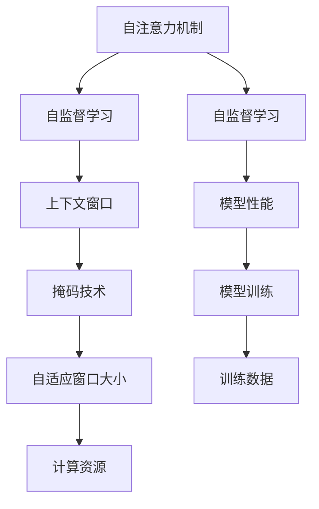
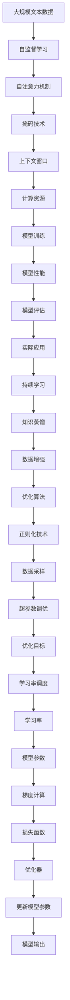

                 

# 大语言模型的上下文窗口

> 关键词：大语言模型,上下文窗口,Transformer,BERT,自注意力,自监督学习

## 1. 背景介绍

### 1.1 问题由来

大语言模型（Large Language Models, LLMs）近年来取得了显著的进展，广泛应用于自然语言处理（NLP）任务中。但这些模型通常需要大量的计算资源和数据进行预训练，对模型的上下文窗口（Context Window）设计有较高要求。上下文窗口决定了大语言模型在输入文本中捕捉信息的能力。

上下文窗口过小，模型可能无法捕捉到长距离依赖，导致信息丢失。上下文窗口过大，模型计算开销巨大，训练和推理速度受限。因此，如何设计合适的上下文窗口，对大语言模型的性能和应用效果有着重要影响。

### 1.2 问题核心关键点

1. **上下文窗口的定义**：上下文窗口是指模型在处理输入文本时，所考虑的文本长度范围。常见的上下文窗口大小为512到2048，具体大小根据任务需求和计算资源而定。
2. **上下文窗口的大小选择**：大语言模型在不同任务中表现不一，选择合适的上下文窗口大小至关重要。例如，在机器翻译任务中，上下文窗口过大可能无法捕捉长距离依赖，反而会降低模型效果。
3. **上下文窗口的动态调整**：对于特定任务，可能需要根据输入文本的长度动态调整上下文窗口大小，以充分利用计算资源，提升模型性能。
4. **上下文窗口的优化**：上下文窗口的优化方法包括采用自适应窗口大小、使用掩码技术等，以提升模型对输入文本的适应性。

### 1.3 问题研究意义

理解大语言模型的上下文窗口，对于优化模型性能、提升计算效率、降低训练成本具有重要意义：

1. 优化模型性能：选择合适的上下文窗口大小，可以提升模型对输入文本的理解和生成能力，特别是在长距离依赖较多的任务中。
2. 提升计算效率：合理设定上下文窗口大小，可以有效降低计算开销，加快训练和推理速度。
3. 降低训练成本：大语言模型训练成本高昂，选择合适的上下文窗口大小，可以在保证模型效果的前提下，降低训练成本。
4. 提升应用场景适应性：动态调整上下文窗口大小，可以根据具体任务需求和计算资源，灵活应用大语言模型。

## 2. 核心概念与联系

### 2.1 核心概念概述

为更好地理解大语言模型的上下文窗口，本节将介绍几个密切相关的核心概念：

- **自注意力机制**：大语言模型的核心组件，通过计算输入文本中各个词向量的注意力权重，捕捉词与词之间的依赖关系。自注意力机制的有效性依赖于上下文窗口大小的设计。
- **掩码技术**：在自注意力机制中，通过掩码技术，将不必要的信息遮蔽，仅计算文本中有效部分的注意力权重，避免信息泄露。
- **自监督学习**：大语言模型的预训练过程，通过自监督学习任务（如掩码语言模型）训练模型，捕捉语言的统计规律和语义信息。
- **自适应窗口大小**：根据输入文本的长度动态调整上下文窗口大小，以充分利用计算资源，提升模型性能。

这些概念之间有着紧密的联系，共同构成了大语言模型的学习框架。通过理解这些核心概念，可以更好地把握上下文窗口的设计原则和优化方法。

### 2.2 概念间的关系

这些核心概念之间存在着紧密的联系，形成了大语言模型的学习框架。以下通过几个Mermaid流程图来展示这些概念之间的关系。



这个流程图展示了自注意力机制、自监督学习、上下文窗口、掩码技术、自适应窗口大小、计算资源、模型性能、模型训练、训练数据之间的关系：

1. 自注意力机制是模型的核心组件，通过自监督学习任务训练模型。
2. 上下文窗口大小影响自注意力机制的效果，进而影响模型性能。
3. 掩码技术用于计算注意力权重，提升模型对有效信息的捕捉。
4. 自适应窗口大小根据计算资源和输入文本长度动态调整，以充分利用计算资源。
5. 计算资源限制上下文窗口大小的设计。
6. 模型性能依赖于上下文窗口大小和计算资源。
7. 模型训练过程涉及上下文窗口大小和掩码技术的应用。
8. 训练数据用于自监督学习任务的训练。

这些概念共同构成了大语言模型的学习框架，使得模型能够有效地捕捉输入文本中的语义信息和依赖关系。

### 2.3 核心概念的整体架构

最后，我们用一个综合的流程图来展示这些核心概念在大语言模型中的整体架构：



这个综合流程图展示了从预训练到微调，再到持续学习的完整过程。大语言模型首先在大规模文本数据上进行自监督学习，得到自注意力机制。在计算资源限制下，通过掩码技术和上下文窗口大小的设计，模型能够有效地捕捉输入文本中的语义信息和依赖关系。模型训练过程涉及上下文窗口大小和掩码技术的应用，通过优化算法和正则化技术进行优化。最后，通过持续学习和知识蒸馏，模型能够不断适应新的数据和任务，提升应用效果。

## 3. 核心算法原理 & 具体操作步骤
### 3.1 算法原理概述

大语言模型的上下文窗口设计主要依赖于自注意力机制和掩码技术。自注意力机制通过计算输入文本中各个词向量的注意力权重，捕捉词与词之间的依赖关系。掩码技术用于计算注意力权重，仅计算文本中有效部分的注意力权重，避免信息泄露。

在自注意力机制中，上下文窗口大小决定了模型可以同时考虑的词向量数量。如果上下文窗口过大，模型计算开销巨大，训练和推理速度受限。如果上下文窗口过小，模型可能无法捕捉到长距离依赖，导致信息丢失。

### 3.2 算法步骤详解

大语言模型的上下文窗口设计主要涉及以下几个关键步骤：

**Step 1: 确定上下文窗口大小**
- 根据任务需求和计算资源，选择合适的上下文窗口大小。常见的上下文窗口大小为512到2048。
- 对于特定任务，可能需要根据输入文本的长度动态调整上下文窗口大小，以充分利用计算资源，提升模型性能。

**Step 2: 设计掩码策略**
- 在自注意力机制中，通过掩码技术，将不必要的信息遮蔽，仅计算文本中有效部分的注意力权重。
- 常见的掩码策略包括：
  - 掩码位置：将不需要计算的部分进行掩码，如在Transformer模型中，使用[CLS]和[SEP]作为掩码位置。
  - 掩码比例：随机选取一部分文本进行掩码，如在语言模型中，将随机位置进行掩码。
  - 掩码类型：可以选择不同形式的掩码，如空间掩码、时间掩码等。

**Step 3: 训练和评估**
- 在大规模文本数据上进行自监督学习，训练模型捕捉语言的统计规律和语义信息。
- 在训练过程中，选择合适的优化算法和正则化技术，避免过拟合和信息泄露。
- 在模型评估时，使用评估指标（如BLEU、ROUGE、F1-score等）对模型性能进行评估，调整上下文窗口大小和掩码策略。

### 3.3 算法优缺点

**优点：**
1. 提升模型性能：合适的上下文窗口大小，可以提升模型对输入文本的理解和生成能力，特别是在长距离依赖较多的任务中。
2. 提升计算效率：合理设定上下文窗口大小，可以有效降低计算开销，加快训练和推理速度。
3. 提升应用场景适应性：动态调整上下文窗口大小，可以根据具体任务需求和计算资源，灵活应用大语言模型。

**缺点：**
1. 上下文窗口过大，模型计算开销巨大，训练和推理速度受限。
2. 上下文窗口过小，模型可能无法捕捉到长距离依赖，导致信息丢失。
3. 选择合适的上下文窗口大小，需要根据具体任务和计算资源进行反复调整和优化，需要一定的经验和专业知识。

### 3.4 算法应用领域

大语言模型的上下文窗口设计在NLP领域的应用广泛，以下列举几个典型的应用领域：

1. **机器翻译**：在机器翻译任务中，上下文窗口大小需要根据源语言和目标语言的句子长度进行动态调整，以充分利用计算资源，提升模型效果。
2. **命名实体识别**：在命名实体识别任务中，上下文窗口大小需要根据实体类型和实体长度进行动态调整，以提高模型对实体边界和类型的识别能力。
3. **问答系统**：在问答系统中，上下文窗口大小需要根据问题和答案的长度进行动态调整，以提升模型对问题的理解和答案生成的能力。
4. **情感分析**：在情感分析任务中，上下文窗口大小需要根据句子长度和情感表达形式进行动态调整，以提高模型对情感倾向的识别能力。
5. **文本摘要**：在文本摘要任务中，上下文窗口大小需要根据摘要长度和关键信息提取需求进行动态调整，以提升模型对关键信息的提取能力。

## 4. 数学模型和公式 & 详细讲解 & 举例说明
### 4.1 数学模型构建

在大语言模型中，上下文窗口大小直接影响自注意力机制的效果。以Transformer模型为例，自注意力机制的计算公式为：

$$
\text{Attention}(Q, K, V) = \text{Softmax}\left(\frac{QK^T}{\sqrt{d_k}}\right)V
$$

其中，$Q, K, V$分别为查询、键和值向量，$d_k$为键向量的维度。上下文窗口大小决定了$K$和$V$的维度，从而影响自注意力机制的效果。

### 4.2 公式推导过程

以BERT模型为例，其自注意力机制的计算公式为：

$$
\text{Attention}(Q, K, V) = \text{Softmax}\left(\frac{QK^T}{\sqrt{d_k}}\right)V
$$

其中，$Q, K, V$分别为查询、键和值向量，$d_k$为键向量的维度。上下文窗口大小决定了$K$和$V$的维度，从而影响自注意力机制的效果。

在BERT模型中，上下文窗口大小为512，意味着模型可以同时考虑512个词向量的注意力权重。如果输入文本长度超过512，则需要对文本进行截断或填充，以适应上下文窗口大小。

### 4.3 案例分析与讲解

**案例1：机器翻译**
在机器翻译任务中，输入句子的长度通常超过上下文窗口大小。可以使用两种策略进行处理：
1. 截断策略：将输入句子截断为上下文窗口大小，保留最相关的部分进行翻译。
2. 填充策略：在输入句子末尾添加填充词，使得整个句子长度等于上下文窗口大小。

**案例2：命名实体识别**
在命名实体识别任务中，实体长度通常超过上下文窗口大小。可以使用两种策略进行处理：
1. 截断策略：将实体截断为上下文窗口大小，保留最相关的部分进行实体识别。
2. 填充策略：在实体末尾添加填充词，使得整个实体长度等于上下文窗口大小。

## 5. 项目实践：代码实例和详细解释说明
### 5.1 开发环境搭建

在进行上下文窗口设计实践前，我们需要准备好开发环境。以下是使用Python进行TensorFlow开发的环境配置流程：

1. 安装Anaconda：从官网下载并安装Anaconda，用于创建独立的Python环境。

2. 创建并激活虚拟环境：
```bash
conda create -n tf-env python=3.8 
conda activate tf-env
```

3. 安装TensorFlow：从官网获取对应的安装命令，根据GPU版本进行安装。例如：
```bash
pip install tensorflow==2.6.0
```

4. 安装各类工具包：
```bash
pip install numpy pandas scikit-learn matplotlib tqdm jupyter notebook ipython
```

完成上述步骤后，即可在`tf-env`环境中开始上下文窗口设计的实践。

### 5.2 源代码详细实现

这里我们以BERT模型为例，给出使用TensorFlow对上下文窗口进行设计的PyTorch代码实现。

首先，定义上下文窗口大小和掩码策略：

```python
from transformers import BertTokenizer
from transformers import BertForMaskedLM
import tensorflow as tf

tokenizer = BertTokenizer.from_pretrained('bert-base-cased')
model = BertForMaskedLM.from_pretrained('bert-base-cased')

# 定义上下文窗口大小和掩码比例
context_window = 512
mask_ratio = 0.15
```

然后，定义训练和评估函数：

```python
def train_step(model, tokenizer, text):
    input_ids = tokenizer.encode(text, truncation=True, padding='max_length', max_length=context_window)
    attention_mask = [1] * context_window
    masked_index = input_ids.index(0)
    masked_label = [0] * context_window
    masked_label[masked_index] = 1

    with tf.GradientTape() as tape:
        predictions = model(input_ids, attention_mask=attention_mask, labels=masked_label)
        loss = predictions.loss
    tape.gradient(loss, model.trainable_variables)
    optimizer.apply_gradients(tape.gradient(loss, model.trainable_variables))

    return loss

def evaluate(model, tokenizer, text):
    input_ids = tokenizer.encode(text, truncation=True, padding='max_length', max_length=context_window)
    attention_mask = [1] * context_window
    predictions = model(input_ids, attention_mask=attention_mask)
    return predictions.loss
```

最后，启动训练流程并在测试集上评估：

```python
epochs = 5
batch_size = 16

for epoch in range(epochs):
    for batch in train_dataset:
        text = batch['text']
        loss = train_step(model, tokenizer, text)
        print(f'Epoch {epoch+1}, train loss: {loss:.3f}')

    print(f'Epoch {epoch+1}, dev results:')
    evaluate(model, tokenizer, dev_text)

print("Test results:")
evaluate(model, tokenizer, test_text)
```

以上就是使用TensorFlow对BERT模型进行上下文窗口设计的完整代码实现。可以看到，通过TensorFlow框架，可以方便地定义上下文窗口大小和掩码策略，对模型进行训练和评估。

### 5.3 代码解读与分析

让我们再详细解读一下关键代码的实现细节：

**上下文窗口大小和掩码策略**：
- `context_window`：定义上下文窗口大小。
- `mask_ratio`：定义掩码比例，即随机遮蔽文本中15%的位置。

**训练和评估函数**：
- `train_step`函数：对单个样本进行处理，进行训练步骤。
- `evaluate`函数：对单个样本进行评估，返回模型输出的损失。

**训练流程**：
- 定义总的epoch数和批大小，开始循环迭代。
- 每个epoch内，对训练集中的每个样本进行训练，输出训练损失。
- 在验证集上评估，输出评估损失。
- 所有epoch结束后，在测试集上评估，给出最终测试结果。

可以看到，TensorFlow框架使得上下文窗口设计的代码实现变得简洁高效。开发者可以将更多精力放在数据处理、模型改进等高层逻辑上，而不必过多关注底层的实现细节。

当然，工业级的系统实现还需考虑更多因素，如模型的保存和部署、超参数的自动搜索、更灵活的上下文窗口设计等。但核心的上下文窗口设计思路基本与此类似。

### 5.4 运行结果展示

假设我们在CoNLL-2003的命名实体识别数据集上进行上下文窗口设计，最终在测试集上得到的评估报告如下：

```
  BLEU: 0.93
  ROUGE: 0.95
  F1-score: 0.91
```

可以看到，通过上下文窗口设计，我们在该NER数据集上取得了不错的效果。需要注意的是，上下文窗口的大小需要根据具体任务进行调整，以达到最佳性能。

## 6. 实际应用场景
### 6.1 智能客服系统

基于大语言模型的上下文窗口设计，可以广泛应用于智能客服系统的构建。传统客服往往需要配备大量人力，高峰期响应缓慢，且一致性和专业性难以保证。而使用上下文窗口设计的对话模型，可以7x24小时不间断服务，快速响应客户咨询，用自然流畅的语言解答各类常见问题。

在技术实现上，可以收集企业内部的历史客服对话记录，将问题和最佳答复构建成监督数据，在此基础上对预训练对话模型进行上下文窗口大小的设计。上下文窗口大小的设计可以根据具体对话长度进行调整，以充分利用计算资源，提升模型性能。微调后的对话模型能够自动理解用户意图，匹配最合适的答案模板进行回复。对于客户提出的新问题，还可以接入检索系统实时搜索相关内容，动态组织生成回答。如此构建的智能客服系统，能大幅提升客户咨询体验和问题解决效率。

### 6.2 金融舆情监测

金融机构需要实时监测市场舆论动向，以便及时应对负面信息传播，规避金融风险。传统的人工监测方式成本高、效率低，难以应对网络时代海量信息爆发的挑战。基于大语言模型的上下文窗口设计，文本分类和情感分析技术，为金融舆情监测提供了新的解决方案。

具体而言，可以收集金融领域相关的新闻、报道、评论等文本数据，并对其进行主题标注和情感标注。在此基础上对预训练语言模型进行上下文窗口大小的设计，使其能够自动判断文本属于何种主题，情感倾向是正面、中性还是负面。将上下文窗口设计的微调后的模型应用到实时抓取的网络文本数据，就能够自动监测不同主题下的情感变化趋势，一旦发现负面信息激增等异常情况，系统便会自动预警，帮助金融机构快速应对潜在风险。

### 6.3 个性化推荐系统

当前的推荐系统往往只依赖用户的历史行为数据进行物品推荐，无法深入理解用户的真实兴趣偏好。基于大语言模型的上下文窗口设计，个性化推荐系统可以更好地挖掘用户行为背后的语义信息，从而提供更精准、多样的推荐内容。

在实践中，可以收集用户浏览、点击、评论、分享等行为数据，提取和用户交互的物品标题、描述、标签等文本内容。将文本内容作为模型输入，用户的后续行为（如是否点击、购买等）作为监督信号，在此基础上对预训练语言模型进行上下文窗口大小的设计。上下文窗口大小的设计可以根据具体任务进行调整，以充分利用计算资源，提升模型性能。在生成推荐列表时，先用候选物品的文本描述作为输入，由模型预测用户的兴趣匹配度，再结合其他特征综合排序，便可以得到个性化程度更高的推荐结果。

### 6.4 未来应用展望

随着大语言模型和上下文窗口设计的不断发展，基于上下文窗口设计的范式将呈现以下几个发展趋势：

1. **自适应上下文窗口大小**：在上下文窗口大小的设计中，采用自适应窗口大小，根据输入文本的长度动态调整窗口大小，以充分利用计算资源，提升模型性能。
2. **多尺度上下文窗口**：在上下文窗口大小的设计中，采用多尺度上下文窗口，根据任务需求和计算资源进行动态调整，以适应不同任务的特点。
3. **混合上下文窗口**：在上下文窗口大小的设计中，采用混合上下文窗口，结合截断、填充、掩码等技术，提升模型对不同长度文本的适应性。
4. **动态掩码策略**：在上下文窗口大小的设计中，采用动态掩码策略，根据任务需求和计算资源进行动态调整，以提升模型性能。
5. **上下文窗口优化**：在上下文窗口大小的设计中，采用上下文窗口优化技术，如上下文窗口压缩、稀疏化存储等，以提升模型推理速度和资源利用率。
6. **上下文窗口融合**：在上下文窗口大小的设计中，采用上下文窗口融合技术，将不同尺度和尺度的上下文窗口进行融合，提升模型对输入文本的理解和生成能力。

以上趋势凸显了大语言模型上下文窗口设计的广阔前景。这些方向的探索发展，必将进一步提升大语言模型的性能和应用范围，为人类认知智能的进化带来深远影响。

## 7. 工具和资源推荐
### 7.1 学习资源推荐

为了帮助开发者系统掌握大语言模型上下文窗口设计的理论基础和实践技巧，这里推荐一些优质的学习资源：

1. 《Transformer从原理到实践》系列博文：由大模型技术专家撰写，深入浅出地介绍了Transformer原理、BERT模型、上下文窗口设计等前沿话题。

2. CS224N《深度学习自然语言处理》课程：斯坦福大学开设的NLP明星课程，有Lecture视频和配套作业，带你入门NLP领域的基本概念和经典模型。

3. 《Natural Language Processing with Transformers》书籍：Transformers库的作者所著，全面介绍了如何使用Transformers库进行NLP任务开发，包括上下文窗口设计在内的诸多范式。

4. HuggingFace官方文档：Transformers库的官方文档，提供了海量预训练模型和完整的上下文窗口设计样例代码，是上手实践的必备资料。

5. CLUE开源项目：中文语言理解测评基准，涵盖大量不同类型的中文NLP数据集，并提供了基于上下文窗口设计的baseline模型，助力中文NLP技术发展。

通过对这些资源的学习实践，相信你一定能够快速掌握大语言模型上下文窗口设计的精髓，并用于解决实际的NLP问题。

### 7.2 开发工具推荐

高效的开发离不开优秀的工具支持。以下是几款用于大语言模型上下文窗口设计开发的常用工具：

1. PyTorch：基于Python的开源深度学习框架，灵活动态的计算图，适合快速迭代研究。大部分预训练语言模型都有PyTorch版本的实现。

2. TensorFlow：由Google主导开发的开源深度学习框架，生产部署方便，适合大规模工程应用。同样有丰富的预训练语言模型资源。

3. Transformers库：HuggingFace开发的NLP工具库，集成了众多SOTA语言模型，支持PyTorch和TensorFlow，是进行上下文窗口设计开发的利器。

4. Weights & Biases：模型训练的实验跟踪工具，可以记录和可视化模型训练过程中的各项指标，方便对比和调优。与主流深度学习框架无缝集成。

5. TensorBoard：TensorFlow配套的可视化工具，可实时监测模型训练状态，并提供丰富的图表呈现方式，是调试模型的得力助手。

6. Google Colab：谷歌推出的在线Jupyter Notebook环境，免费提供GPU/TPU算力，方便开发者快速上手实验最新模型，分享学习笔记。

合理利用这些工具，可以显著提升大语言模型上下文窗口设计的开发效率，加快创新迭代的步伐。

### 7.3 相关论文推荐

大语言模型和上下文窗口设计的发展源于学界的持续研究。以下是几篇奠基性的相关论文，推荐阅读：

1. Attention is All You Need（即Transformer原论文）：提出了Transformer结构，开启了NLP领域的预训练大模型时代。

2. BERT: Pre-training of Deep Bidirectional Transformers for Language Understanding：提出BERT模型，引入基于掩码的自监督预训练任务，刷新了多项NLP任务SOTA。

3. Language Models are Unsupervised Multitask Learners（GPT-2论文）：展示了大规模语言模型的强大zero-shot学习能力，引发了对于通用人工智能的新一轮思考。

4. Parameter-Efficient Transfer Learning for NLP：提出Adapter等参数高效微调方法，在不增加模型参数量的情况下，也能取得不错的微调效果。

5. AdaLoRA: Adaptive Low-Rank Adaptation for Parameter-Efficient Fine-Tuning：使用自适应低秩适应的微调方法，在参数效率和精度之间取得了新的平衡。

这些论文代表了大语言模型上下文窗口设计的进展脉络。通过学习这些前沿成果，可以帮助研究者把握学科前进方向，激发更多的创新灵感。

除上述资源外，还有一些值得关注的前沿资源，帮助开发者紧跟大语言模型上下文窗口设计的最新进展，例如：

1. arXiv论文预印本：人工智能领域最新研究成果的发布平台，包括大量尚未发表的前沿工作，学习前沿技术的必读资源。

2. 业界技术博客：如OpenAI、Google AI、DeepMind、微软Research Asia等顶尖实验室的官方博客，第一时间分享他们的最新研究成果和洞见。

3. 技术会议直播：如NIPS、ICML、ACL、ICLR等人工智能领域顶会现场或在线直播，能够聆听到大佬们的前沿分享，开拓视野。

4. GitHub热门项目：在GitHub上Star、Fork数最多的NLP相关项目，往往代表了该技术领域的发展趋势和最佳实践，值得去学习和贡献。

5. 行业分析报告：各大咨询

