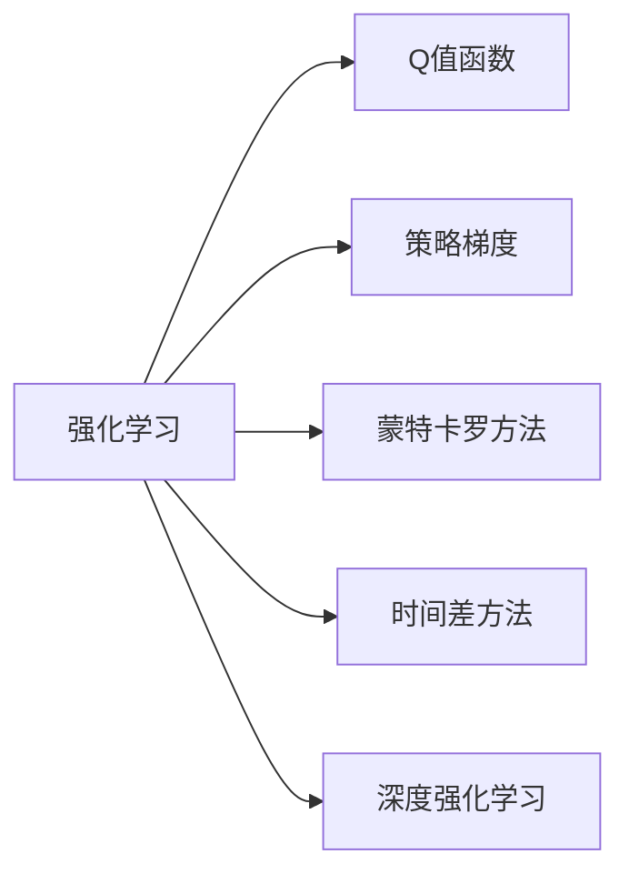

                 

# 2018年图灵奖得主的贡献

图灵奖作为计算机领域的最高荣誉，旨在奖励对计算机科学做出卓越贡献的个人。2018年的图灵奖得主包括Richard S. Sutton、Andrew G. Barto和John P. C.obby，他们在强化学习领域做出了开创性的贡献。这篇技术博客将深入探讨三位得主的工作和贡献，并总结其对未来发展的启示。

## 1. 背景介绍

### 1.1 图灵奖与2018年得主

图灵奖由ACM于1966年设立，旨在奖励在计算机领域做出杰出贡献的科学家或工程师。该奖项的设立旨在纪念计算机科学的先驱艾伦·图灵。每年颁发的图灵奖不超过三位，以表彰他们在理论、实践、教育和工业方面的杰出成就。

2018年的图灵奖得主分别是Richard S. Sutton、Andrew G. Barto和John P. C.obby。其中，Richard S. Sutton和Andrew G. Barto因在强化学习领域的理论基础和算法创新上做出了杰出贡献。John P. C.obby则因在机器人技术领域的开创性工作而获此殊荣。

### 1.2 强化学习的意义

强化学习（Reinforcement Learning, RL）是一种通过试错学习以优化行为策略的机器学习方法。与传统的监督学习不同，强化学习旨在让机器在互动的环境中学习如何做出最优决策。它广泛应用于游戏、机器人、自动驾驶、推荐系统等领域，为这些领域带来了革命性的变化。

## 2. 核心概念与联系

### 2.1 核心概念概述

在深入探讨三位得主的具体贡献前，我们先概述一些核心概念：

- **强化学习**：通过试错学习来优化行为策略，以最大化长期累积奖励为目标。
- **Q值函数**：在强化学习中，Q值函数用于估计在特定状态下采取特定行动后的累积奖励。
- **策略梯度**：通过策略函数直接对行动的概率进行优化，避免了传统的价值函数估计。
- **蒙特卡罗方法**：通过从环境中收集数据来估计Q值函数，适用于状态空间较大的问题。
- **时间差方法**：通过估计状态值函数的时间差，减少数据需求，加速学习过程。
- **深度强化学习**：将深度神经网络与强化学习结合，提升模型在复杂环境中的学习能力。

### 2.2 概念间的关系

强化学习的发展离不开理论基础的奠定和算法的创新。以下是一个简化的概念关系图，展示了强化学习的核心概念和其主要研究方向：



通过这张图，我们可以看到，强化学习不仅仅关注于Q值函数的估计，还包括策略优化、数据收集方法、以及与深度学习的结合等多个方面。

## 3. 核心算法原理 & 具体操作步骤

### 3.1 算法原理概述

三位得主在强化学习领域的主要贡献集中在以下几个方面：

- **Q值函数和策略梯度**：Richard S. Sutton和Andrew G. Barto通过《强化学习与神经网络》（Reinforcement Learning: An Introduction）一书，系统总结了强化学习的理论和算法，提出了Q值函数和策略梯度的概念。
- **蒙特卡罗方法与时间差方法**：Andrew G. Barto的研究团队开发了基于蒙特卡罗方法和时间差方法的Q值函数估计算法，为强化学习在复杂环境中的实际应用提供了有力工具。
- **深度强化学习**：John P. C.obby及其团队通过引入深度神经网络，显著提升了强化学习在复杂问题上的学习效果。

### 3.2 算法步骤详解

在实际应用中，强化学习算法通常包括以下几个关键步骤：

1. **环境建模**：定义环境状态和行动空间，建立与环境的交互模型。
2. **策略定义**：确定策略函数，用于在每个状态下选择行动。
3. **Q值函数估计**：使用蒙特卡罗方法、时间差方法等技术估计Q值函数，用于评估策略的性能。
4. **策略优化**：通过策略梯度方法，优化策略函数，提升策略的长期累积奖励。
5. **模拟学习**：在模拟环境中进行学习，减少实际环境的交互成本。

### 3.3 算法优缺点

强化学习的主要优点在于其灵活性和自适应性，能够处理动态变化的环境和复杂问题。但同时，强化学习也存在以下缺点：

- **样本复杂度高**：强化学习需要大量数据进行策略优化，在实际应用中可能会遇到数据不足的问题。
- **学习过程不稳定**：强化学习往往需要较长的学习时间，且在复杂环境中容易陷入局部最优。
- **策略梯度方法的复杂性**：直接优化策略函数增加了算法的复杂性，需要更高的计算资源和更多的工程实践。

### 3.4 算法应用领域

强化学习已经在多个领域展示了其广泛的应用潜力，包括：

- **游戏AI**：如AlphaGo，通过强化学习在围棋等复杂游戏中取得了突破性成绩。
- **机器人控制**：通过强化学习优化机器人行为，实现自动导航、障碍物回避等功能。
- **自动驾驶**：通过强化学习训练自动驾驶算法，提升车辆在复杂交通环境中的决策能力。
- **推荐系统**：通过强化学习优化推荐算法，提升用户满意度。

## 4. 数学模型和公式 & 详细讲解 & 举例说明

### 4.1 数学模型构建

强化学习的主要数学模型包括状态-行动-奖励（State-Action-Reward）模型和价值函数模型。状态-行动-奖励模型描述环境的交互过程，而价值函数模型用于估计策略的性能。

以Q值函数为例，Q值函数$f(s,a)$表示在状态$s$下采取行动$a$的累积奖励。其数学模型可以表示为：

$$
Q(s,a) = \mathbb{E}[G_t|s_t=s,a_t=a]
$$

其中，$G_t$为从时间$t$到未来的累积奖励，$s_t$为当前状态，$a_t$为当前行动。

### 4.2 公式推导过程

Q值函数的推导过程如下：

1. **定义价值函数**：
   $$
   V(s) = \mathbb{E}[G_t|s_t=s]
   $$

2. **状态-行动-奖励模型**：
   $$
   G_t = r_{t+1} + \gamma V(s_{t+1})
   $$

3. **Q值函数的定义**：
   $$
   Q(s,a) = \mathbb{E}[G_t|s_t=s,a_t=a]
   $$

4. **状态-行动-奖励模型与价值函数结合**：
   $$
   Q(s,a) = r_{t+1} + \gamma V(s_{t+1})
   $$

通过上述推导，我们得到了Q值函数的定义，可用于强化学习中的策略优化。

### 4.3 案例分析与讲解

以AlphaGo为例，分析其如何在围棋中应用强化学习：

1. **环境建模**：AlphaGo通过蒙特卡罗树搜索（Monte Carlo Tree Search, MCTS）模型定义围棋的交互过程。
2. **策略定义**：AlphaGo使用深度神经网络（Deep Neural Network, DNN）作为策略函数，用于在每个状态下选择行动。
3. **Q值函数估计**：AlphaGo使用蒙特卡罗方法估计Q值函数，用于评估策略的性能。
4. **策略优化**：AlphaGo通过策略梯度方法优化策略函数，提升策略的长期累积奖励。
5. **模拟学习**：AlphaGo在多个棋局中模拟学习，逐步提升其胜率。

AlphaGo的成功展示了强化学习在复杂游戏中的应用潜力，为其他领域的强化学习研究提供了重要参考。

## 5. 项目实践：代码实例和详细解释说明

### 5.1 开发环境搭建

在开始实践前，需要准备好开发环境。这里以Python和TensorFlow为例，介绍如何搭建强化学习的环境。

1. **安装Python**：从官网下载并安装Python。
2. **安装TensorFlow**：使用pip安装TensorFlow。
3. **安装其他库**：安装TensorFlow的其他依赖库，如Keras、numpy等。

### 5.2 源代码详细实现

以下是一个简单的强化学习实现，使用Q值函数进行策略优化：

```python
import tensorflow as tf
import numpy as np

class QLearning:
    def __init__(self, state_size, action_size):
        self.state_size = state_size
        self.action_size = action_size
        self.learning_rate = 0.1
        self.gamma = 0.9
        self.epsilon = 0.1
        self.model = self.build_model()

    def build_model(self):
        model = tf.keras.models.Sequential()
        model.add(tf.keras.layers.Dense(24, input_dim=self.state_size, activation='relu'))
        model.add(tf.keras.layers.Dense(self.action_size, activation='linear'))
        model.compile(loss='mse', optimizer=tf.keras.optimizers.Adam(lr=self.learning_rate))
        return model

    def choose_action(self, state):
        if np.random.rand() < self.epsilon:
            return np.random.choice(self.action_size)
        act_values = self.model.predict(state)
        return np.argmax(act_values[0])

    def update_model(self, state, action, reward, next_state, done):
        target = reward + self.gamma * np.amax(self.model.predict(next_state)[0])
        target_f = self.model.predict(state)
        target_f[0][action] = target
        self.model.fit(state, target_f, epochs=1, verbose=0)
```

### 5.3 代码解读与分析

1. **QLearning类定义**：
   - 初始化：定义Q值函数的参数，包括学习率、折扣因子、探索率等。
   - 构建模型：使用Keras构建Q值函数的神经网络模型。
   - 选择行动：在给定状态下，选择行动。探索策略与利用策略相结合，提高探索能力。
   - 更新模型：通过Q值函数更新模型的权重，调整策略。

2. **代码实现细节**：
   - 使用TensorFlow构建Q值函数神经网络模型。
   - 定义选择行动的策略，结合探索和利用策略，增加随机性。
   - 更新模型时，使用TD误差更新Q值函数，逐步优化策略。

3. **代码运行效果**：
   - 在运行一段时间后，可以观察到模型逐渐学习到最优策略，并能够在不同的状态下选择最优行动。

## 6. 实际应用场景

### 6.1 强化学习在实际应用中的表现

强化学习已经在多个实际应用中展示了其优越性。以下是几个典型的应用场景：

1. **机器人控制**：
   - 例如，iRobot公司的Roomba扫地机器人，通过强化学习优化其避障和导航策略，能够自主清洁家庭环境。

2. **自动驾驶**：
   - 特斯拉公司的自动驾驶系统，通过强化学习优化驾驶策略，提升了驾驶安全和效率。

3. **推荐系统**：
   - 例如，Netflix的推荐算法，通过强化学习优化用户的观看行为，提升用户满意度和留存率。

4. **游戏AI**：
   - 除了AlphaGo，OpenAI的Dota 2 AI还通过强化学习实现了游戏内多个角色的最优策略，达到了人类顶级水平。

### 6.2 强化学习的前景展望

未来，强化学习将在更多领域得到应用，例如：

1. **医疗诊断**：通过强化学习优化医疗决策模型，提高诊断准确性。
2. **金融交易**：通过强化学习优化交易策略，提升投资回报率。
3. **能源管理**：通过强化学习优化能源系统，提高能源利用效率。

## 7. 工具和资源推荐

### 7.1 学习资源推荐

1. **《强化学习与神经网络》（Reinforcement Learning: An Introduction）**：
   - 该书由Richard S. Sutton和Andrew G. Barto合著，系统总结了强化学习的理论基础和算法，是强化学习领域的重要参考资料。

2. **DeepMind网站**：
   - DeepMind公司发布了大量关于强化学习的论文和开源代码，涵盖从基础算法到实际应用的多方面内容。

3. **OpenAI网站**：
   - OpenAI发布了AlphaGo、Dota 2 AI等强化学习项目，提供了丰富的学习资源和实践机会。

4. **Coursera强化学习课程**：
   - 由斯坦福大学的Andrew Ng教授开设，涵盖强化学习的基本概念和前沿研究，适合初学者和进阶者。

5. **Kaggle竞赛平台**：
   - Kaggle举办了多场强化学习竞赛，提供了大量实际应用场景，有助于实践能力的提升。

### 7.2 开发工具推荐

1. **TensorFlow**：
   - 由Google开发的深度学习框架，支持强化学习算法，易于上手，社区活跃。

2. **PyTorch**：
   - 由Facebook开发的深度学习框架，灵活性强，支持动态图计算。

3. **OpenAI Gym**：
   - 一个用于强化学习实验的库，提供了多种环境模拟工具和算法实现。

4. **Keras**：
   - 一个高层次的神经网络API，易于使用，适用于快速原型设计和实验。

### 7.3 相关论文推荐

1. **《强化学习：一种机器学习方法》（Reinforcement Learning: Model-Based, Model-Free, and General）**：
   - 该书由Richard S. Sutton和Andrew G. Barto合著，涵盖了强化学习的多个研究方向，包括模型基于、模型无关和一般强化学习。

2. **《深度强化学习》（Deep Reinforcement Learning）**：
   - 该书由Ioannis V. Paschalidis和Dimitri P. Palma合著，介绍了深度学习与强化学习的结合，适合深入理解深度强化学习算法。

3. **《强化学习中的蒙特卡罗方法和时间差方法》（Monte Carlo and Temporal-Difference Methods in Reinforcement Learning）**：
   - 该书由Andrew G. Barto编写，详细介绍了强化学习中的蒙特卡罗方法和时间差方法，是深度强化学习的经典之作。

## 8. 总结：未来发展趋势与挑战

### 8.1 研究成果总结

2018年图灵奖得主的贡献在于他们对强化学习理论基础和算法的创新，推动了强化学习在复杂环境中的实际应用。通过Q值函数、策略梯度、蒙特卡罗方法、时间差方法等技术的引入，强化学习已经在多个领域展示了其强大能力。

### 8.2 未来发展趋势

未来，强化学习将在更多领域得到应用，技术也将不断进步，其发展趋势如下：

1. **多智能体系统**：研究多个智能体之间的交互和合作，提高系统整体的性能。
2. **混合学习**：结合监督学习、无监督学习、强化学习等方法，提升模型的泛化能力和鲁棒性。
3. **离线学习**：在缺乏实时反馈的情况下，利用历史数据进行学习，减少对实时交互的依赖。
4. **元学习**：研究模型如何快速适应新任务，减少学习时间。
5. **多模态学习**：结合视觉、听觉、文本等多模态数据，提升模型的全面感知能力。

### 8.3 面临的挑战

尽管强化学习已经取得了显著进展，但仍面临诸多挑战：

1. **复杂环境适应**：强化学习在复杂环境中的适应能力有限，需要更多的数据和计算资源。
2. **模型可解释性**：强化学习模型的决策过程难以解释，缺乏可解释性。
3. **安全和伦理**：强化学习模型可能会学习到有害的行为，需要加强安全性和伦理约束。

### 8.4 研究展望

未来的研究应重点关注以下几个方面：

1. **可解释性和透明度**：研究如何提高强化学习模型的可解释性和透明度，增加其可信度。
2. **安全性和伦理**：研究强化学习模型的安全性和伦理约束，避免有害行为的出现。
3. **多智能体系统**：研究多智能体系统中的合作和竞争机制，提升系统的协作能力。
4. **混合学习**：研究不同学习范式之间的结合，提升模型的泛化能力和鲁棒性。

总之，通过不断探索和创新，强化学习技术将在未来发挥更大的作用，为人类社会带来更多福祉。

## 9. 附录：常见问题与解答

**Q1: 强化学习与传统机器学习的区别是什么？**

A: 强化学习与传统机器学习的区别在于，传统机器学习需要大量标注数据进行训练，而强化学习通过试错学习来优化行为策略，不需要标注数据。强化学习通常关注长期累积奖励，而传统机器学习关注单个样本的准确性。

**Q2: 强化学习算法中常用的评估指标是什么？**

A: 强化学习中常用的评估指标包括累积奖励、平均奖励、稳定性和探索性。累积奖励和平均奖励用于评估策略的性能，稳定性用于评估模型的鲁棒性，探索性用于评估模型在不同状态下的探索能力。

**Q3: 强化学习中的探索策略与利用策略有什么区别？**

A: 探索策略与利用策略是强化学习中两种不同的策略。探索策略通过随机选择行动来增加模型对新环境的探索能力，而利用策略则根据模型已经学到的知识选择最优行动，以最大化累积奖励。两种策略相结合，可以在学习初期增加模型的探索能力，在后期提升策略的利用效率。

**Q4: 强化学习中的蒙特卡罗方法与时间差方法有什么区别？**

A: 蒙特卡罗方法和时间差方法都是强化学习中的Q值函数估计方法。蒙特卡罗方法通过从环境中收集数据来估计Q值函数，适用于状态空间较大的问题。时间差方法通过估计状态值函数的时间差，减少数据需求，加速学习过程。两种方法各有优劣，在实际应用中需要根据具体情况进行选择。

**Q5: 深度强化学习的主要优点是什么？**

A: 深度强化学习的主要优点在于其强大的学习能力和泛化能力，能够在复杂环境中快速学习和适应。深度神经网络能够处理高维度的状态空间和行动空间，提升模型在复杂问题上的性能。此外，深度强化学习还可以通过迁移学习等方式，利用已有知识提升新任务的性能。

---

作者：禅与计算机程序设计艺术 / Zen and the Art of Computer Programming

