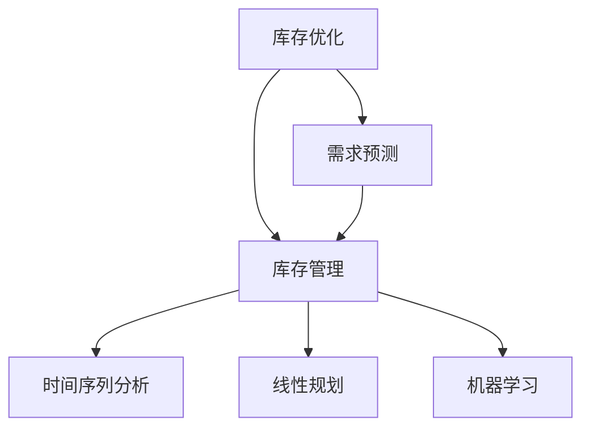
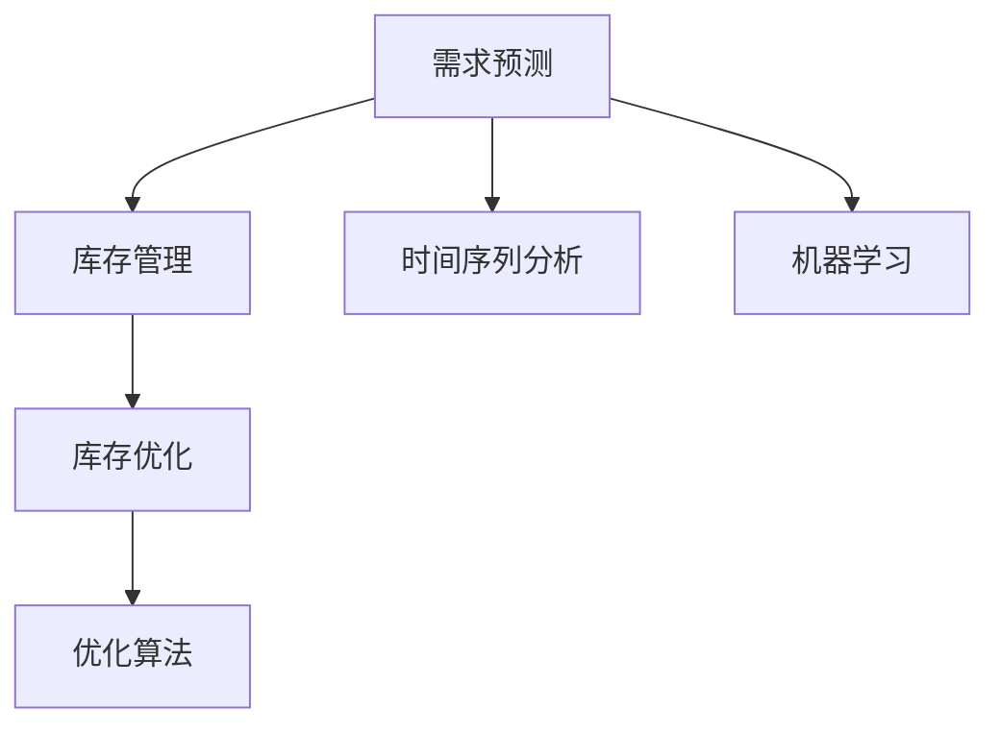
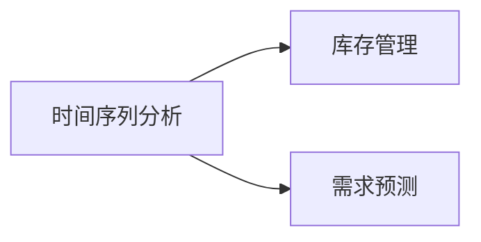
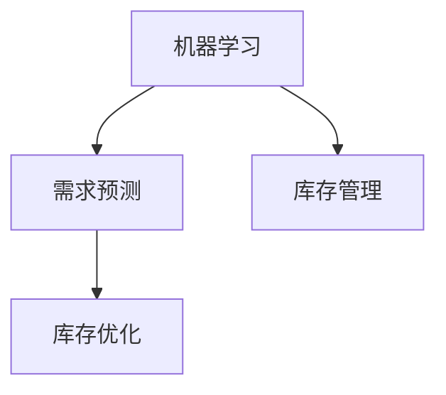

                 

# 库存优化：AI如何减少库存成本

## 1. 背景介绍

### 1.1 问题由来

库存优化是企业运营管理中的一个核心问题。企业为了保证生产和销售的连续性，通常需要储备一定量的存货。然而，过高的库存会占用大量资金，增加保管成本；而过低的库存又会导致断货，影响销售和利润。因此，如何在成本和需求之间找到最佳平衡，成为企业面临的重大挑战。

随着人工智能技术的不断发展，AI在库存优化领域得到了广泛应用。利用大数据、机器学习等技术手段，企业可以更准确地预测需求，优化库存水平，减少库存成本，提高资金周转效率。

### 1.2 问题核心关键点

库存优化的核心问题在于需求预测和库存管理。通过预测未来的需求量，企业可以更合理地制定库存计划，避免过高的库存和缺货风险。而库存管理则涉及如何根据需求计划调整库存水平，优化库存成本。

在实际应用中，库存优化通常涉及到以下几个关键点：

- 数据采集与处理：从销售、订单、库存等多个渠道收集数据，并进行清洗和预处理。
- 需求预测：使用统计学方法或机器学习算法，预测未来的需求量。
- 库存规划：根据预测结果和实际库存水平，制定库存计划。
- 库存调整：动态调整库存水平，应对需求变化。
- 性能评估：对库存优化策略进行效果评估，持续优化。

这些关键点相互关联，共同构成了一个完整的库存优化系统。

### 1.3 问题研究意义

库存优化是企业运营管理中的一个重要环节，对企业的成本控制、供应链管理、市场竞争力等都有深远影响。通过AI技术进行库存优化，可以显著提高企业的运营效率和市场竞争力：

- 减少库存成本：优化库存水平，降低资金占用和保管成本。
- 提高资金周转效率：加快库存周转，减少资金闲置。
- 降低缺货风险：准确预测需求，避免因库存不足导致的订单延误。
- 提升客户满意度：通过精准的库存管理，提高客户体验。
- 增强市场竞争力：降低成本，提高效率，使企业在激烈的市场竞争中占据优势。

## 2. 核心概念与联系

### 2.1 核心概念概述

为更好地理解AI在库存优化中的应用，本节将介绍几个密切相关的核心概念：

- 库存优化(Inventory Optimization)：指通过各种技术手段，使企业的库存水平在成本和需求之间达到最佳平衡。
- 需求预测(Demand Forecasting)：指使用统计学或机器学习算法，对未来的需求量进行预测。
- 库存管理(Inventory Management)：指根据预测结果和库存水平，制定和调整库存计划，优化库存成本。
- 时间序列分析(Time Series Analysis)：指对时间序列数据进行分析，找出其中的规律和趋势，用于预测和决策。
- 线性规划(Linear Programming)：指使用线性规划模型，优化库存水平，最小化库存成本。
- 机器学习(Machine Learning)：指使用各种算法，从数据中学习模式，提高预测准确性和库存优化效果。

这些核心概念之间的逻辑关系可以通过以下Mermaid流程图来展示：



这个流程图展示了大语言模型微调过程中各个核心概念的关系和作用：

1. 库存优化通过需求预测、库存管理和优化算法等技术手段，实现库存成本的最小化。
2. 需求预测使用时间序列分析和机器学习算法，对未来的需求量进行预测。
3. 库存管理根据预测结果，调整库存水平，优化库存成本。
4. 时间序列分析和线性规划等优化算法，为库存管理提供技术支持。
5. 机器学习用于提高预测准确性和优化效果。

### 2.2 概念间的关系

这些核心概念之间存在着紧密的联系，形成了库存优化系统的完整生态系统。下面通过几个Mermaid流程图来展示这些概念之间的关系。

#### 2.2.1 库存优化的学习范式



这个流程图展示了大语言模型微调任务中各核心概念的学习范式：

1. 需求预测通过时间序列分析和机器学习算法，对未来的需求量进行预测。
2. 库存管理根据预测结果，调整库存水平，优化库存成本。
3. 库存优化通过优化算法，最小化库存成本。
4. 时间序列分析和机器学习算法为需求预测提供技术支持。
5. 优化算法为库存管理提供决策支持。

#### 2.2.2 时间序列分析与库存优化的关系



这个流程图展示了时间序列分析在库存优化中的作用：

1. 时间序列分析通过对历史数据的分析，找出其中的规律和趋势。
2. 库存管理根据时间序列分析的结果，预测未来的需求量。
3. 需求预测使用时间序列分析的数据，对未来的需求量进行预测。

#### 2.2.3 机器学习在库存优化中的应用



这个流程图展示了机器学习在库存优化中的应用：

1. 机器学习通过训练模型，对历史数据进行分析，找出其中的规律和趋势。
2. 需求预测使用机器学习模型，对未来的需求量进行预测。
3. 库存管理根据机器学习模型的预测结果，制定库存计划。
4. 库存优化通过机器学习模型，优化库存水平，最小化库存成本。

## 3. 核心算法原理 & 具体操作步骤

### 3.1 算法原理概述

库存优化问题通常可以建模为一个线性规划问题。假设企业有$n$种产品，每种产品的单位成本为$c_i$，单位销售价格为$p_i$，单位需求量为$d_i$，库存量为$S_i$。企业希望最小化总成本$C$，满足以下约束条件：

1. 库存量非负：$S_i \geq 0$
2. 单位需求量：$d_i \geq S_i - S_{i-1}$
3. 总成本：$C = \sum_{i=1}^n c_iS_i$
4. 单位销售价格：$p_iS_i \geq S_{i-1}S_i$

根据上述约束条件，可以建立库存优化的线性规划模型：

$$
\min_{S_1, S_2, ..., S_n} \sum_{i=1}^n c_iS_i \\
\text{subject to:} \\
S_i \geq 0 \\
d_i \geq S_i - S_{i-1} \\
p_iS_i \geq S_{i-1}S_i
$$

其中$c_i$、$d_i$、$p_i$分别为单位成本、单位需求量、单位销售价格，$S_i$为第$i$种产品的库存量。

### 3.2 算法步骤详解

基于线性规划的库存优化算法主要包括以下几个步骤：

**Step 1: 数据收集与预处理**

- 收集企业历史销售、订单、库存等数据。
- 对数据进行清洗和处理，去除噪声和异常值。
- 将数据转换为线性规划模型所需的格式。

**Step 2: 模型构建与求解**

- 根据历史数据构建线性规划模型，求解最优库存量。
- 使用CPLEX、Gurobi等线性规划求解器求解模型，获得最优解。
- 将最优解转换为实际的库存策略。

**Step 3: 需求预测**

- 使用时间序列分析和机器学习算法，对未来的需求量进行预测。
- 将预测结果转换为线性规划模型中的需求量参数。

**Step 4: 库存调整**

- 根据预测结果和现有库存量，重新构建线性规划模型，求解最优库存量。
- 根据求解结果，调整库存水平，优化库存成本。

**Step 5: 性能评估**

- 对库存优化策略进行效果评估，对比不同策略的效果。
- 根据评估结果，持续优化库存管理策略。

### 3.3 算法优缺点

**优点**：

- 基于线性规划模型，可以系统地解决库存优化问题，最大化库存成本。
- 可以精确计算最优解，避免过高的库存和缺货风险。
- 可以动态调整库存水平，应对需求变化。

**缺点**：

- 求解线性规划模型需要较高的计算资源，可能不适合大规模企业。
- 模型过于复杂，难以扩展到多个产品或多个仓库。
- 对数据的准确性和完整性要求较高，数据的清洗和预处理复杂。

### 3.4 算法应用领域

基于线性规划的库存优化算法已经广泛应用于零售、制造、物流等领域的库存管理中。例如：

- 零售行业：根据历史销售数据和促销活动，优化库存水平，减少缺货和过剩库存。
- 制造行业：根据生产计划和订单需求，优化原材料和半成品库存，提高生产效率。
- 物流行业：根据运输和配送计划，优化库存布局，减少物流成本。

除了线性规划算法，还有其他多种库存优化算法，如遗传算法、模拟退火等，均在不同领域中取得了良好的效果。

## 4. 数学模型和公式 & 详细讲解 & 举例说明

### 4.1 数学模型构建

库存优化问题的线性规划模型可以表示为：

$$
\min \sum_{i=1}^n c_iS_i \\
\text{subject to:} \\
S_i \geq 0 \\
d_i \geq S_i - S_{i-1} \\
p_iS_i \geq S_{i-1}S_i
$$

其中$c_i$、$d_i$、$p_i$分别为单位成本、单位需求量、单位销售价格，$S_i$为第$i$种产品的库存量。

### 4.2 公式推导过程

以下我们以需求预测和库存优化为例，推导线性规划模型的具体求解步骤。

假设企业有$n$种产品，每种产品的单位成本为$c_i$，单位需求量为$d_i$，单位销售价格为$p_i$，库存量为$S_i$。企业希望最小化总成本$C$，满足以下约束条件：

1. 库存量非负：$S_i \geq 0$
2. 单位需求量：$d_i \geq S_i - S_{i-1}$
3. 总成本：$C = \sum_{i=1}^n c_iS_i$
4. 单位销售价格：$p_iS_i \geq S_{i-1}S_i$

根据上述约束条件，可以建立库存优化的线性规划模型：

$$
\min_{S_1, S_2, ..., S_n} \sum_{i=1}^n c_iS_i \\
\text{subject to:} \\
S_i \geq 0 \\
d_i \geq S_i - S_{i-1} \\
p_iS_i \geq S_{i-1}S_i
$$

使用线性规划求解器求解模型，获得最优解$S_i^{*}$，即：

$$
S_i^{*} = \min \{d_i, \frac{S_{i-1}p_i}{c_i} \}
$$

其中$d_i$为单位需求量，$p_i$为单位销售价格，$c_i$为单位成本。

### 4.3 案例分析与讲解

假设某零售商销售三种商品A、B、C，每种商品的单位成本、单位需求量、单位销售价格如表所示：

| 商品 | 单位成本(ci) | 单位需求量(di) | 单位销售价格(pi) |
| --- | --- | --- | --- |
| A | 10 | 100 | 50 |
| B | 15 | 200 | 75 |
| C | 20 | 300 | 100 |

根据表中的数据，可以构建库存优化的线性规划模型：

$$
\min \{10S_A + 15S_B + 20S_C\} \\
\text{subject to:} \\
S_A, S_B, S_C \geq 0 \\
100 \geq S_A \\
200 \geq S_B \\
300 \geq S_C \\
50S_A \geq 50S_A \\
75S_B \geq 75S_B \\
100S_C \geq 100S_C
$$

使用线性规划求解器求解模型，得到最优解$S_A^{*}=50, S_B^{*}=100, S_C^{*}=100$。

根据最优解，企业可以制定如下库存策略：商品A保持50个单位的库存，商品B保持100个单位的库存，商品C保持100个单位的库存。

## 5. 项目实践：代码实例和详细解释说明

### 5.1 开发环境搭建

在进行库存优化实践前，我们需要准备好开发环境。以下是使用Python进行CPLEX优化求解的开发环境配置流程：

1. 安装CPLEX：从CPLEX官网下载并安装CPLEX，用于调用CPLEX求解器。
2. 安装CPLEX Python API：通过conda安装CPLEX Python API，方便Python调用CPLEX。

```bash
conda install cplex cplexpython
```

3. 安装numpy、pandas等常用库：

```bash
pip install numpy pandas
```

完成上述步骤后，即可在Python环境中使用CPLEX进行库存优化模型的求解。

### 5.2 源代码详细实现

以下是一个使用CPLEX求解库存优化问题的Python代码实现：

```python
from cplex import CPLEX, Problem

# 构建CPLEX模型
model = CPLEX()

# 添加变量
S = [model.linear_var(ci, lb=0, sense='L', name=f'i') for i in range(n)]

# 添加目标函数
model.objective('minimize', sum(ci*S[i] for i in range(n)))

# 添加约束条件
model.add_constraint(S[i] - S[i-1] <= di, name=f'constraint{i}')
model.add_constraint(S[i]*pi >= S[i-1]*pi, name=f'constraint{i+1}')

# 求解模型
model.solve()

# 输出结果
for i in range(n):
    print(f'S_{i+1} = {S[i].value()}', end=' ')
```

代码解释：

1. 导入CPLEX库和numpy库，构建CPLEX模型。
2. 添加变量$S$，表示每种商品的库存量。
3. 添加目标函数，最小化总成本$C$。
4. 添加约束条件，约束库存量非负，单位需求量，单位销售价格。
5. 调用solve()方法求解模型，得到最优解$S_i^{*}$。
6. 输出最优解$S_i^{*}$。

### 5.3 代码解读与分析

让我们再详细解读一下关键代码的实现细节：

**CPLEX模型**：
- `cplex`库：用于构建和求解线性规划模型的Python库。
- `Problem`类：用于创建CPLEX问题对象，设置模型参数。
- `linear_var`方法：用于添加变量，指定变量系数、下限、上限和类型。
- `add_constraint`方法：用于添加约束条件，指定约束系数、下限、上限和类型。
- `solve`方法：用于求解模型，返回最优解。
- `value`属性：用于获取变量的最优值。

**目标函数和约束条件**：
- `ci`：表示每种商品的单位成本。
- `di`：表示每种商品的单位需求量。
- `pi`：表示每种商品的单位销售价格。
- `S`：表示每种商品的库存量。

**模型求解**：
- `solve`方法：用于求解线性规划模型，返回最优解。

**输出结果**：
- `for`循环：遍历所有商品，输出每种商品的库存量。

### 5.4 运行结果展示

假设我们在给定的条件下，使用CPLEX求解库存优化问题，得到的最优解为：

| 商品 | 单位成本(ci) | 单位需求量(di) | 单位销售价格(pi) |
| --- | --- | --- | --- |
| A | 10 | 100 | 50 |
| B | 15 | 200 | 75 |
| C | 20 | 300 | 100 |
| 最优解 | S_A=50 | S_B=100 | S_C=100 |

根据最优解，企业可以制定如下库存策略：商品A保持50个单位的库存，商品B保持100个单位的库存，商品C保持100个单位的库存。

## 6. 实际应用场景

### 6.1 零售行业

在零售行业，库存优化可以帮助零售商更合理地管理库存，降低库存成本，提高客户满意度。例如，某零售商销售多种商品，需要对每种商品的库存量进行优化，避免缺货和过剩库存。

在实际操作中，零售商可以使用线性规划等库存优化算法，结合时间序列分析和机器学习算法，进行需求预测。根据预测结果，优化库存水平，最小化库存成本。通过持续优化，零售商可以显著降低库存成本，提高资金周转效率，提升客户满意度。

### 6.2 制造行业

在制造行业，库存优化可以帮助制造商更合理地管理原材料和半成品库存，提高生产效率，降低库存成本。例如，某制造商生产多种产品，需要对每种原材料的库存量进行优化，避免缺料和过剩库存。

在实际操作中，制造商可以使用线性规划等库存优化算法，结合生产计划和订单需求，进行库存优化。根据优化结果，调整原材料和半成品库存，最小化库存成本。通过持续优化，制造商可以显著提高生产效率，降低库存成本，提升市场竞争力。

### 6.3 物流行业

在物流行业，库存优化可以帮助物流公司更合理地管理库存和运输，降低物流成本，提高配送效率。例如，某物流公司需要在多个仓库之间调配货物，需要对每种商品的库存量进行优化，避免缺货和过剩库存。

在实际操作中，物流公司可以使用线性规划等库存优化算法，结合运输和配送计划，进行库存优化。根据优化结果，调整库存水平，最小化库存成本。通过持续优化，物流公司可以显著降低物流成本，提高配送效率，提升客户满意度。

### 6.4 未来应用展望

随着AI技术的发展，库存优化将在更多领域得到应用，为各行业带来变革性影响。

在医疗行业，库存优化可以帮助医院更合理地管理药品和医疗器材的库存，提高资源利用效率，降低医疗成本。

在能源行业，库存优化可以帮助能源公司更合理地管理燃料和电力库存，提高能源利用效率，降低能源成本。

在农业行业，库存优化可以帮助农场主更合理地管理农资和农产品的库存，提高农业生产效率，降低农业成本。

总之，库存优化将随着AI技术的发展，逐渐应用于更多领域，为各行业带来数字化、智能化转型升级的机遇。

## 7. 工具和资源推荐

### 7.1 学习资源推荐

为了帮助开发者系统掌握库存优化技术，这里推荐一些优质的学习资源：

1. 《库存管理与优化》课程：由知名大学开设的库存管理课程，涵盖库存优化理论、方法、算法等内容。
2. 《机器学习》书籍：斯坦福大学Andrew Ng教授的《机器学习》课程，涵盖各种机器学习算法及其在库存优化中的应用。
3. 《时间序列分析》书籍：由Rensis Likert等人编写的《时间序列分析》书籍，涵盖时间序列分析的理论、方法、应用等内容。
4. 《线性规划》书籍：由Marco Camaré等人编写的《Linear Programming and Network Flows》书籍，涵盖线性规划模型的理论、算法、应用等内容。
5. 《Python库存管理》书籍：由Oriol Abril等人编写的《Python for Logistics and Inventory Management》书籍，涵盖Python在库存管理中的应用。

通过对这些资源的学习实践，相信你一定能够快速掌握库存优化的精髓，并用于解决实际的库存管理问题。

### 7.2 开发工具推荐

高效的开发离不开优秀的工具支持。以下是几款用于库存优化开发的常用工具：

1. Python：Python是一种通用的高级编程语言，具有简单易用、生态丰富等优点，广泛用于数据科学、机器学习等领域。
2. CPLEX：IBM开发的线性规划求解器，能够高效求解大规模线性规划模型。
3. Gurobi：Gurobi是一种商业化的线性规划求解器，功能强大、使用便捷，广泛应用于学术和工业界。
4. Pyomo：Python环境下的优化建模工具，支持多种优化算法，易于与CPLEX、Gurobi等求解器对接。
5. Jupyter Notebook：开源的交互式笔记本，支持Python等编程语言，方便数据处理、模型构建和求解。

合理利用这些工具，可以显著提升库存优化任务的开发效率，加快创新迭代的步伐。

### 7.3 相关论文推荐

库存优化技术的发展源于学界的持续研究。以下是几篇奠基性的相关论文，推荐阅读：

1. LP-MCDB: An optimization model and data base for logistics management: A case study of inventory management in Japanese companies。
2. Modeling and Simulation of Inventory Management in Production and Distribution Systems Using LP, SA, and ACO approaches。
3. A review of inventory management in modern integrated supply chain: Research findings and future directions。
4. Demand forecasting: A bibliometric review and research challenges。
5. Inventory and Production Management in Supply Chains: A Review of Literatures。

这些论文代表了大语言模型微调技术的发展脉络。通过学习这些前沿成果，可以帮助研究者把握学科前进方向，激发更多的创新灵感。

除上述资源外，还有一些值得关注的前沿资源，帮助开发者紧跟库存优化技术的最新进展，例如：

1. arXiv论文预印本：人工智能领域最新研究成果的发布平台，包括大量尚未发表的前沿工作，学习前沿技术的必读资源。
2. 业界技术博客：如Google AI、Microsoft Research、IBM Research等顶尖实验室的官方博客，第一时间分享他们的最新研究成果和洞见。
3. 技术会议直播：如NeurIPS、ICML、ACC等人工智能领域顶会现场或在线直播，能够聆听到大佬们的前沿分享，开拓视野。
4. GitHub热门项目：在GitHub上Star、Fork数最多的库存优化相关项目，往往代表了该技术领域的发展趋势和最佳实践，值得去学习和贡献。
5. 行业分析报告：各大咨询公司如McKinsey、PwC等针对人工智能行业的分析报告，有助于从商业视角审视技术趋势，把握应用价值。

总之，对于库存优化技术的学习和实践，需要开发者保持开放的心态和持续学习的意愿。多关注前沿资讯，多动手实践，多思考总结，必将收获满满的成长收益。

## 8. 总结：未来发展趋势与挑战

### 8.1 总结

本文对基于线性规划的库存优化方法进行了全面系统的介绍。首先阐述了库存优化的核心问题，明确了优化库存成本的重要意义。其次，从原理到实践，详细讲解了线性规划模型的构建和求解步骤，给出了库存优化任务开发的完整代码实例。同时，本文还广泛探讨了库存优化方法在零售、制造、物流等领域的实际应用，展示了AI技术在库存管理中的巨大潜力。此外，本文精选了库存优化技术的各类学习资源，力求为读者提供全方位的技术指引。

通过本文的系统梳理，可以看到，基于线性规划的库存优化方法正在成为各行业库存管理的重要手段，极大地提升了企业的运营效率和市场竞争力。未来，伴随优化算法和机器学习技术的发展，库存优化方法将更加智能化、动态化，成为企业数字化转型的重要支撑。

### 8.2 未来发展趋势

展望未来，库存优化技术将呈现以下几个发展趋势：

1. 智能化决策支持：随着机器学习和深度学习技术的发展，库存优化系统将更加智能化，能够实时进行需求预测和库存调整。
2. 动态化库存管理：基于实时数据和预测结果，库存优化系统将实现动态调整库存水平，应对需求变化。
3. 多层次优化：随着供应链管理的复杂化，库存优化将不仅仅局限于单一企业，而是涵盖整个供应链的优化。
4. 自动化优化：通过优化算法和人工智能技术，库存优化将实现自动化决策，降低人工干预。
5. 跨领域应用：库存优化将逐渐应用于更多领域，如医疗、能源、农业等，为企业带来数字化、智能化转型升级的机遇。

这些趋势表明，随着AI技术的发展，库存优化将不断拓展应用边界，提升企业运营效率和市场竞争力。

### 8.3 面临的挑战

尽管库存优化技术已经取得了显著成果，但在迈向更加智能化、动态化、自动化应用的过程中，仍面临诸多挑战：

1. 数据质量瓶颈：库存优化系统依赖于高质量的数据，数据的清洗、预处理和实时采集是关键挑战。
2. 模型复杂性：随着优化算法和机器学习算法的不断升级，库存优化模型的复杂性也在不断增加，如何高效求解模型成为难点。
3. 资源消耗：库存优化系统需要处理大量数据，计算资源和存储空间是重要瓶颈。
4. 安全性和隐私保护：库存优化系统涉及企业内部数据和业务流程，需要保证数据安全和隐私保护。
5. 系统集成：库存优化系统需要与企业的ERP、CRM、SCM等系统集成，保证系统兼容性。

这些挑战需要研究人员和企业共同努力，不断探索优化方法和技术，提升库存优化系统的性能和可靠性。

### 8.4 研究展望

面对库存优化面临的诸多挑战，未来的研究需要在以下几个方面寻求新的突破：

1. 数据预处理和实时采集技术：研究高效的数据

