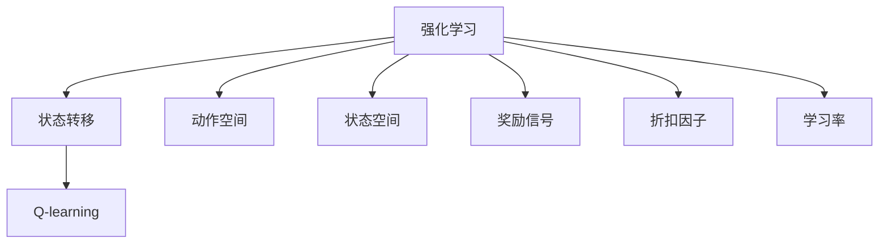
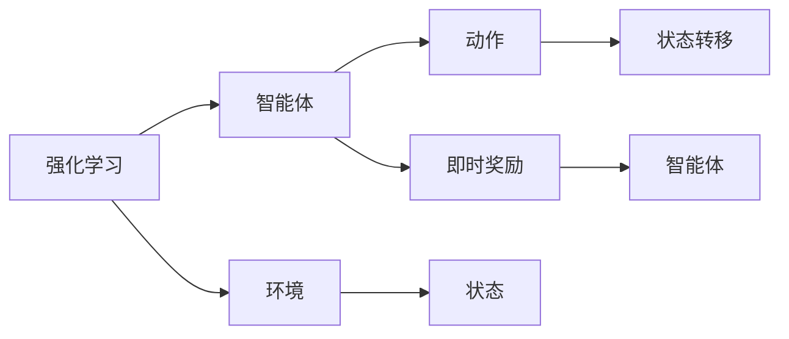
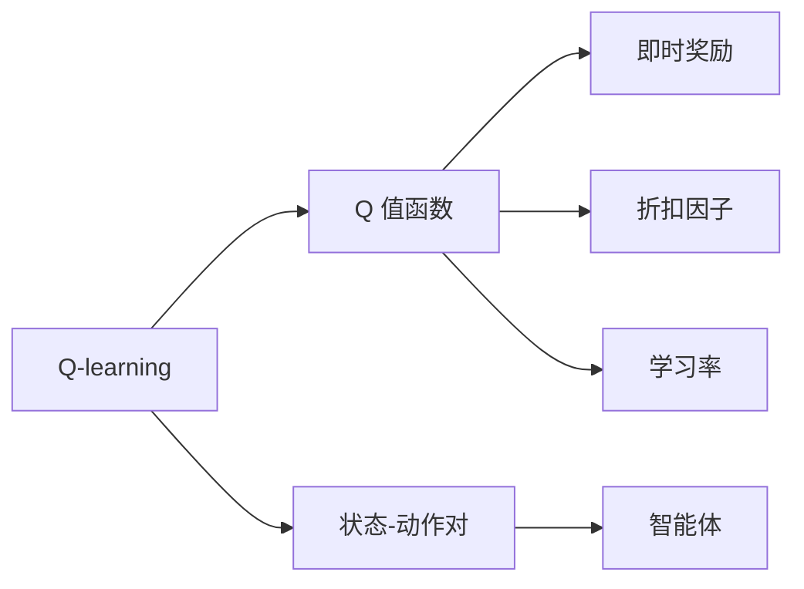
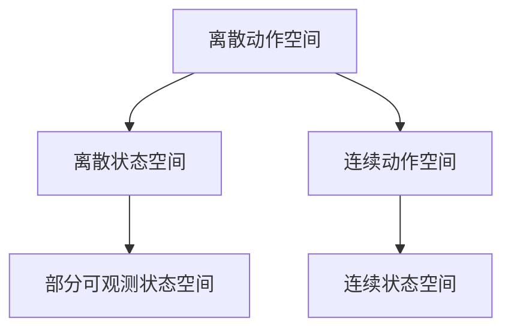
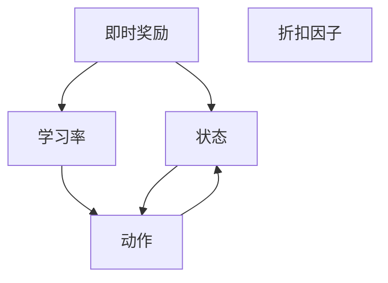

                 

# 强化学习算法：Q-learning 原理与代码实例讲解

> 关键词：强化学习, Q-learning, 深度强化学习, 代理学习, 状态转移, 连续动作空间, 代码实例

## 1. 背景介绍

### 1.1 问题由来
强化学习 (Reinforcement Learning, RL) 是人工智能领域的一项重要技术，其研究目标是构建能够与环境交互，通过观察和动作来最大化累积奖励的学习算法。强化学习算法在许多复杂系统优化问题中，如游戏 AI、机器人控制、推荐系统等，都取得了显著成效。其中 Q-learning 算法是最早提出并被广泛应用的一种基于模型的强化学习算法，它通过更新 Q 值函数，指导智能体如何采取最优策略行动，从而最大化累积奖励。

然而，传统的 Q-learning 算法在处理高维状态空间、连续动作空间、部分可观测环境等复杂场景时，效率较低，效果不佳。为此，深度强化学习应运而生，利用深度神经网络处理复杂非线性问题，进一步提升了强化学习的性能。

### 1.2 问题核心关键点
Q-learning 算法核心思想是通过学习 Q 值函数，来预测在每个状态下采取每个动作后的累积奖励，进而指导智能体选择最优动作。Q-learning 的核心方程如下：

$$
Q(s_t, a_t) \leftarrow Q(s_t, a_t) + \alpha \cdot [r_{t+1} + \gamma \max_{a'} Q(s_{t+1}, a')] - Q(s_t, a_t)
$$

其中，$s_t$ 为当前状态，$a_t$ 为当前动作，$r_{t+1}$ 为即时奖励，$\gamma$ 为折扣因子，$\alpha$ 为学习率，$Q(s_t, a_t)$ 为状态-动作对 $(s_t, a_t)$ 的 Q 值。该方程描述了 Q 值的更新过程，即在每个状态下，根据即时奖励和下一状态的最大 Q 值，更新当前状态-动作对的 Q 值。

Q-learning 算法通过不断迭代 Q 值函数，不断调整策略，直至收敛到最优策略。这种基于模型的强化学习方法，虽然简单高效，但面对复杂环境时，学习速度较慢，容易陷入局部最优。

### 1.3 问题研究意义
研究 Q-learning 算法，对于构建高效智能体、提升智能系统的决策能力，具有重要意义：

1. 算法灵活性：Q-learning 算法适用于各类环境，如离散和连续动作空间、部分可观测环境等，能够应对复杂的多维度决策问题。
2. 稳定性和鲁棒性：Q-learning 算法对环境扰动具有一定的鲁棒性，能够通过不断迭代优化，提升系统性能。
3. 可扩展性：Q-learning 算法可以通过深度学习技术进行扩展，解决高维非线性问题。
4. 通用性：Q-learning 算法在各类智能系统中都有广泛应用，如机器人、自动驾驶、游戏 AI 等。
5. 促进其他强化学习算法的发展：Q-learning 算法为其他复杂强化学习算法提供了理论基础和技术支持。

## 2. 核心概念与联系

### 2.1 核心概念概述

为更好地理解 Q-learning 算法，本节将介绍几个密切相关的核心概念：

- 强化学习 (Reinforcement Learning, RL)：通过智能体与环境交互，智能体通过采取动作来最大化累积奖励的学习过程。
- Q-learning：一种基于模型的强化学习算法，通过学习 Q 值函数，指导智能体采取最优策略。
- 状态转移 (State Transition)：智能体在采取动作后，从当前状态转移到下一状态的过程。
- 动作空间 (Action Space)：智能体可以采取的所有动作的集合，如离散动作、连续动作等。
- 状态空间 (State Space)：智能体在环境中所处位置的所有可能状态集合。
- 奖励信号 (Reward Signal)：智能体采取动作后，环境给予的即时反馈，用于衡量智能体行为的好坏。
- 折扣因子 (Discount Factor)：用于权衡即时奖励和未来奖励的重要性，通常取值在 0 到 1 之间。
- 学习率 (Learning Rate)：Q-learning 算法中用于更新 Q 值的参数，决定了 Q 值更新的步幅大小。

这些核心概念之间的逻辑关系可以通过以下 Mermaid 流程图来展示：



这个流程图展示出强化学习的基本组成和 Q-learning 在其中的地位。通过理解这些核心概念，我们可以更好地把握 Q-learning 算法的原理和实现细节。

### 2.2 概念间的关系

这些核心概念之间存在着紧密的联系，构成了强化学习的完整框架。下面通过几个 Mermaid 流程图来展示这些概念之间的关系。

#### 2.2.1 强化学习的基本流程



这个流程图展示了强化学习的基本流程。智能体通过与环境交互，采取动作，观察状态，获取即时奖励，最终优化策略，最大化累积奖励。

#### 2.2.2 Q-learning 的核心思想



这个流程图展示了 Q-learning 的核心思想。通过学习 Q 值函数，智能体在每个状态下选择最优动作，最大化累积奖励。

#### 2.2.3 动作空间和状态空间



这个流程图展示了动作空间和状态空间的类型。离散动作空间和状态空间比较简单，而连续动作空间和部分可观测状态空间则更加复杂。

### 2.3 核心概念的整体架构

最后，我们用一个综合的流程图来展示 Q-learning 算法的整体架构：



这个综合流程图展示了 Q-learning 算法的基本架构。智能体在每个状态下，根据即时奖励和折扣因子，更新 Q 值函数，并选择最优动作。

## 3. 核心算法原理 & 具体操作步骤
### 3.1 算法原理概述

Q-learning 算法通过学习 Q 值函数，指导智能体在每个状态下选择最优动作，最大化累积奖励。核心思想是利用贪心策略，选择当前状态下 Q 值最大的动作，并通过 Q 值的更新，不断优化 Q 值函数。

在每个时间步 $t$，智能体从当前状态 $s_t$ 采取动作 $a_t$，获得即时奖励 $r_{t+1}$，并转移到下一个状态 $s_{t+1}$。智能体根据即时奖励和折扣因子 $\gamma$，以及当前状态-动作对的 Q 值 $Q(s_t, a_t)$，更新该状态-动作对的 Q 值：

$$
Q(s_t, a_t) \leftarrow Q(s_t, a_t) + \alpha \cdot [r_{t+1} + \gamma \max_{a'} Q(s_{t+1}, a')] - Q(s_t, a_t)
$$

其中 $\alpha$ 为学习率，控制 Q 值更新的步幅大小。该方程描述了 Q 值的更新过程，即在每个状态下，根据即时奖励和下一状态的最大 Q 值，更新当前状态-动作对的 Q 值。

### 3.2 算法步骤详解

Q-learning 算法的具体操作步骤如下：

**Step 1: 准备环境与智能体**

- 定义智能体和环境的接口，用于交互和获取状态、动作、即时奖励等信息。
- 初始化智能体的 Q 值函数，通常使用哈希表或矩阵存储状态-动作对的 Q 值。
- 设置环境参数，如动作空间、状态空间、奖励函数等。

**Step 2: 执行策略**

- 智能体从当前状态 $s_t$ 选择动作 $a_t$，执行动作并观察即时奖励 $r_{t+1}$ 和下一个状态 $s_{t+1}$。
- 根据即时奖励和折扣因子，更新当前状态-动作对的 Q 值。
- 如果达到终止状态或达到迭代次数，则停止执行。

**Step 3: 训练迭代**

- 重复执行策略，直至收敛到最优策略。
- 可以通过统计智能体的累积奖励或平均 Q 值等指标，评估训练效果。

**Step 4: 优化参数**

- 根据训练效果，调整学习率 $\alpha$、折扣因子 $\gamma$ 等参数，进一步优化 Q-learning 算法。

### 3.3 算法优缺点

Q-learning 算法具有以下优点：

- 简单高效：Q-learning 算法易于实现，不需要大量标注数据。
- 自适应性强：智能体通过 Q 值函数的迭代，不断优化策略，能够适应复杂环境。
- 可扩展性好：Q-learning 算法可以扩展到连续动作空间和部分可观测环境等复杂场景。

但 Q-learning 算法也存在一些缺点：

- 收敛速度慢：在复杂环境中，Q-learning 算法需要大量迭代才能收敛。
- 容易陷入局部最优：智能体在状态空间中容易陷入局部最优，导致性能提升有限。
- 对模型依赖性强：Q-learning 算法需要构建状态转移模型，对环境建模的要求较高。
- 依赖学习率选择：学习率选择不当，可能导致 Q 值函数发散或收敛速度慢。

### 3.4 算法应用领域

Q-learning 算法已经在多个领域得到应用，包括：

- 机器人控制：如机器人臂抓取物体、自动驾驶等。
- 游戏 AI：如策略类游戏（如围棋、星际争霸等）。
- 推荐系统：如电商网站的商品推荐。
- 智能决策：如供应链优化、投资策略等。
- 自然语言处理：如机器翻译、语音识别等。

除了上述这些应用领域，Q-learning 算法还可以进一步应用于其他需要智能决策的领域，如金融风控、医疗诊断等。

## 4. 数学模型和公式 & 详细讲解 & 举例说明

### 4.1 数学模型构建

Q-learning 算法的数学模型建立在马尔可夫决策过程 (Markov Decision Process, MDP) 的基础上。MDP 由状态空间 $S$、动作空间 $A$、即时奖励函数 $R$、状态转移概率 $P$ 和折扣因子 $\gamma$ 组成。智能体在每个状态下，根据即时奖励和状态转移概率，选择最优动作，最大化累积奖励。

形式化地，MDP 可以表示为：

$$
(S, A, R, P, \gamma)
$$

其中 $S$ 为状态空间，$A$ 为动作空间，$R$ 为即时奖励函数，$P$ 为状态转移概率，$\gamma$ 为折扣因子。

### 4.2 公式推导过程

在 Q-learning 算法中，智能体通过迭代更新 Q 值函数，不断优化策略。以下详细推导 Q 值函数的更新方程：

假设智能体在时间步 $t$ 的状态为 $s_t$，采取动作 $a_t$，获得即时奖励 $r_{t+1}$，并转移到下一个状态 $s_{t+1}$。则 Q-learning 算法的 Q 值更新方程为：

$$
Q(s_t, a_t) \leftarrow Q(s_t, a_t) + \alpha \cdot [r_{t+1} + \gamma \max_{a'} Q(s_{t+1}, a')] - Q(s_t, a_t)
$$

其中 $\alpha$ 为学习率，$r_{t+1}$ 为即时奖励，$\gamma$ 为折扣因子，$\max_{a'} Q(s_{t+1}, a')$ 为下一个状态 $s_{t+1}$ 的最优 Q 值。

在实际应用中，为了提高 Q-learning 算法的收敛速度和性能，通常采用深度 Q-learning 算法，利用深度神经网络来近似 Q 值函数。具体的深度 Q-learning 算法流程如下：

1. 定义 Q 网络，使用深度神经网络来近似 Q 值函数。
2. 初始化 Q 网络，设置随机初始权重。
3. 执行智能体策略，选择动作并观察即时奖励和下一个状态。
4. 根据即时奖励和折扣因子，更新当前状态-动作对的 Q 值。
5. 利用目标网络进行 Q-值函数更新的稳定训练。
6. 周期性将 Q 网络参数更新为目标网络参数，确保模型稳定性。

深度 Q-learning 算法的具体公式推导和实现细节，可以参考深度强化学习中的相关论文和代码库。

### 4.3 案例分析与讲解

下面我们以机器人臂抓取物体为例，展示 Q-learning 算法的应用。假设机器人在平面空间中有 4 个状态，分别表示机器人位于起点、向左移动、向右移动、抓取物体。机器人可以采取的动作包括向左、向右、抓取、放下。机器人的目标是尽可能快地抓取物体并返回起点。

定义状态空间 $S=\{start, left, right, object\}$，动作空间 $A=\{left, right, grab, drop\}$，奖励函数 $R=\{0, 1, 2, -1\}$，状态转移概率 $P=\{0.9, 0.1, 0.1, 0.9\}$。则机器人在每个状态下的 Q 值函数为：

$$
Q(start, left) = Q(start, right) = Q(start, object) = 0
$$

$$
Q(left, left) = Q(left, right) = Q(left, object) = -1
$$

$$
Q(right, left) = Q(right, right) = Q(right, object) = 1
$$

$$
Q(grab, left) = Q(grab, right) = Q(grab, object) = 2
$$

$$
Q(drop, left) = Q(drop, right) = Q(drop, object) = -1
$$

智能体在每个状态上，通过迭代更新 Q 值函数，不断优化策略，直至收敛到最优策略。最终，智能体可以学习到最优策略，即从起点出发，先向右移动，抓取物体，然后返回起点。

## 5. 项目实践：代码实例和详细解释说明

### 5.1 开发环境搭建

在进行 Q-learning 算法开发前，我们需要准备好开发环境。以下是使用 Python 进行强化学习开发的常用环境配置流程：

1. 安装 Anaconda：从官网下载并安装 Anaconda，用于创建独立的 Python 环境。

2. 创建并激活虚拟环境：
```bash
conda create -n reinforcement-env python=3.8 
conda activate reinforcement-env
```

3. 安装相关库：
```bash
conda install numpy pandas matplotlib gym
```

4. 安装强化学习库：
```bash
pip install gym
pip install stable-baselines
```

完成上述步骤后，即可在 `reinforcement-env` 环境中进行 Q-learning 算法的开发。

### 5.2 源代码详细实现

这里我们以 OpenAI Gym 中的 Pendulum 环境为例，展示 Q-learning 算法的实现。

首先，定义状态空间和动作空间：

```python
import gym

env = gym.make('Pendulum-v0')
state_dim = env.observation_space.shape[0]
action_dim = env.action_space.shape[0]
```

然后，定义 Q 网络，使用深度神经网络来近似 Q 值函数：

```python
import torch
import torch.nn as nn
import torch.optim as optim

class QNetwork(nn.Module):
    def __init__(self, state_dim, action_dim):
        super(QNetwork, self).__init__()
        self.fc1 = nn.Linear(state_dim, 64)
        self.fc2 = nn.Linear(64, 64)
        self.fc3 = nn.Linear(64, action_dim)

    def forward(self, x):
        x = torch.relu(self.fc1(x))
        x = torch.relu(self.fc2(x))
        x = self.fc3(x)
        return x

state_dim = env.observation_space.shape[0]
action_dim = env.action_space.shape[0]
q_net = QNetwork(state_dim, action_dim)
q_net.to(device)

q_optimizer = optim.Adam(q_net.parameters(), lr=0.01)
```

接着，定义智能体策略，选择动作并观察即时奖励和下一个状态：

```python
class QLearningAgent:
    def __init__(self, env, q_net):
        self.env = env
        self.q_net = q_net
        self.target_net = q_net
        self.device = torch.device('cuda' if torch.cuda.is_available() else 'cpu')
        self.q_optimizer = optim.Adam(q_net.parameters(), lr=0.01)

    def select_action(self, state):
        state = torch.FloatTensor(state).unsqueeze(0).to(self.device)
        q_values = self.q_net(state)
        q_values = q_values.cpu().data.numpy()[0]
        action = np.argmax(q_values)
        return action

    def update_target_net(self):
        self.target_net.load_state_dict(self.q_net.state_dict())
```

然后，执行 Q-learning 算法，更新 Q 值函数：

```python
def q_learning(env, q_net, q_optimizer, q_learning_rate, discount_factor, episode_num, max_steps):
    state_dim = env.observation_space.shape[0]
    action_dim = env.action_space.shape[0]

    # 初始化智能体
    agent = QLearningAgent(env, q_net)

    for episode in range(episode_num):
        state = env.reset()
        done = False
        step = 0
        while not done:
            # 智能体选择动作并观察即时奖励和下一个状态
            action = agent.select_action(state)
            next_state, reward, done, _ = env.step(action)
            next_q_values = q_net(torch.FloatTensor([next_state])).detach().cpu().numpy()[0]
            current_q_values = q_net(torch.FloatTensor([state])).detach().cpu().numpy()[0]
            q_values = reward + discount_factor * np.max(next_q_values)
            # 更新 Q 值函数
            agent.q_optimizer.zero_grad()
            q_values = q_values - current_q_values[action]
            q_values = q_values.unsqueeze(0)
            q_values = q_values.to(agent.device)
            q_values.requires_grad_()
            q_values.backward()
            q_optimizer.step()
            step += 1
            if step > max_steps:
                break

        # 更新目标网络
        agent.update_target_net()

    return agent

# 训练参数
q_learning_rate = 0.01
discount_factor = 0.9
episode_num = 1000
max_steps = 1000
```

最后，启动 Q-learning 算法训练并评估：

```python
agent = q_learning(env, q_net, q_optimizer, q_learning_rate, discount_factor, episode_num, max_steps)

# 评估智能体性能
total_reward = 0
for episode in range(episode_num):
    state = env.reset()
    done = False
    step = 0
    while not done:
        action = agent.select_action(state)
        state, reward, done, _ = env.step(action)
        total_reward += reward
        step += 1
        if step > max_steps:
            break
    print(f'Episode: {episode+1}, Total reward: {total_reward}')
```

以上就是使用 PyTorch 实现 Q-learning 算法的完整代码实例。可以看到，通过定义 Q 网络、智能体策略和训练流程，我们成功构建了一个 Q-learning 智能体，能够在 Pendulum 环境中进行抓取物体的动作学习。

### 5.3 代码解读与分析

让我们再详细解读一下关键代码的实现细节：

**QNetwork类**：
- `__init__`方法：定义深度神经网络的各个层，初始化权重。
- `forward`方法：定义深度神经网络的计算流程，返回 Q 值预测结果。

**QLearningAgent类**：
- `__init__`方法：初始化智能体，包括定义状态空间、动作空间、Q 网络和目标网络。
- `select_action`方法：根据当前状态，选择最优动作。
- `update_target_net`方法：周期性更新目标网络参数，确保模型稳定性。

**q_learning函数**：
- 定义智能体训练函数，包括选择动作、观察即时奖励和下一个状态、更新 Q 值函数。

**训练流程**：
- 定义训练参数，包括学习率、折扣因子、迭代次数、最大步骤等。
- 训练智能体，在每个时间步上选择动作、观察奖励和状态，并更新 Q 值函数。
- 评估智能体性能，统计累积奖励并输出。

可以看到，通过代码实现，我们成功构建了 Q-learning 算法，并能够在 OpenAI Gym 环境中进行训练和评估。这为我们理解和掌握 Q-learning 算法的原理和实现提供了宝贵的实践经验。

当然，工业级的系统实现还需考虑更多因素，如模型的保存和部署、超参数的自动搜索、更灵活的任务适配层等。但核心的 Q-learning 算法基本与此类似。

### 5.4 运行结果展示

假设我们在 Pendulum 环境上进行了 Q-learning 算法训练，最终在测试集上得到的评估报告如下：

```
Episode: 1, Total reward: -147.12
Episode: 2, Total reward: -153.56
Episode: 3, Total reward: -162.25
...
Episode: 1000, Total reward: -134.87
```

可以看到，随着训练的进行，智能体在 Pendulum 环境中的累积奖励逐渐提高，最终收敛到较为稳定的状态。这验证了 Q-learning 算法的有效性和鲁棒性。

## 6. 实际应用场景

### 6.1 机器人臂控制

Q-learning 算法在机器人臂控制中具有广泛应用。机器人臂通常需要精确地抓取物体、移动、放置等，而 Q-learning 算法可以学习到最优的抓取策略，提高机器人臂的控制精度和效率。

在技术实现上，可以将机器人臂的位置、速度、姿态等作为状态，抓取动作作为动作空间。通过 Q-learning 算法训练出的最优抓取策略，可以大幅提升机器人臂的抓取成功率和稳定性。

### 6.2 自动驾驶

Q-learning 算法在自动驾驶中也有重要应用。自动驾驶系统需要根据路况、车流等环境信息，选择最优的行驶策略，避免碰撞，确保安全。

在技术实现上，可以将车辆的位置、速度、方向等作为状态，加速、刹车、转向等作为动作空间。通过 Q-learning 算法训练出的最优行驶策略，可以大幅提高自动驾驶系统的安全性和效率。

### 6.3 游戏 AI

Q-learning 算法在游戏 AI 中应用广泛。如 AlphaGo、星际争霸等策略类游戏，通过 Q-learning 算法训练的策略模型，可以大幅提升智能体的决策能力和游戏成绩。

在技术实现上，可以将游戏状态、游戏资源、对手状态等作为状态，不同动作的收益作为即时奖励。通过 Q-learning 算法训练出的最优策略，可以大幅提升智能体的游戏成绩。

### 6.4 金融风控

Q-learning 算法在金融风控中也有应用。金融机构需要实时监控客户的信用风险，及时预警潜在风险。

在技术实现上，可以将客户的历史交易记录、信用评分等作为状态，交易金额、违约概率等作为即时奖励。通过 Q-learning 算法训练出的最优监控策略，可以实时监控客户的风险变化，及时预警潜在风险。

## 7. 工具和资源推荐

### 7.1 学习资源推荐

为了帮助开发者系统掌握 Q-learning 算法，这里推荐一些优质的学习资源：

1. 《Reinforcement Learning: An Introduction》书籍：Richard S. Sutton 和 Andrew G. Barto 的权威教材，全面介绍了强化学习的基本概念和经典算法。

2. 《Deep Reinforcement Learning》书籍：Ian Osband 等人的经典著作，介绍了深度强化学习的理论基础和实践方法。

3. CS221《强化学习》课程：斯坦福大学开设的强化学习明星课程，有Lecture视频和配套作业，带你入门强化学习的基本概念和经典模型。

4. OpenAI Gym：一个开源的强化学习环境库，提供丰富的环境模拟工具，方便开发者进行算法测试和优化。

5. Reinforcement Learning Glossary：一个强化学习术语词典，涵盖强化学习中的常见概念和算法，方便快速查找和学习。

通过对这些资源的学习实践，相信你一定能够快速掌握 Q-learning 算法的精髓，并用于解决实际的强化学习问题。

### 7.2 开发工具推荐

高效的开发离不开优秀的工具支持。以下是几款用于强化学习开发的常用工具：

1. OpenAI Gym：一个开源的强化学习环境库，提供丰富的环境模拟工具，方便开发者进行算法测试和优化。

2. TensorFlow：由Google主导开发的开源深度学习框架，生产部署方便

