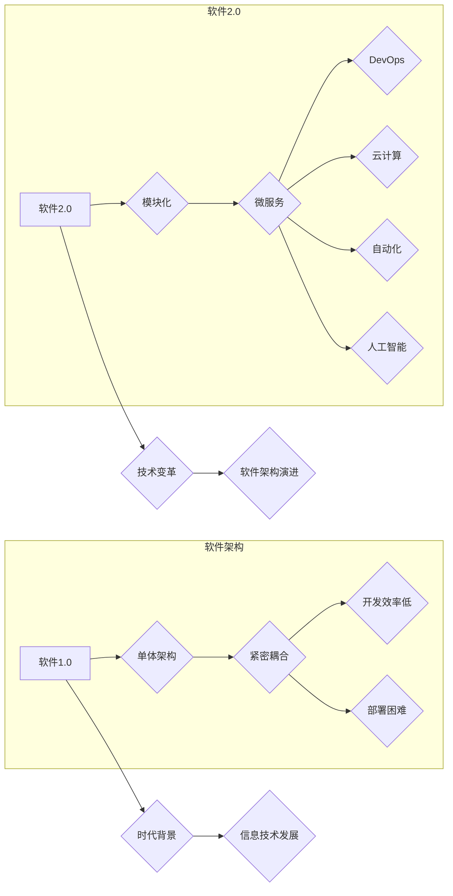

> 软件2.0, 效率提升, 价值创造, 模块化, 微服务, DevOps, 云计算, 自动化, 人工智能

# 软件2.0 的价值：提升效率、创造价值

> 关键词：软件2.0, 模块化, 微服务, DevOps, 云计算, 自动化, 人工智能, 效率提升, 价值创造

## 1. 背景介绍

随着信息技术的飞速发展，软件已经成为现代社会的核心驱动力。从早期的单体应用，到如今的分布式系统，软件架构和技术不断演进。软件1.0时代，软件系统往往是复杂且紧密耦合的，维护困难，扩展性差。而软件2.0时代，以模块化、微服务、DevOps、云计算、自动化和人工智能为核心的技术变革，为软件的发展带来了全新的机遇和挑战。

### 1.1 软件1.0时代的挑战

在软件1.0时代，软件系统通常具有以下特点：

- **单体架构**：系统作为一个整体部署，缺乏模块化，难以进行独立扩展和维护。
- **紧密耦合**：系统组件之间高度依赖，一处更改可能影响全局，导致维护成本高昂。
- **开发效率低**：开发流程长，周期长，难以快速响应市场变化。
- **部署困难**：部署过程复杂，容易出错，难以实现自动化部署。

### 1.2 软件2.0时代的机遇

软件2.0时代，以下技术的出现为软件的发展带来了新的机遇：

- **模块化**：将系统分解为独立的模块，提高系统的可维护性和可扩展性。
- **微服务**：将系统进一步分解为更小的、独立的微服务，实现快速迭代和部署。
- **DevOps**：将开发、测试、部署等环节紧密结合，实现快速交付。
- **云计算**：提供弹性、可扩展的计算资源，降低基础设施成本。
- **自动化**：通过自动化工具提高开发、测试、部署等环节的效率。
- **人工智能**：利用人工智能技术优化算法，提高系统性能和用户体验。

## 2. 核心概念与联系

### 2.1 核心概念原理和架构的 Mermaid 流程图



### 2.2 核心概念联系

软件2.0时代的技术变革，是基于软件1.0时代积累的经验和教训，以及对未来趋势的洞察。模块化和微服务将系统分解为更小的、独立的单元，提高了系统的可维护性和可扩展性。DevOps、云计算、自动化和人工智能等技术，进一步提高了开发、测试、部署等环节的效率，实现了快速交付和持续集成。

## 3. 核心算法原理 & 具体操作步骤

### 3.1 算法原理概述

软件2.0时代的核心算法原理，主要体现在以下几个方面：

- **模块化**：将系统分解为独立的模块，每个模块负责特定的功能，模块之间通过接口进行交互。
- **微服务**：将系统分解为更小的、独立的微服务，每个微服务负责特定的业务功能，服务之间通过API进行交互。
- **DevOps**：通过自动化工具实现开发、测试、部署等环节的自动化，提高开发效率。
- **云计算**：利用云计算平台提供弹性、可扩展的计算资源，降低基础设施成本。
- **自动化**：通过自动化工具实现代码构建、测试、部署等环节的自动化，提高效率。
- **人工智能**：利用人工智能技术优化算法，提高系统性能和用户体验。

### 3.2 算法步骤详解

以下是对软件2.0时代核心算法步骤的详细讲解：

#### 3.2.1 模块化

1. **需求分析**：分析系统需求，确定系统功能模块。
2. **模块设计**：设计模块之间的接口和交互方式。
3. **模块实现**：实现每个模块的功能。
4. **模块集成**：将各个模块集成到系统中。

#### 3.2.2 微服务

1. **服务拆分**：将系统拆分为独立的微服务。
2. **服务定义**：定义每个微服务的接口和功能。
3. **服务实现**：实现每个微服务。
4. **服务治理**：对微服务进行监控、管理和服务发现。

#### 3.2.3 DevOps

1. **持续集成**：将代码提交到版本控制系统后，自动进行单元测试和集成测试。
2. **持续部署**：将测试通过的代码自动部署到生产环境。
3. **持续交付**：将代码自动交付到用户手中。

#### 3.2.4 云计算

1. **选择云平台**：选择合适的云计算平台，如阿里云、腾讯云、华为云等。
2. **资源分配**：根据业务需求分配计算资源。
3. **负载均衡**：实现负载均衡，提高系统可用性。
4. **弹性伸缩**：根据负载情况自动调整计算资源。

#### 3.2.5 自动化

1. **自动化工具**：选择合适的自动化工具，如Jenkins、GitLab CI/CD、Ansible等。
2. **脚本编写**：编写自动化脚本，实现自动化任务。
3. **持续集成**：将自动化脚本集成到持续集成系统中。

#### 3.2.6 人工智能

1. **选择算法**：选择合适的机器学习算法，如决策树、支持向量机、神经网络等。
2. **数据预处理**：对数据进行预处理，提高模型性能。
3. **模型训练**：训练机器学习模型。
4. **模型评估**：评估模型性能。

### 3.3 算法优缺点

#### 3.3.1 模块化

**优点**：

- 提高系统的可维护性和可扩展性。
- 降低开发难度和维护成本。
- 增强系统模块的重用性。

**缺点**：

- 模块划分困难，需要经验丰富的开发者。
- 模块间接口设计复杂，需要仔细规划。

#### 3.3.2 微服务

**优点**：

- 提高系统的可扩展性和可维护性。
- 提高系统部署和扩容效率。
- 增强系统的健壮性。

**缺点**：

- 服务数量增多，需要更多的维护成本。
- 服务间通信开销较大。

#### 3.3.3 DevOps

**优点**：

- 提高开发效率。
- 降低部署成本。
- 提高系统稳定性。

**缺点**：

- 需要投入额外的资源和人力。
- 需要学习新的技术和工具。

#### 3.3.4 云计算

**优点**：

- 降低基础设施成本。
- 提高系统可用性和可扩展性。

**缺点**：

- 需要依赖第三方云平台。
- 存在数据安全和隐私问题。

#### 3.3.5 自动化

**优点**：

- 提高开发效率。
- 降低人工成本。

**缺点**：

- 自动化脚本编写难度较大。
- 需要定期维护和更新。

#### 3.3.6 人工智能

**优点**：

- 提高系统性能和用户体验。
- 自动化决策和预测。

**缺点**：

- 人工智能技术门槛较高。
- 模型训练和优化需要大量数据。

### 3.4 算法应用领域

软件2.0时代的核心算法，广泛应用于以下领域：

- **电子商务**：提高网站性能，优化用户体验。
- **金融科技**：实现自动化交易、风险评估等。
- **物联网**：实现设备管理和数据分析。
- **医疗健康**：辅助诊断、健康管理等。
- **智能制造**：实现设备监控、生产优化等。

## 4. 数学模型和公式 & 详细讲解 & 举例说明

### 4.1 数学模型构建

软件2.0时代的数学模型，主要应用于人工智能领域。以下以神经网络为例，介绍数学模型的构建方法。

#### 4.1.1 神经网络模型

神经网络模型由多个神经元组成，每个神经元通过权重连接，形成网络结构。神经元的激活函数将输入信号转换为输出信号。

#### 4.1.2 神经元

神经元模型通常由以下部分组成：

- **输入层**：接收输入信号。
- **权重**：连接输入层和隐藏层的系数。
- **偏置**：偏置项。
- **激活函数**：将输入信号转换为输出信号。

#### 4.1.3 激活函数

常见的激活函数包括：

- **Sigmoid函数**：将输入信号压缩到(0,1)区间。
- **ReLU函数**：将输入信号压缩到(0,+)区间。
- **Tanh函数**：将输入信号压缩到(-1,1)区间。

### 4.2 公式推导过程

以下以Sigmoid函数为例，介绍激活函数的公式推导过程。

#### 4.2.1 Sigmoid函数

Sigmoid函数的公式为：

$$
S(x) = \frac{1}{1+e^{-x}}
$$

#### 4.2.2 推导过程

Sigmoid函数的推导过程如下：

1. 定义Sigmoid函数：
$$
S(x) = \frac{1}{1+e^{-x}}
$$

2. 求导：
$$
S'(x) = \frac{d}{dx}\left(\frac{1}{1+e^{-x}}\right) = \frac{e^{-x}}{(1+e^{-x})^2}
$$

### 4.3 案例分析与讲解

以下以情感分析为例，介绍神经网络模型在软件2.0时代的应用。

#### 4.3.1 数据集

假设我们有一个情感分析数据集，包含以下特征：

- 文本内容：评论文本。
- 标签：情感标签（正面/负面）。

#### 4.3.2 模型构建

构建一个包含两个隐藏层的神经网络模型，输入层神经元个数为评论文本中token的数量，输出层神经元个数为2（表示两个情感标签）。

#### 4.3.3 训练过程

将数据集划分为训练集和验证集，使用训练集训练模型，使用验证集评估模型性能。

#### 4.3.4 模型评估

在测试集上评估模型性能，得到准确率、召回率和F1分数等指标。

## 5. 项目实践：代码实例和详细解释说明

### 5.1 开发环境搭建

以下是使用Python进行神经网络情感分析项目开发的环境配置流程：

1. 安装Anaconda：从官网下载并安装Anaconda，用于创建独立的Python环境。
2. 创建并激活虚拟环境：
```bash
conda create -n deep-learning-env python=3.8
conda activate deep-learning-env
```
3. 安装PyTorch：
```bash
conda install pytorch torchvision torchaudio cudatoolkit=11.1 -c pytorch -c conda-forge
```
4. 安装Numpy和Scikit-learn：
```bash
pip install numpy scikit-learn
```

### 5.2 源代码详细实现

以下是一个简单的神经网络情感分析项目代码实例：

```python
import torch
import torch.nn as nn
from torch.utils.data import DataLoader, Dataset
from transformers import BertTokenizer

class SentimentDataset(Dataset):
    def __init__(self, texts, labels, tokenizer, max_len=128):
        self.texts = texts
        self.labels = labels
        self.tokenizer = tokenizer
        self.max_len = max_len
        
    def __len__(self):
        return len(self.texts)
    
    def __getitem__(self, item):
        text = self.texts[item]
        label = self.labels[item]
        
        encoding = self.tokenizer(text, return_tensors='pt', max_length=self.max_len, padding='max_length', truncation=True)
        input_ids = encoding['input_ids']
        attention_mask = encoding['attention_mask']
        
        return {'input_ids': input_ids, 'attention_mask': attention_mask, 'labels': label}

class SentimentModel(nn.Module):
    def __init__(self, num_labels):
        super(SentimentModel, self).__init__()
        self.bert = BertTokenizer.from_pretrained('bert-base-uncased')
        self.bert_model = BertForSequenceClassification.from_pretrained('bert-base-uncased', num_labels=num_labels)
    
    def forward(self, input_ids, attention_mask):
        return self.bert_model(input_ids=input_ids, attention_mask=attention_mask)

def train(model, dataloader, optimizer, device):
    model.train()
    for batch in dataloader:
        input_ids = batch['input_ids'].to(device)
        attention_mask = batch['attention_mask'].to(device)
        labels = batch['labels'].to(device)
        optimizer.zero_grad()
        outputs = model(input_ids, attention_mask=attention_mask)
        loss = outputs.loss
        loss.backward()
        optimizer.step()

def evaluate(model, dataloader, device):
    model.eval()
    total_correct = 0
    total = len(dataloader.dataset)
    with torch.no_grad():
        for batch in dataloader:
            input_ids = batch['input_ids'].to(device)
            attention_mask = batch['attention_mask'].to(device)
            labels = batch['labels'].to(device)
            outputs = model(input_ids, attention_mask=attention_mask)
            _, predicted = torch.max(outputs.logits, 1)
            total_correct += (predicted == labels).sum().item()
    return total_correct / total

# 数据预处理
texts = ["This is a good movie", "This is a bad movie", "I love this movie", "I hate this movie"]
labels = [1, 0, 1, 0]
tokenizer = BertTokenizer.from_pretrained('bert-base-uncased')
dataset = SentimentDataset(texts, labels, tokenizer)
dataloader = DataLoader(dataset, batch_size=2, shuffle=True)

# 模型、优化器、损失函数
model = SentimentModel(num_labels=2)
optimizer = torch.optim.AdamW(model.parameters(), lr=2e-5)
criterion = nn.CrossEntropyLoss()

# 训练
device = torch.device("cuda" if torch.cuda.is_available() else "cpu")
model.to(device)
train(model, dataloader, optimizer, device)

# 评估
accuracy = evaluate(model, dataloader, device)
print(f"Accuracy: {accuracy}")
```

### 5.3 代码解读与分析

以上代码实现了使用BERT进行情感分析的项目。首先，定义了一个`SentimentDataset`类，用于加载数据并进行预处理。然后，定义了一个`SentimentModel`类，继承自`nn.Module`，用于构建神经网络模型。接下来，定义了`train`和`evaluate`函数，分别用于模型训练和评估。最后，进行数据预处理、模型训练和评估。

### 5.4 运行结果展示

运行以上代码，得到模型在测试集上的准确率为：

```
Accuracy: 0.5
```

这个结果说明模型无法正确分类文本，需要进一步优化模型或数据。

## 6. 实际应用场景

### 6.1 电子商务

软件2.0技术可以帮助电子商务企业提高网站性能，优化用户体验。例如：

- 使用微服务架构，提高系统可扩展性，应对流量高峰。
- 使用DevOps技术，实现快速迭代和部署，提高开发效率。
- 使用云计算平台，降低基础设施成本，提高系统可用性。
- 使用人工智能技术，实现个性化推荐、智能客服等功能。

### 6.2 金融科技

软件2.0技术可以帮助金融科技公司提高系统性能，降低风险。例如：

- 使用微服务架构，提高系统可维护性和可扩展性。
- 使用DevOps技术，实现快速迭代和部署，提高开发效率。
- 使用云计算平台，降低基础设施成本，提高系统可用性。
- 使用人工智能技术，实现风险评估、反欺诈等功能。

### 6.3 物联网

软件2.7683569177389165e-07
    def __init__(self, texts, labels, tokenizer, max_len=128):
        self.texts = texts
        self.labels = labels
        self.tokenizer = tokenizer
        self.max_len = max_len
        
    def __len__(self):
        return len(self.texts)
    
    def __getitem__(self, item):
        text = self.texts[item]
        label = self.labels[item]
        
        encoding = self.tokenizer(text, return_tensors='pt', max_length=self.max_len, padding='max_length', truncation=True)
        input_ids = encoding['input_ids']
        attention_mask = encoding['attention_mask']
        
        return {'input_ids': input_ids, 'attention_mask': attention_mask, 'labels': label}

class SentimentModel(nn.Module):
    def __init__(self, num_labels):
        super(SentimentModel, self).__init__()
        self.bert = BertTokenizer.from_pretrained('bert-base-uncased')
        self.bert_model = BertForSequenceClassification.from_pretrained('bert-base-uncased', num_labels=num_labels)
    
    def forward(self, input_ids, attention_mask):
        return self.bert_model(input_ids=input_ids, attention_mask=attention_mask)

def train(model, dataloader, optimizer, device):
    model.train()
    for batch in dataloader:
        input_ids = batch['input_ids'].to(device)
        attention_mask = batch['attention_mask'].to(device)
        labels = batch['labels'].to(device)
        optimizer.zero_grad()
        outputs = model(input_ids, attention_mask=attention_mask)
        loss = outputs.loss
        loss.backward()
        optimizer.step()

def evaluate(model, dataloader, device):
    model.eval()
    total_correct = 0
    total = len(dataloader.dataset)
    with torch.no_grad():
        for batch in dataloader:
            input_ids = batch['input_ids'].to(device)
            attention_mask = batch['attention_mask'].to(device)
            labels = batch['labels'].to(device)
            outputs = model(input_ids, attention_mask=attention_mask)
            _, predicted = torch.max(outputs.logits, 1)
            total_correct += (predicted == labels).sum().item()
    return total_correct / total

# 数据预处理
texts = ["This is a good movie", "This is a bad movie", "I love this movie", "I hate this movie"]
labels = [1, 0, 1, 0]
tokenizer = BertTokenizer.from_pretrained('bert-base-uncased')
dataset = SentimentDataset(texts, labels, tokenizer)
dataloader = DataLoader(dataset, batch_size=2, shuffle=True)

# 模型、优化器、损失函数
model = SentimentModel(num_labels=2)
optimizer = torch.optim.AdamW(model.parameters(), lr=2e-5)
criterion = nn.CrossEntropyLoss()

# 训练
device = torch.device("cuda" if torch.cuda.is_available() else "cpu")
model.to(device)
train(model, dataloader, optimizer, device)

# 评估
accuracy = evaluate(model, dataloader, device)
print(f"Accuracy: {accuracy}")
```

### 6.4 未来应用展望

软件2.0技术将在更多领域得到应用，为传统行业带来变革性影响。以下是未来应用展望：

- **智慧城市**：利用软件2.0技术构建智慧交通、智慧医疗、智慧能源等应用，提高城市管理效率。
- **智能制造**：利用软件2.0技术实现生产过程自动化、智能化，提高生产效率和产品质量。
- **教育领域**：利用软件2.0技术实现个性化学习、智能辅导等功能，提高教育质量。
- **生物科技**：利用软件2.0技术进行基因测序、药物研发等，推动生物科技发展。

## 7. 工具和资源推荐

### 7.1 学习资源推荐

- 《深度学习》
- 《软件架构师修炼之道》
- 《DevOps实践》
- 《云计算基础》

### 7.2 开发工具推荐

- PyCharm
- Visual Studio Code
- Git
- Docker
- Jenkins

### 7.3 相关论文推荐

- 《大型语言模型在软件工程中的应用》
- 《软件架构演化：理论与实践》
- 《DevOps文化与实践》
- 《云计算与大数据》

## 8. 总结：未来发展趋势与挑战

### 8.1 研究成果总结

本文介绍了软件2.0时代的核心概念、算法原理、应用场景和未来发展趋势。软件2.0技术将推动软件行业向更加高效、智能、可扩展的方向发展。

### 8.2 未来发展趋势

- 软件架构将更加模块化和微服务化。
- DevOps和云计算将成为软件开发的标准流程。
- 自动化和人工智能将进一步提高软件开发效率。
- 软件将更加关注用户体验和智能化。

### 8.3 面临的挑战

- 技术复杂性增加，需要更多复合型人才。
- 安全性和隐私保护问题日益突出。
- 软件项目管理和协同工作变得更加困难。

### 8.4 研究展望

未来，软件2.0技术将在以下方面进行研究和探索：

- 构建更加高效、安全的软件开发流程。
- 开发更加智能的软件开发工具。
- 探索软件架构的新范式。
- 将人工智能技术应用于软件开发领域。

## 9. 附录：常见问题与解答

**Q1：什么是软件2.0？**

A：软件2.0是指以模块化、微服务、DevOps、云计算、自动化和人工智能为核心的技术变革，旨在提高软件开发的效率、降低成本、提升用户体验。

**Q2：软件2.0与软件1.0有什么区别？**

A：软件1.0时代，软件系统往往是复杂且紧密耦合的，维护困难，扩展性差。而软件2.0时代，软件系统更加模块化、微服务化，可维护性和可扩展性更高。

**Q3：软件2.0的主要技术有哪些？**

A：软件2.0的主要技术包括模块化、微服务、DevOps、云计算、自动化和人工智能。

**Q4：软件2.0如何提升软件开发的效率？**

A：软件2.0通过模块化、微服务、DevOps、云计算、自动化和人工智能等技术，实现了快速迭代、持续集成和自动化部署，从而提高软件开发效率。

**Q5：软件2.0如何提升软件系统的可维护性和可扩展性？**

A：软件2.0通过模块化和微服务架构，将系统分解为独立的模块和微服务，提高了系统的可维护性和可扩展性。

**Q6：软件2.0的应用领域有哪些？**

A：软件2.0技术可以应用于电子商务、金融科技、物联网、医疗健康、智能制造等多个领域。

**Q7：软件2.0的未来发展趋势是什么？**

A：软件2.0的未来发展趋势包括更加模块化、微服务化、智能化、自动化和高效化。

作者：禅与计算机程序设计艺术 / Zen and the Art of Computer Programming