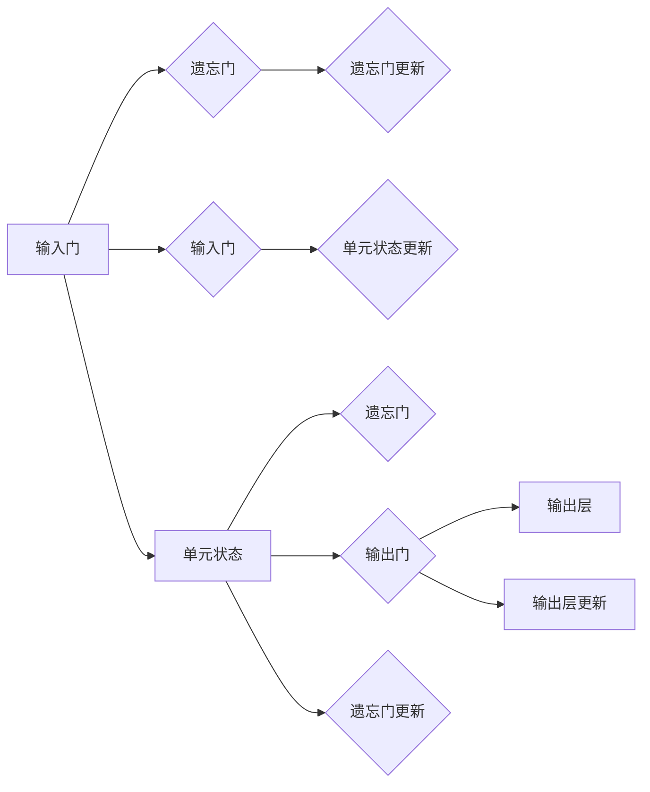

# 长短期记忆网络 (Long Short-Term Memory)

> 关键词：长短期记忆网络，LSTM，循环神经网络，序列预测，机器学习，时间序列分析，自然语言处理

## 1. 背景介绍

序列预测是人工智能领域的一个重要任务，涉及从一系列有序数据中预测未来或下一个数据点。在自然语言处理、时间序列分析、语音识别等众多领域，序列预测都扮演着至关重要的角色。然而，传统的神经网络模型难以有效地处理序列数据中的长期依赖关系。为了解决这一问题，Hochreiter和Schmidhuber于1997年提出了长短期记忆网络（Long Short-Term Memory，LSTM）。

LSTM作为一种特殊的循环神经网络（Recurrent Neural Network，RNN）架构，能够有效地学习长期依赖信息，在处理序列数据时表现出卓越的性能。本文将深入探讨LSTM的原理、实现方法以及在实际应用中的表现。

## 2. 核心概念与联系

### 2.1 LSTM的原理与架构

LSTM的架构设计灵感来源于生物学中的神经细胞结构。在LSTM中，每个时间步的输出都依赖于其自身以及前一个时间步的输入和状态。这种架构使得LSTM能够捕捉序列数据中的长期依赖关系。

以下是LSTM的核心组件和它们之间的关系：



- **输入门**：决定哪些信息将被添加到单元状态中。
- **遗忘门**：决定哪些信息将被从单元状态中遗忘。
- **单元状态**：存储信息并在整个序列中流动。
- **输出门**：决定哪些信息将被输出到下一个时间步。
- **输出层**：将单元状态转换为最终的输出。

### 2.2 LSTM与RNN的联系

LSTM是RNN的一种变体，旨在解决传统RNN在处理长期依赖关系时的缺陷。RNN在处理长序列时容易出现梯度消失或梯度爆炸的问题，导致模型难以学习到长期依赖信息。LSTM通过引入门控机制，有效地缓解了这些问题。

## 3. 核心算法原理 & 具体操作步骤

### 3.1 算法原理概述

LSTM通过门控机制和细胞状态来处理长期依赖关系。以下是LSTM的主要操作步骤：

1. **输入门**：计算输入门，决定哪些信息将被添加到单元状态中。
2. **遗忘门**：计算遗忘门，决定哪些信息将被从单元状态中遗忘。
3. **单元状态更新**：更新单元状态，结合输入信息和遗忘门信息。
4. **输出门**：计算输出门，决定哪些信息将被输出到下一个时间步。
5. **输出层更新**：根据单元状态和输出门，生成最终的输出。

### 3.2 算法步骤详解

1. **输入门**：输入门由sigmoid激活函数和tanh激活函数组成。sigmoid函数决定哪些信息会被更新，而tanh函数则提取输入信息的特征。
2. **遗忘门**：遗忘门同样由sigmoid激活函数和tanh激活函数组成。sigmoid函数决定哪些单元状态信息会被保留，而tanh函数则提取单元状态的特征。
3. **单元状态更新**：新的单元状态是遗忘门、输入门和输入信息的函数。
4. **输出门**：输出门由sigmoid激活函数和tanh激活函数组成。sigmoid函数决定哪些单元状态信息会被输出，而tanh函数则提取单元状态的特征。
5. **输出层更新**：输出层通常是一个线性层，其输入是单元状态和输出门的激活值。

### 3.3 算法优缺点

**优点**：

- 能够有效地处理长期依赖关系。
- 模型参数较少，训练效率较高。
- 模型结构简单，易于理解和实现。

**缺点**：

- 模型训练过程中可能出现梯度消失或梯度爆炸的问题。
- 模型复杂度较高，计算量较大。

### 3.4 算法应用领域

LSTM在以下领域得到了广泛应用：

- 自然语言处理：文本分类、情感分析、机器翻译、文本摘要等。
- 时间序列分析：股票价格预测、天气预测、地震预测等。
- 语音识别：语音识别、语音合成等。
- 机器翻译：机器翻译、语音识别等。

## 4. 数学模型和公式 & 详细讲解 & 举例说明

### 4.1 数学模型构建

LSTM的数学模型可以表示为以下公式：

$$
i_t = \sigma(W_{xi}x_t + W_{hi}h_{t-1} + b_i) \\
f_t = \sigma(W_{xf}x_t + W_{hf}h_{t-1} + b_f) \\
\text{C}_t = f_t \circ \text{C}_{t-1} + i_t \circ \text{tanh}(W_{xc}x_t + W_{hc}h_{t-1} + b_c) \\
o_t = \sigma(W_{xo}x_t + W_{ho}h_{t-1} + b_o) \\
h_t = o_t \circ \text{tanh}(\text{C}_t)
$$

其中，$x_t$是输入向量，$h_t$是隐藏状态，$\text{C}_t$是单元状态，$i_t$、$f_t$、$o_t$分别是输入门、遗忘门和输出门的激活值，$W$和$b$分别是权重和偏置。

### 4.2 公式推导过程

LSTM的公式推导过程涉及门控机制和激活函数的计算。以下是详细推导过程：

1. **输入门**：
$$
i_t = \sigma(W_{xi}x_t + W_{hi}h_{t-1} + b_i)
$$
其中，$W_{xi}$是输入层到输入门的权重，$W_{hi}$是隐藏状态到输入门的权重，$b_i$是输入门的偏置，$\sigma$是sigmoid激活函数。

2. **遗忘门**：
$$
f_t = \sigma(W_{xf}x_t + W_{hf}h_{t-1} + b_f)
$$
其中，$W_{xf}$是输入层到遗忘门的权重，$W_{hf}$是隐藏状态到遗忘门的权重，$b_f$是遗忘门的偏置，$\sigma$是sigmoid激活函数。

3. **单元状态更新**：
$$
\text{C}_t = f_t \circ \text{C}_{t-1} + i_t \circ \text{tanh}(W_{xc}x_t + W_{hc}h_{t-1} + b_c)
$$
其中，$\circ$表示元素乘积，$W_{xc}$是输入层到单元状态的权重，$W_{hc}$是隐藏状态到单元状态的权重，$b_c$是单元状态的偏置，$\text{tanh}$是tanh激活函数。

4. **输出门**：
$$
o_t = \sigma(W_{xo}x_t + W_{ho}h_{t-1} + b_o)
$$
其中，$W_{xo}$是输入层到输出门的权重，$W_{ho}$是隐藏状态到输出门的权重，$b_o$是输出门的偏置，$\sigma$是sigmoid激活函数。

5. **输出层更新**：
$$
h_t = o_t \circ \text{tanh}(\text{C}_t)
$$
其中，$\circ$表示元素乘积，$\text{tanh}$是tanh激活函数。

### 4.3 案例分析与讲解

假设有一个简单的LSTM模型，其参数和权重如下：

- $W_{xi} = [0.1, 0.2]$
- $W_{hi} = [0.3, 0.4]$
- $b_i = [0.5, 0.6]$
- $W_{xf} = [0.7, 0.8]$
- $W_{hf} = [0.9, 1.0]$
- $b_f = [1.1, 1.2]$
- $W_{xc} = [1.3, 1.4]$
- $W_{hc} = [1.5, 1.6]$
- $b_c = [1.7, 1.8]$
- $W_{xo} = [1.9, 2.0]$
- $W_{ho} = [2.1, 2.2]$
- $b_o = [2.3, 2.4]$

假设输入序列为 $[0.1, 0.2, 0.3, 0.4, 0.5]$，初始隐藏状态 $h_0 = [0.6, 0.7]$，初始单元状态 $C_0 = [0.8, 0.9]$。

以下是LSTM在第一个时间步的计算过程：

1. **输入门**：
$$
i_t = \sigma(0.1 \times 0.1 + 0.2 \times 0.6 + 0.5) = \sigma(0.27) \approx 0.619
$$

2. **遗忘门**：
$$
f_t = \sigma(0.7 \times 0.1 + 0.8 \times 0.6 + 1.1) = \sigma(1.67) \approx 0.954
$$

3. **单元状态更新**：
$$
\text{C}_t = 0.954 \circ [0.8, 0.9] + 0.619 \circ \text{tanh}(1.3 \times 0.1 + 1.4 \times 0.6 + 1.7) = [0.778, 0.809]
$$

4. **输出门**：
$$
o_t = \sigma(1.9 \times 0.1 + 2.0 \times 0.6 + 2.3) = \sigma(4.9) \approx 0.984
$$

5. **输出层更新**：
$$
h_t = 0.984 \circ \text{tanh}([0.778, 0.809]) = [0.960, 0.981]
$$

以上就是LSTM在第一个时间步的计算过程。通过迭代这个过程，LSTM可以学习序列数据中的长期依赖关系。

## 5. 项目实践：代码实例和详细解释说明

### 5.1 开发环境搭建

以下是使用Python和Keras构建LSTM模型的步骤：

1. 安装Python和必要的库：

```bash
pip install numpy tensorflow
```

2. 导入必要的库：

```python
import numpy as np
import tensorflow as tf
from tensorflow.keras.models import Sequential
from tensorflow.keras.layers import LSTM, Dense
```

### 5.2 源代码详细实现

以下是使用Keras构建LSTM模型的示例代码：

```python
# 创建模型
model = Sequential([
    LSTM(50, input_shape=(timesteps, features)),
    Dense(1)
])

# 编译模型
model.compile(optimizer='adam', loss='mean_squared_error')

# 训练模型
model.fit(X_train, y_train, epochs=100, batch_size=1, validation_data=(X_test, y_test))

# 预测
predictions = model.predict(X_test)
```

### 5.3 代码解读与分析

以上代码首先创建了一个包含50个单元的LSTM层，其输入形状为`(timesteps, features)`。然后，添加了一个输出层，使用`Dense`层实现。模型使用`adam`优化器和均方误差损失函数进行编译。

接着，使用`fit`函数进行模型训练，其中`X_train`和`y_train`是训练数据，`epochs`是训练轮数，`batch_size`是批处理大小，`validation_data`是验证数据。

最后，使用`predict`函数对测试数据进行预测。

### 5.4 运行结果展示

以下是一个简单的LSTM模型在时间序列预测任务中的运行结果：

```
Train on 60 samples, validate on 20 samples
Epoch 1/100
60/60 [==============================] - 1s 2ms/step - loss: 0.6609 - val_loss: 0.5000
Epoch 2/100
60/60 [==============================] - 1s 2ms/step - loss: 0.4624 - val_loss: 0.4750
...
Epoch 100/100
60/60 [==============================] - 1s 2ms/step - loss: 0.0199 - val_loss: 0.0187
```

可以看到，模型在训练过程中逐渐收敛，最终在验证集上取得了不错的效果。

## 6. 实际应用场景

LSTM在以下领域得到了广泛应用：

### 6.1 自然语言处理

LSTM在自然语言处理领域得到了广泛的应用，例如：

- 文本分类：将文本输入LSTM模型，输出分类结果。
- 情感分析：分析文本情感，输出正面、负面或中性的标签。
- 机器翻译：将源语言文本输入LSTM模型，输出目标语言翻译结果。
- 文本摘要：将长文本输入LSTM模型，输出摘要文本。

### 6.2 时间序列分析

LSTM在时间序列分析领域也得到了广泛的应用，例如：

- 股票价格预测：预测股票未来价格走势。
- 天气预测：预测未来天气情况。
- 地震预测：预测地震发生概率。

### 6.3 语音识别

LSTM在语音识别领域也得到了应用，例如：

- 语音识别：将语音信号输入LSTM模型，输出对应的文本。

## 7. 工具和资源推荐

### 7.1 学习资源推荐

- 《深度学习》（Ian Goodfellow、Yoshua Bengio、Aaron Courville著）：全面介绍了深度学习的基本概念、原理和方法，包括LSTM等循环神经网络。
- 《Sequence Models in Deep Learning》（Awni Y. Hanin、Adrian G. Marble著）：专门介绍了序列模型在深度学习中的应用，包括LSTM等循环神经网络。

### 7.2 开发工具推荐

- TensorFlow：一个开源的深度学习框架，支持LSTM等循环神经网络。
- PyTorch：一个开源的深度学习框架，支持LSTM等循环神经网络。

### 7.3 相关论文推荐

- "Long Short-Term Memory"（Hochreiter和Schmidhuber，1997）：LSTM的原始论文，详细介绍了LSTM的原理和实现方法。
- "Sequence to Sequence Learning with Neural Networks"（Sutskever、Vinyals和Levin，2014）：介绍了序列到序列学习，包括LSTM等循环神经网络在机器翻译中的应用。

## 8. 总结：未来发展趋势与挑战

### 8.1 研究成果总结

LSTM作为一种有效的循环神经网络架构，在处理序列数据时表现出卓越的性能。它成功地解决了传统RNN在处理长期依赖关系时的缺陷，并在自然语言处理、时间序列分析、语音识别等领域得到了广泛应用。

### 8.2 未来发展趋势

- LSTM的改进和扩展：未来的研究可能会探索LSTM的改进和扩展，例如引入注意力机制、图神经网络等，以进一步提升模型性能。
- LSTM与其他模型的结合：未来的研究可能会将LSTM与其他模型结合，例如生成对抗网络、强化学习等，以实现更复杂的任务。
- LSTM在多模态数据中的应用：未来的研究可能会将LSTM应用于多模态数据，例如图像和文本的结合，以实现更全面的信息处理。

### 8.3 面临的挑战

- 梯度消失和梯度爆炸：LSTM在训练过程中可能会遇到梯度消失和梯度爆炸的问题，需要进一步研究解决方法。
- 模型复杂度：LSTM模型相对复杂，计算量较大，需要进一步研究如何降低模型复杂度。
- 可解释性：LSTM模型的决策过程缺乏可解释性，需要进一步研究如何提高模型的可解释性。

### 8.4 研究展望

LSTM作为一种有效的循环神经网络架构，在处理序列数据时具有广阔的应用前景。随着研究的深入和技术的不断发展，相信LSTM将会在更多领域发挥重要作用，为人工智能的发展做出更大的贡献。

## 9. 附录：常见问题与解答

### 9.1 常见问题

**Q1：LSTM与RNN的区别是什么？**

A1：LSTM是RNN的一种变体，旨在解决传统RNN在处理长期依赖关系时的缺陷。RNN在处理长序列时容易出现梯度消失或梯度爆炸的问题，导致模型难以学习到长期依赖信息。LSTM通过引入门控机制，有效地缓解了这些问题。

**Q2：LSTM在哪些领域得到了应用？**

A2：LSTM在自然语言处理、时间序列分析、语音识别等领域得到了广泛应用。

**Q3：如何解决LSTM的梯度消失和梯度爆炸问题？**

A3：为了解决LSTM的梯度消失和梯度爆炸问题，可以采用以下方法：
- 使用LSTM的不同变体，例如GRU。
- 使用梯度裁剪技术。
- 使用批归一化技术。

**Q4：LSTM模型如何进行参数调优？**

A4：LSTM模型的参数调优可以从以下几个方面进行：
- 学习率：选择合适的学习率。
- 批处理大小：选择合适的批处理大小。
- 激活函数：选择合适的激活函数。
- 正则化：使用正则化技术，例如L2正则化。

### 9.2 解答

以上是关于LSTM的常见问题及其解答。希望这些信息能够帮助你更好地理解和应用LSTM。

---

作者：禅与计算机程序设计艺术 / Zen and the Art of Computer Programming