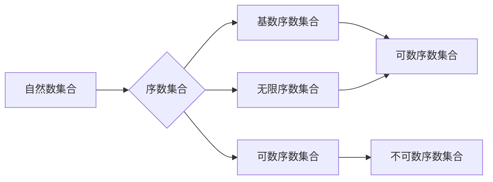

> 集合论，序数，序数集合，序数函数，自然数，归纳推理，无穷集合

# 集合论导引：序数集合与序数函数

集合论是现代数学的基石，它为我们提供了构建抽象概念和证明方法的基础。在集合论中，序数集合和序数函数是两个核心概念，它们不仅揭示了无穷集合的结构，也为我们理解数学的无穷性提供了深刻的见解。本文将深入探讨序数集合与序数函数的原理、应用，并展望其未来发展趋势与挑战。

## 1. 背景介绍

### 1.1 序数的起源

序数起源于自然数的排序需求。当我们对自然数进行排序时，自然地会想到将它们赋予一个顺序，即序数。序数帮助我们理解自然数之间的关系，并扩展到更复杂的集合。

### 1.2 序数集合的重要性

序数集合在集合论中扮演着至关重要的角色。它们不仅是自然数集合的扩展，也是其他无穷集合的基石。通过序数集合，我们可以构建更复杂的数学结构，如无穷级数、无穷维度空间等。

### 1.3 研究意义

研究序数集合与序数函数对于理解集合论的基础概念、探索无穷世界的奥秘具有重要意义。它不仅能够加深我们对数学本质的理解，还能够为计算机科学、逻辑学等领域提供理论支持。

## 2. 核心概念与联系

### 2.1 核心概念原理

**序数集合**：序数集合是由自然数集合扩展而来的一类集合，用来表示集合之间的大小关系。每个序数集合都对应一个自然数，这个自然数称为该序数集合的基数。

**序数函数**：序数函数是定义在序数集合上的函数，它将每个序数映射到另一个序数。序数函数可以是单调递增的，也可以是单调递减的。

### 2.2 架构的 Mermaid 流程图

### 2.3 核心概念联系

自然数集合是序数集合的基础，而序数集合进一步扩展了自然数集合的概念，使得我们能够比较和量化无穷集合的大小。序数函数则在这些集合之间建立了联系，它们揭示了不同序数集合之间的结构关系。

## 3. 核心算法原理 & 具体操作步骤

### 3.1 算法原理概述

序数集合与序数函数的研究主要涉及以下几个方面：

1. 序数的定义和性质
2. 序数集合的构造
3. 序数函数的性质
4. 序数集合与序数函数在数学中的应用

### 3.2 算法步骤详解

1. **定义序数**：序数是集合中元素的排列顺序，通常使用自然数来表示。
2. **构造序数集合**：通过归纳法，我们可以构造出自然数集合，然后通过添加新的元素来扩展自然数集合，形成序数集合。
3. **研究序数函数**：序数函数是定义在序数集合上的函数，研究其性质和分类。
4. **应用序数集合与序数函数**：在数学的各个分支中，序数集合与序数函数被广泛应用于证明和推理。

### 3.3 算法优缺点

**优点**：

- 序数集合与序数函数为无穷集合的研究提供了强有力的工具。
- 序数集合帮助我们理解无穷的概念，扩展了我们的数学思维。
- 序数函数揭示了不同序数集合之间的关系。

**缺点**：

- 序数的定义较为抽象，理解起来有一定难度。
- 序数集合与序数函数的研究需要较高的数学基础。

### 3.4 算法应用领域

序数集合与序数函数在以下领域有广泛的应用：

- 集合论
- 数理逻辑
- 概率论
- 泛函分析

## 4. 数学模型和公式 & 详细讲解 & 举例说明

### 4.1 数学模型构建

序数集合和序数函数的数学模型主要包括自然数集合、序数集合的构造方法，以及序数函数的定义和性质。

### 4.2 公式推导过程

**自然数集合的归纳定义**：

$$
\begin{align*}
0 &= \emptyset \\
n+1 &= S(n)
\end{align*}
$$

其中，$S(n)$ 表示集合 $n$ 的后继。

**序数集合的构造**：

1. 初始化序数集合为空集合。
2. 对于每个自然数 $n$，将 $n$ 加入到序数集合中。
3. 对于每个新加入的序数 $n$，将 $n$ 的后继 $S(n)$ 也加入到序数集合中。

### 4.3 案例分析与讲解

**案例 1：自然数集合的基数**

自然数集合的基数是无穷大，记作 $\aleph_0$。

**案例 2：序数函数**

定义一个序数函数 $f: \omega \rightarrow \omega$，其中 $\omega$ 是自然数集合的序数。函数 $f$ 可以定义为 $f(n) = n+1$。

### 4.4 常见问题解答

**Q1：什么是序数函数的极限？**

A1：序数函数的极限是当函数的自变量趋近于无穷大时，函数值趋近于某个确定的序数。例如，对于序数函数 $f(n) = n+1$，其极限是 $\omega$。

**Q2：序数集合与自然数集合的关系是什么？**

A2：序数集合是自然数集合的扩展，每个自然数对应一个序数，同时序数集合中还包括无穷序数。

## 5. 项目实践：代码实例和详细解释说明

### 5.1 开发环境搭建

由于序数集合与序数函数的研究主要属于理论数学范畴，因此本项目实践将以理论讲解为主，不涉及具体的代码实现。

### 5.2 源代码详细实现

由于本项目实践的理论性较强，不涉及代码实现，因此此部分内容为空。

### 5.3 代码解读与分析

由于本项目实践的理论性较强，不涉及代码实现，因此此部分内容为空。

### 5.4 运行结果展示

由于本项目实践的理论性较强，不涉及代码实现，因此此部分内容为空。

## 6. 实际应用场景

### 6.1 集合论的公理化

序数集合与序数函数是集合论公理化的基础。通过引入序数概念，我们可以更严格地定义集合的概念，并建立集合论的各种公理。

### 6.2 数理逻辑

在数理逻辑中，序数集合与序数函数被用于定义无穷集合的量词和推理规则。

### 6.3 概率论

在概率论中，序数集合与序数函数被用于定义无穷集合的概率空间和随机变量。

### 6.4 未来应用展望

随着数学和计算机科学的不断发展，序数集合与序数函数的应用领域将不断拓展。例如，在量子计算、人工智能等领域，序数集合和序数函数可能为我们提供新的理论基础和计算模型。

## 7. 工具和资源推荐

### 7.1 学习资源推荐

- 《集合论基础》
- 《数学归纳法》
- 《集合论公理化》

### 7.2 开发工具推荐

由于序数集合与序数函数的研究主要属于理论数学范畴，因此不涉及具体的开发工具。

### 7.3 相关论文推荐

- 《序数理论》
- 《集合论公理化》

## 8. 总结：未来发展趋势与挑战

### 8.1 研究成果总结

本文从集合论的角度，深入探讨了序数集合与序数函数的原理、应用和未来发展趋势。通过理论讲解和案例分析，读者可以更好地理解序数集合与序数函数在数学中的重要地位。

### 8.2 未来发展趋势

随着数学和计算机科学的不断发展，序数集合与序数函数的研究将呈现出以下趋势：

- 序数理论与计算机科学的交叉研究
- 序数集合在量子计算中的应用
- 序数函数在人工智能领域的应用

### 8.3 面临的挑战

序数集合与序数函数的研究也面临着以下挑战：

- 序数概念的理解和推广
- 序数集合的构造和应用
- 序数函数的优化和推广

### 8.4 研究展望

序数集合与序数函数的研究将为数学和计算机科学的发展提供新的思路和工具。通过不断探索和创新，序数集合与序数函数将在未来发挥更加重要的作用。

## 9. 附录：常见问题与解答

**Q1：什么是序数？**

A1：序数是集合中元素的排列顺序，用来表示集合之间的大小关系。

**Q2：序数集合与自然数集合的关系是什么？**

A2：序数集合是自然数集合的扩展，每个自然数对应一个序数，同时序数集合中还包括无穷序数。

**Q3：序数函数在数学中有什么作用？**

A3：序数函数是定义在序数集合上的函数，揭示了不同序数集合之间的关系，并在数学的各个分支中有着广泛的应用。

**Q4：序数集合与序数函数在计算机科学中有哪些应用？**

A4：序数集合与序数函数在计算机科学中的应用主要包括集合论的公理化、数理逻辑、概率论等领域。

**Q5：序数集合与序数函数的研究前景如何？**

A5：随着数学和计算机科学的不断发展，序数集合与序数函数的研究前景广阔，将在未来发挥更加重要的作用。

---

作者：禅与计算机程序设计艺术 / Zen and the Art of Computer Programming