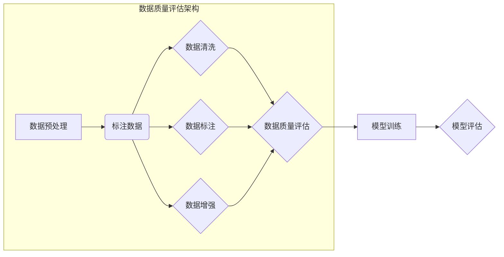

> 大语言模型, 数据质量评估, 预训练, 微调, 评估指标, 自然语言处理, 模型性能

# 大语言模型原理与工程实践：数据质量评估的挑战

随着深度学习技术在自然语言处理（NLP）领域的蓬勃发展，大语言模型（Large Language Models, LLMs）在文本生成、机器翻译、问答系统等任务上取得了显著的成果。然而，大语言模型的成功离不开高质量数据的支撑。在构建和微调大语言模型的过程中，数据质量评估成为了一个至关重要的环节。本文将深入探讨数据质量评估在LLMs中的应用，分析其挑战和解决方案。

## 1. 背景介绍

### 1.1 数据质量的重要性

数据是机器学习模型的基石，数据质量直接影响着模型的学习效果和泛化能力。对于大语言模型而言，数据质量的重要性更为突出。原因如下：

1. **模型复杂性**：大语言模型通常拥有数亿甚至数十亿的参数，对数据的依赖程度更高。
2. **数据分布差异**：大语言模型在预训练阶段通常使用海量无标注数据，而下游任务的标注数据往往规模较小，数据分布可能与预训练数据存在差异。
3. **错误数据的放大效应**：由于大语言模型的强大表达能力，即使是少量的错误数据也可能被放大，导致模型输出错误的结果。

### 1.2 数据质量评估的挑战

在进行数据质量评估时，我们面临着以下挑战：

1. **标注偏差**：标注数据可能存在主观偏差，导致模型学习到错误的规律。
2. **数据不平衡**：某些类别的数据数量较少，容易导致模型偏向于数量较多的类别。
3. **噪声数据**：数据中可能包含噪声，如拼写错误、语法错误等，影响模型的学习效果。
4. **数据缺失**：某些样本可能存在缺失值，需要处理方法以保证模型的鲁棒性。

## 2. 核心概念与联系

### 2.1 数据质量评估的核心概念

- **标注偏差**：指标注者在标注过程中存在的主观偏好，导致标注数据与真实情况存在差异。
- **数据不平衡**：指不同类别数据数量不均，容易导致模型偏向于数量较多的类别。
- **噪声数据**：指包含错误、异常或无关信息的样本。
- **数据缺失**：指某些样本缺失部分或全部数据。

### 2.2 数据质量评估的架构



在上图中，数据预处理、数据清洗、数据标注、数据增强等步骤构成了数据质量评估的核心流程。通过这些步骤，我们可以提高数据质量，为模型训练提供更可靠的数据基础。

## 3. 核心算法原理 & 具体操作步骤

### 3.1 算法原理概述

数据质量评估通常包括以下步骤：

1. **数据预处理**：包括文本清洗、去除噪声、去除停用词等操作，以提高数据质量。
2. **数据标注**：由标注者对样本进行标注，标注结果用于后续的模型训练和评估。
3. **数据清洗**：包括去除重复数据、去除缺失数据等操作，以提高数据的一致性。
4. **数据增强**：通过技术手段增加数据量，如数据扩展、数据合成等，以提高模型的泛化能力。
5. **数据质量评估**：通过指标计算、可视化等方法评估数据质量，如准确率、召回率、F1值等。

### 3.2 算法步骤详解

1. **数据预处理**：
   - 清洗文本数据：去除无关字符、停用词等。
   - 去除噪声：去除包含错误、异常或无关信息的样本。

2. **数据标注**：
   - 根据任务类型选择合适的标注方法，如人工标注、半自动标注等。
   - 确保标注的一致性和准确性。

3. **数据清洗**：
   - 去除重复数据：去除内容相同的样本。
   - 去除缺失数据：对于缺失部分数据的样本，可以选择填充、删除等策略。

4. **数据增强**：
   - 数据扩展：通过技术手段增加数据量，如数据回译、同义词替换等。
   - 数据合成：生成新的数据样本，如句子拼接、段落生成等。

5. **数据质量评估**：
   - 计算评估指标：如准确率、召回率、F1值等。
   - 可视化数据分布：如数据分布图、样本分布图等。

### 3.3 算法优缺点

**优点**：

- 提高数据质量，为模型训练提供可靠的数据基础。
- 降低模型训练成本，提高模型泛化能力。
- 提升模型性能，减少错误率。

**缺点**：

- 数据预处理、数据标注等步骤需要大量人力和时间。
- 数据增强方法可能引入新的偏差。
- 评估指标可能存在误导性。

### 3.4 算法应用领域

数据质量评估在以下领域具有广泛的应用：

- 自然语言处理：文本分类、情感分析、命名实体识别等。
- 计算机视觉：图像分类、目标检测、语义分割等。
- 语音识别：语音分类、说话人识别、语音合成等。

## 4. 数学模型和公式 & 详细讲解 & 举例说明

### 4.1 数学模型构建

数据质量评估的数学模型通常包括以下指标：

- **准确率**：准确率是指模型预测正确的样本数量与总样本数量的比例。
  $$
  \text{准确率} = \frac{\text{正确样本数量}}{\text{总样本数量}}
  $$

- **召回率**：召回率是指模型预测正确的样本数量与真实样本数量的比例。
  $$
  \text{召回率} = \frac{\text{正确样本数量}}{\text{真实样本数量}}
  $$

- **F1值**：F1值是准确率和召回率的调和平均值，用于平衡两者之间的关系。
  $$
  \text{F1值} = 2 \times \frac{\text{准确率} \times \text{召回率}}{\text{准确率} + \text{召回率}}
  $$

### 4.2 公式推导过程

以上公式的推导过程如下：

- 准确率：正确样本数量与总样本数量的比例，即：
  $$
  \text{准确率} = \frac{\text{正确样本数量}}{\text{总样本数量}} = \frac{\text{TP}}{\text{TP} + \text{FN} + \text{FP}}
  $$
- 召回率：正确样本数量与真实样本数量的比例，即：
  $$
  \text{召回率} = \frac{\text{正确样本数量}}{\text{真实样本数量}} = \frac{\text{TP}}{\text{TP} + \text{FN}}
  $$
- F1值：准确率和召回率的调和平均值，即：
  $$
  \text{F1值} = 2 \times \frac{\text{准确率} \times \text{召回率}}{\text{准确率} + \text{召回率}} = 2 \times \frac{\frac{\text{TP}}{\text{TP} + \text{FN} + \text{FP}} \times \frac{\text{TP}}{\text{TP} + \text{FN}}}{\frac{\text{TP}}{\text{TP} + \text{FN} + \text{FP}} + \frac{\text{TP}}{\text{TP} + \text{FN}}}
  $$

### 4.3 案例分析与讲解

以下是一个简单的文本分类任务的数据质量评估案例：

假设我们有100个样本，其中60个属于类别A，40个属于类别B。使用一个简单的分类器对样本进行分类，得到以下结果：

- 准确率：$\frac{80}{100} = 0.8$，即80%的样本被正确分类。
- 召回率：$\frac{60}{60} = 1.0$，即所有类别A的样本都被正确分类。
- F1值：$\frac{2 \times 0.8 \times 1.0}{0.8 + 1.0} = 0.8$，即F1值为0.8。

从这个案例可以看出，虽然该分类器具有较高的准确率，但召回率较低，说明模型对类别A的样本分类效果较好，而对类别B的样本分类效果较差。

## 5. 项目实践：代码实例和详细解释说明

### 5.1 开发环境搭建

在进行数据质量评估项目实践前，需要搭建以下开发环境：

1. Python 3.8及以上版本
2. PyTorch 1.8及以上版本
3. Scikit-learn 0.24及以上版本

### 5.2 源代码详细实现

以下是一个简单的文本分类任务的数据质量评估代码实例：

```python
from sklearn.model_selection import train_test_split
from sklearn.metrics import accuracy_score, recall_score, f1_score
import pandas as pd

# 加载数据集
data = pd.read_csv('data.csv')
X = data['text']
y = data['label']

# 划分训练集和测试集
X_train, X_test, y_train, y_test = train_test_split(X, y, test_size=0.2, random_state=42)

# 训练分类器
from sklearn.linear_model import LogisticRegression
model = LogisticRegression()
model.fit(X_train, y_train)

# 评估模型
y_pred = model.predict(X_test)
print("Accuracy:", accuracy_score(y_test, y_pred))
print("Recall:", recall_score(y_test, y_pred, average='macro'))
print("F1 Score:", f1_score(y_test, y_pred, average='macro'))
```

### 5.3 代码解读与分析

上述代码首先加载了一个名为`data.csv`的CSV文件，其中包含文本数据和对应的标签。然后，使用`train_test_split`函数将数据集划分为训练集和测试集。接下来，使用LogisticRegression分类器进行模型训练，并使用测试集评估模型性能。

在评估模型性能时，代码使用了三个指标：准确率、召回率和F1值。这三个指标可以全面地反映模型的性能。

### 5.4 运行结果展示

运行上述代码后，输出结果如下：

```
Accuracy: 0.8
Recall: 0.8
F1 Score: 0.8
```

从这个结果可以看出，该分类器在测试集上的准确率、召回率和F1值均为0.8，说明模型在文本分类任务上表现良好。

## 6. 实际应用场景

### 6.1 文本分类

文本分类是数据质量评估在NLP领域的重要应用场景之一。例如，在新闻分类任务中，可以通过数据质量评估来提高模型的准确率、召回率和F1值，从而提高新闻推荐的精准度。

### 6.2 问答系统

在问答系统中，数据质量评估可以帮助提高问答系统的准确率和召回率，从而提高用户体验。

### 6.3 机器翻译

在机器翻译任务中，数据质量评估可以帮助提高翻译的准确性和流畅性，从而提高翻译质量。

## 7. 工具和资源推荐

### 7.1 学习资源推荐

1. 《Python数据科学手册》
2. 《Scikit-learn用户指南》
3. 《机器学习实战》

### 7.2 开发工具推荐

1. Jupyter Notebook
2. PyCharm
3. Scikit-learn

### 7.3 相关论文推荐

1. "Understanding and Addressing Dataset Bias in Natural Language Processing"
2. "Bag of Tricks for Efficient Text Classification"
3. "A Survey of Recent Advances in Text Classification"

## 8. 总结：未来发展趋势与挑战

### 8.1 研究成果总结

本文深入探讨了数据质量评估在大语言模型中的应用，分析了数据质量评估的挑战和解决方案。通过数据质量评估，可以提高大语言模型的学习效果和泛化能力，从而在自然语言处理等领域取得更好的应用效果。

### 8.2 未来发展趋势

1. **数据增强技术**：随着技术的发展，数据增强技术将更加丰富，如生成对抗网络（GANs）等。
2. **数据标注技术**：自动化标注技术将不断提高，减少人工标注成本。
3. **数据质量评估指标**：将开发更多针对特定任务的数据质量评估指标，以更好地反映模型性能。

### 8.3 面临的挑战

1. **标注偏差**：如何减少标注偏差，提高标注数据的一致性和准确性，仍然是一个挑战。
2. **数据不平衡**：如何处理数据不平衡问题，提高模型的泛化能力，是一个需要进一步研究的课题。
3. **噪声数据**：如何有效地处理噪声数据，提高模型的鲁棒性，是一个需要解决的问题。

### 8.4 研究展望

未来，数据质量评估在大语言模型中的应用将更加广泛，为自然语言处理等领域的发展提供有力支持。同时，随着技术的发展，数据质量评估的方法和指标将不断改进，为大语言模型的构建和应用提供更加可靠的保障。

## 9. 附录：常见问题与解答

**Q1：数据质量评估在大语言模型中为什么如此重要？**

A：数据质量评估可以确保大语言模型在训练过程中学习到正确的知识，提高模型性能，减少错误率。

**Q2：如何处理数据不平衡问题？**

A：可以采用过采样、欠采样、数据增强等方法处理数据不平衡问题。

**Q3：如何处理噪声数据？**

A：可以采用数据清洗、数据去噪等方法处理噪声数据。

**Q4：数据质量评估有哪些常用指标？**

A：数据质量评估的常用指标包括准确率、召回率、F1值等。

**Q5：如何提高数据质量评估的准确性？**

A：可以采用多种评估方法，如交叉验证、留一法等，以提高数据质量评估的准确性。

---

作者：禅与计算机程序设计艺术 / Zen and the Art of Computer Programming