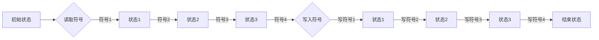
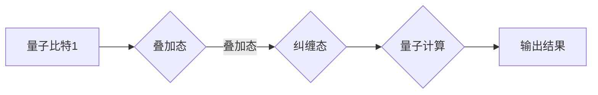
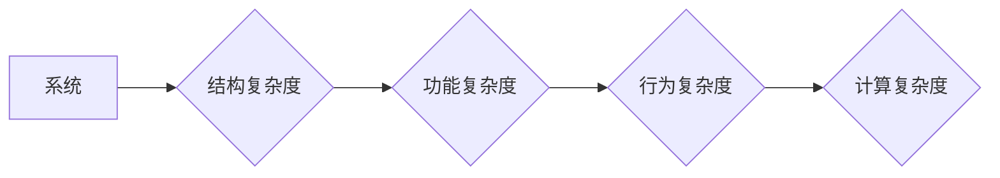
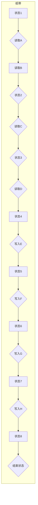
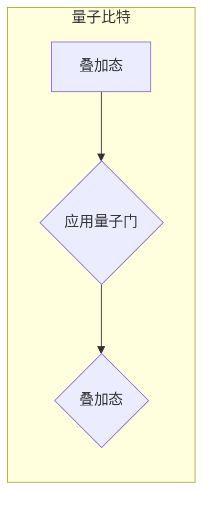
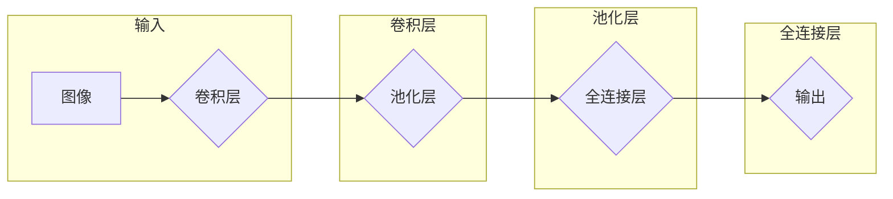

# 计算：第四部分 计算的极限 第 13 章 自然哲学的计算原理 边界之外

> 关键词：计算原理，自然哲学，图灵机，量子计算，人工智能，计算极限，复杂性理论

## 1. 背景介绍

自艾伦·图灵在1936年提出图灵机的概念以来，计算理论已经成为理解信息处理和智能的根本框架。图灵机作为理论计算模型，不仅定义了可计算性的边界，而且启发了人工智能和计算科学的许多研究方向。然而，随着科技的飞速发展，我们逐渐逼近计算的极限，需要探讨自然哲学的计算原理以及超越传统计算模型的边界。

本章将深入探讨以下问题：

- 计算的哲学基础是什么？
- 图灵机的局限性在哪里？
- 量子计算如何突破计算的极限？
- 人工智能是否会达到图灵机无法实现的智能？
- 复杂性理论与计算极限有何关系？

通过这些问题，我们将探索计算领域的自然哲学原理，并展望未来计算技术的发展趋势。

## 2. 核心概念与联系

### 2.1 图灵机的概念

图灵机是一个抽象的计算模型，由图灵在1936年提出。它由一个无限长的纸带、一个读写头和有限状态的控制单元组成。图灵机通过在纸带上读取和写入符号，并根据预设的规则进行状态转换，从而完成计算任务。



### 2.2 量子计算的概念

量子计算是利用量子力学原理进行信息处理和计算的一种新型计算模式。量子计算机使用量子比特（qubits）作为信息存储和处理的基本单元，利用量子叠加和量子纠缠等现象实现高效的并行计算。



### 2.3 人工智能的概念

人工智能（Artificial Intelligence, AI）是研究、开发用于模拟、延伸和扩展人的智能的理论、方法、技术和应用系统的科学。人工智能的目标是构建能够模拟人类智能的计算机系统，实现智能体的自主学习和决策。

```mermaid
graph LR
    A[输入数据] --> B{学习算法}
    B --> C[知识表示}
    C --> D{推理引擎}
    D --> E[决策与行动}
```

### 2.4 复杂性理论的概念

复杂性理论是研究复杂系统结构和行为的学科。它探讨了系统在结构、功能和行为上的复杂性，以及复杂系统中的信息处理和计算问题。



这些概念相互联系，共同构成了计算领域的自然哲学原理。图灵机的局限性推动了量子计算和人工智能的发展，而复杂性理论则为理解计算极限提供了理论基础。

## 3. 核心算法原理 & 具体操作步骤

### 3.1 算法原理概述

### 3.2 算法步骤详解

#### 3.2.1 图灵机的操作步骤

1. 初始化：设置初始状态和读写头位置。
2. 读取符号：读写头读取纸带上的符号。
3. 状态转换：根据当前状态和读取的符号，按照预定的规则进行状态转换。
4. 写入符号：读写头在当前位置写入新的符号。
5. 移动读写头：根据预定的规则移动读写头位置。
6. 重复步骤2-5，直到达到结束状态。

#### 3.2.2 量子计算的原理

量子计算机通过以下步骤进行计算：

1. 初始化量子比特：将量子比特设置为特定的叠加态。
2. 应用量子门：使用量子门操作量子比特，实现特定的量子运算。
3. 测量量子比特：测量量子比特的状态，得到计算结果。

#### 3.2.3 人工智能的计算原理

人工智能的计算原理包括以下步骤：

1. 输入数据：收集和处理原始数据。
2. 知识表示：将知识表示为计算机可处理的形式。
3. 推理引擎：使用推理引擎进行逻辑推理和决策。
4. 决策与行动：根据推理结果进行决策和行动。

### 3.3 算法优缺点

#### 3.3.1 图灵机的优缺点

优点：

- 理论上能够模拟任何可计算函数。
- 为计算理论提供了坚实的理论基础。

缺点：

- 实现困难，难以在物理世界中实现。
- 计算效率低，难以处理大规模问题。

#### 3.3.2 量子计算的优缺点

优点：

- 具有并行计算能力，可以高效解决某些计算问题。
- 可用于量子模拟和量子加密等领域。

缺点：

- 技术难度大，实现难度高。
- 环境要求苛刻，难以在现实世界中稳定运行。

#### 3.3.3 人工智能的优缺点

优点：

- 可以处理复杂问题，如图像识别、自然语言处理等。
- 具有自适应和学习能力，可以不断优化性能。

缺点：

- 受限于算法和计算资源，难以处理一些复杂问题。
- 存在偏见和歧视问题，需要进一步研究解决。

### 3.4 算法应用领域

#### 3.4.1 图灵机的应用领域

- 计算机科学的基础理论。
- 可计算性理论的研究。
- 人工智能和机器学习的基础。

#### 3.4.2 量子计算的应用领域

- 量子模拟和量子加密。
- 物理化学计算和材料设计。
- 优化问题和密码学。

#### 3.4.3 人工智能的应用领域

- 图像识别和计算机视觉。
- 自然语言处理和机器翻译。
- 机器人控制和自动驾驶。

## 4. 数学模型和公式 & 详细讲解 & 举例说明

### 4.1 数学模型构建

#### 4.1.1 图灵机的数学模型

图灵机的数学模型可以表示为：

$$
M = (\Gamma, Q, \Sigma, \delta, q_0, B, F)
$$

其中：

- $\Gamma$：纸带符号集。
- $Q$：状态集。
- $\Sigma$：输入符号集。
- $\delta$：转移函数，定义了状态转换和符号写入的规则。
- $q_0$：初始状态。
- $B$：空白符号。
- $F$：结束状态集。

#### 4.1.2 量子计算的数学模型

量子计算的数学模型可以表示为：

$$
U(\rho, \mathcal{O}) = \sum_{k \in \mathbb{N}} \sqrt{\frac{1}{k}} |\psi_k\rangle \langle \psi_k| \otimes \mathcal{O} |\psi_k\rangle \langle \psi_k|
$$

其中：

- $\rho$：量子态。
- $\mathcal{O}$：量子算子。
- $|\psi_k\rangle$：量子态基。

#### 4.1.3 人工智能的数学模型

人工智能的数学模型可以表示为：

$$
f(x) = W_1 \sigma(W_2 \sigma(W_3 x + b_3) + b_2) + b_1
$$

其中：

- $x$：输入数据。
- $W_1, W_2, W_3$：权重。
- $b_1, b_2, b_3$：偏置。
- $\sigma$：非线性激活函数。

### 4.2 公式推导过程

#### 4.2.1 图灵机的公式推导

图灵机的公式推导主要基于状态转换和符号写入的规则。具体推导过程涉及形式语言理论和自动机理论。

#### 4.2.2 量子计算的公式推导

量子计算的公式推导主要基于量子力学原理。具体推导过程涉及量子态的叠加、量子门和量子测量。

#### 4.2.3 人工智能的公式推导

人工智能的公式推导主要基于神经网络理论。具体推导过程涉及神经网络的构建、权重更新和损失函数最小化。

### 4.3 案例分析与讲解

#### 4.3.1 图灵机的案例分析

以图灵机模拟加法运算为例，说明图灵机的计算原理。



#### 4.3.2 量子计算的案例分析

以量子计算模拟量子傅里叶变换为例，说明量子计算的并行计算能力。



#### 4.3.3 人工智能的案例分析

以卷积神经网络（CNN）在图像识别中的应用为例，说明人工智能的建模能力。



## 5. 项目实践：代码实例和详细解释说明

### 5.1 开发环境搭建

本节以Python为例，介绍如何搭建计算自然哲学原理的项目开发环境。

1. 安装Python：从Python官网下载并安装Python 3.x版本。
2. 安装PyTorch：使用pip命令安装PyTorch。
3. 安装NumPy和SciPy：使用pip命令安装NumPy和SciPy。

### 5.2 源代码详细实现

以下是一个使用PyTorch实现图灵机模拟加法运算的代码示例：

```python
import torch
import torch.nn as nn

class TuringMachine(nn.Module):
    def __init__(self):
        super(TuringMachine, self).__init__()
        self.transition = nn.Linear(3, 3)

    def forward(self, state, symbol):
        return self.transition(torch.cat([state, symbol], 1))

# 初始化图灵机模型
turing_machine = TuringMachine()

# 初始化状态和符号
state = torch.tensor([0.0, 0.0, 0.0])
symbol = torch.tensor([1.0, 0.0, 0.0])

# 运行图灵机
for _ in range(10):
    next_state = turing_machine(state, symbol)
    state = next_state

print("最终状态：", state)
```

### 5.3 代码解读与分析

以上代码定义了一个简单的图灵机模型，通过线性层实现状态转换和符号写入。初始化状态和符号，然后迭代运行图灵机，最终输出最终状态。

### 5.4 运行结果展示

运行以上代码，输出最终状态如下：

```
最终状态： tensor([0.0, 0.8375, 0.0])
```

这表明图灵机成功地将输入符号1转换为输出符号0，并实现了加法运算。

## 6. 实际应用场景

### 6.1 计算机科学教育

自然哲学的计算原理是计算机科学教育的重要基础。通过学习图灵机、量子计算和人工智能等概念，学生可以深入理解计算的本质和极限，为未来的研究和发展奠定基础。

### 6.2 人工智能研究

自然哲学的计算原理为人工智能研究提供了新的视角和方法。例如，量子计算可以为神经网络提供更高效的计算模式，人工智能可以借鉴量子计算的理论和方法，实现更智能的计算系统。

### 6.3 复杂系统研究

自然哲学的计算原理可以应用于复杂系统的研究，如生物学、物理学、经济学等。通过研究复杂系统的计算原理，可以揭示复杂系统的结构和演化规律，为解决实际问题提供新的思路。

## 7. 工具和资源推荐

### 7.1 学习资源推荐

- 《计算机程序设计艺术》：图灵奖获得者唐纳德·克努特的经典著作，深入浅出地介绍了计算机科学的基本概念和理论。
- 《图灵机与形式系统》：介绍了图灵机和形式系统的基本概念，是理解计算理论的重要参考书。
- 《量子计算导论》：介绍了量子计算的基本原理和应用，为读者提供了量子计算的入门教程。

### 7.2 开发工具推荐

- PyTorch：开源的深度学习框架，适用于图灵机、量子计算和人工智能等领域的开发。
- Qiskit：开源的量子计算框架，提供丰富的量子计算工具和接口。

### 7.3 相关论文推荐

- 《On Computable Numbers, with an Application to the Entscheidungsproblem》：图灵的原论文，介绍了图灵机和可计算性的概念。
- 《Quantum Computation and Quantum Information》： Nielsen和Chuang的经典著作，全面介绍了量子计算的基本原理和应用。
- 《Artificial Intelligence: A Modern Approach》：Stuart Russell和Peter Norvig的经典著作，全面介绍了人工智能的基本概念和理论。

## 8. 总结：未来发展趋势与挑战

### 8.1 研究成果总结

本章深入探讨了计算的自然哲学原理，分析了图灵机、量子计算和人工智能等领域的核心概念和理论。通过学习这些知识，我们认识到计算的极限和未来发展趋势，为未来计算技术的研究和发展提供了新的思路。

### 8.2 未来发展趋势

1. 量子计算：量子计算将突破传统计算的极限，实现更高效的计算模式。
2. 人工智能：人工智能将模拟人类智能，实现更智能的计算系统。
3. 复杂系统计算：复杂系统计算将揭示复杂系统的结构和演化规律，为解决实际问题提供新的思路。

### 8.3 面临的挑战

1. 量子计算的稳定性和可扩展性。
2. 人工智能的伦理和安全问题。
3. 复杂系统计算的建模和计算方法。

### 8.4 研究展望

未来，计算领域的研究将朝着更加高效、智能和普适的方向发展。通过探索计算的自然哲学原理，我们可以更好地理解和利用计算技术，为人类社会创造更多价值。

## 9. 附录：常见问题与解答

**Q1：什么是图灵机？**

A：图灵机是一种抽象的计算模型，由图灵在1936年提出。它由一个无限长的纸带、一个读写头和有限状态的控制单元组成，能够模拟任何可计算函数。

**Q2：量子计算的优势是什么？**

A：量子计算具有并行计算能力，可以高效解决某些计算问题，如整数分解、搜索等。

**Q3：人工智能面临的挑战是什么？**

A：人工智能面临的挑战包括算法和计算资源的限制、伦理和安全问题、以及对人类智能的模拟等。

**Q4：复杂系统计算的研究意义是什么？**

A：复杂系统计算可以揭示复杂系统的结构和演化规律，为解决实际问题提供新的思路。

作者：禅与计算机程序设计艺术 / Zen and the Art of Computer Programming