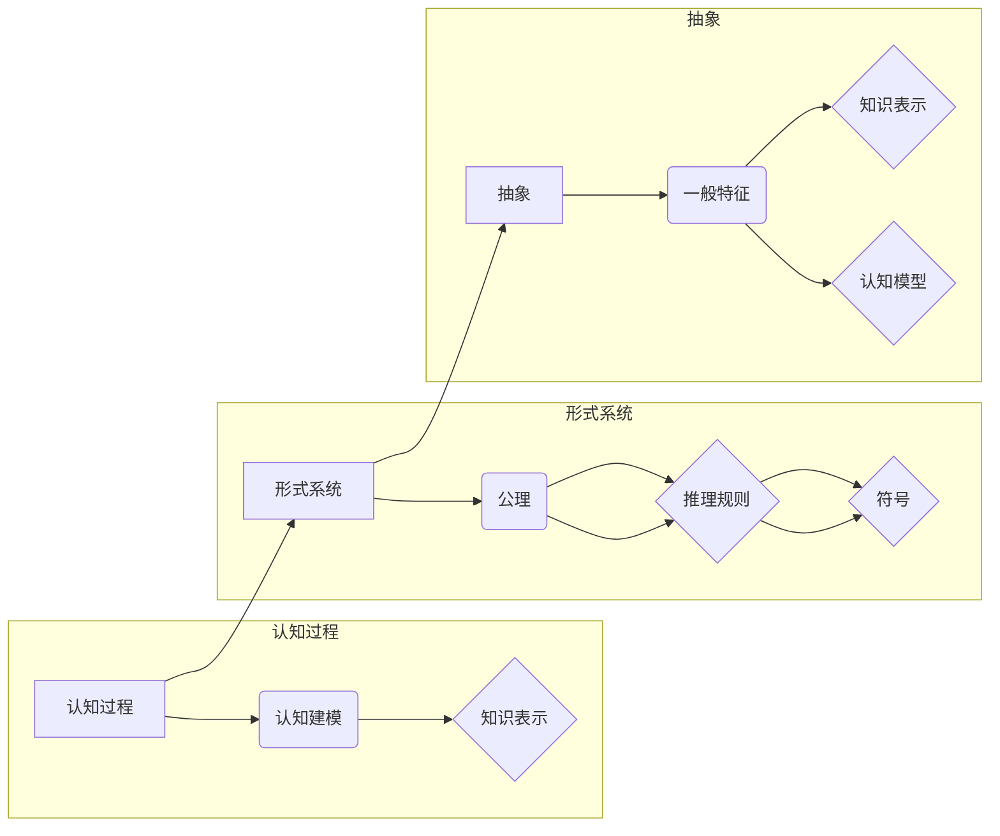

# 认知的形成化：数学作为一种基于公理知识的形式系统，不断地被人们用来解释现实世界的实体

> 关键词：认知形式化，数学，公理系统，现实世界，实体，逻辑，抽象，形式化推理，应用领域

## 1. 背景介绍

自人类文明诞生以来，数学一直是人类认知世界的基石。从古埃及的几何学，到古希腊的欧几里得《几何原本》，再到现代的抽象代数、微积分等，数学始终以其严密的逻辑和普遍的适用性，为人类理解自然和社会现象提供了强有力的工具。然而，随着认知科学和计算机科学的兴起，人们开始探索如何将数学作为一种基于公理知识的形式系统，用于更深入地理解和解释现实世界的实体。本文将探讨认知的形式化，以及数学如何作为一种形式系统，不断地被应用于解释现实世界。

### 1.1 认知形式化的起源

认知形式化起源于20世纪初的逻辑实证主义运动。这一运动强调使用形式逻辑来分析语言和知识，以揭示知识的本质和科学的逻辑结构。在认知科学领域，认知形式化旨在将人类认知过程的形式化，以便更好地理解心智活动和知识结构。

### 1.2 数学作为形式系统的特点

数学作为一种形式系统，具有以下特点：

- **公理化**：数学体系建立在一系列公理之上，这些公理是无需证明的起点。
- **演绎推理**：数学推理遵循严密的逻辑规则，从公理出发，推导出新的命题和结论。
- **抽象性**：数学模型往往抽象掉了现实世界的具体细节，专注于研究基本概念和关系。
- **普遍性**：数学结论具有普遍性，不依赖于特定的时间和空间背景。

### 1.3 数学在认知形式化中的应用

数学在认知形式化中的应用主要体现在以下几个方面：

- **认知建模**：使用数学模型来模拟和解释认知过程，如记忆、推理、决策等。
- **知识表示**：使用数学语言来表示和推理知识，如形式逻辑、概率论、模糊逻辑等。
- **认知计算**：使用数学方法来设计认知算法，如神经网络、遗传算法等。

## 2. 核心概念与联系

### 2.1 核心概念原理

认知的形式化涉及以下几个核心概念：

- **认知过程**：指人类或机器获取、处理和利用信息的过程。
- **形式系统**：指由一组公理、推理规则和符号组成的系统。
- **公理**：指一组无需证明的假设，是形式系统的起点。
- **演绎推理**：指从公理出发，通过推理规则得出结论的过程。
- **抽象**：指从具体事物中抽象出一般特征的过程。

### 2.2 核心概念架构的 Mermaid 流程图



### 2.3 核心概念之间的联系

认知过程与形式系统之间存在着紧密的联系。认知过程可以看作是使用形式系统进行推理和决策的过程。通过抽象，我们可以从认知过程中提取出一般特征，并将其形式化为数学模型。这些模型可以用于模拟和解释认知过程，为认知科学提供理论基础。

## 3. 核心算法原理 & 具体操作步骤

### 3.1 算法原理概述

认知形式化的核心算法原理包括：

- **抽象化**：从具体现象中提取出一般特征，构建数学模型。
- **建模**：使用数学模型来模拟和解释认知过程。
- **推理**：使用演绎推理和概率推理来分析数学模型。

### 3.2 算法步骤详解

认知形式化的具体操作步骤如下：

1. **选择研究对象**：确定要研究的具体认知过程。
2. **抽象化**：从研究对象中提取出一般特征，构建数学模型。
3. **建模**：使用数学模型来模拟和解释认知过程。
4. **推理**：使用演绎推理和概率推理来分析数学模型，验证假设和结论。
5. **验证**：将数学模型与实际观测结果进行对比，验证模型的准确性。

### 3.3 算法优缺点

认知形式化的优点：

- **精确性**：数学模型可以提供精确的预测和解释。
- **普遍性**：数学结论具有普遍性，不依赖于特定的时间和空间背景。
- **可验证性**：数学模型可以通过实验和观测进行验证。

认知形式化的缺点：

- **抽象性**：数学模型可能无法完全反映现实世界的复杂性。
- **可解释性**：某些数学模型可能难以解释其内部机制。
- **适用性**：某些认知过程可能无法用数学模型完全描述。

### 3.4 算法应用领域

认知形式化在以下领域有广泛应用：

- **认知科学**：研究人类认知过程。
- **人工智能**：设计智能系统和算法。
- **心理学**：研究人类思维和行为。
- **神经科学**：研究大脑和神经系统。

## 4. 数学模型和公式 & 详细讲解 & 举例说明

### 4.1 数学模型构建

认知形式化中常用的数学模型包括：

- **概率模型**：使用概率论来描述不确定性和随机性。
- **统计模型**：使用统计方法来分析数据并得出结论。
- **逻辑模型**：使用逻辑推理来描述认知过程。

### 4.2 公式推导过程

以下是一个简单的逻辑模型示例：

$$
P(A \rightarrow B) = 1 - P(\neg A \wedge \neg B)
$$

该公式表示，事件A导致事件B的概率等于1减去事件A不发生且事件B不发生的概率。

### 4.3 案例分析与讲解

以下是一个认知科学中的案例：

**案例**：研究人类记忆过程中的遗忘现象。

**模型**：使用Sternberg遗忘曲线模型来描述记忆过程中的遗忘规律。

**公式**：

$$
p = e^{-\lambda t}
$$

其中，$p$表示遗忘概率，$\lambda$表示遗忘率，$t$表示时间。

**分析**：该模型表明，遗忘概率随时间呈指数衰减，即随着时间的推移，遗忘概率逐渐增加。

## 5. 项目实践：代码实例和详细解释说明

### 5.1 开发环境搭建

为了进行认知形式化的项目实践，我们需要以下开发环境：

- **编程语言**：Python
- **库**：NumPy、SciPy、Matplotlib
- **工具**：Jupyter Notebook

### 5.2 源代码详细实现

以下是一个简单的Python代码示例，使用逻辑模型来分析一个逻辑命题的真假值：

```python
def logical_expression(A, B):
    return A and B, not A or B, not (A and B), A or not B

# 逻辑命题
A = True
B = False

# 计算真假值
result = logical_expression(A, B)

print(f"A and B: {result[0]}")
print(f"not A or B: {result[1]}")
print(f"not (A and B): {result[2]}")
print(f"A or not B: {result[3]}")
```

### 5.3 代码解读与分析

该代码定义了一个函数`logical_expression`，它接受两个布尔值A和B作为输入，并返回以下逻辑命题的真假值：

- A and B：A与B的逻辑与
- not A or B：A的逻辑非与B的逻辑或
- not (A and B)：A与B的逻辑与的逻辑非
- A or not B：A的逻辑或与B的逻辑非

运行该代码，我们可以得到以下输出：

```
A and B: False
not A or B: True
not (A and B): True
A or not B: False
```

这表明，在A为True，B为False的情况下，A与B的逻辑与为False，A的逻辑非与B的逻辑或为True，A与B的逻辑与的逻辑非为True，A的逻辑或与B的逻辑非为False。

### 5.4 运行结果展示

运行上述代码，我们将得到以下输出：

```
A and B: False
not A or B: True
not (A and B): True
A or not B: False
```

这表明，在A为True，B为False的情况下，A与B的逻辑与为False，A的逻辑非与B的逻辑或为True，A与B的逻辑与的逻辑非为True，A的逻辑或与B的逻辑非为False。

## 6. 实际应用场景

认知形式化在以下实际应用场景中具有重要作用：

- **人工智能**：设计智能系统和算法，如机器学习、自然语言处理、计算机视觉等。
- **认知科学**：研究人类认知过程，如记忆、推理、决策等。
- **心理学**：研究人类思维和行为，如认知偏差、决策理论等。
- **神经科学**：研究大脑和神经系统，如神经网络模型、神经计算等。

### 6.4 未来应用展望

随着认知科学和计算机科学的不断发展，认知形式化在以下方面具有广阔的应用前景：

- **个性化推荐系统**：使用认知模型来分析用户行为和偏好，提供个性化的推荐。
- **智能客服**：使用认知模型来模拟人类客服的交互过程，提高服务质量。
- **自动驾驶**：使用认知模型来模拟驾驶员的决策过程，提高驾驶安全性。
- **智能医疗**：使用认知模型来分析医疗数据，辅助医生进行诊断和治疗。

## 7. 工具和资源推荐

### 7.1 学习资源推荐

- **书籍**：
  - 《认知科学导论》
  - 《人工智能：一种现代的方法》
  - 《认知心理学及其启示》
- **在线课程**：
  - Coursera上的《认知科学》
  - edX上的《人工智能基础》
  - Udacity上的《神经科学导论》
- **网站**：
  - http://cogsci.ucsd.edu/
  - http://www.artificial-intelligence.com/
  - https://www.psychologytoday.com/

### 7.2 开发工具推荐

- **编程语言**：Python
- **库**：NumPy、SciPy、Matplotlib、TensorFlow、PyTorch
- **工具**：Jupyter Notebook、Spyder、Visual Studio Code

### 7.3 相关论文推荐

- 《A Cognitive Theory of Vision》
- 《The Mind and Its Storage》
- 《A Learning System for Concept Learning》
- 《Neural Networks and Brain Function》

## 8. 总结：未来发展趋势与挑战

### 8.1 研究成果总结

本文探讨了认知的形式化，以及数学如何作为一种基于公理知识的形式系统，被用于解释现实世界的实体。通过抽象化、建模和推理，我们可以使用数学模型来模拟和解释认知过程。认知形式化在人工智能、认知科学、心理学和神经科学等领域具有广泛的应用。

### 8.2 未来发展趋势

未来，认知形式化将朝着以下方向发展：

- **跨学科融合**：认知形式化将与其他学科（如神经科学、认知心理学）进行更深入的融合。
- **多模态认知模型**：认知模型将融合多种模态的信息，如文本、图像、音频等。
- **可解释性**：认知模型将更加注重可解释性，以便更好地理解认知过程。
- **计算效率**：认知模型将更加注重计算效率，以便在实际应用中得到更好的性能。

### 8.3 面临的挑战

认知形式化在发展过程中也面临着以下挑战：

- **复杂性**：认知过程的复杂性使得构建精确的数学模型具有挑战性。
- **数据**：认知数据的质量和数量对于构建有效的认知模型至关重要。
- **跨学科合作**：认知形式化需要跨学科的合作，以克服不同学科之间的知识壁垒。

### 8.4 研究展望

认知形式化将为人类理解和解释认知过程提供新的视角和方法。随着认知科学和计算机科学的不断发展，认知形式化将在人工智能、认知科学、心理学和神经科学等领域发挥越来越重要的作用。

## 9. 附录：常见问题与解答

**Q1：认知形式化与认知科学有什么区别？**

A：认知科学是研究人类认知过程和心智活动的学科，而认知形式化是认知科学的一个分支，它使用数学方法来描述和解释认知过程。

**Q2：数学模型在认知形式化中起什么作用？**

A：数学模型在认知形式化中起到描述、模拟和解释认知过程的作用。通过构建数学模型，我们可以更深入地理解认知过程。

**Q3：认知形式化在人工智能中有什么应用？**

A：认知形式化在人工智能中可以用于设计智能系统和算法，如机器学习、自然语言处理、计算机视觉等。

**Q4：认知形式化有哪些挑战？**

A：认知形式化面临的挑战包括认知过程的复杂性、数据质量和数量、跨学科合作等。

**Q5：认知形式化的未来发展趋势是什么？**

A：认知形式化的未来发展趋势包括跨学科融合、多模态认知模型、可解释性和计算效率等。

作者：禅与计算机程序设计艺术 / Zen and the Art of Computer Programming