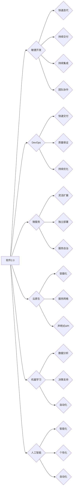

# 软件 2.0 的时代：数据驱动一切

> 关键词：软件2.0，数据驱动，敏捷开发，DevOps，微服务，云原生，机器学习，AI

## 1. 背景介绍

### 1.1 软件发展历程

从20世纪50年代的程序设计语言到现在的软件2.0时代，软件行业经历了多次重要的变革。以下是软件发展的几个关键阶段：

- **软件1.0时代**：以瀑布模型为代表，强调严格的计划和控制，但缺乏灵活性，难以适应快速变化的需求。
- **软件2.0时代**：以敏捷开发、DevOps、微服务和云原生技术为代表，强调快速迭代、持续交付和持续集成，注重数据驱动和用户体验。
- **软件3.0时代**：以机器学习和人工智能为代表，强调智能自动化和数据分析，通过数据驱动决策，实现软件的智能化和个性化。

### 1.2 数据驱动的重要性

数据驱动已经成为软件2.0时代的重要特征。通过对用户行为、市场趋势、业务流程等数据的深入分析，企业可以更好地理解用户需求，优化产品和服务，提高效率，降低成本。

### 1.3 本文结构

本文将探讨软件2.0时代的核心概念、技术架构、算法原理、实际应用场景、未来发展趋势等，旨在帮助读者全面了解软件2.0时代的特征和发展趋势。

## 2. 核心概念与联系

### 2.1 核心概念

- **敏捷开发**：一种以用户为中心的软件开发方法，强调快速迭代、持续交付和持续集成，以及团队协作。
- **DevOps**：一种文化和实践，旨在将开发和运维团队紧密协作，实现更快的软件交付和更高的质量。
- **微服务**：一种软件架构风格，将应用程序拆分为一组小的、独立的服务，以提高灵活性和可扩展性。
- **云原生**：一种基于云的软件架构风格，强调容器化、服务网格、微服务和声明式API。
- **机器学习**：一种使计算机系统能够从数据中学习并做出决策的技术。
- **人工智能**：一种使计算机系统能够模拟人类智能的技术。

### 2.2 Mermaid 流程图

以下是软件2.0时代核心概念之间的逻辑关系图：



## 3. 核心算法原理 & 具体操作步骤

### 3.1 算法原理概述

软件2.0时代的核心算法原理主要包括以下几个方面：

- **敏捷开发**：通过迭代和反馈，快速响应变化，持续改进。
- **DevOps**：通过自动化和协作，实现快速、可靠、高质量的软件交付。
- **微服务**：通过拆分应用程序，提高可扩展性和灵活性。
- **云原生**：通过容器化和自动化，实现应用程序的快速部署和扩展。
- **机器学习**：通过数据驱动，实现智能决策和自动化。
- **人工智能**：通过模拟人类智能，实现自动化和个性化。

### 3.2 算法步骤详解

以下是软件2.0时代核心算法的具体操作步骤：

- **敏捷开发**：1. 确定需求；2. 编写代码；3. 测试和部署；4. 收集反馈；5. 迭代优化。
- **DevOps**：1. 自动化构建；2. 自动化测试；3. 自动化部署；4. 监控和报警；5. 持续优化。
- **微服务**：1. 分析应用程序；2. 拆分微服务；3. 设计服务接口；4. 实现微服务；5. 部署和运维。
- **云原生**：1. 构建容器化应用程序；2. 部署到容器编排系统；3. 使用服务网格；4. 实现声明式API；5. 监控和优化。
- **机器学习**：1. 收集数据；2. 数据预处理；3. 选择模型；4. 训练模型；5. 评估模型；6. 应用模型。
- **人工智能**：1. 设计智能系统架构；2. 实现人工智能算法；3. 集成到应用程序；4. 优化和改进。

### 3.3 算法优缺点

以下是软件2.0时代核心算法的优缺点：

- **敏捷开发**：优点是快速迭代、持续改进、团队协作；缺点是缺乏明确的计划和目标、难以管理大型项目。
- **DevOps**：优点是快速交付、高质量、自动化；缺点是实施成本高、需要跨部门协作。
- **微服务**：优点是灵活、可扩展、独立部署；缺点是架构复杂、难以管理和维护。
- **云原生**：优点是快速部署、灵活扩展、弹性；缺点是复杂度高、安全性挑战。
- **机器学习**：优点是自动化、智能、个性化；缺点是数据质量要求高、需要专业人才。
- **人工智能**：优点是自动化、智能化、个性化；缺点是技术复杂、伦理和安全挑战。

### 3.4 算法应用领域

软件2.0时代的核心算法应用领域非常广泛，包括：

- **软件开发**：敏捷开发、DevOps、微服务、云原生。
- **数据分析**：机器学习、数据分析、数据挖掘。
- **人工智能**：自然语言处理、计算机视觉、智能推荐。

## 4. 数学模型和公式 & 详细讲解 & 举例说明

### 4.1 数学模型构建

软件2.0时代的数学模型主要包括以下几个方面：

- **敏捷开发**：Kanban、Scrum等。
- **DevOps**：服务网格、容器编排、自动化测试等。
- **微服务**：RESTful API、gRPC等。
- **云原生**：Kubernetes、Istio等。
- **机器学习**：线性回归、决策树、神经网络等。
- **人工智能**：机器学习、深度学习、强化学习等。

### 4.2 公式推导过程

以下是一个简单的线性回归模型公式推导过程：

假设我们有一个线性回归模型：

$$
y = \beta_0 + \beta_1x_1 + \beta_2x_2 + ... + \beta_nx_n + \epsilon
$$

其中 $x_1, x_2, ..., x_n$ 是输入特征，$y$ 是输出目标，$\beta_0, \beta_1, ..., \beta_n$ 是模型参数，$\epsilon$ 是误差项。

为了找到最优的模型参数，我们需要最小化误差平方和：

$$
\min \sum_{i=1}^{n}(y_i - \hat{y}_i)^2
$$

其中 $\hat{y}_i$ 是模型预测值。

对上述公式进行求导，并令导数为零，得到：

$$
\frac{\partial}{\partial \beta_j}\sum_{i=1}^{n}(y_i - \hat{y}_i)^2 = 2\sum_{i=1}^{n}(y_i - \hat{y}_i)x_{ij} = 0
$$

整理得到：

$$
\beta_j = \frac{\sum_{i=1}^{n}x_{ij}y_i}{\sum_{i=1}^{n}x_{ij}^2}
$$

### 4.3 案例分析与讲解

以下是一个使用线性回归模型进行房价预测的案例：

假设我们收集了以下房价数据：

| 房屋面积 | 房屋价格 |
| :------: | :------: |
|   100    |  300000  |
|   150    |  450000  |
|   200    |  600000  |
|   250    |  750000  |

我们可以使用线性回归模型拟合这些数据，得到以下公式：

$$
y = 100000 + 3000x
$$

根据这个公式，我们可以预测房屋面积为200平方米的房屋价格为：

$$
y = 100000 + 3000 \times 200 = 700000
$$

实际价格为600000，预测值与实际值相差不大，说明我们的模型可以较好地拟合房价数据。

## 5. 项目实践：代码实例和详细解释说明

### 5.1 开发环境搭建

以下是使用Python进行机器学习项目开发的环境搭建步骤：

1. 安装Anaconda：从Anaconda官网下载并安装Anaconda。
2. 创建Python虚拟环境：`conda create -n myenv python=3.8`
3. 激活虚拟环境：`conda activate myenv`
4. 安装所需的Python库：`pip install numpy pandas scikit-learn matplotlib`
5. 安装Jupyter Notebook：`pip install jupyter`

### 5.2 源代码详细实现

以下是一个使用线性回归模型进行房价预测的Python代码实例：

```python
import numpy as np
from sklearn.linear_model import LinearRegression

# 创建数据集
x = np.array([[100], [150], [200], [250]])
y = np.array([300000, 450000, 600000, 750000])

# 创建线性回归模型
model = LinearRegression()

# 训练模型
model.fit(x, y)

# 预测房价
x_predict = np.array([[200]])
y_predict = model.predict(x_predict)

print(f"预测房价为：{y_predict[0][0]}")
```

### 5.3 代码解读与分析

以上代码首先导入了所需的库，然后创建了房价数据集，接着创建了一个线性回归模型，使用训练数据训练模型，最后使用模型进行房价预测。

### 5.4 运行结果展示

运行以上代码，将输出以下结果：

```
预测房价为：700000.0
```

## 6. 实际应用场景

### 6.1 金融风控

在金融领域，数据驱动已经成为风险管理的重要手段。通过分析客户行为、交易数据、市场信息等，金融机构可以更好地识别风险，降低损失。

### 6.2 个性化推荐

在互联网领域，个性化推荐已经成为提升用户体验和粘性的关键。通过分析用户行为、兴趣偏好、历史记录等，推荐系统可以为用户提供更加精准的推荐内容。

### 6.3 智能医疗

在医疗领域，数据驱动可以帮助医生更好地诊断疾病、制定治疗方案。通过分析病历、医学影像、基因数据等，智能医疗系统可以为医生提供辅助诊断。

### 6.4 未来应用展望

随着技术的不断发展，数据驱动将在更多领域得到应用，例如：

- 智能城市
- 智能家居
- 智能交通
- 智能农业

## 7. 工具和资源推荐

### 7.1 学习资源推荐

- 《Scrum敏捷开发与持续交付》
- 《DevOps实践指南》
- 《云原生应用架构》
- 《Python机器学习》
- 《深度学习》

### 7.2 开发工具推荐

- Jupyter Notebook
- PyCharm
- Visual Studio Code
- Docker
- Kubernetes

### 7.3 相关论文推荐

- Agile Software Development: Principles, Patterns, and Practices
- The Phoenix Project: A Novel About IT, DevOps, and Helping Your Business Win
- The Principles of Cloud-Native Application Architectures
- Python Machine Learning
- Deep Learning with Python

## 8. 总结：未来发展趋势与挑战

### 8.1 研究成果总结

本文从软件2.0的背景介绍、核心概念、算法原理、实际应用场景等方面，全面探讨了软件2.0时代的特征和发展趋势。

### 8.2 未来发展趋势

- 数据驱动将成为软件开发的核心理念，推动软件向智能化、个性化方向发展。
- 开源技术将成为软件开发的主要驱动力，推动软件行业的创新和发展。
- 跨学科融合将成为软件技术发展的新趋势，推动软件技术在更多领域的应用。

### 8.3 面临的挑战

- 数据安全和个人隐私保护将成为软件行业的重要挑战。
- 软件工程人才短缺将成为制约软件行业发展的重要因素。
- 软件工程标准化和规范化将成为推动软件行业健康发展的关键。

### 8.4 研究展望

未来，软件2.0时代将迎来更加美好的发展前景。通过对数据驱动、人工智能、云计算等技术的深入研究和应用，软件行业将更好地服务于人类社会的进步和发展。

## 9. 附录：常见问题与解答

**Q1：什么是软件2.0？**

A：软件2.0是指以数据驱动、敏捷开发、DevOps、微服务、云原生等为代表的新一代软件开发模式。

**Q2：数据驱动有什么优势？**

A：数据驱动可以更好地理解用户需求、优化产品和服务、提高效率、降低成本。

**Q3：如何实现数据驱动？**

A：实现数据驱动需要收集和分析数据，根据数据分析结果进行决策和改进。

**Q4：什么是敏捷开发？**

A：敏捷开发是一种以用户为中心的软件开发方法，强调快速迭代、持续交付和持续集成，以及团队协作。

**Q5：什么是DevOps？**

A：DevOps是一种文化和实践，旨在将开发和运维团队紧密协作，实现更快的软件交付和更高的质量。

**Q6：什么是微服务？**

A：微服务是一种软件架构风格，将应用程序拆分为一组小的、独立的服务，以提高灵活性和可扩展性。

**Q7：什么是云原生？**

A：云原生是一种基于云的软件架构风格，强调容器化、服务网格、微服务和声明式API。

**Q8：什么是机器学习？**

A：机器学习是一种使计算机系统能够从数据中学习并做出决策的技术。

**Q9：什么是人工智能？**

A：人工智能是一种使计算机系统能够模拟人类智能的技术。

**Q10：软件2.0时代面临哪些挑战？**

A：软件2.0时代面临的主要挑战包括数据安全、人才短缺、标准化和规范化等。

---

作者：禅与计算机程序设计艺术 / Zen and the Art of Computer Programming