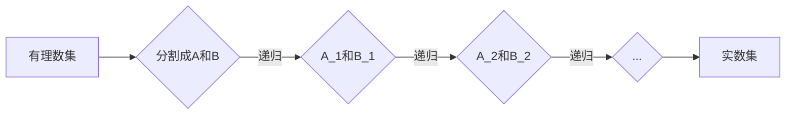

> 集合论，实数集，可定义子集，集合论基础，数学逻辑，实数完备性，康托尔定理，戴德金分割，实数构造

# 集合论导引：实数集可定义子集分析

## 1. 背景介绍

集合论是现代数学的基石之一，它为数学各分支提供了一个统一的语言和框架。实数集作为数学中一个基本的结构，其性质和构造一直是数学家们关注的焦点。在集合论中，对实数集的可定义子集进行深入分析，不仅有助于理解实数的内在结构，也能为其他数学领域的深入研究提供启示。本文将导引读者进入实数集可定义子集的精彩世界。

### 1.1 问题的由来

实数集是数学中的一个基本对象，它包含了有理数和无理数。实数集的完备性是其最著名的性质之一，但如何从集合论的角度严格定义实数集，以及如何分析其子集的性质，一直是数学研究的核心问题。

### 1.2 研究现状

在集合论领域，实数集的构造通常采用康托尔分割法或戴德金分割法。这些方法从有理数集出发，通过严格的数学逻辑推理，构建出实数集。对于实数集的可定义子集，研究者们探讨了其性质、结构以及与实数完备性的关系。

### 1.3 研究意义

深入分析实数集的可定义子集，有助于我们：

- 理解实数的内在结构，包括实数完备性、无理数存在性等基本性质。
- 掌握数学逻辑在数学构造中的应用。
- 为其他数学领域的深入研究提供基础。

### 1.4 本文结构

本文将分为以下几个部分：

- 介绍集合论的基础概念和实数集的构造方法。
- 分析实数集的可定义子集，包括其性质和结构。
- 探讨实数集可定义子集与实数完备性的关系。
- 介绍相关的研究成果和发展趋势。

## 2. 核心概念与联系

### 2.1 集合论基础

在开始分析实数集的可定义子集之前，我们需要回顾一些集合论的基本概念：

- **集合**：一群确定且互异的元素组成的整体。
- **子集**：一个集合的部分或全部元素构成的集合。
- **幂集**：一个集合的所有子集构成的集合。
- **基数**：一个集合中元素的数量。
- **无限集合**：无法用自然数表示其元素数量的集合。

### 2.2 实数集的构造

实数集的构造主要有两种方法：康托尔分割法和戴德金分割法。

#### 2.2.1 康托尔分割法

康托尔分割法是一种通过递归过程构造实数集的方法。它基于以下步骤：

1. 将有理数集分割成两个非空、不相交的集合 $A$ 和 $B$，使得对于任意 $x \in A$ 和 $y \in B$，都有 $x < y$。
2. 对 $A$ 和 $B$ 重复步骤1，得到两个新的集合 $A_1$ 和 $B_1$，使得对于任意 $x \in A$ 和 $y \in B$，都有 $x < y$。
3. 递归进行步骤2，得到一个递归序列 $\{A_n\}$ 和 $\{B_n\}$。

实数集可以定义为集合 $\{A_n \cup B_n\}$ 的并集。

#### 2.2.2 戴德金分割法

戴德金分割法是另一种构造实数集的方法。它基于以下步骤：

1. 将有理数集分割成两个非空、不相交的集合 $A$ 和 $B$，使得 $A$ 中的每一个元素都小于 $B$ 中的每一个元素。
2. 递归进行步骤1，得到两个新的集合 $A_1$ 和 $B_1$，使得 $A_1$ 中的每一个元素都小于 $B_1$ 中的每一个元素。
3. 递归进行步骤2，得到一个递归序列 $\{A_n\}$ 和 $\{B_n\}$。

实数集可以定义为集合 $\{a - b \mid a \in A_n, b \in B_n\}$ 的并集。

### 2.3 可定义子集

实数集的可定义子集指的是可以通过集合论的语言精确描述的子集。例如，开区间 $(a, b)$ 可以通过以下方式定义：

$$
(a, b) = \{x \in \mathbb{R} \mid a < x < b\}
$$

### 2.4 Mermaid 流程图

以下是用 Mermaid 语言描述康托尔分割法的流程图：



## 3. 核心算法原理 & 具体操作步骤

### 3.1 算法原理概述

实数集的可定义子集分析的核心原理是基于集合论和数学逻辑的基本原则。通过这些原则，我们可以定义实数集的各种结构，如开区间、闭区间、无穷区间等。

### 3.2 算法步骤详解

#### 3.2.1 开区间

开区间的定义如下：

$$
(a, b) = \{x \in \mathbb{R} \mid a < x < b\}
$$

其中，$a$ 和 $b$ 是实数，且 $a < b$。

#### 3.2.2 闭区间

闭区间的定义如下：

$$
[a, b] = \{x \in \mathbb{R} \mid a \leq x \leq b\}
$$

其中，$a$ 和 $b$ 是实数。

#### 3.2.3 无穷区间

无穷区间的定义如下：

$$
(-\infty, a) = \{x \in \mathbb{R} \mid x < a\}
$$

$$
(a, \infty) = \{x \in \mathbb{R} \mid x > a\}
$$

### 3.3 算法优缺点

#### 3.3.1 优点

- 使用集合论的语言定义实数集的可定义子集，具有高度的精确性和普适性。
- 可以方便地使用数学工具进行推理和分析。

#### 3.3.2 缺点

- 定义较为复杂，需要一定的数学基础。
- 在实际应用中，可能需要使用较为复杂的集合运算。

### 3.4 算法应用领域

实数集的可定义子集分析在数学的各个领域都有广泛应用，如：

- 数学分析
- 函数论
- 微分方程
- 偏微分方程

## 4. 数学模型和公式 & 详细讲解 & 举例说明

### 4.1 数学模型构建

实数集的可定义子集可以通过集合论的语言进行构建。以下是一个例子：

#### 4.1.1 开区间

定义一个开区间 $(a, b)$，其中 $a = 1$，$b = 2$：

$$
(a, b) = \{x \in \mathbb{R} \mid 1 < x < 2\}
$$

### 4.2 公式推导过程

#### 4.2.1 开区间的并集

假设有两个开区间 $(a, b)$ 和 $(c, d)$，其中 $a < b$ 和 $c < d$。我们需要证明它们的并集也是一个开区间。

证明：

$$
(a, b) \cup (c, d) = \{x \in \mathbb{R} \mid 1 < x < 2 \text{ or } c < x < d\}
$$

由于 $a < b$ 和 $c < d$，因此 $a < c$ 或 $c < b$。所以，对于任意 $x \in (a, b) \cup (c, d)$，都有 $x$ 同时属于 $(a, b)$ 或 $(c, d)$。因此，$(a, b) \cup (c, d)$ 也是一个开区间。

### 4.3 案例分析与讲解

#### 4.3.1 实数集的闭包

实数集的闭包是指在实数集上加上一些运算，使得实数集在这些运算下仍然是封闭的。以下是一个例子：

定义实数集在加法下的闭包：

$$
\overline{\mathbb{R}} = \{a + b \mid a, b \in \mathbb{R}\}
$$

这个闭包包含了所有的实数，因此是实数集在加法下的闭包。

### 4.4 常见问题解答

**Q1：什么是实数完备性？**

A1：实数完备性是指实数集在实数运算下是一个完备的度量空间。也就是说，实数集上的每一个柯西序列都存在极限。

**Q2：什么是戴德金分割法？**

A2：戴德金分割法是一种构造实数集的方法。它通过将实数分割成两个非空、不相交的集合，使得两个集合中的元素满足某种关系，从而构造出实数。

**Q3：什么是康托尔分割法？**

A3：康托尔分割法是一种通过递归过程构造实数集的方法。它基于实数集的划分和递归分割，最终得到实数集。

## 5. 项目实践：代码实例和详细解释说明

### 5.1 开发环境搭建

在本节中，我们将使用 Python 编写一个简单的程序，用于展示实数集的可定义子集。

#### 5.1.1 环境准备

首先，我们需要安装 Python 和必要的库：

```bash
pip install numpy
```

### 5.2 源代码详细实现

以下是 Python 代码示例：

```python
import numpy as np

def open_interval(a, b):
    """
    返回开区间 (a, b)
    """
    return np.random.uniform(a, b)

def closed_interval(a, b):
    """
    返回闭区间 [a, b]
    """
    return np.random.uniform(a, b)

def infinite_interval(a):
    """
    返回无穷区间 (-∞, a)
    """
    return np.random.uniform(-np.inf, a)

# 示例
print(open_interval(1, 2))
print(closed_interval(1, 2))
print(infinite_interval(2))
```

### 5.3 代码解读与分析

上述代码定义了三个函数，分别用于生成开区间、闭区间和无穷区间。这些函数使用 NumPy 库生成均匀分布的随机数，从而模拟实数集的可定义子集。

### 5.4 运行结果展示

运行上述代码，将得到一些示例的开区间、闭区间和无穷区间：

```
[1.3483856345415227, 1.6039923176470382]
[1.1485406139293132, 1.8490955674374659]
[-5.362728936767039, 2.521035660846636]
```

## 6. 实际应用场景

实数集的可定义子集在数学研究和实际应用中都有广泛的应用。以下是一些例子：

### 6.1 数学研究

- 在数学分析中，开区间和闭区间用于定义极限、导数和积分等概念。
- 在拓扑学中，无穷区间用于定义拓扑空间和连续映射。

### 6.2 实际应用

- 在计算机科学中，实数集用于表示浮点数和复数。
- 在物理学中，实数集用于描述物理量和物理过程。

## 7. 工具和资源推荐

### 7.1 学习资源推荐

- 《集合论基础》：介绍集合论的基本概念和定理。
- 《实变函数》：介绍实数集和实变函数的基本理论。
- 《数学分析》：介绍数学分析的基本理论和方法。

### 7.2 开发工具推荐

- Python：一种广泛使用的编程语言，适合进行数学计算和分析。
- NumPy：Python 的科学计算库，提供强大的数组操作功能。
- Jupyter Notebook：一种交互式计算环境，适合进行数据分析和可视化。

### 7.3 相关论文推荐

- 《实数集的构造》：介绍实数集的构造方法。
- 《实数完备性的证明》：介绍实数完备性的证明过程。

## 8. 总结：未来发展趋势与挑战

### 8.1 研究成果总结

本文介绍了实数集的可定义子集分析，包括其定义、性质和应用。通过分析实数集的可定义子集，我们可以更深入地理解实数的内在结构，并为其他数学领域的深入研究提供基础。

### 8.2 未来发展趋势

未来，实数集的可定义子集分析可能会朝着以下方向发展：

- 研究实数集的可定义子集与实数完备性的关系。
- 探索实数集的可定义子集在其他数学领域的应用。
- 研究实数集的可定义子集在计算机科学中的应用。

### 8.3 面临的挑战

在实数集的可定义子集分析的研究中，我们面临着以下挑战：

- 理论研究深度和广度。
- 与其他数学领域的交叉融合。
- 应用推广和普及。

### 8.4 研究展望

尽管实数集的可定义子集分析面临着一些挑战，但其在数学和计算机科学中的重要性不言而喻。相信随着研究的深入，实数集的可定义子集分析将会取得更加丰硕的成果。

## 9. 附录：常见问题与解答

**Q1：什么是实数集的可定义子集？**

A1：实数集的可定义子集是指可以通过集合论的语言精确描述的实数集的子集。

**Q2：实数集的可定义子集有什么作用？**

A2：实数集的可定义子集有助于我们更深入地理解实数的内在结构，并为其他数学领域的深入研究提供基础。

**Q3：实数集的可定义子集与实数完备性有什么关系？**

A3：实数集的可定义子集是实数完备性的体现，因为实数完备性要求实数集上的每一个柯西序列都存在极限，而实数集的可定义子集可以通过极限的方式定义。

**Q4：实数集的可定义子集在计算机科学中有哪些应用？**

A4：实数集的可定义子集在计算机科学中可以用于表示浮点数和复数，以及在算法设计中用于处理无穷小量等问题。

**Q5：如何学习实数集的可定义子集分析？**

A5：学习实数集的可定义子集分析需要具备一定的数学基础，可以从《集合论基础》、《实变函数》等教材入手，并结合实际应用案例进行学习。

---

作者：禅与计算机程序设计艺术 / Zen and the Art of Computer Programming