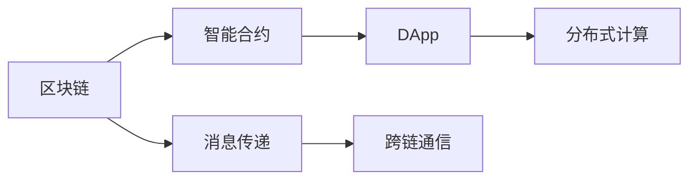

                 

# 【LangChain编程：从入门到实践】消息处理框架

> 关键词：消息传递，区块链，智能合约，分布式计算，智能应用

## 1. 背景介绍

### 1.1 问题由来

随着区块链技术的不断发展，消息处理框架（LangChain）作为其中的重要组成部分，已经逐渐成为构建去中心化应用（DApps）的核心工具。它不仅支持链上交易，还可以实现跨链交互、智能合约部署等多种功能。然而，对于多数开发者而言，这些复杂且高度耦合的功能常常让人望而却步。本文旨在通过系统化地介绍LangChain，帮助开发者从零开始，逐步深入其核心原理和应用实践。

### 1.2 问题核心关键点

LangChain作为一个消息处理框架，其核心原理是利用智能合约实现去中心化的消息传递和处理机制。它通过智能合约的触发、执行和验证，确保消息的安全性和可靠性。同时，LangChain还支持多链交互、跨链通信等功能，使得开发者可以在不同的区块链之间构建更为复杂的DApps。

LangChain的应用领域主要包括：
- 智能合约：通过部署智能合约，实现链上自动化的业务逻辑。
- 跨链交互：支持不同区块链之间的消息传递和交互。
- 分布式应用：构建基于区块链的分布式应用和去中心化市场。
- 加密通信：通过加密技术，保护消息的隐私和安全。
- 共识机制：实现区块链系统的共识验证和最终性保证。

这些核心功能使得LangChain在去中心化应用领域具备极高的应用价值和开发潜力。然而，对于缺乏区块链背景和开发经验的新手，如何高效、安全地使用LangChain进行开发仍然是一个挑战。本文将通过详细的理论讲解和实践指导，帮助读者逐步掌握LangChain的使用技巧。

### 1.3 问题研究意义

研究LangChain的消息处理框架，不仅有助于开发者掌握去中心化应用开发的关键技术，还能促进区块链技术的进一步普及和应用。通过LangChain，开发者可以构建更为安全和可靠的去中心化应用，提升区块链系统的可用性和用户体验。此外，LangChain的多链交互和跨链通信功能，为区块链技术的未来发展提供了新的可能性，打开了更广阔的应用场景。

## 2. 核心概念与联系

### 2.1 核心概念概述

为了更好地理解LangChain的核心原理，我们首先介绍几个关键概念：

- 智能合约（Smart Contract）：一种运行在区块链上的代码，通过编程方式实现自动化交易和业务逻辑。智能合约的执行结果公开透明，不可篡改。
- 消息传递（Messaging）：在区块链上，智能合约之间的通信称为消息传递。消息传递机制是构建复杂DApps的基础。
- 区块链（Blockchain）：一种分布式账本技术，通过去中心化网络和共识机制，确保数据的不可篡改和透明性。
- 分布式应用（DApp）：基于区块链技术，通过智能合约实现的去中心化应用。DApp可在多个区块链之间运行，具有高度的灵活性和扩展性。
- 分布式计算（Distributed Computing）：在多个节点上并行执行计算任务，提升系统处理能力和资源利用率。

这些概念共同构成了LangChain框架的核心。通过智能合约和消息传递，LangChain使得区块链系统具备了自动化、可编程和透明化的特性，为去中心化应用的发展提供了强大的技术支持。

### 2.2 概念间的关系

通过以下Mermaid流程图，我们可以清晰地展示LangChain各核心概念之间的关系：



这个流程图展示了区块链、智能合约、消息传递、分布式应用和分布式计算之间的关系：

1. 区块链为智能合约提供了执行环境，保证了数据的不可篡改和透明性。
2. 智能合约通过编程方式实现自动化交易和业务逻辑，是DApp的核心组件。
3. 消息传递机制使智能合约之间能够进行通信，构成复杂的DApps。
4. 跨链通信允许DApps在不同区块链之间交互，提升系统的灵活性和扩展性。
5. 分布式计算通过并行执行任务，提升了DApp的计算能力和资源利用率。

理解这些概念之间的关系，可以帮助开发者更好地把握LangChain框架的工作原理和应用场景。

## 3. 核心算法原理 & 具体操作步骤
### 3.1 算法原理概述

LangChain的消息处理框架基于智能合约和区块链技术，其核心算法原理可以概括为以下几个步骤：

1. 智能合约部署：开发者在区块链上部署智能合约，定义消息处理逻辑。
2. 消息发布与订阅：用户或系统通过智能合约发布消息，智能合约根据订阅条件将消息传递给订阅者。
3. 消息处理与验证：订阅者接收消息后，根据智能合约中的逻辑进行处理，并通过智能合约验证其执行结果。
4. 跨链通信：支持不同区块链之间的消息传递，允许DApps跨链协作。

这些步骤通过区块链的共识机制和智能合约的编程特性，确保了消息的安全性和可靠性。

### 3.2 算法步骤详解

下面是LangChain消息处理框架的详细步骤详解：

**Step 1: 准备区块链环境**
- 选择适合的区块链平台，如以太坊、Hyperledger、EOS等。
- 安装和配置区块链节点，确保节点正常运行。

**Step 2: 部署智能合约**
- 使用Solidity、SmartPy等智能合约语言编写合同逻辑。
- 在区块链上部署智能合约，并获得合约地址。

**Step 3: 发布消息**
- 使用智能合约提供的接口，发布消息。
- 确保消息的格式符合智能合约的规定。

**Step 4: 订阅消息**
- 使用智能合约提供的接口，订阅消息。
- 设定订阅条件，如接收者地址、消息内容等。

**Step 5: 接收与处理消息**
- 订阅者通过智能合约接收消息。
- 根据智能合约逻辑进行处理，如计算、存储等。

**Step 6: 验证执行结果**
- 通过智能合约验证处理结果的正确性。
- 确保结果符合预期，未被篡改。

**Step 7: 跨链交互**
- 使用智能合约支持的跨链技术，实现不同区块链之间的消息传递。
- 定义跨链接口，确保消息在跨链传输时的正确性。

### 3.3 算法优缺点

LangChain消息处理框架具有以下优点：
- 安全性高：消息传递和处理逻辑通过智能合约实现，确保了数据的不可篡改和透明性。
- 可靠性高：通过区块链的共识机制和智能合约的验证，保证了消息传递和处理结果的可靠性。
- 灵活性高：支持不同区块链之间的跨链通信，允许构建复杂、高度灵活的DApps。
- 可扩展性高：通过分布式计算技术，可以提升系统的处理能力和资源利用率。

同时，LangChain也存在一些缺点：
- 复杂度高：智能合约的编写和部署相对复杂，需要具备一定的区块链开发经验。
- 学习曲线陡：新手可能难以理解智能合约和消息传递机制，需要花费较多的时间进行学习和实践。
- 性能瓶颈：高并发情况下，智能合约的执行效率可能受限，需要优化合约代码以提升性能。

### 3.4 算法应用领域

LangChain的消息处理框架在多个领域得到了广泛应用，包括但不限于：

- 供应链管理：通过跨链通信，实现供应链各节点之间的信息共享和协同管理。
- 金融交易：实现智能合约自动化的交易和清算，提升交易的透明度和效率。
- 去中心化市场：构建基于区块链的去中心化市场，支持去中心化金融（DeFi）等应用。
- 物联网（IoT）：通过消息传递机制，实现设备间的通信和数据共享。
- 数据共享：保护数据隐私和安全，实现跨链数据共享和交换。

此外，LangChain还在智能合约审计、数字身份认证、去中心化投票等多个场景中展现了其强大的应用潜力。

## 4. 数学模型和公式 & 详细讲解 & 举例说明

### 4.1 数学模型构建

在LangChain框架中，消息传递和处理主要通过智能合约实现。假设智能合约中的消息处理逻辑为 $M(x)$，其中 $x$ 为输入消息，$M$ 为消息处理函数。智能合约的执行结果为 $y$，表示消息处理后的输出。智能合约的验证逻辑为 $V(y)$，确保处理结果的正确性和可靠性。

### 4.2 公式推导过程

以一个简单的智能合约为例，说明其消息传递和处理过程。假设智能合约接收一个交易订单，执行处理并返回处理结果：

1. 交易订单的发布：
   - 用户通过智能合约接口发布交易订单，包括订单金额、接收方地址等信息。
   - 智能合约接收订单，并进行验证，确保订单格式和内容的合法性。
2. 交易订单的处理：
   - 智能合约根据订单信息，进行计算和处理，如扣除订单金额、更新订单状态等。
   - 处理结果通过智能合约返回给发布者，包括处理状态和相关数据。
3. 交易订单的验证：
   - 发布者通过智能合约验证处理结果的正确性。
   - 确保处理结果未被篡改，符合预期。

这一过程可以用以下数学公式表示：

$$
\begin{aligned}
y &= M(x) \\
V(y) &= \begin{cases}
true, & \text{if } y \text{ is valid and correct} \\
false, & \text{otherwise}
\end{cases}
\end{aligned}
$$

其中，$M(x)$ 表示消息处理函数，$V(y)$ 表示验证函数。

### 4.3 案例分析与讲解

假设有一个基于LangChain的去中心化投票系统。该系统允许用户投票并查看投票结果。投票系统由智能合约、投票者、投票管理员等多个角色组成。

**智能合约部署**：
- 在区块链上部署智能合约，定义投票规则、投票逻辑和结果存储。
- 智能合约接收投票者提交的投票信息，并验证其合法性。

**投票发布与订阅**：
- 投票者通过智能合约接口提交投票。
- 投票管理员通过智能合约接口订阅投票结果，并通知投票者投票状态。

**投票处理与验证**：
- 智能合约根据投票规则计算投票结果。
- 投票管理员验证投票结果的正确性，并存储投票结果。

**跨链交互**：
- 通过跨链通信技术，实现不同区块链之间的投票信息传递。
- 投票管理员在多个区块链上部署智能合约，确保投票信息的同步和一致性。

通过这一案例，我们可以更清晰地理解LangChain框架在去中心化投票系统中的应用。

## 5. 项目实践：代码实例和详细解释说明

### 5.1 开发环境搭建

LangChain项目通常使用Solidity编写智能合约。安装Solidity环境，并配置好区块链节点（如以太坊测试网），是项目开发的基础。

1. 安装Solidity：
   ```bash
   npm install -g truffle solc
   ```

2. 配置区块链环境：
   - 在以太坊测试网上创建一个账户：
     ```bash
     truffle init
     ```
   - 编译智能合约：
     ```bash
     truffle compile
     ```

### 5.2 源代码详细实现

下面以一个简单的智能合约为例，展示如何部署和调用智能合约：

**智能合约部署示例**：

1. 编写智能合约代码：
   ```solidity
   pragma solidity ^0.8.0;

   contract Voting {
       uint public voteCount = 0;
       
       function vote(uint id) public {
           require(msg.sender == owner, "Not the owner");
           voteCount += 1;
       }

       function countVotes() public view returns (uint) {
           return voteCount;
       }
   }
   ```

2. 编译和部署智能合约：
   ```bash
   truffle compile
   truffle migrate --network local
   ```

3. 查询智能合约状态：
   ```bash
   truffle console
   > let contractInstance = await artifacts.require("Voting").deploy();
   > let result = await contractInstance.countVotes.call();
   > console.log(result);
   ```

**消息传递示例**：

1. 编写智能合约调用代码：
   ```javascript
   const Voting = artifacts.require("Voting");

   async function main() {
       const votingContract = await Voting.deployed();
       await votingContract.vote(1, { from: accounts[0] });
       const voteCount = await votingContract.countVotes.call();
       console.log(`Vote count: ${voteCount}`);
   }
   ```

2. 编译和运行代码：
   ```bash
   truffle compile
   truffle migrate --network local
   truffle test
   ```

### 5.3 代码解读与分析

在LangChain项目中，智能合约是核心组件，通过Solidity语言实现业务逻辑。代码中定义了投票合约，包括投票计数、投票逻辑和投票结果查询等功能。

- `voteCount` 变量：记录投票计数器，用于统计投票次数。
- `vote(uint id)` 函数：接收投票ID，将投票计数器加一。
- `countVotes()` 函数：查询投票计数器的值。

代码通过 `await` 关键字等待智能合约的异步调用结果，确保代码执行的正确性和同步性。通过 `console.log` 输出投票计数器的值，验证投票操作是否成功。

### 5.4 运行结果展示

运行上述代码后，控制台将输出投票计数器的值。如果投票操作成功，计数器将增加1。

## 6. 实际应用场景

### 6.1 智能合约审计

LangChain框架支持智能合约审计功能，允许开发者对智能合约进行全面测试和验证，确保其正确性和安全性。通过编写测试用例和审计脚本，可以检测智能合约中的漏洞和问题，提升智能合约的质量和可靠性。

### 6.2 去中心化市场

在去中心化市场中，LangChain框架可以构建基于区块链的去中心化交易所（DEX）和去中心化金融（DeFi）应用。通过智能合约自动执行交易逻辑，实现去中心化、自动化和智能化的金融服务。

### 6.3 供应链管理

在供应链管理中，LangChain框架可以实现跨链信息共享和协同管理。通过智能合约定义供应链流程和规则，确保信息传递的透明性和可靠性。

### 6.4 数据共享与交换

在数据共享与交换场景中，LangChain框架可以保护数据隐私和安全，实现跨链数据共享和交换。通过智能合约验证数据的合法性和完整性，确保数据交换的公正性和透明性。

## 7. 工具和资源推荐

### 7.1 学习资源推荐

为了帮助开发者系统掌握LangChain框架的使用，我们推荐以下学习资源：

1. Solidity官方文档：Solidity语言的官方文档，详细介绍了Solidity的语法、特性和应用场景。
2. Truffle官方文档：Truffle开发框架的官方文档，提供了智能合约部署、测试、审计等功能的使用指南。
3. LangChain官方文档：LangChain框架的官方文档，提供了框架的详细使用说明和技术支持。
4. CryptoZombies：通过有趣的游戏形式，帮助初学者学习Solidity和智能合约开发。
5. ConsenSys Academy：以太坊和区块链技术的学习平台，提供大量在线课程和实战项目。

### 7.2 开发工具推荐

 LangChain项目通常使用Solidity编写智能合约，并使用Truffle进行部署和测试。以下是推荐的开发工具：

1. Solidity IDE：如Remix、Etherscan等，提供智能合约的编写、编译和部署功能。
2. Truffle开发框架：提供了智能合约的部署、测试和审计功能，支持链上和链下开发。
3. Web3.js：提供了与区块链节点的交互接口，支持链上数据的读写和验证。
4. MetaMask：支持智能合约的链上测试和部署，提供友好的用户界面。
5. Remix：Solidity智能合约的在线开发平台，支持智能合约的编译、测试和部署。

### 7.3 相关论文推荐

 LangChain框架的应用领域广泛，涉及智能合约、区块链、分布式应用等多个领域。以下是相关论文推荐：

1. Smart Contracts: Language, Architecture, and Practice： Solidity语言的介绍和智能合约开发指南。
2. Ethereum Smart Contracts：以太坊智能合约的开发和应用案例。
3. Distributed Ledger Technologies: Consensus, Security, Protocols and Applications：区块链技术的全面介绍和应用场景分析。
4. Decentralized Autonomous Organizations：基于智能合约的自治组织设计。
5. Ethereum 2.0 Yellow Paper：以太坊2.0技术白皮书，详细介绍了以太坊2.0的架构和应用场景。

## 8. 总结：未来发展趋势与挑战

### 8.1 研究成果总结

LangChain框架作为区块链技术的重要组成部分，已经在智能合约、去中心化应用等多个领域展现出其强大的应用潜力。通过智能合约和消息传递机制，LangChain实现了数据的不可篡改和透明性，支持跨链通信和分布式计算，为区块链技术的发展提供了坚实的技术基础。

### 8.2 未来发展趋势

未来，LangChain框架将继续在区块链技术领域发挥重要作用，并呈现以下几个发展趋势：

1. 智能合约的广泛应用：智能合约将覆盖更多的业务场景，提升去中心化应用的覆盖面和应用效果。
2. 跨链通信的增强：不同区块链之间的交互将更加频繁，跨链通信技术将得到进一步优化和提升。
3. 分布式计算的普及：分布式计算技术将提升区块链系统的处理能力和资源利用率，为DApps提供更强的计算支持。
4. 区块链生态的完善：区块链生态系统的完善将进一步提升智能合约和DApps的开发和部署效率。

### 8.3 面临的挑战

尽管LangChain框架在区块链技术领域已经取得了显著成果，但仍面临一些挑战：

1. 技术门槛高：智能合约的编写和部署相对复杂，需要具备一定的区块链开发经验。
2. 安全性问题：智能合约中的漏洞和问题可能导致严重的安全事件，影响用户信任。
3. 可扩展性问题：高并发情况下，智能合约的执行效率可能受限，需要优化合约代码以提升性能。
4. 隐私保护问题：去中心化应用中，用户数据的隐私和安全问题需要得到有效解决。
5. 法规合规问题：区块链技术的发展需要符合法律法规要求，确保应用的可信性和合法性。

### 8.4 研究展望

面对LangChain框架面临的挑战，未来的研究方向包括：

1. 智能合约的安全性提升：通过代码审计、漏洞检测等技术手段，提升智能合约的安全性和可靠性。
2. 跨链通信的优化：改进跨链通信技术，提升不同区块链之间的通信效率和安全性。
3. 分布式计算的优化：优化分布式计算技术，提升DApps的计算能力和资源利用率。
4. 隐私保护的增强：通过数据加密、隐私计算等技术，保护用户数据的隐私和安全。
5. 法规合规的研究：研究区块链技术的法律法规要求，确保应用的可信性和合法性。

通过这些研究方向的研究和实践，相信LangChain框架能够更好地适应区块链技术的发展，提升去中心化应用的质量和效果。

## 9. 附录：常见问题与解答

**Q1：LangChain框架是否支持多种区块链平台？**

A: LangChain框架支持多种区块链平台，包括以太坊、Hyperledger、EOS等。开发者可以根据应用需求选择合适的区块链平台，并编写相应的智能合约。

**Q2：智能合约的部署和执行流程是怎样的？**

A: 智能合约的部署流程包括编写代码、编译和部署三个步骤。部署后，智能合约可以在区块链上执行和调用。智能合约的执行结果需要经过验证，确保其正确性和安全性。

**Q3：如何提升智能合约的安全性？**

A: 提升智能合约的安全性可以从代码审计、漏洞检测和定期更新等方面入手。定期进行智能合约的审计和安全评估，及时修复发现的问题，可以有效提升智能合约的安全性。

**Q4：跨链通信的实现有哪些技术手段？**

A: 跨链通信的实现可以通过智能合约接口、跨链协议、联盟链等多种技术手段。开发者可以根据应用需求选择适合的跨链技术，并编写相应的跨链代码。

**Q5：如何处理分布式计算中的性能瓶颈？**

A: 处理分布式计算中的性能瓶颈可以从代码优化、资源调配和负载均衡等方面入手。优化合约代码以提升执行效率，合理调配资源以平衡负载，可以显著提升分布式计算的性能。

---

作者：禅与计算机程序设计艺术 / Zen and the Art of Computer Programming

