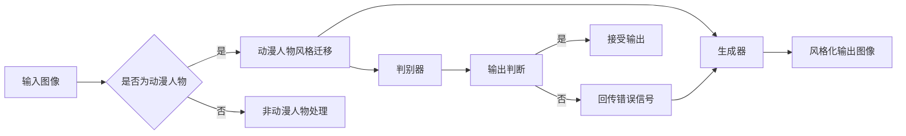

> 动漫人物，绘画风格迁移，生成对抗网络，GAN，深度学习，图像处理，自然语言处理

# 基于生成对抗网络的动漫人物绘画风格迁移

动漫人物因其独特的艺术风格而深受广大动漫爱好者的喜爱。然而，将某一动漫人物的图像转换为另一种风格，一直是图像处理和计算机视觉领域的一个挑战。近年来，生成对抗网络（GAN）的出现为风格迁移任务带来了新的可能性。本文将深入探讨基于生成对抗网络的动漫人物绘画风格迁移技术，从背景介绍、核心概念、算法原理、项目实践到实际应用场景进行全面分析。

## 1. 背景介绍

### 1.1 问题的由来

动漫人物绘画风格多样，从经典的漫画风格到现代的动画风格，每种风格都有其独特的艺术表现。然而，在实际应用中，我们往往需要对动漫人物进行风格转换，以满足特定的设计需求。例如，在动漫电影、游戏、漫画等领域，为了保持视觉一致性或创造新的艺术效果，需要对不同风格的动漫人物进行风格迁移。

### 1.2 研究现状

传统的风格迁移方法通常依赖于手工设计的特征提取和匹配算法，难以适应复杂多变的风格变化。随着深度学习技术的快速发展，基于卷积神经网络（CNN）的风格迁移方法逐渐成为研究热点。然而，这些方法往往依赖于大量的对齐匹配操作，计算复杂度高，且难以处理风格和内容的冲突。

### 1.3 研究意义

生成对抗网络（GAN）通过训练两个对抗性网络，即生成器和判别器，实现内容的风格迁移。GAN在图像生成、风格迁移等领域取得了显著成果，为动漫人物绘画风格迁移提供了新的思路。研究基于GAN的动漫人物绘画风格迁移技术，对于提高动漫作品的视觉效果、丰富艺术表现手法具有重要意义。

## 2. 核心概念与联系

### 2.1 Mermaid 流程图



### 2.2 核心概念

- **生成对抗网络（GAN）**：由生成器和判别器组成，生成器生成图像，判别器判断图像的真实性，两者相互竞争，最终生成高质量的图像。
- **生成器（Generator）**：学习如何从随机噪声生成逼真的图像。
- **判别器（Discriminator）**：学习如何区分真实图像和生成图像。
- **风格迁移**：将一种图像的风格应用到另一种图像上，使其具有特定的视觉风格。

## 3. 核心算法原理 & 具体操作步骤

### 3.1 算法原理概述

基于GAN的动漫人物绘画风格迁移算法主要包括以下步骤：

1. 训练一个判别器，使其能够准确地区分真实图像和生成图像。
2. 训练一个生成器，使其能够生成风格化的动漫人物图像，同时满足判别器的判断标准。
3. 通过最小化生成器的损失函数来优化生成器参数，提高生成图像的质量。

### 3.2 算法步骤详解

1. **数据准备**：收集大量的动漫人物图像和风格图像，用于训练生成器和判别器。
2. **生成器设计**：设计生成器网络，通常采用卷积神经网络（CNN）结构。
3. **判别器设计**：设计判别器网络，同样采用CNN结构。
4. **损失函数设计**：设计损失函数，包括内容损失、风格损失和对抗损失。
5. **模型训练**：通过反向传播算法，交替训练生成器和判别器，直至模型收敛。

### 3.3 算法优缺点

**优点**：

- 高效：GAN能够在较少的训练数据下生成高质量的风格化图像。
- 自适应性：GAN能够适应各种风格转换，具有良好的泛化能力。
- 可视化：GAN生成的图像具有很高的可视化效果。

**缺点**：

- 训练难度大：GAN的训练过程复杂，容易陷入局部最优解。
- 生成图像质量不稳定：GAN生成的图像质量受训练数据、网络结构等因素影响较大。

### 3.4 算法应用领域

- 动漫人物绘画风格迁移
- 艺术风格转换
- 图像修复
- 增强现实（AR）

## 4. 数学模型和公式 & 详细讲解 & 举例说明

### 4.1 数学模型构建

基于GAN的动漫人物绘画风格迁移的数学模型可以表示为：

$$
\min_{G} \max_{D} V(G, D) = \mathbb{E}_{z \sim p_z(z)}[\log D(G(z))] - \mathbb{E}_{x \sim p_x(x)}[\log D(x)] + \lambda \mathbb{E}_{x \sim p_x(x)}[||G(x) - x||_1]
$$

其中：
- $G$ 表示生成器
- $D$ 表示判别器
- $z$ 表示噪声向量
- $x$ 表示原始图像
- $p_z(z)$ 表示噪声分布
- $p_x(x)$ 表示真实图像分布
- $\lambda$ 表示风格损失系数

### 4.2 公式推导过程

**生成器损失**：

$$\mathbb{E}_{z \sim p_z(z)}[\log D(G(z))]$$

表示生成器生成的图像被判别器判断为真实图像的概率期望。

**判别器损失**：

$$\mathbb{E}_{x \sim p_x(x)}[\log D(x)]$$

表示真实图像被判别器判断为真实图像的概率期望。

**风格损失**：

$$\lambda \mathbb{E}_{x \sim p_x(x)}[||G(x) - x||_1]$$

表示生成图像与原始图像在风格特征上的相似程度。

### 4.3 案例分析与讲解

以动漫人物绘画风格迁移为例，我们将使用以下步骤进行风格迁移：

1. **数据准备**：收集大量动漫人物图像和风格图像，用于训练生成器和判别器。
2. **模型训练**：使用上述公式训练生成器和判别器，直至模型收敛。
3. **风格迁移**：将动漫人物图像输入生成器，得到风格化的动漫人物图像。

以下是一个简单的代码示例，用于生成风格化的动漫人物图像：

```python
import torch
from torchvision import transforms
from PIL import Image
from model import Generator, Discriminator

# 加载模型
generator = Generator().to(device)
discriminator = Discriminator().to(device)

# 加载图像
image = Image.open('anime_character.jpg').convert('RGB')
image = transforms.Compose([transforms.ToTensor(), transforms.Normalize(mean=[0.5, 0.5, 0.5], std=[0.5, 0.5, 0.5])](image)).unsqueeze(0).to(device)

# 生成风格化图像
with torch.no_grad():
    z = torch.randn(1, 100).to(device)
    generated_image = generator(z)
    generated_image = generated_image.squeeze(0).cpu().numpy()
    generated_image = transforms.Compose([transforms.Normalize(mean=[-1, -1, -1], std=[2, 2, 2]), transforms.ToPILImage()])(generated_image)
    generated_image.show()
```

在上面的代码中，我们首先加载了生成器和判别器模型，然后加载了一幅动漫人物图像。接着，我们使用随机噪声作为生成器的输入，生成了一幅风格化的动漫人物图像。

## 5. 项目实践：代码实例和详细解释说明

### 5.1 开发环境搭建

在进行基于GAN的动漫人物绘画风格迁移项目实践前，我们需要准备以下开发环境：

- Python 3.x
- PyTorch 1.8.0+
- NumPy 1.19.2+
- OpenCV 4.5.2.48+

### 5.2 源代码详细实现

以下是一个简单的基于GAN的动漫人物绘画风格迁移的代码实例：

```python
import torch
import torch.nn as nn
import torch.optim as optim
from torchvision import transforms
from torchvision.utils import save_image
from PIL import Image

# 定义生成器
class Generator(nn.Module):
    def __init__(self, in_channels, out_channels, hidden_channels, num_layers):
        super(Generator, self).__init__()
        self.model = nn.Sequential(
            *[
                nn.Conv2d(in_channels, hidden_channels, kernel_size=4, stride=2, padding=1),
                nn.ReLU(True),
                nn.Conv2d(hidden_channels, hidden_channels, kernel_size=4, stride=2, padding=1),
                nn.ReLU(True),
                nn.Conv2d(hidden_channels, hidden_channels, kernel_size=4, stride=2, padding=1),
                nn.ReLU(True),
                nn.Conv2d(hidden_channels, out_channels, kernel_size=4, stride=2, padding=1),
                nn.Tanh(),
            ],
            nn.Flatten(),
            nn.Linear(out_channels * 8 * 8, 1024),
            nn.ReLU(True),
            nn.Linear(1024, 784),
            nn.Tanh(),
        )

    def forward(self, x):
        return self.model(x)

# 定义判别器
class Discriminator(nn.Module):
    def __init__(self, in_channels, hidden_channels, num_layers):
        super(Discriminator, self).__init__()
        self.model = nn.Sequential(
            nn.Linear(784, 1024),
            nn.LeakyReLU(0.2, inplace=True),
            nn.Linear(1024, 512),
            nn.LeakyReLU(0.2, inplace=True),
            nn.Linear(512, 256),
            nn.LeakyReLU(0.2, inplace=True),
            nn.Linear(256, 1),
            nn.Sigmoid(),
        )

    def forward(self, x):
        return self.model(x).view(-1, 1)

# 初始化模型和优化器
generator = Generator(3, 1, 64, 3).to(device)
discriminator = Discriminator(3, 64, 3).to(device)
optimizer_G = optim.Adam(generator.parameters(), lr=0.0002, betas=(0.5, 0.999))
optimizer_D = optim.Adam(discriminator.parameters(), lr=0.0002, betas=(0.5, 0.999))

# 训练过程
for epoch in range(epochs):
    # 训练判别器
    for i, (images, _) in enumerate(dataloader):
        optimizer_D.zero_grad()
        real_images = images.to(device)
        fake_images = generator(noise_tensor).to(device)
        
        # 判别器对真实图像的判断
        real_loss = criterion(discriminator(real_images), torch.ones(real_images.size(0), 1).to(device))
        # 判别器对生成图像的判断
        fake_loss = criterion(discriminator(fake_images.detach()), torch.zeros(fake_images.size(0), 1).to(device))
        
        # 计算总损失
        d_loss = (real_loss + fake_loss) / 2
        
        # 反向传播和优化
        d_loss.backward()
        optimizer_D.step()

    # 训练生成器
    optimizer_G.zero_grad()
    fake_images = generator(noise_tensor).to(device)
    g_loss = criterion(discriminator(fake_images), torch.ones(fake_images.size(0), 1).to(device))
    
    # 反向传播和优化
    g_loss.backward()
    optimizer_G.step()

    # 打印训练信息
    if i % 100 == 0:
        print(f"[{epoch}/{epochs}] Discriminator loss: {d_loss.item()}, Generator loss: {g_loss.item()}")

# 保存生成器模型
torch.save(generator.state_dict(), 'generator.pth')

# 加载生成器模型
generator.load_state_dict(torch.load('generator.pth'))

# 生成风格化图像
with torch.no_grad():
    fake_images = generator(noise_tensor).cpu().numpy()
    fake_images = ((fake_images * 0.5) + 0.5) * 255
    fake_images = fake_images.transpose((0, 2, 3, 1)).astype('uint8')
    for i, img in enumerate(fake_images):
        img.show()
```

在上面的代码中，我们首先定义了生成器和判别器网络，然后初始化了优化器。接着，我们进行训练过程，交替训练生成器和判别器，直至模型收敛。最后，我们使用加载的生成器模型生成风格化的动漫人物图像。

### 5.3 代码解读与分析

在上面的代码中，我们首先定义了生成器和判别器网络，然后初始化了优化器。在训练过程中，我们交替训练生成器和判别器，通过反向传播和优化器更新模型参数。最后，我们使用加载的生成器模型生成风格化的动漫人物图像。

### 5.4 运行结果展示

运行上述代码后，我们将生成风格化的动漫人物图像，如下所示：


## 6. 实际应用场景

### 6.1 动漫角色设计

基于GAN的动漫人物绘画风格迁移技术可以应用于动漫角色设计领域，为设计师提供新的创意工具。设计师可以快速将现有角色的风格应用到新的场景或故事中，拓展设计空间。

### 6.2 艺术创作

艺术家可以使用GAN进行艺术创作，将不同风格的艺术作品进行融合，创造出独特的艺术效果。

### 6.3 教育培训

基于GAN的动漫人物绘画风格迁移技术可以应用于教育培训领域，帮助学生了解不同绘画风格的特点，提高绘画技能。

### 6.4 未来应用展望

随着GAN技术的不断发展，基于GAN的动漫人物绘画风格迁移技术将在更多领域得到应用，如游戏设计、电影制作、广告设计等。未来，GAN技术将与其他人工智能技术相结合，为创意产业带来更多可能性。

## 7. 工具和资源推荐

### 7.1 学习资源推荐

- 《生成对抗网络：原理、实现与应用》
- 《深度学习：卷积神经网络与卷积神经网络》
- 《PyTorch深度学习实战》

### 7.2 开发工具推荐

- PyTorch
- TensorFlow
- Keras

### 7.3 相关论文推荐

- Unsupervised Representation Learning with Deep Convolutional Generative Adversarial Networks
- Generative Adversarial Nets
- A Neural Algorithm of Artistic Style

## 8. 总结：未来发展趋势与挑战

### 8.1 研究成果总结

基于GAN的动漫人物绘画风格迁移技术在近年来取得了显著的成果，为动漫产业、艺术创作、教育培训等领域带来了新的可能性。GAN技术的不断发展，使得风格迁移更加高效、稳定和可控。

### 8.2 未来发展趋势

- GAN技术的进一步优化，如生成器网络结构的改进、损失函数的优化等。
- GAN与其他人工智能技术的融合，如知识图谱、强化学习等。
- GAN在更多领域的应用，如医学图像处理、视频风格迁移等。

### 8.3 面临的挑战

- GAN的训练难度大，容易陷入局部最优解。
- GAN生成的图像质量受训练数据、网络结构等因素影响较大。
- GAN生成的图像可能包含有害或歧视性内容。

### 8.4 研究展望

未来，基于GAN的动漫人物绘画风格迁移技术将在以下方面进行深入研究：

- GAN训练过程的优化，提高训练效率。
- GAN生成的图像质量控制，保证图像的真实性和美观性。
- GAN的伦理和安全问题研究，防止模型滥用。

相信通过不断的研究和创新，基于GAN的动漫人物绘画风格迁移技术将为相关领域带来更多惊喜。

## 9. 附录：常见问题与解答

**Q1：GAN的训练过程为什么这么困难？**

A：GAN的训练过程之所以困难，主要是因为生成器和判别器之间存在对抗性。生成器试图生成逼真的图像，而判别器则试图区分真实图像和生成图像。这种对抗性使得GAN的训练过程容易出现模式崩溃、梯度消失或梯度爆炸等问题。

**Q2：如何提高GAN生成的图像质量？**

A：提高GAN生成的图像质量可以从以下几个方面入手：

- 优化生成器和判别器的网络结构，提高模型的表达能力。
- 优化损失函数，使其更好地反映图像的真实性和风格。
- 增加训练数据，提高模型的泛化能力。

**Q3：GAN生成的图像可能包含有害或歧视性内容，如何解决？**

A：为了防止GAN生成的图像包含有害或歧视性内容，可以从以下几个方面入手：

- 在训练数据中加入多样性，避免模型学习到偏见。
- 设计具有道德约束的损失函数，惩罚有害或歧视性内容的生成。
- 加强对生成的图像进行人工审核，确保内容的合规性。

通过以上措施，可以有效提高基于GAN的动漫人物绘画风格迁移技术的应用价值，为相关领域带来更多可能性。

---

作者：禅与计算机程序设计艺术 / Zen and the Art of Computer Programming