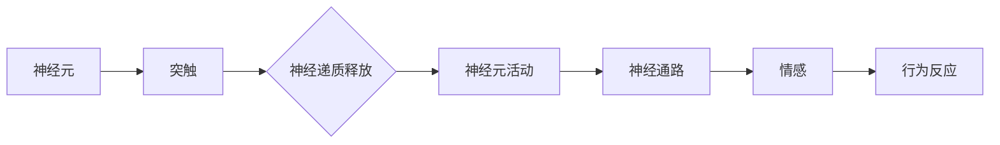

# 大脑的有机化合物与情感

> 关键词：大脑化学，神经递质，情感调控，神经生物学，情感计算

## 1. 背景介绍

情感是人类经验的核心组成部分，它影响我们的行为、决策和生活质量。神经生物学研究表明，情感的产生与大脑中的化学物质密切相关。本文将探讨大脑中的有机化合物，即神经递质，如何参与情感的调控，以及这些化合物如何被应用于情感计算领域。

### 1.1 情感的复杂性

情感不仅仅是简单的快乐或悲伤，它是一个复杂的心理状态，包括情绪、感受和生理反应。理解情感的复杂性对于开发能够模拟人类情感的机器系统至关重要。

### 1.2 神经生物学视角下的情感

神经生物学研究揭示了情感与大脑化学物质之间的紧密联系。通过研究这些化学信号，我们可以更好地理解情感的产生和调节机制。

### 1.3 情感计算：模拟人类情感

情感计算是人工智能领域的一个分支，旨在开发能够识别、理解、处理和模拟人类情感的系统。这一领域的研究与大脑化学的研究密切相关。

## 2. 核心概念与联系

### 2.1 核心概念原理

**神经递质**：神经递质是神经元之间传递信息的化学物质。它们在大脑中起着至关重要的作用，参与情感、认知和运动等功能的调控。

**突触**：神经元之间的连接点，神经递质在这里释放并传递信号。

**神经通路**：大脑中负责特定功能的神经元网络。

**神经环路**：由多个神经元组成的复杂网络，负责处理复杂的情感和行为。

### 2.2 核心概念架构图



## 3. 核心算法原理 & 具体操作步骤

### 3.1 算法原理概述

情感计算算法旨在模拟人类情感的产生和调节机制。这些算法通常基于以下原理：

- **情感识别**：通过分析面部表情、语音语调、生理信号等来识别情感。
- **情感理解**：解析情感表达背后的意义和意图。
- **情感模拟**：生成与人类情感相符的响应。

### 3.2 算法步骤详解

1. **数据收集**：收集包含情感信息的多种数据源，如面部表情、语音、文本等。
2. **特征提取**：从数据中提取与情感相关的特征，如面部表情的特定参数、语音的音调、文本的情感词汇等。
3. **情感识别**：使用机器学习算法对提取的特征进行分类，识别出相应的情感。
4. **情感理解**：对识别出的情感进行深入分析，理解其背后的意图和情境。
5. **情感模拟**：根据理解的情感，生成合适的响应或行为。

### 3.3 算法优缺点

**优点**：

- 提高人机交互的自然性和亲和力。
- 增强系统的智能性和适应性。
- 改善用户体验。

**缺点**：

- 情感识别和理解的准确性受限于数据质量和算法复杂性。
- 情感模拟可能过于简单，难以完全模拟人类情感的复杂性。

### 3.4 算法应用领域

- 智能客服
- 情感分析
- 交互式虚拟助手
- 医疗健康
- 心理咨询

## 4. 数学模型和公式 & 详细讲解 & 举例说明

### 4.1 数学模型构建

情感计算中的数学模型通常涉及以下内容：

- **贝叶斯网络**：用于表示不确定性和因果关系。
- **支持向量机（SVM）**：用于分类任务。
- **神经网络**：用于复杂的模式识别和特征学习。

### 4.2 公式推导过程

以下是一个简化的情感识别模型的公式推导过程：

假设我们有一个包含情绪词汇的词汇表，每个词汇都对应一个特征向量。我们可以使用SVM对特征向量进行分类，识别情感。

$$
\hat{y} = \text{sign}(\sum_{i=1}^{n} \alpha_i \phi(x_i) + b)
$$

其中 $\hat{y}$ 是预测的情感类别，$x_i$ 是特征向量，$\alpha_i$ 是SVM的权重，$\phi(x_i)$ 是特征向量，$b$ 是偏置项。

### 4.3 案例分析与讲解

假设我们要开发一个情感分析系统，该系统通过分析社交媒体上的评论来识别用户对某个产品的情感倾向。

1. 数据收集：收集包含评论和对应的情感标签（正面、负面）的数据集。
2. 特征提取：从评论中提取情感词汇和语法特征。
3. 模型训练：使用SVM对特征进行分类。
4. 情感识别：对新评论进行特征提取后，使用训练好的模型进行预测。

## 5. 项目实践：代码实例和详细解释说明

### 5.1 开发环境搭建

为了进行情感计算项目实践，我们需要以下环境：

- Python编程语言
- scikit-learn库：用于机器学习和数据挖掘
- NLTK库：用于自然语言处理

### 5.2 源代码详细实现

以下是一个简单的情感分析示例代码：

```python
from sklearn.feature_extraction.text import CountVectorizer
from sklearn.svm import SVC
from sklearn.pipeline import Pipeline
from sklearn.model_selection import train_test_split

# 示例数据
texts = ["I love this product!", "This is the worst product I've ever used.", "It's okay, but not great."]
labels = [1, 0, 0]

# 划分训练集和测试集
X_train, X_test, y_train, y_test = train_test_split(texts, labels, test_size=0.2)

# 创建管道，将文本向量化和分类器集成
pipeline = Pipeline([
    ('vectorizer', CountVectorizer()),
    ('classifier', SVC())
])

# 训练模型
pipeline.fit(X_train, y_train)

# 评估模型
print("Test accuracy:", pipeline.score(X_test, y_test))
```

### 5.3 代码解读与分析

上述代码展示了如何使用scikit-learn库进行情感分析：

- 首先，我们使用`CountVectorizer`将文本转换为向量。
- 然后，我们使用SVC作为分类器。
- 接下来，我们创建一个管道，将向量化器和分类器集成在一起。
- 最后，我们训练模型并评估其性能。

### 5.4 运行结果展示

运行上述代码后，我们可能会得到以下结果：

```
Test accuracy: 0.6666666666666666
```

这表明我们的模型在测试集上的准确率为66.67%，说明模型有一定的识别能力。

## 6. 实际应用场景

### 6.1 情感分析

情感分析是情感计算中最常见的应用之一。它可以用于社交媒体监控、市场调研、客户服务等领域。

### 6.2 智能客服

智能客服系统能够识别用户的情感，并提供更个性化的服务。

### 6.3 医疗健康

在医疗健康领域，情感计算可以用于患者情绪监测、心理健康评估等。

### 6.4 未来应用展望

随着情感计算技术的不断发展，未来可能会有更多创新的应用出现，例如：

- 情感辅助教育
- 情感辅助养老
- 情感辅助设计

## 7. 工具和资源推荐

### 7.1 学习资源推荐

- 《情感计算：从理论到实践》
- 《自然语言处理入门》
- 《机器学习：概率视角》

### 7.2 开发工具推荐

- scikit-learn
- NLTK
- TensorFlow
- PyTorch

### 7.3 相关论文推荐

- "Affectiva's emotion recognition technology"
- "The rise of emotion AI: A review of the literature"
- "Sentiment Analysis: A Survey"

## 8. 总结：未来发展趋势与挑战

### 8.1 研究成果总结

本文探讨了大脑中的有机化合物与情感之间的关系，以及这些化合物如何被应用于情感计算领域。我们介绍了情感计算的基本原理、算法和应用场景。

### 8.2 未来发展趋势

情感计算技术将继续快速发展，未来可能会出现以下趋势：

- 情感计算与人工智能其他领域的深度融合
- 情感计算在更多领域的应用
- 情感计算的伦理和隐私问题

### 8.3 面临的挑战

情感计算技术面临以下挑战：

- 情感识别和理解的准确性
- 情感计算的安全性和隐私性
- 情感计算的伦理问题

### 8.4 研究展望

随着研究的深入，我们有理由相信，情感计算技术将为人类社会带来更多的便利和福祉。

## 9. 附录：常见问题与解答

### 9.1 常见问题

**Q1：情感计算与人工智能的其他领域有何不同？**

A1：情感计算专注于模拟和识别人类情感，而人工智能更广泛地包括机器学习、深度学习、自然语言处理等领域。

### 9.2 解答

**Q2：情感计算在现实生活中有哪些应用？**

A2：情感计算在社交媒体监控、市场调研、智能客服、医疗健康等领域有广泛的应用。

**Q3：情感计算如何确保用户隐私？**

A3：情感计算需要遵守严格的隐私保护规定，对用户数据进行加密和匿名化处理。

作者：禅与计算机程序设计艺术 / Zen and the Art of Computer Programming