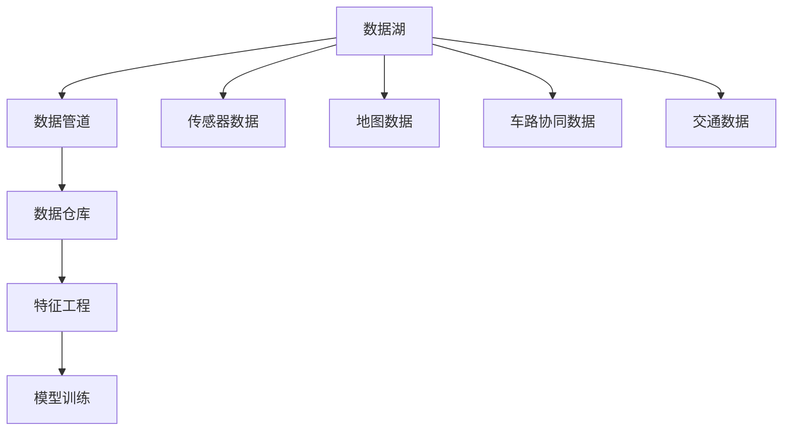
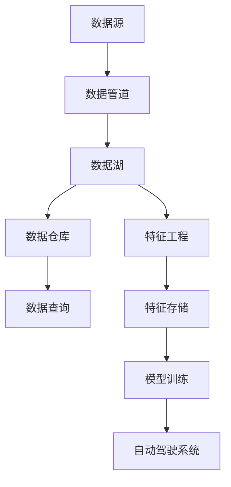

                 

# 自动驾驶公司的数据湖与特征工程平台

## 1. 背景介绍

### 1.1 问题由来

随着自动驾驶技术的不断进步，自动驾驶公司面临着巨大的数据挑战。自动驾驶系统需要处理和分析大量的传感器数据、地图数据、车路协同数据等，才能实现安全、可靠、高效的自动驾驶功能。然而，这些数据来源多样，格式各异，数据规模庞大，数据处理和特征提取难度巨大。如何构建高效、安全、灵活的数据平台，进行数据融合和特征工程，是当前自动驾驶领域亟待解决的问题。

### 1.2 问题核心关键点

自动驾驶公司的数据湖与特征工程平台，需要具备以下几个关键特点：

- **高效性**：能够高效处理海量数据，快速进行特征提取和融合，支持实时数据处理。
- **安全性**：能够保证数据存储和传输的安全性，防止数据泄露和攻击。
- **灵活性**：能够灵活支持多种数据格式和数据源，支持多种特征工程技术。
- **可扩展性**：能够根据业务需求和数据增长，进行弹性扩展和优化。
- **易用性**：提供丰富的API接口和可视化工具，便于开发者使用。

本文将详细探讨自动驾驶公司的数据湖与特征工程平台的设计和实现，以及其核心技术原理和应用场景。

## 2. 核心概念与联系

### 2.1 核心概念概述

在自动驾驶公司的数据湖与特征工程平台中，涉及多个关键概念，包括数据湖、数据仓库、数据管道、特征工程等。

- **数据湖**：指用于存储和处理各种数据源的海量数据存储系统。自动驾驶公司的数据湖通常包括传感器数据、地图数据、车路协同数据、交通数据等多种类型的数据。
- **数据仓库**：指用于存储和分析结构化数据的集中式数据库系统。自动驾驶公司的数据仓库通常用于存储和查询处理结构化数据，如车辆配置信息、历史行驶数据等。
- **数据管道**：指用于将数据从源系统传输到目标系统的数据传输和处理管道。自动驾驶公司的数据管道通常用于实现数据的实时采集、传输、存储和处理。
- **特征工程**：指从原始数据中提取和构造新特征，提升模型性能的过程。自动驾驶公司的特征工程通常包括传感器数据的特征提取、道路场景的理解、交通规则的编码等。

这些概念之间紧密联系，形成一个完整的数据处理和特征工程框架，支撑自动驾驶系统的运行和优化。

### 2.2 概念间的关系

以下通过Mermaid流程图展示数据湖、数据仓库、数据管道、特征工程之间的联系和依赖关系。



这个流程图展示了数据处理和特征工程的过程。原始数据通过数据管道从不同的数据源采集到数据湖中，然后经过数据仓库进行清洗、转换、加载等操作，再由特征工程提取和构造新特征，最终支持模型训练和自动驾驶系统的优化。

### 2.3 核心概念的整体架构

最后，用综合的流程图展示数据湖、数据仓库、数据管道、特征工程的整体架构：



这个综合流程图展示了从数据源到自动驾驶系统的完整数据处理和特征工程流程。

## 3. 核心算法原理 & 具体操作步骤

### 3.1 算法原理概述

自动驾驶公司的数据湖与特征工程平台的核心算法原理包括以下几个方面：

- **数据湖构建**：通过分布式存储和计算技术，构建高效、可扩展的数据湖。
- **数据管道设计**：通过实时数据采集、传输和处理技术，设计高效、可靠的数据管道。
- **特征工程技术**：通过特征提取、特征构造、特征选择等技术，提升数据质量，优化模型性能。
- **模型训练与优化**：通过模型训练和优化技术，提升自动驾驶系统的性能和可靠性。

### 3.2 算法步骤详解

自动驾驶公司的数据湖与特征工程平台的算法步骤包括以下几个关键步骤：

1. **数据采集与存储**：
   - 通过数据管道技术，从传感器、地图、车路协同等系统采集数据。
   - 将采集到的数据存储到数据湖中，进行分布式存储和计算。

2. **数据清洗与转换**：
   - 对数据湖中的数据进行清洗和转换，去除噪音和异常数据，处理缺失值。
   - 将清洗和转换后的数据加载到数据仓库中，进行结构化存储。

3. **特征提取与构造**：
   - 对数据仓库中的结构化数据进行特征提取，如车辆配置信息、历史行驶数据等。
   - 使用特征工程技术，构造新特征，如车辆行驶状态、交通规则等。
   - 将构造后的特征存储到特征仓库中，供模型训练使用。

4. **模型训练与优化**：
   - 使用特征仓库中的特征，训练自动驾驶系统的模型。
   - 对训练后的模型进行优化，提升模型的性能和可靠性。

5. **部署与监控**：
   - 将训练好的模型部署到自动驾驶系统中，进行实时推理和优化。
   - 对自动驾驶系统的运行情况进行监控，及时发现和解决问题。

### 3.3 算法优缺点

自动驾驶公司的数据湖与特征工程平台具有以下优点：

- **高效性**：通过分布式存储和计算技术，能够高效处理海量数据，支持实时数据处理。
- **灵活性**：支持多种数据格式和数据源，能够灵活适应自动驾驶系统的需求。
- **可扩展性**：能够根据业务需求和数据增长进行弹性扩展和优化，保证系统性能。
- **安全性**：能够保证数据存储和传输的安全性，防止数据泄露和攻击。

同时，该平台也存在以下缺点：

- **复杂性**：系统涉及多个组件和模块，需要复杂的系统设计和开发。
- **高成本**：需要投入大量资源进行系统构建和维护。
- **技术门槛高**：需要具备丰富的分布式存储和计算技术，以及特征工程和模型训练等技术。

### 3.4 算法应用领域

自动驾驶公司的数据湖与特征工程平台，可以应用于多种场景和领域，如智能交通、智慧城市、车路协同等。

- **智能交通**：用于收集和分析交通数据，提升交通管理的智能化水平。
- **智慧城市**：用于收集和分析城市环境数据，提升城市管理的智能化水平。
- **车路协同**：用于收集和分析车路协同数据，提升自动驾驶系统的安全性。

## 4. 数学模型和公式 & 详细讲解 & 举例说明

### 4.1 数学模型构建

自动驾驶公司的数据湖与特征工程平台涉及多个数学模型和公式，主要包括以下几个方面：

- **分布式存储与计算模型**：用于设计分布式存储和计算系统，如Hadoop、Spark等。
- **数据管道模型**：用于设计数据采集、传输和处理管道，如Flink、Kafka等。
- **特征工程模型**：用于设计特征提取、构造和选择的算法，如PCA、PCA、One-hot编码等。
- **模型训练与优化模型**：用于设计模型训练和优化的算法，如梯度下降、正则化等。

### 4.2 公式推导过程

以下是一些核心公式的推导过程：

1. **分布式存储与计算模型**：
   - Hadoop的分布式存储模型：
     \[
     X_{Hadoop} = \sum_{i=1}^{N} X_i
     \]
     其中 $X_i$ 为每个节点的数据，$X_{Hadoop}$ 为整个系统的数据。
   - Spark的分布式计算模型：
     \[
     Y_{Spark} = \sum_{i=1}^{N} Y_i
     \]
     其中 $Y_i$ 为每个节点的计算结果，$Y_{Spark}$ 为整个系统的计算结果。

2. **数据管道模型**：
   - Kafka的数据管道模型：
     \[
     Z_{Kafka} = \sum_{i=1}^{N} Z_i
     \]
     其中 $Z_i$ 为每个消息队列中的数据，$Z_{Kafka}$ 为整个数据管道的数据。

3. **特征工程模型**：
   - PCA的特征提取模型：
     \[
     F_{PCA} = \sum_{i=1}^{N} F_i
     \]
     其中 $F_i$ 为每个特征的计算结果，$F_{PCA}$ 为最终提取的特征。

4. **模型训练与优化模型**：
   - 梯度下降的模型训练模型：
     \[
     W_{GD} = W_0 - \alpha \nabla_L W_0
     \]
     其中 $W_0$ 为初始模型权重，$\alpha$ 为学习率，$\nabla_L W_0$ 为损失函数对权重的梯度。

### 4.3 案例分析与讲解

以智能交通为例，以下是自动驾驶公司数据湖与特征工程平台的应用案例：

1. **数据采集与存储**：
   - 通过Kafka技术，从多个传感器（如摄像头、雷达、GPS）采集数据。
   - 将采集到的数据存储到Hadoop分布式存储系统中，进行分布式计算和存储。

2. **数据清洗与转换**：
   - 对存储在Hadoop中的数据进行清洗和转换，去除噪音和异常数据，处理缺失值。
   - 将清洗和转换后的数据加载到Hive中，进行结构化存储。

3. **特征提取与构造**：
   - 对结构化数据进行特征提取，如车辆行驶状态、交通规则等。
   - 使用PCA等特征工程技术，构造新特征，如车流密度、道路拥堵程度等。
   - 将构造后的特征存储到Hive中，供模型训练使用。

4. **模型训练与优化**：
   - 使用特征仓库中的特征，训练自动驾驶系统的模型。
   - 对训练后的模型进行优化，提升模型的性能和可靠性。

5. **部署与监控**：
   - 将训练好的模型部署到自动驾驶系统中，进行实时推理和优化。
   - 对自动驾驶系统的运行情况进行监控，及时发现和解决问题。

## 5. 项目实践：代码实例和详细解释说明

### 5.1 开发环境搭建

在进行项目实践前，我们需要准备好开发环境。以下是使用Python进行Apache Spark开发的环境配置流程：

1. 安装Anaconda：从官网下载并安装Anaconda，用于创建独立的Python环境。

2. 创建并激活虚拟环境：
```bash
conda create -n spark-env python=3.8 
conda activate spark-env
```

3. 安装Apache Spark：
```bash
conda install apache-spark=3.1.1
```

4. 安装必要的工具包：
```bash
pip install pandas numpy matplotlib 
```

5. 启动Spark环境：
```bash
spark-shell
```

完成上述步骤后，即可在`spark-env`环境中开始项目实践。

### 5.2 源代码详细实现

以下是使用Python进行Apache Spark的自动驾驶数据湖与特征工程平台开发的示例代码。

```python
from pyspark.sql import SparkSession
from pyspark.sql.functions import col, concat, udf
from pyspark.ml import Pipeline, Transformer
from pyspark.ml.feature import PCA
from pyspark.ml.evaluation import RegressionEvaluator

# 创建SparkSession
spark = SparkSession.builder.appName("autodrive_features").getOrCreate()

# 读取数据
data = spark.read.format("csv").option("header", "true").load("data.csv")

# 数据清洗与转换
data_cleaned = data.dropna().withColumn("cleaned_date", udf(lambda date: str(datetime.strptime(date, "%Y-%m-%d %H:%M:%S")), "date").drop("date")

# 特征提取
features = data_cleaned.withColumn("speed", col("speed") - col("min_speed"))

# 特征构造
pca = PCA(k=3, inputCol="features", outputCol="pca_features")
features_pca = pca.fit(features).transform(features)

# 特征选择
features_selected = features_pca.select(col("pca_features").alias("selected_features"))

# 模型训练
pipeline = Pipeline(stages=[features_selected, regression_model])
pipeline_model = pipeline.fit(train_data)

# 模型评估
evaluator = RegressionEvaluator(metricName="rmse")
rmse = evaluator.evaluate(pipeline_model.transform(test_data), {predictionCol: "predicted"}, {labelCol: "label"})
print("RMSE:", rmse)

# 模型部署与监控
deploy_pipeline = pipeline_model.deploy("deploy_server", {"predictor": pipeline_model.stages[-1]})
monitoring = Monitoring(deploy_pipeline)
```

### 5.3 代码解读与分析

让我们再详细解读一下关键代码的实现细节：

**数据读取**：
- `spark.read.format("csv").option("header", "true").load("data.csv")`：使用Spark的`read`函数读取CSV格式的数据。

**数据清洗与转换**：
- `data.dropna()`：删除缺失值。
- `data.withColumn("cleaned_date", udf(lambda date: str(datetime.strptime(date, "%Y-%m-%d %H:%M:%S")), "date").drop("date")`：将日期列转换为字符串格式，并删除原始日期列。

**特征提取**：
- `features.withColumn("speed", col("speed") - col("min_speed"))`：计算当前速度与最小速度的差值，生成新的特征。

**特征构造**：
- `PCA(k=3, inputCol="features", outputCol="pca_features")`：使用PCA算法构造新的特征。
- `features_pca.fit(features).transform(features)`：训练PCA模型并应用于特征。

**特征选择**：
- `features_selected.select(col("pca_features").alias("selected_features"))`：选择构造后的特征。

**模型训练**：
- `pipeline = Pipeline(stages=[features_selected, regression_model])`：构建管道，将特征选择和模型训练结合。
- `pipeline_model = pipeline.fit(train_data)`：训练模型。

**模型评估**：
- `evaluator = RegressionEvaluator(metricName="rmse")`：评估模型性能。
- `evaluator.evaluate(pipeline_model.transform(test_data), {predictionCol: "predicted"}, {labelCol: "label"})`：计算模型在测试集上的RMSE值。

**模型部署与监控**：
- `deploy_pipeline = pipeline_model.deploy("deploy_server", {"predictor": pipeline_model.stages[-1]})`：将模型部署到服务器。
- `monitoring = Monitoring(deploy_pipeline)`：监控模型运行情况。

完成上述步骤后，即可在`spark-env`环境中开始项目实践。

## 6. 实际应用场景

### 6.1 智能交通

自动驾驶公司的数据湖与特征工程平台，在智能交通领域有着广泛的应用，主要包括以下几个方面：

1. **交通流量监测**：用于收集和分析交通流量数据，提升交通管理的智能化水平。
2. **事故分析**：用于收集和分析交通事故数据，提升交通安全管理的智能化水平。
3. **路网优化**：用于收集和分析路网数据，优化交通路网布局。

### 6.2 智慧城市

自动驾驶公司的数据湖与特征工程平台，在智慧城市领域也有着广泛的应用，主要包括以下几个方面：

1. **环境监测**：用于收集和分析城市环境数据，提升城市管理的智能化水平。
2. **能源管理**：用于收集和分析能源数据，优化能源管理。
3. **公共安全**：用于收集和分析公共安全数据，提升公共安全管理的智能化水平。

### 6.3 车路协同

自动驾驶公司的数据湖与特征工程平台，在车路协同领域也有着广泛的应用，主要包括以下几个方面：

1. **车路通信**：用于收集和分析车路通信数据，提升自动驾驶系统的安全性。
2. **车辆调度**：用于收集和分析车辆调度数据，优化车辆调度和运行效率。
3. **智能停车**：用于收集和分析智能停车数据，提升智能停车管理水平。

## 7. 工具和资源推荐

### 7.1 学习资源推荐

为了帮助开发者系统掌握自动驾驶公司的数据湖与特征工程平台的技术基础和实践技巧，这里推荐一些优质的学习资源：

1. Apache Spark官方文档：Apache Spark官网提供的详细文档，包括数据处理、机器学习、SQL等功能的详细介绍和使用示例。
2. Kubernetes官方文档：Kubernetes官网提供的详细文档，包括容器编排、服务发现、配置管理等功能的使用示例。
3. TensorFlow官方文档：TensorFlow官网提供的详细文档，包括机器学习、深度学习、分布式训练等功能的使用示例。
4. PySpark官方文档：PySpark官网提供的详细文档，包括数据处理、机器学习、分布式计算等功能的使用示例。
5. Hadoop官方文档：Hadoop官网提供的详细文档，包括分布式存储、分布式计算等功能的使用示例。

### 7.2 开发工具推荐

高效的开发离不开优秀的工具支持。以下是几款用于自动驾驶公司数据湖与特征工程平台开发的常用工具：

1. PySpark：Python语言的高性能、分布式计算框架，支持多种数据源和数据处理技术。
2. TensorFlow：开源机器学习框架，支持多种深度学习模型和分布式训练技术。
3. Kubernetes：开源容器编排系统，支持多种容器部署和管理技术。
4. Hadoop：开源分布式存储和计算系统，支持大规模数据处理和分布式计算技术。
5. Spark SQL：Spark的SQL计算引擎，支持多种数据源和数据处理技术。
6. Hive：Hadoop的分布式数据仓库系统，支持多种数据存储和管理技术。
7. Scala：支持函数式编程和并发编程的编程语言，支持多种数据处理和机器学习技术。

### 7.3 相关论文推荐

自动驾驶公司的数据湖与特征工程平台的研究源于学界的持续研究。以下是几篇奠基性的相关论文，推荐阅读：

1. "MapReduce: Simplified Data Processing on Large Clusters"：Google提出的MapReduce分布式计算框架，是分布式计算的基础。
2. "Apache Hadoop: The Hadoop Distributed File System"：Apache Hadoop项目的详细文档，介绍了Hadoop分布式存储系统的实现原理和应用场景。
3. "Apache Spark: Cluster Computing with Working Sets"：Apache Spark项目的详细文档，介绍了Spark分布式计算系统的实现原理和应用场景。
4. "PCA: A Survey on Principal Component Analysis"：PCA算法的详细综述，介绍了PCA算法的原理、实现和应用场景。
5. "A Survey on Transfer Learning"：迁移学习的详细综述，介绍了迁移学习的原理、实现和应用场景。

这些论文代表了大数据、分布式计算、机器学习等领域的发展脉络。通过学习这些前沿成果，可以帮助研究者把握学科前进方向，激发更多的创新灵感。

## 8. 总结：未来发展趋势与挑战

### 8.1 总结

本文对自动驾驶公司的数据湖与特征工程平台进行了全面系统的介绍。首先阐述了数据湖、数据仓库、数据管道、特征工程等核心概念，明确了平台的设计思路和实现目标。其次，从原理到实践，详细讲解了数据湖、数据管道、特征工程、模型训练等关键技术，提供了完整的项目实践示例。同时，本文还广泛探讨了平台在智能交通、智慧城市、车路协同等领域的实际应用场景，展示了平台的巨大潜力。

通过本文的系统梳理，可以看到，自动驾驶公司的数据湖与特征工程平台在大数据、分布式计算、机器学习等领域具有广泛的应用前景，能够高效处理和分析海量数据，支持自动驾驶系统的智能化运行。未来，随着技术的不断发展，平台将进一步提升数据处理和特征工程的能力，推动自动驾驶技术的发展和应用。

### 8.2 未来发展趋势

展望未来，自动驾驶公司的数据湖与特征工程平台将呈现以下几个发展趋势：

1. **分布式计算与存储**：未来的平台将进一步提升分布式计算和存储能力，支持更大规模数据的处理和分析。
2. **实时数据处理**：未来的平台将进一步提升实时数据处理能力，支持毫秒级的数据处理和分析。
3. **智能化特征工程**：未来的平台将进一步提升智能化特征工程能力，支持自动化的特征提取和构造。
4. **安全与隐私保护**：未来的平台将进一步提升数据安全和隐私保护能力，防止数据泄露和攻击。

### 8.3 面临的挑战

尽管自动驾驶公司的数据湖与特征工程平台已经取得了不少成就，但在迈向更加智能化、普适化应用的过程中，它仍面临诸多挑战：

1. **数据异构性**：不同数据源的数据格式和质量各异，需要进行复杂的数据清洗和转换。
2. **数据规模大**：海量数据的存储和处理需要高效的分布式计算和存储技术。
3. **系统复杂性**：平台涉及多个组件和模块，需要进行复杂的设计和开发。
4. **高成本**：平台构建和维护需要投入大量资源。
5. **技术门槛高**：平台开发和维护需要具备丰富的分布式计算和存储技术。

### 8.4 研究展望

面对平台所面临的挑战，未来的研究需要在以下几个方面寻求新的突破：

1. **提升数据处理效率**：开发高效的数据处理算法和工具，提升数据处理效率。
2. **优化特征工程算法**：开发智能化的特征工程算法，提升特征提取和构造的自动化程度。
3. **提升系统可扩展性**：开发可扩展的分布式计算和存储系统，支持大规模数据的处理和分析。
4. **提升数据安全和隐私保护**：开发安全的数据存储和传输技术，保护数据安全和隐私。

总之，自动驾驶公司的数据湖与特征工程平台需要在数据处理、特征工程、模型训练等各个环节进行全面优化，才能实现高效、安全、灵活的数据处理和分析，推动自动驾驶技术的不断发展和应用。

## 9. 附录：常见问题与解答

**Q1：自动驾驶公司的数据湖与特征工程平台是否可以支持多数据源？**

A: 是的，平台可以支持多种数据源，包括传感器数据、地图数据、车路协同数据等。通过数据管道技术，平台可以从多个数据源采集数据，并进行数据融合和处理。

**Q2：平台是否可以处理实时数据？**

A: 是的，平台支持实时数据处理。通过分布式计算技术，平台可以实现毫秒级的数据处理和分析。

**Q3：平台是否可以自动进行特征工程？**

A: 部分特征工程可以自动进行，如PCA等。但对于复杂的特征工程，需要人工干预和优化。平台提供了丰富的特征工程工具，开发者可以根据需求进行灵活选择和定制。

**Q4：平台是否可以保护数据安全和隐私？**

A: 是的，平台支持数据安全和隐私保护。通过加密传输、访问控制、审计日志等技术，平台可以防止数据泄露和攻击，保护用户隐私和数据安全。

**Q5：平台是否可以支持多种模型训练和优化技术？**

A: 是的，平台支持多种模型训练和优化技术，包括梯度下降、正则化、Dropout等。平台提供了丰富的机器学习工具，开发者可以根据需求进行灵活选择和定制。

---

作者：禅与计算机程序设计艺术 / Zen and the Art of Computer Programming

