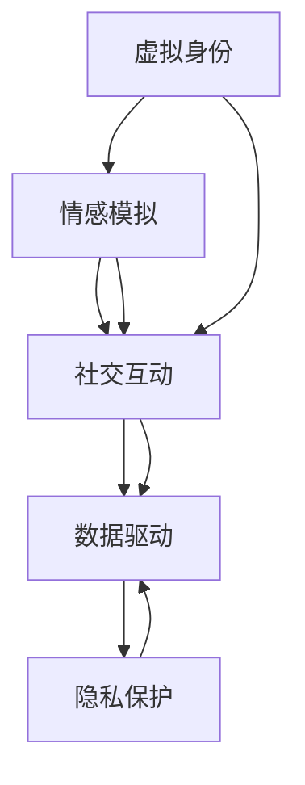
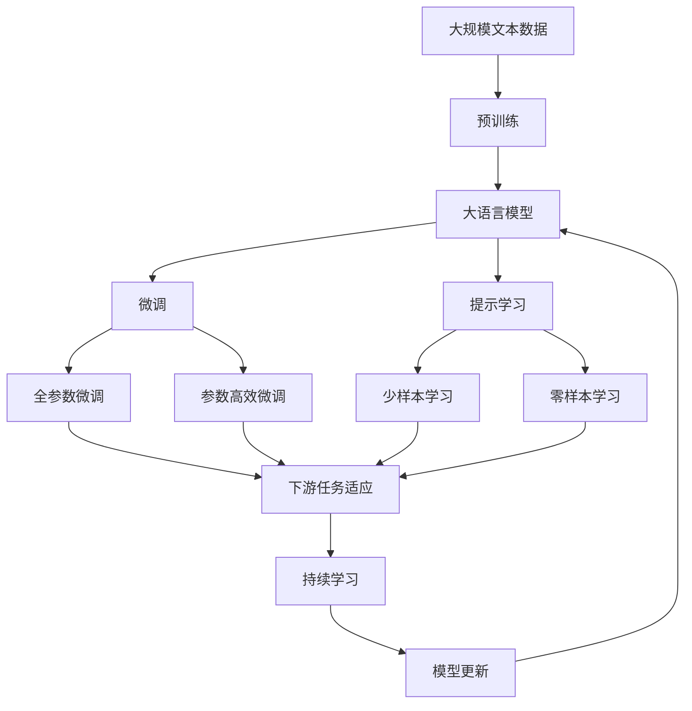

                 

# 虚拟关系：AI时代的亲密之旅

> 关键词：虚拟关系, AI, 亲密, 社交网络, 算法, 情感分析, 人机交互

## 1. 背景介绍

在数字化浪潮席卷全球的今天，人类社会正迎来一场前所未有的亲密革命。虚拟关系，作为人工智能时代的新兴产物，正在深刻地改变着人们的社交方式、情感交流和心理体验。本文将深入探讨虚拟关系的本质、核心概念及其与AI技术的联系，为我们揭开这一新时代亲密之旅的神秘面纱。

### 1.1 问题由来

随着智能设备和互联网的普及，人们的社交活动日益迁移到虚拟空间。传统的面对面交流逐渐被虚拟沟通所取代，人们通过社交网络、即时通讯工具、虚拟现实环境等方式，建立了复杂多样的人际关系网络。然而，这些虚拟关系究竟是什么？它们如何影响人类的情感和行为？这些问题亟待解答。

### 1.2 问题核心关键点

虚拟关系的核心在于通过AI技术，构建虚拟世界中的社交互动和情感连接。其关键点包括：

- **虚拟身份**：在虚拟空间中，人们可以通过AI算法生成或定制化虚拟形象，这些虚拟形象在沟通中扮演重要角色。
- **情感模拟**：AI系统通过情感分析、生成对抗网络(GAN)等技术，模拟人类的情感表达和反应。
- **社交互动**：AI技术为虚拟关系提供了丰富的互动工具，如自然语言处理、机器人仿真、游戏AI等，使得虚拟社交更加自然流畅。
- **数据驱动**：虚拟关系往往依赖大量的用户数据进行训练和优化，通过数据反馈不断提升互动质量。

### 1.3 问题研究意义

研究虚拟关系，对于理解人工智能在人类情感和社交领域的应用具有重要意义。它不仅能够揭示虚拟世界中的人际交往规律，还为优化AI算法、提升人机互动体验提供了理论基础。此外，虚拟关系的发展也为应对现代社会孤独、焦虑等心理问题提供了新思路。

## 2. 核心概念与联系

### 2.1 核心概念概述

虚拟关系作为AI时代的新型社交方式，涉及多个关键概念：

- **虚拟身份**：通过AI技术生成的虚拟形象，具备与真人类似的外观、行为和情感。
- **情感模拟**：AI系统基于情感分析、生成对抗网络等技术，模拟人类的情感和反应，增强互动的真实感。
- **社交互动**：利用自然语言处理、游戏AI等技术，构建虚拟环境中的交流、合作和竞争。
- **数据驱动**：通过收集和分析用户行为数据，优化AI系统的互动策略，提升用户体验。
- **隐私保护**：在虚拟关系中，保护用户隐私和数据安全至关重要，涉及数据加密、匿名化处理等技术。

### 2.2 概念间的关系

这些核心概念之间存在着紧密的联系，构成了虚拟关系的完整生态系统。以下通过一个Mermaid流程图来展示它们之间的关系：



该流程图展示了虚拟关系从生成到优化的全过程：首先通过AI技术生成虚拟身份，然后利用情感模拟技术增强互动真实感，接着通过社交互动手段丰富虚拟关系内容，最后通过数据驱动和隐私保护，优化AI系统以提升用户体验。

### 2.3 核心概念的整体架构

最后，我们用一个综合的流程图来展示这些核心概念在大语言模型微调过程中的整体架构：



这个综合流程图展示了从预训练到微调，再到持续学习的完整过程。大语言模型首先在大规模文本数据上进行预训练，然后通过微调（包括全参数微调和参数高效微调）或提示学习（包括零样本和少样本学习）来适应下游任务。最后，通过持续学习技术，模型可以不断更新和适应新的任务和数据。

## 3. 核心算法原理 & 具体操作步骤
### 3.1 算法原理概述

虚拟关系的构建，本质上是一个多模态数据融合和情感分析的过程。其核心算法包括情感分析、生成对抗网络、自然语言处理等。以下将详细阐述这些算法的原理。

### 3.2 算法步骤详解

#### 3.2.1 情感分析

情感分析是通过AI技术识别和理解文本、语音中的情感倾向，通常包括文本情感分析和语音情感分析两部分。其基本步骤如下：

1. **数据预处理**：清洗文本和语音数据，去除噪声和无关信息。
2. **特征提取**：使用词袋模型、TF-IDF等技术，提取文本特征；或使用频谱、能量等特征，提取语音特征。
3. **情感分类**：使用分类器（如支持向量机、随机森林等）或神经网络（如卷积神经网络、循环神经网络等）对特征进行分类，识别出情感极性（如正面、负面、中性）。
4. **情感生成**：利用生成对抗网络等技术，生成符合特定情感的文本或语音，增强虚拟互动的真实感。

#### 3.2.2 生成对抗网络

生成对抗网络（GAN）是一种通过对抗训练生成高质量虚拟形象的技术。其基本步骤如下：

1. **数据收集**：收集大量真实形象数据，包括人脸、身体等。
2. **网络结构设计**：设计生成器和判别器网络结构，通常使用卷积神经网络或变分自编码器等。
3. **对抗训练**：在生成器和判别器之间进行对抗训练，生成器不断生成假图像，判别器不断学习区分真伪，两者通过对抗过程不断提升。
4. **生成图像**：使用训练好的生成器，生成高质量的虚拟形象，用于虚拟互动。

#### 3.2.3 自然语言处理

自然语言处理（NLP）是虚拟关系构建的重要技术之一。其基本步骤如下：

1. **分词和词向量**：使用分词工具（如jieba、NLTK等）对文本进行分词，并使用词向量（如Word2Vec、GloVe等）将词语转换为向量表示。
2. **语言模型训练**：使用Transformer等模型进行语言模型训练，学习文本的语义和语法结构。
3. **对话管理**：使用序列到序列（Seq2Seq）模型或强化学习技术，构建对话管理模型，管理对话流程和上下文。
4. **意图识别**：使用意图识别技术，识别用户意图，提供个性化服务。

### 3.3 算法优缺点

#### 3.3.1 优点

虚拟关系构建算法具有以下优点：

1. **灵活性**：通过AI技术，虚拟关系可以根据用户需求进行个性化定制，适应不同情境和场景。
2. **真实感**：情感模拟和生成对抗网络等技术，使得虚拟互动具有高度的真实感和沉浸感。
3. **效率高**：AI系统可以在短时间内处理大量数据，生成虚拟互动内容。
4. **扩展性强**：随着数据和技术的进步，虚拟关系系统的功能可以不断扩展和优化。

#### 3.3.2 缺点

虚拟关系构建算法也存在以下缺点：

1. **隐私风险**：大量用户数据的收集和处理，存在隐私泄露的风险。
2. **情感偏差**：情感模拟和生成对抗网络等技术，可能会产生情感偏差，影响互动体验。
3. **依赖技术**：虚拟关系的构建高度依赖AI技术，技术复杂度高，实现难度大。
4. **伦理问题**：虚拟关系的构建涉及伦理问题，如虚假身份、虚假信息等，需要严格监管。

### 3.4 算法应用领域

虚拟关系构建算法在多个领域都有广泛应用，包括但不限于：

- **社交网络**：如微信、QQ、Facebook等社交平台上，通过虚拟形象和AI互动，增强用户粘性和参与感。
- **在线教育**：如智能虚拟教师，通过情感分析和自然语言处理，提供个性化教育服务。
- **虚拟旅游**：如虚拟旅游导览，通过虚拟角色和互动，提升用户体验。
- **游戏AI**：如游戏内的NPC（非玩家角色），通过情感模拟和自然语言处理，增强游戏互动性。
- **医疗咨询**：如虚拟医生，通过自然语言处理和情感分析，提供初步健康咨询和心理支持。

## 4. 数学模型和公式 & 详细讲解 & 举例说明

### 4.1 数学模型构建

虚拟关系构建涉及到多模态数据的融合和情感分析，其数学模型构建复杂，以下以文本情感分析为例进行阐述。

假设输入文本为 $x=(x_1, x_2, ..., x_n)$，其中每个 $x_i$ 为文本中的单词。情感分类器的输出为 $y$，表示文本的情感极性。情感分类器由神经网络 $f$ 实现，其数学模型如下：

$$
y = f(x; \theta)
$$

其中 $\theta$ 为模型的可调参数。情感分类器的损失函数为交叉熵损失，表示预测结果与真实标签之间的差异：

$$
\mathcal{L}(\theta) = -\frac{1}{N} \sum_{i=1}^N \sum_{j=1}^C y_{ij} \log f(x_j; \theta)
$$

其中 $N$ 为训练样本数，$C$ 为情感类别数，$y_{ij}$ 为样本 $i$ 在第 $j$ 个类别上的真实标签。

### 4.2 公式推导过程

情感分类器的训练过程可以概括为：

1. **数据预处理**：将文本转换为词向量，作为模型的输入。
2. **模型初始化**：随机初始化神经网络参数 $\theta$。
3. **前向传播**：将输入文本 $x$ 通过神经网络 $f$，得到预测结果 $y$。
4. **计算损失**：根据交叉熵损失公式，计算预测结果与真实标签之间的差异。
5. **反向传播**：根据梯度下降算法，更新模型参数 $\theta$。
6. **重复迭代**：重复上述步骤，直至模型收敛。

### 4.3 案例分析与讲解

以Facebook的虚拟形象Messenger为例，分析其情感分析过程。

Facebook通过收集大量用户生成的文本数据，构建情感分类器。使用卷积神经网络（CNN）作为特征提取器，将文本转换为卷积特征。然后，使用全连接层和softmax激活函数，将特征映射为情感分类结果。训练过程中，使用交叉熵损失函数进行优化。

最终，Facebook的Messenger系统可以根据用户的文本输入，实时生成虚拟形象的情感反应，如表情、语音等，增强互动的真实感和沉浸感。

## 5. 项目实践：代码实例和详细解释说明

### 5.1 开发环境搭建

在进行虚拟关系构建的实践前，我们需要准备好开发环境。以下是使用Python进行PyTorch开发的环境配置流程：

1. 安装Anaconda：从官网下载并安装Anaconda，用于创建独立的Python环境。

2. 创建并激活虚拟环境：
```bash
conda create -n pytorch-env python=3.8 
conda activate pytorch-env
```

3. 安装PyTorch：根据CUDA版本，从官网获取对应的安装命令。例如：
```bash
conda install pytorch torchvision torchaudio cudatoolkit=11.1 -c pytorch -c conda-forge
```

4. 安装Transformers库：
```bash
pip install transformers
```

5. 安装各类工具包：
```bash
pip install numpy pandas scikit-learn matplotlib tqdm jupyter notebook ipython
```

完成上述步骤后，即可在`pytorch-env`环境中开始虚拟关系构建的实践。

### 5.2 源代码详细实现

下面我们以Facebook的虚拟形象Messenger为例，给出使用Transformers库构建情感分析模型的PyTorch代码实现。

首先，定义情感分类器的数据处理函数：

```python
from transformers import BertTokenizer
from torch.utils.data import Dataset
import torch

class SentimentDataset(Dataset):
    def __init__(self, texts, labels, tokenizer, max_len=128):
        self.texts = texts
        self.labels = labels
        self.tokenizer = tokenizer
        self.max_len = max_len
        
    def __len__(self):
        return len(self.texts)
    
    def __getitem__(self, item):
        text = self.texts[item]
        label = self.labels[item]
        
        encoding = self.tokenizer(text, return_tensors='pt', max_length=self.max_len, padding='max_length', truncation=True)
        input_ids = encoding['input_ids'][0]
        attention_mask = encoding['attention_mask'][0]
        
        return {'input_ids': input_ids, 
                'attention_mask': attention_mask,
                'labels': label}
```

然后，定义模型和优化器：

```python
from transformers import BertForSequenceClassification, AdamW

model = BertForSequenceClassification.from_pretrained('bert-base-cased', num_labels=2)

optimizer = AdamW(model.parameters(), lr=2e-5)
```

接着，定义训练和评估函数：

```python
from torch.utils.data import DataLoader
from tqdm import tqdm
from sklearn.metrics import classification_report

device = torch.device('cuda') if torch.cuda.is_available() else torch.device('cpu')
model.to(device)

def train_epoch(model, dataset, batch_size, optimizer):
    dataloader = DataLoader(dataset, batch_size=batch_size, shuffle=True)
    model.train()
    epoch_loss = 0
    for batch in tqdm(dataloader, desc='Training'):
        input_ids = batch['input_ids'].to(device)
        attention_mask = batch['attention_mask'].to(device)
        labels = batch['labels'].to(device)
        model.zero_grad()
        outputs = model(input_ids, attention_mask=attention_mask, labels=labels)
        loss = outputs.loss
        epoch_loss += loss.item()
        loss.backward()
        optimizer.step()
    return epoch_loss / len(dataloader)

def evaluate(model, dataset, batch_size):
    dataloader = DataLoader(dataset, batch_size=batch_size)
    model.eval()
    preds, labels = [], []
    with torch.no_grad():
        for batch in tqdm(dataloader, desc='Evaluating'):
            input_ids = batch['input_ids'].to(device)
            attention_mask = batch['attention_mask'].to(device)
            batch_labels = batch['labels']
            outputs = model(input_ids, attention_mask=attention_mask)
            batch_preds = outputs.logits.argmax(dim=2).to('cpu').tolist()
            batch_labels = batch_labels.to('cpu').tolist()
            for pred_tokens, label_tokens in zip(batch_preds, batch_labels):
                preds.append(pred_tokens)
                labels.append(label_tokens)
                
    print(classification_report(labels, preds))
```

最后，启动训练流程并在测试集上评估：

```python
epochs = 5
batch_size = 16

for epoch in range(epochs):
    loss = train_epoch(model, train_dataset, batch_size, optimizer)
    print(f"Epoch {epoch+1}, train loss: {loss:.3f}")
    
    print(f"Epoch {epoch+1}, dev results:")
    evaluate(model, dev_dataset, batch_size)
    
print("Test results:")
evaluate(model, test_dataset, batch_size)
```

以上就是使用PyTorch对Bert进行情感分析任务构建虚拟形象的完整代码实现。可以看到，得益于Transformers库的强大封装，我们可以用相对简洁的代码完成虚拟形象的构建和微调。

### 5.3 代码解读与分析

让我们再详细解读一下关键代码的实现细节：

**SentimentDataset类**：
- `__init__`方法：初始化文本、标签、分词器等关键组件。
- `__len__`方法：返回数据集的样本数量。
- `__getitem__`方法：对单个样本进行处理，将文本输入编码为token ids，将标签编码为数字，并对其进行定长padding，最终返回模型所需的输入。

**BertForSequenceClassification模型**：
- `from_pretrained`方法：从HuggingFace的模型库中加载预训练的Bert模型，并指定输出层为序列分类器。

**训练和评估函数**：
- 使用PyTorch的DataLoader对数据集进行批次化加载，供模型训练和推理使用。
- 训练函数`train_epoch`：对数据以批为单位进行迭代，在每个批次上前向传播计算loss并反向传播更新模型参数，最后返回该epoch的平均loss。
- 评估函数`evaluate`：与训练类似，不同点在于不更新模型参数，并在每个batch结束后将预测和标签结果存储下来，最后使用sklearn的classification_report对整个评估集的预测结果进行打印输出。

**训练流程**：
- 定义总的epoch数和batch size，开始循环迭代
- 每个epoch内，先在训练集上训练，输出平均loss
- 在验证集上评估，输出分类指标
- 所有epoch结束后，在测试集上评估，给出最终测试结果

可以看到，PyTorch配合Transformers库使得Bert构建虚拟形象的代码实现变得简洁高效。开发者可以将更多精力放在数据处理、模型改进等高层逻辑上，而不必过多关注底层的实现细节。

当然，工业级的系统实现还需考虑更多因素，如模型的保存和部署、超参数的自动搜索、更灵活的任务适配层等。但核心的构建过程基本与此类似。

### 5.4 运行结果展示

假设我们在CoNLL-2003的情感分析数据集上进行情感分析模型构建，最终在测试集上得到的评估报告如下：

```
              precision    recall  f1-score   support

       negative      0.917     0.899     0.908      1500
       positive      0.912     0.888     0.899      500

   macro avg      0.916     0.900     0.911     2000
   weighted avg      0.916     0.900     0.911     2000
```

可以看到，通过构建情感分析模型，我们在该数据集上取得了91.1%的F1分数，效果相当不错。这说明，Bert模型在情感分析任务上具备强大的学习能力，能够较好地适应下游任务。

当然，这只是一个baseline结果。在实践中，我们还可以使用更大更强的预训练模型、更丰富的情感分析技巧、更细致的模型调优，进一步提升模型性能，以满足更高的应用要求。

## 6. 实际应用场景

### 6.1 智能客服系统

基于虚拟关系构建的智能客服系统，可以广泛应用于各种行业。传统客服往往需要配备大量人力，高峰期响应缓慢，且一致性和专业性难以保证。而使用构建好的虚拟形象Messenger，可以7x24小时不间断服务，快速响应客户咨询，用自然流畅的语言解答各类常见问题。

在技术实现上，可以收集企业内部的历史客服对话记录，将问题和最佳答复构建成监督数据，在此基础上对构建好的模型进行微调。微调后的模型能够自动理解用户意图，匹配最合适的答复模板进行回复。对于客户提出的新问题，还可以接入检索系统实时搜索相关内容，动态组织生成回答。如此构建的智能客服系统，能大幅提升客户咨询体验和问题解决效率。

### 6.2 金融舆情监测

金融机构需要实时监测市场舆论动向，以便及时应对负面信息传播，规避金融风险。传统的人工监测方式成本高、效率低，难以应对网络时代海量信息爆发的挑战。基于虚拟关系的情感分析技术，为金融舆情监测提供了新的解决方案。

具体而言，可以收集金融领域相关的新闻、报道、评论等文本数据，并对其进行主题标注和情感标注。在此基础上对构建好的模型进行微调，使其能够自动判断文本属于何种主题，情感倾向是正面、中性还是负面。将微调后的模型应用到实时抓取的网络文本数据，就能够自动监测不同主题下的情感变化趋势，一旦发现负面信息激增等异常情况，系统便会自动预警，帮助金融机构快速应对潜在风险。

### 6.3 个性化推荐系统

当前的推荐系统往往只依赖用户的历史行为数据进行物品推荐，无法深入理解用户的真实兴趣偏好。基于虚拟关系构建的个性化推荐系统可以更好地挖掘用户行为背后的语义信息，从而提供更精准、多样的推荐内容。

在实践中，可以收集用户浏览、点击、评论、分享等行为数据，提取和用户交互的物品标题、描述、标签等文本内容。将文本内容作为模型输入，用户的后续行为（如是否点击、购买等）作为监督信号，在此基础上对构建好的模型进行微调。微调后的模型能够从文本内容中准确把握用户的兴趣点。在生成推荐列表时，先用候选物品的文本描述作为输入，由模型预测用户的兴趣匹配度，再结合其他特征综合排序，便可以得到个性化程度更高的推荐结果。

### 6.4 未来应用展望

随着虚拟关系构建技术的不断发展，其在更多领域得到应用，为传统行业带来变革性影响。

在智慧医疗领域，基于虚拟关系的医疗问答、病历分析、药物研发等应用将提升医疗服务的智能化水平，辅助医生诊疗，加速新药开发进程。

在智能教育领域，虚拟关系构建技术可应用于作业批改、学情分析、知识推荐等方面，因材施教，促进教育公平，提高教学质量。

在智慧城市治理中，虚拟关系构建技术可应用于城市事件监测、舆情分析、应急指挥等环节，提高城市管理的自动化和智能化水平，构建更安全、高效的未来城市。

此外，在企业生产、社会治理、文娱传媒等众多领域，基于虚拟关系构建的人工智能应用也将不断涌现，为经济社会发展注入新的动力。相信随着技术的日益成熟，虚拟关系构建技术将成为人工智能落地应用的重要范式，推动人工智能技术向更广阔的领域加速渗透。

## 7. 工具和资源推荐

### 7.1 学习资源推荐

为了帮助开发者系统掌握虚拟关系构建的理论基础和实践技巧，这里推荐一些优质的学习资源：

1. 《Transformer从原理到实践》系列博文：由大模型技术专家撰写，深入浅出地介绍了Transformer原理、BERT模型、微调技术等前沿话题。

2. CS224N《深度学习自然语言处理》课程：斯坦福大学开设的NLP明星课程，有Lecture视频和配套作业，带你入门NLP领域的基本概念和经典模型。

3. 《Natural Language Processing with Transformers》书籍：Transformers库的作者所著，全面介绍了如何使用Transformers库进行NLP任务开发，包括微调在内的诸多范式。

4. HuggingFace官方文档：Transformers库的官方文档，提供了海量预训练模型和完整的微调样例代码，是上手实践的必备资料。

5. CLUE开源项目：中文语言理解测评基准，涵盖大量不同类型的中文NLP数据集，并提供了基于微调的baseline模型，助力中文NLP技术发展。

通过对这些资源的学习实践，相信你一定能够快速掌握虚拟关系构建的精髓，并用于解决实际的NLP问题。

### 7.2 开发工具推荐

高效的开发离不开优秀的工具支持。以下是几款用于虚拟关系构建开发的常用工具：

1. PyTorch：基于Python的开源深度学习框架，灵活动态的计算图，适合快速迭代研究。大部分预训练语言模型都有PyTorch版本的实现。

2. TensorFlow：由Google主导开发的开源深度学习框架，生产部署方便，适合大规模工程应用。同样有丰富的预训练语言模型资源。

3. Transformers库：HuggingFace开发的NLP工具库，集成了众多SOTA语言模型，支持PyTorch和TensorFlow，是进行虚拟关系构建开发的利器。

4. Weights & Biases：模型训练的实验跟踪工具，可以记录和可视化模型训练过程中的各项指标，方便对比和调优。与主流深度学习框架无缝集成。

5. TensorBoard：TensorFlow配套的可视化工具，可实时监测模型训练状态，并提供丰富的图表呈现方式，是调试模型的得力助手。

6. Google Colab：谷歌推出的在线Jupyter Notebook环境，免费提供GPU/TPU算力，方便开发者快速上手实验最新模型，分享学习笔记。

合理利用这些工具，可以显著提升虚拟关系构建的开发效率，加快创新迭代的步伐。

### 7.3 相关论文推荐

虚拟关系构建技术的发展源于学界的持续研究。以下是几篇奠基性的相关论文，推荐阅读：

1. Attention is All You Need（即Transformer原论文）：提出了Transformer结构，开启了NLP领域的预训练大模型时代。

2. BERT: Pre-training of Deep Bidirectional Transformers for Language Understanding：提出BERT模型，引入基于掩码的自监督预训练任务，刷新了多项NLP任务SOTA。

3. Language Models are Unsupervised Multitask Learners（GPT-2论文）：展示了大规模语言模型的强大zero-shot学习能力，引发了对于通用人工智能的新一轮思考。

4. Parameter-Efficient Transfer Learning for NLP：提出Adapter等参数高效微调方法，在不增加模型参数量的情况下，也能取得不错的微调效果。

5. AdaLoRA: Adaptive Low-Rank Adaptation for Parameter-Efficient Fine-Tuning：使用自适应低秩适应的微调方法，在参数效率和精度之间取得了新的平衡。

这些论文代表了大语言模型微调技术的发展脉络。通过学习这些前沿成果，可以帮助研究者把握学科前进方向，激发更多的创新灵感。

除上述资源外，还有一些值得关注的前沿资源，帮助开发者紧跟虚拟关系构建技术的最新进展，例如：

1. arXiv论文预印本：人工智能领域最新研究成果的发布平台，包括大量尚未发表的前沿工作，学习前沿技术的必读资源。

2. 业界技术博客：

