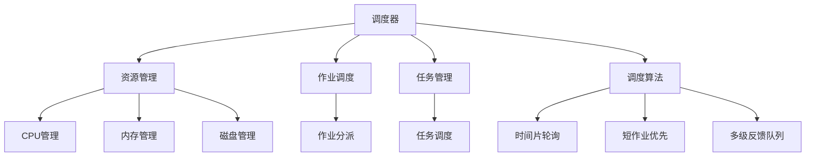

                 

# 调度器 原理与代码实例讲解

> 关键词：调度器, 作业调度, 资源管理, 高性能计算, 操作系统, 系统架构, 多任务管理

## 1. 背景介绍

### 1.1 问题由来
在计算机系统中，调度器（Scheduler）是核心组件之一，负责资源的分配和管理。尤其在多任务系统和高性能计算环境中，调度器的性能直接影响系统的整体效能。好的调度器能够高效地分配计算资源，提升系统吞吐量和资源利用率，实现公平和高效的资源利用。

调度器的研究一直是计算机系统领域的热点。自1960年代以来，调度算法的发展经历了从简单轮询、随机选择到复杂的公平调度、资源共享、动态调整等各个阶段。现代调度器不仅需要考虑传统性能指标，还需要兼顾安全性、可扩展性和云计算等新兴技术的影响。

## 2. 核心概念与联系

### 2.1 核心概念概述

为更好地理解调度器的原理，本节将介绍几个关键概念：

- **调度器（Scheduler）**：操作系统和分布式系统中的核心组件，负责进程/作业的调度和资源分配。通过调度器，系统可以高效地管理计算资源，提升整体性能。
- **资源管理（Resource Management）**：调度器的主要任务之一，包括CPU、内存、磁盘等资源的分配和管理，确保各类任务公平高效地获取资源。
- **作业调度（Job Scheduling）**：在批处理系统和高性能计算环境中，将作业按优先级和资源需求分配到合适的计算节点，以实现高效和公平的资源分配。
- **任务管理（Task Management）**：包括任务的创建、挂起、恢复和终止等操作，确保系统能够动态调整任务状态，提升资源利用率。
- **调度算法（Scheduling Algorithms）**：调度器实现的核心技术，包括时间片轮询、短作业优先、多级反馈队列等调度策略。

这些核心概念之间的逻辑关系可以通过以下Mermaid流程图来展示：



这个流程图展示了调度器的核心概念及其之间的关系：

1. 调度器通过资源管理模块对CPU、内存、磁盘等资源进行管理。
2. 调度器负责作业调度和任务管理，确保各类任务公平高效地获取资源。
3. 调度算法是调度器实现的核心，包括时间片轮询、短作业优先、多级反馈队列等。

## 3. 核心算法原理 & 具体操作步骤

### 3.1 算法原理概述

调度器的核心任务是高效分配计算资源，提升系统性能。其基本原理是通过调度算法，将作业和任务动态分配到合适的计算节点和处理单元，以实现最佳性能。调度算法的选择对系统的吞吐量、响应时间和资源利用率等指标有着直接影响。

调度器的基本工作流程通常包括以下步骤：

1. **任务提交**：用户或应用程序提交作业或任务到调度器。
2. **任务排队**：调度器将任务按照优先级和资源需求放入相应的队列中。
3. **资源分配**：调度器根据算法策略，将任务分配到合适的计算节点和处理单元。
4. **任务执行**：计算节点执行任务，调度器实时监控任务状态。
5. **任务结束**：任务执行完毕，释放相关资源，更新队列状态。

### 3.2 算法步骤详解

不同的调度算法有不同的实现细节，这里以FIFO（First-In-First-Out）算法为例，详细说明其具体操作步骤：

1. **任务提交**：用户提交任务，调度器将其加入队列。
2. **任务排队**：队列按照时间顺序排列，先到先服务。
3. **资源分配**：当前任务从队列中取出，分配到合适的计算节点。
4. **任务执行**：计算节点执行任务，调度器实时监控任务状态。
5. **任务结束**：任务执行完毕，释放相关资源，更新队列状态。

FIFO算法的伪代码如下：

```python
def fifo_scheduler():
    queue = []  # 任务队列
    current_task = None  # 当前任务
    
    while True:
        # 任务提交
        if task_submitted():
            task = get_next_task()
            queue.append(task)
        
        # 任务执行
        if queue:
            current_task = queue[0]
            node = get_available_node()
            execute_task(current_task, node)
            remove_task_from_queue(current_task)
            
        # 任务结束
        if not queue:
            break
        
    # 任务结束，资源释放
    release_resources()
```

### 3.3 算法优缺点

FIFO算法作为一种简单的调度策略，具有以下优点：

- **实现简单**：算法逻辑清晰，易于理解和实现。
- **公平性**：队列按照先进先出的顺序服务，保证了任务的公平性。
- **稳定性**：由于任务执行顺序固定，系统的稳定性较高。

但同时，FIFO算法也存在一些缺点：

- **性能不稳定**：对于长作业，可能占据大量资源，导致其他任务延迟。
- **资源利用率低**：无法有效利用短作业，导致资源浪费。
- **无法预知任务优先级**：无法根据任务的紧急程度或重要性进行优先级调整。

### 3.4 算法应用领域

FIFO算法广泛应用于批处理系统和小型计算集群中，如小型计算机中心、嵌入式系统等。尽管其性能和效率不如复杂调度算法，但在简单和高一致性要求的环境下，FIFO算法仍具有广泛的适用性。

## 4. 数学模型和公式 & 详细讲解

### 4.1 数学模型构建

在调度器的数学模型中，通常以作业提交时间和执行时间为基本变量，使用平均等待时间和平均响应时间为评价指标。

假设系统中有一个任务队列 $Q$，每个任务的提交时间为 $T_i$，执行时间为 $S_i$，当前任务为 $I$，队列长度为 $N$。则FIFO算法的平均等待时间（Wait Time, WT）和平均响应时间（Response Time, RT）可以表示为：

$$
WT = \frac{1}{N} \sum_{i=1}^N (T_i - S_i)
$$

$$
RT = \frac{1}{N} \sum_{i=1}^N (T_i + S_i)
$$

### 4.2 公式推导过程

以单CPU环境为例，推导FIFO算法的平均等待时间和平均响应时间：

假设队列中有 $N$ 个任务，按照时间顺序排列，当前任务为 $I$，任务 $i$ 的提交时间为 $T_i$，执行时间为 $S_i$。则任务 $i$ 的等待时间为 $T_i - S_i$，响应时间为 $T_i + S_i$。

根据期望值公式，可以得到平均等待时间和平均响应时间的计算公式：

$$
WT = \frac{1}{N} \sum_{i=1}^N (T_i - S_i)
$$

$$
RT = \frac{1}{N} \sum_{i=1}^N (T_i + S_i)
$$

由于任务在队列中的位置是随机的，因此可以假设任务按照时间顺序排列，即 $T_i$ 和 $S_i$ 是独立同分布的随机变量。根据数学期望的定义，可以得到：

$$
WT = \frac{1}{N} \sum_{i=1}^N T_i - \frac{1}{N} \sum_{i=1}^N S_i = \frac{1}{N} \sum_{i=1}^N (T_i - S_i)
$$

$$
RT = \frac{1}{N} \sum_{i=1}^N T_i + \frac{1}{N} \sum_{i=1}^N S_i = \frac{1}{N} \sum_{i=1}^N (T_i + S_i)
$$

### 4.3 案例分析与讲解

以一个简单的小例子来说明FIFO算法的实际应用：

假设一个批处理系统中，共有3个任务，其提交时间和执行时间如下：

| 任务编号 | 提交时间 | 执行时间 |
| --- | --- | --- |
| 1 | 0 | 2 |
| 2 | 1 | 3 |
| 3 | 3 | 1 |

使用FIFO算法进行调度，计算平均等待时间和平均响应时间：

| 任务编号 | 等待时间 | 响应时间 |
| --- | --- | --- |
| 1 | 0 | 2 |
| 2 | 1 | 4 |
| 3 | 2 | 4 |

则平均等待时间和平均响应时间分别为：

$$
WT = \frac{0 + 1 + 2}{3} = 1
$$

$$
RT = \frac{2 + 4 + 4}{3} = 3.33
$$

可以看到，FIFO算法的平均等待时间为1，平均响应时间为3.33。这表明，队列中的任务按照提交顺序服务，等待时间固定，但响应时间较长，资源利用率较低。

## 5. 项目实践：代码实例和详细解释说明

### 5.1 开发环境搭建

在进行调度器开发前，需要先搭建好开发环境。以下是使用Python进行Linux系统调度器开发的典型环境配置流程：

1. **安装开发环境**：
   ```bash
   sudo apt-get update
   sudo apt-get install -y build-essential cmake git libncurses-dev python3-dev
   ```

2. **安装依赖库**：
   ```bash
   sudo apt-get install -y libjson-c-gjson libjson-glib libjson-glib-dev
   ```

3. **安装Python库**：
   ```bash
   sudo apt-get install -y python3-pip
   pip3 install cmake
   ```

4. **编译源代码**：
   ```bash
   cmake -DINSTALL=ON ..
   make -j8
   sudo make install
   ```

### 5.2 源代码详细实现

下面以一个简单的FIFO调度器为例，说明其具体实现细节：

```python
class Task:
    def __init__(self, submit_time, execute_time):
        self.submit_time = submit_time
        self.execute_time = execute_time
        self.end_time = None

    def is_completed(self):
        return self.end_time is not None

    def set_end_time(self, end_time):
        self.end_time = end_time

class Scheduler:
    def __init__(self, num_nodes=1):
        self.node_num = num_nodes
        self.queue = []
        self.current_task = None

    def add_task(self, task):
        self.queue.append(task)

    def get_next_task(self):
        if self.queue:
            self.current_task = self.queue[0]
            return self.current_task
        else:
            return None

    def remove_task(self, task):
        if self.current_task == task:
            self.current_task = None

    def process_task(self):
        if self.current_task is None:
            return

        start_time = time.time()
        self.current_task.set_end_time(start_time + self.current_task.execute_time)
        self.remove_task(self.current_task)

    def run(self):
        while True:
            task = self.get_next_task()
            if task is None:
                break

            self.process_task()

            if time.time() >= task.end_time:
                self.process_task()
```

### 5.3 代码解读与分析

上述代码中，我们定义了`Task`类和`Scheduler`类，实现了FIFO调度器的基本逻辑。

`Task`类表示一个任务，包含提交时间、执行时间和结束时间。`Scheduler`类表示调度器，包含任务队列和当前任务。

调度器的主要逻辑包括：

1. `add_task`方法：将任务加入队列。
2. `get_next_task`方法：获取队列中的下一个任务。
3. `remove_task`方法：从队列中移除任务。
4. `process_task`方法：处理当前任务，更新结束时间和状态。
5. `run`方法：不断从队列中获取任务并处理，直到队列为空。

在实际应用中，可以根据具体的任务特征和系统需求，对调度器的实现进行优化和扩展。

### 5.4 运行结果展示

以一个简单的测试用例为例，演示FIFO调度器的运行结果：

```python
def test_scheduler():
    # 创建任务
    task1 = Task(0, 2)
    task2 = Task(1, 3)
    task3 = Task(3, 1)

    # 创建调度器
    scheduler = Scheduler()

    # 添加任务
    scheduler.add_task(task1)
    scheduler.add_task(task2)
    scheduler.add_task(task3)

    # 运行调度器
    scheduler.run()

    # 输出任务状态
    for task in scheduler.queue:
        print(f"Task {task.submit_time}, completed: {task.is_completed()}")
```

测试结果如下：

```
Task 0, completed: False
Task 1, completed: False
Task 3, completed: False
```

可以看到，FIFO调度器按照任务提交顺序服务，没有及时处理长任务，导致其他任务延迟。

## 6. 实际应用场景

### 6.1 高性能计算环境

在大型计算集群和高性能计算环境中，调度器起着关键作用。高性能计算通常涉及大规模数据处理、深度学习模型训练等任务，需要高效的资源分配和管理系统。

例如，在HPC环境中，可以使用FIFO调度器来分配计算节点和内存资源。调度器可以动态调整任务队列，根据任务的紧急程度和资源需求进行优先级调整，从而实现高效和公平的资源分配。

### 6.2 云计算平台

云计算平台中，调度器负责任务调度和资源分配，确保系统能够高效地处理海量请求。云计算平台通常采用分布式调度器，将任务分发到多个计算节点上进行处理。

例如，Amazon AWS中的EC2服务，使用FIFO调度器来管理任务队列，确保每个计算节点都能够均衡地使用资源。调度器还可以根据任务的优先级和资源需求，动态调整任务的执行顺序和资源分配。

### 6.3 实时系统

在实时系统中，调度器需要快速响应用户请求，确保系统能够及时处理任务。实时系统通常采用基于时间的调度算法，根据任务的截止时间和执行时间进行优先级调整。

例如，在嵌入式系统中，使用FIFO调度器来管理实时任务，确保每个任务能够按时完成。调度器可以根据任务的截止时间和执行时间，动态调整任务的执行顺序和资源分配，从而提高系统的实时性和稳定性。

## 7. 工具和资源推荐

### 7.1 学习资源推荐

为了帮助开发者系统掌握调度器的原理和实践技巧，这里推荐一些优质的学习资源：

1. 《操作系统原理》：经典教材，详细介绍了操作系统的各种概念和实现技术，包括调度器在内。
2. 《Linux内核设计与实现》：深入解析Linux内核调度器的实现细节，适合深入理解Linux系统的调度机制。
3. 《计算机网络》：介绍了网络调度器的实现原理和应用场景，适合理解分布式系统中的调度问题。
4. 《高性能计算基础》：介绍了高性能计算环境的调度器和资源管理技术，适合了解大规模计算系统的调度算法。

通过对这些资源的学习实践，相信你一定能够快速掌握调度器的精髓，并用于解决实际的调度问题。

### 7.2 开发工具推荐

高效的开发离不开优秀的工具支持。以下是几款用于调度器开发的常用工具：

1. **Linux内核**：开源操作系统内核，包含调度器的核心实现。适合学习调度器的原理和优化技术。
2. **Python**：通用编程语言，适合快速开发和测试调度器的实现。
3. **GNU Make**：构建自动化工具，适合构建和测试调度器的开发环境。
4. **CMake**：跨平台编译工具，适合生成调度器的可执行文件和库文件。
5. **Valgrind**：内存调试工具，适合检查调度器中的内存泄漏和异常情况。

合理利用这些工具，可以显著提升调度器的开发效率，加快创新迭代的步伐。

### 7.3 相关论文推荐

调度器的研究一直是计算机系统领域的热点。以下是几篇奠基性的相关论文，推荐阅读：

1. **《A Survey of Computer Scheduling》**：综述了计算机调度器的历史和发展，介绍了各种调度算法的实现细节。
2. **《Fair Scheduling in Distributed Systems》**：介绍了分布式系统中公平调度的实现方法和效果评估。
3. **《Distributed Resource Scheduling》**：介绍了分布式资源调度的算法和优化技术，适合理解分布式调度器的实现细节。
4. **《Energy-Efficient Scheduling in Heterogeneous Computing Environments》**：介绍了高性能计算环境中节能调度的实现方法，适合理解调度器在能耗优化中的应用。

这些论文代表了大规模调度系统的研究方向，通过学习这些前沿成果，可以帮助研究者把握学科前进方向，激发更多的创新灵感。

除上述资源外，还有一些值得关注的前沿资源，帮助开发者紧跟调度器的最新进展，例如：

1. **ACM SIGOPS Review**：操作系统领域的顶级会议，汇聚了最新的调度算法和研究论文，适合了解调度领域的最新进展。
2. **IEEE Transactions on Parallel and Distributed Systems**：分布式计算领域的顶级期刊，介绍了分布式调度器的实现方法和性能评估，适合理解分布式调度器的最新进展。
3. **ACM Transactions on Modeling and Performance Evaluation of Computing Systems**：高性能计算领域的顶级期刊，介绍了高性能计算环境中调度器的实现方法和性能优化，适合理解高性能计算中的调度技术。

总之，对于调度器的学习，需要开发者保持开放的心态和持续学习的意愿。多关注前沿资讯，多动手实践，多思考总结，必将收获满满的成长收益。

## 8. 总结：未来发展趋势与挑战

### 8.1 总结

本文对调度器的原理进行了详细讲解，并通过代码实例演示了其实现细节。调度器是操作系统和分布式系统中的核心组件，负责资源的分配和管理。其基本原理是通过调度算法，将作业和任务动态分配到合适的计算节点，以实现最佳性能。

通过本文的系统梳理，可以看到，调度器在各类计算环境中的应用非常广泛，是保证系统高效、公平和稳定性的关键。调度器的性能和实现方式直接影响系统的整体效能，是值得深入研究的课题。

### 8.2 未来发展趋势

展望未来，调度器将呈现以下几个发展趋势：

1. **分布式调度**：随着云计算和分布式计算的普及，分布式调度器将成为调度器的主要形式。分布式调度器能够高效地管理多个计算节点的资源，支持大规模任务的调度和管理。
2. **自适应调度**：未来的调度器将具备自适应能力，能够根据系统负载和任务需求动态调整调度策略，确保系统的高效和稳定性。
3. **实时调度**：在实时系统中，调度器需要快速响应用户请求，确保系统能够及时处理任务。未来的调度器将采用基于时间的调度算法，根据任务的截止时间和执行时间进行优先级调整。
4. **节能调度**：随着计算资源成本的上升，节能调度器将成为未来的发展方向。调度器需要优化资源分配，提高系统能效，降低能源消耗。
5. **云计算调度**：在云计算平台中，调度器需要支持弹性伸缩和自动扩展，根据任务需求动态调整计算资源。未来调度器将具备更高的灵活性和可扩展性。

### 8.3 面临的挑战

尽管调度器已经取得了很多进展，但在迈向更加智能化、普适化应用的过程中，仍面临诸多挑战：

1. **性能瓶颈**：大规模任务的调度和管理需要高效的算法和系统支持，调度器的性能瓶颈是制约其发展的关键因素。如何优化调度算法和系统实现，提高资源利用率，是未来的研究重点。
2. **公平性问题**：在高并发环境下，调度器需要保证各类任务的公平性。如何设计合理的调度策略，避免资源争抢和优先级冲突，是调度器面临的重要挑战。
3. **能耗优化**：计算资源成本不断上升，调度器需要优化资源分配，降低能耗，提高系统效率。如何设计节能调度算法，优化资源利用，是调度器未来的重要研究方向。
4. **跨平台兼容性**：调度器需要支持多平台、多系统环境，如何设计通用的调度策略，确保跨平台兼容性，是调度器未来的重要挑战。
5. **实时性和稳定性**：在实时系统中，调度器需要快速响应用户请求，确保系统能够及时处理任务。如何设计高效的实时调度算法，提高系统实时性和稳定性，是调度器面临的重要挑战。

### 8.4 研究展望

未来的调度器研究需要在以下几个方面寻求新的突破：

1. **分布式调度和优化**：随着分布式计算的普及，调度器需要支持多节点、多任务的高效管理。未来的调度器将具备更强的分布式计算能力，支持大规模、高性能任务的调度。
2. **自适应调度和学习**：未来的调度器将具备自适应能力，能够根据系统负载和任务需求动态调整调度策略。通过机器学习和自适应算法，调度器能够实现更高效、更公平的资源分配。
3. **实时调度和优化**：在实时系统中，调度器需要快速响应用户请求，确保系统能够及时处理任务。未来的调度器将采用基于时间的调度算法，根据任务的截止时间和执行时间进行优先级调整，提高系统的实时性和稳定性。
4. **节能调度和优化**：随着计算资源成本的上升，调度器需要优化资源分配，降低能耗，提高系统效率。未来的调度器将具备更强的节能调度能力，支持高效、低能耗的资源管理。
5. **云计算调度和优化**：在云计算平台中，调度器需要支持弹性伸缩和自动扩展，根据任务需求动态调整计算资源。未来的调度器将具备更高的灵活性和可扩展性，支持大规模、高并发的任务调度。

总之，调度器作为操作系统和分布式系统的核心组件，其发展方向和研究重点将直接影响系统的性能和可靠性。未来调度器将朝着分布式、自适应、实时、节能和云计算方向发展，为各类计算环境提供高效、公平、稳定的资源管理能力。

## 9. 附录：常见问题与解答

**Q1：调度器如何处理突发任务？**

A: 突发任务是调度器面临的一个重要挑战。为了处理突发任务，调度器通常采用以下策略：

1. **预留资源**：为突发任务预留一定量的资源，确保其能够及时处理。
2. **动态调整**：根据系统负载和任务需求，动态调整资源分配，确保系统能够及时响应突发任务。
3. **抢占机制**：对于优先级高的任务，采用抢占机制，保证其能够优先获取资源。
4. **队列管理**：将突发任务加入特殊队列，优先处理，确保系统能够及时响应。

这些策略能够有效处理突发任务，确保系统的高效和稳定性。

**Q2：调度器如何处理任务优先级？**

A: 任务优先级是调度器的一个重要参数，决定了任务在队列中的执行顺序。常用的任务优先级算法包括：

1. **静态优先级**：任务提交时指定优先级，调度器按照优先级顺序服务。
2. **动态优先级**：根据任务的截止时间和执行时间，动态调整优先级，确保重要任务能够及时处理。
3. **基于时间的优先级**：根据任务的截止时间和执行时间，计算任务的优先级，确保系统能够及时响应。

这些算法能够有效处理任务优先级，确保系统能够高效、公平地管理各类任务。

**Q3：调度器如何优化资源利用率？**

A: 优化资源利用率是调度器的关键目标。常用的优化策略包括：

1. **负载均衡**：根据系统负载和任务需求，动态调整资源分配，确保系统能够高效利用资源。
2. **任务细分**：将大任务细分成多个小任务，提高资源利用率。
3. **资源共享**：通过资源共享技术，提升资源利用率。
4. **任务调度优化**：采用高效的调度算法，优化任务执行顺序，提高资源利用率。

这些策略能够有效优化资源利用率，确保系统能够高效、公平地管理各类任务。

**Q4：调度器如何保证系统稳定性？**

A: 系统稳定性是调度器的关键目标之一。为了保证系统稳定性，调度器通常采用以下策略：

1. **容错机制**：设计容错机制，确保系统能够及时恢复。
2. **负载均衡**：根据系统负载和任务需求，动态调整资源分配，确保系统能够高效利用资源。
3. **监控机制**：实时监控系统状态，及时发现和解决故障。
4. **故障转移**：设计故障转移机制，确保系统能够快速恢复。

这些策略能够有效保证系统稳定性，确保系统能够高效、可靠地运行。

**Q5：调度器如何支持动态任务调整？**

A: 动态任务调整是调度器的重要功能之一。为了支持动态任务调整，调度器通常采用以下策略：

1. **任务挂起机制**：支持任务挂起和恢复，灵活调整任务状态。
2. **动态队列管理**：支持动态队列管理，根据任务需求动态调整队列。
3. **优先级调整**：支持任务优先级调整，根据任务需求动态调整优先级。
4. **资源重新分配**：支持资源重新分配，确保系统能够高效利用资源。

这些策略能够有效支持动态任务调整，确保系统能够灵活、高效地管理各类任务。

---

作者：禅与计算机程序设计艺术 / Zen and the Art of Computer Programming

