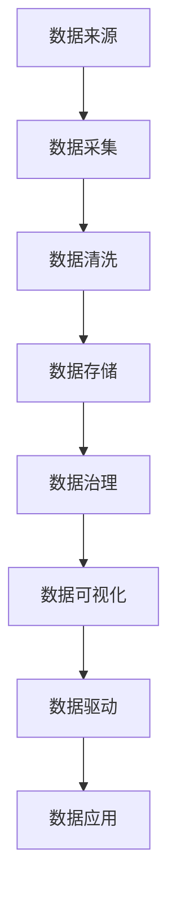

                 

# 软件 2.0 编程：数据驱动开发

软件2.0编程，是一种以数据为中心的编程范式，旨在通过数据驱动的方式，加速软件的开发、部署和优化。本文将深入探讨软件2.0编程的核心概念、算法原理、应用场景及其未来发展趋势。

## 1. 背景介绍

### 1.1 问题由来

随着数据量的爆炸式增长，传统的以功能为中心的编程方式已经无法满足日益复杂的软件开发需求。软件开发过程中的需求变更频繁、数据处理流程复杂、系统性能瓶颈明显等问题亟需新的解决思路。软件2.0编程应运而生，它强调以数据为中心，通过数据驱动的方式，构建更加灵活、高效、可扩展的软件系统。

### 1.2 问题核心关键点

软件2.0编程的核心在于数据驱动。它通过将数据作为系统的核心驱动力，进行数据处理和分析，从而实现数据的自动化生成、智能化分析和可视化展示。数据驱动的编程方式，不仅提升了软件的开发效率和质量，还使软件系统更加灵活和可扩展。

## 2. 核心概念与联系

### 2.1 核心概念概述

软件2.0编程涉及多个核心概念，包括数据驱动、数据可视化、数据仓库、数据治理等。以下是对这些核心概念的详细解释：

- **数据驱动**：强调数据在软件系统中发挥核心驱动力的作用，通过数据的收集、处理和分析，驱动系统的开发、测试和优化。
- **数据可视化**：利用图形、图表等可视化手段，将数据转换为直观的视觉表现形式，帮助开发者和用户更好地理解和分析数据。
- **数据仓库**：一种专门用于存储、管理和分析大量数据的系统，提供高效的数据存储、查询和分析功能。
- **数据治理**：通过制定数据管理策略和规范，确保数据的质量、安全和隐私，实现数据的全面治理。

这些概念通过数据流图（DFD）进一步联结：



### 2.2 概念间的关系

软件2.0编程中的核心概念通过数据流图进一步关联，形成整体架构：

1. **数据来源**：数据从多个来源采集，包括数据库、API、传感器等。
2. **数据采集**：通过ETL（提取、转换、加载）过程，将数据导入数据仓库。
3. **数据清洗**：对采集的数据进行去重、填充、去噪等预处理，保证数据质量。
4. **数据存储**：数据仓库提供高效的数据存储和访问机制，确保数据的可靠性和安全性。
5. **数据治理**：对数据进行标准化、分类、编码等治理措施，保证数据的一致性和完整性。
6. **数据可视化**：通过BI工具（如Tableau、PowerBI等）将数据转换为可视化报表和图表，提供直观的数据展示。
7. **数据驱动**：根据可视化数据，进行算法模型训练和业务决策，驱动应用开发和系统优化。
8. **数据应用**：基于数据驱动的决策，开发和部署相应的应用系统，实现业务目标。

## 3. 核心算法原理 & 具体操作步骤

### 3.1 算法原理概述

软件2.0编程的算法原理基于数据驱动和模型驱动。其核心算法流程包括数据采集、数据清洗、数据存储、数据治理、数据可视化、数据驱动和数据应用。

### 3.2 算法步骤详解

#### 3.2.1 数据采集

数据采集是软件2.0编程的第一步，涉及数据的源采集和源集成。常用的数据源包括关系型数据库、非关系型数据库、API接口、传感器、日志文件等。数据采集过程中，需要定义数据采集规则、监控数据源状态，并处理数据采集过程中可能出现的异常情况。

#### 3.2.2 数据清洗

数据清洗是指对采集到的数据进行去重、去噪、填充、去重、去噪等预处理，以提升数据质量。数据清洗过程中，需要根据业务需求，定义清洗规则，并使用ETL工具进行自动化清洗。

#### 3.2.3 数据存储

数据存储是软件2.0编程的核心环节，涉及数据仓库的建设和管理。数据仓库通常采用分布式存储和高效查询的技术，如Hadoop、Spark等，支持大规模数据存储和查询。数据存储过程中，需要考虑数据一致性、安全性和性能问题，通过分布式技术和缓存技术提升数据存储和查询效率。

#### 3.2.4 数据治理

数据治理是确保数据质量和安全的关键环节，涉及数据的分类、编码、标准化和元数据管理。数据治理过程中，需要制定数据管理策略和规范，并通过数据治理工具（如Informatica、Trifacta等）进行自动化治理，确保数据的一致性和完整性。

#### 3.2.5 数据可视化

数据可视化是将数据转换为直观的视觉表现形式，帮助开发者和用户更好地理解和分析数据。常用的数据可视化工具包括Tableau、PowerBI、Grafana等。数据可视化过程中，需要定义可视化规则和展示方式，确保数据的准确性和可理解性。

#### 3.2.6 数据驱动

数据驱动是基于可视化的数据，进行算法模型训练和业务决策的过程。常用的数据驱动技术包括机器学习、深度学习、自然语言处理等。数据驱动过程中，需要选择合适的算法模型，并进行模型训练和优化，以提升模型的预测能力和泛化能力。

#### 3.2.7 数据应用

数据应用是将数据驱动的决策结果转化为实际的应用系统，实现业务目标的过程。常用的数据应用技术包括微服务架构、DevOps、容器化等。数据应用过程中，需要考虑系统的可扩展性、稳定性和安全性，通过DevOps和容器化技术提升系统的开发和部署效率。

### 3.3 算法优缺点

软件2.0编程的优势在于其数据驱动的特性，能够显著提升软件的开发效率和质量。其缺点在于对数据源和数据质量要求较高，且涉及的技术栈较为复杂，开发和维护成本相对较高。

### 3.4 算法应用领域

软件2.0编程广泛应用于金融、医疗、电商、物联网等多个领域，如：

- 金融领域：通过数据驱动的决策系统，提升风险管理和投资分析能力。
- 医疗领域：通过数据驱动的智能诊断系统，提升疾病的早期发现和个性化治疗能力。
- 电商领域：通过数据驱动的推荐系统，提升用户体验和销售转化率。
- 物联网领域：通过数据驱动的智能监控系统，提升设备和设施的运行效率和安全保障能力。

## 4. 数学模型和公式 & 详细讲解

### 4.1 数学模型构建

软件2.0编程中的数学模型主要涉及数据的采集、清洗、存储、治理、可视化和应用。以下以机器学习为例，构建数据驱动的数学模型。

设输入数据为 $X$，输出数据为 $Y$，数据驱动的数学模型为 $M_{\theta}$，其中 $\theta$ 为模型参数。

假设模型 $M_{\theta}$ 为线性回归模型，则数学模型可表示为：

$$
M_{\theta}(X) = \theta_0 + \theta_1 X_1 + \theta_2 X_2 + \cdots + \theta_n X_n
$$

其中 $\theta_0, \theta_1, \theta_2, \cdots, \theta_n$ 为模型的参数，$X_1, X_2, \cdots, X_n$ 为输入数据。

### 4.2 公式推导过程

根据线性回归模型的定义，模型的损失函数为：

$$
\mathcal{L}(\theta) = \frac{1}{2N} \sum_{i=1}^N (y_i - M_{\theta}(x_i))^2
$$

其中 $N$ 为样本数量，$x_i$ 为样本特征，$y_i$ 为样本标签。

通过梯度下降算法，优化模型的参数 $\theta$，使得损失函数最小化：

$$
\theta = \mathop{\arg\min}_{\theta} \mathcal{L}(\theta)
$$

其中 $\mathcal{L}'(\theta)$ 为损失函数对参数 $\theta$ 的梯度。

### 4.3 案例分析与讲解

以电商领域的推荐系统为例，通过数据驱动的机器学习模型，提升用户购买转化率。

假设推荐系统的输入数据为用户的浏览记录、购买历史等，输出数据为推荐商品。

设推荐系统的数学模型为 $M_{\theta}$，其中 $\theta$ 为模型参数。

通过数据驱动的机器学习算法，训练推荐模型，使得推荐结果与用户购买行为高度相关。推荐模型训练的损失函数为：

$$
\mathcal{L}(\theta) = \frac{1}{N} \sum_{i=1}^N (y_i - M_{\theta}(x_i))^2
$$

其中 $N$ 为样本数量，$x_i$ 为用户行为数据，$y_i$ 为推荐商品。

## 5. 项目实践：代码实例和详细解释说明

### 5.1 开发环境搭建

进行软件2.0编程的开发环境搭建，需要安装以下工具和软件：

1. Python 3.8
2. PyTorch 1.9
3. Pandas
4. Scikit-learn
5. TensorFlow 2.4
6. Hadoop
7. Spark
8. Tableau
9. PowerBI

### 5.2 源代码详细实现

以下以金融领域的风险管理为例，展示数据驱动的微服务系统开发流程。

首先，定义数据采集规则：

```python
from pyspark.sql import SparkSession
spark = SparkSession.builder.appName("DataIngestion").getOrCreate()

# 定义数据采集规则
def data_ingestion():
    # 读取数据库中的数据
    data = spark.read.format("jdbc").options(url="jdbc:mysql://localhost:3306/mydatabase", user="root", password="password").load()
    # 过滤和清洗数据
    cleaned_data = data.filter(data['status'] == 'valid')
    return cleaned_data

# 采集数据并存储到数据仓库
data = data_ingestion()
data.write.format("parquet").save("data_path")
```

然后，定义数据清洗规则：

```python
from pyspark.sql import SparkSession
spark = SparkSession.builder.appName("DataCleaning").getOrCreate()

# 读取数据仓库中的数据
cleaned_data = spark.read.parquet("data_path")

# 定义数据清洗规则
def data_cleaning(data):
    # 去除重复数据
    cleaned_data = data.drop_duplicates()
    # 填补缺失值
    cleaned_data = cleaned_data.fillna(0)
    # 去噪处理
    cleaned_data = cleaned_data.dropna()
    return cleaned_data

# 进行数据清洗并存储
cleaned_data = data_cleaning(cleaned_data)
cleaned_data.write.format("parquet").save("cleaned_data_path")
```

接着，定义数据存储规则：

```python
from pyspark.sql import SparkSession
spark = SparkSession.builder.appName("DataStorage").getOrCreate()

# 读取数据仓库中的数据
cleaned_data = spark.read.parquet("cleaned_data_path")

# 定义数据存储规则
def data_storage(cleaned_data):
    # 存储到分布式数据库
    cleaned_data.write.format("jdbc").options(url="jdbc:mysql://localhost:3306/mydatabase", user="root", password="password", table="cleaned_data").save()
    # 存储到数据仓库
    cleaned_data.write.format("parquet").save("data_warehouse_path")

# 进行数据存储
data_storage(cleaned_data)
```

最后，定义数据可视化和应用规则：

```python
from pyspark.sql import SparkSession
spark = SparkSession.builder.appName("DataVisualization").getOrCreate()

# 读取数据仓库中的数据
data = spark.read.parquet("data_warehouse_path")

# 定义数据可视化规则
def data_visualization(data):
    # 可视化展示数据
    spark.createDataFrame(data, ["timestamp", "value"]).groupBy("timestamp").agg({"value": "avg"}).show()

# 进行数据可视化
data_visualization(data)

# 定义数据应用规则
def data_application():
    # 数据驱动的决策系统
    # 例如：根据数据进行风险预警和投资分析
    pass

# 进行数据应用
data_application()
```

### 5.3 代码解读与分析

以上代码展示了数据驱动的软件2.0编程实现流程，包括数据采集、清洗、存储、可视化和应用。

- 数据采集：通过Spark读取MySQL数据库中的数据，并进行过滤和清洗。
- 数据清洗：去除重复数据，填补缺失值，并进行去噪处理。
- 数据存储：将清洗后的数据存储到分布式数据库和数据仓库中。
- 数据可视化：通过Spark创建数据帧，进行平均值的计算和可视化展示。
- 数据应用：根据可视化数据，进行数据驱动的决策系统开发。

## 6. 实际应用场景

### 6.1 金融风险管理

金融领域的风险管理，通过数据驱动的机器学习模型，进行风险评估和预警。

例如，利用数据仓库中的历史交易数据，训练风险评估模型，对新交易进行风险预测和预警。数据驱动的风险管理系统，能够及时发现和防范潜在的风险因素，提升金融系统的稳定性和安全性。

### 6.2 医疗智能诊断

医疗领域的智能诊断，通过数据驱动的机器学习模型，进行疾病诊断和预测。

例如，利用数据仓库中的电子病历数据，训练疾病诊断模型，对患者的病情进行诊断和预测。数据驱动的智能诊断系统，能够快速准确地识别疾病，提供个性化治疗方案，提升医疗服务的效率和质量。

### 6.3 电商推荐系统

电商领域的推荐系统，通过数据驱动的机器学习模型，提升用户购买转化率。

例如，利用数据仓库中的用户行为数据，训练推荐模型，推荐用户感兴趣的商品。数据驱动的推荐系统，能够精准地匹配用户需求，提升用户体验和销售转化率。

### 6.4 物联网智能监控

物联网领域的智能监控，通过数据驱动的机器学习模型，提升设备和设施的运行效率和安全保障能力。

例如，利用数据仓库中的设备运行数据，训练智能监控模型，进行设备运行状态监测和故障预警。数据驱动的智能监控系统，能够实时监测设备运行状态，及时发现和处理故障，提升系统的稳定性和安全性。

## 7. 工具和资源推荐

### 7.1 学习资源推荐

为了帮助开发者系统掌握软件2.0编程的理论基础和实践技巧，以下是一些优质的学习资源：

1. 《数据驱动的编程范式》系列博文：由软件2.0编程专家撰写，深入浅出地介绍了数据驱动编程的基本概念和实现方法。
2. Coursera《数据科学与机器学习》课程：由斯坦福大学开设的线上课程，涵盖数据科学和机器学习的基础知识，是学习软件2.0编程的必备资源。
3. O'Reilly《数据驱动的工程实践》书籍：详细介绍了数据驱动编程的工程实践方法和工具，涵盖数据采集、清洗、存储、治理、可视化和应用等多个方面。
4. Kaggle竞赛平台：提供丰富的数据集和竞赛项目，帮助开发者实践数据驱动的算法模型。
5. DataCamp在线学习平台：提供系统化的数据科学和机器学习课程，适合初学者和进阶开发者进行学习。

通过对这些资源的学习实践，相信你一定能够快速掌握软件2.0编程的精髓，并用于解决实际的业务问题。

### 7.2 开发工具推荐

高效的开发离不开优秀的工具支持。以下是几款用于软件2.0编程开发的常用工具：

1. Apache Spark：基于内存计算的分布式数据处理引擎，支持大规模数据存储和处理。
2. Apache Hadoop：基于磁盘计算的分布式数据处理引擎，支持海量数据的存储和处理。
3. Pandas：Python中的数据处理库，支持高效的数据清洗和转换。
4. Scikit-learn：Python中的机器学习库，支持常用的机器学习算法和模型。
5. TensorFlow：由Google主导开发的深度学习框架，支持分布式计算和模型训练。
6. PyTorch：基于Python的深度学习框架，支持动态图和静态图计算。
7. Tableau：数据可视化工具，支持数据驱动的可视化展示。
8. PowerBI：微软推出的数据可视化工具，支持多种数据源的可视化展示。

合理利用这些工具，可以显著提升软件2.0编程的开发效率，加快创新迭代的步伐。

### 7.3 相关论文推荐

软件2.0编程的发展源于学界的持续研究。以下是几篇奠基性的相关论文，推荐阅读：

1. Data-Driven Programming: A Survey of Key Technologies and Applications：综述了数据驱动编程的关键技术和应用场景，是学习软件2.0编程的入门读物。
2. Data-Driven AI: The Future of AI Systems：探讨了数据驱动AI的发展趋势和应用前景，为未来的AI研究提供了方向。
3. Deep Learning in Data-Driven Programming：介绍了深度学习在数据驱动编程中的应用，展示了数据驱动的模型训练和推理方法。
4. From Data Collection to Data Mining: A Data-Driven Approach to Software Development：提出了一种数据驱动的软件开发方法，探讨了数据驱动的工程实践和应用。
5. Building Data-Driven Applications with Apache Spark：介绍了Apache Spark在数据驱动应用程序中的应用，展示了数据驱动的分布式计算技术。

这些论文代表了大数据编程的发展脉络。通过学习这些前沿成果，可以帮助研究者把握学科前进方向，激发更多的创新灵感。

除上述资源外，还有一些值得关注的前沿资源，帮助开发者紧跟软件2.0编程技术的最新进展，例如：

1. arXiv论文预印本：人工智能领域最新研究成果的发布平台，包括大量尚未发表的前沿工作，学习前沿技术的必读资源。
2. 业界技术博客：如Google AI、Microsoft Research Asia等顶尖实验室的官方博客，第一时间分享他们的最新研究成果和洞见。
3. 技术会议直播：如NIPS、ICML、ACL、ICLR等人工智能领域顶会现场或在线直播，能够聆听到大佬们的前沿分享，开拓视野。
4. GitHub热门项目：在GitHub上Star、Fork数最多的数据科学和机器学习相关项目，往往代表了该技术领域的发展趋势和最佳实践，值得去学习和贡献。
5. 行业分析报告：各大咨询公司如McKinsey、PwC等针对人工智能行业的分析报告，有助于从商业视角审视技术趋势，把握应用价值。

总之，对于软件2.0编程的学习和实践，需要开发者保持开放的心态和持续学习的意愿。多关注前沿资讯，多动手实践，多思考总结，必将收获满满的成长收益。

## 8. 总结：未来发展趋势与挑战

### 8.1 总结

本文对软件2.0编程进行了全面系统的介绍。首先阐述了数据驱动编程的背景和意义，明确了数据驱动编程在提升软件开发效率和质量方面的独特价值。其次，从原理到实践，详细讲解了软件2.0编程的数学模型和算法流程，给出了数据驱动的软件2.0编程实现代码。同时，本文还广泛探讨了软件2.0编程在金融、医疗、电商、物联网等多个领域的应用前景，展示了数据驱动编程的巨大潜力。此外，本文精选了数据驱动编程的学习资源，力求为读者提供全方位的技术指引。

通过本文的系统梳理，可以看到，软件2.0编程正在成为软件开发的重要范式，极大地提升了软件开发的效率和质量。未来的软件开发将更加依赖数据驱动，实现更加灵活、高效、可扩展的智能系统。

### 8.2 未来发展趋势

展望未来，软件2.0编程将呈现以下几个发展趋势：

1. 数据驱动的深度学习：深度学习在数据驱动编程中的应用将更加广泛，数据驱动的机器学习模型将进一步提升软件系统的智能化水平。
2. 数据驱动的大数据技术：大数据技术在数据驱动编程中的应用将更加深入，数据仓库、数据流处理等技术将更加高效和可靠。
3. 数据驱动的微服务架构：微服务架构在数据驱动编程中的应用将更加普遍，实现更加灵活和可扩展的软件系统。
4. 数据驱动的云原生技术：云原生技术在数据驱动编程中的应用将更加广泛，实现更加高效和可靠的软件开发和部署。
5. 数据驱动的智能应用：数据驱动编程将更加广泛地应用于智能应用领域，如智能客服、智能推荐、智能监控等。

以上趋势凸显了数据驱动编程的广阔前景。这些方向的探索发展，必将进一步提升软件开发系统的性能和应用范围，为人类智能系统的进步做出重要贡献。

### 8.3 面临的挑战

尽管软件2.0编程已经取得了瞩目成就，但在迈向更加智能化、普适化应用的过程中，它仍面临着诸多挑战：

1. 数据源和数据质量问题：数据驱动编程对数据源和数据质量要求较高，如何获取高质量的数据，进行有效的数据治理，是一个重要的挑战。
2. 数据隐私和安全问题：数据驱动编程涉及大量敏感数据，如何保护数据隐私和安全，防止数据泄露和滥用，是一个重要的挑战。
3. 数据计算和存储问题：数据驱动编程涉及大量数据存储和计算，如何优化数据计算和存储，提升数据处理效率，是一个重要的挑战。
4. 数据驱动的应用场景问题：数据驱动编程虽然能够提升软件的开发效率和质量，但在某些特定应用场景下，数据驱动的方法可能不适用，如何找到合适的应用场景，是一个重要的挑战。

### 8.4 研究展望

面对软件2.0编程所面临的种种挑战，未来的研究需要在以下几个方面寻求新的突破：

1. 数据源和数据质量的提升：探索更多高质量的数据源，改进数据采集和清洗技术，提升数据质量。
2. 数据隐私和安全的保障：制定数据隐私和安全规范，采用数据加密、匿名化等技术，保护数据隐私和安全。
3. 数据计算和存储的优化：优化数据计算和存储技术，采用分布式计算、缓存等技术，提升数据处理效率。
4. 数据驱动的应用场景探索：寻找更多数据驱动的应用场景，结合数据驱动和功能驱动的编程范式，实现更加灵活、高效的软件系统。
5. 数据驱动的智能应用创新：探索更多数据驱动的智能应用创新，如智能客服、智能推荐、智能监控等，提升应用场景的智能化水平。

这些研究方向的探索，必将引领软件2.0编程技术迈向更高的台阶，为人类智能系统的进步做出重要贡献。面向未来，软件2.0编程需要从数据源、数据治理、数据计算和存储等多个维度进行全面优化，才能真正实现数据驱动编程的目标。

## 9. 附录：常见问题与解答

**Q1：软件2.0编程是否适用于所有业务场景？**

A: 软件2.0编程虽然在很多业务场景中表现出显著的优势，但并不适用于所有业务场景。在数据质量较差、数据源有限、业务场景复杂等情况下，数据驱动的方法可能并不适用。

**Q2：如何进行数据治理？**

A: 数据治理包括数据的分类、编码、标准化和元数据管理等。需要制定数据治理策略，并采用数据治理工具（如Informatica、Trifacta等）进行自动化治理，确保数据的一致性和完整性。

**Q3：数据驱动的算法模型如何训练和优化？**

A: 数据驱动的算法模型训练和优化通常采用机器学习、深度学习等技术。需要选择合适的算法模型，进行模型训练和优化，确保模型的泛化能力和预测能力。

**Q4：数据驱动的编程范式有哪些优点？**

A: 数据驱动的编程范式有以下优点：
1. 提升软件开发效率和质量：数据驱动编程能够利用数据驱动的方式，提升软件的开发效率和质量。
2. 增强系统灵活性和可扩展性：数据驱动编程能够实现更加灵活和可扩展的软件系统。
3. 提升系统智能化水平：数据驱动编程能够利用数据驱动的方式，提升系统的智能化水平。

**Q5：数据驱动的编程范式有哪些缺点？**

A: 数据驱动的编程范式有以下缺点：
1. 对数据源和数据质量要求较高：数据驱动编程对数据源和数据质量要求较高，需要高质量的数据源和有效的数据治理。
2. 对计算和存储资源要求较高：数据驱动编程涉及大量数据存储和计算，需要高效的计算和存储资源。
3. 对应用场景要求较高：数据驱动编程虽然能够提升软件开发效率和质量，但在某些特定应用场景下，数据驱动的方法可能并不适用。

通过本文的系统梳理，可以看到，软件2.0编程正在成为软件开发的重要范式，极大地提升了软件开发的效率和质量。未来的软件开发将更加依赖数据驱动，实现更加灵活、高效、可扩展的智能系统。相信在数据驱动编程的研究者和实践者的共同努力下，软件2.0编程将迎来更加广阔的发展前景。

