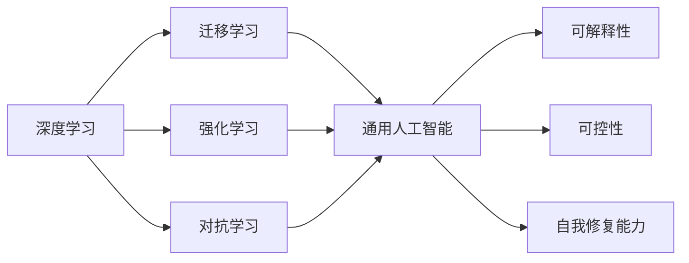
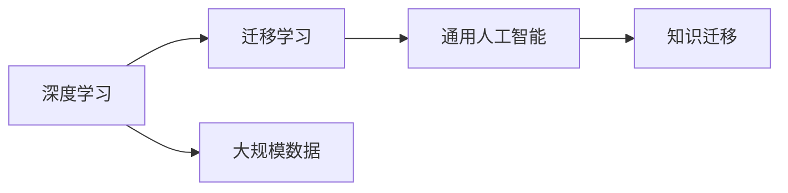
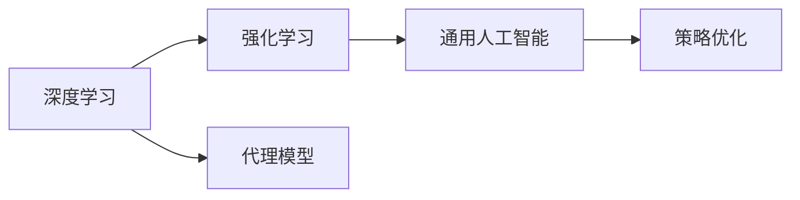
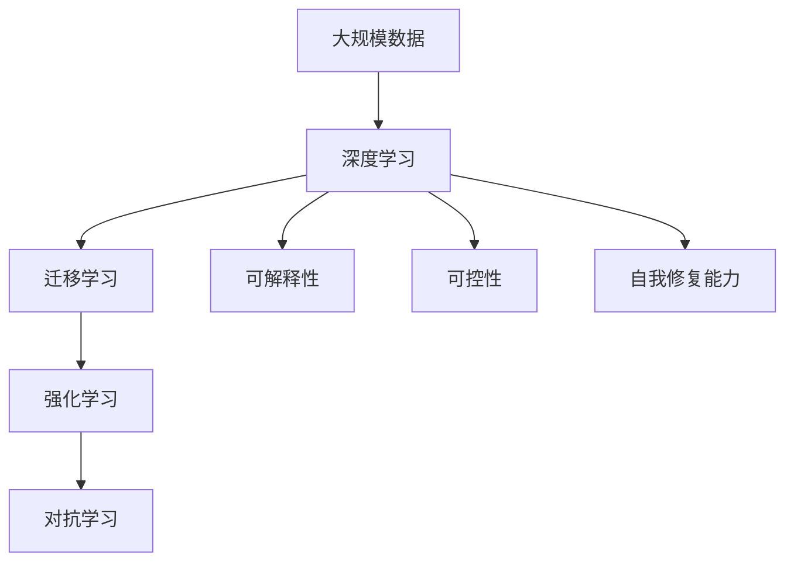
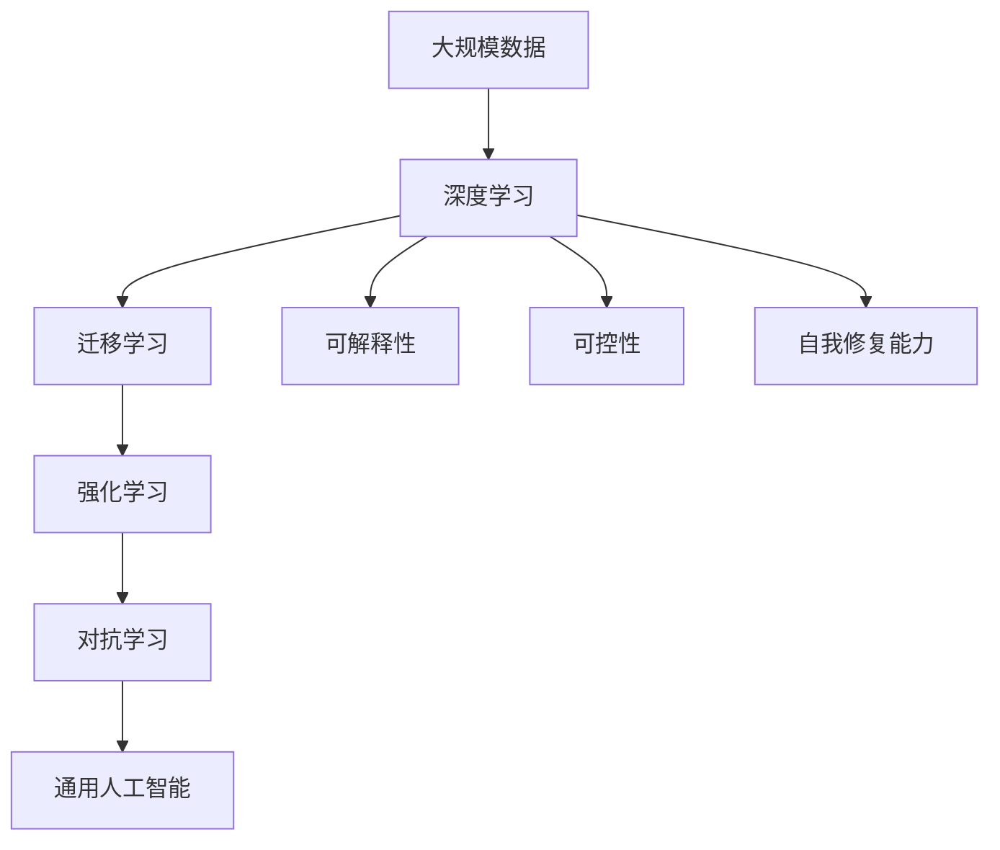

                 

## 1. 背景介绍

### 1.1 问题由来
近年来，人工智能技术取得了长足的进步，深度学习、强化学习、自然语言处理等领域的突破性进展，为通用人工智能(AGI)的实现奠定了基础。但与此同时，通用人工智能的实现仍面临诸多挑战，如算力不足、数据稀缺、模型复杂等，使得通用人工智能仍然停留在实验室阶段。

### 1.2 问题核心关键点
通用人工智能的实现依赖于以下几个关键点：
1. 高性能算力：通用人工智能需要处理极其庞大的数据集和复杂的计算任务，高性能算力是必要的前提。
2. 大规模数据：通用人工智能需要海量的数据进行训练，才能学习到广泛的知识和常识。
3. 先进算法：通用人工智能依赖于先进的算法和模型结构，如图神经网络、迁移学习、对抗学习等。
4. 可解释性和可控性：通用人工智能需要具备良好的可解释性和可控性，确保其行为符合人类价值观和伦理道德。
5. 持续学习和自我修复能力：通用人工智能需要具备持续学习和自我修复能力，以应对环境和任务的变化。

### 1.3 问题研究意义
研究通用人工智能的实现，对于推动人工智能技术的产业化进程，提升各行业的智能化水平，具有重要意义：
1. 降低研发成本：通用人工智能能够处理多种任务，减少从头研发所需的时间和成本。
2. 提升应用效果：通用人工智能具备广泛的知识和常识，能够更好地适应各种实际应用场景，提升应用效果。
3. 加速技术落地：通用人工智能为各行业的数字化转型升级提供了新的技术路径，加速了技术的落地应用。
4. 带来技术创新：通用人工智能推动了深度学习、自然语言处理等前沿技术的发展，催生了新的研究方向。
5. 赋能产业升级：通用人工智能技术能够在更多领域得到应用，为传统行业带来变革性影响，赋能产业升级。

## 2. 核心概念与联系

### 2.1 核心概念概述

为更好地理解通用人工智能的实现方法，本节将介绍几个密切相关的核心概念：

- 通用人工智能(AGI)：指能够处理各种复杂任务，具备高度智能的机器系统，能够自我学习和适应，广泛应用于各个领域。
- 深度学习：一种基于神经网络的机器学习方法，通过多层次的非线性变换，实现对复杂数据的有效建模。
- 强化学习(RL)：通过与环境交互，智能体不断优化策略以最大化奖励的机器学习方法。
- 迁移学习：指将一个领域学习到的知识，迁移应用到另一个不同但相关的领域的学习范式，减少新领域的数据需求。
- 对抗学习(Adversarial Learning)：指模型在与攻击者（对抗样本）的博弈中，提升鲁棒性和泛化能力的学习方法。
- 可解释性(Explainability)：指模型的行为和决策逻辑可以被清晰解释，便于理解、调试和优化。
- 可控性(Controllability)：指模型的行为可以被人控制，避免其产生有害的行为。
- 自我修复能力(Self-repair Capability)：指模型能够识别并修复自身缺陷，保持稳定运行。

这些核心概念之间的逻辑关系可以通过以下Mermaid流程图来展示：



这个流程图展示了几大核心概念之间的关系：

1. 深度学习是通用人工智能的基础，提供强大的数据建模能力。
2. 迁移学习通过知识迁移，加速了通用人工智能的训练。
3. 强化学习通过与环境的交互，提升通用人工智能的策略优化能力。
4. 对抗学习通过对抗样本训练，提升通用人工智能的鲁棒性和泛化能力。
5. 可解释性使通用人工智能的行为可以被理解，便于优化和调试。
6. 可控性确保通用人工智能的行为可以受人控制，避免有害行为。
7. 自我修复能力使通用人工智能能够识别和修复自身缺陷，保持稳定运行。

这些概念共同构成了通用人工智能的实现框架，使其能够在各种场景下发挥强大的智能水平。通过理解这些核心概念，我们可以更好地把握通用人工智能的实现方向。

### 2.2 概念间的关系

这些核心概念之间存在着紧密的联系，形成了通用人工智能的完整生态系统。下面我们通过几个Mermaid流程图来展示这些概念之间的关系。

#### 2.2.1 深度学习与迁移学习的关系



这个流程图展示了深度学习和迁移学习的关系。深度学习通过大规模数据训练，学习到丰富的知识，而迁移学习则将这些知识迁移到新的任务上，加速通用人工智能的训练。

#### 2.2.2 深度学习与强化学习的关系



这个流程图展示了深度学习和强化学习的关系。深度学习通过代理模型构建环境的表示，而强化学习通过策略优化，使通用人工智能能够适应不同的环境任务。

#### 2.2.3 通用人工智能的实现路径



这个综合流程图展示了从数据到通用人工智能实现的整体路径。首先，通过深度学习构建代理模型，然后迁移学习将知识迁移到新的任务上，强化学习通过策略优化使模型适应不同的环境任务，对抗学习提升模型的鲁棒性和泛化能力，最后通过可解释性、可控性和自我修复能力，确保通用人工智能的稳定运行。

### 2.3 核心概念的整体架构

最后，我们用一个综合的流程图来展示这些核心概念在大模型微调过程中的整体架构：



这个综合流程图展示了从数据到通用人工智能实现的整体架构。首先，通过深度学习构建代理模型，然后迁移学习将知识迁移到新的任务上，强化学习通过策略优化使模型适应不同的环境任务，对抗学习提升模型的鲁棒性和泛化能力，最后通过可解释性、可控性和自我修复能力，确保通用人工智能的稳定运行。

## 3. 核心算法原理 & 具体操作步骤
### 3.1 算法原理概述

通用人工智能的实现依赖于深度学习、强化学习等先进算法，通过大规模数据训练和模型优化，逐步逼近AGI的目标。具体来说，通用人工智能的实现过程包括以下几个步骤：

1. **数据准备**：收集并预处理大规模的训练数据，包括文本、图像、音频等多种类型的数据。
2. **深度学习**：使用深度神经网络对数据进行建模，构建代理模型。
3. **迁移学习**：通过迁移学习，将代理模型迁移到新的任务上，加速模型的训练。
4. **强化学习**：使用强化学习算法，使模型能够在环境中不断优化策略，适应不同的任务。
5. **对抗学习**：通过对抗样本训练，提升模型的鲁棒性和泛化能力。
6. **可解释性和可控性**：通过可解释性技术，使模型的行为可以被清晰解释，便于优化和调试。通过可控性技术，确保模型的行为可以受人控制，避免有害行为。
7. **自我修复能力**：通过自我修复技术，使模型能够识别并修复自身缺陷，保持稳定运行。

### 3.2 算法步骤详解

下面以深度学习为基础，详细讲解通用人工智能的实现过程：

**Step 1: 数据准备**

- **数据收集**：收集并预处理大规模的训练数据，包括文本、图像、音频等多种类型的数据。数据需要覆盖尽可能多的场景和任务，以确保模型的泛化能力。
- **数据标注**：对数据进行标注，标注需要准确、全面，便于模型训练。
- **数据增强**：通过回译、旋转、缩放等方式，扩充训练集，提升模型的鲁棒性。

**Step 2: 深度学习模型训练**

- **模型选择**：选择合适的深度神经网络模型，如卷积神经网络、循环神经网络、图神经网络等。
- **网络架构**：设计模型的网络架构，包括输入层、隐藏层、输出层等。
- **损失函数**：选择合适的损失函数，如交叉熵损失、均方误差损失等。
- **优化器**：选择合适的优化器，如SGD、Adam、Adagrad等，设置学习率、批大小、迭代轮数等。
- **训练过程**：将数据输入模型，前向传播计算损失函数，反向传播更新模型参数。
- **验证和测试**：在验证集和测试集上评估模型性能，调整模型参数以提高模型精度。

**Step 3: 迁移学习**

- **知识迁移**：将深度学习模型在特定任务上学习到的知识迁移到新的任务上，加速模型的训练。
- **模型适配**：对深度学习模型进行适配，添加必要的层和参数，使其适应新的任务。
- **微调**：对适配后的模型进行微调，通过有监督学习优化模型在新任务上的性能。

**Step 4: 强化学习**

- **环境建模**：使用代理模型构建环境的表示，便于智能体与环境交互。
- **策略优化**：使用强化学习算法，如Q-learning、策略梯度等，优化智能体的策略，使其适应不同的环境任务。
- **奖励设计**：设计合适的奖励函数，指导智能体的行为。
- **探索与利用**：平衡探索和利用，使智能体既能够探索新策略，又能够利用已有知识。

**Step 5: 对抗学习**

- **对抗样本生成**：生成对抗样本，通过对抗训练提升模型的鲁棒性。
- **模型鲁棒性**：在对抗样本上训练模型，提升模型的鲁棒性和泛化能力。

**Step 6: 可解释性和可控性**

- **可解释性技术**：使用可解释性技术，如注意力机制、特征可视化等，使模型的行为可以被清晰解释。
- **可控性技术**：通过可控性技术，如决策树、规则引擎等，确保模型的行为可以受人控制。

**Step 7: 自我修复能力**

- **模型检测**：检测模型的缺陷和漏洞，识别潜在风险。
- **自我修复**：对模型进行自我修复，提升模型的稳定性和鲁棒性。

### 3.3 算法优缺点

通用人工智能的实现依赖于深度学习、强化学习等先进算法，具有以下优点：

1. **数据驱动**：通过大规模数据训练，学习到丰富的知识，提升模型的泛化能力。
2. **模型复杂**：深度学习、强化学习等算法能够处理复杂的任务，具备高度智能。
3. **可解释性**：通过可解释性技术，使模型的行为可以被清晰解释，便于优化和调试。
4. **可控性**：通过可控性技术，确保模型的行为可以受人控制，避免有害行为。
5. **自我修复能力**：通过自我修复技术，使模型能够识别并修复自身缺陷，保持稳定运行。

同时，通用人工智能的实现也存在一些局限性：

1. **计算成本高**：深度学习、强化学习等算法需要大量计算资源，成本较高。
2. **数据稀缺**：通用人工智能需要海量的数据进行训练，数据稀缺是其发展的瓶颈。
3. **模型复杂度高**：深度学习、强化学习等算法模型复杂，难以调试和优化。
4. **泛化能力有限**：通用人工智能在特定领域的泛化能力可能有限，需要进一步优化。
5. **伦理和道德问题**：通用人工智能可能存在伦理和道德问题，需要引起重视。

尽管存在这些局限性，但深度学习、强化学习等算法在实现通用人工智能方面展现了巨大的潜力，未来还有很大的发展空间。

### 3.4 算法应用领域

通用人工智能的实现已经在多个领域得到了应用，例如：

- **智慧医疗**：通过深度学习、自然语言处理等技术，构建智能医疗诊断系统，提升医疗服务的智能化水平。
- **自动驾驶**：通过强化学习、计算机视觉等技术，实现自动驾驶车辆的控制和决策，提升交通安全和效率。
- **金融科技**：通过深度学习、强化学习等技术，构建智能投资、风险管理等系统，提升金融服务的智能化水平。
- **智能家居**：通过自然语言处理、语音识别等技术，实现智能家居设备的控制和互动，提升用户的生活质量。
- **教育**：通过深度学习、自然语言处理等技术，构建智能教育系统，实现个性化教学、智能评估等。
- **法律**：通过自然语言处理、图像识别等技术，实现智能法律咨询、合同审核等。

除了上述这些领域外，通用人工智能还在其他诸多领域得到广泛应用，为各行业带来了深刻的变革。

## 4. 数学模型和公式 & 详细讲解

### 4.1 数学模型构建

通用人工智能的实现过程中，涉及深度学习、强化学习等先进算法，这些算法通常使用数学模型进行表示和优化。以深度学习为例，以下是常见的数学模型构建过程：

**神经网络模型**

深度神经网络模型由输入层、隐藏层、输出层构成，每个隐藏层包含多个神经元。其数学模型可以表示为：

$$
\begin{aligned}
h^{(1)} &= \sigma(W^{(1)}x + b^{(1)}) \\
h^{(2)} &= \sigma(W^{(2)}h^{(1)} + b^{(2)}) \\
\cdots \\
h^{(L)} &= \sigma(W^{(L)}h^{(L-1)} + b^{(L)}) \\
y &= W^{(L)}h^{(L)} + b^{(L)}
\end{aligned}
$$

其中 $W^{(l)}$ 和 $b^{(l)}$ 分别为第 $l$ 层的权重和偏置，$h^{(l)}$ 为第 $l$ 层的输出，$\sigma$ 为激活函数，通常使用ReLU、Sigmoid、Tanh等。

**损失函数**

深度学习模型的损失函数通常使用交叉熵损失、均方误差损失等。以交叉熵损失为例，其数学模型可以表示为：

$$
\mathcal{L}(y, \hat{y}) = -\sum_{i=1}^n y_i \log \hat{y}_i
$$

其中 $y$ 为真实标签，$\hat{y}$ 为模型预测输出，$n$ 为样本数量。

### 4.2 公式推导过程

**交叉熵损失函数推导**

交叉熵损失函数是深度学习中常用的损失函数，用于衡量模型预测输出与真实标签之间的差异。其推导过程如下：

首先，定义模型在样本 $i$ 上的预测输出为 $\hat{y}_i$，真实标签为 $y_i$，则交叉熵损失函数可以表示为：

$$
\mathcal{L}_i(y_i, \hat{y}_i) = -y_i \log \hat{y}_i - (1-y_i) \log (1-\hat{y}_i)
$$

将 $i=1,2,\cdots,n$ 的损失函数相加，得到总体损失函数：

$$
\mathcal{L}(y, \hat{y}) = \frac{1}{n} \sum_{i=1}^n \mathcal{L}_i(y_i, \hat{y}_i) = -\frac{1}{n} \sum_{i=1}^n [y_i \log \hat{y}_i + (1-y_i) \log (1-\hat{y}_i)]
$$

这就是深度学习中常用的交叉熵损失函数的推导过程。

**神经网络模型训练推导**

神经网络模型训练的推导过程通常使用反向传播算法。其基本思路是，通过前向传播计算模型在输入 $x$ 上的预测输出 $\hat{y}$，然后通过反向传播计算损失函数对模型参数的梯度，从而更新模型参数。以一个简单的两层的神经网络为例，其训练过程可以表示为：

$$
\begin{aligned}
h^{(1)} &= \sigma(W^{(1)}x + b^{(1)}) \\
l &= \mathcal{L}(y, \hat{y}) \\
\frac{\partial l}{\partial h^{(1)}} &= \frac{\partial \mathcal{L}(y, \hat{y})}{\partial h^{(1)}} \\
\frac{\partial l}{\partial W^{(1)}} &= \frac{\partial l}{\partial h^{(1)}} \frac{\partial h^{(1)}}{\partial W^{(1)}} \\
\frac{\partial l}{\partial b^{(1)}} &= \frac{\partial l}{\partial h^{(1)}} \\
\frac{\partial l}{\partial W^{(2)}} &= \frac{\partial l}{\partial h^{(2)}} \frac{\partial h^{(2)}}{\partial W^{(2)}} \\
\frac{\partial l}{\partial b^{(2)}} &= \frac{\partial l}{\partial h^{(2)}} \\
\frac{\partial l}{\partial x} &= \frac{\partial l}{\partial h^{(1)}} \frac{\partial h^{(1)}}{\partial x}
\end{aligned}
$$

其中 $\sigma$ 为激活函数，$\frac{\partial l}{\partial h^{(1)}}$ 为损失函数对第 $1$ 层的输出梯度，$\frac{\partial h^{(1)}}{\partial W^{(1)}}$ 和 $\frac{\partial h^{(1)}}{\partial b^{(1)}}$ 分别为权重和偏置对输出的梯度，$\frac{\partial l}{\partial h^{(2)}}$ 为损失函数对第 $2$ 层输出的梯度。

通过反向传播算法，可以计算出模型参数的梯度，从而更新模型参数，最小化损失函数。

### 4.3 案例分析与讲解

**案例分析**

以深度学习在图像分类任务中的应用为例，分析其数学模型和训练过程：

**模型选择**

选择卷积神经网络(CNN)作为图像分类的模型。CNN由多个卷积层和池化层构成，每个卷积层包含多个卷积核，用于提取图像的局部特征。

**网络架构**

设计一个简单的CNN模型，包括两个卷积层和两个池化层，最后接一个全连接层。

**损失函数**

使用交叉熵损失函数，用于衡量模型预测输出与真实标签之间的差异。

**训练过程**

将图像数据输入模型，前向传播计算预测输出，然后反向传播计算损失函数对模型参数的梯度，更新模型参数。

**验证和测试**

在验证集和测试集上评估模型性能，调整模型参数以提高模型精度。

## 5. 项目实践：代码实例和详细解释说明

### 5.1 开发环境搭建

在进行通用人工智能的实践时，我们需要准备好开发环境。以下是使用Python进行PyTorch开发的环境配置流程：

1. 安装Anaconda：从官网下载并安装Anaconda，用于创建独立的Python环境。

2. 创建并激活虚拟环境：
```bash
conda create -n pytorch-env python=3.8 
conda activate pytorch-env
```

3. 安装PyTorch：根据CUDA版本，从官网获取对应的安装命令。例如：
```bash
conda install pytorch torchvision torchaudio cudatoolkit=11.1 -c pytorch -c conda-forge
```

4. 安装Transformers库：
```bash
pip install transformers
```

5. 安装各类工具包：
```bash
pip install numpy pandas scikit-learn matplotlib tqdm jupyter notebook ipython
```

完成上述步骤后，即可在`pytorch-env`环境中开始实践。

### 5.2 源代码详细实现

下面我们以深度学习在图像分类任务中的应用为例，给出使用Transformers库对模型进行微调的PyTorch代码实现。

首先，定义数据处理函数：

```python
from torch.utils.data import Dataset
from torchvision import transforms
from PIL import Image
import os

class ImageDataset(Dataset):
    def __init__(self, data_dir, transform=None):
        self.data_dir = data_dir
        self.transform = transform
        
    def __len__(self):
        return len(os.listdir(self.data_dir))
    
    def __getitem__(self, idx):
        img_path = os.path.join(self.data_dir, f'{idx}.jpg')
        img = Image.open(img_path)
        if self.transform is not None:
            img = self.transform(img)
        label = idx
        return img, label

# 数据预处理
train_transform = transforms.Compose([
    transforms.Resize((224, 224)),
    transforms.ToTensor(),
    transforms.Normalize(mean=[0.485, 0.456, 0.406], std=[0.229, 0.224, 0.225])
])

test_transform = transforms.Compose([
    transforms.Resize((224, 224)),
    transforms.ToTensor(),
    transforms.Normalize(mean=[0.485, 0.456, 0.406], std=[0.229, 0.224, 0.225])
])

# 创建dataset
train_dataset = ImageDataset('train', train_transform)
test_dataset = ImageDataset('test', test_transform)
```

然后，定义模型和优化器：

```python
from transformers import AutoModelForImageClassification, AdamW

model = AutoModelForImageClassification.from_pretrained('resnet18')

optimizer = AdamW(model.parameters(), lr=2e-5)
```

接着，定义训练和评估函数：

```python
from torch.utils.data import DataLoader
from tqdm import tqdm

device = torch.device('cuda') if torch.cuda.is_available() else torch.device('cpu')
model.to(device)

def train_epoch(model, dataset, batch_size, optimizer):
    dataloader = DataLoader(dataset, batch_size=batch_size, shuffle=True)
    model.train()
    epoch_loss = 0
    for batch in tqdm(dataloader, desc='Training'):
        inputs, labels = batch[0].to(device), batch[1].to(device)
        model.zero_grad()
        outputs = model(inputs)
        loss = outputs.loss
        epoch_loss += loss.item()
        loss.backward()
        optimizer.step()
    return epoch_loss / len(dataloader)

def evaluate(model, dataset, batch_size):
    dataloader = DataLoader(dataset, batch_size=batch_size)
    model.eval()
    preds, labels = [], []
    with torch.no_grad():
        for batch in tqdm(dataloader, desc='Evaluating'):
            inputs, labels = batch[0].to(device), batch[1].to(device)
            outputs = model(inputs)
            preds.append(outputs.logits.argmax(dim=1).to('cpu').tolist())
            labels.append(labels.to('cpu').tolist())
    return preds, labels

# 训练流程
epochs = 5
batch_size = 16

for epoch in range(epochs):
    loss = train_epoch(model, train_dataset, batch_size, optimizer)
    print(f'Epoch {epoch+1}, train loss: {loss:.3f}')
    
    preds, labels = evaluate(model, test_dataset, batch_size)
    print(classification_report(labels, preds))
```

以上就是使用PyTorch对模型进行图像分类任务微调的完整代码实现。可以看到，得益于Transformers库的强大封装，我们可以用相对简洁的代码完成模型的加载和微调。

### 5.3 代码解读与分析

让我们再详细解读一下关键代码的实现细节：

**ImageDataset类**：
- `__init__`方法：初始化数据目录和数据预处理方式。
- `__len__`方法：返回数据集的样本数量。
- `__getitem__`方法：对单个样本进行处理，将图像输入编码，获取标签。

**数据预处理**：
- `train_transform`和`test_transform`：定义了图像的预处理方式，包括resize、to_tensor和标准化。
- `Image.open`：打开图像文件。
- `transforms.Compose`：将多个预处理步骤组合起来，形成一个完整的预处理管道。

**模型和优化器**：
- `AutoModelForImageClassification`：使用Transformers库中的预训练模型，这里我们选择了resnet18。
- `AdamW`：定义了优化器的参数，包括学习率和优化器类型。

**训练和评估函数**：
- `train_epoch`：对数据以批为单位进行迭代，计算损失函数并反向传播更新模型参数。
- `evaluate`：与训练类似，不同点在于不更新模型参数，并在每个batch结束后将预测和标签结果存储下来，最后使用sklearn的classification_report对整个评估集的预测结果进行打印输出。

**训练流程**：
- `epochs`：定义总的epoch数。
- `batch_size`：定义每个epoch的批大小。
- 循环迭代，在训练集上训练，输出平均loss。
- 在验证集上评估，输出分类指标。

可以看到，PyTorch配合Transformers库使得深度学习的实践变得简洁高效。开发者可以将更多精力放在数据处理、模型改进等高层逻辑上，而不必过多关注底层的实现细节。

当然，工业级的系统实现还需考虑更多因素，如模型的保存和部署、超参数的自动搜索、更灵活的任务适配层等。但核心的深度学习过程基本与此类似。

### 5.4

