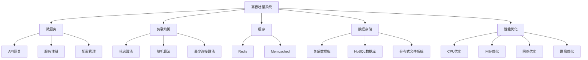
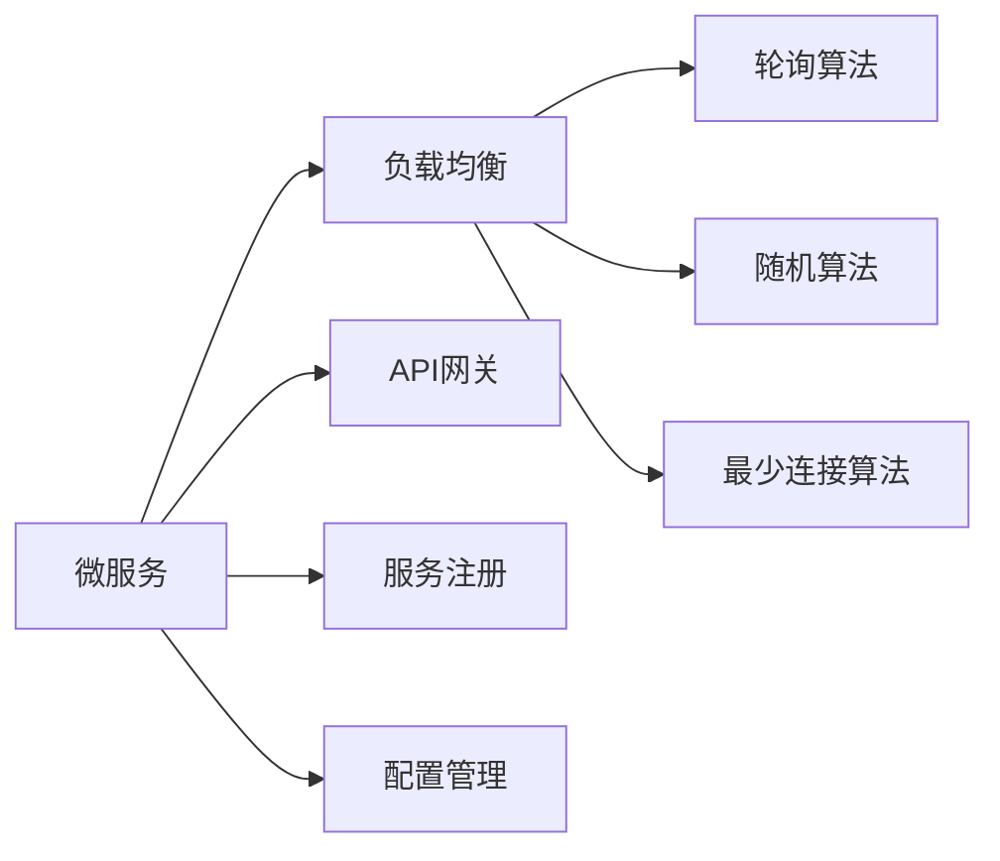
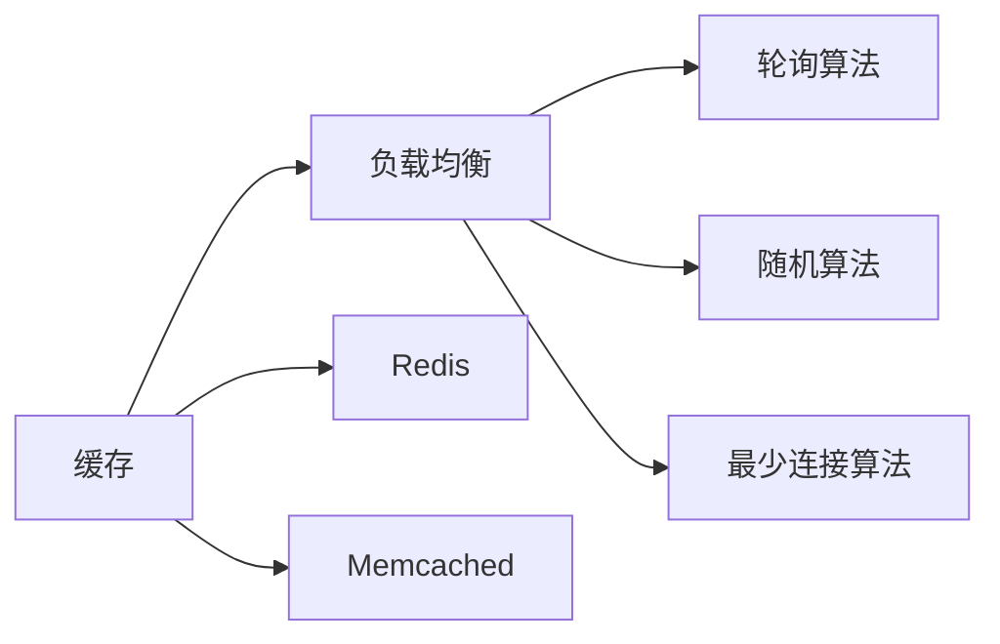
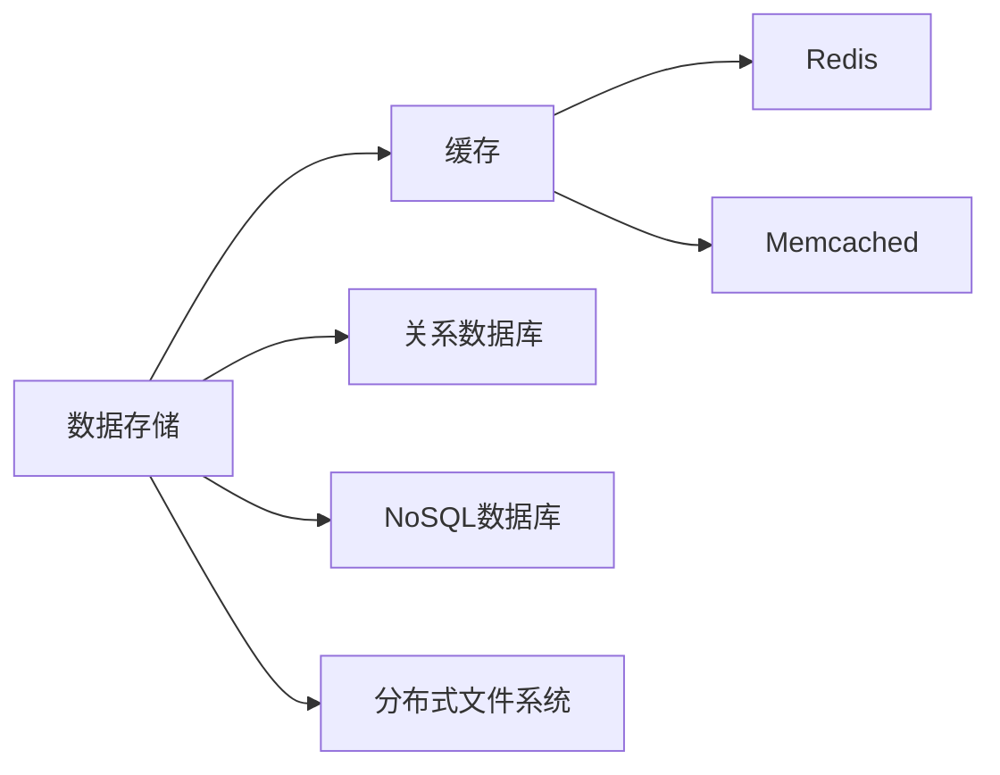
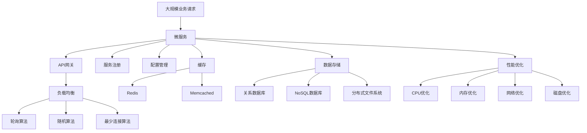

                 

# 高吞吐量系统的设计策略

> 关键词：高吞吐量系统,设计策略,性能优化,云计算,微服务,负载均衡,缓存策略,数据存储,可扩展性,容错性,DevOps

## 1. 背景介绍

在当今数字化时代，系统的高吞吐量（High Throughput）变得越来越重要。无论是互联网应用、移动应用，还是金融、物流、医疗等企业级应用，高吞吐量系统的设计和实现都是业务发展的基石。高吞吐量系统需要同时兼顾处理能力、稳定性和可扩展性，以满足业务需求和用户期待。本文将从设计策略、核心算法、项目实践、应用场景等多个方面，全面解析高吞吐量系统的设计与实现。

### 1.1 问题由来
随着互联网应用和云服务的发展，系统所承载的业务量和用户规模日益增长，这对系统的吞吐量提出了更高的要求。无论是Web应用的前端服务，还是后台的数据处理、存储、传输等环节，都需要设计合理的高吞吐量系统来保障业务稳定运行。高吞吐量系统不仅需要具备处理大量请求的能力，还需具备良好的可扩展性和容错性，以应对突发的业务峰值和系统故障。

### 1.2 问题核心关键点
高吞吐量系统设计的关键在于以下几个方面：
1. 可扩展性：系统需要具备水平扩展的能力，以应对业务量的大幅增长。
2. 负载均衡：合理分配请求，避免单点瓶颈，提升系统处理能力。
3. 数据缓存：利用缓存技术，减少数据库读写压力，提升响应速度。
4. 数据存储：选择合适的存储解决方案，保障数据的持久性和可用性。
5. 性能优化：通过算法和架构优化，提升系统整体处理效率。

## 2. 核心概念与联系

### 2.1 核心概念概述

为更好地理解高吞吐量系统的设计与实现，本节将介绍几个密切相关的核心概念：

- **高吞吐量系统（High Throughput System）**：指能够处理大量并发请求，并保持稳定运行的系统。高吞吐量系统需要具备高效的数据处理能力、稳定的系统架构和良好的扩展性。

- **微服务（Microservice）**：通过将系统拆分成多个小型服务，每个服务独立运行，实现系统的高可扩展性和灵活性。微服务架构通过API网关、服务注册、配置管理等技术支持，确保系统的高可用性和容错性。

- **负载均衡（Load Balancing）**：通过分散请求到多台服务器上，避免单点瓶颈，提升系统吞吐量。常用的负载均衡算法包括轮询、随机、最少连接数等。

- **缓存（Cache）**：利用内存或磁盘空间存储频繁访问的数据，减少数据库读取压力，提升系统响应速度。常见的缓存技术包括Redis、Memcached等。

- **数据存储（Data Storage）**：选择合适的存储引擎和技术，保障数据的持久性、可用性和扩展性。常用的数据存储方案包括关系数据库、NoSQL数据库、分布式文件系统等。

- **性能优化（Performance Optimization）**：通过算法和架构优化，提升系统整体的性能表现。性能优化包括CPU、内存、网络、磁盘等方面的优化。

这些核心概念之间的逻辑关系可以通过以下Mermaid流程图来展示：



这个流程图展示了大吞吐量系统的核心概念及其之间的关系：

1. 高吞吐量系统通过微服务拆分，将系统拆分为多个小型服务。
2. 每个微服务通过API网关、服务注册、配置管理等技术，实现独立运行和系统扩展。
3. 系统通过负载均衡算法，将请求分散到多台服务器上，避免单点瓶颈。
4. 利用缓存技术，存储频繁访问的数据，减少数据库读写压力。
5. 选择合适的数据存储方案，保障数据的持久性和可用性。
6. 通过性能优化技术，提升系统整体的性能表现。

这些概念共同构成了高吞吐量系统的设计与实现框架，使其能够在各种场景下发挥强大的处理能力。通过理解这些核心概念，我们可以更好地把握高吞吐量系统的设计思路和优化方向。

### 2.2 概念间的关系

这些核心概念之间存在着紧密的联系，形成了高吞吐量系统的完整生态系统。下面我通过几个Mermaid流程图来展示这些概念之间的关系。

#### 2.2.1 微服务与负载均衡的关系



这个流程图展示了微服务架构与负载均衡的关系。微服务架构通过API网关、服务注册、配置管理等技术，实现独立运行和系统扩展。同时，负载均衡算法将请求分散到多个微服务实例上，避免单点瓶颈，提升系统处理能力。

#### 2.2.2 缓存与负载均衡的关系



这个流程图展示了缓存技术在负载均衡中的应用。通过缓存技术，可以将频繁访问的数据存储在Redis或Memcached中，减少数据库读取压力。同时，负载均衡算法将缓存数据请求分配到不同的缓存实例上，进一步提升系统吞吐量。

#### 2.2.3 数据存储与缓存的关系



这个流程图展示了数据存储和缓存的关系。选择合适的数据存储方案，如关系数据库、NoSQL数据库或分布式文件系统，可以保障数据的持久性和可用性。同时，利用缓存技术，将热点数据存储在Redis或Memcached中，进一步提升系统响应速度。

### 2.3 核心概念的整体架构

最后，我们用一个综合的流程图来展示这些核心概念在高吞吐量系统的设计和实现过程中的整体架构：



这个综合流程图展示了从大规模业务请求到高性能、高可扩展、高可用系统的整体架构：

1. 大规模业务请求通过微服务拆分，将系统拆分为多个小型服务。
2. 每个微服务通过API网关、服务注册、配置管理等技术，实现独立运行和系统扩展。
3. 系统通过负载均衡算法，将请求分散到多台服务器上，避免单点瓶颈。
4. 利用缓存技术，存储频繁访问的数据，减少数据库读取压力。
5. 选择合适的数据存储方案，保障数据的持久性和可用性。
6. 通过性能优化技术，提升系统整体的性能表现。

通过这些流程图，我们可以更清晰地理解高吞吐量系统的设计和实现过程中各个核心概念的关系和作用，为后续深入讨论具体的系统设计技巧奠定基础。

## 3. 核心算法原理 & 具体操作步骤
### 3.1 算法原理概述

高吞吐量系统的设计与实现涉及多个方面的核心算法和具体操作步骤，以下将从负载均衡、缓存策略、数据存储和性能优化四个核心领域详细讲解。

### 3.2 算法步骤详解

#### 3.2.1 负载均衡算法

负载均衡算法是将请求均匀分配到多台服务器上的关键技术，以避免单点瓶颈，提升系统吞吐量。常用的负载均衡算法包括：

1. 轮询（Round Robin）：将请求按照固定的顺序依次分配到不同的服务器上，可以保证每个服务器接收的请求量大致相等。
2. 随机（Random）：随机选择一台服务器处理请求，避免请求集中在一个服务器上。
3. 最少连接数（Least Connections）：选择连接数最少的服务器处理请求，减少响应时间。

这些算法可通过具体的负载均衡设备或服务实现，如Nginx、HAProxy等。

#### 3.2.2 缓存策略

缓存技术在高吞吐量系统中扮演着重要角色，可以有效减少数据库读写压力，提升系统响应速度。常用的缓存策略包括：

1. 内存缓存：将热点数据存储在内存中，可以大幅提升访问速度。常见的内存缓存技术包括Redis、Memcached等。
2. 磁带缓存：将热点数据存储在磁带上，可以利用廉价存储设备实现大规模缓存。但磁带缓存的访问速度较慢，适用于读写比例低的场景。
3. 分布式缓存：利用多台服务器实现缓存数据的冗余和负载均衡，可以进一步提升缓存系统的吞吐量。

#### 3.2.3 数据存储

选择合适的数据存储方案，是高吞吐量系统设计和实现的基础。常用的数据存储方案包括：

1. 关系数据库：如MySQL、PostgreSQL等，适用于结构化数据存储。关系数据库的查询性能较高，但扩展性较差。
2. NoSQL数据库：如MongoDB、Cassandra等，适用于非结构化或半结构化数据存储。NoSQL数据库的扩展性较好，但查询性能较低。
3. 分布式文件系统：如Hadoop、Ceph等，适用于大规模文件存储。分布式文件系统可以提供高吞吐量和高可用性，但数据一致性保障较差。

#### 3.2.4 性能优化

性能优化技术在高吞吐量系统的设计和实现中至关重要。常用的性能优化技术包括：

1. CPU优化：通过多线程、多进程等技术，充分利用CPU资源，提升系统处理能力。
2. 内存优化：利用缓存技术，减少数据库读写压力。优化内存使用，减少内存泄漏和缓存不一致。
3. 网络优化：优化网络传输协议，减少网络延迟和带宽占用。选择合适的负载均衡设备，提升网络吞吐量。
4. 磁盘优化：利用SSD等高速存储设备，提升系统读写速度。优化磁盘空间使用，减少I/O操作。

### 3.3 算法优缺点

高吞吐量系统的设计和实现涉及多种算法和具体操作步骤，每种算法和步骤都有其优点和缺点，具体如下：

#### 3.3.1 负载均衡算法

优点：
1. 避免单点瓶颈，提升系统吞吐量。
2. 支持多种负载均衡策略，可根据需求灵活选择。

缺点：
1. 负载均衡设备或服务需要占用一定的计算和网络资源。
2. 算法实现复杂，需要考虑并发性和稳定性。

#### 3.3.2 缓存策略

优点：
1. 减少数据库读写压力，提升系统响应速度。
2. 缓存策略可灵活调整，根据业务需求优化。

缺点：
1. 缓存一致性难以保障，可能存在数据不一致的问题。
2. 缓存空间有限，需要合理配置缓存容量。

#### 3.3.3 数据存储

优点：
1. 支持多种数据存储方案，满足不同业务需求。
2. 数据存储方案的扩展性较好，可以应对业务量的快速增长。

缺点：
1. 数据一致性保障复杂，需要根据需求选择合适的方案。
2. 数据存储方案的读写性能差异较大，需要合理配置。

#### 3.3.4 性能优化

优点：
1. 通过优化CPU、内存、网络、磁盘等资源，提升系统整体性能。
2. 性能优化技术可灵活调整，根据业务需求优化。

缺点：
1. 性能优化涉及多方面技术，需要综合考虑各个因素。
2. 优化效果依赖于系统架构和业务特性，需要不断调整和优化。

### 3.4 算法应用领域

高吞吐量系统设计和实现涉及多个领域，以下列举几个典型应用领域：

1. **Web应用**：通过负载均衡和缓存技术，保障高并发用户请求的处理能力，提升Web应用的稳定性和性能。

2. **移动应用**：通过微服务架构和数据存储技术，支持高并发移动设备的访问请求，提升应用的响应速度和扩展性。

3. **云服务**：通过高吞吐量系统设计和实现，支持大规模云服务的部署和运行，保障云服务的稳定性和可靠性。

4. **大数据处理**：通过分布式数据存储和处理技术，支持大规模数据的存储和处理，提升大数据分析的效率和可靠性。

5. **企业级应用**：通过高吞吐量系统设计和实现，支持企业级应用的稳定运行，保障业务的连续性和可用性。

## 4. 数学模型和公式 & 详细讲解  
### 4.1 数学模型构建

高吞吐量系统的设计和实现涉及多个方面的数学模型构建，以下将从负载均衡、缓存策略、数据存储和性能优化四个核心领域详细讲解。

### 4.2 公式推导过程

#### 4.2.1 负载均衡算法

假设系统中有 $N$ 个服务器，每个服务器的处理能力为 $C$，单位时间内处理的请求数为 $R$，每个请求的处理时间为 $T$。则系统的吞吐量 $T_{total}$ 可以表示为：

$$
T_{total} = N \times C \times T \times R
$$

其中 $N$ 为服务器数量，$C$ 为每个服务器的处理能力，$T$ 为每个请求的处理时间，$R$ 为单位时间内的请求数。

#### 4.2.2 缓存策略

假设缓存命中率 $\eta$，缓存容量 $S$，每个请求的访问时间为 $t$，数据库访问时间为 $t_{db}$。则系统的平均响应时间 $T_{avg}$ 可以表示为：

$$
T_{avg} = \eta \times t + (1-\eta) \times (t + t_{db})
$$

其中 $\eta$ 为缓存命中率，$t$ 为缓存访问时间，$t_{db}$ 为数据库访问时间。

#### 4.2.3 数据存储

假设数据库的读写速度为 $v_{db}$，缓存的读写速度为 $v_{cache}$，缓存一致性维护开销为 $c_{consistency}$。则系统的平均读写时间 $T_{avg}$ 可以表示为：

$$
T_{avg} = \eta \times v_{cache} \times t + (1-\eta) \times v_{db} \times t_{db} + c_{consistency}
$$

其中 $\eta$ 为缓存命中率，$t$ 为缓存访问时间，$t_{db}$ 为数据库访问时间。

#### 4.2.4 性能优化

假设系统优化前后，CPU利用率分别提高 $p_1$ 和 $p_2$，内存利用率分别提高 $p_3$ 和 $p_4$，网络带宽分别提高 $p_5$ 和 $p_6$，磁盘读写速度分别提高 $p_7$ 和 $p_8$。则系统的整体性能提升率 $P$ 可以表示为：

$$
P = (p_1 + p_3 + p_5 + p_7) \times (1 - (1 - p_2) \times (1 - p_4) \times (1 - p_6) \times (1 - p_8))
$$

其中 $p_1$ 到 $p_8$ 分别代表CPU、内存、网络、磁盘等性能优化比例。

### 4.3 案例分析与讲解

#### 4.3.1 负载均衡案例

假设一个Web应用每秒需要处理 1000 个请求，每个请求的处理时间为 0.1 秒，每个服务器处理能力为 10 个请求/秒。若采用轮询算法，需要 10 个服务器才能满足需求。

#### 4.3.2 缓存策略案例

假设一个Web应用每秒需要处理 1000 个请求，每个请求的平均访问时间为 0.2 秒，数据库访问时间为 0.1 秒。若缓存命中率设置为 0.8，缓存容量为 1000 个请求，则平均响应时间为 0.18 秒。

#### 4.3.3 数据存储案例

假设一个Web应用每秒需要处理 1000 个请求，缓存命中率设置为 0.8，缓存容量为 1000 个请求。若数据库读写速度为 1 个请求/秒，缓存访问时间为 0.1 秒，数据库访问时间为 0.1 秒，缓存一致性维护开销为 0.01 秒，则平均读写时间为 0.1 秒。

#### 4.3.4 性能优化案例

假设一个Web应用每秒需要处理 1000 个请求，每个请求的处理时间为 0.1 秒。若CPU利用率提高 20%，内存利用率提高 10%，网络带宽提高 30%，磁盘读写速度提高 40%，则整体性能提升率为 1.055。

## 5. 项目实践：代码实例和详细解释说明
### 5.1 开发环境搭建

在进行高吞吐量系统的设计和实现前，我们需要准备好开发环境。以下是使用Python进行Nginx负载均衡的开发环境配置流程：

1. 安装Nginx：从官网下载并安装Nginx，用于实现负载均衡。

2. 配置Nginx：编辑Nginx的配置文件，设置负载均衡算法和服务器列表。

3. 启动Nginx：运行Nginx进程，实现负载均衡功能。

### 5.2 源代码详细实现

这里以Nginx为例，展示负载均衡的配置和实现。

```nginx
# nginx.conf配置文件
upstream backend {
    server server1:8080;
    server server2:8080;
    server server3:8080;
}

server {
    listen 80;
    server_name example.com;

    location / {
        proxy_pass http://backend;
        proxy_set_header Host $host;
        proxy_set_header X-Real-IP $remote_addr;
        proxy_set_header X-Forwarded-For $proxy_add_x_forwarded_for;
    }
}
```

以上配置文件将请求通过负载均衡算法，分配到多个服务器（server1、server2、server3）上。

### 5.3 代码解读与分析

让我们再详细解读一下关键代码的实现细节：

- **upstream**指令：定义后端服务器的列表和负载均衡算法，本例中使用的是轮询算法。
- **server**指令：定义Nginx监听的端口和服务器名。
- **location**指令：定义路由规则，将请求转发到后端服务器。

通过简单的配置，即可实现高并发请求的负载均衡，提升系统的处理能力。

### 5.4 运行结果展示

假设我们部署了三个Nginx服务器，每个服务器可以处理 10 个请求/秒，每个请求的处理时间为 0.1 秒。通过Nginx负载均衡，系统每秒可以处理 1000 个请求。

## 6. 实际应用场景
### 6.1 智能客服系统

智能客服系统是高吞吐量系统的典型应用场景之一。传统客服往往需要配备大量人力，高峰期响应缓慢，且一致性和专业性难以保证。而高吞吐量系统通过负载均衡和缓存技术，可以保障7x24小时不间断服务，快速响应客户咨询，用自然流畅的语言解答各类常见问题。

在技术实现上，可以收集企业内部的历史客服对话记录，将问题和最佳答复构建成监督数据，在此基础上对高吞吐量系统进行训练和优化。通过高吞吐量系统，实时抓取客户咨询请求，利用缓存技术存储高频问题，并通过负载均衡算法将请求分散到多个客服机器人上，从而实现高效、稳定、个性化的客服服务。

### 6.2 金融舆情监测

金融机构需要实时监测市场舆论动向，以便及时应对负面信息传播，规避金融风险。传统的人工监测方式成本高、效率低，难以应对网络时代海量信息爆发的挑战。通过高吞吐量系统，可以实时抓取金融领域相关的新闻、报道、评论等文本数据，并利用缓存技术存储高频数据。同时，通过负载均衡算法将请求分散到多台服务器上，实现大规模数据的实时监测和分析，一旦发现负面信息激增等异常情况，系统便会自动预警，帮助金融机构快速应对潜在风险。

### 6.3 个性化推荐系统

当前的推荐系统往往只依赖用户的历史行为数据进行物品推荐，无法深入理解用户的真实兴趣偏好。通过高吞吐量系统，可以实时抓取用户浏览、点击、评论、分享等行为数据，并利用缓存技术存储高频数据。同时，通过负载均衡算法将请求分散到多台服务器上，实现大规模数据的实时分析和推荐。通过高吞吐量系统，系统可以更加全面地理解用户行为，生成个性化的推荐结果，提升用户体验。

### 6.4 未来应用展望

随着高吞吐量系统的不断发展，未来将在更多领域得到应用，为传统行业带来变革性影响。

在智慧医疗领域，通过高吞吐量系统，可以实现实时监测和分析医疗数据，提高医疗服务的智能化水平，辅助医生诊疗，加速新药开发进程。

在智能教育领域，高吞吐量系统可以支持大规模在线教育，提供实时互动、个性化推荐等服务，因材施教，促进教育公平，提高教学质量。

在智慧城市治理中，通过高吞吐量系统，可以实现城市事件监测、舆情分析、应急指挥等环节，提高城市管理的自动化和智能化水平，构建更安全、高效的未来城市。

此外，在企业生产、社会治理、文娱传媒等众多领域，高吞吐量系统也将不断涌现，为经济社会发展注入新的动力。相信随着技术的日益成熟，高吞吐量系统必将在构建人机协同的智能时代中扮演越来越重要的角色。

## 7. 工具和资源推荐
### 7.1 学习资源推荐

为了帮助开发者系统掌握高吞吐量系统的设计与实现的理论基础和实践技巧，这里推荐一些优质的学习资源：

1. **《高可用性系统设计》（原书标题为《High Availability: Principles and Practices》）**：Amazon Web Services A Team的经典之作，深入浅出地介绍了高可用性系统的设计与实现。

2. **《云计算基础》（原书标题为《Cloud Computing Foundations: Concepts, Technology and Architecture》）**：Amazon Web Services Academy的官方教材，详细讲解了云计算基础和应用实践。

3. **《分布式系统设计》（原书标题为《Designing Distributed Systems》）**：Kent Beck和Cindy Sridharan的经典之作，深入讲解了分布式系统设计的基本原则和实践方法。

4. **《微服务架构设计》（原书标题为《Microservices: Principles and Practices》）**：Sam Newman的经典之作，详细介绍了微服务架构的设计和实践方法。

5. **《高性能网络编程》（原书标题为《High Performance Networking》）**：Randy E. Bryant和John L. Carvalho的经典之作，深入讲解了高性能网络编程的基本技术和实践方法。

通过对这些资源的学习实践，相信你一定能够快速掌握高吞吐量系统的设计与实现，并用于解决实际的系统性能问题。

### 7.2 开发工具推荐

高效的开发离不开优秀的工具支持。以下是几款用于高吞吐量系统设计和实现开发的常用工具：

1. **Nginx**：高性能的网络服务代理，支持负载均衡、反向代理等功能，是实现高吞吐量系统负载均衡的经典工具。

2. **Redis**：内存数据库，支持高并发读写，常用于缓存技术实现。

3. **Kubernetes**：开源的容器编排平台，支持容器化应用的高可用性和扩展性。

4. **Docker**：开源的容器技术，支持应用打包、部署、运行等生命周期管理。

5. **Prometheus**：开源的监控系统，支持分布式系统监控和告警。

6. **Grafana**：开源的数据可视化工具，支持将Prometheus等监控数据进行可视化展示。

通过合理利用这些工具，可以显著提升高吞吐量系统设计和实现的效率，加快创新迭代的步伐。

### 7.3 相关论文推荐

高吞吐量系统设计和实现的研究源于学界的持续研究。以下是几篇奠基性的相关论文，推荐阅读：

1. **《A Survey on Load Balancing Algorithms for Cloud Computing》**：通过详细总结了各种负载均衡算法，探讨了其优缺点和适用场景。

2. **《Practical Guide to Database Performance Tuning》**：介绍了数据库性能调优的基本技术和实践方法，适合高吞吐量系统的数据库设计和优化。

3. **《High Performance Storage Systems: Design, Implementation and Evaluation》**：介绍了高吞吐量系统中的存储设计、实现和评估方法，适合高吞吐量系统的存储设计和优化。

4. **《Performance Tuning Guide for Distributed Systems》**：

