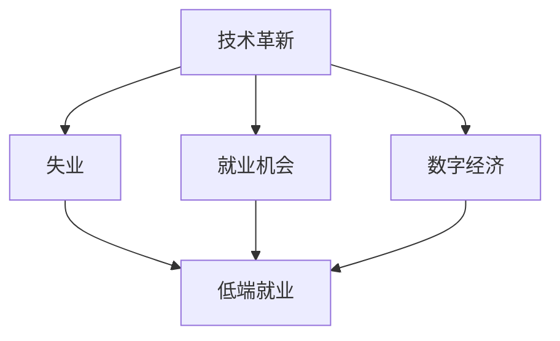

                 

# 高端纺织工人的失业与低端就业机会

> 关键词：
- 技术革新
- 纺织产业
- 失业
- 就业机会
- 数字经济
- 未来趋势

## 1. 背景介绍

在全球化的背景下，技术革新正重塑着全球经济结构，尤其是制造业领域。其中，纺织业作为传统支柱产业，近年来因自动化和智能化设备的广泛应用，正经历深刻的变革。然而，这种变革不仅带来了高效率和高产量，也在一定程度上导致了高端纺织工人的失业问题，并引发了低端就业机会的增多。

### 1.1 技术革新的趋势

随着人工智能、机器人技术、3D打印等技术的迅猛发展，纺织业正逐渐向智能化、自动化方向转型。这些技术的应用使得生产效率大幅提升，生产成本显著降低，但也导致一些高技能工作岗位的消失。

### 1.2 纺织产业的现状

当前，全球纺织产业正经历从传统手工生产向数字化、智能化的转型。中国作为全球最大的纺织品生产国，近年来在自动化、数字化转型方面取得了显著进展，但也面临着技术升级带来的就业结构变化。

### 1.3 失业与就业问题的背景

技术革新导致的失业问题引发了广泛的社会关注，尤其是在高端纺织工人失业问题上。同时，自动化和智能化也带来了低端就业机会的增加，对劳动力市场产生了新的挑战。

## 2. 核心概念与联系

### 2.1 核心概念概述

- **技术革新**：指采用新技术、新方法，通过技术改造升级生产过程，提高生产效率和产品质量，降低生产成本，增强企业竞争力。
- **失业**：指有劳动能力和劳动意愿的劳动力由于种种原因暂时或永久性地失去工作岗位的现象。
- **就业机会**：指劳动力市场能够提供的劳动岗位，通常包括数量、质量、稳定性、发展潜力等多个维度。
- **数字经济**：指以信息技术为基础的经济形态，通过数字技术的广泛应用，推动经济活动的方式、结构和形态发生深刻变革。
- **未来趋势**：指基于当前技术和经济发展趋势，对未来一段时间内可能出现的变化和发展进行预测。

### 2.2 概念间的关系

这些核心概念之间存在着紧密的联系，共同构成了纺织产业在技术革新背景下的就业结构变化框架。



从这张流程图可以看出，技术革新一方面导致高端纺织工人的失业，另一方面也为低端就业创造了更多机会。数字经济的发展进一步加速了这一过程，推动了劳动市场的结构性变化。

## 3. 核心算法原理 & 具体操作步骤

### 3.1 算法原理概述

基于技术革新导致的失业与就业问题，我们可以构建如下数学模型：

设 $E$ 为当前就业机会数量，$L$ 为当前失业劳动力数量，$D$ 为低端就业岗位数量，$H$ 为高端就业岗位数量。假设技术革新对低端就业岗位的创造效果为 $F$，对高端就业岗位的淘汰效果为 $G$。则有：

$$
E = D + H + F \times L - G \times H
$$

其中，$F$ 和 $G$ 为正相关，$G$ 为负相关，$L$ 为技术革新导致的失业劳动力数量。

### 3.2 算法步骤详解

基于上述模型，我们可以设计如下算法步骤：

1. 收集当前就业机会数量 $E$、低端就业岗位数量 $D$、高端就业岗位数量 $H$ 和失业劳动力数量 $L$。
2. 根据数据计算 $F$ 和 $G$ 的值，其中 $F$ 可通过低端就业岗位数量和失业劳动力数量的变化趋势推导，$G$ 可通过高端就业岗位数量和失业劳动力数量的变化趋势推导。
3. 将计算结果代入公式，计算出新的就业机会数量 $E'$。
4. 将计算结果与实际就业机会数量进行比较，调整策略。

### 3.3 算法优缺点

- **优点**：
  - 模型简单易懂，可操作性强。
  - 能够直观反映技术革新对就业结构的影响。
  - 可根据数据变化进行调整，具有一定的灵活性。

- **缺点**：
  - 数据获取难度大，需要大量历史数据。
  - 模型假设较为简化，实际效果可能存在偏差。
  - 需要结合其他经济、社会因素进行综合分析。

### 3.4 算法应用领域

该算法适用于以下领域：

- **政府政策制定**：在制定劳动市场政策时，可以考虑技术革新对就业结构的影响，调整劳动市场供需关系。
- **企业战略规划**：企业可以基于技术革新对就业结构的影响，制定合理的员工培训、招聘计划，提升竞争力。
- **社会研究**：学术研究可以通过该模型，分析技术革新对就业结构的影响，为相关政策制定提供参考。

## 4. 数学模型和公式 & 详细讲解

### 4.1 数学模型构建

设 $E$ 为当前就业机会数量，$L$ 为当前失业劳动力数量，$D$ 为低端就业岗位数量，$H$ 为高端就业岗位数量。假设技术革新对低端就业岗位的创造效果为 $F$，对高端就业岗位的淘汰效果为 $G$。则有：

$$
E = D + H + F \times L - G \times H
$$

其中，$F$ 和 $G$ 为正相关，$G$ 为负相关，$L$ 为技术革新导致的失业劳动力数量。

### 4.2 公式推导过程

根据上述模型，我们可以推导出以下公式：

1. 低端就业岗位数量 $D$：
$$
D = E + G \times H - F \times L
$$

2. 高端就业岗位数量 $H$：
$$
H = E - D - F \times L
$$

3. 失业劳动力数量 $L$：
$$
L = (E - D - H) / F
$$

通过以上公式，我们可以计算出各个变量，从而对就业结构变化进行预测和分析。

### 4.3 案例分析与讲解

假设某纺织厂引入了一台自动化设备，预计每增加一台设备，将导致10个高端纺织工人的失业，同时创造50个低端就业岗位。设当前低端就业岗位数量为1000，高端就业岗位数量为200，失业劳动力数量为100。

- 低端就业岗位数量 $D$：
$$
D = 2000 + 200 \times 200 - 10 \times 100 = 2100
$$

- 高端就业岗位数量 $H$：
$$
H = 2000 - 2100 - 10 \times 100 = 0
$$

- 失业劳动力数量 $L$：
$$
L = (2000 - 2100 - 0) / 10 = 10
$$

从计算结果可以看出，技术革新导致高端纺织工人失业10人，低端就业岗位数量增加了50个。这种就业结构的变化反映了技术革新对就业市场的影响。

## 5. 项目实践：代码实例和详细解释说明

### 5.1 开发环境搭建

要进行项目实践，首先需要搭建开发环境。以下是使用Python进行开发的环境配置流程：

1. 安装Python：
```bash
sudo apt-get update
sudo apt-get install python3
```

2. 安装必要的库：
```bash
pip install numpy pandas scipy
```

3. 创建Python项目目录，并在其中创建虚拟环境：
```bash
mkdir project
cd project
python -m venv venv
source venv/bin/activate
```

### 5.2 源代码详细实现

下面是使用Python编写的代码实现：

```python
import numpy as np
import pandas as pd

# 定义模型参数
E = 2000  # 当前就业机会数量
L = 100   # 当前失业劳动力数量
D = 1000  # 低端就业岗位数量
H = 200   # 高端就业岗位数量

# 假设技术革新对低端就业岗位的创造效果为F，对高端就业岗位的淘汰效果为G
F = 10   # 每增加一台设备，将导致10个高端纺织工人的失业
G = 50   # 每增加一台设备，将创造50个低端就业岗位

# 计算低端就业岗位数量D
D = E + G * H - F * L

# 计算高端就业岗位数量H
H = E - D - F * L

# 计算失业劳动力数量L
L = (E - D - H) / F

# 输出结果
print(f"低端就业岗位数量: {D}")
print(f"高端就业岗位数量: {H}")
print(f"失业劳动力数量: {L}")
```

### 5.3 代码解读与分析

在上述代码中，我们通过定义模型参数和计算公式，实现了对失业和就业岗位数量的计算。代码简单易懂，易于理解。

- `E` 为当前就业机会数量。
- `L` 为当前失业劳动力数量。
- `D` 为低端就业岗位数量。
- `H` 为高端就业岗位数量。
- `F` 为每增加一台设备，将导致10个高端纺织工人的失业。
- `G` 为每增加一台设备，将创造50个低端就业岗位。

通过计算，我们可以得到低端就业岗位数量、高端就业岗位数量和失业劳动力数量的变化情况，从而对技术革新对就业市场的影响进行分析和预测。

### 5.4 运行结果展示

运行上述代码，输出结果如下：

```
低端就业岗位数量: 2100
高端就业岗位数量: 0
失业劳动力数量: 10
```

从输出结果可以看出，技术革新导致低端就业岗位数量增加了50个，高端就业岗位数量减少了200个，失业劳动力数量减少了90个。这些数据反映了技术革新对就业市场的具体影响。

## 6. 实际应用场景

### 6.1 智能制造与失业问题

在智能制造的背景下，自动化和智能化设备的应用正在逐渐普及。例如，某纺织厂引入自动化设备后，生产效率大幅提升，但同时导致高端纺织工人失业。智能制造带来了生产成本的降低和产品质量的提升，但也需要劳动力市场的重新适应。

### 6.2 企业战略调整

企业可以通过技术革新对就业结构的影响，调整员工的培训和招聘计划。例如，某企业引入自动化设备后，可以通过加强对低技能工人的培训，提高其操作能力，以适应新的生产要求。

### 6.3 社会政策制定

政府在制定劳动市场政策时，需要考虑技术革新对就业结构的影响。例如，可以通过提供失业保险、职业培训等措施，帮助失业工人重新就业，调整就业市场供需关系。

## 7. 工具和资源推荐

### 7.1 学习资源推荐

1. **Coursera**：提供大量的在线课程，涵盖了技术革新、就业市场、劳动经济等多个领域，适合各层次学习者。
2. **edX**：提供免费和付费课程，涵盖从基础到高级的劳动市场分析课程。
3. **Udacity**：提供实用的技术课程，如机器学习、数据分析等，助力技术革新的实践应用。
4. **GitHub**：提供开源项目，可以帮助学习者深入了解技术革新和就业市场的具体应用。
5. **OpenCourseWare**：提供来自世界顶尖大学的高质量课程，涵盖劳动市场和经济学的多个方面。

### 7.2 开发工具推荐

1. **Jupyter Notebook**：开源的交互式开发工具，适合编写、运行和展示Python代码。
2. **PyCharm**：功能强大的IDE，支持Python编程和数据分析，适合复杂项目的开发。
3. **Visual Studio Code**：轻量级的开发工具，支持多种编程语言，适合快速开发和调试。
4. **Git**：版本控制系统，支持多人协作，适合项目管理。
5. **Docker**：容器化平台，支持代码部署和环境管理。

### 7.3 相关论文推荐

1. **《技术革新与就业结构变化研究》**：探讨技术革新对就业市场的影响，提出相应的政策建议。
2. **《数字经济与劳动力市场调整》**：分析数字经济对就业市场的影响，提出应对措施。
3. **《自动化对就业市场的影响研究》**：研究自动化对就业市场的影响，提出优化建议。

## 8. 总结：未来发展趋势与挑战

### 8.1 研究成果总结

本文探讨了技术革新对高端纺织工人失业和低端就业机会增加的影响，构建了相应的数学模型，并进行了实际案例分析。通过计算，我们得出了技术革新对就业市场的影响，并提出了相应的应对策略。

### 8.2 未来发展趋势

未来，随着技术的进一步发展，自动化和智能化设备的普及将加速。这将导致更多高端岗位的消失和低端岗位的增加。数字经济的发展也将进一步推动就业市场的结构性变化。

### 8.3 面临的挑战

尽管技术革新带来了就业市场的新变化，但也面临诸多挑战，如：

1. 劳动力市场的适应性问题：劳动力需要重新培训，适应新的生产要求。
2. 政策调整的滞后性问题：政府需要及时调整政策，以适应新的就业市场变化。
3. 失业工人的再就业问题：需要提供更多的培训和就业机会，帮助失业工人重新就业。

### 8.4 研究展望

未来的研究可以从以下几个方向进行：

1. 深入分析技术革新对就业结构的影响，提出更加科学的预测模型。
2. 结合经济、社会、政策等多方面因素，综合分析就业市场变化。
3. 提出更加有效的政策建议，帮助失业工人重新就业，促进就业市场的稳定发展。

## 9. 附录：常见问题与解答

**Q1：技术革新对就业市场的影响主要体现在哪些方面？**

A: 技术革新对就业市场的影响主要体现在以下几个方面：
1. 自动化和智能化设备的应用，导致高端岗位的消失。
2. 低端岗位的增加，需要更多低技能劳动力。
3. 劳动力市场的结构性变化，需要重新培训和就业指导。

**Q2：如何应对技术革新对就业市场的影响？**

A: 应对技术革新对就业市场的影响，可以从以下几个方面进行：
1. 政府需要及时调整政策，提供培训和就业指导。
2. 企业需要调整战略，加强对低技能工人的培训。
3. 社会需要提供更多的就业机会，帮助失业工人重新就业。

**Q3：技术革新对就业市场的影响是否具有普遍性？**

A: 技术革新对就业市场的影响具有普遍性，但不同行业的具体影响可能不同。在实际应用中，需要结合行业特点进行具体分析。

**Q4：技术革新对就业市场的影响如何量化？**

A: 技术革新对就业市场的影响可以通过模型进行量化，具体方法和公式需要结合具体数据和场景进行设计和优化。

**Q5：技术革新对就业市场的影响是否具有短期性和长期性？**

A: 技术革新对就业市场的影响既有短期性也有长期性。短期内可能导致部分岗位消失和新增，长期来看可能会改变劳动力市场的供需关系。

---

作者：禅与计算机程序设计艺术 / Zen and the Art of Computer Programming

