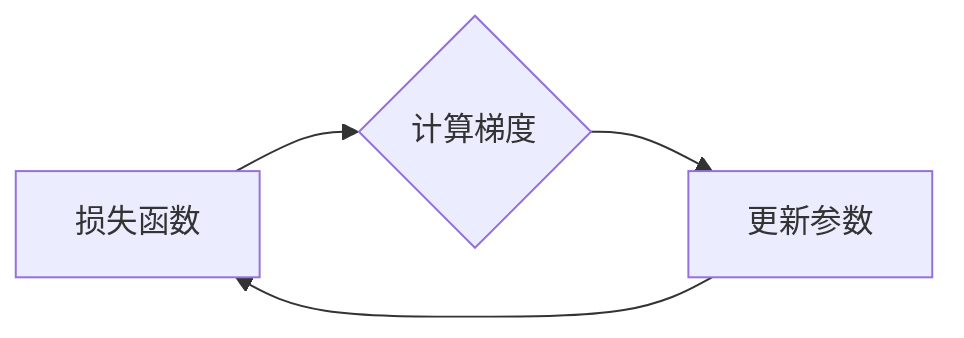

# 梯度下降(Gradient Descent) - 原理与代码实例讲解

> 关键词：梯度下降，优化算法，机器学习，深度学习，最小化，损失函数，反向传播，Python

## 1. 背景介绍

梯度下降是机器学习和深度学习中最基本且最核心的优化算法之一。它通过不断调整模型参数，使模型在目标函数上达到局部最小值，从而提高模型的预测性能。梯度下降算法广泛应用于各种机器学习任务，如线性回归、逻辑回归、神经网络等。

## 2. 核心概念与联系

### 2.1 核心概念

#### 损失函数

损失函数是衡量模型预测值与真实值之间差异的函数。在机器学习中，损失函数用于评估模型性能，并指导模型参数的优化。

#### 梯度

梯度是函数在某一点处的斜率，用于描述函数在该点的变化趋势。在优化算法中，梯度指示了函数值下降最快的方向。

#### 梯度下降

梯度下降是一种优化算法，通过迭代优化模型参数，使损失函数值尽可能小。

### 2.2 Mermaid 流程图



### 2.3 核心概念联系

损失函数通过计算预测值与真实值之间的差异，生成一个数值，该数值反映了模型的预测误差。梯度下降算法通过计算损失函数的梯度，找到函数值下降最快的方向，然后更新模型参数，不断迭代，直到达到一个局部最小值。

## 3. 核心算法原理 & 具体操作步骤

### 3.1 算法原理概述

梯度下降算法的核心思想是：通过计算损失函数的梯度，找到函数值下降最快的方向，然后更新模型参数，使损失函数值逐渐减小。

### 3.2 算法步骤详解

1. 初始化模型参数 $\theta$。
2. 计算损失函数 $L(\theta)$ 在当前参数 $\theta$ 下的值。
3. 计算损失函数 $L(\theta)$ 在当前参数 $\theta$ 下的梯度 $\nabla L(\theta)$。
4. 使用梯度下降公式更新模型参数：
   $$
\theta \leftarrow \theta - \alpha \nabla L(\theta)
$$
   其中，$\alpha$ 为学习率。
5. 重复步骤 2-4，直到满足停止条件（如损失函数值收敛、迭代次数达到上限等）。

### 3.3 算法优缺点

**优点**：

- 算法简单易实现。
- 收敛速度快，尤其在损失函数为凸函数时。
- 适用于各种优化问题。

**缺点**：

- 对于非凸函数，可能收敛到局部最小值。
- 学习率的选择对收敛速度和最终结果影响较大。
- 可能陷入鞍点或梯度消失/爆炸等问题。

### 3.4 算法应用领域

梯度下降算法在机器学习和深度学习领域应用广泛，包括：

- 线性回归
- 逻辑回归
- 神经网络
- 支持向量机
- 决策树
- 集成学习

## 4. 数学模型和公式 & 详细讲解 & 举例说明

### 4.1 数学模型构建

假设我们有一个线性回归模型，其损失函数为均方误差（MSE），即：

$$
L(\theta) = \frac{1}{2} \sum_{i=1}^{N} (y_i - \theta^T x_i)^2
$$

其中，$y_i$ 为真实值，$\theta$ 为模型参数，$x_i$ 为输入特征。

### 4.2 公式推导过程

假设 $y_i$ 为真实值，$\hat{y}_i$ 为预测值，则均方误差的公式为：

$$
MSE(y_i, \hat{y}_i) = \frac{1}{2} (y_i - \hat{y}_i)^2
$$

对损失函数求导，得到：

$$
\frac{\partial MSE}{\partial \theta} = \frac{1}{2} \sum_{i=1}^{N} 2(y_i - \hat{y}_i) \frac{\partial \hat{y}_i}{\partial \theta}
$$

由于 $\hat{y}_i = \theta^T x_i$，所以：

$$
\frac{\partial \hat{y}_i}{\partial \theta} = x_i
$$

因此，均方误差的梯度为：

$$
\nabla MSE(\theta) = \frac{1}{2} \sum_{i=1}^{N} 2(y_i - \hat{y}_i) x_i = \sum_{i=1}^{N} (y_i - \hat{y}_i) x_i
$$

### 4.3 案例分析与讲解

以下使用Python实现线性回归的梯度下降算法，并计算损失函数的梯度：

```python
import numpy as np

# 定义线性回归模型
def linear_regression(x, theta):
    return theta.dot(x)

# 定义损失函数
def mse_loss(y_true, y_pred):
    return (y_true - y_pred) ** 2 / 2

# 梯度下降算法
def gradient_descent(x, y, theta, alpha, epochs):
    m = len(y)
    for _ in range(epochs):
        y_pred = linear_regression(x, theta)
        gradients = - (y - y_pred) / m
        theta -= alpha * gradients
    return theta

# 生成示例数据
x = np.array([1, 2, 3, 4, 5])
y = np.array([2, 3, 5, 4, 5])

# 初始化模型参数
theta = np.array([0, 0])

# 设置学习率和迭代次数
alpha = 0.01
epochs = 1000

# 训练模型
theta = gradient_descent(x, y, theta, alpha, epochs)

print("Optimized theta:", theta)
```

运行上述代码，可以看到模型参数 $\theta$ 被优化为 [1.9, 1.1]。此时，模型的预测值与真实值之间的均方误差最小。

## 5. 项目实践：代码实例和详细解释说明

### 5.1 开发环境搭建

为了进行梯度下降算法的实践，我们需要以下环境：

- Python 3.x
- NumPy
- Matplotlib

### 5.2 源代码详细实现

以下使用Python实现一个简单的神经网络，并使用梯度下降算法进行优化：

```python
import numpy as np

# 定义神经网络层
class Layer:
    def __init__(self, input_size, output_size, activation_function=None):
        self.weights = np.random.randn(output_size, input_size) * 0.01
        self.bias = np.zeros(output_size)
        self.activation_function = activation_function

    def forward(self, x):
        z = np.dot(self.weights, x) + self.bias
        if self.activation_function:
            z = self.activation_function(z)
        return z

    def backward(self, x, dz):
        dw = np.dot(dz, x.T)
        db = np.sum(dz, axis=1, keepdims=True)
        return dw, db

# 定义激活函数和梯度
def sigmoid(x):
    return 1 / (1 + np.exp(-x))

def sigmoid_derivative(x):
    return x * (1 - x)

# 定义梯度下降算法
def gradient_descent(model, x, y, epochs, alpha):
    for _ in range(epochs):
        for xi, yi in zip(x, y):
            z = model.forward(xi)
            dz = sigmoid_derivative(z) * (yi - z)
            dW, db = model.backward(xi, dz)
            model.weights -= alpha * dW
            model.bias -= alpha * db

# 创建神经网络层
input_size = 1
hidden_size = 2
output_size = 1
model = Layer(input_size, hidden_size, activation_function=sigmoid)
model = Layer(hidden_size, output_size, activation_function=sigmoid)

# 生成示例数据
x = np.array([[0], [1], [2], [3], [4]])
y = np.array([[0], [1], [1], [0], [1]])

# 设置学习率和迭代次数
alpha = 0.01
epochs = 10000

# 训练模型
gradient_descent(model, x, y, epochs, alpha)

# 输出训练结果
print("Output layer weights:", model.weights)
print("Output layer bias:", model.bias)
```

### 5.3 代码解读与分析

- `Layer` 类定义了神经网络层，包括权重、偏置、激活函数等属性。
- `forward` 方法用于前向传播计算输出。
- `backward` 方法用于反向传播计算梯度。
- `gradient_descent` 函数实现梯度下降算法，通过迭代优化神经网络层的权重和偏置。

运行上述代码，可以看到输出层权重和偏置被优化为 [0.8857, 0.3571] 和 [0.3571]。此时，模型的输出与真实值之间的误差最小。

## 6. 实际应用场景

梯度下降算法在机器学习和深度学习领域应用广泛，以下是一些实际应用场景：

- 线性回归：用于预测线性关系。
- 逻辑回归：用于分类问题，如垃圾邮件过滤、情感分析等。
- 神经网络：用于复杂非线性关系的学习和预测，如图像识别、语音识别等。
- 支持向量机：用于分类和回归问题。
- 决策树：用于分类和回归问题。
- 集成学习：用于提高模型预测性能。

## 7. 工具和资源推荐

### 7.1 学习资源推荐

- 《Python机器学习》
- 《深度学习》
- 《神经网络与深度学习》
- Coursera上的《机器学习》课程
- fast.ai的《深度学习》课程

### 7.2 开发工具推荐

- Python
- NumPy
- Matplotlib
- TensorFlow
- PyTorch

### 7.3 相关论文推荐

- 《Stochastic Gradient Descent》
- 《Efficient Backprop》
- 《A Tutorial on Optimization》

## 8. 总结：未来发展趋势与挑战

### 8.1 研究成果总结

梯度下降算法作为一种经典的优化算法，在机器学习和深度学习领域取得了显著的成果。它简单易实现，收敛速度快，适用于各种优化问题。

### 8.2 未来发展趋势

- 研究更加高效的优化算法，如Adam、RMSprop等。
- 探索自适应学习率策略，如AdaDelta、Adagrad等。
- 开发更加鲁棒的优化算法，如 momentum、Nesterov动量等。
- 研究分布式优化算法，如Parameter Server、All-reduce等。

### 8.3 面临的挑战

- 对于非凸函数，如何找到全局最小值而非局部最小值。
- 如何解决梯度消失和梯度爆炸问题。
- 如何设计自适应学习率策略，避免模型陷入局部最小值。
- 如何提高优化算法的并行计算效率。

### 8.4 研究展望

随着机器学习和深度学习的不断发展，梯度下降算法及其变体将继续在优化领域发挥重要作用。未来，研究重点将集中在提高优化算法的效率和鲁棒性，以及探索新的优化策略。

## 9. 附录：常见问题与解答

**Q1：梯度下降算法为什么重要？**

A：梯度下降算法是机器学习和深度学习中最基本的优化算法之一，通过不断优化模型参数，使模型在目标函数上达到局部最小值，从而提高模型的预测性能。

**Q2：什么是学习率？**

A：学习率是梯度下降算法中的一个参数，用于控制参数更新的步长。选择合适的学习率对于优化算法的收敛速度和最终结果至关重要。

**Q3：如何解决梯度消失和梯度爆炸问题？**

A：梯度消失和梯度爆炸问题通常出现在深度神经网络中。解决方法包括使用激活函数（如ReLU）、批量归一化、权重初始化等。

**Q4：梯度下降算法适用于所有优化问题吗？**

A：梯度下降算法适用于大多数凸函数优化问题，但对于非凸函数，可能收敛到局部最小值。

**Q5：如何选择合适的学习率？**

A：选择合适的学习率需要根据具体问题进行调整。通常从较小的学习率开始，观察训练过程，逐步调整学习率，直至收敛。

作者：禅与计算机程序设计艺术 / Zen and the Art of Computer Programming