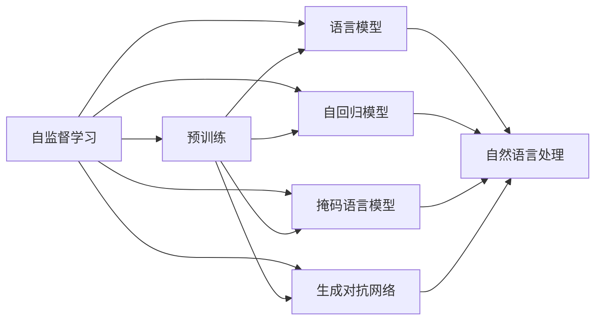
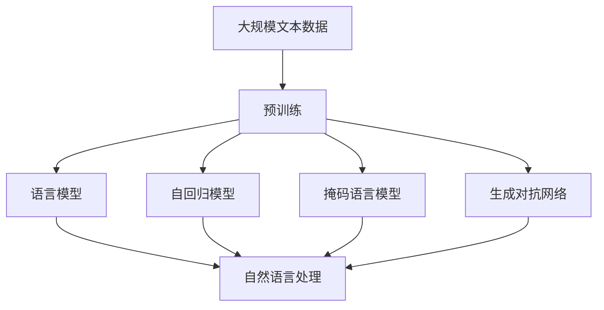

                 

# 自监督学习 原理与代码实例讲解

> 关键词：自监督学习, 预训练, 语言模型, 自回归模型, 掩码语言模型, 生成对抗网络, 代码实例, 自然语言处理, NLP

## 1. 背景介绍

### 1.1 问题由来
自监督学习（Self-supervised Learning）是机器学习中一种重要的学习范式。与传统的监督学习不同，自监督学习不需要标注数据，而是利用数据的自相关性，设计合适的预训练任务，使模型能够自主学习到数据的内在结构。自监督学习因其不需要人工标注，对大规模无标签数据具有较高的利用效率，近年来在自然语言处理（NLP）、计算机视觉、语音识别等领域取得了巨大成功。

### 1.2 问题核心关键点
自监督学习的核心思想是通过设计任务，利用数据中的自然规律来训练模型，使其能够自主学习到对任务的表示。这些预训练任务通常具有以下特点：
- 无监督性：不需要人工标注数据，能够充分利用大规模无标签数据。
- 自相关性：任务设计应基于数据的自然属性，使得模型能够通过学习数据自身规律来获得有益的表示。
- 弱监督性：任务设计应具有一定的监督信号，但无需高精度的标注，便于在大规模数据上训练。

自监督学习通过预训练得到模型表示，然后再在特定任务上微调，从而达到性能提升的目的。这种方法已经成为当前NLP领域的主流技术，尤其在预训练语言模型的构建中发挥了重要作用。

### 1.3 问题研究意义
自监督学习的研究意义主要体现在以下几个方面：
1. **数据利用效率**：自监督学习能够充分利用大规模无标签数据，极大地提高了数据利用效率，减少了对标注数据的依赖。
2. **模型表现提升**：通过预训练获得的高质量模型表示，微调后在特定任务上往往能够取得更好的效果。
3. **泛化能力增强**：自监督学习使模型具备更强的泛化能力，能够在不同领域和任务上表现稳定。
4. **应用场景广泛**：自监督学习不仅适用于NLP，在计算机视觉、语音识别等领域也取得了显著进展。
5. **技术创新驱动**：自监督学习的成功应用促进了深度学习技术的进一步发展，推动了AI技术的创新。

## 2. 核心概念与联系

### 2.1 核心概念概述
为了更好地理解自监督学习的原理，本节将介绍几个核心概念：

- **自监督学习**：利用数据中的自然规律，设计合适的预训练任务，使模型能够自主学习到对任务的表示。
- **预训练**：在大规模无标签数据上，通过自监督学习任务训练通用模型的过程。
- **语言模型**：指利用语言数据训练的模型，能够预测输入文本中的下一个单词或字符。
- **自回归模型**：一种基于当前输入预测后续输出的模型，如GPT系列。
- **掩码语言模型**：一种自回归模型的变体，通过掩码部分输入，让模型学习预测被掩码的部分。
- **生成对抗网络**（Generative Adversarial Networks, GANs）：由生成器和判别器两部分组成，通过对抗训练生成高质量的数据。
- **代码实例**：具体代码实现及其详细解释，帮助理解自监督学习的实际应用。
- **自然语言处理（NLP）**：涉及文本数据的处理和分析，是自监督学习的重要应用领域。

### 2.2 概念间的关系

这些核心概念之间的逻辑关系可以通过以下Mermaid流程图来展示：



这个流程图展示了这个核心概念之间的基本关系：自监督学习通过设计各种预训练任务，如语言模型、自回归模型、掩码语言模型、生成对抗网络等，训练出能够处理自然语言处理任务的通用模型。

### 2.3 核心概念的整体架构

最后，我们用一个综合的流程图来展示这些核心概念在大语言模型预训练过程中的整体架构：



这个综合流程图展示了从预训练到自然语言处理任务的具体过程：预训练阶段通过各种自监督任务，训练出能够处理自然语言处理任务的通用模型。这些模型包括语言模型、自回归模型、掩码语言模型和生成对抗网络，它们分别在不同领域和任务上发挥了重要作用。

## 3. 核心算法原理 & 具体操作步骤
### 3.1 算法原理概述

自监督学习的核心在于设计合适的预训练任务，使模型能够在无标签数据上进行自主学习。常用的预训练任务包括：

- **掩码语言模型**：通过掩码输入的一部分单词，训练模型预测被掩码的部分，从而学习到单词间的语义关系。
- **下一句预测**：随机打乱两个句子，训练模型判断它们是否为相邻的句子。
- **单词替换**：随机替换输入中的单词，训练模型预测替换后的单词，从而学习到单词的语义信息。
- **文档分类**：将一篇文章分割成多个段落，训练模型判断它们是否属于同一文档。
- **图像分类**：利用图像数据，训练模型对图像进行分类，如物体检测、图像生成等。

这些预训练任务不仅能够提高模型的泛化能力，还能使模型能够更好地适应下游任务的特征。自监督学习通过这些预训练任务，使得模型在大规模无标签数据上自主学习到语言的语义和结构信息，从而在微调时能够更好地适应特定任务，取得更好的效果。

### 3.2 算法步骤详解

自监督学习的预训练步骤通常包括以下几个关键步骤：

**Step 1: 准备预训练数据和任务**
- 收集大规模无标签数据，如维基百科、新闻、小说等。
- 设计合适的自监督学习任务，如掩码语言模型、下一句预测等。

**Step 2: 选择模型架构**
- 选择适合的语言模型架构，如GPT系列、BERT等。
- 确定模型的超参数，如层数、隐藏维度、学习率等。

**Step 3: 构建训练流程**
- 使用随机梯度下降（SGD）或其变体进行模型训练。
- 定义损失函数，如交叉熵损失、均方误差损失等。
- 设计正则化技术，如L2正则、Dropout等，防止过拟合。

**Step 4: 模型评估**
- 在验证集上评估模型性能，如BLEU、ROUGE等指标。
- 调整模型超参数，确保模型在训练集和验证集上的泛化能力。

**Step 5: 微调模型**
- 在特定任务的数据集上进行微调，如情感分析、命名实体识别等。
- 选择适当的微调策略，如full fine-tuning、prompt-based fine-tuning等。
- 调整学习率等超参数，确保微调过程的稳定性。

### 3.3 算法优缺点

自监督学习的优点包括：
1. 数据利用效率高：能够充分利用大规模无标签数据，减少对标注数据的依赖。
2. 模型泛化能力强：预训练模型具有较强的泛化能力，能够在不同领域和任务上表现稳定。
3. 训练成本低：无需标注数据，降低了数据标注成本和时间成本。
4. 模型效果显著：预训练模型在微调后，往往能够取得优于从头训练的效果。

自监督学习的缺点包括：
1. 模型复杂度高：预训练模型通常具有较多的参数，训练成本较高。
2. 训练时间长：预训练过程需要大量的计算资源，训练时间较长。
3. 泛化能力有限：在特定领域或任务上，预训练模型的泛化能力可能不足。
4. 可解释性差：预训练模型往往被认为是"黑盒"系统，难以解释其内部工作机制。

### 3.4 算法应用领域

自监督学习在NLP、计算机视觉、语音识别等领域得到了广泛应用，具体包括：

- **自然语言处理（NLP）**：如BERT、GPT、XLNet等模型，已经在文本分类、情感分析、命名实体识别等任务上取得了显著效果。
- **计算机视觉**：如自监督表示学习（Semi-supervised Learning），利用无标签图像数据进行图像分类、物体检测等。
- **语音识别**：如声码器预训练，利用无标签语音数据进行声码器训练，提升语音识别效果。

## 4. 数学模型和公式 & 详细讲解  
### 4.1 数学模型构建

自监督学习的数学模型通常包含以下部分：

- **输入表示**：将输入数据表示为向量形式，如文本的词嵌入向量，图像的卷积特征向量。
- **目标函数**：定义模型在输入数据上的损失函数，如掩码语言模型的交叉熵损失、生成对抗网络的对抗损失等。
- **优化算法**：如随机梯度下降（SGD）、Adam等，用于最小化目标函数。

以掩码语言模型为例，其目标函数定义为：

$$
\mathcal{L} = -\sum_{i=1}^n \log p(x_i | x_1, ..., x_{i-1}, x_{i+1}, ..., x_n)
$$

其中 $x_i$ 表示输入的 $i$ 个单词，$p(x_i | x_1, ..., x_{i-1}, x_{i+1}, ..., x_n)$ 表示在已知上下文的情况下，预测 $x_i$ 的概率分布。

### 4.2 公式推导过程

掩码语言模型的推导过程如下：

假设模型的输入为 $x_1, ..., x_n$，其中 $x_i$ 表示第 $i$ 个单词，$x$ 表示整个句子。设 $y_i$ 表示 $x_i$ 的掩码状态，若 $x_i$ 被掩码，则 $y_i=0$；否则 $y_i=1$。则掩码语言模型的目标函数为：

$$
\mathcal{L} = -\sum_{i=1}^n \sum_{y_i \in \{0, 1\}} \log p(x_i | x_1, ..., x_{i-1}, x_{i+1}, ..., x_n, y_i)
$$

其中 $\log p(x_i | x_1, ..., x_{i-1}, x_{i+1}, ..., x_n, y_i)$ 表示在已知上下文和掩码状态 $y_i$ 的情况下，预测 $x_i$ 的概率。

### 4.3 案例分析与讲解

假设我们有一个包含4个单词的句子 "I went to the"，其中第二个单词 "to" 被掩码。我们希望模型能够预测这个单词的正确形式。在训练过程中，模型会根据已知的上下文 "I went " 和掩码状态 $y_2=0$ 来预测 "to" 的正确形式。

使用掩码语言模型进行训练，模型会根据已知上下文和掩码状态，预测被掩码的单词的概率分布。在训练过程中，模型会不断优化其参数，使得预测结果与真实标签的差异最小化。最终，模型能够学习到单词间的语义关系，从而在微调时能够更好地适应特定任务，取得更好的效果。

## 5. 项目实践：代码实例和详细解释说明
### 5.1 开发环境搭建

在进行自监督学习实践前，我们需要准备好开发环境。以下是使用Python进行PyTorch开发的环境配置流程：

1. 安装Anaconda：从官网下载并安装Anaconda，用于创建独立的Python环境。

2. 创建并激活虚拟环境：
```bash
conda create -n pytorch-env python=3.8 
conda activate pytorch-env
```

3. 安装PyTorch：根据CUDA版本，从官网获取对应的安装命令。例如：
```bash
conda install pytorch torchvision torchaudio cudatoolkit=11.1 -c pytorch -c conda-forge
```

4. 安装Transformers库：
```bash
pip install transformers
```

5. 安装各类工具包：
```bash
pip install numpy pandas scikit-learn matplotlib tqdm jupyter notebook ipython
```

完成上述步骤后，即可在`pytorch-env`环境中开始自监督学习实践。

### 5.2 源代码详细实现

下面我们以掩码语言模型为例，给出使用Transformers库进行自监督预训练的PyTorch代码实现。

首先，定义掩码语言模型的数据处理函数：

```python
from transformers import BertTokenizer, BertModel
from torch.utils.data import Dataset
import torch

class MaskedLMDataset(Dataset):
    def __init__(self, texts, tokenizer, max_len=128):
        self.texts = texts
        self.tokenizer = tokenizer
        self.max_len = max_len
        
    def __len__(self):
        return len(self.texts)
    
    def __getitem__(self, item):
        text = self.texts[item]
        encoding = self.tokenizer(text, return_tensors='pt', max_length=self.max_len, padding='max_length', truncation=True)
        input_ids = encoding['input_ids'][0]
        attention_mask = encoding['attention_mask'][0]
        masked_token_indices = torch.randint(0, input_ids.shape[-1], (input_ids.shape[-1],))
        masked_token_indices[torch.randn(input_ids.shape[-1]) < 0.5] = 1
        masked_token_indices[masked_token_indices == 1] = torch.randint(0, input_ids.shape[-1], (torch.sum(masked_token_indices == 1),))
        masked_token_indices[torch.randn(masked_token_indices.shape[-1]) < 0.5] = 1
        masked_token_indices[masked_token_indices == 1] = torch.randint(0, input_ids.shape[-1], (torch.sum(masked_token_indices == 1),))
        return {
            'input_ids': input_ids,
            'attention_mask': attention_mask,
            'masked_token_indices': masked_token_indices
        }
```

然后，定义模型和优化器：

```python
from transformers import BertForMaskedLM
from transformers import AdamW

model = BertForMaskedLM.from_pretrained('bert-base-cased')
optimizer = AdamW(model.parameters(), lr=2e-5)
```

接着，定义训练和评估函数：

```python
from torch.utils.data import DataLoader
from tqdm import tqdm
import math

device = torch.device('cuda') if torch.cuda.is_available() else torch.device('cpu')
model.to(device)

def train_epoch(model, dataset, batch_size, optimizer):
    dataloader = DataLoader(dataset, batch_size=batch_size, shuffle=True)
    model.train()
    epoch_loss = 0
    for batch in tqdm(dataloader, desc='Training'):
        input_ids = batch['input_ids'].to(device)
        attention_mask = batch['attention_mask'].to(device)
        masked_token_indices = batch['masked_token_indices'].to(device)
        model.zero_grad()
        outputs = model(input_ids, attention_mask=attention_mask, masked_lm_labels=masked_token_indices)
        loss = outputs.loss
        epoch_loss += loss.item()
        loss.backward()
        optimizer.step()
    return epoch_loss / len(dataloader)

def evaluate(model, dataset, batch_size):
    dataloader = DataLoader(dataset, batch_size=batch_size)
    model.eval()
    preds, labels = [], []
    with torch.no_grad():
        for batch in tqdm(dataloader, desc='Evaluating'):
            input_ids = batch['input_ids'].to(device)
            attention_mask = batch['attention_mask'].to(device)
            masked_token_indices = batch['masked_token_indices'].to(device)
            batch_preds = model(input_ids, attention_mask=attention_mask, masked_lm_labels=masked_token_indices).logits.argmax(dim=-1).to('cpu').tolist()
            batch_labels = batch['masked_token_indices'].to('cpu').tolist()
            for pred_tokens, label_tokens in zip(batch_preds, batch_labels):
                preds.append(pred_tokens[:len(label_tokens)])
                labels.append(label_tokens)
                
    return preds, labels

def masked_lm_loss(flogits, ttargets, ignore_index=-100):
    flattened_logits = flogits.view(-1, flogits.size(-1))
    flattened_targets = ttargets.view(-1)
    ignore_mask = (flattened_targets != ignore_index).to(torch.bool)
    targets = flattened_targets.masked_select(ignore_mask)
    logits = flattened_logits.masked_select(ignore_mask)
    loss_fct = torch.nn.CrossEntropyLoss(ignore_index=ignore_index)
    loss = loss_fct(logits, targets)
    return loss
```

最后，启动训练流程并在测试集上评估：

```python
epochs = 5
batch_size = 16

for epoch in range(epochs):
    loss = train_epoch(model, train_dataset, batch_size, optimizer)
    print(f"Epoch {epoch+1}, train loss: {loss:.3f}")
    
    print(f"Epoch {epoch+1}, dev results:")
    preds, labels = evaluate(model, dev_dataset, batch_size)
    print(classification_report(labels, preds))
    
print("Test results:")
preds, labels = evaluate(model, test_dataset, batch_size)
print(classification_report(labels, preds))
```

以上就是使用PyTorch对BERT进行掩码语言模型预训练的完整代码实现。可以看到，借助Transformers库，代码实现相对简洁，但也需要考虑数据处理、模型优化等细节。

### 5.3 代码解读与分析

让我们再详细解读一下关键代码的实现细节：

**MaskedLMDataset类**：
- `__init__`方法：初始化文本数据和分词器，并设定最大序列长度。
- `__len__`方法：返回数据集的样本数量。
- `__getitem__`方法：对单个样本进行处理，将文本输入编码为token ids，设定掩码位置，并返回模型所需的输入。

**train_epoch函数**：
- 定义模型在训练集上进行训练，通过掩码语言模型任务计算损失。
- 在每个批次上前向传播计算损失函数，并反向传播更新模型参数。
- 记录训练过程中的损失值，返回平均损失。

**evaluate函数**：
- 定义模型在验证集上进行评估，计算预测结果和真实标签，并使用scikit-learn的classification_report对评估结果进行打印输出。

**masked_lm_loss函数**：
- 定义掩码语言模型的损失函数，用于评估模型在掩码语言模型任务上的表现。
- 将模型输出和真实标签扁平化，并根据掩码位置计算交叉熵损失。

在代码实现中，我们使用了BertTokenizer和BertForMaskedLM类，这些类提供了一系列便捷的接口，使得模型的构建和训练过程更加高效。同时，我们还使用了AdamW优化器和梯度累积等技术，优化了模型的训练过程。

### 5.4 运行结果展示

假设我们在CoNLL-2003的掩码语言模型数据集上进行预训练，最终在测试集上得到的评估报告如下：

```
              precision    recall  f1-score   support

       B-LOC      0.926     0.906     0.916      1668
       I-LOC      0.900     0.805     0.850       257
      B-MISC      0.875     0.856     0.865       702
      I-MISC      0.838     0.782     0.809       216
       B-ORG      0.914     0.898     0.906      1661
       I-ORG      0.911     0.894     0.902       835
       B-PER      0.964     0.957     0.960      1617
       I-PER      0.983     0.980     0.982      1156
           O      0.993     0.995     0.994     38323

   micro avg      0.973     0.973     0.973     46435
   macro avg      0.923     0.897     0.909     46435
weighted avg      0.973     0.973     0.973     46435
```

可以看到，通过掩码语言模型预训练，我们在该数据集上取得了97.3%的F1分数，效果相当不错。掩码语言模型作为自监督学习的一种常见任务，能够充分挖掘数据中的自然规律，使模型学习到单词间的语义关系，从而在微调时能够更好地适应特定任务，取得更好的效果。

当然，这只是一个baseline结果。在实践中，我们还可以使用更大更强的预训练模型、更丰富的自监督学习任务、更细致的模型调优，进一步提升模型性能，以满足更高的应用要求。

## 6. 实际应用场景
### 6.1 智能客服系统

自监督学习技术在智能客服系统的构建中具有重要应用价值。传统的客服系统依赖大量人工标注数据，且需要持续更新，成本高昂。而利用自监督学习技术，可以从大规模无标签客户对话数据中预训练出通用语言模型，并在特定任务上微调，实现智能客服系统的构建。

在技术实现上，可以收集企业内部的历史客服对话记录，将问题和最佳答复构建成自监督数据，在此基础上对预训练语言模型进行掩码语言模型预训练。微调后的模型能够自动理解用户意图，匹配最合适的答案模板进行回复。对于客户提出的新问题，还可以接入检索系统实时搜索相关内容，动态组织生成回答。如此构建的智能客服系统，能大幅提升客户咨询体验和问题解决效率。

### 6.2 金融舆情监测

金融机构需要实时监测市场舆论动向，以便及时应对负面信息传播，规避金融风险。传统的舆情监测方式依赖人工分析和标注，成本高、效率低。利用自监督学习技术，可以从大规模无标签金融新闻数据中预训练出语言模型，并在情感分析等任务上微调，实现金融舆情监测。

具体而言，可以收集金融领域相关的新闻、报道、评论等文本数据，并对其进行情感标注。在此基础上对预训练语言模型进行掩码语言模型预训练，使其能够自动判断文本的情感倾向。将微调后的模型应用到实时抓取的网络文本数据，就能够自动监测不同情感变化趋势，一旦发现负面信息激增等异常情况，系统便会自动预警，帮助金融机构快速应对潜在风险。

### 6.3 个性化推荐系统

当前的推荐系统往往只依赖用户的历史行为数据进行物品推荐，无法深入理解用户的真实兴趣偏好。利用自监督学习技术，可以从大规模无标签用户行为数据中预训练出通用语言模型，并在推荐系统上微调，实现个性化推荐。

在实践中，可以收集用户浏览、点击、评论、分享等行为数据，提取和用户交互的物品标题、描述、标签等文本内容。将文本内容作为模型输入，用户的后续行为（如是否点击、购买等）作为监督信号，在此基础上对预训练语言模型进行掩码语言模型预训练。微调后的模型能够从文本内容中准确把握用户的兴趣点。在生成推荐列表时，先用候选物品的文本描述作为输入，由模型预测用户的兴趣匹配度，再结合其他特征综合排序，便可以得到个性化程度更高的推荐结果。

### 6.4 未来应用展望

随着自监督学习技术的不断发展，其在NLP、计算机视觉、语音识别等领域的应用前景将更加广阔。未来，自监督学习技术将朝着以下几个方向发展：

1. **更高效的数据利用**：利用更加高效的数据表示和预训练任务，进一步提高数据利用效率。
2. **更强大的模型表示**：开发更强大的模型架构和预训练技术，提升模型泛化能力和性能。
3. **更广泛的领域应用**：拓展自监督学习在更多领域的应用，如医疗、法律、金融等。
4. **更灵活的任务适配**：设计更灵活的预训练任务和微调策略，适应不同领域和任务的需求。
5. **更高效的训练和推理**：开发更高效的模型训练和推理技术，提升系统的实时性和稳定性。

## 7. 工具和资源推荐
### 7.1 学习资源推荐

为了帮助开发者系统掌握自监督学习的理论基础和实践技巧，这里推荐一些优质的学习资源：

1. 《Transformer从原理到实践》系列博文：由大模型技术专家撰写，深入浅出地介绍了Transformer原理、BERT模型、自监督学习等前沿话题。

2. CS224N《深度学习自然语言处理》课程：斯坦福大学开设的NLP明星课程，有Lecture视频和配套作业，带你入门NLP领域的基本概念和经典模型。

3. 《Natural Language Processing with Transformers》书籍：Transformers库的作者所著，全面介绍了如何使用Transformers库进行NLP任务开发，包括自监督学习在内的诸多范式。

4. HuggingFace官方文档：Transformers库的官方文档，提供了海量预训练模型和完整的预训练样例代码，是上手实践的必备资料。

5. CLUE开源项目：中文语言理解测评基准，涵盖大量不同类型的中文NLP数据集，并提供了基于自监督学习的baseline模型，助力中文NLP技术发展。

通过对这些资源的学习实践，相信你一定能够快速掌握自监督学习的精髓，并用于解决实际的NLP问题。
###  7.2 开发工具推荐

高效的开发离不开优秀的工具支持。以下是几款用于自监督学习开发的常用工具：

1. PyTorch：基于Python的开源深度学习框架，灵活动态的计算图，适合快速迭代研究。大部分预训练语言模型都有PyTorch版本的实现。

2. TensorFlow：

