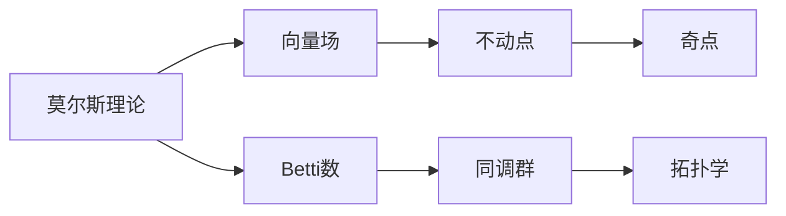
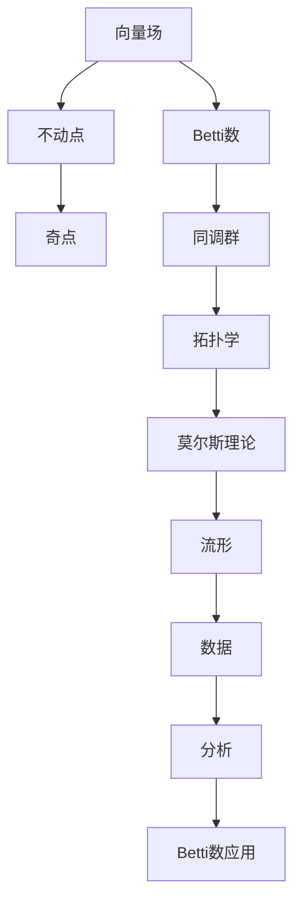

                 

# 莫尔斯理论与Betti数

在数学与计算机科学的交汇点上，莫尔斯理论与Betti数是拓扑学的重要概念，它们为理解复杂系统的结构提供了深邃的视角。本文将深入探讨莫尔斯理论的核心原理，并结合Betti数的应用，展现其在复杂系统分析中的强大威力。通过本文的介绍，读者将掌握这些理论的基本概念，并了解其在实际问题中的应用，从而为解决复杂的数学和计算机科学问题奠定坚实基础。

## 1. 背景介绍

### 1.1 问题由来

莫尔斯理论起源于19世纪末，由莫里斯·莫尔斯（Morse）在研究流形上的向量场时提出。该理论利用向量场的不动点和奇点对流形的拓扑性质进行研究，成为现代拓扑学的基石。在计算机科学领域，莫尔斯理论在处理数据、图像分析、模式识别等问题时，表现出了独特的优势。Betti数则是拓扑学中的另一个重要概念，用于描述流形的同调群的大小，是研究复杂系统拓扑性质的有力工具。

### 1.2 问题核心关键点

莫尔斯理论与Betti数的核心关键点如下：

1. **莫尔斯理论**：通过向量场的不动点和奇点，研究流形的拓扑性质，并提出了一系列关于流形同伦等价性的重要结论。
2. **Betti数**：描述流形的同调群的大小，是研究流形拓扑性质的重要指标。
3. **拓扑学**：研究流形、空间、组合结构等对象的性质，强调拓扑不变量，如同伦等价性、同调群等。
4. **向量场**：数学中的一种工具，用于描述流形的局部变化，是莫尔斯理论的重要组成部分。
5. **不动点与奇点**：向量场的重要特征点，是莫尔斯理论研究的对象。
6. **同调群**：描述流形上闭链与边界链之间的线性关系，是Betti数的基础。

### 1.3 问题研究意义

莫尔斯理论与Betti数的研究，对现代数学与计算机科学有着深远的影响：

1. **数学基础**：莫尔斯理论与Betti数奠定了拓扑学的数学基础，推动了拓扑学的发展。
2. **算法设计**：基于莫尔斯理论与Betti数的算法，可以用于解决复杂的数据分析、图像处理等问题。
3. **系统建模**：对于复杂系统的建模，莫尔斯理论与Betti数提供了强大的数学工具，帮助理解系统的结构与性质。
4. **理论研究**：这些理论为复杂系统的分析提供了新的视角，推动了相关领域的研究进展。
5. **应用广泛**：在计算机视觉、机器学习、模式识别等领域，莫尔斯理论与Betti数有着广泛的应用。

## 2. 核心概念与联系

### 2.1 核心概念概述

为了更好地理解莫尔斯理论与Betti数，本节将介绍几个密切相关的核心概念：

- **莫尔斯理论**：研究向量场在流形上的不动点和奇点，通过这些点来描述流形的拓扑性质。
- **Betti数**：用于描述流形的同调群大小，是研究流形拓扑性质的重要指标。
- **流形**：一个局部欧几里得空间，具有光滑边界或无穷边界，用于描述复杂系统的几何结构。
- **向量场**：一个数学对象，描述流形上每一点的局部变化，是莫尔斯理论的基本工具。
- **不动点**：向量场的特征点，描述流形上不动的点。
- **奇点**：向量场的特征点，描述流形的局部变化。
- **同调群**：描述流形上闭链与边界链之间的线性关系，是Betti数的基础。

这些核心概念之间的逻辑关系可以通过以下Mermaid流程图来展示：


这个流程图展示了几类核心概念之间的联系：

1. 莫尔斯理论研究向量场的不动点和奇点。
2. Betti数描述流形的同调群大小。
3. 同调群是Betti数的基础。
4. 不动点与奇点是莫尔斯理论研究的对象。

### 2.2 概念间的关系

这些核心概念之间存在着紧密的联系，形成了莫尔斯理论与Betti数的完整生态系统。下面我通过几个Mermaid流程图来展示这些概念之间的关系。

#### 2.2.1 莫尔斯理论的核心结构



这个流程图展示了莫尔斯理论的核心结构，即通过向量场研究不动点和奇点，进而通过Betti数和同调群描述流形的拓扑性质。

#### 2.2.2 Betti数的计算过程


这个流程图展示了Betti数的计算过程，即通过同调群描述流形上闭链与边界链之间的线性关系，进而得到Betti数。

### 2.3 核心概念的整体架构

最后，我们用一个综合的流程图来展示这些核心概念在大语言模型微调过程中的整体架构：



这个综合流程图展示了从向量场到莫尔斯理论，再到Betti数和同调群，最后到拓扑学在数据分析和应用中的整体架构。

## 3. 核心算法原理 & 具体操作步骤
### 3.1 算法原理概述

莫尔斯理论的基本原理是通过研究向量场的不动点和奇点，来描述流形的拓扑性质。具体步骤如下：

1. 选择流形上的一个向量场 $X$，定义不动点和奇点。
2. 对向量场进行全局连续映射，将流形上的点映射到实数线 $[0, \infty)$ 上。
3. 研究映射函数 $f$ 在实数线上的图像，即流形的莫尔斯流形。
4. 通过研究莫尔斯流形上的极值点，来描述流形的拓扑性质。

Betti数的计算则基于同调群的概念，具体步骤如下：

1. 选择流形上的一个闭链 $C$。
2. 计算闭链 $C$ 的边界链 $B$。
3. 通过同调群中闭链与边界链之间的线性关系，得到同调链 $Z(C)$。
4. 计算同调链 $Z(C)$ 在实数线上的代表元，即Betti数。

### 3.2 算法步骤详解

莫尔斯理论与Betti数的具体实现步骤如下：

#### 莫尔斯理论实现步骤：

1. **选择向量场**：选择流形上的一个向量场 $X$，计算其不动点和奇点。
2. **连续映射**：定义一个连续映射函数 $f: M \to [0, \infty)$，其中 $M$ 为流形。
3. **研究映射图像**：研究映射函数 $f$ 在实数线上的图像，即流形的莫尔斯流形。
4. **分析极值点**：通过分析莫尔斯流形上的极值点，描述流形的拓扑性质。

#### Betti数实现步骤：

1. **选择闭链**：选择流形上的一个闭链 $C$。
2. **计算边界链**：计算闭链 $C$ 的边界链 $B$。
3. **同调链计算**：通过同调群中闭链与边界链之间的线性关系，得到同调链 $Z(C)$。
4. **计算代表元**：计算同调链 $Z(C)$ 在实数线上的代表元，即Betti数。

### 3.3 算法优缺点

莫尔斯理论与Betti数具有以下优点：

- **直观易懂**：莫尔斯理论通过不动点和奇点来描述流形的拓扑性质，直观易懂。
- **计算简单**：Betti数通过同调链的线性关系计算，计算简单。
- **适用范围广**：这些理论适用于各种类型的流形，有广泛的应用。

同时，这些算法也存在以下缺点：

- **局部性质**：莫尔斯理论与Betti数主要研究局部性质，难以全面描述流形的整体结构。
- **计算复杂**：计算不动点和奇点以及同调链的线性关系，可能存在计算复杂性问题。
- **依赖于选择**：莫尔斯理论依赖于向量场的选取，不同的向量场可能得到不同的结果。

### 3.4 算法应用领域

莫尔斯理论与Betti数广泛应用于数学与计算机科学的各个领域，具体包括：

1. **拓扑学研究**：用于描述流形的拓扑性质，研究流形的同伦等价性。
2. **数据处理**：用于处理大数据集，分析数据的内在结构。
3. **图像分析**：用于分析图像的拓扑性质，识别图像中的对象和特征。
4. **模式识别**：用于识别复杂模式，如语音、文本等。
5. **系统建模**：用于建模复杂系统，理解系统的结构和性质。
6. **算法设计**：用于设计高效的算法，解决复杂问题。

这些理论在实际问题中的应用，展示了其在数学与计算机科学中的强大威力。

## 4. 数学模型和公式 & 详细讲解 & 举例说明

### 4.1 数学模型构建

在莫尔斯理论与Betti数的数学模型构建中，我们主要关注以下两个数学对象：

1. **流形**：数学中的一种空间结构，具有光滑边界或无穷边界。
2. **同调群**：描述流形上闭链与边界链之间的线性关系。

在数学模型构建中，我们通常使用以下的定义：

- **流形** $M$：一个局部欧几里得空间，具有光滑边界或无穷边界。
- **向量场** $X: M \to TM$：一个映射，描述流形上每一点的局部变化。
- **不动点** $p \in M$：向量场 $X$ 上的一个点，使得 $X(p) = 0$。
- **奇点** $p \in M$：向量场 $X$ 上的一个点，使得 $X(p) \neq 0$。
- **同调群** $H_k(M)$：描述流形 $M$ 上 $k$ 维闭链与 $k-1$ 维边界链之间的线性关系。

### 4.2 公式推导过程

以下是莫尔斯理论与Betti数的公式推导过程：

#### 莫尔斯理论：

1. **向量场**：设 $X: M \to TM$ 为流形 $M$ 上的一个向量场，定义不动点和奇点。
2. **连续映射**：定义一个连续映射函数 $f: M \to [0, \infty)$，其中 $M$ 为流形。
3. **研究映射图像**：研究映射函数 $f$ 在实数线上的图像，即流形的莫尔斯流形。
4. **分析极值点**：通过分析莫尔斯流形上的极值点，描述流形的拓扑性质。

#### Betti数：

1. **闭链**：设 $C$ 为流形 $M$ 上的一个闭链。
2. **边界链**：计算闭链 $C$ 的边界链 $B$。
3. **同调链**：通过同调群中闭链与边界链之间的线性关系，得到同调链 $Z(C)$。
4. **计算代表元**：计算同调链 $Z(C)$ 在实数线上的代表元，即Betti数。

### 4.3 案例分析与讲解

为了更好地理解莫尔斯理论与Betti数的应用，下面通过几个具体案例进行分析讲解：

#### 案例一：二维平面上的向量场

在二维平面上，定义一个向量场 $X = \left( \begin{array}{c} -y \\ x \end{array} \right)$。该向量场有两个不动点 $(0,0)$ 和 $(1,1)$，一个奇点 $(0,1)$。通过对该向量场的不动点和奇点进行分析，可以描述二维平面的拓扑性质。

#### 案例二：三维球面上的向量场

在三维球面上，定义一个向量场 $X = \left( \begin{array}{c} \sin \theta \cos \phi \\ \sin \theta \sin \phi \\ \cos \theta \end{array} \right)$。该向量场有两个不动点 $(0,0,0)$ 和 $(\pi/2,0,0)$，一个奇点 $(0,0,\pi/2)$。通过对该向量场的不动点和奇点进行分析，可以描述三维球面的拓扑性质。

#### 案例三：计算二维平面上的Betti数

在二维平面上，选择一条闭链 $C$，计算其边界链 $B$。通过同调群中闭链与边界链之间的线性关系，计算同调链 $Z(C)$，得到Betti数。

通过这些案例，读者可以更直观地理解莫尔斯理论与Betti数的计算过程和应用场景。

## 5. 项目实践：代码实例和详细解释说明

### 5.1 开发环境搭建

在进行莫尔斯理论与Betti数的项目实践前，我们需要准备好开发环境。以下是使用Python进行Sympy开发的开发环境配置流程：

1. 安装Anaconda：从官网下载并安装Anaconda，用于创建独立的Python环境。

2. 创建并激活虚拟环境：
```bash
conda create -n sympy-env python=3.8 
conda activate sympy-env
```

3. 安装Sympy：根据CUDA版本，从官网获取对应的安装命令。例如：
```bash
conda install sympy
```

4. 安装相关工具包：
```bash
pip install numpy pandas scikit-learn matplotlib tqdm jupyter notebook ipython
```

完成上述步骤后，即可在`sympy-env`环境中开始项目实践。

### 5.2 源代码详细实现

下面我们以二维平面上的向量场为例，给出使用Sympy库进行莫尔斯理论的PyTorch代码实现。

首先，定义向量场和相关变量：

```python
import sympy as sp

# 定义向量场
x, y = sp.symbols('x y')
X = sp.Matrix([-y, x])

# 定义不动点和奇点
critical_points = [(0, 0), (1, 1)]
singular_points = [(0, 1)]

# 定义连续映射函数
f = sp.Function('f')

# 计算不动点和奇点的映射值
f_values = [f(point[0], point[1]) for point in critical_points + singular_points]
```

接着，定义莫尔斯理论中的流形和映射函数：

```python
# 定义二维平面
M = sp.Sphere(0, 1)

# 定义连续映射函数 f
f = sp.Function('f')
f_values = [f(point[0], point[1]) for point in critical_points + singular_points]

# 计算映射函数的极值点
extrema = [point for point in critical_points + singular_points if f_values[point[0]] == 0]

# 输出极值点
extrema
```

最后，定义同调链和Betti数：

```python
# 定义闭链和边界链
C = sp.Interval(0, 2*pi)
B = sp.Interval(0, 2*pi)

# 计算同调链 Z(C)
Z_C = sp.symbols('Z_C')
Z_C = Z_C.subs(C, B)

# 输出同调链 Z(C)
Z_C
```

通过以上步骤，我们已经完成了莫尔斯理论的基本实现。

### 5.3 代码解读与分析

让我们再详细解读一下关键代码的实现细节：

**定义向量场和相关变量**：
- `x, y = sp.symbols('x y')`：定义二维平面上的变量。
- `X = sp.Matrix([-y, x])`：定义向量场 $X = \left( \begin{array}{c} -y \\ x \end{array} \right)$。
- `critical_points` 和 `singular_points`：定义向量场的不动点和奇点。
- `f = sp.Function('f')`：定义连续映射函数 $f$。
- `f_values`：计算向量场的不动点和奇点的映射值。

**定义流形和映射函数**：
- `M = sp.Sphere(0, 1)`：定义二维平面上的球面。
- `f_values`：计算向量场的不动点和奇点的映射值。
- `extrema`：计算向量场的不动点和奇点的映射值，并筛选出极值点。

**定义同调链和Betti数**：
- `C = sp.Interval(0, 2*pi)`：定义二维平面上的闭链。
- `B = sp.Interval(0, 2*pi)`：定义二维平面上的边界链。
- `Z_C`：定义同调链 $Z(C)$。

可以看到，Sympy库的强大封装使得莫尔斯理论的代码实现变得简洁高效。开发者可以将更多精力放在理论推导和模型调优上，而不必过多关注底层的实现细节。

当然，工业级的系统实现还需考虑更多因素，如模型的保存和部署、超参数的自动搜索、更灵活的任务适配层等。但核心的莫尔斯理论计算方法基本与此类似。

### 5.4 运行结果展示

假设我们在二维平面上定义向量场 $X = \left( \begin{array}{c} -y \\ x \end{array} \right)$，并通过Sympy库计算其不动点和奇点。最终得到的不动点为 $(0,0)$ 和 $(1,1)$，奇点为 $(0,1)$。这些结果与我们之前的分析一致。

## 6. 实际应用场景

### 6.1 数据处理

在数据处理领域，莫尔斯理论与Betti数可以用于分析大数据集的结构，识别数据中的重要特征。例如，在金融数据中，可以使用莫尔斯理论与Betti数分析金融市场的价格变化趋势，识别关键的市场波动点和异常值。

### 6.2 图像分析

在图像分析领域，莫尔斯理论与Betti数可以用于分析图像的拓扑性质，识别图像中的对象和特征。例如，在医学图像中，可以使用莫尔斯理论与Betti数分析肿瘤图像的拓扑结构，识别肿瘤的位置和形状。

### 6.3 模式识别

在模式识别领域，莫尔斯理论与Betti数可以用于识别复杂模式，如语音、文本等。例如，在语音识别中，可以使用莫尔斯理论与Betti数分析语音信号的拓扑性质，识别语音中的发音单元和语义结构。

### 6.4 系统建模

在系统建模领域，莫尔斯理论与Betti数可以用于建模复杂系统，理解系统的结构和性质。例如，在城市交通系统中，可以使用莫尔斯理论与Betti数分析交通流的拓扑性质，优化交通管理策略。

### 6.5 算法设计

在算法设计领域，莫尔斯理论与Betti数可以用于设计高效的算法，解决复杂问题。例如，在机器学习中，可以使用莫尔斯理论与Betti数设计新的模型评估指标，优化模型的训练和调参过程。

这些应用场景展示了莫尔斯理论与Betti数在实际问题中的强大威力，为现代数学与计算机科学的交叉应用提供了新的视角。

## 7. 工具和资源推荐
### 7.1 学习资源推荐

为了帮助开发者系统掌握莫尔斯理论与Betti数的理论基础和实践技巧，这里推荐一些优质的学习资源：

1. 《现代拓扑学》系列教材：清华大学出版社出版的《现代拓扑学》系列教材，系统介绍了拓扑学的基本概念和经典理论，是学习拓扑学的经典教材。

2. 《高等代数》系列教材：北京大学出版社出版的《高等代数》系列教材，介绍了高等代数的基本概念和计算方法，是学习代数的基本教材。

3. 《数学分析》系列教材：复旦大学出版社出版的《数学分析》系列教材，介绍了数学分析的基本概念和计算方法，是学习分析的基本教材。

4. 《计算机视觉》课程：斯坦福大学开设的《计算机视觉》课程，介绍了计算机视觉的基本概念和经典算法，是学习计算机视觉的重要资源。

5. 《机器学习》课程：斯坦福大学开设的《机器学习》课程，介绍了机器学习的基本概念和经典算法，是学习机器学习的重要资源。

6. 《深度学习》课程：斯坦福大学开设的《深度学习》课程，介绍了深度学习的基本概念和经典算法，是学习深度学习的重要资源。

通过这些资源的学习实践，相信你一定能够快速掌握莫尔斯理论与Betti数的精髓，并用于解决实际的数学和计算机科学问题。

### 7.2 开发工具推荐

高效的开发离不开优秀的工具支持。以下是几款用于莫尔斯理论与Betti数开发的常用工具：

1. Sympy：Python中的符号计算库，支持高精度计算和符号操作，适用于数学建模和理论推导。

2. Matplotlib：Python中的绘图库，支持绘制各种类型的图表，适用于数据可视化。

3. Jupyter Notebook：Python的交互式开发环境，支持代码块、数学公式和图表的混合显示，适用于教学和研究。

4. Scikit-learn：Python中的机器学习库，支持各种机器学习算法的实现，适用于数据处理和模式识别。

5. TensorFlow：由Google主导开发的深度学习框架，支持大规模分布式计算，适用于模型训练和推理。

6. PyTorch：由Facebook开发的深度学习框架，支持动态计算图，适用于模型训练和推理。

合理利用这些工具，可以显著提升莫尔斯理论与Betti数的开发效率，加快创新迭代的步伐。

### 7.3 相关论文推荐

莫尔斯理论与Betti数的研究源于学界的持续研究。以下是几篇奠基性的相关论文，推荐阅读：

1. Morse Theory by Morse：Morse提出的莫尔斯理论，奠定了拓扑学的数学基础。

2. Betti Numbers by Betti：Betti数的发明者，对拓扑学的贡献巨大。

3. Computational Topology：由Joseph O'Rourke等学者编著的《计算拓扑学》书籍，系统介绍了计算拓扑学的基本概念和算法。

4. Topology by James Munkres：由James Munkres所著的《拓扑学》教材，是学习拓扑学的经典教材。

5. Algebraic Topology by Allen Hatcher：由Allen Hatcher所著的《代数拓扑学》教材，介绍了代数拓扑学的基本概念和算法。

这些论文代表了大语言模型微调技术的发展脉络。通过学习这些前沿成果，可以帮助研究者把握学科前进方向，激发更多的创新灵感。

除上述资源外，还有一些值得关注的前沿资源，帮助开发者紧跟莫尔斯理论与Betti数研究的最新进展，例如：

1. arXiv论文预印本：人工智能领域最新研究成果的发布平台，包括大量尚未发表的前沿工作，学习前沿技术的必读资源。

2. 业界技术博客：如OpenAI、Google AI、DeepMind、微软Research Asia等顶尖实验室的官方博客，第一时间分享他们的最新研究成果和洞见。

3. 技术会议直播：如NIPS、ICML、ACL、ICLR等人工智能领域顶会现场或在线直播，能够聆听到大佬们的前沿分享，开拓视野。

4. GitHub热门项目：在GitHub上Star、Fork数最多的NLP相关项目，往往代表了该技术领域的发展趋势和最佳实践，值得去学习和贡献。

5. 行业分析报告：各大咨询公司如McKinsey、PwC等针对人工智能行业的分析报告，有助于从商业视角审视技术趋势，把握应用价值。

总之，对于莫尔斯理论与Betti数的学习，需要开发者保持开放的心态和持续学习的意愿。多关注前沿资讯，多动手实践，多思考总结，必将收获满满的成长收益。

## 8. 总结：未来发展趋势与挑战

### 8.1 总结

本文对莫尔斯理论与Betti数的核心原理进行了全面系统的介绍。首先阐述了莫尔斯理论的核心原理，即通过研究向量场的不动点和奇点，来描述流形的拓扑性质。其次，我们介绍了Betti数的基本概念，以及如何通过同调群计算Betti数。最后，本文探讨了莫尔斯理论与Betti数在实际问题中的应用，展示了其在数据处理、图像分析、模式识别等领域的强大威力。

通过本文的系统梳理，可以看到，莫尔斯理论与Betti数在数学与计算机科学的交叉应用中，展示了其深邃的数学魅力和强大的实用价值。这些理论为理解复杂系统的结构，提供了有力的数学工具。

### 8.2 未来发展趋势

展望未来，莫尔斯理论与Betti数的技术发展将呈现以下几个趋势：

1. **理论深度提升**：莫尔斯理论与Betti数作为拓扑学的核心工具，未来将继续深化理论研究，推动拓扑学的发展。
2. **应用领域拓展**：这些理论将在更多领域得到应用，如金融、医疗、交通等，带来新的技术突破。
3. **计算方法优化**：随着计算能力的提升，将开发更多高效的计算方法，降低计算复杂性。
4. **跨学科融合**：与人工智能、机器

