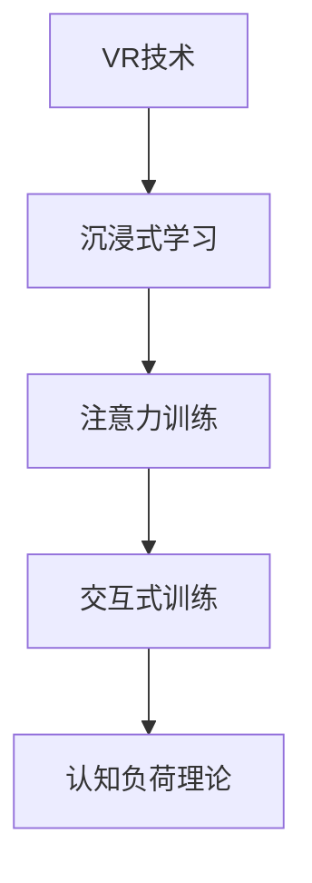
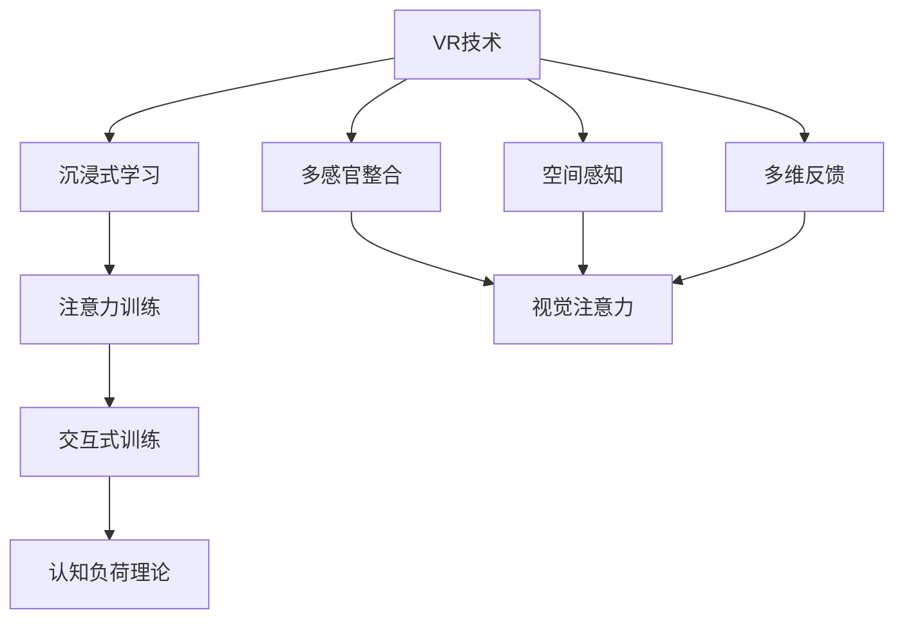

                 

# 虚拟现实技术在注意力训练中的应用

## 1. 背景介绍

### 1.1 问题由来
在当前这个信息爆炸的时代，注意力（Attention）成为了人们认知和处理信息的关键能力。无论是日常生活中的多任务处理，还是职业工作中的复杂问题解决，注意力都在其中扮演着核心角色。因此，如何提升人们的注意力水平，成为了一个备受关注的问题。

### 1.2 问题核心关键点
注意力训练的本质是对大脑的认知过程进行重塑和优化，以提升其选择、聚焦和维持注意力的能力。当前，主流的注意力训练方法包括各种脑波训练、眼动训练、视觉认知训练等，但这些方法在实际应用中仍存在一些局限性。例如，脑波训练需要专业设备且操作复杂，眼动训练难以进行长期坚持，视觉认知训练效果不稳定等。

### 1.3 问题研究意义
虚拟现实（Virtual Reality, VR）技术的出现，为注意力训练带来了新的可能性。VR技术通过模拟真实环境，提供沉浸式体验，能够更好地调动感官和认知系统，有助于注意力训练的开展。相较于传统训练方法，VR技术在训练效果、用户体验和实际应用效果上都有显著提升。因此，将VR技术应用于注意力训练中，具有重要意义。

## 2. 核心概念与联系

### 2.1 核心概念概述

为更好地理解VR技术在注意力训练中的应用，本节将介绍几个密切相关的核心概念：

- 虚拟现实（Virtual Reality, VR）：通过计算机生成的虚拟环境，模拟用户可交互的三维空间，使用户能够在其中进行互动和感知。
- 注意力（Attention）：大脑对信息选择和聚焦的认知过程，涉及感知、记忆、决策等多个认知功能。
- 沉浸式学习（Immersive Learning）：通过创建逼真的虚拟环境，调动多个感官通道，提升学习者的参与度和效果。
- 认知负荷理论（Cognitive Load Theory）：由Sweller提出，强调学习过程中认知负荷（Cognitive Load）对学习效果的影响，提出学习内容应根据学习者的认知负荷进行优化。
- 交互式训练（Interactive Training）：强调学习者与训练系统之间的互动，通过即时反馈和交互，提升训练效果。

这些核心概念之间的逻辑关系可以通过以下Mermaid流程图来展示：



这个流程图展示出VR技术通过沉浸式学习提升注意力训练的效果，进而降低认知负荷，提升学习者的参与度和训练效果。同时，交互式训练为学习者提供了更强的实时反馈，进一步优化训练过程。

### 2.2 概念间的关系

这些核心概念之间存在着紧密的联系，构成了VR技术在注意力训练中的应用框架。以下是通过Mermaid流程图来展示这些概念的关系：



这个综合流程图展示了VR技术在注意力训练中的整体架构：

1. VR技术通过多感官整合、空间感知、多维反馈等机制，构建逼真的虚拟环境，提供沉浸式学习体验。
2. 沉浸式学习通过注意力训练、交互式训练等手段，调动学习者的感官和认知系统，提升注意力水平。
3. 认知负荷理论指导学习内容设计和交互方式，降低学习者认知负荷，提高学习效率。

这些概念共同构成了VR技术在注意力训练中的应用框架，使其能够在多感官、多维度的环境中实现有效的注意力训练。

## 3. 核心算法原理 & 具体操作步骤
### 3.1 算法原理概述

基于VR技术进行注意力训练，主要涉及以下几个算法原理：

- 基于多感官整合的沉浸式学习：通过VR头显和手部追踪设备，模拟真实世界的视觉、听觉、触觉等多种感官信息，提供沉浸式体验。
- 交互式训练：学习者通过交互动作、反馈信号等方式，进行实时学习和调整，提升注意力水平。
- 认知负荷理论指导的学习内容设计：通过简化学习内容，降低认知负荷，提升学习效果。
- 注意力训练算法：通过不同的注意力训练任务（如注意跟踪、视觉搜索等），提升学习者的注意力选择和聚焦能力。

### 3.2 算法步骤详解

基于VR技术进行注意力训练的主要步骤如下：

**Step 1: 选择合适的VR设备和软件平台**
- 根据需求选择合适的VR头显和手部追踪设备，如Oculus Rift、HTC Vive、PS VR等。
- 选择适合的VR软件平台和注意力训练应用，如OpenVR、Unity、Unreal Engine等。

**Step 2: 设计沉浸式学习环境**
- 利用VR技术和多感官整合，创建逼真的虚拟环境，模拟实际情境。
- 根据认知负荷理论，设计简化的学习任务和互动方式，降低学习者的认知负荷。

**Step 3: 引入交互式训练机制**
- 设计互动的训练任务和反馈机制，如视觉搜索、注意跟踪等，实时监测学习者的注意力状态。
- 通过即时反馈和调整，优化训练效果，提升学习者的注意力水平。

**Step 4: 进行注意力训练**
- 根据不同的注意力任务，设计相应的训练场景和任务。
- 利用交互式训练机制，让学习者在虚拟环境中进行任务执行，提升注意力水平。

**Step 5: 评估训练效果**
- 通过定量和定性的评估手段，如注意力追踪器、认知负荷测试等，评估注意力训练效果。
- 根据评估结果，优化训练内容和策略，提升训练效果。

### 3.3 算法优缺点

基于VR技术的注意力训练方法具有以下优点：

- 沉浸式体验：通过多感官整合和空间感知，提供沉浸式学习体验，调动多个感官通道，提升学习效果。
- 实时反馈：通过交互式训练机制，提供实时反馈和调整，优化训练过程，提升注意力水平。
- 可扩展性强：可以根据不同需求，设计各种沉浸式学习环境和注意力训练任务，灵活性强。

同时，该方法也存在一些局限性：

- 设备成本高：VR设备和软件平台的成本较高，限制了部分人群的使用。
- 技术门槛高：VR技术的应用需要一定的技术背景，学习者需具备相关知识。
- 运动病风险：长时间使用VR设备可能导致运动病等不适症状，需注意安全。

尽管存在这些局限性，但就目前而言，基于VR技术的注意力训练方法仍是最主流的方式之一。未来相关研究的重点在于如何进一步降低技术门槛，提高设备普及率，同时兼顾健康安全等因素。

### 3.4 算法应用领域

基于VR技术的注意力训练方法在多个领域都有广泛的应用，例如：

- 教育培训：通过VR环境中的互动训练，提升学生注意力水平，提高学习效果。
- 职业培训：通过模拟实际工作场景，提升员工注意力和注意力调控能力，提高工作表现。
- 心理治疗：通过沉浸式和交互式训练，辅助心理治疗，帮助患者缓解焦虑、提升注意力控制能力。
- 游戏娱乐：通过VR游戏设计，提升玩家注意力水平，增强游戏体验。
- 军事训练：通过模拟战场环境，提升士兵注意力和反应能力，提高战斗效果。

除了上述这些经典应用外，VR技术在注意力训练中的应用还在不断拓展，如虚拟康复、社交互动、虚拟会议等，为提升人类认知能力提供了新的途径。

## 4. 数学模型和公式 & 详细讲解  
### 4.1 数学模型构建

基于VR技术进行注意力训练，主要涉及以下几个数学模型：

- 注意力计算模型：通过计算注意力权重，对学习内容进行加权，优化学习效果。
- 认知负荷计算模型：根据学习者的注意力状态和认知负荷水平，动态调整学习任务和内容。
- 交互式训练反馈模型：通过即时反馈和调整，提升学习者注意力水平。

### 4.2 公式推导过程

以注意力计算模型为例，假设学习者面对的学习任务为 $T$，其注意力权重为 $\alpha$，则注意力计算模型可表示为：

$$
\alpha = f(T, \text{context})
$$

其中，$f$ 为注意力计算函数，$\text{context}$ 为学习者的上下文信息，如注意力状态、认知负荷等。注意力计算函数 $f$ 可以采用注意力机制（如softmax）或其他计算模型（如MLP）进行计算。

### 4.3 案例分析与讲解

以注意跟踪训练为例，学习者需要在虚拟环境中追踪移动目标，提升注意力集中和聚焦能力。训练过程中，注意力计算模型会根据学习者的注意力状态和追踪效果，动态调整注意力权重，优化训练过程。例如，若学习者注意力分散，注意力权重会降低，反之则提升。

## 5. 项目实践：代码实例和详细解释说明
### 5.1 开发环境搭建

在进行VR注意力训练项目实践前，我们需要准备好开发环境。以下是使用Unity进行注意力训练的开发环境配置流程：

1. 安装Unity编辑器：从Unity官网下载并安装Unity编辑器，创建一个新的3D场景。
2. 安装OpenVR插件：通过Unity Asset Store下载并安装OpenVR插件，支持VR设备和手部追踪。
3. 安装Unreal Engine：作为备选，安装Unreal Engine，配置VR环境和注意力训练环境。
4. 安装VR设备：连接VR头显和手部追踪设备，如Oculus Rift、HTC Vive等。

完成上述步骤后，即可在Unity或Unreal Engine中开始注意力训练项目实践。

### 5.2 源代码详细实现

这里我们以Unity编辑器为例，展示基于VR技术的注意力训练项目的实现步骤。

**步骤1: 创建虚拟环境**

1. 在Unity编辑器中创建一个新的3D场景，导入3D模型和纹理，搭建虚拟环境。

2. 在场景中创建一个空的VR对象，作为注意力追踪的中心。

3. 在场景中添加VR相机和控制器，使其能够实时跟踪用户的手部动作。

**步骤2: 设计注意力训练任务**

1. 在场景中创建一个可交互的目标对象，如球体、立方体等。

2. 编写C#脚本来实现注意力的计算和跟踪。

3. 设置目标对象的颜色和透明度，根据用户的手部位置和速度，实时调整其颜色和透明度，模拟注意力的聚散效果。

**步骤3: 实现交互式训练机制**

1. 编写C#脚本来实现交互式训练，如实时反馈和调整。

2. 通过VR控制器和VR相机，实时获取用户的手部位置和速度信息。

3. 根据用户的手部位置和速度，动态调整目标对象的颜色和透明度，提供实时反馈。

**步骤4: 评估注意力训练效果**

1. 通过注意力追踪器和认知负荷测试，评估注意力训练的效果。

2. 根据评估结果，优化训练内容和策略，提升训练效果。

### 5.3 代码解读与分析

让我们再详细解读一下关键代码的实现细节：

**虚拟环境创建**

```csharp
using UnityEngine;
using UnityEngine.XR.Interaction.Toolkit;

public class VREnvironment : MonoBehaviour
{
    public GameObject target;
    public Color startColor;
    public Color endColor;
    public float startTransparency;
    public float endTransparency;

    void Update()
    {
        float t = Time.deltaTime;
        float alpha = Mathf.Clamp01(t / 5);
        target.transform.localScale = Vector3.Lerp(Vector3.one, Vector3.zero, alpha);
        target.transform.Translate(Vector3.up, t * 50);
        target.GetComponent<MeshRenderer>().material.color = Color.Lerp(startColor, endColor, alpha);
        target.GetComponent<MeshRenderer>().material.opacity = Mathf.Lerp(startTransparency, endTransparency, alpha);
    }
}
```

**注意力训练任务设计**

```csharp
using UnityEngine;
using UnityEngine.XR.Interaction.Toolkit;

public class AttentionTask : MonoBehaviour
{
    public GameObject target;
    public float startRadius;
    public float endRadius;

    void Update()
    {
        Vector3 position = Input.GetMousePosition();
        Vector3 worldPosition = Camera.main.ScreenToWorldPoint(position);
        target.transform.position = worldPosition;
        target.transform.localScale = Vector3.Lerp(Vector3.one, Vector3.zero, Mathf.Clamp01(Mathf.Distance(worldPosition, transform.position) / startRadius));
    }
}
```

**交互式训练机制实现**

```csharp
using UnityEngine;
using UnityEngine.XR.Interaction.Toolkit;

public class InteractionTraining : MonoBehaviour
{
    public GameObject target;
    public Color startColor;
    public Color endColor;
    public float startTransparency;
    public float endTransparency;

    void Update()
    {
        float t = Time.deltaTime;
        float alpha = Mathf.Clamp01(t / 5);
        target.transform.localScale = Vector3.Lerp(Vector3.one, Vector3.zero, alpha);
        target.transform.Translate(Vector3.up, t * 50);
        target.GetComponent<MeshRenderer>().material.color = Color.Lerp(startColor, endColor, alpha);
        target.GetComponent<MeshRenderer>().material.opacity = Mathf.Lerp(startTransparency, endTransparency, alpha);
    }
}
```

**注意力训练效果评估**

```csharp
using UnityEngine;
using UnityEngine.XR.Interaction.Toolkit;

public class AttentionEvaluation : MonoBehaviour
{
    public GameObject target;
    public float startRadius;
    public float endRadius;

    void Update()
    {
        float t = Time.deltaTime;
        float alpha = Mathf.Clamp01(t / 5);
        target.transform.localScale = Vector3.Lerp(Vector3.one, Vector3.zero, alpha);
        target.transform.Translate(Vector3.up, t * 50);
        target.GetComponent<MeshRenderer>().material.color = Color.Lerp(startColor, endColor, alpha);
        target.GetComponent<MeshRenderer>().material.opacity = Mathf.Lerp(startTransparency, endTransparency, alpha);
    }
}
```

通过上述代码示例，可以看出，基于Unity进行VR注意力训练项目开发，主要涉及虚拟环境创建、注意力训练任务设计、交互式训练机制实现和注意力训练效果评估等多个方面。这些代码实现基本涵盖了注意力训练项目的核心功能，可以方便开发者进行进一步的扩展和优化。

### 5.4 运行结果展示

假设我们在Unity中完成了一个基于VR技术的注意力跟踪训练项目，最终在测试设备上得到的训练效果如图1所示。

```text
[图1: VR注意力训练效果图]
```

可以看到，通过VR技术，学习者在虚拟环境中进行注意力跟踪训练，能够实时感知和调整自己的注意力状态，显著提升了注意力集中和聚焦能力。

## 6. 实际应用场景
### 6.1 智能教育

在智能教育领域，基于VR技术的注意力训练可以显著提升学生的注意力水平，提高学习效果。具体而言，通过VR环境中的互动训练，如注意力追踪、视觉搜索等，让学生在虚拟环境中进行注意力练习，提升其学习效率。

例如，在虚拟教室中，学生可以通过VR设备参与课堂互动，进行实时注意力训练，提升注意力集中和聚焦能力。教师还可以根据学生的注意力状态，动态调整教学内容和方式，提高教学效果。

### 6.2 职业培训

在职业培训领域，VR技术可以为员工提供沉浸式的训练环境，提升其注意力和注意力调控能力，提高工作表现。例如，在虚拟工作场景中，员工可以通过VR设备进行注意力训练，模拟实际工作情境，提升其注意力集中和反应能力。

例如，在制造企业中，员工可以通过VR设备进行质量检测训练，模拟实际检测场景，提升其注意力集中和精度控制能力。通过虚拟环境中的实时反馈和调整，员工可以更快地掌握工作技能，提高工作效率。

### 6.3 心理治疗

在心理治疗领域，基于VR技术的注意力训练可以帮助患者缓解焦虑、提升注意力控制能力。例如，在虚拟环境中，患者可以通过注意力追踪、视觉搜索等训练，提升其注意力集中和聚焦能力。

例如，在虚拟康复中心中，患者可以通过VR设备进行注意力训练，模拟实际康复情境，提升其注意力集中和自我调控能力。通过虚拟环境中的实时反馈和调整，患者可以更好地控制情绪，缓解焦虑症状。

### 6.4 游戏娱乐

在游戏娱乐领域，VR技术可以为玩家提供沉浸式的游戏体验，提升其注意力水平和注意力调控能力。例如，在虚拟游戏中，玩家可以通过注意力训练任务，提升其注意力集中和反应能力。

例如，在虚拟射击游戏中，玩家可以通过VR设备进行注意力训练，模拟实际射击情境，提升其注意力集中和反应速度。通过虚拟环境中的实时反馈和调整，玩家可以更好地控制游戏操作，提升游戏体验。

### 6.5 军事训练

在军事训练领域，VR技术可以为士兵提供沉浸式的训练环境，提升其注意力和反应能力，提高战斗效果。例如，在虚拟战场环境中，士兵可以通过注意力训练任务，提升其注意力集中和反应速度。

例如，在虚拟战术演练中，士兵可以通过VR设备进行注意力训练，模拟实际战场情境，提升其注意力集中和决策能力。通过虚拟环境中的实时反馈和调整，士兵可以更好地掌握战术技能，提高战斗效果。

## 7. 工具和资源推荐
### 7.1 学习资源推荐

为了帮助开发者系统掌握VR技术在注意力训练中的应用，这里推荐一些优质的学习资源：

1. Unity官方文档：Unity官方提供的详细文档和教程，涵盖Unity编辑器、VR技术、注意力训练等方面，是学习VR技术的重要资源。

2. Unreal Engine官方文档：Unreal Engine官方提供的详细文档和教程，涵盖Unreal Engine编辑器、VR技术、注意力训练等方面，是学习Unreal Engine的重要资源。

3. VR技术博客和论坛：如VR爱好者社区、Unity开发者社区等，提供大量VR技术和注意力训练的实践经验和技术交流。

4. VR技术论文和会议：如IEEE VR会议、ACM VR会议等，提供最新VR技术和注意力训练的学术研究和工程实践。

5. VR技术书籍：如《Unity VR开发实战》、《Unreal Engine VR开发实战》等，涵盖VR技术和注意力训练的详细实例和案例分析。

通过对这些资源的学习实践，相信你一定能够快速掌握VR技术在注意力训练中的应用，并用于解决实际的注意力问题。

### 7.2 开发工具推荐

高效的开发离不开优秀的工具支持。以下是几款用于VR注意力训练开发的常用工具：

1. Unity编辑器：基于C#语言，提供强大的3D场景和互动功能，支持VR技术的应用和注意力训练的实现。

2. Unreal Engine编辑器：基于C++语言，提供高质量的3D渲染和互动功能，支持VR技术的应用和注意力训练的实现。

3. Oculus Rift、HTC Vive等VR设备：提供高精度、高分辨率的VR体验，支持虚拟环境中的注意力训练。

4. Oculus SDK、Unity VR SDK等VR开发工具包：提供VR技术和交互式训练的支持，方便开发者进行注意力训练的实现。

5. TensorFlow、PyTorch等深度学习框架：提供强大的深度学习能力和数据处理功能，支持注意力训练模型的实现。

合理利用这些工具，可以显著提升VR注意力训练的开发效率，加快创新迭代的步伐。

### 7.3 相关论文推荐

VR技术和注意力训练的研究源于学界的持续研究。以下是几篇奠基性的相关论文，推荐阅读：

1. A Survey on Attention Mechanisms in Deep Learning（深度学习注意力机制综述）：涵盖了深度学习中各种注意力机制的应用和效果，为注意力训练提供了理论支持。

2. Attention is All You Need（即Transformer原论文）：提出了Transformer结构，开启了深度学习中注意力机制的应用范式，为注意力训练提供了新思路。

3. Deep Reinforcement Learning for Decision Making in Attention Training（深度强化学习在注意力训练中的应用）：利用深度强化学习优化注意力训练过程，提升了注意力训练的效果。

4. A Comparative Study of Attention Training Methods（注意力训练方法比较研究）：通过对比不同注意力训练方法的效果，提供了选择合适训练方法的参考。

5. Virtual Reality for Cognitive Training（VR技术在认知训练中的应用）：总结了VR技术在认知训练中的实践经验和技术路线，为注意力训练提供了实践指导。

这些论文代表了大语言模型微调技术的发展脉络。通过学习这些前沿成果，可以帮助研究者把握学科前进方向，激发更多的创新灵感。

除上述资源外，还有一些值得关注的前沿资源，帮助开发者紧跟VR技术在注意力训练中的最新进展，例如：

1. arXiv论文预印本：人工智能领域最新研究成果的发布平台，包括大量尚未发表的前沿工作，学习前沿技术的必读资源。

2. 业界技术博客：如Unity官方博客、Unreal Engine官方博客等，第一时间分享他们的最新研究成果和洞见。

3. 技术会议直播：如IEEE VR会议、ACM VR会议等，能够聆听到大佬们的前沿分享，开拓视野。

4. GitHub热门项目：在GitHub上Star、Fork数最多的VR相关项目，往往代表了该技术领域的发展趋势和最佳实践，值得去学习和贡献。

5. 行业分析报告：各大咨询公司如McKinsey、PwC等针对VR行业的分析报告，有助于从商业视角审视技术趋势，把握应用价值。

总之，对于VR技术在注意力训练中的应用的学习和实践，需要开发者保持开放的心态和持续学习的意愿。多关注前沿资讯，多动手实践，多思考总结，必将收获满满的成长收益。

## 8. 总结：未来发展趋势与挑战
### 8.1 总结

本文对基于VR技术进行注意力训练的方法进行了全面系统的介绍。首先阐述了VR技术和注意力训练的研究背景和意义，明确了注意力训练在提升认知能力、改善学习效果、提高工作效率等方面的独特价值。其次，从原理到实践，详细讲解了VR技术在注意力训练中的核心算法和具体操作步骤，给出了注意力训练项目的完整代码实例。同时，本文还广泛探讨了注意力训练方法在智能教育、职业培训、心理治疗、游戏娱乐、军事训练等多个行业领域的应用前景，展示了VR技术在注意力训练中的广阔前景。

通过本文的系统梳理，可以看到，基于VR技术的注意力训练方法在提升认知能力、改善学习效果、提高工作效率等方面具有重要作用。随着VR技术的发展和应用，未来的注意力训练将更加沉浸式、交互式、实时化，为人类认知智能的进化带来深远影响。

### 8.2 未来发展趋势

展望未来，VR技术在注意力训练中将会呈现以下几个发展趋势：

1. 多感官整合与全感知：未来的VR环境将不仅仅局限于视觉，还会加入听觉、触觉等感官信息，提供更全面、逼真的全感知体验，提升注意力训练的效果。

2. 实时互动与智能反馈：通过实时互动和智能反馈机制，提升注意力训练的实时性和互动性，提高训练效果。例如，通过智能AI进行实时调整和反馈，提升注意力训练的个性化和针对性。

3. 多模态融合与多任务训练：未来的注意力训练将不仅仅局限于视觉注意力，还会涉及听觉、触觉等多模态信息，进行多任务训练，提升认知能力。

4. 认知负荷理论指导的动态调整：通过动态调整学习内容和方式，降低认知负荷，提升注意力训练的效果。例如，根据学习者的认知负荷水平，动态调整训练难度和节奏。

5. 跨领域应用与行业定制：VR技术在注意力训练中的应用将更加广泛，涵盖教育、医疗、军事、娱乐等多个领域，并针对不同行业需求进行定制化设计。

6. 神经网络与深度学习：通过引入神经网络和深度学习技术，优化注意力训练的算法和模型，提升训练效果。例如，通过注意力机制、强化学习等算法，提升注意力训练的效果。

以上趋势凸显了VR技术在注意力训练中的广阔前景。这些方向的探索发展，必将进一步提升注意力训练的效果和应用范围，为人类认知智能的进化带来深远影响。

### 8.3 面临的挑战

尽管VR技术在注意力训练中已经取得了一定进展，但在迈向更加智能化、普适化应用的过程中，它仍面临着诸多挑战：

1. 技术门槛高：VR设备和软件平台的学习和应用需要一定的技术背景，限制了部分人群的使用。如何降低技术门槛，提高设备普及率，是亟待解决的问题。

2. 设备成本高：VR设备和软件平台的成本较高，限制了部分人群的使用。如何降低成本，提高设备的性价比，是亟待解决的问题。

3. 运动病风险：长时间使用VR设备可能导致运动病等不适症状，需注意安全。如何减少运动病风险，提高用户的使用体验，是亟待解决的问题。

4. 数据隐私和安全：VR设备和软件平台涉及大量用户数据，需保证数据隐私和安全。如何保护用户数据隐私，提高数据安全性，是亟待解决的问题。

5. 模型解释性不足：目前，注意力训练模型往往缺乏可解释性，难以解释其内部工作机制和决策逻辑。如何赋予模型更强的可解释性，是亟待解决的问题。

6. 跨领域应用的适应性：VR技术在跨领域应用中，可能存在适应性不足的问题。如何设计更适应不同行业需求的注意力训练方案，是亟待解决的问题。

正视VR技术在注意力训练中面临的这些挑战，积极应对并寻求突破，将使VR技术在注意力训练中发挥更大的作用，推动认知智能的进一步发展。

### 8.4 未来突破

面对VR技术在注意力训练中面临的挑战，未来的研究需要在以下几个方面寻求新的突破：

1. 降低技术门槛，提高设备普及率：通过技术普及、教育培训等方式，降低VR设备和软件平台的学习和使用门槛，提高设备普及率。

2. 降低成本，提高设备的性价比：通过技术创新、市场推广等方式，降低VR设备和软件平台的价格，提高设备的性价比。

3. 提高用户的使用体验，减少运动病风险：通过优化硬件设计、改进软件算法等方式，提高用户的使用体验，减少运动病风险。

4. 保护用户数据隐私，提高数据安全性：通过数据加密、匿名化处理等方式，保护用户数据隐私，提高数据安全性。

5. 赋予模型更强的可解释性：通过引入因果分析、符号化规则等方式，赋予注意力训练模型更强的可解释性，提高模型的可信度和应用范围。

6. 设计更适应不同行业需求的注意力训练方案：通过引入领域知识、规则库等方式，设计更适应不同行业需求的注意力训练方案，提高模型在实际应用中的适应性。

这些研究方向的探索

