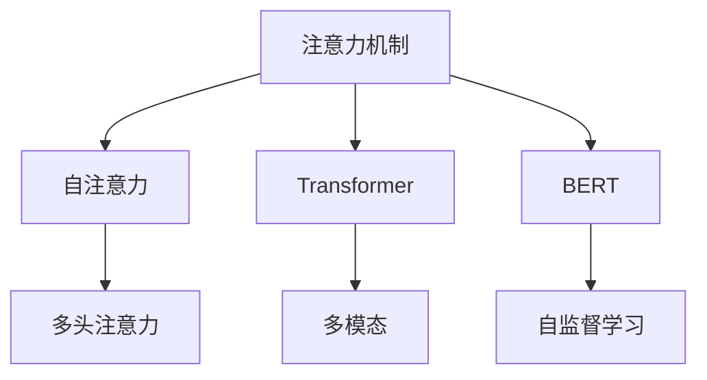
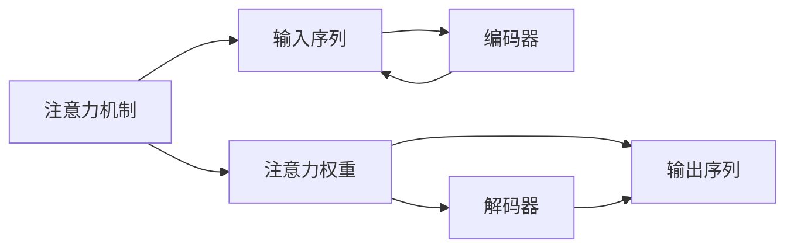
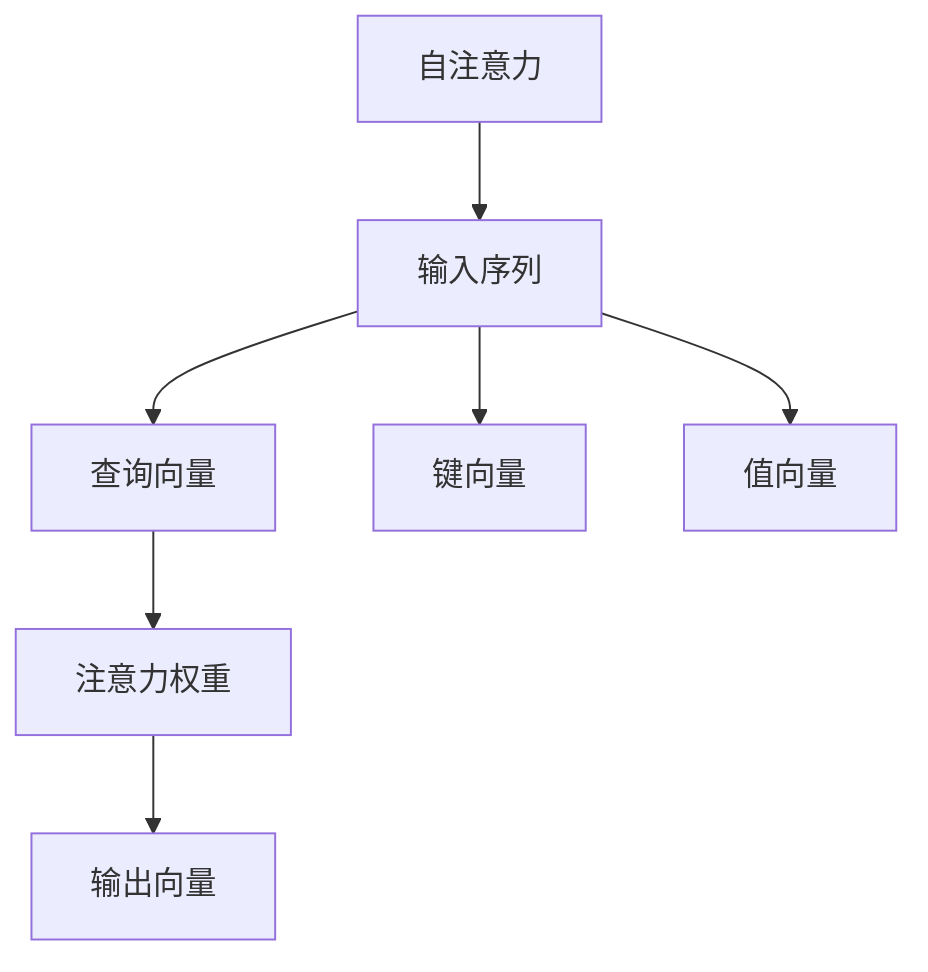
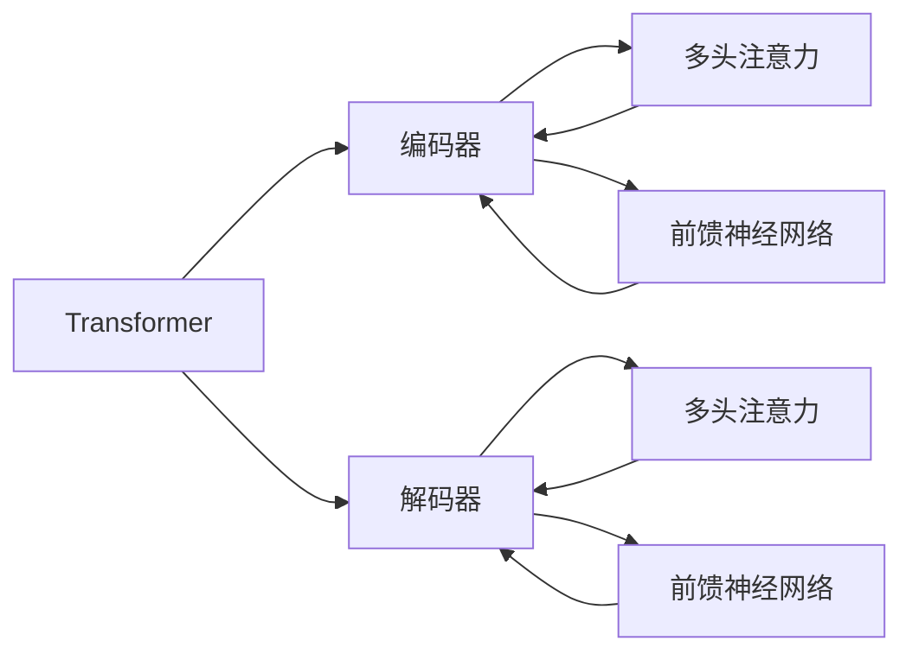
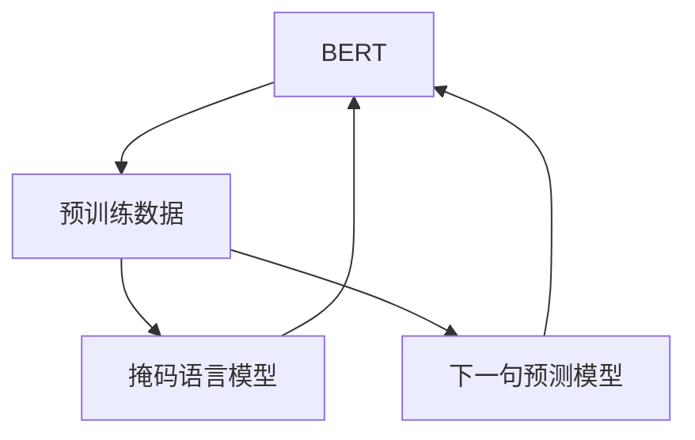
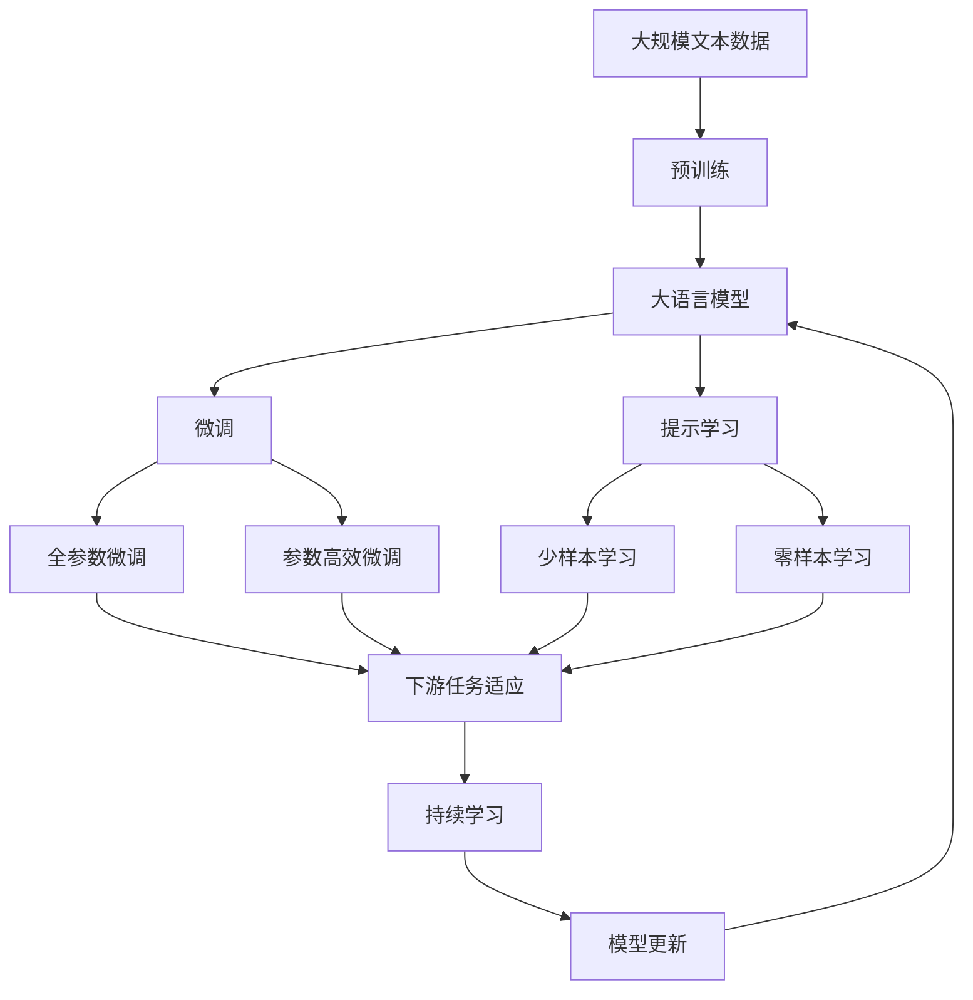

                 

# 解码注意力机制（Attention）

> 关键词：注意力机制,自注意力,Transformer,BERT,注意力权重,多模态

## 1. 背景介绍

### 1.1 问题由来

在深度学习中，注意力机制（Attention）已经成为一个非常热门的话题。它的出现，极大地改变了NLP领域的生态，推动了诸如BERT、Transformer等模型的诞生，并让它们在NLP任务中取得了突破性的进展。但到目前为止，还有许多人对注意力机制并没有完全理解，只是模糊地知道它是用来提高模型性能的。本文将从多个方面，全面介绍注意力机制，并展示其在NLP、图像、多模态等领域的应用。

### 1.2 问题核心关键点

注意力机制的本质是让模型在处理输入时，可以动态地聚焦于最重要的部分，从而提高模型输出的准确性。它具有以下几个关键点：

- 动态：在训练时动态计算注意力权重，从而适应不同的输入和任务。
- 重要性：根据输入的不同部分，分配不同的权重，表示其重要性。
- 融合：将不同部分的表示，加权融合起来，得到最终的输出。
- 适应性：可以自适应地处理多模态数据，如文本、图像、音频等。

### 1.3 问题研究意义

理解注意力机制，对于设计高效的深度学习模型至关重要。它不仅提高了模型在特定任务上的性能，还使得模型可以更好地适应新的任务和数据。此外，随着注意力机制在多模态任务中的广泛应用，它还为跨领域的深度学习提供了新的思路和工具。

## 2. 核心概念与联系

### 2.1 核心概念概述

为了更好地理解注意力机制，本节将介绍几个密切相关的核心概念：

- **注意力机制（Attention）**：一种机制，用于在输入序列中选择出最重要的部分，并根据这些部分生成输出。注意力机制广泛应用于NLP、计算机视觉、多模态等任务。
- **自注意力（Self-Attention）**：一种特殊形式的注意力机制，用于处理序列数据。通过计算输入序列中每个元素与其他元素之间的相似度，得到每个元素的注意力权重，再将这些权重与输入序列中的每个元素相乘，得到最终的加权和。
- **Transformer**：一种基于自注意力机制的神经网络架构，广泛应用于NLP任务。Transformer利用自注意力机制，使得模型能够处理长序列，同时提高了模型的并行性和效率。
- **BERT**：一种预训练语言模型，利用Transformer架构和自注意力机制，通过大规模无标签数据的预训练，学习到丰富的语言表示。
- **注意力权重（Attention Weight）**：表示输入序列中每个元素的重要性。注意力权重越大，表示该元素在输出中的贡献越大。
- **多头注意力（Multi-Head Attention）**：一种扩展自注意力机制的方法，通过设置多个不同的注意力权重，使得模型能够捕捉到输入序列中不同维度的信息，从而提高模型的表达能力。

这些核心概念之间的逻辑关系可以通过以下Mermaid流程图来展示：



这个流程图展示了注意力机制的核心概念及其之间的关系：

1. 注意力机制是自注意力、Transformer、BERT等模型的基础。
2. 自注意力机制可以扩展为多头注意力，提高模型的表达能力。
3. 多头注意力可以应用于多模态任务，利用不同模态的信息。
4. Transformer可以利用自注意力机制，处理长序列。
5. BERT利用Transformer和自注意力机制，进行大规模无标签数据的预训练。

### 2.2 概念间的关系

这些核心概念之间存在着紧密的联系，形成了注意力机制的完整生态系统。下面我通过几个Mermaid流程图来展示这些概念之间的关系。

#### 2.2.1 注意力机制的核心功能



这个流程图展示了注意力机制的核心功能：输入序列经过编码器，得到每个元素的重要性权重。解码器根据这些权重，生成最终的输出序列。

#### 2.2.2 自注意力的计算过程



这个流程图展示了自注意力的计算过程：输入序列中的每个元素，经过查询向量、键向量和值向量，得到注意力权重。这些权重表示每个元素的重要性，最终加权得到输出向量。

#### 2.2.3 Transformer的架构



这个流程图展示了Transformer的架构：编码器由多头注意力和前馈神经网络组成，解码器也有类似的结构。多头注意力能够捕捉输入序列中不同维度的信息，提高模型的表达能力。

#### 2.2.4 BERT的预训练过程



这个流程图展示了BERT的预训练过程：利用大规模无标签数据，通过掩码语言模型和下一句预测模型进行预训练，学习到丰富的语言表示。

### 2.3 核心概念的整体架构

最后，我们用一个综合的流程图来展示这些核心概念在大模型微调过程中的整体架构：



这个综合流程图展示了从预训练到微调，再到持续学习的完整过程。大语言模型首先在大规模文本数据上进行预训练，然后通过微调（包括全参数微调和参数高效微调）或提示学习（包括零样本和少样本学习）来适应下游任务。最后，通过持续学习技术，模型可以不断更新和适应新的任务和数据。 通过这些流程图，我们可以更清晰地理解注意力机制在大模型微调过程中各个核心概念的关系和作用。

## 3. 核心算法原理 & 具体操作步骤
### 3.1 算法原理概述

注意力机制的本质是让模型在处理输入时，可以动态地聚焦于最重要的部分，从而提高模型输出的准确性。它的计算过程可以分为以下几个步骤：

1. 将输入序列中的每个元素，映射到一个高维向量空间，表示其语义信息。
2. 计算每个元素与其他元素之间的相似度，得到注意力权重。
3. 根据注意力权重，对每个元素进行加权求和，得到最终的输出序列。

通过注意力机制，模型可以在处理长序列时，避免使用RNN等序列模型中的递归操作，提高计算效率和并行性。同时，注意力机制还能捕捉输入序列中不同部分的信息，提高模型的表达能力。

### 3.2 算法步骤详解

下面是注意力机制的详细计算步骤：

**Step 1: 输入表示**

输入序列中的每个元素，需要通过一个线性变换，映射到一个高维向量空间。这个线性变换可以表示为：

$$
\mathbf{Q}_i = \mathbf{W}_Q \mathbf{x}_i
$$

其中，$\mathbf{x}_i$ 是输入序列中的第 $i$ 个元素，$\mathbf{W}_Q$ 是线性变换的权重矩阵。

**Step 2: 计算注意力权重**

注意力权重是通过计算输入序列中每个元素与其他元素之间的相似度得到的。具体计算方式如下：

$$
\mathbf{A}_{ij} = \mathrm{softmax}(\frac{\mathbf{Q}_i^T \mathbf{K}_j}{\sqrt{d}})
$$

其中，$\mathbf{Q}_i$ 和 $\mathbf{K}_j$ 分别是查询向量和键向量，$d$ 是向量的维度。$\mathrm{softmax}$ 函数用于将注意力权重归一化到0到1之间。

**Step 3: 加权融合**

根据注意力权重，对输入序列中的每个元素进行加权求和，得到最终的输出序列。具体计算方式如下：

$$
\mathbf{V}_j = \sum_{i=1}^{n} \mathbf{A}_{ij} \mathbf{V}_i
$$

其中，$\mathbf{V}_i$ 是输入序列中第 $i$ 个元素的值向量，$\mathbf{V}_j$ 是输出序列中第 $j$ 个元素。

**Step 4: 输出表示**

输出序列中的每个元素，也需要经过一个线性变换，得到最终的表示。具体计算方式如下：

$$
\mathbf{Y}_j = \mathbf{W}_O \mathbf{V}_j
$$

其中，$\mathbf{W}_O$ 是线性变换的权重矩阵，$\mathbf{Y}_j$ 是输出序列中第 $j$ 个元素的表示。

### 3.3 算法优缺点

注意力机制具有以下优点：

1. 动态性：在处理输入序列时，动态计算注意力权重，能够自适应地处理不同的输入和任务。
2. 可解释性：通过计算注意力权重，可以理解模型在处理输入时，重点关注了哪些部分。
3. 高效性：由于使用了线性变换和矩阵乘法，计算效率较高，适合大规模并行计算。

但注意力机制也存在一些缺点：

1. 计算复杂度高：由于需要进行矩阵计算，计算复杂度较高，需要大量的计算资源。
2. 可训练参数多：需要训练的参数较多，特别是在多头注意力和Transformer等模型中。
3. 模型可解释性不足：虽然可以通过注意力权重理解模型的某些部分，但无法解释整个模型的工作机制。

### 3.4 算法应用领域

注意力机制在多个领域中都有广泛的应用，包括：

1. NLP：用于机器翻译、文本摘要、情感分析、命名实体识别等任务。
2. 计算机视觉：用于图像分类、目标检测、图像分割等任务。
3. 多模态：用于跨领域数据融合、视频描述、音频情感识别等任务。
4. 语音识别：用于语音识别、语音合成等任务。
5. 推荐系统：用于物品推荐、广告推荐等任务。

随着注意力机制的不断演进，其在更多领域中的应用也将不断扩展。

## 4. 数学模型和公式 & 详细讲解 & 举例说明
### 4.1 数学模型构建

在注意力机制中，输入序列 $\mathbf{x}_1, \mathbf{x}_2, \ldots, \mathbf{x}_n$ 中的每个元素，需要通过线性变换得到查询向量 $\mathbf{Q}_i$、键向量 $\mathbf{K}_j$ 和值向量 $\mathbf{V}_i$。计算注意力权重 $\mathbf{A}_{ij}$ 的过程如下：

$$
\mathbf{A}_{ij} = \mathrm{softmax}(\frac{\mathbf{Q}_i^T \mathbf{K}_j}{\sqrt{d}})
$$

其中，$d$ 是向量的维度，$\mathbf{Q}_i$ 和 $\mathbf{K}_j$ 分别是查询向量和键向量。注意力权重 $\mathbf{A}_{ij}$ 表示输入序列中第 $i$ 个元素与第 $j$ 个元素之间的相似度。

根据注意力权重 $\mathbf{A}_{ij}$，加权融合得到输出序列 $\mathbf{V}_j$：

$$
\mathbf{V}_j = \sum_{i=1}^{n} \mathbf{A}_{ij} \mathbf{V}_i
$$

最后，输出序列中的每个元素，需要通过线性变换得到最终的表示：

$$
\mathbf{Y}_j = \mathbf{W}_O \mathbf{V}_j
$$

其中，$\mathbf{W}_O$ 是线性变换的权重矩阵，$\mathbf{Y}_j$ 是输出序列中第 $j$ 个元素的表示。

### 4.2 公式推导过程

下面，我们通过几个例子，来具体讲解注意力机制的计算过程。

**Example 1: 文本序列的注意力计算**

假设输入序列为 $\mathbf{x}_1, \mathbf{x}_2, \mathbf{x}_3, \mathbf{x}_4$，查询向量 $\mathbf{Q}_1, \mathbf{Q}_2, \mathbf{Q}_3, \mathbf{Q}_4$，键向量 $\mathbf{K}_1, \mathbf{K}_2, \mathbf{K}_3, \mathbf{K}_4$，值向量 $\mathbf{V}_1, \mathbf{V}_2, \mathbf{V}_3, \mathbf{V}_4$。计算注意力权重 $\mathbf{A}_{ij}$ 的过程如下：

$$
\begin{aligned}
\mathbf{A}_{11} &= \mathrm{softmax}(\frac{\mathbf{Q}_1^T \mathbf{K}_1}{\sqrt{d}}) \\
\mathbf{A}_{12} &= \mathrm{softmax}(\frac{\mathbf{Q}_1^T \mathbf{K}_2}{\sqrt{d}}) \\
\mathbf{A}_{13} &= \mathrm{softmax}(\frac{\mathbf{Q}_1^T \mathbf{K}_3}{\sqrt{d}}) \\
\mathbf{A}_{14} &= \mathrm{softmax}(\frac{\mathbf{Q}_1^T \mathbf{K}_4}{\sqrt{d}}) \\
\mathbf{A}_{21} &= \mathrm{softmax}(\frac{\mathbf{Q}_2^T \mathbf{K}_1}{\sqrt{d}}) \\
\mathbf{A}_{22} &= \mathrm{softmax}(\frac{\mathbf{Q}_2^T \mathbf{K}_2}{\sqrt{d}}) \\
\mathbf{A}_{23} &= \mathrm{softmax}(\frac{\mathbf{Q}_2^T \mathbf{K}_3}{\sqrt{d}}) \\
\mathbf{A}_{24} &= \mathrm{softmax}(\frac{\mathbf{Q}_2^T \mathbf{K}_4}{\sqrt{d}}) \\
\mathbf{A}_{31} &= \mathrm{softmax}(\frac{\mathbf{Q}_3^T \mathbf{K}_1}{\sqrt{d}}) \\
\mathbf{A}_{32} &= \mathrm{softmax}(\frac{\mathbf{Q}_3^T \mathbf{K}_2}{\sqrt{d}}) \\
\mathbf{A}_{33} &= \mathrm{softmax}(\frac{\mathbf{Q}_3^T \mathbf{K}_3}{\sqrt{d}}) \\
\mathbf{A}_{34} &= \mathrm{softmax}(\frac{\mathbf{Q}_3^T \mathbf{K}_4}{\sqrt{d}}) \\
\mathbf{A}_{41} &= \mathrm{softmax}(\frac{\mathbf{Q}_4^T \mathbf{K}_1}{\sqrt{d}}) \\
\mathbf{A}_{42} &= \mathrm{softmax}(\frac{\mathbf{Q}_4^T \mathbf{K}_2}{\sqrt{d}}) \\
\mathbf{A}_{43} &= \mathrm{softmax}(\frac{\mathbf{Q}_4^T \mathbf{K}_3}{\sqrt{d}}) \\
\mathbf{A}_{44} &= \mathrm{softmax}(\frac{\mathbf{Q}_4^T \mathbf{K}_4}{\sqrt{d}})
\end{aligned}
$$

根据注意力权重 $\mathbf{A}_{ij}$，加权融合得到输出序列 $\mathbf{V}_j$：

$$
\begin{aligned}
\mathbf{V}_1 &= \mathbf{A}_{11} \mathbf{V}_1 + \mathbf{A}_{12} \mathbf{V}_2 + \mathbf{A}_{13} \mathbf{V}_3 + \mathbf{A}_{14} \mathbf{V}_4 \\
\mathbf{V}_2 &= \mathbf{A}_{21} \mathbf{V}_1 + \mathbf{A}_{22} \mathbf{V}_2 + \mathbf{A}_{23} \mathbf{V}_3 + \mathbf{A}_{24} \mathbf{V}_4 \\
\mathbf{V}_3 &= \mathbf{A}_{31} \mathbf{V}_1 + \mathbf{A}_{32} \mathbf{V}_2 + \mathbf{A}_{33} \mathbf{V}_3 + \mathbf{A}_{34} \mathbf{V}_4 \\
\mathbf{V}_4 &= \mathbf{A}_{41} \mathbf{V}_1 + \mathbf{A}_{42} \mathbf{V}_2 + \mathbf{A}_{43} \mathbf{V}_3 + \mathbf{A}_{44} \mathbf{V}_4
\end{aligned}
$$

最后，输出序列中的每个元素，需要通过线性变换得到最终的表示：

$$
\begin{aligned}
\mathbf{Y}_1 &= \mathbf{W}_O \mathbf{V}_1 \\
\mathbf{Y}_2 &= \mathbf{W}_O \mathbf{V}_2 \\
\mathbf{Y}_3 &= \mathbf{W}_O \mathbf{V}_3 \\
\mathbf{Y}_4 &= \mathbf{W}_O \mathbf{V}_4
\end{aligned}
$$

**Example 2: 图像序列的注意力计算**

假设输入序列为 $\mathbf{I}_1, \mathbf{I}_2, \mathbf{I}_3, \mathbf{I}_4$，查询向量 $\mathbf{Q}_1, \mathbf{Q}_2, \mathbf{Q}_3, \mathbf{Q}_4$，键向量 $\mathbf{K}_1, \mathbf{K}_2, \mathbf{K}_3, \mathbf{K}_4$，值向量 $\mathbf{V}_1, \mathbf{V}_2, \mathbf{V}_3, \mathbf{V}_4$。计算注意力权重 $\mathbf{A}_{ij}$ 的过程如下：

$$
\begin{aligned}
\mathbf{A}_{11} &= \mathrm{softmax}(\frac{\mathbf{Q}_1^T \mathbf{K}_1}{\sqrt{d}}) \\
\mathbf{A}_{12} &= \mathrm{softmax}(\frac{\mathbf{Q}_1^T \mathbf{K}_2}{\sqrt{d}}) \\
\mathbf{A}_{13} &= \mathrm{softmax}(\frac{\mathbf{Q}_1^T \mathbf{K}_3}{\sqrt{d}}) \\
\mathbf{A}_{14} &= \mathrm{softmax}(\frac{\mathbf{Q}_1^T \mathbf{K}_4}{\sqrt{d}}) \\
\mathbf{A}_{21} &= \mathrm{softmax}(\frac{\mathbf{Q}_2^T \mathbf{K}_1}{\sqrt{d}}) \\
\mathbf{A}_{22} &= \mathrm{softmax}(\frac{\mathbf{Q}_2^T \mathbf{K}_2}{\sqrt{d}}) \\
\mathbf{A}_{23} &= \mathrm{softmax}(\frac{\mathbf{Q}_2^T \mathbf{K}_3}{\sqrt{d}}) \\
\mathbf{A}_{24} &= \mathrm{softmax}(\frac{\mathbf{Q}_2^T \mathbf{K}_4}{\sqrt{d}}) \\
\mathbf{A}_{31} &= \mathrm{softmax}(\frac{\mathbf{Q}_3^T \mathbf{K}_1}{\sqrt{d}}) \\
\mathbf{A}_{32} &= \mathrm{softmax}(\frac{\mathbf{Q}_3^T \mathbf{K}_2}{\sqrt{d}}) \\
\mathbf{A}_{33} &= \mathrm{softmax}(\frac{\mathbf{Q}_3^T \mathbf{K}_3}{\sqrt{d}}) \\
\mathbf{A}_{34} &= \mathrm{softmax}(\frac{\mathbf{Q}_3^T \mathbf{K}_4}{\sqrt{d}}) \\
\mathbf{A}_{41} &= \mathrm{softmax}(\frac{\mathbf{Q}_4^T \mathbf{K}_1}{\sqrt{d}}) \\
\mathbf{A}_{42} &= \mathrm{softmax}(\frac{\mathbf{Q}_4^T \mathbf{K}_2}{\sqrt{d}}) \\
\mathbf{A}_{43} &= \mathrm{softmax}(\frac{\mathbf{Q}_4^T \mathbf{K}_3}{\sqrt{d}}) \\
\mathbf{A}_{44} &= \mathrm{softmax}(\frac{\mathbf{Q}_4^T \mathbf{K}_4}{\sqrt{d}})
\end{aligned}
$$

根据注意力权重 $\mathbf{A}_{ij}$，加权融合得到输出序列 $\mathbf{V}_j$：

$$
\begin{aligned}
\mathbf{V}_1 &= \mathbf{A}_{11} \mathbf{V}_1 + \mathbf{A}_{12} \mathbf{V}_2 + \mathbf{A}_{13} \mathbf{V}_3 + \mathbf{A}_{14} \mathbf{V}_4 \\
\mathbf{V}_2 &= \mathbf{A}_{21} \mathbf{V}_1 + \mathbf{A}_{22} \mathbf{V}_2 + \mathbf{A}_{23} \mathbf{V}_3 + \mathbf{A}_{24} \mathbf{V}_4 \\
\mathbf{V}_3 &= \mathbf{A}_{31} \mathbf{V}_1 + \mathbf{A}_{32} \mathbf{V}_2 + \mathbf{A}_{33} \mathbf{V}_3 + \mathbf{A}_{34} \mathbf{V}_4 \\
\mathbf{V}_4 &= \mathbf{A}_{41} \mathbf{V}_1 + \mathbf{A}_{42} \mathbf{V}_2 + \mathbf{A}_{43} \mathbf{V}_3 + \mathbf{A}_{44} \mathbf{V}_4
\end{aligned}
$$

最后，输出序列中的每个元素，需要通过线性变换得到最终的表示：

$$
\begin{aligned}
\mathbf{Y}_1 &= \mathbf{W}_O \mathbf{V}_1 \\
\mathbf{Y}_2 &= \mathbf{W}_O \mathbf{V}_2 \\
\mathbf{Y}_3 &= \mathbf{W}_O \mathbf{V}_3 \\
\mathbf{Y}_4 &= \mathbf{W}_O \mathbf{V}_4
\end{aligned}
$$

## 5. 项目实践：代码实例和详细解释说明
### 5.1 开发环境搭建

在进行注意力机制的代码实现前，我们需要准备好开发环境。以下是使用Python进行TensorFlow开发的环境配置流程：

1. 安装Anaconda：从官网下载并安装Anaconda，用于创建独立的Python环境。

2. 创建并激活虚拟环境：
```bash
conda create -n tf-env python=3.8 
conda activate tf-env
```

3. 安装TensorFlow：根据CUDA版本，从官网获取对应的安装命令。例如：
```bash
conda install tensorflow==2.3.0
```

4. 安装各类工具包：
```bash
pip install numpy pandas scikit-learn matplotlib tqdm jupyter notebook ipython
```

完成上述步骤后，即可在`tf-env`环境中开始注意力机制的代码实现。

### 5.2 源代码详细实现

下面我们以图像序列的注意力计算为例，给出使用TensorFlow实现自注意力机制的代码：

