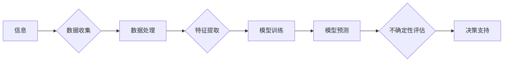

> 关键词：人工智能，不确定性，机器学习，深度学习，预测模型，决策支持，智能系统

# 超越不确定性的最好工具就是AI

在人类历史的长河中，我们一直在努力理解和应对不确定性。从早期的占卜到现代的科学方法，我们不断寻找能够帮助我们预测和解释世界的工具。如今，人工智能（AI）已经成为超越不确定性的最强工具之一。本文将探讨AI如何帮助我们应对不确定性，以及它在各个领域的应用和未来发展趋势。

## 1. 背景介绍

### 1.1 不确定性的本质

不确定性是自然界和人类社会普遍存在的现象。它源于信息的不完整性、随机性和复杂性。在许多情况下，我们无法获取到所有相关信息，或者信息本身具有随机性，使得我们难以做出准确的预测。

### 1.2 人工智能与不确定性

人工智能通过模拟人类学习和推理的能力，能够处理大量数据，识别模式，并做出预测。这使得AI成为超越不确定性的有力工具。

## 2. 核心概念与联系

### 2.1 核心概念原理

#### Mermaid 流程图



### 2.2 核心概念联系

- **信息**：是AI工作的基础，包括原始数据和预测结果。
- **数据收集**：通过传感器、网络等途径收集数据。
- **数据处理**：对数据进行清洗、整合、转换等操作。
- **特征提取**：从数据中提取有用的特征，用于训练模型。
- **模型训练**：使用训练数据训练机器学习或深度学习模型。
- **模型预测**：使用训练好的模型对新数据进行预测。
- **不确定性评估**：评估预测结果的不确定性，提供置信度。
- **决策支持**：根据预测结果和不确定性评估，为决策提供支持。

## 3. 核心算法原理 & 具体操作步骤

### 3.1 算法原理概述

AI通过以下步骤应对不确定性：

1. **数据收集**：收集相关数据，包括历史数据、实时数据等。
2. **数据处理**：清洗、整合、转换数据，为模型训练做准备。
3. **特征提取**：从数据中提取有用的特征，用于模型训练。
4. **模型训练**：使用机器学习或深度学习算法训练模型。
5. **模型预测**：使用训练好的模型对新数据进行预测。
6. **不确定性评估**：评估预测结果的不确定性，提供置信度。
7. **决策支持**：根据预测结果和不确定性评估，为决策提供支持。

### 3.2 算法步骤详解

1. **数据收集**：确定数据来源和类型，使用传感器、网络爬虫等工具收集数据。
2. **数据处理**：使用数据清洗库（如pandas）清洗数据，使用数据整合库（如Spark）整合数据，使用数据转换库（如Scikit-learn）转换数据。
3. **特征提取**：使用特征工程方法（如特征选择、特征构造）提取有用特征。
4. **模型训练**：选择合适的机器学习或深度学习算法，如线性回归、决策树、神经网络等，使用训练数据训练模型。
5. **模型预测**：使用训练好的模型对新数据进行预测，得到预测结果。
6. **不确定性评估**：使用贝叶斯方法、蒙特卡洛方法等评估预测结果的不确定性，提供置信度。
7. **决策支持**：根据预测结果和不确定性评估，为决策提供支持。

### 3.3 算法优缺点

#### 优点

- **高效**：能够处理海量数据，快速做出预测。
- **准确**：通过优化算法和模型，提高预测精度。
- **可扩展**：适用于各种领域和任务。

#### 缺点

- **数据依赖**：需要大量标注数据，且数据质量对结果影响较大。
- **黑盒问题**：模型内部机制难以解释，存在黑盒问题。
- **过拟合**：模型可能过度拟合训练数据，导致泛化能力差。

### 3.4 算法应用领域

AI在以下领域应用广泛：

- **金融**：风险管理、信用评分、投资策略。
- **医疗**：疾病诊断、药物研发、健康管理。
- **交通**：自动驾驶、智能交通系统、交通安全。
- **零售**：个性化推荐、库存管理、供应链优化。
- **制造**：生产优化、故障预测、质量控制。

## 4. 数学模型和公式 & 详细讲解 & 举例说明

### 4.1 数学模型构建

AI模型通常基于以下数学模型：

- **概率论**：用于描述数据分布和概率关系。
- **统计学**：用于估计参数和进行假设检验。
- **线性代数**：用于处理数据矩阵和变换。
- **优化理论**：用于模型训练和参数优化。

### 4.2 公式推导过程

以下以线性回归模型为例，简要介绍公式推导过程。

#### 公式：

$$
y = \beta_0 + \beta_1 x_1 + \beta_2 x_2 + ... + \beta_n x_n + \epsilon
$$

其中，$y$ 是因变量，$x_1, x_2, ..., x_n$ 是自变量，$\beta_0, \beta_1, ..., \beta_n$ 是模型参数，$\epsilon$ 是误差项。

#### 推导过程：

1. **最小二乘法**：最小化误差平方和，即最小化 $J(\beta) = \sum_{i=1}^n (y_i - (\beta_0 + \beta_1 x_{i1} + \beta_2 x_{i2} + ... + \beta_n x_{in})^2$。
2. **求导**：对 $J(\beta)$ 求导，得到梯度 $\nabla J(\beta) = -2(X^T X \beta - X^T y)$。
3. **求解**：令 $\nabla J(\beta) = 0$，得到参数 $\beta = (X^T X)^{-1} X^T y$。

### 4.3 案例分析与讲解

以下以股票价格预测为例，介绍AI在金融领域的应用。

#### 案例描述：

使用过去一年的股票交易数据，预测未来一周的股票价格。

#### 数据处理：

1. **数据收集**：收集股票交易数据，包括开盘价、收盘价、成交量等。
2. **数据处理**：清洗数据，去除异常值，进行归一化处理。
3. **特征提取**：提取历史价格、成交量等特征。

#### 模型训练：

1. **模型选择**：选择合适的机器学习模型，如线性回归、决策树、随机森林等。
2. **模型训练**：使用训练数据训练模型。

#### 模型预测：

1. **预测**：使用训练好的模型预测未来一周的股票价格。
2. **不确定性评估**：评估预测结果的不确定性，提供置信度。

#### 结果分析：

通过比较预测结果和实际价格的差异，评估模型的性能。

## 5. 项目实践：代码实例和详细解释说明

### 5.1 开发环境搭建

1. 安装Python环境。
2. 安装必要的库，如NumPy、Pandas、Scikit-learn等。

### 5.2 源代码详细实现

```python
import pandas as pd
import numpy as np
from sklearn.model_selection import train_test_split
from sklearn.linear_model import LinearRegression

# 数据加载
data = pd.read_csv('stock_data.csv')
data = data.dropna()

# 特征提取
X = data[['open', 'high', 'low', 'close', 'volume']]
y = data['close']

# 数据划分
X_train, X_test, y_train, y_test = train_test_split(X, y, test_size=0.2, random_state=42)

# 模型训练
model = LinearRegression()
model.fit(X_train, y_train)

# 预测
y_pred = model.predict(X_test)

# 结果评估
from sklearn.metrics import mean_squared_error
mse = mean_squared_error(y_test, y_pred)
print("Mean Squared Error:", mse)
```

### 5.3 代码解读与分析

1. **数据加载**：使用pandas读取股票交易数据。
2. **数据处理**：去除缺失值，进行归一化处理。
3. **特征提取**：提取历史价格、成交量等特征。
4. **数据划分**：将数据划分为训练集和测试集。
5. **模型训练**：使用线性回归模型训练模型。
6. **预测**：使用训练好的模型预测测试集数据。
7. **结果评估**：计算预测结果的均方误差，评估模型性能。

## 6. 实际应用场景

### 6.1 金融领域

AI在金融领域的应用包括：

- **风险管理**：预测信贷违约、市场风险等。
- **信用评分**：评估客户信用风险。
- **投资策略**：根据市场数据预测投资组合表现。

### 6.2 医疗领域

AI在医疗领域的应用包括：

- **疾病诊断**：辅助医生诊断疾病。
- **药物研发**：加速药物研发进程。
- **健康管理**：提供个性化的健康管理建议。

### 6.3 交通领域

AI在交通领域的应用包括：

- **自动驾驶**：实现自动驾驶汽车。
- **智能交通系统**：优化交通流量，减少拥堵。
- **交通安全**：预测交通事故，提高交通安全。

### 6.4 未来应用展望

AI将在以下领域发挥越来越重要的作用：

- **智能制造**：实现自动化生产，提高生产效率。
- **智慧城市**：优化城市管理，提高生活质量。
- **教育**：提供个性化学习方案，提高教育质量。

## 7. 工具和资源推荐

### 7.1 学习资源推荐

- 《Python机器学习》
- 《深度学习》
- 《统计学习方法》

### 7.2 开发工具推荐

- Python
- NumPy
- Pandas
- Scikit-learn
- TensorFlow
- PyTorch

### 7.3 相关论文推荐

- "Deep Learning for Predicting Real-World Outcomes" by Scott S. McKinney et al.
- "Why Should I Trust You?": Explaining the Predictions of Any Classifer by Ian J. Goodfellow et al.
- "Generative Adversarial Nets" by Ian Goodfellow et al.

## 8. 总结：未来发展趋势与挑战

### 8.1 研究成果总结

AI在应对不确定性方面取得了显著成果，为各个领域的发展提供了新的机遇。

### 8.2 未来发展趋势

- **更强大的模型**：开发更强大的模型，提高预测精度和泛化能力。
- **更高效的算法**：开发更高效的算法，降低计算成本，提高效率。
- **更广泛的领域**：将AI应用到更多领域，推动社会进步。

### 8.3 面临的挑战

- **数据质量**：数据质量对AI模型的性能影响较大，需要提高数据质量。
- **模型可解释性**：模型内部机制难以解释，需要提高模型可解释性。
- **伦理和隐私**：AI应用需要考虑伦理和隐私问题。

### 8.4 研究展望

未来，AI将在以下方面取得突破：

- **多模态学习**：将图像、音频、文本等多模态信息进行整合。
- **强化学习**：实现更智能的决策和优化。
- **元学习**：让AI能够快速学习新任务。

## 9. 附录：常见问题与解答

**Q1：AI是否能够完全消除不确定性？**

A：AI可以帮助我们更好地理解和应对不确定性，但不能完全消除不确定性。因为不确定性是自然界和人类社会普遍存在的现象，AI只能在一定程度上降低不确定性。

**Q2：AI是否会取代人类？**

A：AI是人类智慧的结晶，旨在辅助人类，而不是取代人类。AI可以帮助人类提高效率、优化决策，但不能完全替代人类的创造力、情感和道德判断。

**Q3：AI是否会引发安全问题？**

A：AI应用需要考虑安全和伦理问题。需要建立相应的法律法规和监管机制，确保AI应用的安全性和伦理性。

**Q4：如何确保AI模型的公平性？**

A：为了确保AI模型的公平性，需要关注以下方面：

- **数据多样性**：收集多样化的数据，避免模型学习到偏见。
- **算法设计**：设计公平的算法，避免歧视性结果。
- **监管机制**：建立监管机制，确保AI应用的公平性。

**Q5：AI的未来发展趋势是什么？**

A：AI的未来发展趋势包括：

- **多模态学习**：将图像、音频、文本等多模态信息进行整合。
- **强化学习**：实现更智能的决策和优化。
- **元学习**：让AI能够快速学习新任务。

作者：禅与计算机程序设计艺术 / Zen and the Art of Computer Programming