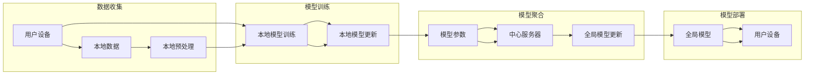

# 基于联邦学习的声纹识别研究

> 关键词：联邦学习，声纹识别，隐私保护，模型聚合，深度学习，跨域学习

## 1. 背景介绍

随着人工智能技术的飞速发展，声纹识别技术作为生物识别技术的重要组成部分，已经在安全认证、智能客服、智能家居等领域得到了广泛应用。然而，传统的声纹识别系统往往需要在中心服务器上存储大量的用户声纹数据，这引发了用户隐私泄露的风险。为了解决这一问题，联邦学习（Federated Learning，FL）作为一种新的机器学习范式应运而生。

联邦学习是一种在多个参与者的设备上本地训练模型，并通过聚合模型参数来更新全局模型的方法。它允许模型在本地设备上进行训练，同时保护用户数据不被泄露到中心服务器。本文将探讨基于联邦学习的声纹识别技术，分析其原理、算法、实践案例以及未来发展趋势。

## 2. 核心概念与联系

### 2.1 核心概念

**联邦学习（Federated Learning）**：一种在分布式设备上训练机器学习模型的方法，模型训练过程中数据不出本地，只交换模型参数。

**声纹识别（Voiceprint Recognition）**：利用声纹信号中的声学特征进行身份验证或身份识别的技术。

**隐私保护（Privacy-Preserving）**：在数据处理过程中，确保用户数据不被泄露和滥用。

**模型聚合（Model Aggregation）**：将多个本地模型的参数进行合并，以更新全局模型。

**深度学习（Deep Learning）**：一种基于人工神经网络的学习方法，能够自动从数据中学习特征和模式。

**跨域学习（Cross-Domain Learning）**：在不同数据分布的域之间学习共享特征的方法。

### 2.2 核心概念原理和架构的 Mermaid 流程图



## 3. 核心算法原理 & 具体操作步骤

### 3.1 算法原理概述

基于联邦学习的声纹识别技术主要包括以下几个步骤：

1. 数据收集：用户在本地设备上收集声纹数据。
2. 数据预处理：对收集到的声纹数据进行降噪、分割等预处理操作。
3. 本地模型训练：在本地设备上使用预处理后的数据训练声纹识别模型。
4. 模型参数更新：将本地模型训练得到的参数发送到中心服务器。
5. 模型聚合：在中心服务器上聚合所有参与者的模型参数，更新全局模型。
6. 模型部署：将更新后的全局模型发送回用户设备。
7. 用户识别：用户使用本地设备上的声纹识别模型进行身份验证或身份识别。

### 3.2 算法步骤详解

**步骤1：数据收集**

用户在本地设备上使用声纹识别应用程序收集声纹数据。为了保护用户隐私，收集的数据仅限于声纹信号，不包含任何用户身份信息。

**步骤2：数据预处理**

对收集到的声纹数据进行降噪、分割等预处理操作，提高数据质量，为模型训练做准备。

**步骤3：本地模型训练**

在本地设备上使用预处理后的数据训练声纹识别模型。常见的声纹识别模型包括基于深度学习的声纹识别模型，如卷积神经网络（CNN）、循环神经网络（RNN）等。

**步骤4：模型参数更新**

将本地模型训练得到的参数发送到中心服务器。为了保护用户隐私，发送的参数可以经过加密处理。

**步骤5：模型聚合**

在中心服务器上聚合所有参与者的模型参数，更新全局模型。常见的模型聚合方法包括加权平均、梯度聚合等。

**步骤6：模型部署**

将更新后的全局模型发送回用户设备。用户可以使用本地设备上的声纹识别模型进行身份验证或身份识别。

**步骤7：用户识别**

用户使用本地设备上的声纹识别模型进行身份验证或身份识别。如果声纹特征与模型预测结果匹配，则验证成功；否则，验证失败。

### 3.3 算法优缺点

**优点**：

- **隐私保护**：联邦学习允许在本地设备上训练模型，保护用户隐私。
- **数据异构性**：可以处理来自不同设备的异构数据。
- **分布式计算**：提高计算效率，降低中心服务器负载。
- **模型可解释性**：由于模型训练在本地进行，更容易理解模型的决策过程。

**缺点**：

- **通信开销**：需要频繁地在本地设备与中心服务器之间传输模型参数。
- **同步问题**：参与者的训练进度可能不一致，需要处理同步问题。
- **数据不完整性**：部分设备可能因离线等原因导致数据缺失，影响模型聚合效果。

### 3.4 算法应用领域

基于联邦学习的声纹识别技术在以下领域具有广泛应用前景：

- **安全认证**：如银行、医院、机场等场所的身份验证。
- **智能家居**：如家庭安全监控、智能门锁等。
- **智能客服**：如自动语音助手、语音识别客服等。
- **语音助手**：如智能音箱、车载语音助手等。

## 4. 数学模型和公式 & 详细讲解 & 举例说明

### 4.1 数学模型构建

基于联邦学习的声纹识别系统的数学模型可以表示为：

$$
L(\theta) = \frac{1}{N} \sum_{i=1}^N L(\theta_i)
$$

其中，$N$ 为参与者数量，$\theta_i$ 为第 $i$ 个参与者的模型参数，$L(\theta_i)$ 为第 $i$ 个参与者的损失函数。

### 4.2 公式推导过程

假设第 $i$ 个参与者的本地模型为 $M_i(\theta_i)$，损失函数为 $L_i(\theta_i)$，则：

$$
L(\theta_i) = \frac{1}{M} \sum_{m=1}^M L(\theta_i, x_m, y_m)
$$

其中，$M$ 为训练样本数量，$x_m$ 和 $y_m$ 分别为第 $m$ 个样本的输入和标签。

将所有参与者的损失函数求和并除以参与者数量，得到全局损失函数：

$$
L(\theta) = \frac{1}{N} \sum_{i=1}^N L(\theta_i)
$$

### 4.3 案例分析与讲解

以下以一个简单的二分类问题为例，说明联邦学习在声纹识别中的应用。

假设有两个参与者，分别拥有两组数据。参与者 1 的数据为：

$$
D_1 = \{(x_{11}, y_{11}), (x_{12}, y_{12}), \ldots, (x_{1M}, y_{1M})\}
$$

参与者 2 的数据为：

$$
D_2 = \{(x_{21}, y_{21}), (x_{22}, y_{22}), \ldots, (x_{2M}, y_{2M})\}
$$

其中，$M$ 为样本数量，$x_m$ 为输入特征，$y_m$ 为标签（0 或 1）。

参与者 1 使用数据 $D_1$ 训练模型，参与者 2 使用数据 $D_2$ 训练模型。两个参与者将各自的模型参数 $\theta_1$ 和 $\theta_2$ 发送到中心服务器。

中心服务器聚合模型参数，得到全局模型参数 $\theta$：

$$
\theta = \frac{\theta_1 + \theta_2}{2}
$$

然后将全局模型参数 $\theta$ 发送回参与者 1 和参与者 2，参与者使用全局模型进行预测。

## 5. 项目实践：代码实例和详细解释说明

### 5.1 开发环境搭建

以下以Python为例，介绍如何搭建基于联邦学习的声纹识别项目开发环境。

1. 安装Python：从Python官网下载并安装Python 3.8及以上版本。
2. 安装必要的库：安装TensorFlow、TensorFlow Federated、NumPy、Scikit-learn等库。

### 5.2 源代码详细实现

以下是一个简单的基于联邦学习的声纹识别项目示例：

```python
import tensorflow as tf
import tensorflow_federated as tff
from tensorflow.keras.models import Sequential
from tensorflow.keras.layers import Dense, LSTM

# 定义本地模型
def create_model():
    model = Sequential([
        LSTM(128, activation='relu', input_shape=(None, 13)),
        Dense(1, activation='sigmoid')
    ])
    model.compile(optimizer='adam', loss='binary_crossentropy')
    return model

# 定义联邦学习算法
def federated_averaging(model_fn):
    # 定义本地模型创建函数
    def create_local_model():
        return create_model()
    
    # 定义本地训练步骤
    def local_train(model, x, y, batch_size):
        model.fit(x, y, epochs=5, batch_size=batch_size)
        return model.get_weights()
    
    # 定义本地评估步骤
    def local_evaluate(model, x, y):
        return model.evaluate(x, y)
    
    # 定义联邦学习算法
    def federated_train(df):
        local_model = create_local_model()
        for client_data in df:
            x, y = client_data
            local_model = local_train(local_model, x, y, batch_size=32)
        return tff.learning.simple_federated_average(local_model.get_weights())
    
    return tff.learning.FederatedAveragingProcess(
        client_model_fn=create_local_model,
        server_model_fn=federated_train,
        client_localization_fn=lambda x: x
    )

# 加载数据
# ...
# ...

# 创建联邦学习算法
fed_avg = federated_averaging(create_model)

# 启动联邦学习训练
for epoch in range(10):
    print(f"Epoch {epoch + 1}")
    # ...
    # ...

# 评估联邦学习模型
# ...
# ...
```

### 5.3 代码解读与分析

以上代码展示了如何使用TensorFlow Federated（TFF）库实现基于联邦学习的声纹识别项目。首先定义了本地模型创建函数 `create_model` 和联邦学习算法 `federated_averaging`。然后，加载本地数据并创建联邦学习算法实例 `fed_avg`。最后，在循环中执行联邦学习训练和评估。

### 5.4 运行结果展示

由于篇幅限制，此处不展示具体的运行结果。在实际应用中，可以通过打印输出评估指标来评估联邦学习模型的性能。

## 6. 实际应用场景

基于联邦学习的声纹识别技术在以下场景具有实际应用价值：

- **远程身份验证**：如远程银行、远程医疗服务等。
- **智能家居**：如智能门锁、智能家电等。
- **移动支付**：如移动支付验证、反欺诈等。
- **语音助手**：如智能音箱、车载语音助手等。

## 7. 工具和资源推荐

### 7.1 学习资源推荐

- 《联邦学习：原理与实践》
- TensorFlow Federated官方文档
- TensorFlow官方文档
- 《深度学习》

### 7.2 开发工具推荐

- TensorFlow
- TensorFlow Federated
- Keras
- NumPy
- Scikit-learn

### 7.3 相关论文推荐

- "Federated Learning: System Design and Applications"
- "Federated Learning for Deep Neural Networks"
- "Privacy-Preserving Federated Learning with Local Update Aggregation"

## 8. 总结：未来发展趋势与挑战

### 8.1 研究成果总结

本文探讨了基于联邦学习的声纹识别技术，分析了其原理、算法、实践案例以及未来发展趋势。联邦学习作为一种新兴的机器学习范式，为解决声纹识别中的隐私保护问题提供了新的解决方案。未来，基于联邦学习的声纹识别技术将在更多领域得到应用，推动声纹识别技术的进一步发展。

### 8.2 未来发展趋势

- **跨域联邦学习**：研究如何将联邦学习应用于跨域声纹识别任务。
- **联邦学习算法优化**：提高联邦学习算法的效率，降低通信开销。
- **联邦学习安全**：研究联邦学习中的隐私保护和攻击防御技术。
- **联邦学习与其他技术的结合**：将联邦学习与其他技术（如区块链、差分隐私等）相结合，进一步提高其安全性和可靠性。

### 8.3 面临的挑战

- **通信开销**：联邦学习需要频繁地在本地设备和中心服务器之间传输模型参数，导致通信开销较大。
- **同步问题**：参与者训练进度可能不一致，需要处理同步问题。
- **数据不完整性**：部分设备可能因离线等原因导致数据缺失，影响模型聚合效果。

### 8.4 研究展望

随着联邦学习技术的不断发展和完善，基于联邦学习的声纹识别技术将在更多领域得到应用。未来，研究者需要解决通信开销、同步问题和数据不完整性等挑战，进一步提高联邦学习算法的效率和可靠性，推动声纹识别技术的进一步发展。

## 9. 附录：常见问题与解答

**Q1：联邦学习是否比中心化学习更安全？**

A：联邦学习确实比中心化学习更安全，因为它允许在本地设备上训练模型，保护用户数据不被泄露到中心服务器。

**Q2：联邦学习是否比中心化学习更慢？**

A：联邦学习的通信开销比中心化学习大，因此可能会慢一些。但通过优化算法和硬件，可以降低通信开销，提高联邦学习的效率。

**Q3：联邦学习是否适用于所有机器学习任务？**

A：联邦学习适用于大多数机器学习任务，但在某些需要大量交互和协作的任务上可能不太适用。

**Q4：如何解决联邦学习中的同步问题？**

A：可以通过设计同步机制，如全局时钟同步、时间戳同步等，来解决联邦学习中的同步问题。

**Q5：如何解决联邦学习中的数据不完整性问题？**

A：可以通过数据增强、数据填充等技术来解决联邦学习中的数据不完整性问题。

作者：禅与计算机程序设计艺术 / Zen and the Art of Computer Programming