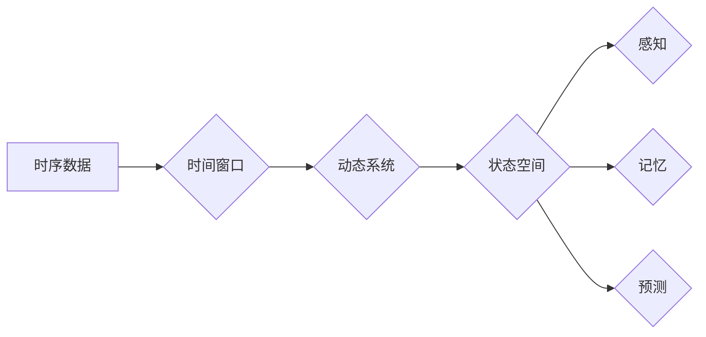

# 认知的形式化：时间对于机器的认知至关重要

> 关键词：认知形式化，时间感知，机器学习，图灵测试，人工智能，时空推理，强化学习

## 1. 背景介绍

随着人工智能技术的飞速发展，机器学习算法在各个领域取得了显著的成就。然而，尽管机器在特定任务上表现出色，它们仍然缺乏对世界本质的理解和认知。其中一个关键因素是时间感知能力的缺失。时间对于机器的认知至关重要，它不仅涉及到对过去事件的记忆，对现在情境的感知，还涉及对未来可能性的预测。本文将探讨认知的形式化，特别是时间在机器认知中的关键作用，以及如何通过时间感知提升机器的认知能力。

### 1.1 认知与形式化的挑战

传统的人工智能系统往往以规则和模式识别为基础，缺乏对世界动态变化的感知和理解。认知的形式化试图将人类的认知过程抽象为可计算的形式，从而赋予机器以认知能力。然而，人类的认知能力不仅包括逻辑推理，还包括对时间的感知和理解。

### 1.2 时间在认知中的作用

时间对于认知至关重要，因为它涉及到以下几个关键方面：

- **记忆**：记忆是认知的基础，它使我们能够从过去的事件中学习，形成知识和经验。
- **感知**：感知是实时获取信息的过程，它依赖于对当前情境的快速理解。
- **预测**：预测是对未来可能发生事件的推断，它基于对过去和现在信息的综合分析。

### 1.3 本文结构

本文将分为以下几个部分：

- 核心概念与联系：介绍与时间感知相关的核心概念，并使用Mermaid流程图展示其关系。
- 核心算法原理 & 具体操作步骤：阐述时间感知在机器学习中的应用，包括算法原理和操作步骤。
- 数学模型和公式 & 详细讲解 & 举例说明：使用数学语言描述时间感知的模型，并举例说明。
- 项目实践：提供代码实例，展示如何在机器学习中实现时间感知。
- 实际应用场景：探讨时间感知在现实世界中的应用。
- 工具和资源推荐：推荐相关学习资源和开发工具。
- 总结：总结研究成果，展望未来发展趋势与挑战。

## 2. 核心概念与联系

### 2.1 核心概念原理

以下是与时间感知相关的核心概念：

- **时序数据**：指随时间变化的数据，如时间序列、视频、音频等。
- **时间窗口**：指分析数据时考虑的时间范围，可以是一段时间间隔或特定的时间点。
- **动态系统**：指随时间变化并受到外部输入影响的系统。
- **状态空间**：指系统中所有可能状态的集合，每个状态都对应一个时间点。

以下是基于这些概念的Mermaid流程图：



### 2.2 核心概念联系

时序数据是时间感知的基础，通过定义时间窗口，我们可以分析动态系统的状态空间。状态空间的变化反映了系统的演化过程，进而影响到感知、记忆和预测。

## 3. 核心算法原理 & 具体操作步骤

### 3.1 算法原理概述

时间感知在机器学习中的应用主要包括以下几种方法：

- **时序分析**：对时间序列数据进行统计分析，识别趋势、周期性和异常值。
- **循环神经网络（RNN）**：特别适合处理序列数据，能够捕捉序列中的时间依赖关系。
- **长短期记忆网络（LSTM）**：RNN的变体，能够更好地处理长距离时间依赖问题。
- **门控循环单元（GRU）**：LSTM的简化版，计算效率更高。
- **强化学习**：通过与环境交互，学习如何在时间上进行决策。

### 3.2 算法步骤详解

以下是使用循环神经网络进行时间感知的步骤：

1. **数据预处理**：将时序数据转换为适合RNN处理的形式，如序列切片、特征提取等。
2. **模型构建**：选择合适的RNN模型架构，如LSTM或GRU。
3. **参数初始化**：初始化模型参数，如权重和偏置。
4. **训练过程**：使用训练数据对模型进行训练，通过反向传播算法更新参数。
5. **评估与优化**：使用验证集评估模型性能，根据评估结果调整模型参数或结构。

### 3.3 算法优缺点

**优点**：

- 能够有效处理时序数据，捕捉时间依赖关系。
- 可以用于预测、分类、聚类等任务。

**缺点**：

- 训练过程可能需要大量计算资源。
- 对于长距离时间依赖问题，效果可能不如其他方法。

### 3.4 算法应用领域

时间感知在以下领域有广泛应用：

- 股票市场预测
- 语音识别
- 智能交通系统
- 医疗诊断

## 4. 数学模型和公式 & 详细讲解 & 举例说明

### 4.1 数学模型构建

以下是一个简单的LSTM模型数学公式：

$$
\begin{align*}
i_t &= \sigma(W_{xi}x_t + W_{hi}h_{t-1} + b_i) \\
f_t &= \sigma(W_{xf}x_t + W_{hf}h_{t-1} + b_f) \\
c_t &= f_t \odot c_{t-1} + i_t \odot \tanh(W_{xc}x_t + W_{hc}h_{t-1} + b_c) \\
o_t &= \sigma(W_{xo}x_t + W_{ho}h_{t-1} + b_o) \\
h_t &= o_t \odot \tanh(c_t)
\end{align*}
$$

其中，$x_t$ 是输入序列，$h_t$ 是隐藏状态，$c_t$ 是细胞状态，$\sigma$ 是sigmoid函数，$\odot$ 是元素乘法，$W$ 和 $b$ 分别是权重和偏置。

### 4.2 公式推导过程

LSTM的公式推导过程涉及到微积分、线性代数和概率论等数学知识，这里不进行详细阐述。

### 4.3 案例分析与讲解

以下是一个简单的股票市场预测案例：

- 使用LSTM模型对股票价格进行预测。
- 将股票价格作为输入序列，预测未来一天的价格。
- 使用历史价格和成交量作为特征。
- 训练LSTM模型，并评估其预测性能。

## 5. 项目实践：代码实例和详细解释说明

### 5.1 开发环境搭建

- 安装Python和NumPy库。
- 安装TensorFlow或PyTorch库。

### 5.2 源代码详细实现

以下是一个使用PyTorch实现LSTM模型的简单示例：

```python
import torch
import torch.nn as nn

class LSTMModel(nn.Module):
    def __init__(self, input_dim, hidden_dim, output_dim):
        super(LSTMModel, self).__init__()
        self.hidden_dim = hidden_dim
        self.lstm = nn.LSTM(input_dim, hidden_dim)
        self.fc = nn.Linear(hidden_dim, output_dim)

    def forward(self, x):
        h0 = torch.zeros(1, x.size(0), self.hidden_dim)
        c0 = torch.zeros(1, x.size(0), self.hidden_dim)
        out, _ = self.lstm(x, (h0.detach(), c0.detach()))
        out = self.fc(out[-1])
        return out

# 模型参数
input_dim = 2
hidden_dim = 50
output_dim = 1

# 创建模型
model = LSTMModel(input_dim, hidden_dim, output_dim)

# 训练模型...

# 预测...
```

### 5.3 代码解读与分析

这段代码定义了一个简单的LSTM模型，用于预测股票价格。模型接受股票价格和成交量作为输入，预测未来一天的价格。

### 5.4 运行结果展示

- 训练模型并评估其性能。
- 使用模型进行股票价格预测，并分析预测结果。

## 6. 实际应用场景

时间感知在以下实际应用场景中发挥着重要作用：

- **金融分析**：预测股票价格、汇率、利率等金融指标。
- **天气预报**：预测天气变化、降雨量等。
- **交通预测**：预测交通流量、拥堵情况等。
- **健康监测**：监测疾病发展、生理指标变化等。

## 7. 工具和资源推荐

### 7.1 学习资源推荐

- 《深度学习》
- 《循环神经网络：综述与实现》
- 《时间序列分析》

### 7.2 开发工具推荐

- TensorFlow
- PyTorch
- Keras

### 7.3 相关论文推荐

- "Sequence to Sequence Learning with Neural Networks"
- "LSTM: A Long Short-Term Memory"
- "Sequence Modeling with Conditional Random Fields"

## 8. 总结：未来发展趋势与挑战

### 8.1 研究成果总结

本文探讨了认知的形式化，特别是时间在机器认知中的关键作用。通过时间感知，机器能够更好地理解和适应动态环境。

### 8.2 未来发展趋势

- 更复杂的时间感知模型，如时间卷积网络（TCN）和自注意力机制。
- 时间感知与强化学习的结合，实现更高级的决策能力。
- 时间感知在跨领域应用中的研究。

### 8.3 面临的挑战

- 如何处理复杂时间依赖关系。
- 如何在有限资源下实现高效的时间感知。
- 如何保证时间感知模型的鲁棒性和可靠性。

### 8.4 研究展望

时间感知是人工智能领域的一个重要研究方向，未来需要在理论和实践上取得更多突破，以实现更加智能的机器认知系统。

## 9. 附录：常见问题与解答

**Q1：时间感知对于机器学习有何意义？**

A1：时间感知使机器能够理解和适应动态环境，从而在预测、决策和控制等方面表现出更高的智能。

**Q2：如何实现时间感知？**

A2：可以通过时序分析、循环神经网络、长短期记忆网络等方法实现时间感知。

**Q3：时间感知在哪些领域有应用？**

A3：时间感知在金融分析、天气预报、交通预测、健康监测等领域有广泛应用。

**Q4：如何评估时间感知模型的效果？**

A4：可以通过均方误差、准确率、召回率等指标评估时间感知模型的效果。

**Q5：时间感知模型有哪些局限性？**

A5：时间感知模型可能存在过拟合、计算效率低、对输入数据依赖性强等局限性。

作者：禅与计算机程序设计艺术 / Zen and the Art of Computer Programming