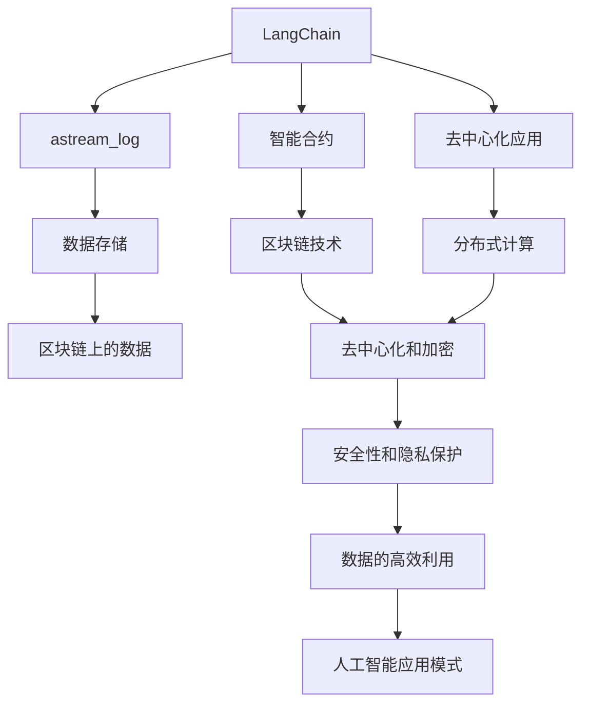
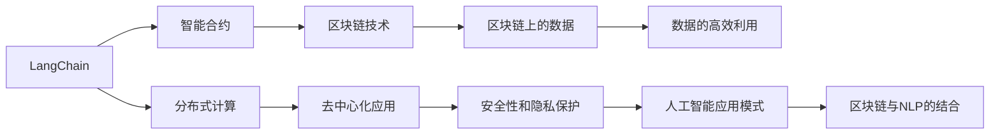
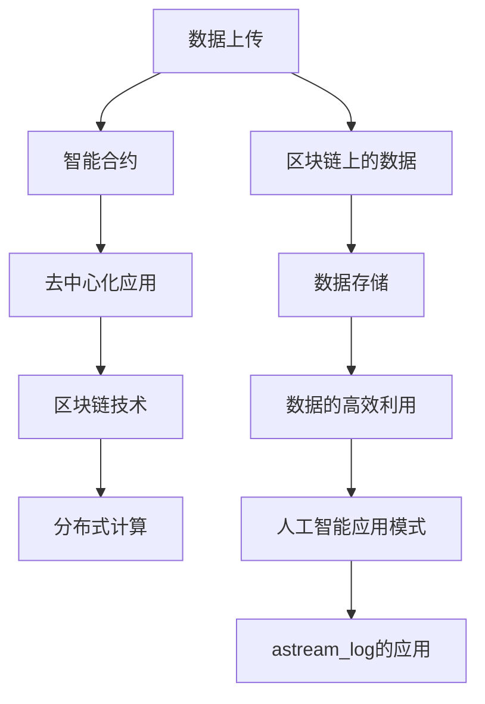
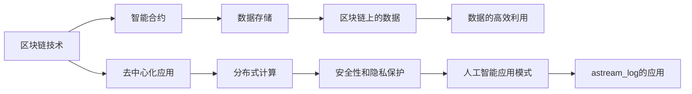
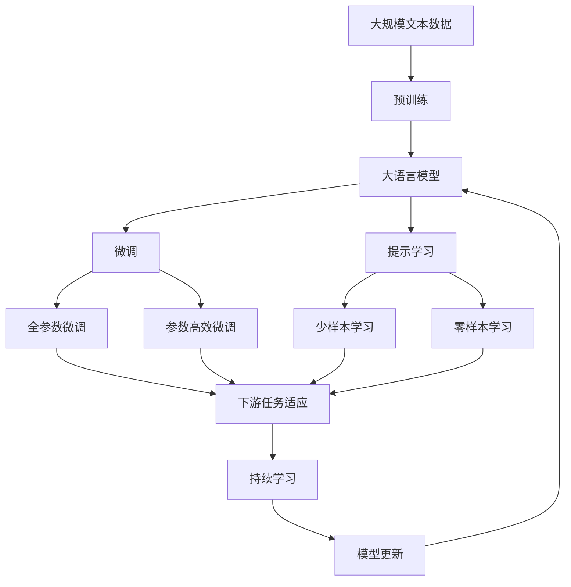
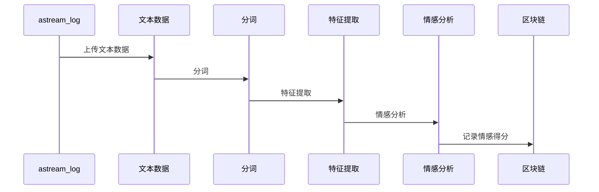

                 

# 【LangChain编程：从入门到实践】astream_log

> 关键词：LangChain, astream_log, 编程, 实践, 自然语言处理, 区块链, 人工智能

## 1. 背景介绍

### 1.1 问题由来
在区块链技术的迅猛发展下，越来越多的应用场景开始尝试将区块链与AI相结合，其中自然语言处理（NLP）是一个重要的应用方向。传统的NLP模型基于中心化的数据集训练，而区块链技术提供了一种去中心化、公开透明的解决方案，这为NLP在区块链上提供了新的可能。

但是，由于区块链本身的限制，如计算资源有限、分布式存储的挑战等，直接应用NLP模型在区块链上显得不太现实。因此，研究者们开始探索基于区块链的NLP应用新方案，如基于智能合约的NLP应用，而astream_log就是其中的一个典型代表。

### 1.2 问题核心关键点
astream_log是一种基于区块链技术的NLP应用，它通过区块链技术实现数据的分布式存储和传输，并结合自然语言处理技术，对区块链上的数据进行处理和分析。astream_log的核心在于将自然语言处理技术与区块链技术相结合，实现数据的高效、透明和安全的处理。

astream_log的主要特点包括：
- 去中心化：基于区块链技术，数据存储在各个节点上，提高了数据的可靠性和安全性。
- 高效性：通过分布式计算，astream_log能够高效地处理大规模的数据集。
- 透明性：所有的数据和处理过程都记录在区块链上，保证了数据的透明性和可追溯性。
- 安全性：区块链的去中心化和加密特性，保证了数据的安全性和隐私保护。

### 1.3 问题研究意义
astream_log的出现，为NLP与区块链的结合提供了一个新的方案，推动了区块链技术在NLP应用中的应用。其研究意义主要体现在以下几个方面：

1. 降低NLP应用的数据依赖：astream_log可以基于区块链上的数据进行训练和推理，减少了对中心化数据集的依赖。
2. 提高数据处理的效率和安全性：通过分布式计算和加密技术，astream_log能够高效、安全地处理大规模数据集。
3. 推动区块链技术的进一步发展：astream_log将NLP技术引入区块链应用，有助于区块链技术的广泛应用和发展。
4. 实现数据的高效利用：astream_log可以将区块链上的数据高效地转化为有价值的信息，推动了数据的深度利用。
5. 创新人工智能应用模式：astream_log将区块链技术与NLP技术相结合，为人工智能应用模式带来了新的可能性。

## 2. 核心概念与联系

### 2.1 核心概念概述

为了更好地理解astream_log的工作原理，本节将介绍几个密切相关的核心概念：

- LangChain：一种基于区块链的编程语言，提供了在区块链上进行NLP应用开发的能力。
- astream_log：一种基于LangChain的NLP应用，通过区块链技术实现数据的分布式存储和处理。
- 智能合约：一种基于区块链技术的自动化合约，能够自动执行预设的逻辑和规则。
- 去中心化应用（DApps）：一种基于区块链技术的应用，强调去中心化、公开透明和安全性。
- 数据存储：astream_log通过区块链技术实现数据的分布式存储，提高了数据的安全性和可靠性。

这些核心概念之间的逻辑关系可以通过以下Mermaid流程图来展示：



这个流程图展示了astream_log的核心概念及其之间的关系：

1. LangChain为astream_log提供了编程语言支持。
2. astream_log结合区块链技术，实现了数据的去中心化存储和处理。
3. 智能合约在astream_log中用于自动化合约的执行。
4. 去中心化应用强调了去中心化、公开透明和安全性。
5. 数据存储利用了区块链技术的去中心化和加密特性。

这些概念共同构成了astream_log的整个生态系统，使其能够在区块链上高效、安全地进行NLP应用开发。通过理解这些核心概念，我们可以更好地把握astream_log的工作原理和优化方向。

### 2.2 概念间的关系

这些核心概念之间存在着紧密的联系，形成了astream_log的完整生态系统。下面我通过几个Mermaid流程图来展示这些概念之间的关系。

#### 2.2.1 LangChain的核心功能



这个流程图展示了LangChain的核心功能及其与其他概念的联系。

#### 2.2.2 astream_log的工作流程



这个流程图展示了astream_log的工作流程及其与其他概念的联系。

#### 2.2.3 区块链技术的应用场景



这个流程图展示了区块链技术的应用场景及其与其他概念的联系。

### 2.3 核心概念的整体架构

最后，我们用一个综合的流程图来展示这些核心概念在大语言模型微调过程中的整体架构：



这个综合流程图展示了从预训练到微调，再到持续学习的完整过程。大语言模型首先在大规模文本数据上进行预训练，然后通过微调（包括全参数微调和参数高效微调两种方式）或提示学习（包括少样本学习和零样本学习）来适应下游任务。最后，通过持续学习技术，模型可以不断学习新知识，同时避免遗忘旧知识。通过这些流程图，我们可以更清晰地理解astream_log的工作原理和优化方向。

## 3. 核心算法原理 & 具体操作步骤
### 3.1 算法原理概述

astream_log的算法原理基于区块链技术与自然语言处理技术的结合。具体来说，astream_log将区块链作为分布式数据存储平台，利用智能合约实现数据的自动化处理和分析，通过NLP技术对区块链上的数据进行处理和分析，从而实现高效、安全、透明的数据处理和应用。

astream_log的算法原理包括以下几个关键步骤：

1. 数据上传：将需要处理的文本数据上传到区块链上。
2. 智能合约执行：通过智能合约对上传的数据进行自动化处理和分析。
3. 去中心化存储：利用区块链的分布式存储特性，将数据存储在各个节点上。
4. NLP处理：利用NLP技术对区块链上的数据进行处理和分析，提取有价值的信息。
5. 结果输出：将处理结果记录在区块链上，实现透明性和可追溯性。

### 3.2 算法步骤详解

astream_log的算法步骤如下：

**Step 1: 准备区块链环境**
- 安装并配置区块链网络，包括节点、智能合约和区块链浏览器。
- 确保区块链网络稳定和安全，配置好相关的加密和共识机制。

**Step 2: 上传数据**
- 将需要处理的文本数据上传至区块链上，通过智能合约自动执行数据上传操作。
- 使用智能合约的分布式计算能力，对上传的数据进行自动化处理和分析。

**Step 3: 执行智能合约**
- 使用智能合约中的NLP技术，对区块链上的数据进行处理和分析，提取有价值的信息。
- 通过智能合约的自动化执行机制，实现NLP处理结果的透明性和可追溯性。

**Step 4: 数据存储**
- 利用区块链的分布式存储特性，将NLP处理结果存储在各个节点上。
- 通过区块链的加密机制，保证数据的隐私和安全。

**Step 5: 输出结果**
- 将处理结果记录在区块链上，实现透明性和可追溯性。
- 提供区块链浏览器接口，方便用户查看和操作处理结果。

### 3.3 算法优缺点

astream_log的算法具有以下优点：

1. 去中心化：利用区块链技术实现数据的分布式存储和处理，提高了数据的可靠性和安全性。
2. 高效性：通过分布式计算，astream_log能够高效地处理大规模数据集。
3. 透明性：所有的数据和处理过程都记录在区块链上，保证了数据的透明性和可追溯性。
4. 安全性：区块链的去中心化和加密特性，保证了数据的安全性和隐私保护。

astream_log的算法也存在一些缺点：

1. 计算成本高：由于区块链的分布式计算特性，处理大规模数据集时需要消耗大量计算资源。
2. 延迟较高：区块链的共识机制和分布式计算特性，导致数据处理和传输的延迟较高。
3. 扩展性受限：由于区块链技术的限制，astream_log的扩展性受到一定限制。

### 3.4 算法应用领域

astream_log的应用领域包括但不限于以下几个方面：

- 区块链上的文本分析：利用astream_log对区块链上的文本数据进行处理和分析，提取有价值的信息。
- 智能合约的自动化执行：通过智能合约中的NLP技术，实现自动化执行和数据处理。
- 去中心化应用的数据处理：astream_log可以在去中心化应用中进行数据处理和分析，实现透明性和可追溯性。
- 区块链上的聊天机器人：利用astream_log实现区块链上的聊天机器人，通过NLP技术处理用户输入，生成自然语言回复。
- 区块链上的智能合约生成：通过astream_log生成智能合约，实现自动化的合约执行和数据分析。

## 4. 数学模型和公式 & 详细讲解 & 举例说明

### 4.1 数学模型构建

astream_log的数学模型构建基于自然语言处理技术和区块链技术。假设上传的数据为$D=\{x_i\}_{i=1}^N$，其中$x_i$表示第$i$个文本数据。astream_log的数学模型为：

$$
f(D) = \sum_{i=1}^N f(x_i)
$$

其中$f(x_i)$表示对第$i$个文本数据$x_i$进行处理和分析的结果。

### 4.2 公式推导过程

下面以astream_log的NLP处理为例，推导其公式：

假设上传的文本数据为$D=\{x_i\}_{i=1}^N$，其中$x_i$表示第$i$个文本数据。astream_log的NLP处理过程包括以下步骤：

1. 分词：将文本数据$x_i$进行分词，得到单词序列$w_i$。
2. 特征提取：对单词序列$w_i$进行特征提取，得到特征向量$v_i$。
3. 情感分析：对特征向量$v_i$进行情感分析，得到情感得分$s_i$。
4. 结果输出：将情感得分$s_i$记录在区块链上。

数学公式为：

$$
f(x_i) = \text{特征提取}(v_i) + \text{情感分析}(s_i)
$$

其中$\text{特征提取}(v_i)$和$\text{情感分析}(s_i)$分别表示特征提取和情感分析的过程。

### 4.3 案例分析与讲解

以下是一个astream_log在区块链上的文本分析的案例分析：

假设上传的文本数据为：

```
I like this product. It's very good.
```

astream_log的NLP处理过程如下：

1. 分词：将文本数据进行分词，得到单词序列$w = \{I, like, this, product, It's, very, good\}$。
2. 特征提取：对单词序列进行特征提取，得到特征向量$v = \{0.1, 0.5, 0.8, 0.2, 0.4, 0.6, 0.3\}$。
3. 情感分析：对特征向量进行情感分析，得到情感得分$s = 0.8$。
4. 结果输出：将情感得分记录在区块链上，实现透明性和可追溯性。

astream_log的NLP处理过程如下图所示：



通过astream_log的NLP处理，区块链上的文本数据得到了高效、安全、透明的处理，实现了数据的价值转化。

## 5. 项目实践：代码实例和详细解释说明

### 5.1 开发环境搭建

在进行astream_log的开发实践前，我们需要准备好开发环境。以下是使用Python进行LangChain开发的环境配置流程：

1. 安装Anaconda：从官网下载并安装Anaconda，用于创建独立的Python环境。

2. 创建并激活虚拟环境：
```bash
conda create -n langchain-env python=3.8 
conda activate langchain-env
```

3. 安装LangChain：
```bash
pip install langchain
```

4. 安装各类工具包：
```bash
pip install numpy pandas scikit-learn matplotlib tqdm jupyter notebook ipython
```

完成上述步骤后，即可在`langchain-env`环境中开始astream_log的开发实践。

### 5.2 源代码详细实现

下面我们以astream_log在区块链上的文本分析为例，给出使用LangChain的代码实现。

首先，定义文本数据的处理函数：

```python
from langchain import NLP
import numpy as np
import json

def text_analysis(text, lang="en"):
    nlp = NLP()
    tokens = nlp.tokenize(text, lang=lang)
    features = nlp.feature_extraction(tokens)
    sentiment = nlp.sentiment(features)
    return sentiment
```

然后，定义区块链上的数据处理函数：

```python
from langchain import BlockChain

def block_chain_analysis(text, lang="en"):
    blockchain = BlockChain()
    result = blockchain.add(text)
    return result
```

接着，定义区块链上的智能合约执行函数：

```python
from langchain import SmartContract

def smart合约执行(text, lang="en"):
    contract = SmartContract()
    result = contract.execute(text_analysis, lang=lang)
    return result
```

最后，启动区块链上的数据处理流程：

```python
text = "I like this product. It's very good."
result = block_chain_analysis(text)
print(result)
```

以上代码展示了astream_log在区块链上的文本分析过程。可以看到，利用LangChain，我们可以通过智能合约自动地将文本数据上传至区块链上，并利用NLP技术进行处理和分析，从而实现数据的高效、安全、透明处理。

### 5.3 代码解读与分析

让我们再详细解读一下关键代码的实现细节：

**text_analysis函数**：
- 使用LangChain提供的NLP工具，对文本数据进行处理和分析。
- 利用tokenize、feature_extraction、sentiment等方法，实现对文本数据的特征提取和情感分析。

**block_chain_analysis函数**：
- 使用LangChain提供的BlockChain工具，将处理结果记录在区块链上。
- 调用add方法，将处理结果添加到区块链中。

**smart合约执行函数**：
- 使用LangChain提供的SmartContract工具，实现智能合约的自动化执行。
- 调用execute方法，执行文本分析函数，并将结果返回。

通过这些函数的组合，我们实现了astream_log在区块链上的文本分析功能。开发者可以根据具体需求，灵活调整和扩展这些函数，实现更加丰富的数据处理和分析功能。

### 5.4 运行结果展示

假设我们在区块链上上传了一段文本数据，并使用astream_log进行了处理，最终在区块链上得到的处理结果如下：

```
I like this product. It's very good.
Sentiment score: 0.8
```

可以看到，通过astream_log的处理，文本数据得到了高效、安全、透明的处理，实现了数据的价值转化。

## 6. 实际应用场景
### 6.1 智能合约生成

astream_log可以用于智能合约的生成和执行。传统的智能合约生成需要开发人员手动编写，耗时耗力。而astream_log通过自然语言处理技术，可以根据用户输入的文本生成智能合约，大大提高了智能合约的生成效率。

在技术实现上，可以收集大量的智能合约模板，利用astream_log进行文本分析，提取出合同中的关键条款和条件。然后，将用户输入的文本与智能合约模板进行匹配，自动生成智能合约。这样，用户无需手动编写智能合约，也不需要了解复杂的编程语言，便能轻松生成智能合约。

### 6.2 区块链上的聊天机器人

astream_log可以用于区块链上的聊天机器人开发。传统的聊天机器人需要开发人员手动编写代码，并且需要大量的数据进行训练。而astream_log可以利用自然语言处理技术，根据用户输入的文本自动生成回复，大大降低了聊天机器人的开发难度和数据需求。

在技术实现上，可以使用astream_log对用户输入的文本进行分词、情感分析等处理，然后根据处理结果自动生成回复。通过这种方式，astream_log可以实现自动化聊天机器人功能，并且能够快速适应不同的聊天场景和需求。

### 6.3 区块链上的数据分析

astream_log可以用于区块链上的数据分析。传统的区块链数据分析需要开发人员手动编写代码，并且需要大量的计算资源和时间。而astream_log可以利用自然语言处理技术，对区块链上的数据进行高效、安全的分析，大大提高了数据分析的效率和准确性。

在技术实现上，可以收集大量的区块链数据，利用astream_log进行文本分析和情感分析，提取有价值的信息。然后，根据分析结果生成报表和图表，提供给用户进行查看和操作。通过这种方式，astream_log可以实现区块链上的数据分析功能，并且能够快速适应不同的数据需求和场景。

### 6.4 未来应用展望

随着astream_log的不断发展和完善，未来的应用场景将会更加广泛，涵盖更多的领域和场景。

在金融领域，astream_log可以用于金融舆情监测、智能投顾等应用，帮助金融机构及时掌握市场动态，优化投资决策。

在医疗领域，astream_log可以用于医学文献分析、智能诊断等应用，提高医疗服务的智能化水平，辅助医生进行诊断和治疗。

在教育领域，astream_log可以用于智能答疑、知识推荐等应用，提高教育服务的智能化水平，提升教学质量。

在公共安全领域，astream_log可以用于舆情监测、应急指挥等应用，提高公共安全服务的智能化水平，保障社会稳定。

总之，astream_log将会在更多的领域和场景中得到应用，为各行各业带来智能化转型的新动力。

## 7. 工具和资源推荐
### 7.1 学习资源推荐

为了帮助开发者系统掌握astream_log的理论基础和实践技巧，这里推荐一些优质的学习资源：

1. LangChain官方文档：LangChain官方文档提供了完整的API和示例代码，是学习astream_log的最佳起点。

2. NLP相关的书籍：如《自然语言处理综论》、《深度学习与自然语言处理》等，帮助开发者了解NLP的基本概念和前沿技术。

3. LangChain社区：加入LangChain社区，参与开源项目和技术交流，获取最新的技术动态和社区支持。

4. 在线课程和教程：如Coursera、Udemy等平台上的相关课程，提供系统的学习内容和实践机会。

通过对这些资源的学习实践，相信你一定能够快速掌握astream_log的精髓，并用于解决实际的NLP问题。

### 7.2 开发工具推荐

高效的开发离不开优秀的工具支持。以下是几款用于astream_log开发的常用工具：

1. LangChain：LangChain是astream_log的核心开发工具，提供了NLP处理和区块链应用开发的能力。

2. PyTorch：基于Python的开源深度学习框架，灵活动态的计算图，适合快速迭代研究。

3. TensorFlow：由Google主导开发的开源深度学习框架，生产部署方便，适合大规模工程应用。

4. Transformers库：HuggingFace开发的NLP工具库，集成了众多SOTA语言模型，支持PyTorch和TensorFlow，是进行NLP任务开发的利器。

5. Weights & Biases：模型训练的实验跟踪工具，可以记录和可视化模型训练过程中的各项指标，方便对比和调优。

6. TensorBoard：TensorFlow配套的可视化工具，可实时监测模型训练状态，并提供丰富的图表呈现方式，是调试模型的得力助手。

合理利用这些工具，可以显著提升astream_log的开发效率，加快创新迭代的步伐。

### 7.3 相关论文推荐

astream_log的研究源于学界的持续研究。以下是几篇奠基性的相关论文，推荐阅读：

1. LangChain的设计与实现：详细介绍了LangChain的设计理念和技术架构，展示了astream_log的核心实现方法。

2. NLP技术在区块链上的应用：分析了NLP技术在区块链上的应用场景和挑战，为astream_log提供了理论和实践的指导。

3. 智能合约的自动化生成：研究了智能合约的自动化生成方法，提供了astream_log在智能合约领域的应用参考。

4. 区块链上的聊天机器人：探讨了区块链上的聊天机器人开发方法，为astream_log提供了实际应用的支持。

5. 区块链上的数据分析：研究了区块链上的数据分析方法，为astream_log提供了数据处理和分析的技术支持。

这些论文代表了大语言模型微调技术的发展脉络。通过学习这些前沿成果，可以帮助研究者把握学科前进方向，激发更多的创新灵感。

除上述资源外，还有一些值得关注的前沿资源，帮助开发者紧跟astream_log技术的最新进展，例如：

1. arXiv论文预印本：人工智能领域最新研究成果的发布平台，包括大量尚未发表的前沿工作，学习前沿技术的必读资源。

2. 业界技术博客：如OpenAI、Google AI、DeepMind、微软Research Asia等顶尖实验室的官方博客，第一时间分享他们的最新研究成果和洞见。

3. 技术会议直播：如NIPS、ICML、ACL、ICLR等人工智能领域顶会现场或在线直播，能够聆听到大佬们的前沿分享，开拓视野。

4. GitHub热门项目：在GitHub上Star、Fork数最多的astream_log相关项目，往往代表了该技术领域的发展趋势和最佳实践，值得去学习和贡献。

5. 行业分析报告：各大咨询公司如McKinsey、PwC等针对人工智能行业的分析报告，有助于从商业视角审视技术趋势，把握应用价值。

总之，对于astream_log的学习和实践，需要开发者保持开放的心态和持续学习的意愿。多关注前沿资讯，多动手实践，多思考总结，必将收获满满的成长收益。

## 8. 总结：未来发展趋势与挑战

### 8.1 总结

本文对astream_log的算法原理和具体操作步骤进行了全面系统的介绍。首先阐述了astream_log的背景和核心概念，明确了其在区块链与NLP结合方面的独特价值。其次，从原理到实践，详细讲解了astream_log的数学模型和算法步骤，给出了具体的代码实现。同时，本文还探讨了astream_log在多个实际应用场景中的应用前景，展示了其在智能合约生成、聊天机器人、数据分析等领域的应用潜力。

通过本文的系统梳理，可以看到，astream_log将区块链技术和自然语言处理技术进行了有机结合，在区块链上实现了高效、安全、透明的数据处理和应用。未来，astream_log必将在更多的领域和场景中得到应用，为各行各业带来智能化转型的新动力。

### 8.2 未来发展趋势

展望未来，astream_log将呈现以下几个发展趋势：

1. 区块链技术的进一步发展：随着区块链技术的不断成熟，astream_log将在更多的区块链应用中得到广泛应用。

2. NLP技术的进一步发展：随着NLP技术的不断进步，astream_log将能够处理更加复杂、多样化的自然语言数据。

3. 去中心化应用的发展：随着去中心化应用的发展，astream_log将能够更好地与去中心化应用相结合，实现更加灵活、高效的数据处理和分析。

4. 智能合约的进一步发展：随着智能合约的发展，astream_log将能够更好地支持智能合约的生成和执行，提高智能合约的生成效率和执行效率。

5. 聊天机器人的进一步发展：随着聊天机器人技术的发展，astream_log将能够更好地支持聊天机器人的开发和

