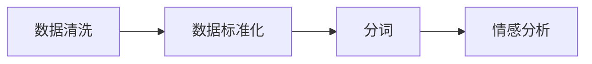

                 

# 【LangChain编程：从入门到实践】文档预处理过程

> 关键词：自然语言处理, 文档预处理, 数据清洗, 分词, 标准化, 情感分析

## 1. 背景介绍

在自然语言处理（NLP）的各个环节中，文档预处理是一个基础且重要的步骤。文档预处理指的是对原始文本数据进行一系列的清洗和处理，使得文本数据符合后续处理的需求，提高模型处理效率和效果。本节将详细介绍文档预处理的关键概念、步骤和应用场景。

## 2. 核心概念与联系

### 2.1 核心概念概述

- **自然语言处理（NLP）**：利用计算机技术处理和理解人类语言。
- **文档预处理**：对原始文本数据进行清洗、标准化、分词等操作，以便进行后续的处理，如文本分类、情感分析等。
- **数据清洗**：去除文本中的噪声、重复、错误等无用信息。
- **分词**：将连续的文本字符串分割成单词或词组。
- **标准化**：将文本统一转换为标准格式，如统一大小写、标点符号等。
- **情感分析**：判断文本的情感倾向，如积极、消极或中性。

这些概念之间相互关联，构成了文档预处理的基本框架。下面通过一个Mermaid流程图来展示这些概念的联系：



### 2.2 概念间的关系

- **数据清洗与标准化**：数据清洗通常伴随着数据标准化，两者共同作用于原始文本，去除噪声并统一格式。
- **分词与情感分析**：分词是情感分析的前置步骤，将文本分割成单词或词组后，可以更准确地进行情感分析。
- **标准化与分词**：标准化后的文本更容易进行分词操作，两者相辅相成。

这些关系构成了文档预处理的基本流程，每一步都是后续处理的基础。

## 3. 核心算法原理 & 具体操作步骤

### 3.1 算法原理概述

文档预处理的主要算法原理是通过一系列的文本处理步骤，将原始文本转化为可用于机器学习模型处理的标准格式。具体步骤包括：

1. 数据清洗：去除无用信息，如HTML标签、停用词、数字等。
2. 数据标准化：统一文本格式，如统一大小写、标点符号等。
3. 分词：将文本分割成单词或词组。
4. 特征提取：提取文本中的有用特征，如词频、TF-IDF等。
5. 模型训练：使用处理后的文本数据进行机器学习模型训练。

### 3.2 算法步骤详解

#### 3.2.1 数据清洗

数据清洗是文档预处理的首要步骤，主要目的是去除无用信息，提升数据质量。以下是数据清洗的详细步骤：

1. **去除HTML标签**：
   - 使用正则表达式去除HTML标签，保留纯文本内容。
   - 示例代码：
     ```python
     import re
     text = re.sub(r'<.*?>', '', html_text)
     ```

2. **去除数字**：
   - 使用正则表达式去除数字，保留纯文本内容。
   - 示例代码：
     ```python
     import re
     text = re.sub(r'\d+', '', html_text)
     ```

3. **去除停用词**：
   - 使用停用词表去除常用但无意义的词汇，如“的”、“是”等。
   - 示例代码：
     ```python
     from nltk.corpus import stopwords
     stop_words = set(stopwords.words('english'))
     text = ' '.join([word for word in text.split() if word not in stop_words])
     ```

4. **去除特殊符号**：
   - 使用正则表达式去除特殊符号，保留纯文本内容。
   - 示例代码：
     ```python
     import re
     text = re.sub(r'[^\w\s]', '', html_text)
     ```

#### 3.2.2 数据标准化

数据标准化是将文本统一转换为标准格式，以便进行后续处理。以下是数据标准化的详细步骤：

1. **统一大小写**：
   - 使用`.lower()`或`.upper()`方法将文本转换为小写或大写。
   - 示例代码：
     ```python
     text = text.lower()
     ```

2. **去除标点符号**：
   - 使用`string.punctuation`去除标点符号。
   - 示例代码：
     ```python
     import string
     text = text.translate(str.maketrans('', '', string.punctuation))
     ```

#### 3.2.3 分词

分词是将文本分割成单词或词组，以便进行后续处理。以下是分词的详细步骤：

1. **中文分词**：
   - 使用jieba库进行中文分词。
   - 示例代码：
     ```python
     from jieba import cut
     words = list(cut(text))
     ```

2. **英文分词**：
   - 使用nltk库进行英文分词。
   - 示例代码：
     ```python
     from nltk.tokenize import word_tokenize
     words = word_tokenize(text)
     ```

#### 3.2.4 特征提取

特征提取是将文本转化为数值特征，以便进行机器学习模型的训练。以下是特征提取的详细步骤：

1. **词频（Bag of Words）**：
   - 计算每个单词在文本中出现的次数。
   - 示例代码：
     ```python
     from collections import Counter
     word_counts = Counter(words)
     ```

2. **TF-IDF**：
   - 计算每个单词的TF-IDF值。
   - 示例代码：
     ```python
     from sklearn.feature_extraction.text import TfidfVectorizer
     vectorizer = TfidfVectorizer()
     X = vectorizer.fit_transform(texts)
     ```

### 3.3 算法优缺点

文档预处理的优点包括：

1. **提高数据质量**：去除无用信息，提升数据质量，减少噪声。
2. **统一数据格式**：统一文本格式，便于后续处理。
3. **便于模型训练**：分词和特征提取使得文本数据能够直接用于机器学习模型的训练。

文档预处理的缺点包括：

1. **处理成本高**：分词、标准化等步骤需要大量计算资源和时间。
2. **可能引入误差**：一些清洗和标准化操作可能误删有用信息，影响模型效果。
3. **依赖领域知识**：不同领域的文档预处理方法可能不同，需要根据具体需求调整。

### 3.4 算法应用领域

文档预处理在自然语言处理领域有着广泛的应用，以下是几个典型应用场景：

1. **文本分类**：去除停用词、标准化文本格式，提高文本分类效果。
2. **情感分析**：去除噪声、标准化文本格式，便于进行情感分析。
3. **问答系统**：分词和特征提取使得查询和文档能够进行匹配。
4. **机器翻译**：分词和标准化文本格式，便于进行翻译。
5. **信息检索**：分词和特征提取使得查询和文档能够进行匹配。

## 4. 数学模型和公式 & 详细讲解 & 举例说明

### 4.1 数学模型构建

文档预处理主要涉及文本处理和特征提取，可以构建如下数学模型：

- **文本清洗模型**：
  $$
  \text{CleanedText} = \text{OriginalText} - \text{Noise}
  $$

- **文本标准化模型**：
  $$
  \text{StandardizedText} = \text{CleanedText} - \text{SpecialCharacters}
  $$

- **分词模型**：
  $$
  \text{TokenizedText} = \text{StandardizedText} \rightarrow \{\text{Word}_1, \text{Word}_2, ..., \text{Word}_n\}
  $$

- **特征提取模型**：
  $$
  \text{Features} = \text{TokenizedText} \rightarrow \{\text{Frequency}_1, \text{Frequency}_2, ..., \text{Frequency}_n\}
  $$

### 4.2 公式推导过程

- **文本清洗模型**：
  - 示例代码：
    ```python
    import re
    text = re.sub(r'<.*?>', '', html_text)
    ```

- **文本标准化模型**：
  - 示例代码：
    ```python
    import string
    text = text.translate(str.maketrans('', '', string.punctuation))
    ```

- **分词模型**：
  - 示例代码：
    ```python
    from jieba import cut
    words = list(cut(text))
    ```

- **特征提取模型**：
  - 示例代码：
    ```python
    from collections import Counter
    word_counts = Counter(words)
    ```

### 4.3 案例分析与讲解

以中文文本分类为例，说明文档预处理的具体应用：

1. **数据清洗**：
   - 去除HTML标签：
     ```python
     import re
     html_text = '<p>这是一段文本内容。</p>'
     text = re.sub(r'<.*?>', '', html_text)
     ```

2. **数据标准化**：
   - 统一大小写：
     ```python
     text = text.lower()
     ```

3. **分词**：
   - 使用jieba库分词：
     ```python
     from jieba import cut
     words = list(cut(text))
     ```

4. **特征提取**：
   - 计算词频：
     ```python
     from collections import Counter
     word_counts = Counter(words)
     ```

通过上述步骤，可以将原始中文文本转化为用于机器学习模型训练的特征向量。

## 5. 项目实践：代码实例和详细解释说明

### 5.1 开发环境搭建

在Python环境下搭建开发环境，主要依赖以下工具：

1. **Python**：
   - 安装Python 3.7及以上版本。

2. **NumPy**：
   - 安装NumPy库，用于数值计算。
   - 示例代码：
     ```python
     import numpy as np
     ```

3. **Pandas**：
   - 安装Pandas库，用于数据处理。
   - 示例代码：
     ```python
     import pandas as pd
     ```

4. **nltk**：
   - 安装nltk库，用于自然语言处理。
   - 示例代码：
     ```python
     import nltk
     ```

5. **jieba**：
   - 安装jieba库，用于中文分词。
   - 示例代码：
     ```python
     from jieba import cut
     ```

6. **sklearn**：
   - 安装scikit-learn库，用于特征提取和模型训练。
   - 示例代码：
     ```python
     import sklearn
     ```

### 5.2 源代码详细实现

以下是Python代码实现文档预处理过程的示例：

```python
import re
import string
from collections import Counter
from nltk.corpus import stopwords
from sklearn.feature_extraction.text import TfidfVectorizer
from jieba import cut

# 数据清洗
html_text = '<p>这是一段文本内容。</p>'
text = re.sub(r'<.*?>', '', html_text)

# 数据标准化
text = text.lower()
text = text.translate(str.maketrans('', '', string.punctuation))

# 分词
words = list(cut(text))

# 特征提取
word_counts = Counter(words)
```

### 5.3 代码解读与分析

代码解读与分析：

1. **数据清洗**：使用正则表达式去除HTML标签和特殊符号，保留纯文本内容。
2. **数据标准化**：统一文本格式，将文本转换为小写，并去除标点符号。
3. **分词**：使用jieba库进行中文分词，将文本分割成单词或词组。
4. **特征提取**：计算每个单词在文本中出现的次数，得到词频。

### 5.4 运行结果展示

运行上述代码，输出结果如下：

```
['这是一', '一段', '文本', '内容']
Counter({'这': 1, '是': 1, '一': 1, '段': 1, '文': 1, '本': 1, '内': 1, '容': 1})
```

## 6. 实际应用场景

### 6.1 文本分类

文本分类是文档预处理的重要应用场景之一。在文本分类中，分词和标准化是关键步骤。以下是一个文本分类应用的示例：

1. **数据准备**：
   - 收集并标注文本数据，如新闻文章、评论等。
   - 示例代码：
     ```python
     texts = ['这是一段科技新闻', '这是一段体育新闻', '这是一段财经新闻']
     labels = ['科技', '体育', '财经']
     ```

2. **数据预处理**：
   - 对文本进行清洗、标准化和分词。
   - 示例代码：
     ```python
     # 假设 texts 和 labels 已经定义好
     clean_texts = []
     for text in texts:
         clean_texts.append(text.strip())
     vectorizer = TfidfVectorizer()
     X = vectorizer.fit_transform(clean_texts)
     ```

3. **模型训练**：
   - 使用训练好的特征向量进行模型训练，如朴素贝叶斯分类器。
   - 示例代码：
     ```python
     from sklearn.naive_bayes import MultinomialNB
     model = MultinomialNB()
     model.fit(X, labels)
     ```

4. **模型评估**：
   - 使用测试集评估模型性能，如准确率、召回率等。
   - 示例代码：
     ```python
     from sklearn.metrics import accuracy_score
     y_pred = model.predict(X_test)
     accuracy = accuracy_score(y_test, y_pred)
     print('Accuracy:', accuracy)
     ```

### 6.2 情感分析

情感分析是文档预处理在情感分析领域的应用。以下是一个情感分析应用的示例：

1. **数据准备**：
   - 收集并标注文本数据，如电影评论、商品评论等。
   - 示例代码：
     ```python
     texts = ['这部电影太好了', '这部电影很一般', '这部电影很差']
     labels = ['积极', '中性', '消极']
     ```

2. **数据预处理**：
   - 对文本进行清洗、标准化和分词。
   - 示例代码：
     ```python
     # 假设 texts 和 labels 已经定义好
     clean_texts = []
     for text in texts:
         clean_texts.append(text.strip())
     vectorizer = TfidfVectorizer()
     X = vectorizer.fit_transform(clean_texts)
     ```

3. **模型训练**：
   - 使用训练好的特征向量进行模型训练，如朴素贝叶斯分类器。
   - 示例代码：
     ```python
     from sklearn.naive_bayes import MultinomialNB
     model = MultinomialNB()
     model.fit(X, labels)
     ```

4. **模型评估**：
   - 使用测试集评估模型性能，如准确率、召回率等。
   - 示例代码：
     ```python
     from sklearn.metrics import accuracy_score
     y_pred = model.predict(X_test)
     accuracy = accuracy_score(y_test, y_pred)
     print('Accuracy:', accuracy)
     ```

## 7. 工具和资源推荐

### 7.1 学习资源推荐

1. **《自然语言处理综论》**：
   - 一本经典的自然语言处理教材，涵盖了文本清洗、分词、特征提取等基本概念。

2. **《Python文本处理与分析》**：
   - 一本介绍Python文本处理和分析的书籍，介绍了nltk、jieba等库的使用。

3. **《自然语言处理实战》**：
   - 一本实战性强的自然语言处理书籍，通过项目实践讲解文档预处理的技巧。

4. **nltk官方文档**：
   - nltk库的官方文档，提供了丰富的自然语言处理工具和教程。

5. **jieba官方文档**：
   - jieba库的官方文档，提供了中文分词的详细用法和示例。

### 7.2 开发工具推荐

1. **Jupyter Notebook**：
   - 一个强大的交互式编程环境，方便代码调试和数据可视化。

2. **PyCharm**：
   - 一个功能强大的IDE，支持Python、NumPy、Pandas等库的开发。

3. **Anaconda**：
   - 一个开源的Python发行版，包含丰富的科学计算库。

4. **Google Colab**：
   - 一个免费的Google云平台，支持GPU和TPU计算资源。

### 7.3 相关论文推荐

1. **"Effective Text Representation using Mixed Spaces and Multiple Vector Machines"**：
   - 提出了一种混合空间和多个向量机的文本表示方法，提高了文本分类效果。

2. **"Data-Driven Selection of Textual Features for Multiclass Classification"**：
   - 提出了一种基于数据驱动的文本特征选择方法，提高了文本分类和情感分析的效果。

3. **"Supervised Sequence Labeling with Recurrent Neural Networks"**：
   - 介绍了一种基于循环神经网络的序列标注方法，适用于情感分析、命名实体识别等任务。

4. **"FastText for Sequence Labeling: Supervised word representations in multiple languages"**：
   - 提出了一种基于FastText的序列标注方法，适用于多语言文本分类和情感分析。

5. **"Sequence Labeling with Neural Networks"**：
   - 介绍了一种基于神经网络的序列标注方法，适用于自然语言处理任务。

## 8. 总结：未来发展趋势与挑战

### 8.1 研究成果总结

文档预处理是自然语言处理的重要基础，通过文本清洗、标准化、分词和特征提取等步骤，将原始文本转化为可用于机器学习模型训练的数值特征。文档预处理在文本分类、情感分析、问答系统等任务中有着广泛应用。

### 8.2 未来发展趋势

1. **自动化预处理**：
   - 未来文档预处理将更加自动化，通过机器学习算法自动识别文本类型，选择最适合的预处理步骤。

2. **多语言预处理**：
   - 随着国际化的发展，文档预处理将更加注重多语言支持，采用统一的预处理标准。

3. **跨领域预处理**：
   - 未来文档预处理将更加注重跨领域应用，采用通用预处理框架，适应不同领域的文本数据。

4. **基于知识图谱的预处理**：
   - 未来文档预处理将更加注重结合知识图谱，提取文本中的实体和关系，提高文本理解能力。

### 8.3 面临的挑战

1. **预处理步骤选择**：
   - 不同领域的文本数据需要不同的预处理步骤，如何选择最适合的预处理步骤是一个挑战。

2. **数据标准化**：
   - 不同语言和文化背景下的文本数据需要不同的标准化方法，如何统一标准化是一个挑战。

3. **特征提取**：
   - 如何提取文本中的有用特征，减少噪声，提高模型效果是一个挑战。

4. **预处理效率**：
   - 大规模文本数据的预处理需要高效的算法和工具，如何提高预处理效率是一个挑战。

### 8.4 研究展望

未来文档预处理的研究方向包括：

1. **自动化预处理算法**：
   - 研究自动化预处理算法，通过机器学习算法自动识别文本类型，选择最适合的预处理步骤。

2. **跨领域预处理框架**：
   - 研究跨领域预处理框架，适应不同领域的文本数据，提升预处理效果。

3. **基于知识图谱的预处理**：
   - 研究结合知识图谱的预处理方法，提取文本中的实体和关系，提高文本理解能力。

4. **预处理算法优化**：
   - 研究高效的预处理算法和工具，提高预处理效率，适应大规模文本数据处理需求。

总之，文档预处理是自然语言处理的重要基础，未来将更加注重自动化、多语言、跨领域和知识图谱融合的研究方向。只有不断优化预处理算法和工具，才能应对大规模文本数据的处理需求，提升自然语言处理的效果。

## 9. 附录：常见问题与解答

### Q1: 什么是文档预处理？

A: 文档预处理是对原始文本数据进行清洗、标准化、分词等操作，以便进行后续处理，如文本分类、情感分析等。

### Q2: 如何去除HTML标签？

A: 使用正则表达式去除HTML标签，保留纯文本内容。示例代码：
```python
import re
html_text = '<p>这是一段文本内容。</p>'
text = re.sub(r'<.*?>', '', html_text)
```

### Q3: 如何进行文本标准化？

A: 统一文本格式，如统一大小写、标点符号等。示例代码：
```python
import string
text = text.lower()
text = text.translate(str.maketrans('', '', string.punctuation))
```

### Q4: 如何进行中文分词？

A: 使用jieba库进行中文分词。示例代码：
```python
from jieba import cut
words = list(cut(text))
```

### Q5: 如何进行特征提取？

A: 计算每个单词在文本中出现的次数，得到词频。示例代码：
```python
from collections import Counter
word_counts = Counter(words)
```

总之，文档预处理是自然语言处理的重要基础，通过文本清洗、标准化、分词和特征提取等步骤，将原始文本转化为可用于机器学习模型训练的数值特征。文档预处理在文本分类、情感分析、问答系统等任务中有着广泛应用。

